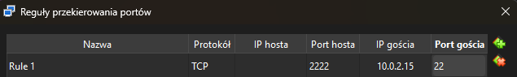
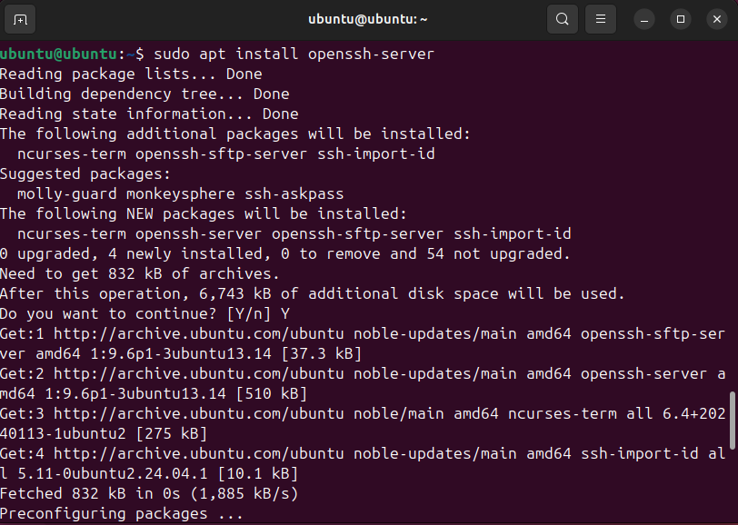
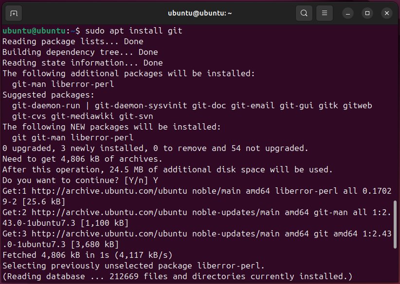
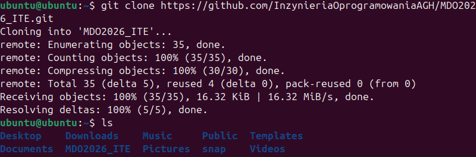
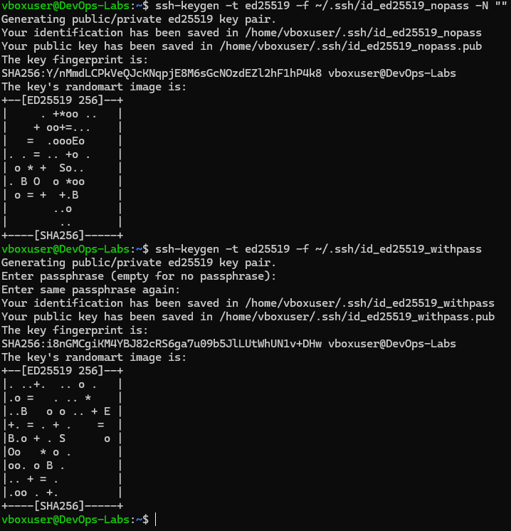

# Sprawozdanie 1
**Autor:** Filip Pyrek
**Indeks:** 422032

## 1. Środowisko i połączenie
Pracę zacząłem od przygotowania maszyny wirtualnej z Ubuntu Server na VirtualBoxie. Żeby połączyć się z serwerem z Windowsa, ustawiłem przekierowanie portu 2222 na port 22 w ustawieniach sieci NAT.

Do pracy używałem Visual Studio Code z dodatkiem Remote-SSH, dzięki czemu mogłem pisać komendy i edytować pliki bezpośrednio na Ubuntu.

## 2. Instalacja Gita i pierwsze klonowanie
Na Ubuntu zainstalowałem niezbędne narzędzia: serwer SSH oraz klienta Git.

Pierwsze klonowanie repozytorium zrobiłem przez HTTPS, używając adresu z GitHub.

## 3. Konfiguracja kluczy SSH
Żeby bezpiecznie łączyć się z GitHubem bez wpisywania haseł, wygenerowałem dwa klucze ED25519 komendą `ssh-keygen`. Klucz `id_ed25519_nopass` zostawiłem bez hasła.

Następnie dodałem klucz publiczny do ustawień swojego konta na GitHubie, aby serwer mógł mnie rozpoznawać.

## 4. Rozwiązanie problemu z logowaniem (SSH Config)
W folderze `~/.ssh/` na Ubuntu stworzyłem plik o nazwie `config`. Wpisałem tam dane serwera oraz wskazałem ścieżkę do mojego klucza bez hasła, który wcześniej dodałem do GitHuba.

Dzięki temu plikowi oraz zmianie adresu zdalnego repozytorium na SSH, komenda `git push` zaczęła działać bez żadnych problemów.

## 5. Skrypt Git Hook i testy
W folderze `.git/hooks/` przygotowałem skrypt `commit-msg`. Jego zadaniem jest sprawdzanie, czy każda wiadomość w commit zaczyna się od mojego indeksu (422032). 

Na poniższym zrzucie widać test: pierwsza próba bez indeksu została zablokowana przez skrypt, a druga z poprawnym opisem "FP422032: ..." przeszła bez problemu.

## Informacja o użyciu AI

1. **Przekierowanie portów**:
   - **Zapytanie**: "Jak połączyć się z Ubuntu przez SSH z Windowsa, jeśli używam VirtualBox i sieci NAT?"
   - **Weryfikacja**: Ustawiłem regułę przekierowania portu 2222 w VirtualBox i sprawdziłem, czy terminal VS Code faktycznie połączy się z maszyną.
2. **Plik SSH config**:
   - **Zapytanie**: "Jak zrobić, żeby Git sam wiedział, którego klucza SSH użyć do logowania?"
   - **Weryfikacja**: Zrobiłem to, co zasugerowało AI (plik config) i sprawdziłem, że komenda `git push` przeszła od razu bez problemu, co było wcześniej niemożliwe.
