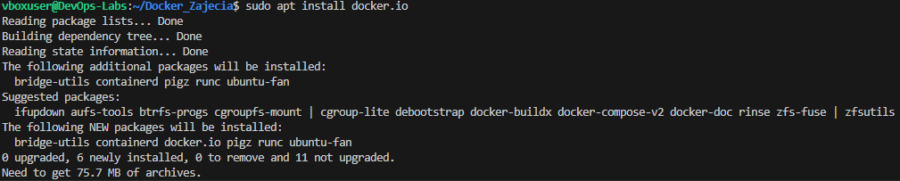
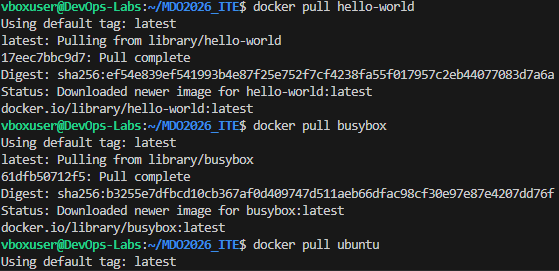
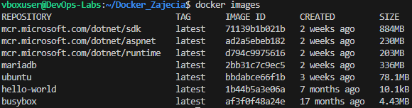
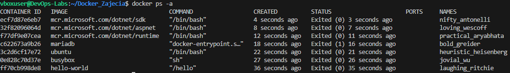
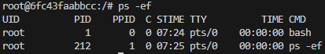
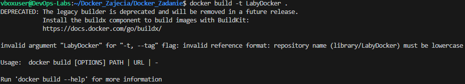
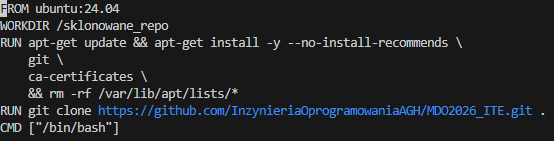
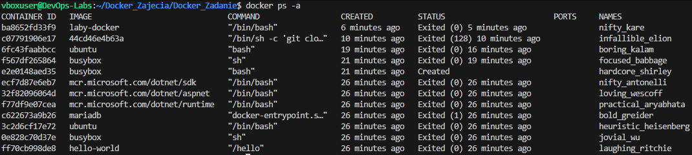
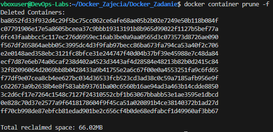

# Sprawozdanie 2: Git i Docker
**Autor:** Filip Pyrek
**Indeks:** 422032

## 1. Instalacja środowiska skonteneryzowanego
Zainstalowałem Dockera w systemie Ubuntu bezpośrednio z repozytorium dystrybucji. Użyłem polecenia `sudo apt install docker.io`.

Natępnie zalogowałem się do swojego konta na Docker Hub.

## 2. Analiza obrazów i kodów wyjścia
Pobrałem i uruchomiłem serię wskazanych obrazów: `hello-world`, `busybox`, `ubuntu`, `mariadb` oraz obrazy .NET (`runtime`, `aspnet`, `sdk`). 

Poleceniem `docker ps -a` zweryfikowałem kody wyjścia (STATUS). Kontenery narzędziowe i testowe zakończyły się poprawnie `Exited (0)`, natomiast `mariadb` zwróciła błąd `Exited (1)` ze względu na brak wymaganych zmiennych środowiskowych przy uruchomieniu.

Przetestowałem również interaktywne wejście do minimalistycznego kontenera `busybox` (wykorzystującego powłokę `sh`).

## 3. System w kontenerze i izolacja PID
Uruchomiłem kontener z obrazem `ubuntu` w trybie interaktywnym. Sprawdziłem procesy – główny proces powłoki bash otrzymał wewnątrz kontenera PID 1. Zaktualizowałem również pakiety systemowe.

Sprawdzenie tego samego procesu na maszynie hosta pokazywało, że ten proces posiadał standardowy numer PID 22783.

## 4. Budowa własnego obrazu (Dockerfile)
Stworzyłem `Dockerfile` bazujący na obrazie `ubuntu:24.04`, instalujący pakiet `git` i klonujący wskazane repozytorium z GitHuba.

Podczas budowania obrazu napotkałem na dwa błędy, które na bieżąco poprawiłem:
1. **Nazewnictwo:** Zmiana nazwy tagu z `LabyDocker` na małe litery `laby-docker`.
   
2. **Certyfikaty:** Kontener nie mógł zweryfikować połączenia z GitHubem (kod błędu 128). Dodałem instalację pakietu `ca-certificates`.
   

Po poprawkach obraz zbudował się pomyślnie, a repozytorium zostało pobrane do wewnątrz obrazu.

## 5. Przegląd historii kontenerów
Poleceniem `docker ps -a` wyświetliłem wszystkie uruchomione i zakończone kontenery. Widać tam m.in. błędy z etapu budowania (`Exited (128)`) oraz pomyślnie zakończone procesy własnego obrazu i testowanego wcześniej `busyboxa`.

## 6. Czyszczenie środowiska (Kontenery i Obrazy)
Aby utrzymać porządek w systemie hosta, po zakończeniu pracy wyczyściłem zatrzymane kontenery oraz nieużywane obrazy pobrane do lokalnego magazynu.

Do usunięcia wszystkich nieaktywnych kontenerów (o statusie Exited) użyłem polecenia `docker container prune`. 

Następnie usunąłem obrazy przechowywane w lokalnym magazynie poleceniem `docker rmi <nazwy_obrazów>`, uwalniając miejsce na dysku.

## Informacja o użyciu AI

1. **Brak konieczności używania `sudo` przy Dockerze**:
   - **Zapytanie**: "Jak skonfigurować system, żeby nie musieć pisać `sudo` przed każdą komendą Dockera?"
   - **Weryfikacja**: AI podpowiedziało użycie komendy `sudo usermod -aG docker $USER`, wyjaśniając, że dodaje ona aktualnie zalogowanego użytkownika (zmienna `$USER`) do grupy systemowej `docker`. Po zapoznaniu się z komendą usermod i wykonaniu jej. Zrestartowałem sesję i polecenia takie jak `docker ps` działały poprawnie z poziomu mojego zwykłego konta, bez wywoływania uprawnień roota.