# Sprawozdanie Laboratorium 8: Automatyzacja i wdrożenie aplikacji za pomocą Ansible

**Autor:** Piotr Drożyński

---

## 1. Wstęp: Czym jest Ansible i co chcemy osiągnąć?

W nowoczesnym wytwarzaniu oprogramowania nie konfiguruje się serwerów ręcznie. Zamiast tego używa się narzędzi typu **Infrastructure as Code** (Infrastruktura jako Kod). Jednym z nich jest **Ansible**.

**Cel:**
Mamy dwie maszyny. Pierwsza to „Dyrygent” (**Orchestrator**), a druga to „Wykonawca” (**Target**). Chcemy, aby Dyrygent automatycznie wysłał na drugą maszynę naszą aplikację, zainstalował potrzebne programy i sprawdził, czy wszystko działa – bez naszej ręcznej ingerencji na maszynie docelowej.

---

## 2. Przygotowanie maszyn (Adresowanie i Nazewnictwo)

Zaczynamy od tego, aby maszyny mogły się „rozpoznać”. Zamiast operować na adresach IP (np. 192.168.1.2), nadajemy maszynom czytelne nazwy.

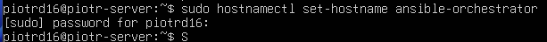
*Nadanie nazwy "ansible-orchestrator" głównej maszynie.*

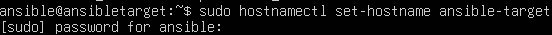
*Przygotowanie maszyny docelowej "ansible-target".*

Aby nazwy działały w sieci lokalnej, edytujemy plik `/etc/hosts`.

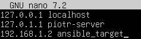
*Powiązanie adresu IP z nazwą maszyny docelowej.*

---

## 3. Bezpieczne połączenie bez haseł (SSH)

Ansible steruje innymi komputerami przez protokół SSH. Aby proces był w pełni automatyczny, maszyny muszą sobie ufać na tyle, by nie prosić nas o hasło przy każdym poleceniu.
Generujemy „cyfrowy klucz”. Klucz publiczny wysyłamy na maszynę docelową. Od teraz Dyrygent może wejść na serwer Wykonawcy tak, jakby miał własne klucze do drzwi.

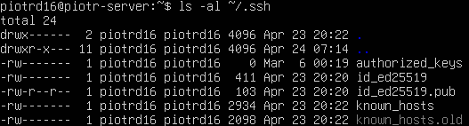
*Sprawdzenie, czy na naszej maszynie są już wygenerowane klucze bezpieczeństwa.*

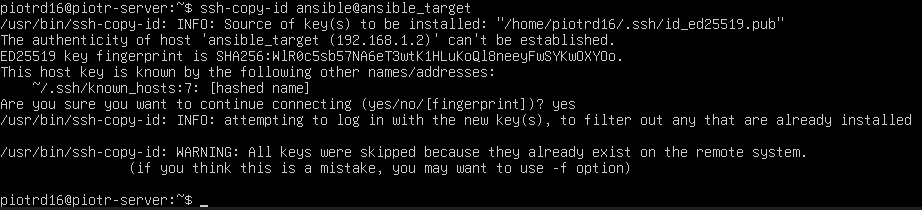
*Przekazanie klucza publicznego na maszynę docelową.*

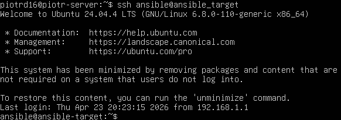
*Test: Logujemy się na drugą maszynę i system nie pyta nas o hasło. Sukces.*

---

## 4. Inwentaryzacja

Musimy stworzyć listę maszyn, którymi Ansible ma zarządzać. Robi się to w pliku `hosts.ini`.

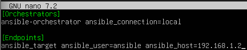
*Podział maszyn na grupy: Orchestrators (sterujące) i Endpoints (docelowe).*

Weryfikujemy, czy Ansible „widzi” te maszyny poleceniem `ping`.

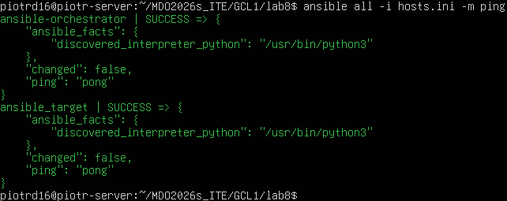
*Jeśli widzimy "pong" na zielono, oznacza to, że komunikacja działa wzorowo.*

---

## 5. Automatyzacja – Zadania systemowe

Zanim wgramy naszą aplikację, musimy przygotować serwer. Służy do tego playbook `system_setup.yml`.

**Co robi ten skrypt?**
* Aktualizuje system.
* Kopiuje pliki konfiguracyjne.
* Restartuje usługi bezpieczeństwa (SSH).

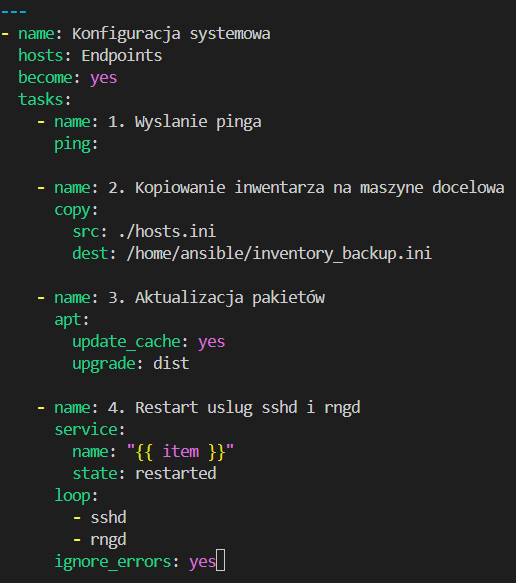
*Playbook z listą zadań administracyjnych.*

---

## 6. Rola i Wdrożenie Artefaktu

Zgodnie z profesjonalnymi standardami, instrukcje wdrożenia zamknęliśmy w tzw. **Roli**. Pozwala to na łatwe powtarzanie tego samego procesu na wielu serwerach naraz.

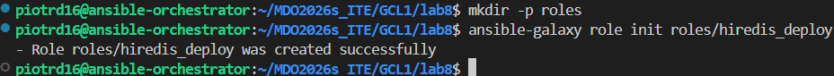
*Tworzenie folderów dla roli "hiredis_deploy".*

Aby wszystko działo się automatycznie, musieliśmy rozwiązać problem uprawnień. Niektóre zadania wymagają „konta administratora” (Root). Skonfigurowaliśmy serwer tak, by ufał komendom Ansible bez pytania o hasło administratora.

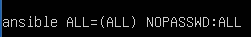
*Konfiguracja uprawnień NOPASSWD*

### Co dzieje się podczas wdrożenia?

Poniższy kod to mózg całej operacji. Ansible wykonuje te kroki po kolei:
1.  Instaluje Dockera (izolowane środowisko dla aplikacji).
2.  Przesyła bibliotekę `hiredis` (nasz artefakt z Lab 7).
3.  Kompiluje program testowy.
4.  Uruchamia bazę danych Redis.
5.  Sprawdza, czy aplikacja potrafi „rozmawiać” z bazą.

```yaml
---
- name: 1. Kopiowanie inwentarza na węzeł docelowy
  copy:
    src: hosts.ini
    dest: /home/ansible/hosts_backup.ini

- name: 2. Aktualizacja pakietów (Update i Upgrade)
  apt:
    update_cache: yes
    upgrade: safe

- name: 3. Restart usług SSH (z zapewnieniem bezpieczeństwa)
  service:
    name: ssh
    state: restarted
  ignore_errors: yes

- name: 4. Instalacja silnika Docker i kompilatora GCC
  apt:
    name: [docker.io, python3-docker, build-essential, libhiredis-dev]
    state: present

- name: 5. Start usługi Docker (silnik aplikacji)
  service:
    name: docker
    state: started
    enabled: yes

- name: 6. Stworzenie folderu na naszą aplikację
  file:
    path: /opt/hiredis_app
    state: directory
    mode: '0755'

- name: 7. Transfer biblioteki (.tar.gz) i kodu źródłowego (.c)
  copy:
    src: "{{ item }}"
    dest: "/opt/hiredis_app/"
  loop:
    - "hiredis-v1.0-b7-PD420765.tar.gz"
    - "sample.c"

- name: 8. Rozpakowanie przesłanej biblioteki
  unarchive:
    src: "/opt/hiredis_app/hiredis-v1.0-b7-PD420765.tar.gz"
    dest: "/opt/hiredis_app/"
    remote_src: yes

- name: 9. Kompilacja: zamiana kodu tekstowego na program binarny
  shell:
    cmd: "gcc sample.c -o hiredis_test -L. -lhiredis -I/usr/local/include/hiredis"
    chdir: /opt/hiredis_app

- name: 10. Naprawa linkowania bibliotek (Symlink)
  file:
    src: "/opt/hiredis_app/libhiredis.so"
    dest: "/opt/hiredis_app/libhiredis.so.1.3.0"
    state: link

- name: 11. Konfiguracja "lokalnego adresu" dla bazy Redis
  lineinfile:
    path: /etc/hosts
    line: "127.0.0.1 redis-server"
    state: present

- name: 12. Uruchomienie bazy danych Redis w Dockerze
  docker_container:
    name: redis-server-lab8
    image: redis:alpine
    state: started
    network_mode: host

- name: 13. TEST KOŃCOWY: Uruchomienie aplikacji
  shell:
    cmd: "export LD_LIBRARY_PATH=/opt/hiredis_app && ./hiredis_test"
    chdir: /opt/hiredis_app
  register: app_output

- name: 14. Sprawdzenie wyniku (Czy odpowiedź to PONG?)
  debug:
    msg: "Wynik z serwera: {{ app_output.stdout }}"
  failed_when: "'PONG' not in app_output.stdout"
```

## 8. Wykonanie i wyniki (Sanity Check)

Główny proces automatyzacji został wywołany z maszyny sterującej za pomocą poniższego polecenia:

ansible-playbook -i hosts.ini site.yml

Podczas pracy Ansible przeszedł przez wszystkie zdefiniowane etapy. Warto zauważyć, że w zadaniu nr 3 wystąpił błąd przy próbie restartu usługi rng-tools (wynikający z braku tej specyficznej usługi na systemie Ubuntu 24.04). Dzięki zastosowaniu instrukcji ignore_errors: yes, proces nie został przerwany, co pozwoliło na skuteczne przejście do kluczowej części, czyli wdrożenia aplikacji.

Najważniejszym dowodem poprawności wdrożenia jest wynik zadania nr 14 (Sanity Check). Ansible połączył się z bazą danych uruchomioną w Dockerze i odebrał od niej sygnał zwrotny, co potwierdziło, że cała infrastruktura „rozmawia” ze sobą prawidłowo.

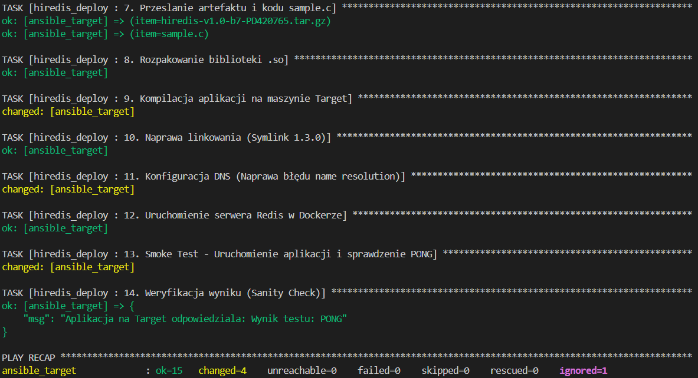
*Raport z terminala*

**Interpretacja wyniku widocznego na zrzucie ekranu:**
* **ok=15**: Wszystkie zadania konfiguracyjne i testowe zostały pomyślnie przetworzone.
* **changed=4**: Ansible wprowadził trwałe zmiany na serwerze docelowym (np. przesłał pliki, stworzył linki do bibliotek i dodał wpisy w konfiguracji DNS).
* **ignored=1**: System poprawnie zidentyfikował brak usługi rng-tools i zgodnie z instrukcją pominął ten błąd, kontynuując pracę.
* **PONG**: To finalny dowód sukcesu. Oznacza, że nasza biblioteka hiredis została poprawnie zbudowana przez Jenkinsa, przesłana przez Ansible, skompilowana na nowym serwerze i ostatecznie nawiązała połączenie z bazą danych.

---

# Sprawozdanie z laboratorium 9: Automatyzacja instalacji systemu Fedora i wdrożenie aplikacji

## 1. Cel laboratorium
Celem zadania była automatyzacja procesu instalacji systemu operacyjnego Fedora z wykorzystaniem plików Kickstart (ks.cfg) oraz zdalna konfiguracja środowiska wykonawczego dla aplikacji w języku C, integrującej się z bazą Redis.

## 2. Konfiguracja środowiska
* Serwer dystrybucyjny: Host z systemem Windows, udostępniający pliki konfiguracyjne (ks.cfg) oraz źródła aplikacji przez protokół HTTP (Python http.server na porcie 8000).
* Klient: Maszyna wirtualna VirtualBox (Fedora Linux 40) z uruchomionym instalatorem w trybie tekstowym z automatycznym pobieraniem konfiguracji przez sieć.

## 3. Plik konfiguracyjny Kickstart (ks.cfg)

```text
lang pl_PL.UTF-8
keyboard pl
timezone Europe/Warsaw --utc
rootpw --plaintext haslo123
text

network --bootproto=dhcp --device=link --activate --hostname=fedora-lab9

clearpart --all --initlabel
part /boot/efi --fstype="efi" --size=200
part / --fstype="ext4" --size=15000
part swap --fstype="swap" --size=2048

reboot

%packages
@^minimal-environment
gcc
make
hiredis-devel
wget
tar
%end

%post --log=/root/ks-post.log
WINDOWS_IP="192.168.1.1"
PORT="8000"
BASE_URL="http://$WINDOWS_IP:$PORT"

wget --no-check-certificate $BASE_URL/sample.c -O /root/sample.c
wget --no-check-certificate $BASE_URL/hiredis-v1.0-b7-PD420765.tar.gz -O /root/hiredis.tar.gz

gcc /root/sample.c -o /usr/local/bin/my_app -lhiredis
chmod +x /usr/local/bin/my_app

cat <<EOF > /etc/systemd/system/moj-program.service
[Unit]
Description=Moj program z lab9
After=network.target

[Service]
ExecStart=/usr/local/bin/my_app
Restart=always

[Install]
WantedBy=multi-user.target
EOF

systemctl enable moj-program.service
%end
```

## 4. Przebieg realizacji
1.  Przygotowanie serwera: Uruchomiono serwer HTTP na maszynie hosta w folderze D:\LAB9.
2.  Automatyzacja instalacji: Uruchomiono maszynę wirtualną z przekazaniem parametru inst.ks=[http://192.168.1.1:8000/ks.cfg](http://192.168.1.1:8000/ks.cfg). Proces partycjonowania oraz instalacji przebiegł automatycznie.
3.  Wdrożenie aplikacji: Po zakończeniu instalacji system automatycznie pobrał pliki źródłowe, przeprowadził kompilację oraz zarejestrował usługę moj-program.service w systemie systemd.
4.  Weryfikacja: Po zalogowaniu do systemu zweryfikowano poprawność komunikacji aplikacji z usługą Redis.

## 5. Dokumentacja wizualna

W folderze lab9/screenshots/ znajdują się następujące zrzuty ekranu:

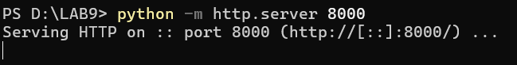
*Rys. 1: Uruchomiony serwer plików na hoście.*

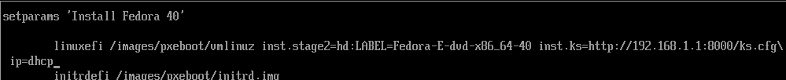
*Rys. 2: Uruchomienie instalatora Fedory.*

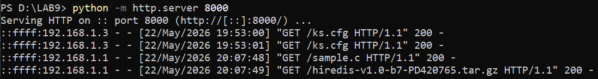
*Rys. 3: Potwierdzenie pobrania plików przez maszynę wirtualną.*

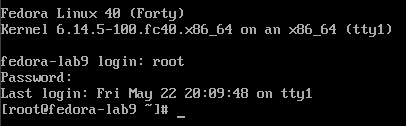
*Rys. 4: Pomyślne zalogowanie do zainstalowanego systemu.*

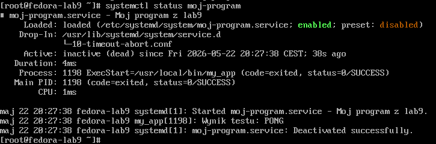
*Rys. 5: Potwierdzenie poprawnego działania aplikacji (wynik: PONG).*

---

# Sprawozdanie z Laboratorium 10
## Temat: Wdrażanie na zarządzalne kontenery – Kubernetes

---

### 1. Instalacja i uruchomienie klastra Kubernetes

Czynności rozpoczęto od uruchomienia lokalnego klastra Kubernetes za pomocą narzędzia Minikube z wykorzystaniem sterownika Dockera (--driver=docker). Krok ten pozwala na emulację pełnoprawnego węzła Kubernetes wewnątrz izolowanego środowiska kontenerowego, co mityguje wysokie wymagania sprzętowe klasycznej instalacji produkcyjnej.

Po zainicjowaniu klastra zweryfikowano status węzłów roboczych poleceniem:
```bash
kubectl get nodes
```
Węzeł sterujący (control-plane) osiągnął status Ready, co potwierdza pełną gotowość środowiska do przyjmowania zadań.

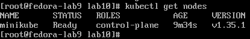

Następnie uruchomiono systemowy panel graficzny Kubernetes Dashboard, służący do wizualizacji stanu aplikacji i zasobów klastra za pomocą komendy:
```bash
minikube dashboard --url
```
Polecenie to wystawiło dedykowany proxy serwer API klastra, umożliwiając bezpieczną łączność z poziomu przeglądarki internetowej hosta.

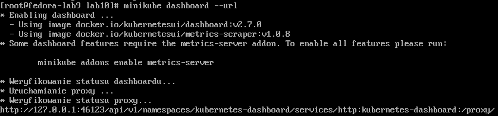

---

### 2. Manualne uruchomienie i analiza kontenera

W celu zapoznania się z podstawową jednostką obliczeniową klastra, jaką jest Pod, przeprowadzono wdrożenie imperatywne (manualne). Wykorzystano stabilny, lekki obraz nginx:1.25-alpine.

```bash
kubectl run moj-nginx-pod --image=nginx:1.25-alpine --port=80 --labels app=moj-nginx-pod
```
Służący do testów Pod został pomyślnie powołany do życia w przestrzeni klastra.

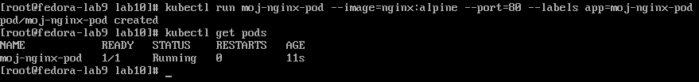

Ponieważ Pod domyślnie posiada adres IP dostępny tylko wewnątrz sieci klastra, zastosowano mechanizm przekierowania portów (port-forward), aby uzyskać dostęp do aplikacji z poziomu systemu operacyjnego hosta:
```bash
kubectl port-forward pod/moj-nginx-pod 8080:80 --address 0.0.0.0
```
Weryfikacja działania serwera WWW została wykonana za pomocą narzędzia curl skierowanego na lokalny punkt końcowy. Wynik polecenia zwrócił poprawny nagłówek kodu HTML (Welcome to nginx!), co udowodniło komunikację sieciową.

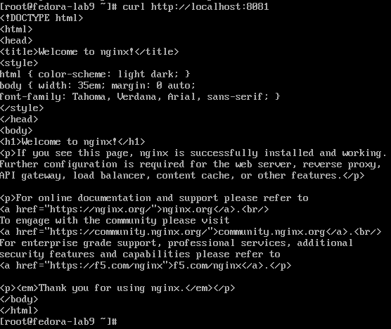

---

### 3. Deklaratywne wdrażanie za pomocą plików YAML (Wersja I)

Podejście manualne zastąpiono profesjonalnym podejściem deklaratywnym typu Infrastruktura jako Kod (IaC). W tym celu stworzono plik konfiguracyjny deployment.yaml realizujący cel postawienia kontrolera Deployment zarządzającego automatycznie 4 replikami aplikacji.

#### Plik: deployment.yaml (Wersja z 4 replikami)
```yaml
apiVersion: apps/v1
kind: Deployment
metadata:
  name: nginx-deployment
  labels:
    app: nginx
spec:
  replicas: 4
  selector:
    matchLabels:
      app: nginx
  template:
    metadata:
      labels:
        app: nginx
    spec:
      containers:
      - name: nginx
        image: nginx:1.25-alpine
        ports:
        - containerPort: 80
```
Wdrożenie konfiguracji z pliku zrealizowano kluczową komendą:

```bash
kubectl apply -f deployment.yaml
```

Kontroler replikacji Kubernetesa wykrył różnicę stanu i natychmiastowo utworzył dokładnie 4 niezależne Pody, dbając o ich wysoką dostępność.

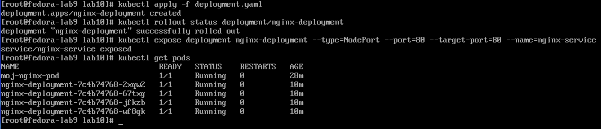

---

### 4. Dynamiczne skalowanie i zarządzanie zasobami

Przetestowano elastyczność i skalowalność klastra „w locie” (bez przerywania ciągłości działania aplikacji). Wykonano sekwencyjną zmianę liczby replik za pomocą instrukcji kubectl scale:

1.  Skalowanie w górę do 8 replik (zwiększenie wydajności pod ruch masowy).
2.  Redukcja do 1 repliki (minimalizacja kosztów infrastruktury).
3.  Całkowite wygaszenie zasobów do 0 replik (zawieszenie działania aplikacji).
4.  Powrót do stabilnego stanu docelowego 4 replik.

```bash
kubectl scale deployment/nginx-deployment --replicas=8
kubectl scale deployment/nginx-deployment --replicas=1
kubectl scale deployment/nginx-deployment --replicas=0
kubectl scale deployment/nginx-deployment --replicas=4
```

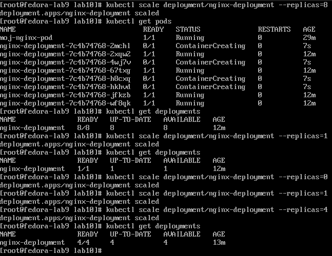

---

### 5. Aktualizacja wdrożenia i obsługa awarii (Rollback)

Jedną z najważniejszych cech klastra Kubernetes jest automatyczna ochrona przed błędami ludzkimi podczas aktualizacji aplikacji. W celu prezentacji tej funkcji zasymulowano awarię poprzez próbę wdrożenia nieistniejącego w repozytorium, wadliwego obrazu kontenera:

```bash
kubectl set image deployment/nginx-deployment nginx=nginx:wersja-z-bledem-999
```

Weryfikacja stanu podów natychmiast wykazała błąd krytyczny ImagePullBackOff oraz ErrImagePull. Cluster zidentyfikował brak możliwości pobrania oprogramowania i wstrzymał proces aktualizacji, chroniąc stare, działające pody przed usunięciem.

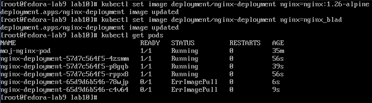

W celu natychmiastowego przywrócenia pełnej sprawności operacyjnej systemu, wykonano wycofanie ostatniej nieudanej transakcji (operacja Rollback):

```bash
kubectl rollout undo deployment/nginx-deployment
```

System automatycznie powrócił do ostatniej zapamiętanej w historii, stabilnej konfiguracji, co przywróciło status wszystkich podów do flagi Running.

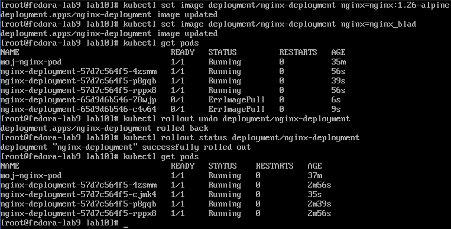

---

### 6. Kontrola wdrożenia – Skrypt Weryfikacyjny

Zgodnie z wymaganiami technicznymi przygotowano skrypt powłoki Bash o nazwie verify.sh. Jego zadaniem jest automatyczna kontrola stanu wdrożenia i weryfikacja, czy pody uruchomiły się poprawnie w zadanym oknie czasowym wynoszącym maksymalnie 60 sekund.

#### Plik: verify.sh

```bash
#!/bin/bash
echo "Rozpoczynam automatyczną weryfikację statusu wdrożenia..."
kubectl rollout status deployment/nginx-deployment --timeout=60s
```

Skrypt nadano uprawnienia wykonywalne (chmod +x verify.sh) i uruchomiono. Wynik działania skryptu jednoznacznie potwierdził sukces operacji wdrożeniowej (komunikat successfully rolled out).

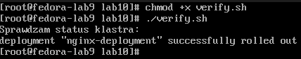

---

### 7. Zaawansowane strategie wdrożeń (Wersja II pliku YAML)

W ostatniej fazie laboratorium zmodyfikowano strategię aktualizacji aplikacji. Domyślną konfigurację rozszerzono o strategię RollingUpdate (aktualizacja krocząca). Pozwala ona na bezprzerwowe (Zero-Downtime) podmienianie kontenerów na nowsze wersje przy zachowaniu rygorystycznych limitów bezpieczeństwa zasobów.

#### Plik: deployment.yaml (Wersja II ze strategią RollingUpdate)
```yaml
apiVersion: apps/v1
kind: Deployment
metadata:
  name: nginx-deployment
  labels:
    app: nginx
spec:
  replicas: 4
  strategy:
    type: RollingUpdate
    rollingUpdate:
      maxUnavailable: 2
      maxSurge: 25%
  selector:
    matchLabels:
      app: nginx
  template:
    metadata:
      labels:
        app: nginx
    spec:
      containers:
      - name: nginx
        image: nginx:1.25-alpine
        ports:
        - containerPort: 80
```

Wyjaśnienie parametrów strategii:
* maxUnavailable: 2 – informuje klastry, że podczas aktualizacji maksymalnie 2 pody z 4 mogą być jednocześnie niedostępne. Gwarantuje to zachowanie minimum 50% wydajności aplikacji w trakcie rolloutu.
* maxSurge: 25% – określa, że Kubernetes może stworzyć tymczasowo maksymalnie 25% (czyli 1 dodatkowy pod ponad stan 4 replik) nowych kontenerów w trakcie trwania procesu wymiany.

Plik został pomyślnie zaaplikowany do systemu (deployment.apps/nginx-deployment configured), co stanowi końcowe, pełne wykonanie założeń projektowych laboratorium.

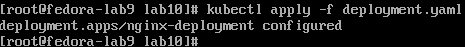

---

# Sprawozdanie: Wdrażanie na kontenery - Kubernetes (Lab 11)

## 1. Wstęp
Celem laboratorium było praktyczne zapoznanie się z mechanizmami orkiestracji kontenerów w środowisku Kubernetes. Zadanie obejmowało wdrożenie aplikacji w formie Deploymentu, ekspozycję usług za pomocą obiektów Service (zarówno za pomocą CLI, jak i plików deklaratywnych) oraz przeprowadzenie operacji skalowania.

## 2. Przebieg prac i wdrożenie
Ze względu na izolację środowiska laboratoryjnego (brak dostępu do zewnętrznych rejestrów obrazów, takich jak Docker Hub), wdrożenie przeprowadzono z wykorzystaniem lokalnie dostępnego obrazu `nginx` (ID: 501d84f5d064). W celu uniknięcia błędów `ImagePullBackOff`, w pliku konfiguracyjnym Deploymentu ustawiono `imagePullPolicy: Never`.

### Plik konfiguracyjny (web-deployment.yaml)
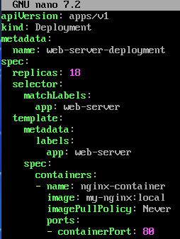

### Status wdrożonych podów
Po zastosowaniu konfiguracji, pody zostały poprawnie uruchomione:
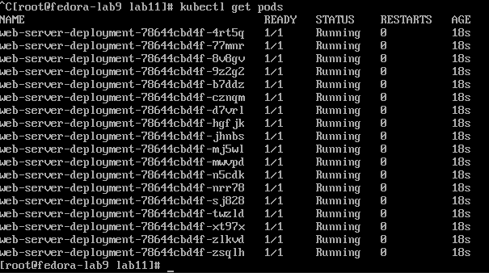

## 3. Ekspozycja serwisu
W ramach zadania wyeksponowano dostęp do web-serwera na dwa sposoby:

1.  **Polecenie CLI:** `kubectl expose deployment web-server-deployment --type=NodePort --name=web-service`
2.  **Plik YAML:** Zastosowano dodatkową deklarację typu Service.

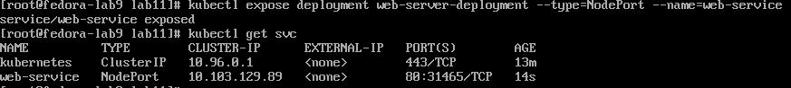
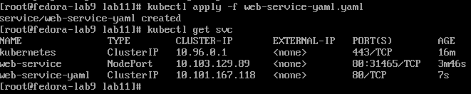

Weryfikacja dostępu do serwera została przeprowadzona za pomocą mechanizmu `port-forward`:
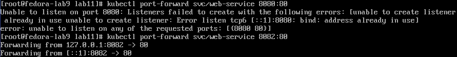
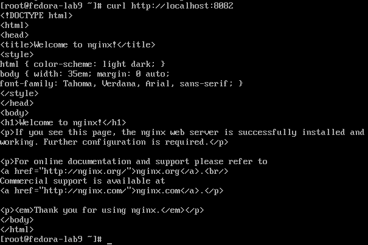

## 4. Skalowanie klastra
Przetestowano elastyczność klastra poprzez zmianę liczby replik:

* **Skalowanie za pomocą komendy `scale`:**
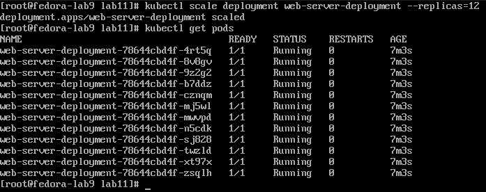
* **Skalowanie przez edycję pliku YAML:**
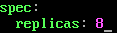
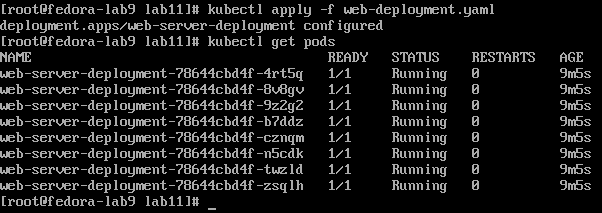

---

## Wnioski końcowe
Zastosowanie mechanizmu Kickstart znacząco przyspiesza proces wdrażania nowych instancji systemu operacyjnego (jak w przypadku Fedory), zapewniając powtarzalność i eliminację błędów ręcznej konfiguracji poprzez automatyzację w sekcji `%post`. Z kolei narzędzia do orkiestracji kontenerów, takie jak platforma Kubernetes, gwarantują niezawodne zarządzanie aplikacjami. Deklaratywne wdrażanie za pomocą plików YAML pozwala utrzymać odpowiedni stan replik podów, a mechanizmy takie jak RollingUpdate czy Rollback zapewniają bezpieczeństwo ciągłości działania na poziomie środowisk produkcyjnych. Zdolność do elastycznego, dynamicznego skalowania eliminuje zjawisko przeciążeń infrastruktury, a w środowiskach typu air-gapped sprawne zarządzanie lokalnymi obrazami gwarantuje bezproblemowe uruchamianie instancji bez konieczności wychodzenia na zewnątrz sieci. Podsumowując, możliwości wbudowanej ekspozycji serwisów ułatwiają szybkie wystawienie zasobów sieciowych, zarówno na poziomie doraźnych poleceń CLI, jak i za pośrednictwem bezpiecznego zarządzania poprzez wdrożenia deklaratywne.
