# Sprawozdanie z Laboratorium 5,6, i 7
**Autor:** Piotr Drożyński

---

## 1. Instalacja i Konfiguracja Środowiska Jenkins

Celem etapu było uruchomienie skonteneryzowanego Jenkinsa z dostępem do gniazda Dockera hosta, co umożliwia budowanie obrazów wewnątrz potoków CI/CD.

**Definicja obrazu Jenkinsa**
Przygotowano Dockerfile instalujący klienta Docker oraz wtyczkę Blue Ocean.
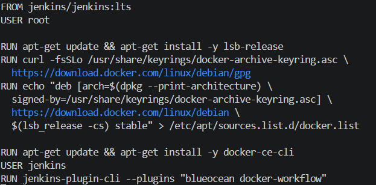

**Orkiestracja kontenera**
Konfiguracja Docker Compose z podmontowaniem gniazda `/var/run/docker.sock`.
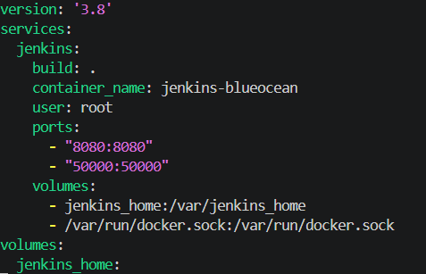

**Inicjalizacja i hasło administratora**
Odczytanie hasła startowego z logów kontenera w celu odblokowania panelu.

**Konfiguracja użytkownika i URL**
Proces tworzenia konta administratora oraz finalne zatwierdzenie adresu instancji.
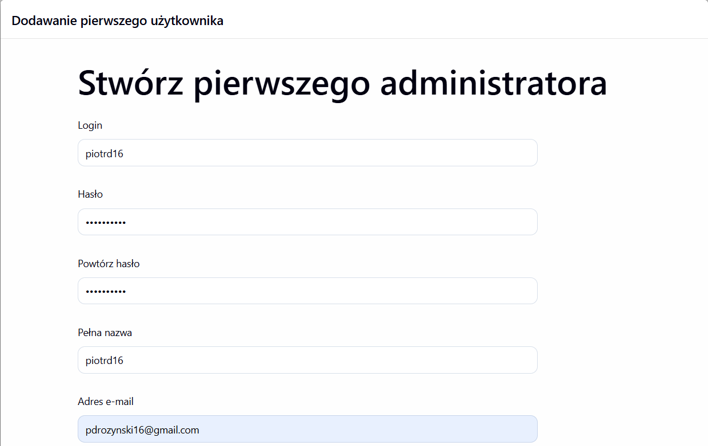
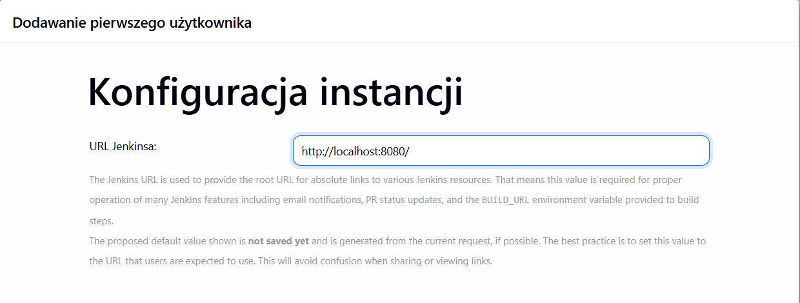

---

## 2. Zadania Wstępne

Przed budową potoków Pipeline, przetestowano podstawowe możliwości Jenkinsa na prostych zadaniach.

**Zadanie 2.1: Identyfikacja systemu (uname)**
Konfiguracja prostego kroku shell, który wywołuje polecenie `uname -a`.
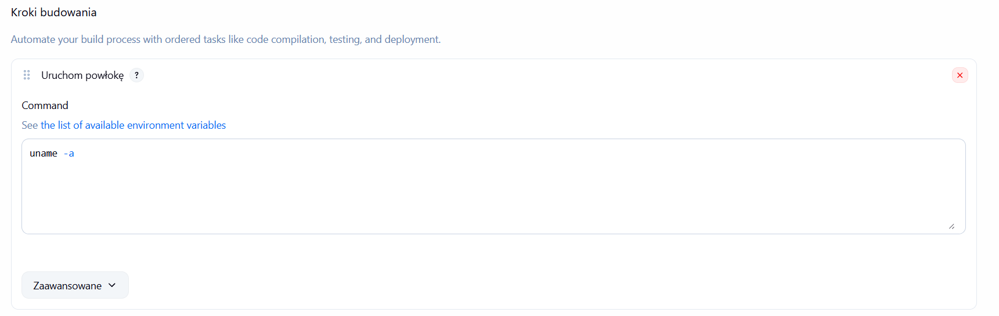

**Wynik uname**
Podgląd konsoli Jenkinsa, wykazujący poprawną identyfikację jądra systemu Linux, na którym pracuje serwer.
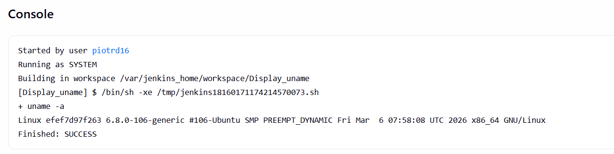

**Zadanie 2.2: Test logiki (Godzina nieparzysta)**
Skrypt Bash weryfikujący aktualną godzinę. Jeśli jest nieparzysta, skrypt zwraca `exit 1`, co Jenkins interpretuje jako błąd zadania.
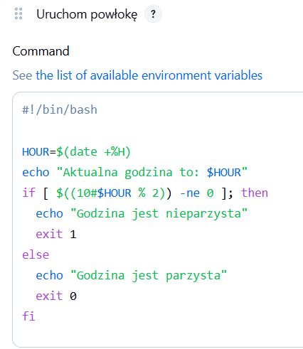

**Wynik testu godziny**
Przykładowy wynik, gdzie build zakończył się niepowodzeniem (status FAILURE), ponieważ godzina była nieparzysta (07:00).
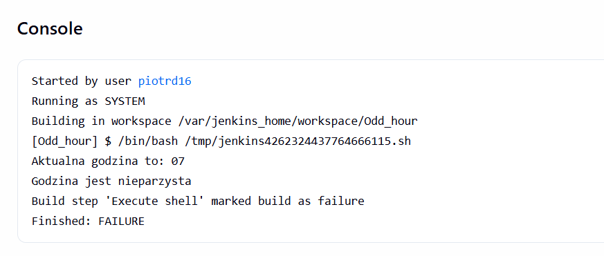

**Zadanie 2.3: Komunikacja z Dockerem**
Projekt wykonujący polecenie `docker pull`. Ma na celu udowodnienie, że Jenkins ma uprawnienia do pobierania obrazów z Docker Hub.
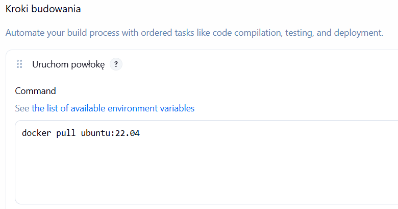

**Pobieranie obrazu Ubuntu**
Logi konsoli potwierdzające pomyślne pobranie warstw obrazu Ubuntu na maszynę wirtualną.
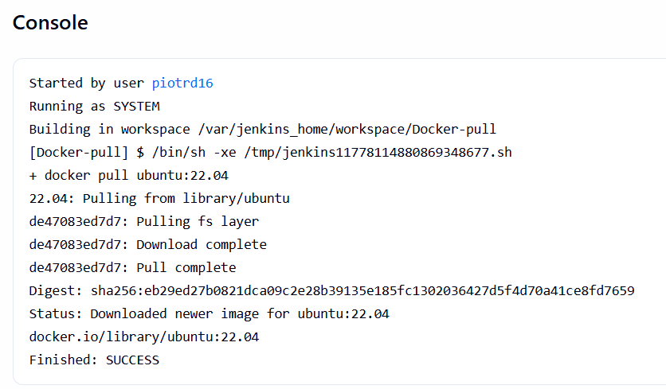

---

## 3. Implementacja Obiektu typu Pipeline

Głównym zadaniem było stworzenie zautomatyzowanego potoku dla projektu **hiredis**, który przeprowadzi proces od pobrania kodu po publikację artefaktu.

**Konfiguracja obiektu Pipeline**
Utworzenie nowego projektu i wybór typu Pipeline w interfejsie Jenkins.
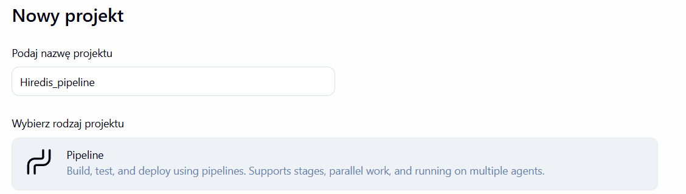

**Definicja Jenkinsfile (Skrypt potoku)**
Zaimplementowano skrypt pipeline'u, dzielący pracę na etapy: Checkout, Build, Test oraz Publish.
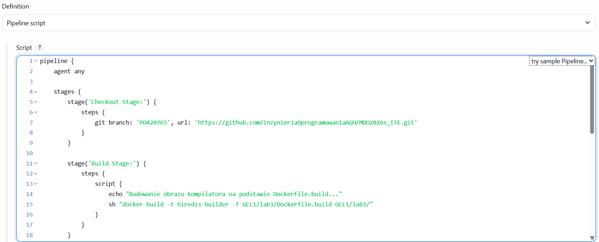
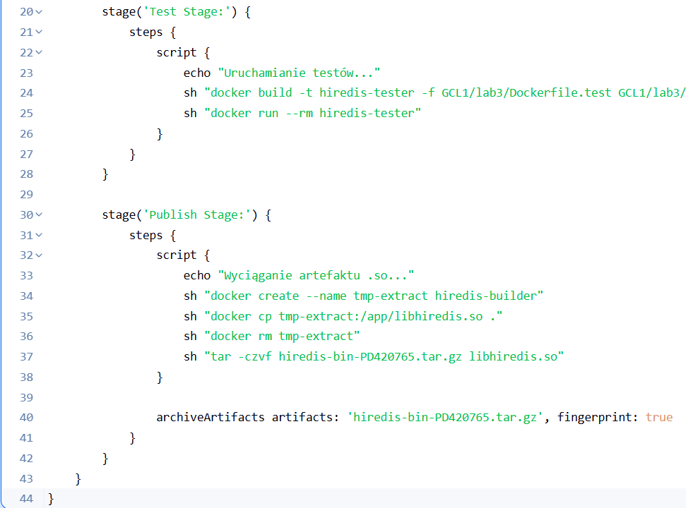

**Wizualizacja sukcesu w Blue Ocean**
Pomyślne przejście wszystkich etapów potoku.
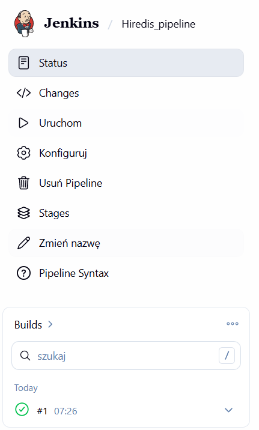

---

## 4. Analiza i Modelowanie Procesu

**Zadanie 4.1: Sekwencja CI/CD**
Proces przebiega według następującej logiki:
1. **Collect**: Jenkins pobiera kod z GitHuba (gałąź `PD420765`).
2. **Build**: Wywołanie `docker build`, kompilacja źródeł C przez GCC wewnątrz kontenera.
3. **Test**: Uruchomienie kontenera z bazą Redis i wykonanie `make check`.
4. **Report/Publish**: Jeśli testy przejdą pomyślnie, Jenkins wyodrębnia plik `libhiredis.so`, pakuje go do `.tar.gz` i archiwizuje jako gotowy artefakt.

**Zadanie 4.2. Diagram Wdrożeniowy (Deployment Diagram)**
1. **Node: Host Machine (Ubuntu VM)**:
   - a) **Docker Engine**: Zarządza cyklem życia wszystkich kontenerów.
   - b) **Container: Jenkins Blue Ocean**: Serwer CI/CD sterujący procesem przez `/var/run/docker.sock`.
2. **Dynamic Containers**:
   - a) **hiredis-builder**: Kontener z narzędziami `build-essential`.
   - b) **hiredis-tester**: Kontener z `redis-server` i skompilowaną biblioteką.
3. **Artifact Storage**: System plików Jenkinsa przechowujący paczki `.tar.gz`.
