# Sprawozdanie z Laboratoriów DevOps (5, 6 i 7)
**Autor:** Piotr Drożyński
**System:** Ubuntu Server 24.04 LTS / Jenkins Blue Ocean

---

## 1. Instalacja i Konfiguracja Środowiska Jenkins

Celem etapu było uruchomienie skonteneryzowanego Jenkinsa z dostępem do gniazda Dockera hosta, co umożliwia budowanie obrazów wewnątrz potoków CI/CD (model Docker-out-of-Docker).

**Definicja obrazu Jenkinsa**  
Przygotowano Dockerfile instalujący klienta Docker oraz wtyczkę Blue Ocean.  


**Orkiestracja kontenera**  
Konfiguracja Docker Compose z podmontowaniem gniazda `/var/run/docker.sock`.  


**Inicjalizacja i hasło administratora**  
Odczytanie hasła startowego z logów kontenera w celu odblokowania panelu.  
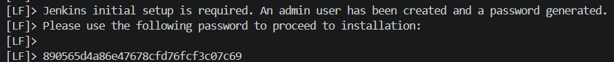  
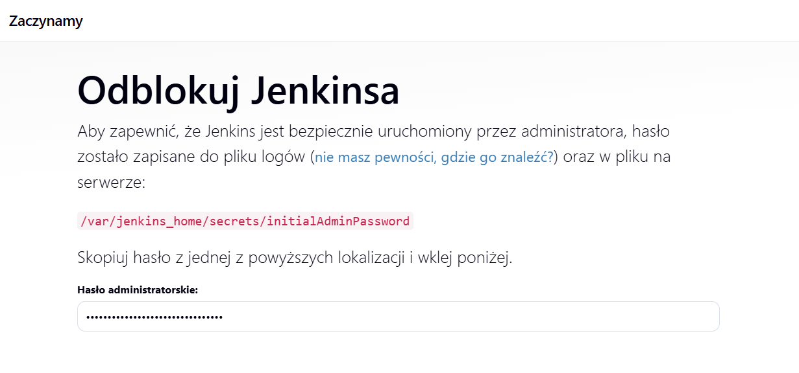

**Konfiguracja użytkownika i URL**  
Proces tworzenia konta administratora oraz finalne zatwierdzenie adresu instancji.  
  


---

## 2. Zadania Wstępne (Freestyle Projects)

Przed budową potoków Pipeline, przetestowano podstawowe możliwości Jenkinsa na prostych zadaniach typu "Freestyle".

**Zadanie 2.1: Identyfikacja systemu (uname)**  
Konfiguracja prostego kroku shell, który wywołuje polecenie `uname -a`.  


**Wynik uname**  
Podgląd konsoli Jenkinsa, wykazujący poprawną identyfikację jądra systemu Linux.  


**Zadanie 2.2: Test logiki (Godzina nieparzysta)**  
Skrypt Bash weryfikujący aktualną godzinę. Jeśli jest nieparzysta, skrypt zwraca `exit 1`, co Jenkins interpretuje jako błąd.  


**Wynik testu godziny**  
Build zakończony statusem FAILURE, zgodnie z założeniem przy nieparzystej godzinie.  


**Zadanie 2.3: Komunikacja z Dockerem**  
Projekt wykonujący polecenie `docker pull` w celu udowodnienia uprawnień Jenkinsa do silnika Docker.  


**Pobieranie obrazu Ubuntu**  
Logi konsoli potwierdzające pomyślne pobranie warstw obrazu z Docker Hub.  


---

## 3. Implementacja Potoku Pipeline (Lab 5 i 6)

Głównym zadaniem było stworzenie zautomatyzowanego potoku "Pipeline as Code" dla projektu **hiredis**, realizującego pełny test integracyjny.

### 3.1. Konfiguracja i Kod Pipeline
Utworzono nowy projekt typu Pipeline i zaimplementowano skrypt w języku Groovy.


### 3.2. Kod aplikacji testowej (sample.c)
Zgodnie ze schematem weryfikacyjnym, przygotowano kod konsumujący bibliotekę:

```c
#include <stdio.h>
#include <hiredis/hiredis.h>

int main() {
    redisContext *c = redisConnect("redis-server", 6379);
    if (c == NULL || c->err) {
        printf("Błąd połączenia: %s\n", c ? c->errstr : "Błąd alokacji");
        return 1;
    }
    redisReply *reply = redisCommand(c, "PING");
    printf("Wynik testu: %s\n", reply->str); 
    freeReplyObject(reply);
    redisFree(c);
    return 0;
}
```
### 3.3. Realizacja Testu Integracyjnego (Schemat C1 + C2)

Zgodnie z wytycznymi, przeprowadzono test weryfikujący poprawność działania biblioteki w interakcji z zewnętrzną usługą bazodanową.

**Przebieg testu:**
1. **Kontener C1 (Redis Server)**: Uruchomiony jako "serce" testu w dedykowanej sieci `hiredis-network`.
2. **Kontener C2 (Integration Client)**: Kontener bazujący na obrazie budującym, do którego dynamicznie wstrzyknięto kod aplikacji testowej `sample.c` przy użyciu komendy `docker cp`.
3. **Kompilacja i Rejestracja**: Wewnątrz C2 wykonano procedurę `make install` oraz `ldconfig`, aby biblioteka `libhiredis.so` była widoczna globalnie w systemie, a następnie skompilowano kod klienta.
4. **Weryfikacja**: Program połączył się z serwerem Redis (C1), wysłał zapytanie i odebrał wynik.

**Dowód pomyślnej komunikacji (Logi):**
W logach konsoli odnotowano odpowiedź serwera: **`Wynik testu: PONG`**. Potwierdza to, że biblioteka została poprawnie zbudowana, a potok CI/CD poprawnie weryfikuje integrację między usługami.


---

## 4. Analiza i Modelowanie Procesu

### 4.1. Sekwencja CI/CD (Diagram Aktywności)

Diagram przedstawia logikę potoku od pobrania kodu po archiwizację artefaktu.

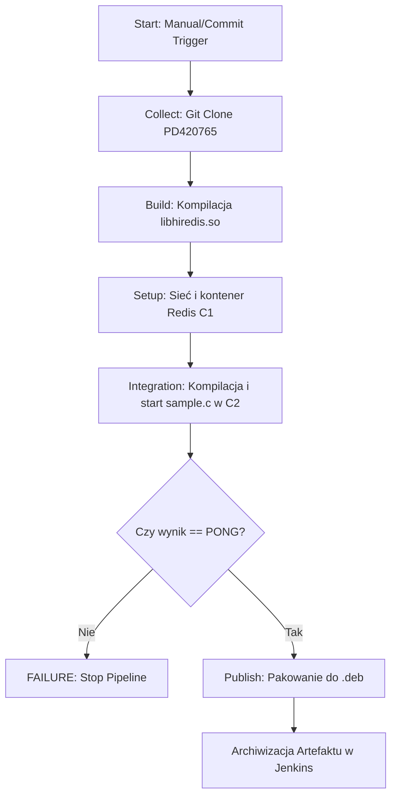
### 4.2. Diagram Wdrożeniowy (Deployment Diagram)

Poniższy diagram ilustruje architekturę rozwiązania w modelu **DIND (Docker-out-of-Docker)**, gdzie Jenkins zarządza kontenerami testowymi poprzez gniazdo systemowe hosta.

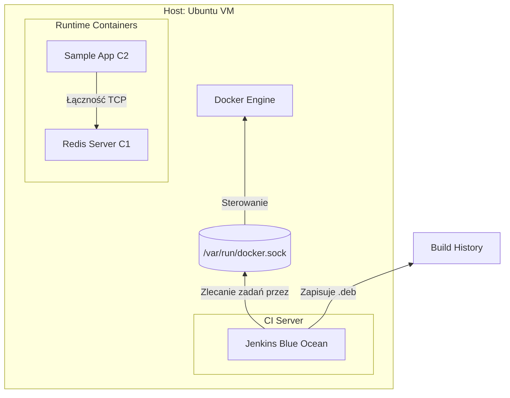

---

## 5. Laboratorium 7: Jenkinsfile SCM i Przygotowanie Ansible

Celem tego etapu było pełne przejście na model **Infrastructure as Code (IaC)**, gdzie proces budowania jest częścią repozytorium, oraz przygotowanie środowiska pod automatyzację Ansible.

### 5.1. Infrastruktura jako Kod (Jenkinsfile z SCM)
Zgodnie z listą kontrolną, skrypt potoku został usunięty z ustawień Jenkinsa i umieszczony w pliku `Jenkinsfile` w głównym katalogu repozytorium. Jenkins został skonfigurowany w trybie **Pipeline script from SCM**.

**Pełna treść deklaratywnego pliku Jenkinsfile:**

```groovy
pipeline {
    agent any
    
    environment {
        NET_NAME = "hiredis-net-${BUILD_NUMBER}"
    }

    stages {
        stage('1. Cleanup') {
            steps {
                sh "docker rm -f redis-server-${BUILD_NUMBER} integration-client-${BUILD_NUMBER} || true"
                sh "docker network rm ${NET_NAME} || true"
            }
        }

        stage('2. Build Library') {
            steps {
                sh "docker build -t hiredis-builder:${BUILD_NUMBER} -f GCL1/lab3/Dockerfile.build GCL1/lab3/"
            }
        }

        stage('3. Integration Test') {
            steps {
                script {
                    sh "docker network create ${NET_NAME}"
                    sh "docker run -d --name redis-server-${BUILD_NUMBER} --network ${NET_NAME} --network-alias redis-server redis:alpine"
                    sh "docker run -d --name integration-client-${BUILD_NUMBER} --network ${NET_NAME} hiredis-builder:${BUILD_NUMBER} sleep 300"
                    
                    try {
                        sh "docker cp GCL1/lab5/sample.c integration-client-${BUILD_NUMBER}:/sample.c"
                        sh """
                        docker exec integration-client-${BUILD_NUMBER} bash -c '
                            cd /app && make install && ldconfig && \
                            gcc /sample.c -o /app/test_app -lhiredis -I/usr/local/include/hiredis && \
                            /app/test_app
                        '
                        """
                        echo "Sukces: Test integracyjny C1 + C2 zakończony pomyślnie!"
                    } finally {
                        sh "docker rm -f redis-server-${BUILD_NUMBER} integration-client-${BUILD_NUMBER} || true"
                        sh "docker network rm ${NET_NAME} || true"
                    }
                }
            }
        }

        stage('4. Publish Artefact') {
            steps {
                script {
                    sh "docker create --name extract-${BUILD_NUMBER} hiredis-builder:${BUILD_NUMBER}"
                    sh "docker cp extract-${BUILD_NUMBER}:/app/libhiredis.so ."
                    sh "docker rm extract-${BUILD_NUMBER}"
                    sh "tar -czvf hiredis-v1.0-b${BUILD_NUMBER}-PD420765.tar.gz libhiredis.so"
                    
                    archiveArtifacts artifacts: '*.tar.gz', fingerprint: true
                }
            }
        }
    }

    post {
        always {
            sh "docker rmi hiredis-builder:${BUILD_NUMBER} || true"
        }
    }
}
```

**Weryfikacja pomyślnego odczytu i wykonania (Build #7):**
Jak wynika z logów konsoli, Jenkins pomyślnie pobrał definicję potoku z GitHuba (`Obtained Jenkinsfile from git`). Zapewniono również unikalność zasobów poprzez wykorzystanie zmiennej `${BUILD_NUMBER}` w nazwach sieci i kontenerów.

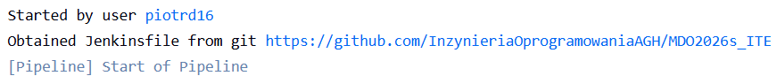

**Dowód pomyślnej integracji i publikacji:**
W etapie *Integration Test* odnotowano pomyślną komunikację z bazą danych:
```text
Wynik testu: PONG
[Pipeline] echo
Test integracyjny C1 + C2 zakończony pomyślnie!
```
W etapie *Publish* przygotowano finalny artefakt `hiredis-v1.0-b7-PD420765.tar.gz`, który został zarchiwizowany w systemie Jenkins i przypisany do historii konkretnego wykonania.

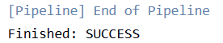

### 5.2. Instalacja i weryfikacja Ansible
Na głównej maszynie wirtualnej zainstalowano oprogramowanie Ansible. Narzędzie to posłuży do bezagentowego zarządzania infrastrukturą i automatycznego wdrażania artefaktów na węzły docelowe.

**Potwierdzenie instalacji Ansible na maszynie głównej:**
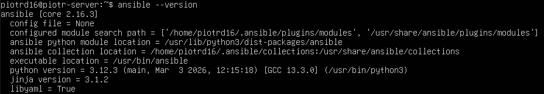

### 5.3. Przygotowanie węzła docelowego (ansible-target)
Utworzono drugą maszynę wirtualną o minimalnych zasobach sprzętowych (1GB RAM) z systemem Ubuntu Server:
- Nadano hostname: `ansible-target`.
- Utworzono dedykowanego użytkownika: `ansible`.
- Zapewniono działanie serwera `sshd` oraz obecność narzędzia `tar`, co jest niezbędne do poprawnej pracy modułów Ansible.

Dla kazdej maszyny nadajemy odpowiedni adres IP komendami:
```bash
sudo ip addr add 192.168.1.2/24 dev enp0s8 // dla ansible
sudo ip addr add 192.168.1.1/24 dev enp0s8 // dla deva
```


W obu maszynach wirtualnych aby podnieść interfejsy wpisujemy komendę:
```bash
sudo ip link set enp0s8 up
```

Aby mieć pewność, że adresy nie znikną po restarcie maszyny musimy skonfigurować netplan:
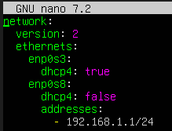

Po dodaniu adresu IP wpisujemy komendę:
```bash
sudo netplan apply
```

Aby sprawdzić, czy połączenie jest ustanowione na maszynie hosta wpisujemy komendę:
```bash
ping 192.168.1.1
```
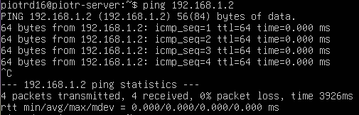

Jak widać, udało się poprawnie ustanowić połączenie.

### 5.4. Bezhasłowa wymiana kluczy SSH
W celu umożliwienia pełnej automatyzacji, wygenerowano parę kluczy SSH typu **ED25519** na maszynie głównej i przesłano klucz publiczny na maszynę docelową. Dzięki temu komunikacja i wykonywanie zadań administracyjnych odbywa się bez interakcji użytkownika (podawania hasła).

**Generowanie kluczy i wysłanie klucza publicznego do maszyny docelowej:**

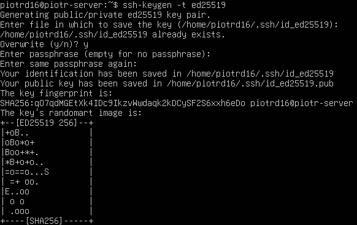

**Weryfikacja logowania SSH bez podawania hasła:**

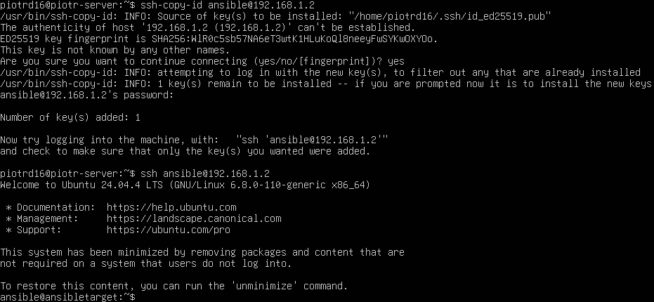

---

Z powyższego zrzutu ekranu wynika, że cały proces przebiegł poprawnie.

## 6. Dyskusja o Wdrożeniu (Deploy i Publish)

**Analiza i wybór formy artefaktu:**
Zdecydowano, że biblioteka `hiredis` powinna być dystrybuowana jako wersjonowany pakiet binarny. W potoku przygotowano archiwum zawierające skompilowaną bibliotekę współdzieloną `.so`. Jest to format gotowy do wdrożenia, który pozwala na łatwą dystrybucję do systemów docelowych bez konieczności posiadania tam kompilatorów.

**Uzasadnienie etapu Deploy:**
Wdrożenie biblioteki zrealizowano jako **Smoke Test** w czystym kontenerze. Wykazano, że:
- Program pomyślnie ładuje bibliotekę współdzieloną w systemie pozbawionym narzędzi budujących.
- Nie występują błędy linkowania dynamicznego (dzięki poprawnej rejestracji przez `ldconfig`).
- Artefakt jest całkowicie przenośny i niezależny od specyficznej konfiguracji maszyny deweloperskiej.

**Różnica node vs node-slim (Wnioski końcowe):**
Wykorzystanie obrazów typu **slim** na etapie wdrożenia jest kluczową dobrą praktyką DevOps. Obrazy pełne (np. `node`) służą wyłącznie do etapu **Build**, ponieważ zawierają zbędne w produkcji narzędzia (git, kompilatory, logi). Wersje odchudzone (`node-slim` lub `ubuntu:slim`) zapewniają mniejszy rozmiar obrazu oraz wyższe bezpieczeństwo poprzez drastyczne ograniczenie wektorów ataku.

---

## 7. Podsumowanie i "Definition of Done"

Proces CI/CD dla biblioteki hiredis oraz jego przygotowanie do automatyzacji z użyciem Ansible można uznać za zakończony, ponieważ spełnia wszystkie kluczowe założenia nowoczesnego podejścia do wytwarzania oprogramowania. Przede wszystkim cała konfiguracja potoku build–test–publish została zapisana w repozytorium w postaci pliku Jenkinsfile, co umożliwia pełne wersjonowanie oraz śledzenie zmian w procesie. Dzięki wykorzystaniu technologii Docker każde uruchomienie pipeline’u odbywa się w czystym, odizolowanym środowisku, co zapewnia powtarzalność i eliminuje wpływ czynników zewnętrznych.

Dodatkowo poprawność działania została potwierdzona poprzez test integracyjny – skuteczna komunikacja między kontenerami C1 i C2 dowodzi, że aplikacja działa prawidłowo w warunkach zbliżonych do rzeczywistych. Całość uzupełnia konfiguracja bezhasłowego dostępu do węzła docelowego, która stanowi podstawę do dalszej automatyzacji wdrożeń przy użyciu Ansible.
