# Sprawozdanie z Laboratoriów 1-4
**Autor:** Piotr Drożyński

---

## Laboratorium 1: Git, Gałęzie i Automatyzacja

Celem zajęć było przygotowanie stanowiska pracy, konfiguracja kluczy SSH oraz wdrożenie mechanizmu weryfikacji komunikatów zatwierdzeń.

### 1.1. Zarządzanie gałęziami i strukturą
Pracę rozpoczęto od gałęzi `main`, skąd odgałęziono gałąź grupową `GCL1`. Następnie utworzono osobistą gałąź roboczą `PD420765` oraz odpowiadający jej katalog wewnątrz struktury grupowej.

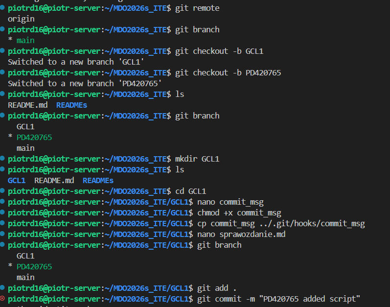

### 1.2. Implementacja Git Hooka
W folderze `.git/hooks` utworzono skrypt `commit-msg`. Skrypt ten automatycznie odrzuca próby zatwierdzenia zmian, jeśli wiadomość nie zaczyna się od identyfikatora użytkownika (`PD420765`).

**Treść skryptu weryfikującego:**
```bash
#!/bin/bash
commit_message=$(cat "$1")
pattern="^PD420765"
if [[ ! $commit_message =~ $pattern ]]; then
    echo "BŁĄD: Wiadomość musi zaczynać się od PD420765"
    exit 1
fi
```

---

## Laboratorium 2: Zestawienie Środowiska skonteneryzowanego Docker

Celem zajęć było przygotowanie środowiska skonteneryzowanego oraz weryfikacja mechanizmów zarządzania obrazami i kontenerami.

### 2.1. Instalacja i zapoznanie z wybranymi obrazami
Zainstalowano środowisko Docker przy użyciu repozytorium dystrybucyjnego (unikając pakietów Snap). Pobrano szereg obrazów testowych, w tym: `hello-world`, `busybox`, `ubuntu`, `mariadb`.

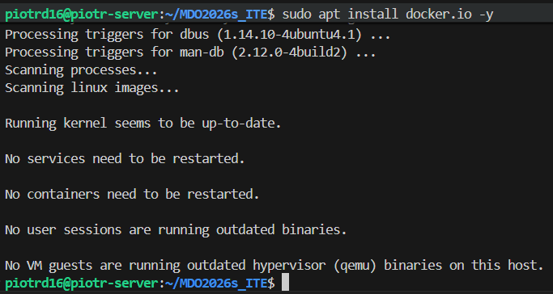
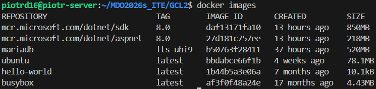
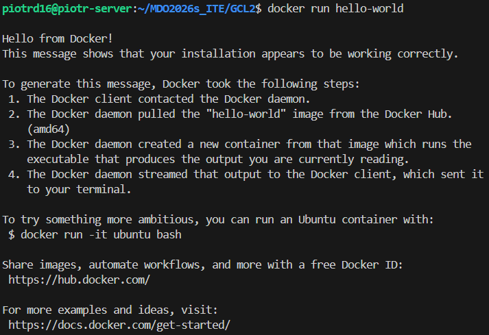

### 2.2. Kontenery interaktywne i inspekcja procesów
Uruchomiono kontener `busybox` w trybie interaktywnym w celu weryfikacji wersji systemu. Następnie w kontenerze `ubuntu` zainstalowano narzędzia `procps` i wykazano, że głównym procesem (PID 1) jest powłoka `/bin/bash`.

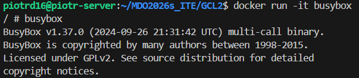
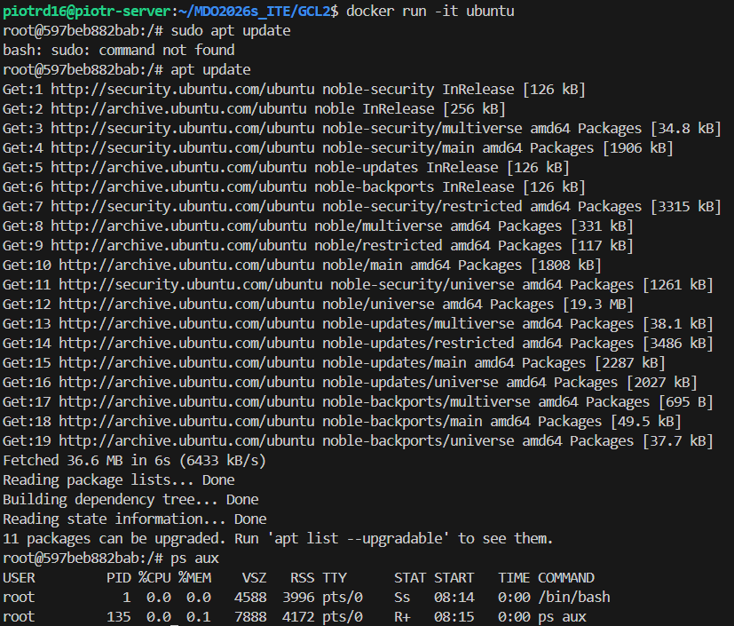

### 2.3. Dockerfile
Stworzono Dockerfile automatyzujący instalację Gita i klonowanie repozytorium. Po zakończeniu prac przeprowadzono czyszczenie zakończonych kontenerów oraz nieużywanych obrazów, aby zwolnić miejsce na dysku.

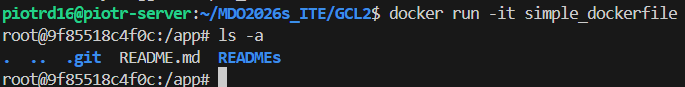
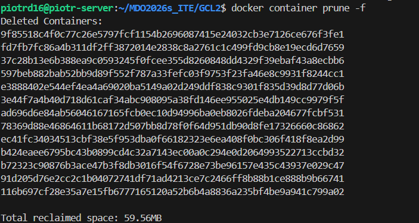
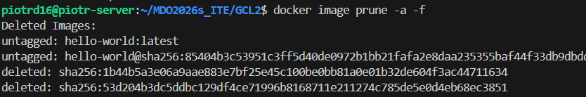

---

## Laboratorium 3: Dockerfiles - Kontener jako definicja etapu

Celem zajęć było przeniesienie procesu budowania i testowania oprogramowania do powtarzalnego środowiska CI.

### 3.1. Wybór oprogramowania i weryfikacja lokalna
Do zadania wybrano bibliotekę **hiredis** (klient C dla bazy Redis), udostępnioną na licencji BSD. Projekt posiada plik `Makefile`, który umożliwia kompilację (`make`) oraz uruchomienie testów jednostkowych (`make check`).

Kompilacja biblioteki:

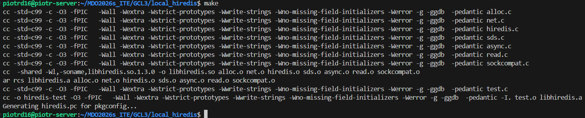

Wyniki testów jednostkowych

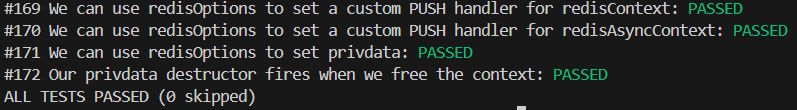

### 3.2. Izolacja: Build i test w kontenerze interaktywnym
Zgodnie z wymogiem izolacji, proces powtórzono w kontenerze `ubuntu:22.04`. Do kontenera podłączono TTY, zainstalowano zależności (`build-essential`, `git`, `redis-server`), sklonowano kod i pomyślnie przeprowadzono build oraz testy.

Budowanie hiredisa wewnątrz kontenera interaktywnego:

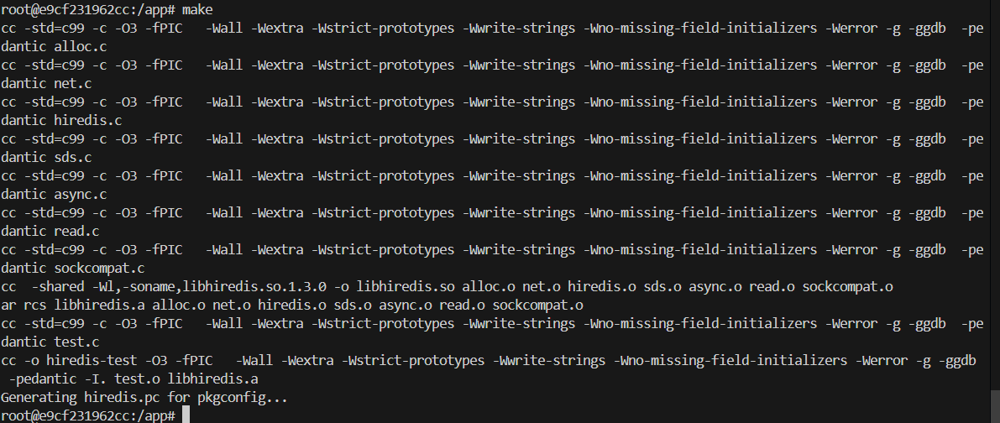

Wyniki testów:

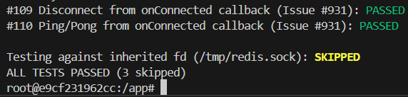

### 3.3. Automatyzacja: Dockerfile i Docker Compose
Przygotowano dwa pliki Dockerfile:
1. **Dockerfile.build**: Instaluje kompilatory i buduje oprogramowanie.

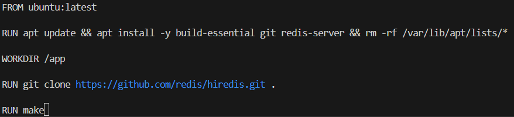

Fragment uruchamiania powyższego Dockerfile:

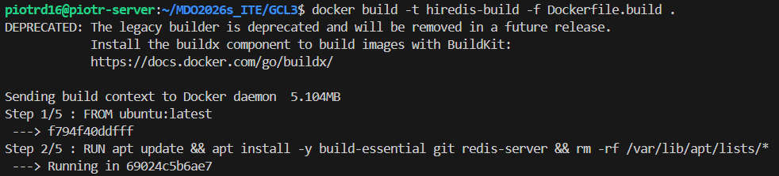

2. **Dockerfile.test**: Bazuje na obrazie builda i wykonuje tylko testy (`CMD ["make", "check"]`).

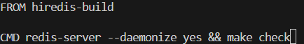

Fragmenty uruchamiania powyższego Dockerfile:

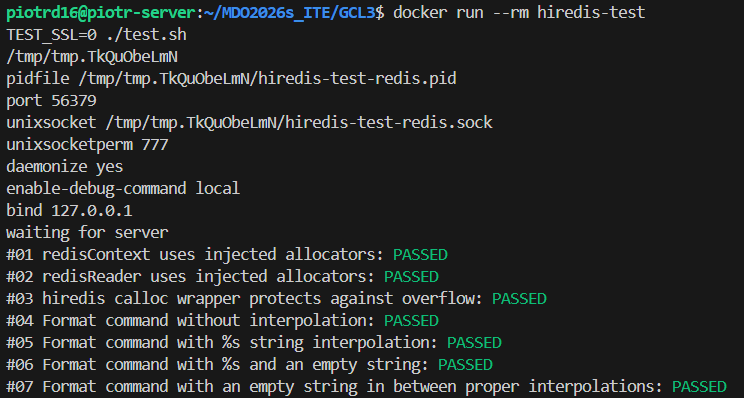
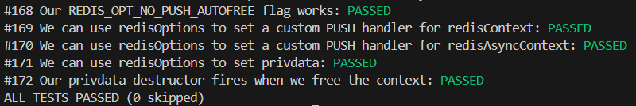

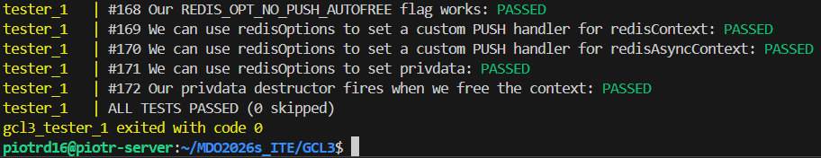

### 3.4. Dyskusja i odpowiedzi na pytania z instrukcji

**1. Różnica między obrazem a kontenerem:**
Obraz to statyczny, niemodyfikowalny szablon (warstwy na dysku). Kontener to uruchomiona instancja tego obrazu. W naszym przypadku w kontenerze pracuje proces `make check`, który po zakończeniu testów zwraca kod wyjścia i kończy cykl życia kontenera.

**2. Czy program nadaje się do publikowania jako kontener?**
Jako biblioteka C, `hiredis` służy do linkowania w innych projektach, więc kontener pełni tu rolę "Build Environment". Nie ma sensu publikować samej biblioteki jako kontenera uruchomieniowego, chyba że byłaby częścią większej usługi (np. proxy do Redisa). Taki sposób interakcji nadaje się głównie do etapu **builda**.

**3. Przygotowanie finalnego artefaktu i czyszczenie:**
Finalnym artefaktem są pliki binarne (`libhiredis.so`). Jeśli program byłby publikowany jako kontener, należy go oczyścić z kompilatora gcc, narzędzi make i kodu źródłowego. Najlepiej zastosować Multi-stage build, gdzie w ostatnim etapie kopiujemy tylko gotowe biblioteki do czystego obrazu.

**4. Dedykowany deploy-and-publish i format pakietu:**
Zalecane jest dystrybuowanie biblioteki jako pakiet systemowy (DEB dla Ubuntu/Debian lub RPM dla Fedory). Zapewnia to poprawną obsługę zależności w systemach docelowych.

**5. Przykład trzeciego kontenera:**
Można stworzyć trzeci etap (kontener), który po pomyślnych testach pobiera artefakty i używa narzędzia np. `checkinstall` lub `fpm` do wygenerowania paczki `.deb`.
*Przykład:*
```dockerfile
FROM tester-image
RUN apt-get install -y fpm
RUN fpm -s dir -t deb -n hiredis /app/libhiredis.so
```

## Laboratorium 4:

### 4.1. Woluminy i Zachowywanie Stanu
Zaimplementowano proces budowania w kontenerze bez zainstalowanego Gita. Kod dostarczono na wolumin `vol_in` przy użyciu kontenera pomocniczego, co gwarantuje izolację narzędzi.

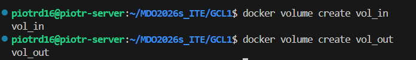

Zgodnie z wymaganiem, proces budowania miał odbyć się w kontenerze pozbawionym narzędzia Git. Aby dostarczyć kod źródłowy do izolowanego środowiska, zastosowano metodę kontenera pomocniczego.
Dokładny opis wykonania:
1. Utworzono nazwany wolumin Dockera: docker volume create vol_in.
2. Uruchomiono tymczasowy kontener pomocniczy z zainstalowanym Gitem, montując do niego stworzony wolumin:

```bash
docker run --rm -v vol_in:/data alpine/git clone https://github.com/redis/hiredis.git /data
```

Po zakończeniu klonowania kontener pomocniczy został automatycznie usunięty (--rm), a kod pozostał na woluminie vol_in.
Następnie uruchomiono właściwy kontener budujący (hiredis-build), montując wolumin vol_in w trybie tylko do odczytu (:ro).

**Dlaczego akurat ta metoda?**

* Kontener pomocniczy (Wybrana metoda): Jest to najbardziej "Dockerowa" i czysta metoda. Pozwala zachować minimalizm kontenera budującego, co zmniejsza rozmiar obrazu i zwiększa bezpieczeństwo. Proces jest w pełni zautomatyzowany wewnątrz silnika Docker.
   * Bind mount z lokalnym katalogiem: Metoda ta uzależnia kontener od konkretnej struktury plików na hoście (np. `/home/user/hiredis`). Jest mniej przenośna – jeśli przeniesiemy projekt na inny serwer, ścieżka może być inna.
   * Kopiowanie do `/var/lib/docker`: Jest to uznawane za złą praktykę, ponieważ wymaga uprawnień roota na hoście, ingeruje w wewnętrzne mechanizmy Dockera i często prowadzi do błędów z uprawnieniami plików wewnątrz kontenera.
   * RUN --mount (Dockerfile): Metoda ta jest bardzo wydajna, ale wymaga użycia BuildKit i nie utrwala danych na stałym woluminie po zakończeniu budowania w taki sposób, jak zrobiono to w zadaniu.

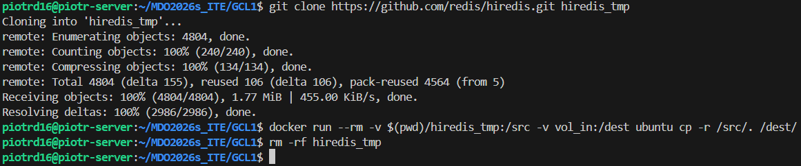
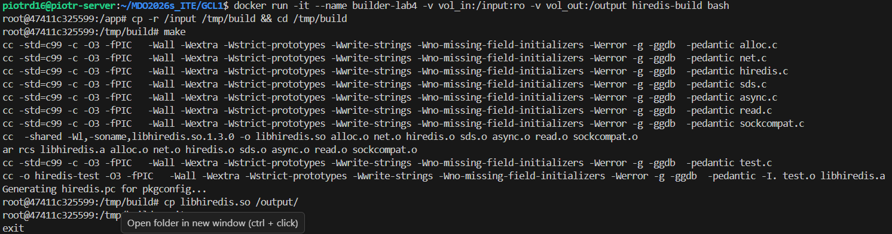

### 4.2. Łączność sieciowa i pomiar przepustowości (IPerf3)

Zrealizowano testy komunikacji na trzech poziomach: wewnątrz sieci izolowanej, z poziomu hosta oraz spoza środowiska wirtualnego.

**1. Łączność z Hosta (Ubuntu -> Kontener):**
Dzięki mapowaniu portów `-p 5201:5201`, usługa serwera IPerf3 stała się dostępna bezpośrednio na interfejsie lokalnym maszyny wirtualnej.
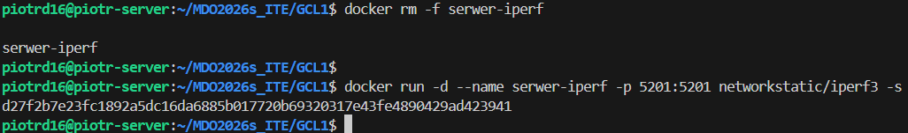

Otrzymane wyniki na poziomie hosta:
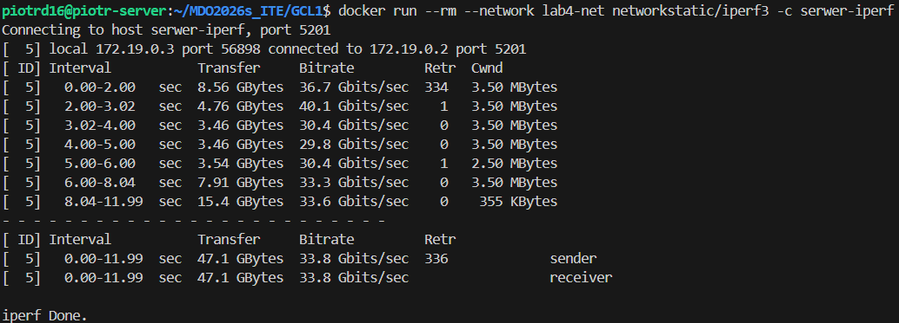

**2. Łączność spoza Hosta (Windows -> Kontener):**
Wykorzystano mechanizm Port Forwarding w oprogramowaniu VirtualBox, aby udostępnić port 5201 dla systemu macierzystego (Windows). Połączenie zrealizowano przy użyciu klienta IPerf3 dla systemu Windows.

Konfiguracja portu na maszynie wirtualnej:

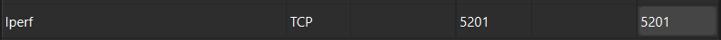

Wynik połączenia z PowerShella:

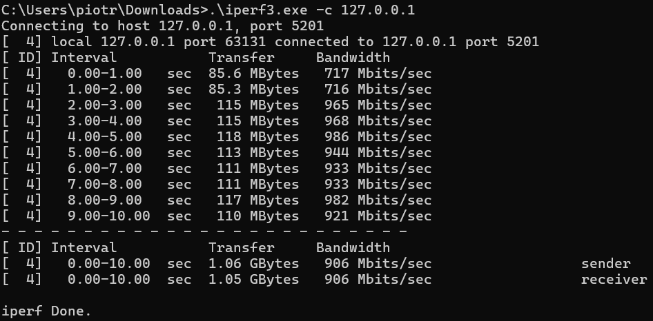

**Wnioski z pomiaru przepustowości:**
Podczas testów zaobserwowano spadek wydajności przy komunikacji spoza hosta. Jest to zjawisko typowe dla środowisk zwirtualizowanych, gdzie pakiety muszą zostać przetworzone przez wiele warstw translacji adresów (NAT) i stosów sieciowych obu systemów operacyjnych. Najwyższą wydajność odnotowano wewnątrz dedykowanej sieci mostkowej Dockera (`lab4-net`), gdzie komunikacja odbywa się niemal z prędkością procesora (bez narzutu fizycznych kart sieciowych).

### 4.3. Usługi w kontenerze: Serwer SSH (SSHD)

Celem zadania było uruchomienie usługi SSH wewnątrz kontenera Ubuntu, co pozwala na zdalne logowanie bezpośrednio do jego powłoki.

**Co się dzieje w tym etapie?**
1. **Konfiguracja:** Stworzono `Dockerfile`, który instaluje `openssh-server`, ustawia hasło dla roota i odblokowuje możliwość logowania zdalnego.
2. **Ekspozycja portu:** Kontener uruchomiono z mapowaniem `-p 2223:22`. Port 22 w kontenerze jest dostępny na porcie 2223 hosta.

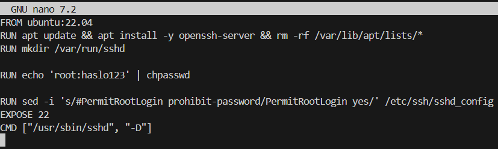

**Wnioski:**
* **Zalety:** Pozwala na używanie tradycyjnych narzędzi (Putty, WinSCP) do zarządzania kontenerem.
* **Wady:** Jest to tzw. "anti-pattern" – zwiększa rozmiar obrazu i obniża bezpieczeństwo. W środowisku Docker zaleca się używanie komendy `docker exec`.

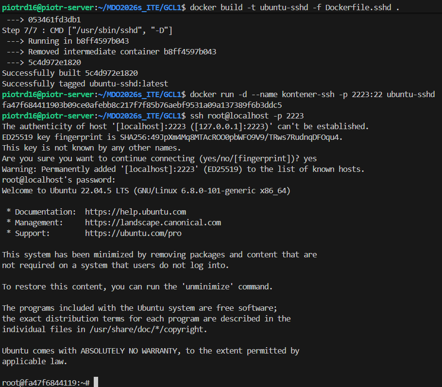

---

### 4.4. Instancja Jenkins i mechanizm Docker-out-of-Docker

Jenkins to serwer CI/CD służący do automatyzacji budowania i testowania kodu. 

**Co się dzieje w tym etapie?**
Uruchomiono Jenkinsa za pomocą **Docker Compose**, wykorzystując kluczowy mechanizm współdzielenia gniazda Dockera:

1. **Gniazdo Dockera (`docker.sock`):** Przez podmontowanie `/var/run/docker.sock` z hosta do kontenera, Jenkins zyskał uprawnienia do sterowania silnikiem Dockera na naszym Ubuntu. Pozwala mu to na budowanie obrazów i uruchamianie innych kontenerów (np. testowych).
2. **Woluminy:** Dane Jenkinsa (projekty, konfiguracje) zapisywane są na woluminie `jenkins_home`, dzięki czemu nie giną po restarcie kontenera.
3. **Inicjalizacja:** Przy pierwszym starcie system generuje hasło administratora, które odczytano z logów kontenera (`docker logs`), co umożliwiło dostęp do panelu WWW na porcie 8080.

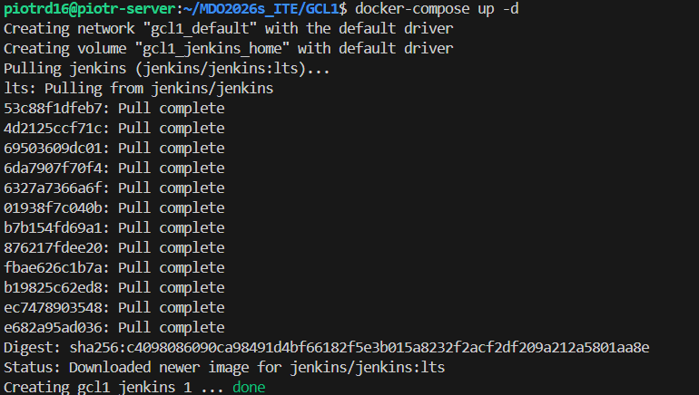
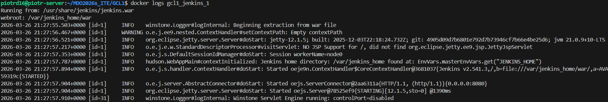

---

## Podsumowanie i Wnioski Końcowe

1. **Automatyzacja i Standardy (Git):** 
   Wdrożenie mechanizmu Git Hooks pokazało, że automatyczne wymuszanie standardów (np. formatu komunikatów zatwierdzeń) jest kluczowe w pracy zespołowej. Pozwala to na zachowanie czytelności historii zmian i łatwiejsze debugowanie projektu.

2. **Izolacja i Powtarzalność (Docker CI):** 
   Przeniesienie procesu budowania i testowania biblioteki `hiredis` do kontenerów rozwiązało problem tzw. "dependency hell". Dzięki Dockerowi, proces kompilacji jest całkowicie niezależny od konfiguracji systemu hosta, co gwarantuje, że kod zbuduje się identycznie na każdej maszynie.

3. **Zarządzanie Danymi i Siecią:** 
   Laboratorium 4 wykazało, że kontenery powinny być tymczasowe. Wykorzystanie woluminów pozwoliło na trwałe przechowywanie artefaktów (plików `.so`) poza cyklem życia kontenera, a dedykowane sieci mostkowe umożliwiły bezpieczną komunikację usług po nazwach DNS.

4. **Nowoczesne potoki CI/CD (Jenkins):** 
   Uruchomienie instancji Jenkinsa w modelu DIND (Docker in Docker) pokazało, jak w praktyce realizuje się nowoczesne potoki ciągłej integracji. Konteneryzacja samego serwera CI pozwala na jego błyskawiczne wdrażanie i łatwe skalowanie zasobów budujących.
