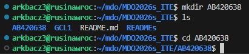

LAB2
Instalacja dockera:

Logowanie do dockera:

Na przeglądarce:

Zalogowano:

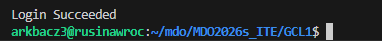

Pobranie aplikacji dockera:

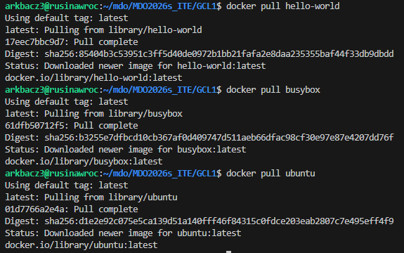

Hello World działa!

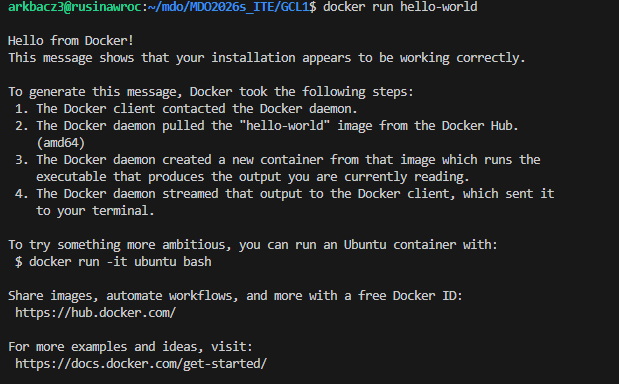

Busybox działa!

Ubuntu działa!

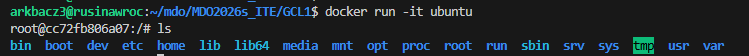

Wielkosci obrazow dockera oraz kody wyjścia:

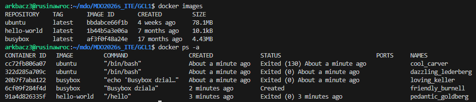

Wywolanie wersji busybox:

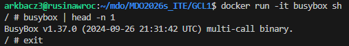

Odpalenie ubuntu interaktywnie:

Update ubuntu:

Prezentacja PID1:

Aktualizacja pakietów:

Wyjście oraz procesy dockera:

Tworzenie pliku Dockerfile:

Zbudowanie obrazu:

Uruchomienie i sprawdzenie obrazu:

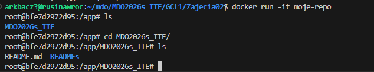

Uruchomione kontenery:

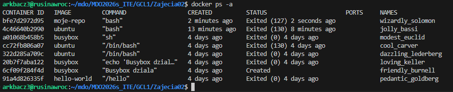

Wyczyszczenie zakończocnych kontenerów:

Wyczyszczenie obrazów:

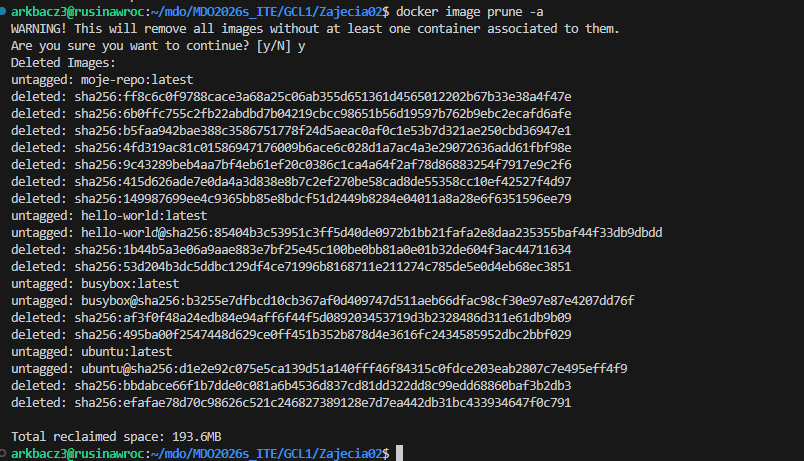

Wysłanie na serwer:

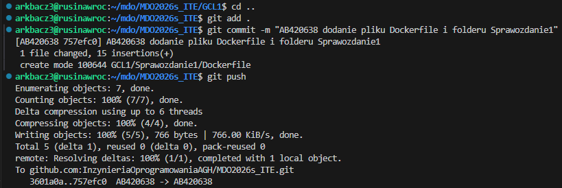

