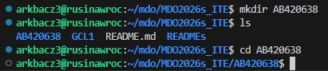

LAB2
Instalacja dockera:

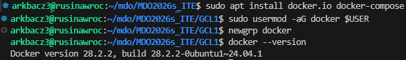

Logowanie do dockera:

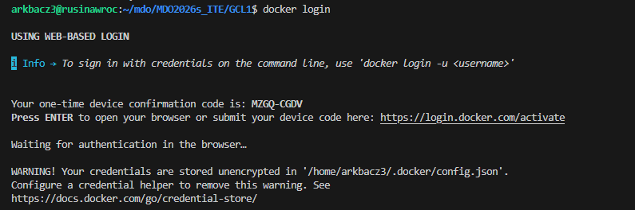

Na przeglądarce:

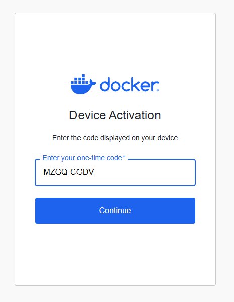

Zalogowano:

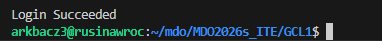

Pobranie aplikacji dockera:

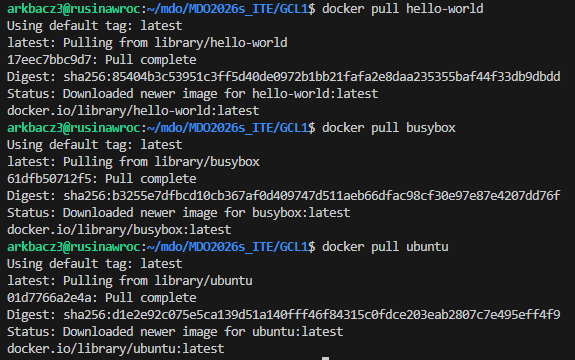

Hello World działa!

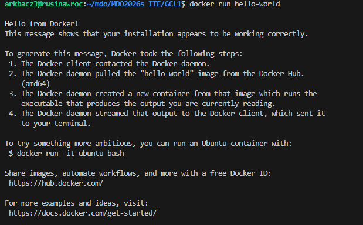

Busybox działa!

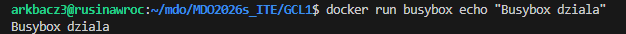

Ubuntu działa!

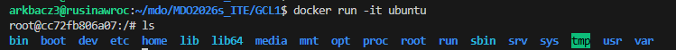

Wielkosci obrazow dockera oraz kody wyjścia:

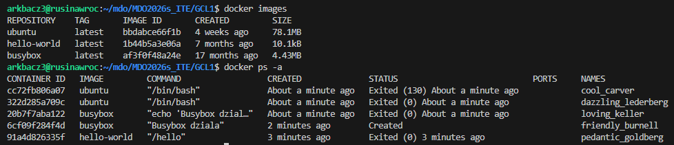

Wywolanie wersji busybox:

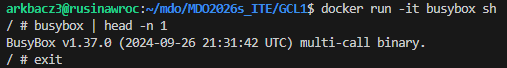

