# Sprawozdanie - Metodyki DevOps (Zajęcia 1-4)

**Data:** 24.03.2026 r.
**Imię i nazwisko:** Kacper Golmento
**Nr indeksu:** 420155
**Inicjały i nr indeksu (nazwa gałęzi):** KG420155
**Grupa:** 3

## Zajęcia 01: Git, Gałęzie, SSH

### 1. Konfiguracja Git i SSH

Zgodnie z poleceniem, wygenerowałem dwa klucze SSH (inne niż RSA), w tym jeden zabezpieczony hasłem. Skonfigurowałem również uwierzytelnianie dwuskładnikowe (2FA) na koncie GitHub.

*Zrzut ekranu przedstawiający dodane klucze SSH oraz aktywne 2FA w panelu GitHub:*
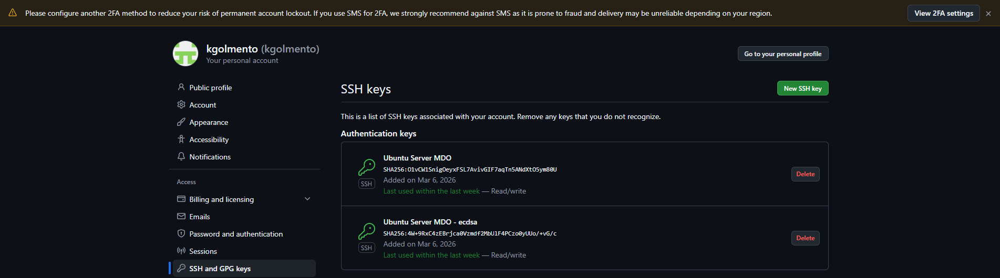

Repozytorium przedmiotowe zostało sklonowane dwukrotnie:
1. Za pomocą protokołu HTTPS przy użyciu Personal Access Token.
2. Za pomocą protokołu SSH, wykorzystując nowo wygenerowany klucz.

*Zrzuty ekranu z terminala po udanym sklonowaniu repozytorium przez HTTPS i SSH:*
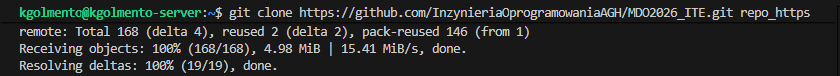
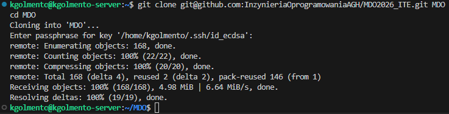

### 2. Narzędzia i środowisko pracy

Zapewniłem dostęp do maszyny wirtualnej oraz natychmiastową wymianę plików ze środowiskiem pracy. 

*Zrzut ekranu z edytora Visual Studio Code połączonego z maszyną wirtualną (Remote SSH):*
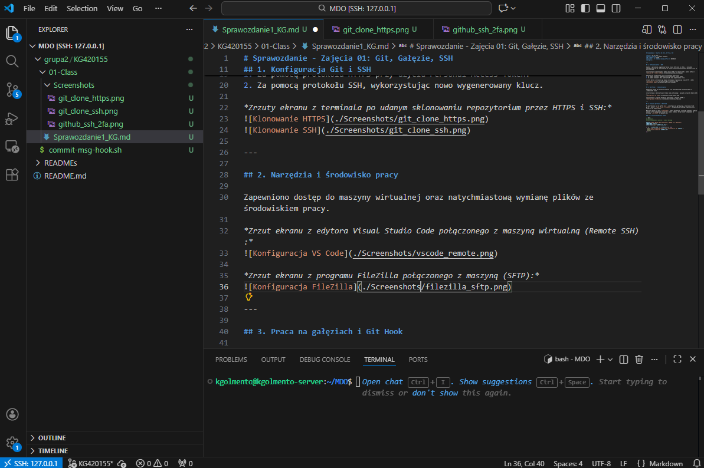

*Zrzut ekranu z programu FileZilla połączonego z maszyną (SFTP):*
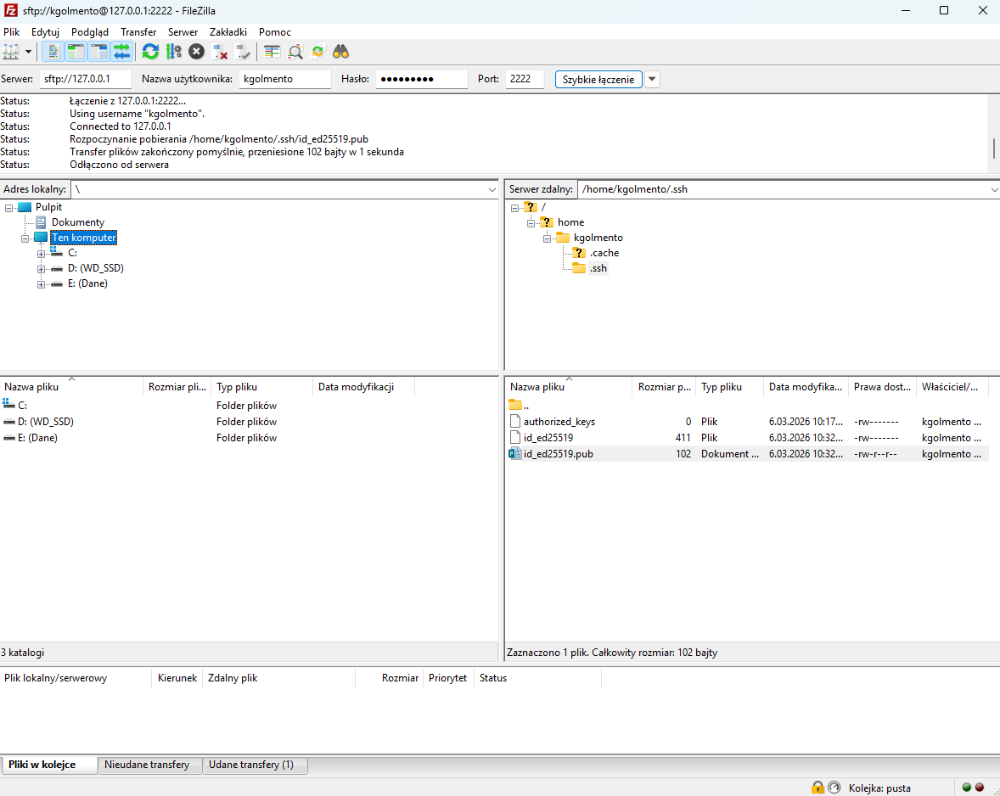

### 3. Praca na gałęziach i Git Hook

Po przełączeniu się na gałąź `main`, a następnie na gałąź grupy, utworzyłem własną gałąź o nazwie `KG420155`. W odpowiednim katalogu grupy utworzyłem folder o tej samej nazwie.

Napisałem skrypt Git hook (`commit-msg`), który weryfikuje, czy każda wiadomość commita zaczyna się od wymaganych inicjałów i numeru indeksu. Skrypt został skopiowany do katalogu `.git/hooks` w repozytorium.

**Treść zastosowanego Git Hooka**:

```bash
#!/bin/bash
# Hook sprawdzający prefiks w commit message

PREFIX="KG420155"
COMMIT_MSG_FILE=$1
COMMIT_MSG=$(cat "$COMMIT_MSG_FILE")

if [[ ! "$COMMIT_MSG" == "$PREFIX"* ]]; then
  echo "Błąd: Wiadomość commita musi zaczynać się od '$PREFIX'."
  echo "Twoja wiadomość: $COMMIT_MSG"
  exit 1
fi
```

### 4. Próba wciągnięcia gałęzi (Pull Request)

Zgodnie z instrukcją podjąłem próbę wciągnięcia własnej gałęzi (`grupa2/KG420155`) do gałęzi grupowej (`grupa2`). Operację tę zrealizowano za pomocą mechanizmu Pull Request na platformie GitHub.

*Zrzut ekranu z przeglądarki przedstawiający formularz otwarcia nowego Pull Requesta na GitHubie (widoczne gałęzie źródłowa i docelowa):*
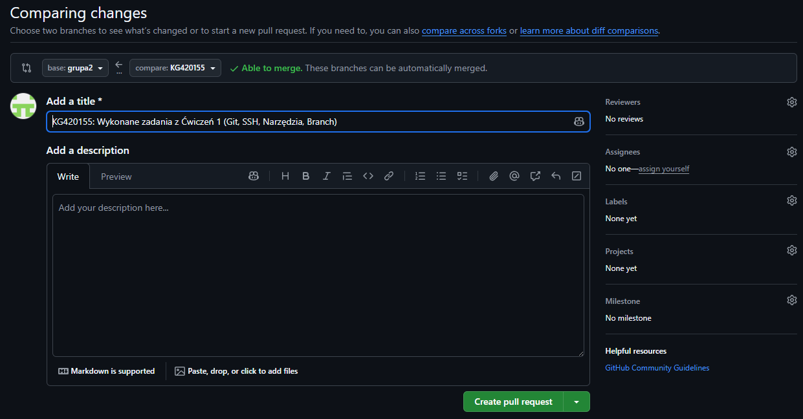

*Zrzut ekranu przedstawiający status utworzonego Pull Requesta (np. informację o braku konfliktów i gotowości do wciągnięcia zmian):*
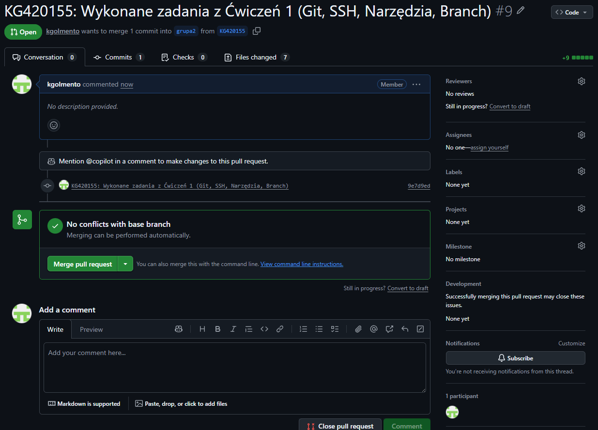

GitHub nie zgłosił żadnych konfliktów merge'owania.

Następnie zaktualizowano niniejsze sprawozdanie o przebieg tego kroku, dodano commita uwzględniającego Git Hook i wysłano aktualizację do zdalnego źródła na własnej gałęzi.

---

## Zajęcia 02: Git, Docker

### 1. Instalacja Dockera

Zgodnie z wytycznymi, na maszynie wirtualnej z systemem Ubuntu Server zainstalowałem środowisko Docker. Wykorzystałem dystrybucyjny pakiet `docker.io` pobrany za pomocą menedżera `apt`, zamiast Snap. Rozwiązania typu Snap czy Flatpak mają duży narzut plików, co  nierzadko prowadzi do problemów z konfiguracją. Następnie założyłem również konto w serwisie Docker Hub.

*Zrzuty ekranu przedstawiające instalację Dockera i aktywne konto w Docker Hub:*
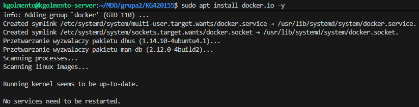
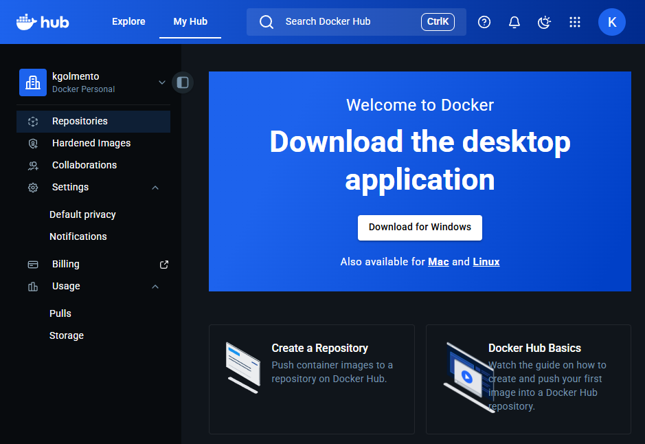

---

### 2. Zapoznanie się i analiza obrazów

Pobrałem i uruchomiłem sugerowane obrazy bazowe: `hello-world`, `busybox`, `ubuntu`, `mariadb` oraz `mcr.microsoft.com/dotnet/runtime:8.0`. 

*Zrzut ekranu przedstawiający uruchomienie Hello World'a:*
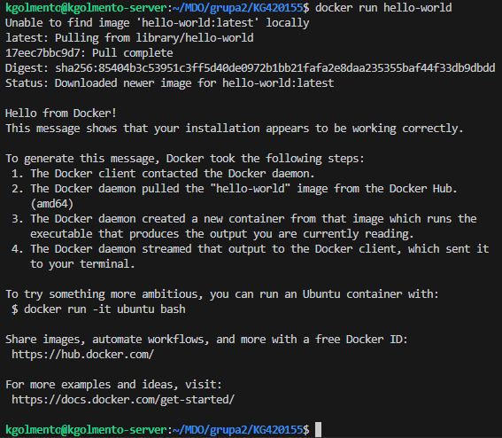

Działanie innych obrazów będzie przedstawione w kolejnych krokach w sprawozdaniu.

*Zrzut ekranu przedstawiający rozmiary pobranych obrazów (`docker images`):*
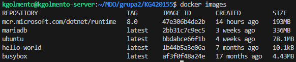

Rozmiary obrazów znacząco się różnią – od minimalnego `busybox` (ok. 4MB), poprzez `ubuntu` (ok. 70-80MB), aż po potężne obrazy takie jak `mariadb` czy środowisko uruchomieniowe .NET, które zawierają w sobie preinstalowane biblioteki i zależności. Jest to odwrotny efekt niż bym się spodziewał, raczej przewidywałbym, że kontener ubuntu okaże się największy.

Zweryfikowałem również kody wyjścia (Exit Codes) zakończonych kontenerów. Kontenery wykonujące jednorazowe skrypty (jak `hello-world`) kończą pracę z kodem `0`, co w systemach uniksowych oznacza poprawne wykonanie zadania.

*Zrzut ekranu przedstawiający kody wyjścia (`docker ps -a`):*
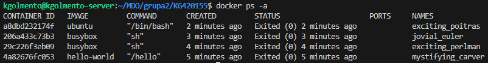

---

### 3. Praca interaktywna z kontenerami

**Obraz BusyBox**
Uruchomiłem kontener z obrazu `busybox` w trybie interaktywnym z podłączeniem standardowego wejścia (flagi `-it`), co pozwoliło na wykonanie powłoki systemowej. Wewnątrz wywołałem polecenie sprawdzające wersję narzędzia.

*Zrzut ekranu z uruchomienia i weryfikacji wersji BusyBox:*
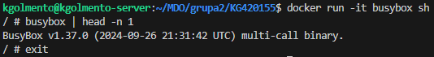

**System w kontenerze (Ubuntu)**
Następnie uruchomiono "system w kontenerze" wykorzystując obraz `ubuntu`. 

Wewnątrz kontenera proces z identyfikatorem `PID 1` to wywołana powłoka `bash` (co zweryfikowano poleceniem `cat /proc/1/comm`). Wynika to z architektury Dockera – kontener nie uruchamia pełnego systemu init (np. `systemd`), lecz traktuje komendę startową jako główny proces. Z perspektywy hosta, proces ten jest widoczny jako potomek procesu demona Dockera (`containerd-shim`), co udowodniono listując procesy na hoście.

Będąc w kontenerze, pomyślnie zaktualizowano listę pakietów (`apt update`).

*Zrzuty ekranu pokazujące PID 1 w kontenerze, aktualizację pakietów oraz procesy dockera na hoście:*
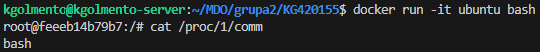
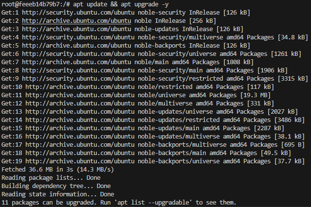
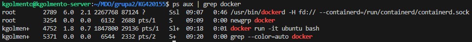

---

### 4. Budowa własnego obrazu (Dockerfile)

Opracowałem własny plik `Dockerfile` oparty na systemie Ubuntu, którego celem jest przygotowanie środowiska z zainstalowanym Gitem i pobranym repozytorium przedmiotu.

Podczas pisania instrukcji zastosowałem dobre praktyki optymalizacji obrazów. Komendy aktualizacji i instalacji (`apt-get update && apt-get install -y git`) połączyłem w jedną (instrukcja `RUN`) wraz z czyszczeniem pamięci podręcznej menedżera pakietów (`rm -rf /var/lib/apt/lists/*`). Zapobiega to utrwalaniu niepotrzebnych plików tymczasowych w kolejnych warstwach obrazu, co znacząco zmniejsza jego finalny rozmiar.

**Treść pliku Dockerfile:**

```dockerfile
FROM ubuntu:latest

RUN apt-get update && \
    apt-get install -y git && \
    rm -rf /var/lib/apt/lists/*

WORKDIR /app

RUN git clone [https://github.com/InzynieriaOprogramowaniaAGH/MDO2026_ITE.git](https://github.com/InzynieriaOprogramowaniaAGH/MDO2026_ITE.git)

CMD ["/bin/bash"]
```

Kontener uruchomił się prawidłowo, repozytorium zostało sklonowane.

*Zrzuty ekranu pokazujące budowę i uruchomienie kontenera:*
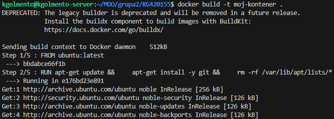
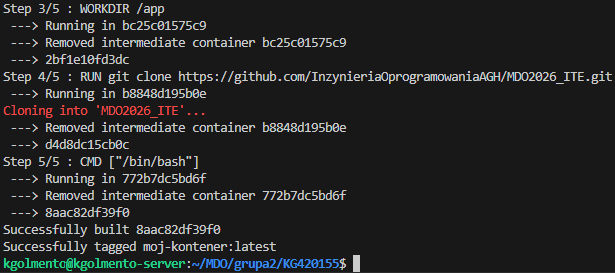
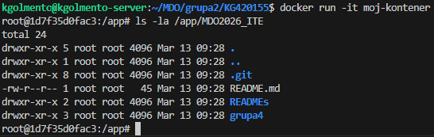

---

### 5. Czyszczenie środowiska i aktualizacja repozytorium

Po zakończeniu pracy przeprowadziłem inspekcję i sprzątanie środowiska:

1. Wyświetliłem listę wszystkich kontenerów, po czym użyłem komendy docker container prune -f do usunięcia kontenerów o statusie "Exited".

*Zrzuty ekranu przedstawiające wyświetlenie i usunięcie nieaktywnych kontenerów:*
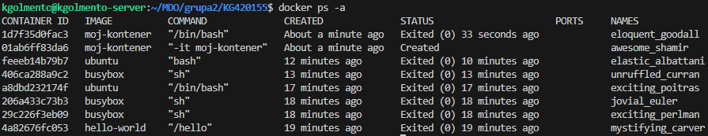
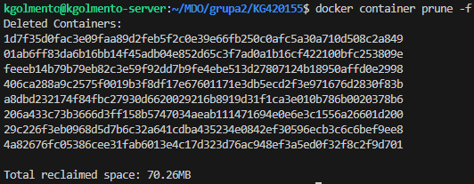

2. Wyczyściłem lokalny magazyn obrazów za pomocą polecenia docker image prune -a -f, zwalniając miejsce na maszynie wirtualnej.

*Zrzut ekranu przedstawiający czyszczenie obrazów:*
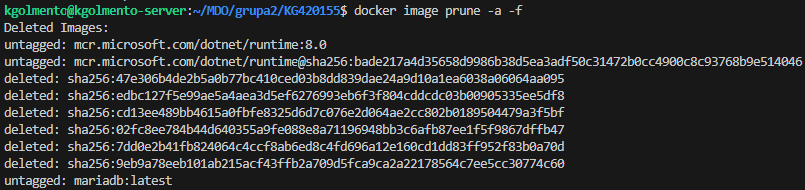
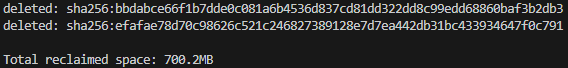

Na koniec umieściłem w nim przygotowany plik Dockerfile wraz z niniejszym sprawozdaniem i zrzutami ekranu, po czym wykonałem commita (z zachowaniem odpowiedniego prefiksu) i wypchnąłem zmiany na zdalne repozytorium GitHub.

*Zrzut ekranu przedstawiający dodanie Dockerfile'a do repozytorium:*
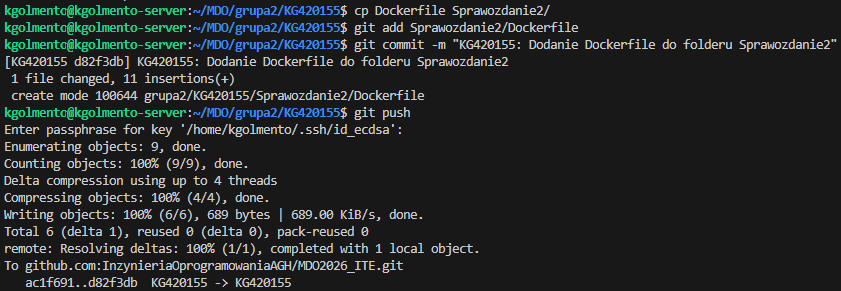

---

## Zajęcia 03: Dockerfiles, kontener jako definicja etapu

### 1. Wybór oprogramowania i lokalny build
Na potrzeby zajęć wybrałem **Commander.js** (środowisko Node.js). Projekt ten dysponuje otwartą licencją, wykorzystuje menedżer pakietów `npm` do procesu budowania i posiada zdefiniowane testy jednostkowe, które jednoznacznie formułują swój raport końcowy. 

Sklonowałem repozytorium na maszynę wirtualną, doinstalowałem zależności (`npm install`) i pomyślnie uruchomiłem testy jednostkowe dołączone do projektu (`npm test`).

*Zrzut ekranu przedstawiający pomyślne wykonanie testów na maszynie wirtualnej:*
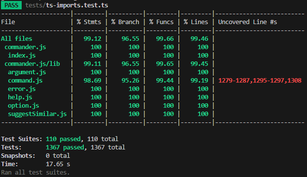

### 2. Izolacja: build w kontenerze (interaktywnie)
Celem zapewnienia powtarzalności, powtórzyłem to wewnątrz kontenera interaktywnego. Wybrałem obraz `node:20`, podłączyłem do niego TTY (`docker run -it node:20 bash`) i wewnątrz wyizolowanego środowiska sklonowałem repozytorium, skonfigurowałem środowisko oraz uruchomiłem testy. 

*Zrzut ekranu z pomyślnego wykonania testów wewnątrz kontenera interaktywnego:*
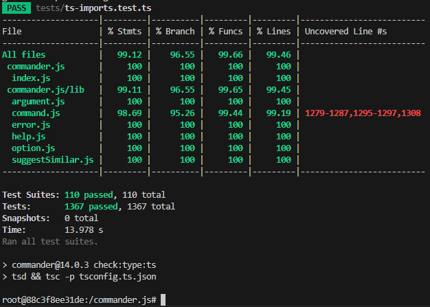

### 3. Automatyzacja (Dockerfiles) i Docker Compose
Aby zautomatyzować proces, stworzyłem dwa pliki `Dockerfile`:
1. **Dockerfile.build**: Przeprowadza kroki aż do zrobienia *builda* (klonuje repozytorium i pobiera zależności).

*Zrzut ekranu Dockerfile'a build:*
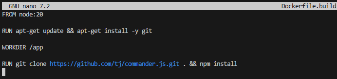

2. **Dockerfile.test**: Bazuje na pierwszym obrazie i wykonuje wyłącznie testy (bez ponownego builda), wykorzystując instrukcję `CMD ["npm", "test"]`.

*Zrzut ekranu Dockerfile'a test:*
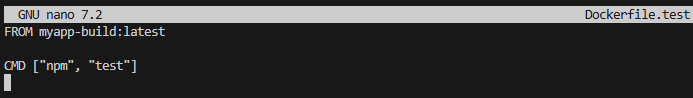

Zamiast ręcznie wdrażać kontenery, zamknąłem je w kompozycję za pomocą pliku `docker-compose.yml`, wykorzystując dyrektywę `depends_on`, aby zdefiniować kolejność budowania (build przed test).

*Zrzut ekranu logów z polecenia `docker compose up --build`, wykazujący poprawne wdrożenie i pracę kontenera:*
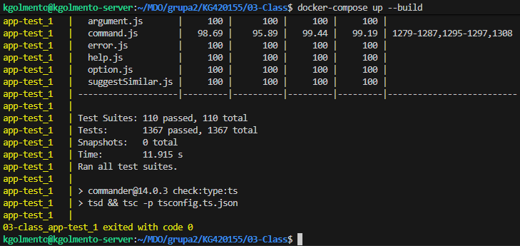

**Co pracuje w takim kontenerze?** W kontenerze testowym nie działa pełny system operacyjny, a jedynie proces określony przez dyrektywę `CMD` (w tym wypadku środowisko Node.js wykonujące skrypt testowy jako PID 1). Po zakończeniu testów kontener naturalnie kończy swoją pracę.

### 4. Dyskusja: Przygotowanie do wdrożenia (Deploy)
* **Czy program nadaje się jako kontener?** Programy interaktywne lub biblioteki (jak Commander.js) nie nadają się do wdrażania i publikowania jako stale działające kontenery. W tym przypadku kontener świetnie sprawdza się wyłącznie jako odizolowane środowisko do *builda* i testów w potoku CI.
* **Oczyszczanie:** Jeśli jednak artefaktem końcowym miałby być obraz, należałoby bezwzględnie oczyścić go z pozostałości po buildzie (np. kompilatorów, plików źródłowych, Gita) w celu zmniejszenia wagi i podatności na ataki. Należałoby tu zastosować wieloetapowe budowanie (*multi-stage build*).
* **Format dystrybucji:** Zbudowany program dla środowiska Node.js najlepiej dystrybuować jako pakiet np. do rejestru NPM (w spakowanym formacie).
* **Ścieżka publikacji:** Dedykowany *deploy-and-publish* powinien być oddzielną ścieżką (kolejnym kontenerem w CI), który po udanych testach eksportuje zbudowany artefakt na zewnątrz i wysyła go do odpowiedniego rejestru (np. Nexus, Artifactory).

---

## Zajęcia 04: Dodatkowa terminologia w konteneryzacji, instancja Jenkins

### 1. Zachowywanie stanu między kontenerami (Wolumeny)
Przygotowano wolumeny wejściowy (`vol_in`) i wyjściowy (`vol_out`). Zgodnie z założeniem, że kontener bazowy umie tylko budować projekt i nie posiada narzędzia `git`, użyto wzorca *helper container* (kontenera pomocniczego). 

Sklonowano repozytorium na wolumin wejściowy za pomocą tymczasowego kontenera z obrazu `alpine/git`:

```bash
docker run --rm -v vol_in:/repo alpine/git clone [https://github.com/tj/commander.js.git](https://github.com/tj/commander.js.git) /repo
```

**Uzasadnienie:** Zastosowałem wolumin (zarządzany przez Dockera w `/var/lib/docker/volumes/`), a nie *bind mount* (montowanie lokalnego katalogu z hosta), aby uniezależnić rozwiązanie od struktury plików specyficznej dla systemu operacyjnego hosta. Użycie kontenera pomocniczego pozwoliło mi zachować minimalizm kontenera budującego, który miał skupić się wyłącznie na zależnościach środowiska.

Następnie uruchomiłem build w kontenerze `node:20` (montując `vol_in` jako źródło i `vol_out` jako cel) i zapisałem zbudowane pliki na woluminie wyjściowym, co pozwoliło na ich zachowanie po wyłączeniu kontenera. Operację ponowiłem również używając Gita z wnętrza kontenera, klonując kod na nowy wolumin wejściowy.

```bash
docker run --rm -v vol_in:/app/in -v vol_out:/app/out -w /app/in node:20 bash -c "npm install && cp -R . /app/out/zbudowany_projekt"
```

**Dyskusja o `RUN --mount`:** Powyższe kroki można zautomatyzować bezpośrednio w pliku `Dockerfile` z wykorzystaniem BuildKit. Użycie instrukcji `RUN --mount=type=bind,source=.,target=/src` pozwoliłoby kontenerowi w czasie budowania na dostęp do plików źródłowych z hosta bez konieczności kopiowania ich na stałe do warstwy obrazu.

*Zrzut ekranu wykazujący pliki zachowane na woluminie wyjściowym:*
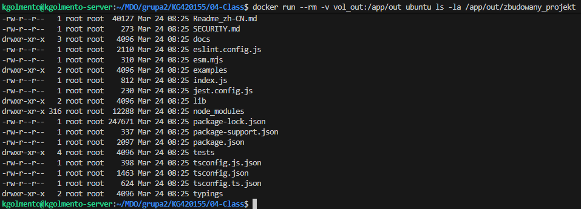

### 2. Eksponowanie portu i łączność (IPerf)
Zapoznałem się z dokumentacją programu IPerf i uruchomiłem wewnątrz kontenera serwer `iperf3`. Po znalezieniu jego adresu IP za pomocą docker inspect podłączyłem się do niego z drugiego kontenera za pomocą domyślnej sieci Dockera, badając ruch sieciowy. 

*Zrzut ekranu z wykonania testu iperf3 z lokalnego połączenia:*
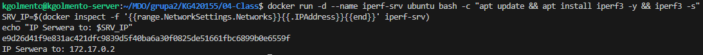
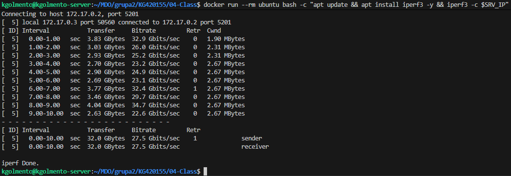

Następnie utworzyłem dedykowaną sieć mostkową (`docker network create my-net`). Ponowiłem ten krok, tym razem jednak wykorzystałem rozwiązywanie nazw zapewniane przez wbudowany serwer DNS Dockera, wskazując na kontener-serwer za pomocą jego nazwy, a nie zmiennego adresu IP.

*Zrzut ekranu z wykonania testu iperf3 za pomocą nazwy serwera:*
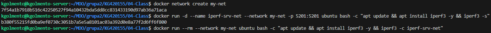

Nawiązałem także połączenie spoza kontenera, łącząc się z całkowicie zewnętrznego hosta (mojego fizycznego systemu Windows). Wymagało to wyeksponowania portu w Dockerze (`-p 5201:5201`) oraz nałożenia reguły przekierowania portów (Port Forwarding) w hipernadzorcy VirtualBox.

**Dyskusja o przepustowości:** Przedstawiona przepustowość (widoczna na zrzucie ekranu na poziomie wielu Gbit/s) nie odzwierciedla rzeczywistej prędkości sprzętowej karty sieciowej. Ponieważ oba węzły znajdują się na tej samej fizycznej maszynie (mój system hosta Windows i maszyna wirtualna), ruch odbywa się przez wirtualny interfejs loopback i wirtualny przełącznik. Program mierzy w tym przypadku de facto wydajność mojego procesora i pamięci RAM przy przenoszeniu buforów danych między przestrzeniami pamięci.

*Zrzut ekranu z wykonania testu iperf3 z fizycznego komputera Windows:*
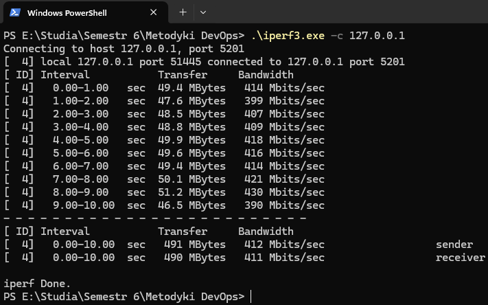

### 3. Usługi w rozumieniu systemu, kontenera i klastra (SSHD)
Zestawiłem w kontenerze z systemem Ubuntu usługę SSHD, po czym pomyślnie połączyłem się z nią za pomocą klienta SSH.

```bash
docker run -d --name ssh-container ubuntu bash -c "apt update && apt install openssh-server -y && mkdir -p /run/sshd && echo 'root:student' | chpasswd && sed -i 's/#PermitRootLogin prohibit-password/PermitRootLogin yes/' /etc/ssh/sshd_config && /usr/sbin/sshd -D"
```

*Zrzut ekranu z połączenia z SSHD za pomocą klienta SSH:*
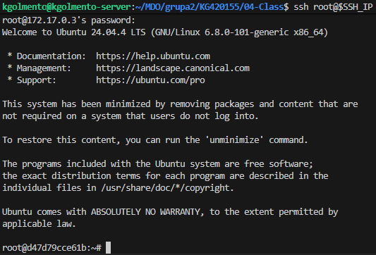

**Wady i zalety (przypadki użycia):**
Komunikacja z kontenerem za pomocą protokołu SSH to generalnie antywzorzec. Kontenery z założenia powinny być małe i uruchamiać pojedynczy proces. Dodawanie demona SSH niepotrzebnie zwiększa zużycie zasobów, wymaga zarządzania kluczami/hasłami wewnątrz obrazu i naraża go na ataki. Do administracji w zupełności wystarcza mechanizm wbudowany w silnik Dockera: `docker exec -it <nazwa> bash`. Zaletą i jedynym w miarę uzasadnionym przypadkiem użycia SSH w kontenerze jest tworzenie wirtualnych środowisk "Bastion Host" do zarządzania siecią lub honeypotów bezpieczeństwa.

### 4. Przygotowanie do uruchomienia serwera Jenkins (DinD)
Zgodnie z dokumentacją serwera CI Jenkins, przeprowadziłem instalację skonteneryzowanej instancji Jenkinsa w architekturze Docker-in-Docker (DinD). Zainicjowałem instancję za pomocą kontenera pomocniczego z certyfikatami, wykazując działające kontenery poleceniem `docker ps`. Po udanym wdrożeniu, udało mi się zalogować poprzez przeglądarkę.

*Zrzut ekranu przedstawiający uruchomienie DinD:*
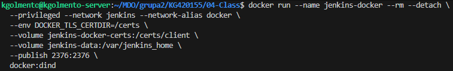

Utworzyłem odrębny plik `Dockerfile.jenkins`, w którynm zawarłem wszystkie niezbędne dane konfiguracji.

*Zrzut ekranu Dockerfile.jenkins:*
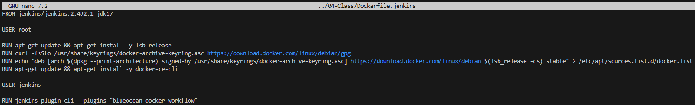

W trakcie prób zbudowania obrazu napotkałem na problemy z kompatybilnością wersji - początkowo wybrałem wersję 2.452.1, ale większość narzędzi było z nią niekompatybilne. Na szczęście wersja 2.492.1 rozwiązała ten problem.

*Zrzut ekranu błędów przy budowie obrazu:*
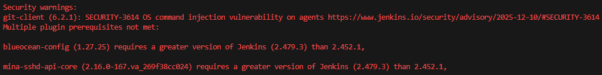

*Zrzuty ekranu wykazujące pracujące kontenery (Jenkins i DinD) oraz ekran logowania Jenkins:*
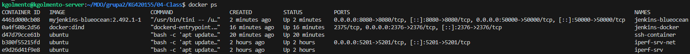
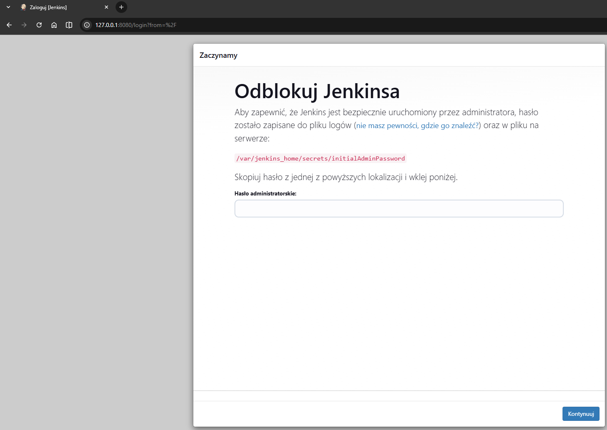
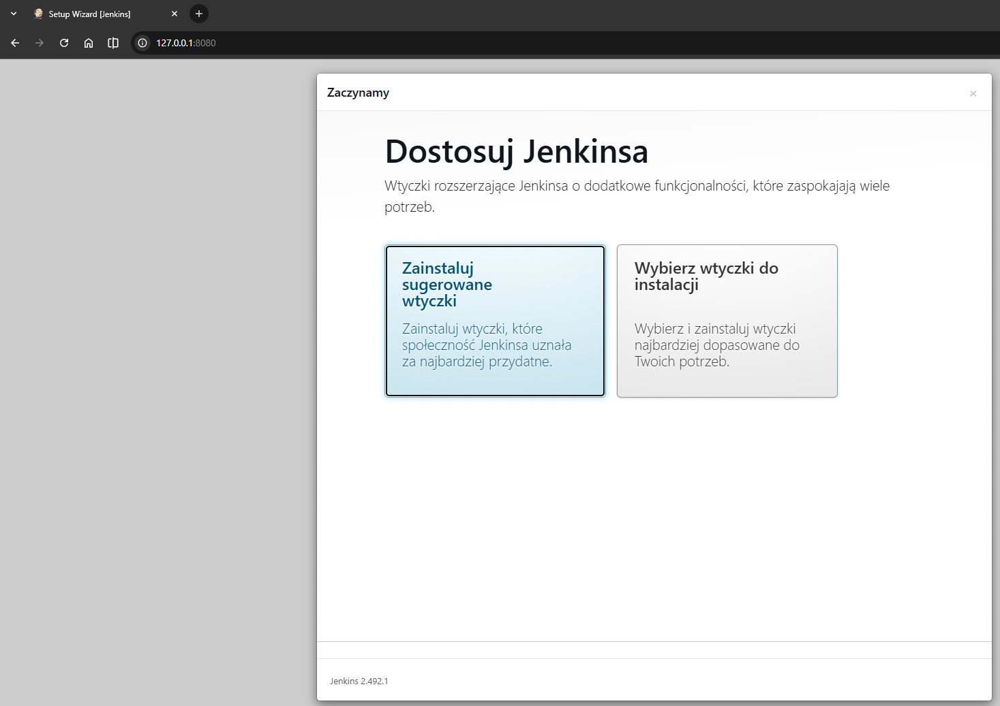