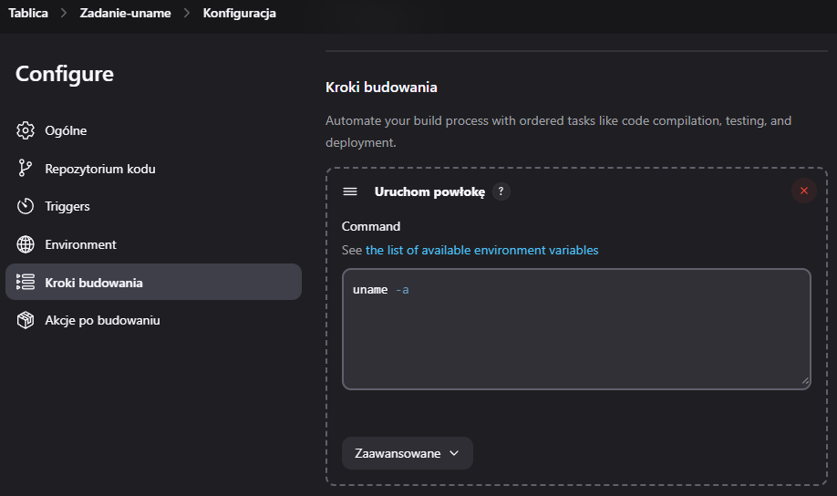
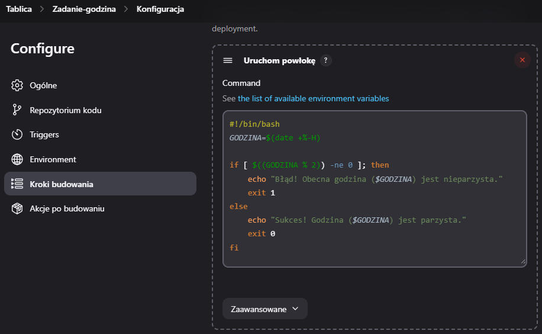
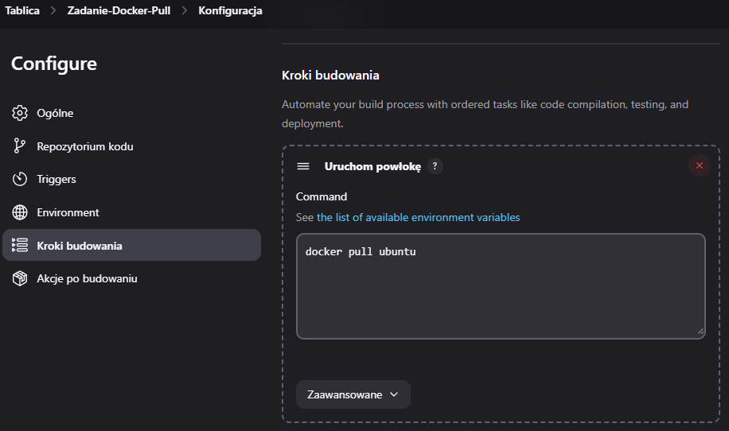
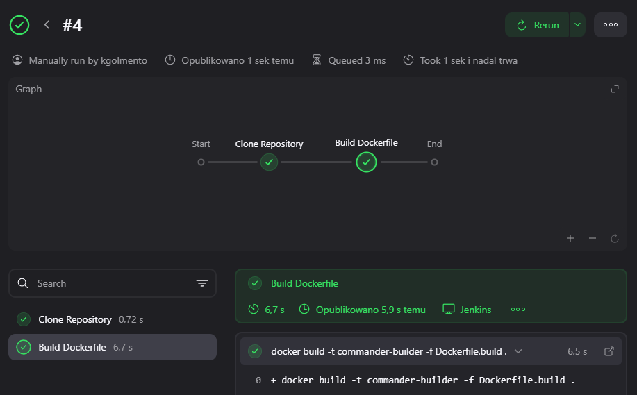
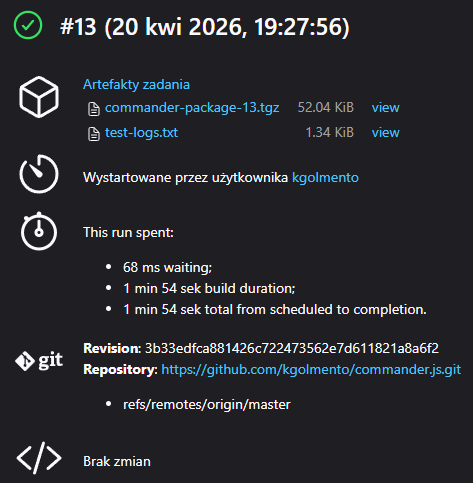
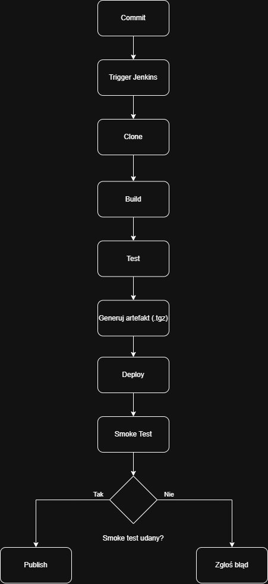
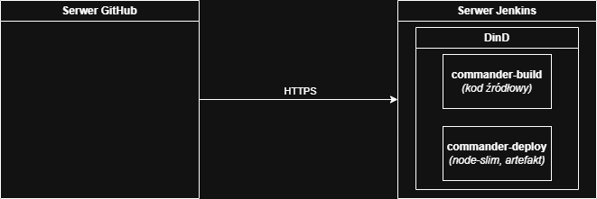
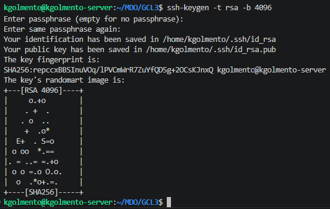
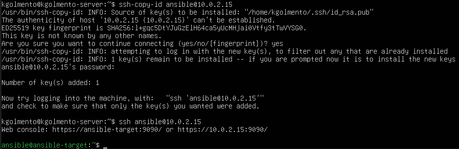

# Sprawozdanie - Metodyki DevOps (Zajęcia 5-7)

**Data:** 26.04.2026 r.
**Imię i nazwisko:** Kacper Golmento
**Grupa:** 3

---

## Zajęcia 05: Wstęp do Jenkinsa, izolacja etapów

### 1. Uruchomienie środowiska Jenkins (DinD)
Zgodnie z wytycznymi, powołałem do życia architekturę Docker-in-Docker (DinD). Uruchomiłem dwa kontenery: demona Dockera (pomocnika) oraz właściwego Jenkinsa opartego na oficjalnym obrazie, ale z doinstalowaną wtyczką BlueOcean, która w przeciwieństwie do klasycznego interfejsu Jenkinsa oferuje znacznie czytelniejszą, graficzną wizualizację potoków. Logi i ustawienia zabezpieczyłem wykorzystując trwały wolumin Dockera (`jenkins-data`).

### 2. Freestyle projects i problem z powłoką
Na początku utworzyłem 3 zadania typu "Freestyle project":
1. **Zadanie-Uname:** Pomyślnie wykonano komendę `uname -a`.
2. **Zadanie-Docker-Pull:** Pomyślnie pobrano obraz `ubuntu`, co dowiodło, że Jenkins prawidłowo komunikuje się z kontenerem DinD.
3. **Zadanie-Godzina:** Napisałem skrypt weryfikujący parzystość godziny. W trakcie jego realizacji natrafiłem na błąd: `arithmetic expression: expecting EOF`. Wynikał on z tego, że Jenkins domyślnie używa lekkiej powłoki `sh` (w Ubuntu linkowanej do `dash`), która nie obsługiwała zaawansowanego rzutowania systemów liczbowych (np. `10#$GODZINA`). Problem rozwiązałem dodając oznaczenie `#!/bin/bash` oraz modyfikując format daty (`%-H`).

### 3. Obiekt Pipeline i problem z OOM Killerem
Następnie utworzyłem pierwszy obiekt typu Pipeline, deklarując kod bezpośrednio w Jenkinsie. Skrypt miał sklonować moje repozytorium i zbudować `Dockerfile.build` dla aplikacji Commander.js. Podczas budowania obrazu połączenie z Dockerem zostało nagle przerwane (`seems to be removed or offline`). Okazało się, że maszyna wirtualna wyczerpała pamięć RAM (OOM Killer zabił proces Dockera). Posprzątałem system komendą `docker system prune -a`, zwiększyłem RAM w VirtualBoxie do 4GB i dodałem 2GB do pliku swapfile. Dzięki temu drugie uruchomienie przeszło bezproblemowo.

---

## Zajęcia 06: Kompletny Pipeline (Build, Test, Deploy, Publish)

Celem tych zajęć było stworzenie kompletnego potoku CI/CD dla sforkowanego projektu i spełnienie wszystkich warunków z listy kontrolnej.

### 1. Etap Build i Test (Konteneryzacja)
Zdefiniowałem plik [Dockerfile.build](../06-Class/Dockerfile.build), który wykorzystuje obraz `node:20.12.0-bullseye`. Odpowiada on za instalację zależności (`npm install`) oraz uruchomienie testów środowiskowych (`npm test`). Wiązało się to z iteracyjną poprawą błędów (brak rozpoznawalności wildcardów - "*", cache'owanie paczek i konieczność ich czyszczenia) i zmieniania składni Jenkinsfile'a.

### 2. Etap Deploy (Smoke Test) i walidacja danych
Prowadzący wymagał symulacji prawdziwego wdrożenia. Stworzyłem oddzielny plik [Dockerfile.deploy](../06-Class/Dockerfile.deploy) bazujący na "odchudzonym" obrazie `node:20.12.0-slim`. Z obrazu buildowego nie korzystałem, ponieważ zawiera on Gita, kod źródłowy i narzędzia deweloperskie, co nie jest potrzebne w wersji produkcyjnej.

Wdrożenie opierało się na dostarczeniu zbudowanej paczki `.tgz` do środowiska docelowego oraz uruchomieniu autorskiego skryptu [smoke-test.js](../06-Class/smoke-test.js).Ponieważ Commander.js to biblioteka CLI, mój Smoke Test polegał na zainstalowaniu paczki jako zależności, zainicjowaniu jej w skrypcie JS, sztucznym "wstrzyknięciu" argumentów konsolowych (`['node', 'test', '-d', '-p', 'hawajska']`) i sprawdzeniu, czy obiekt wyjściowy poprawnie odczytał flagi. Gwarantuje to, że paczka nie tylko się instaluje, ale też poprawnie procesuje dane w środowisku klienckim. Jeżeli flagi zostały prawidłowo odczytane, to typem pizzy jest "hawajska".

### 3. Etap Publish i Artefakty
Wybranym formatem dystrybucyjnym artefaktu został plik `tarball` (`.tgz`), co jest standardem dla paczek NPM. Zaimplementowałem archiwizację logów oraz paczki bezpośrednio w Jenkinsie (`archiveArtifacts`).

W kroku Publish wystąpił problem - komenda `npm publish` wykonana w agencie Jenkinsa zgłosiła błąd `npm: not found`. Naprawiłem to, używając do publikacji lekkiego kontenera: `docker run --rm node:20.12.0-slim npm publish --dry-run`.

W ramach ćwiczeń miałem również przygotować diagramy wdrożenia i aktywności procesu CI/CD. Przedstawiają one opisany wyżej proces.

---

## Zajęcia 07: Jenkinsfile i przygotowanie do Ansible

### 1. Jenkinsfile i weryfikacja poprawności działania
Przeniosłem definicję Pipeline'u z GUI Jenkinsa do pliku [Jenkinsfile](../07-Class/Jenkinsfile) w głównym katalogu mojego forka (tzw. konfiguracja *Pipeline script from SCM*). Dzięki temu mój potok budowania stał się częścią kodu źródłowego. 

Aby zapewnić, że pipeline działa poprawnie za każdym razem (nawet kilkukrotnie z rzędu na tej samej maszynie), dodałem na początku i na końcu instrukcję `cleanWs()`. Usuwa ona całą starą przestrzeń roboczą, zmuszając agenta do każdorazowego pobrania świeżego kodu z repozytorium.

### 2. Środowisko dla Ansible
Zgodnie z poleceniem, stworzyłem drugą, lekką maszynę wirtualną jako host docelowy dla systemu Ansible. Skonfigurowałem ją pod kontrolą dystrybucji **Fedora Server 23**, upewniając się, że usługi `tar` oraz `sshd` są włączone. Założyłem tam użytkownika `ansible`.

Próba wymiany kluczy `ssh-copy-id` między systemami początkowo zawiodła przez izolację NAT. Okazało się, że obie maszyny wirtualne w VirtualBoxie działały dzieląc ten sam adres IP (`10.0.2.15`). Rozwiązanie problemu wymagało zmiany konfiguracji maszyn w VirtualBoxie, dodaniu wspólnej sieci NAT oraz osobnych kart sieciowych dla obu maszyn aby mogły się ze sobą komunikować wewnętrznie. Po tej operacji maszyny odnalazły się w sieci bezbłędnie. Z sukcesem przekazałem klucz RSA i mogłem zalogować się z hosta na `ansible-target` (Fedorę) bez podawania hasła. 

---

## Podsumowanie 

Posiadam w 100% zautomatyzowany rurociąg CI/CD przechowywany w repozytorium. Rurociąg wykonuje odizolowany Build, Test oraz wdraża artefakt `.tgz` na docelowe środowisko weryfikując jego działanie poprzez Smoke Test. Architektura maszyn wirtualnych jest poprawnie skonfigurowana do przyszłych testów wdrażania za pomocą Ansible.