# Sprawozdanie - Metodyki DevOps (Zajęcia 08-11)

**Data:** 02.06.2026 r.
**Imię i nazwisko:** Kacper Golmento
**Grupa:** 3

---

## Zajęcia 08: Automatyzacja i zdalne wykonywanie poleceń za pomocą Ansible

### 1. Inwentaryzacja i konfiguracja początkowa
Przed przystąpieniem do pisania playbooków, przygotowałem infrastrukturę zgodnie z wytycznymi. Dokonałem inwentaryzacji, używając polecenia `hostnamectl` do nadania nazw maszynom oraz skonfigurowałem nazwy DNS w pliku `/etc/hosts`. Wymieniłem klucze SSH za pomocą `ssh-copy-id`, co pozwoliło na bezhasłowe logowanie z maszyny-mastera na hosta docelowego. Następnie utworzyłem formalny plik inwentaryzacji [inventory.ini](../08-Class/inventory.ini), w którym podzieliłem środowisko na sekcje `Orchestrators` oraz `Endpoints`.

### 2. Zdalne wywoływanie procedur i zarządzanie konfiguracją
Pierwsze testy automatyzacji przeprowadziłem za pomocą bazowego playbooka [system_playbook.yml](../08_Class/system_playbook.yml). Z powodzeniem wykonałem serię operacji administracyjnych: wysłałem żądanie `ping`, skopiowałem plik inwentaryzacji na maszyny z grupy `Endpoints`, zaktualizowałem pakiety systemowe oraz zrestartowałem kluczowe usługi, takie jak `sshd` i `rngd`. Zbadanie zachowania systemu przy wyłączonym serwerze SSH oraz odpiętej karcie sieciowej pozwoliło mi zaobserwować, jak Ansible radzi sobie z obsługą błędów (unreachable hosts).

### 3. Refaktoryzacja do struktury Ról (Roles)
Zrezygnowałem z monolitycznego pliku playbooka na rzecz ustandaryzowanej Roli Ansible. Zainicjowałem strukturę poleceniem `ansible-galaxy init deploy_app` i uzupełniłem plik [meta/main.yml](../08-Class/deploy_app/meta/main.yml), definiując wspieraną architekturę (Fedora) oraz zależności. Pozwala to na łatwą re-używalność kodu w przyszłych projektach.

### 4. Rozwiązywanie problemów z DNF5
Podczas uruchamiania playbooka natrafiłem na specyficzny problem związany z ewolucją systemów operacyjnych. Maszyna docelowa oparta na Fedorze korzystała z najnowszego menedżera pakietów `dnf5`, z którym standardowy moduł `ansible.builtin.dnf` nie był w pełni kompatybilny, co skutkowało błędem Pythona.

Jako workaround zastosowałem bezpośrednie wywołanie powłoki z odpowiednią rejestracją zmiennych, aby zachować kluczową dla Ansible właściwość **idempotentności** (zgłaszanie zmiany tylko, gdy pakiet faktycznie wymagał instalacji):
```yaml
- name: Instalacja Dockera (Obejscie bledu DNF5)
  ansible.builtin.command: dnf install -y docker
  register: docker_install
  changed_when: "'Nothing to do.' not in docker_install.stdout"
```

## Zajęcia 09: Pliki odpowiedzi dla wdrożeń nienadzorowanych

Celem zajęć było przygotowanie środowiska instalacyjnego, które automatycznie postawi system i wdroży aplikację bez żadnej ingerencji z zewnątrz.

### 1. Skrypt Kickstart i pułapki systemowe
Opracowałem plik [ks.cfg](../09-Class/ks.cfg), który formatował dysk i ustawiał sieć. W sekcji `%post` wygenerowałem plik usługi `systemd`, która po zainstalowaniu systemu automatycznie pobierała paczkę `.tgz` z mojego lokalnego serwera HTTP (uruchomionego w Pythonie) i inicjalizowała kontener przy pierwszym starcie produkcyjnym. W ten sposób mogłem nawiązać interakcję z Dockerem spoza instalatora.

### 2. Analiza i rozwiązywanie problemów sprzętowo-sieciowych
Środowisko instalacyjne okazało się bardzo wrażliwe na infrastrukturę wirtualną. Napotkałem i rozwiązałem 4 kluczowe problemy:
1. **Awaria Repo (Flaky Infrastructure):** Instalator Anaconda przerywał instalację z powodu błędnego działania dynamicznej listy serwerów lustrzanych Fedory. Wymusiłem stabilność podając bezpośrednie linki w dyrektywach `url` i `repo`.
2. **Brak sieci w docelowym systemie:** System po instalacji wstawał z wyłączonym interfejsem. Załatałem plik Kickstart dodając jawną flagę `--onboot=on` oraz testując awaryjne podniesienie sieci za pomocą polecenia `nmcli device connect enp0s3`.
3. **Soft Lockup (Zator na CPU):** Analiza zrzutów jądra (Kernel Logs) wykazała błąd `BUG: soft lockup - CPU#0 stuck for 23s`. Demon Dockera przy pierwszej próbie pobrania obrazu całkowicie zamrażał pojedynczy wątek wirtualnego procesora. Zwiększenie zasobów maszyny wirtualnej do 2 vCPU i 4096 MB RAM trwale wyeliminowało problem z dławieniem się zasobów.
4. **Race Condition (Sytuacja wyścigu w systemd):** Aplikacja wyrzucała błąd `Temporary failure in name resolution`. Wynikało to z faktu, że moja usługa startowała szybciej niż daemon sieciowy przydzielił adresy serwerów DNS. Dodanie flagi `Wants=network-online.target` w pliku serwisu zsynchronizowało proces uruchamiania.

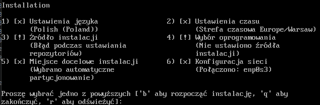
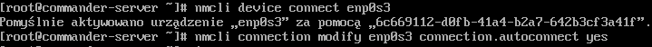
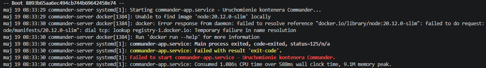
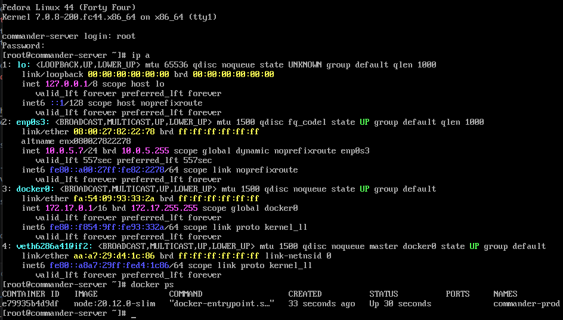

### 3. Konfiguracja użytkowników i zakres rozszerzony
Dbając o bezpieczeństwo systemu, w pliku `ks.cfg` ustawiłem unikalny `hostname` maszyny oraz utworzyłem dedykowanego użytkownika systemowego, celowo unikając użycia domyślnych nazw takich jak `user` czy `localhost`. Zrealizowałem również elementy z zakresu rozszerzonego: zadbałem o to, aby instalacja aplikacji w sekcji `%post` nie przebiegała całkowicie w tle. Skonfigurowałem plik Kickstart tak, aby logi z działań sekcji `%post` wyświetlały się bezpośrednio na ekranie wirtualnej konsoli (poprzez przekierowanie wyjścia i użycie polecenia `chvt 3`).

---

## Zajęcia 10: Kubernetes (K8s) - Architektura i Wdrażanie

### 1. Uruchomienie klastra i testy manualne (CLI)
Po udanej instalacji środowiska Minikube uruchomiłem interfejs graficzny *Dashboard* i otworzyłem go w przeglądarce, co stanowiło pierwszy dowód na poprawną łączność z klastrem. Zanim przeszedłem do dalszych działań, wykazałem poprawne działanie moich kontenerów poprzez manualne powołanie Poda. Użyłem polecenia `kubectl run` i wyprowadziłem port komendą `kubectl port-forward`, co pozwoliło mi na bezpośrednią komunikację z eksponowaną funkcjonalnością z poziomu przeglądarki.

### 2. Przygotowanie aplikacji do K8s
Dokonałem pivotu projektu i przygotowałem trzy własne obrazy oparte na `nginx` (Wersja 1, Wersja 2 oraz wersja "Broken"), które ładowałem bezpośrednio do klastra komendą `minikube image load`, unikając opóźnień sieciowych z Docker Hub. Dodatkowo, aby zminimalizować dławienie się Minikube, przydzieliłem mu dedykowane parametry startowe (`--cpus 2 --memory 4096`).

### 3. Cykl życia Deploymentu i Skrypty walidacyjne
Stworzyłem plik [deployment.yaml](../10-Class/deployment.yaml) i testowałem mechanizmy skalowania. Zgodnie z wymaganiami, napisałem skrypt weryfikujący (timeout 60 sekund) [verify-rollout.sh](../10-Class/verify-rollout.sh), korzystając z flag dostępnych w `kubectl rollout status`. 
Symulacja wdrożenia obrazu wadliwego wyłapała błąd zamykającego się kontenera (`CrashLoopBackOff`), co potwierdził skrypt walidacyjny. Klaster przywróciłem do stanu stabilnego korzystając z polecenia `kubectl rollout undo`.

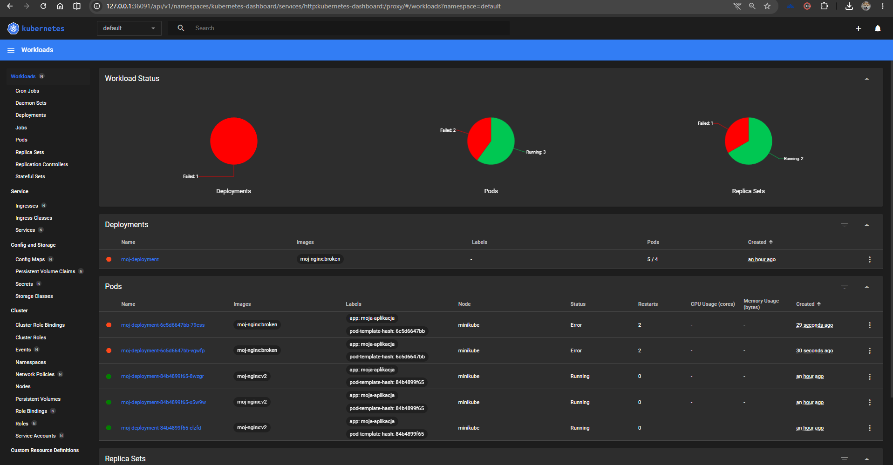
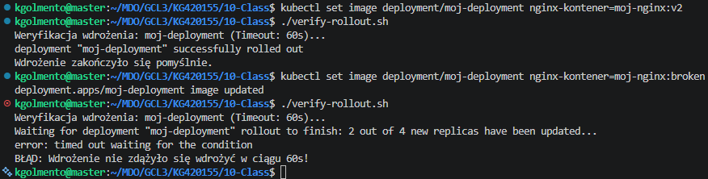
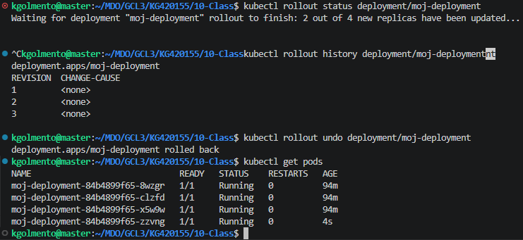

### 4. Operacje skalowania i zaawansowane strategie wdrożeń
Wykorzystując deklaratywny plik YAML, dokładnie przetestowałem mechanizmy skalowania. Aktualizowałem plik i aplikowałem go (`kubectl apply`), zmieniając liczbę replik najpierw na 8, później na 1, następnie do 0, aby ostatecznie powrócić do 4 replik. Przy liczbie replik równej 0 oczywiście nie dało się nawiązać połączenia.

### 5. Canary Deployment - Analiza rozdziału ruchu
Zaprojektowałem środowisko Canary za pomocą podziału na dwie grupy podów różniących się etykietą (`track: stable` vs `track: canary`), powiązanych tym samym Serwisem. 
W trakcie testów zauważyłem, że standardowe komendy narzędzia deweloperskiego (np. `kubectl port-forward svc/...`) nie wykazują działania mechanizmu Canary, ponieważ nawiązują sztywny tunel TCP do pojedynczego Poda, ignorując balancer ruchu klastra (`kube-proxy`). Prawidłowe działanie udowodniłem uruchamiając dodatkowy Pod diagnostyczny wewnątrz klastra, co potwierdziło rozdzielanie ruchu w stosunku 75% do 25%.

Oprócz udokumentowanej wcześniej strategii Canary, zaimplementowałem i zaobserwowałem różnice w pozostałych strategiach:
* **Recreate:** Powodowała chwilowy *downtime*, ponieważ bezwzględnie zabijała wszystkie stare pody przed powołaniem nowych.
* **Rolling Update:** Z wykorzystaniem parametrów `maxUnavailable` > 1 oraz `maxSurge` > 20%, co pozwoliło na płynną aktualizację wersji aplikacji poprzez stopniowe podmienianie instancji bez odcinania użytkowników od serwisu.

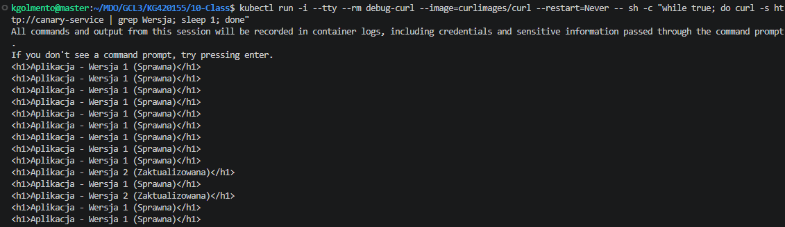

---

## Zajęcia 11: Kubernetes - Skalowanie i Sieci (Networking)

W ramach ostatnich zajęć uruchomiłem Deployment składający się z 36 replik serwera Nginx. Użycie tego obrazu pozwoliło mi na lepsze zbadanie zachowania dużych aplikacji oraz możliwości ich skalowania i łączenia z nimi.

### 1. Rodzaje ekspozycji usług
Wyeksponowałem środowisko na 4 sposoby, weryfikując jak Kubernetes routuje pakiety:
* Tunel bezpośredni do jednego Poda (`kubectl port-forward pod/...`).
* Do obiektu Deployment (tunel dobiera pierwszego dostępnego Poda).
* Za pomocą Serwisu wygenerowanego imperatywnie (`kubectl expose`).
* Za pomocą Serwisu zadeklarowanego w własnym pliku YAML.

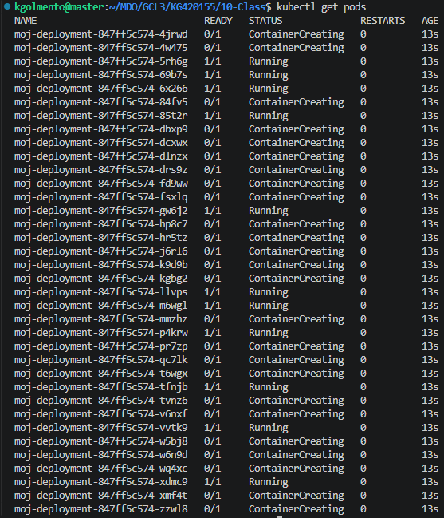
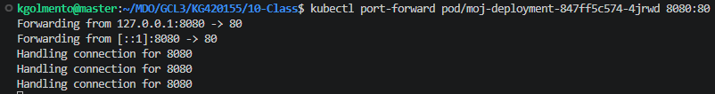
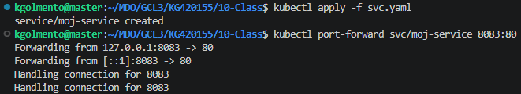

### 2. Skalowanie: Imperatywne kontra Deklaratywne
Przetestowałem proces skalowania w dół używając polecenia `kubectl scale`. Zauważyłem, że chociaż komenda działa natychmiastowo, prowadzi to do niebezpiecznej rozbieżności między stanem faktycznym klastra, a moim kodem źródłowym w pliku YAML. 

Zmiana deklaratywna – modyfikację pola `replicas` w pliku YAML i zatwierdzenie go komendą `apply` omija ten problem. Dzięki temu moje środowisko posiada jedno źródło prawdy, a nie dwa, co zapobiega potencjalnym problemom komunikacyjnym.

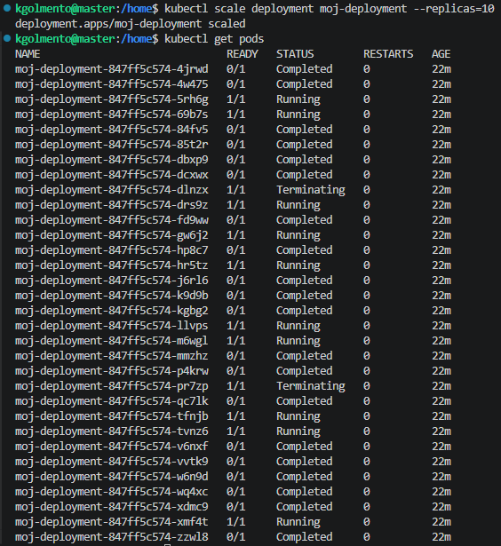
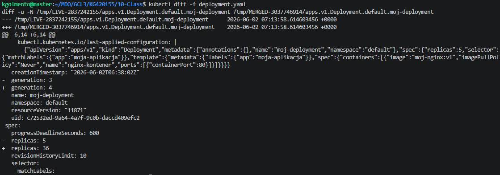

### 3. Wizualizacja rozkładu obciążenia
Aby potwierdzić mechanizm równoważenia obciążenia (Round-Robin) realizowany przez Serwis klastra K8s, zaprzągłem do pracy Pod-generator ruchu (`traffic_generator`). Analizując strumień za pomocą flagi filtrowania etykiet (`kubectl logs -l app=web-server -f --prefix`), wykazałem, że zapytania są prawidłowo i sprawiedliwie rozdzielane między wszystkimi aktywnymi po przeskalowaniu Podami.

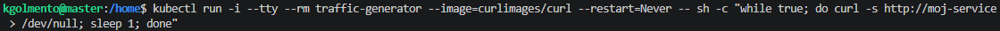
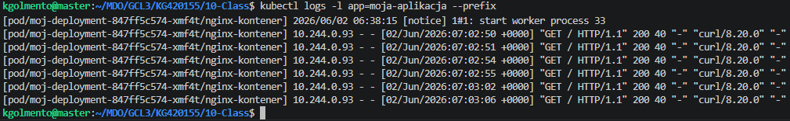

---

## Podsumowanie
Cykl laboratoriów 08-11 pozwolił mi na praktyczne opanowanie transformacji "od maszyny do mikroserwisów". Największą wartość wyniosłem z identyfikowania problemów na niskim poziomie (interakcje Kernela, DNS, Systemd) oraz dogłębnego zrozumienia różnicy pomiędzy zarządzaniem imperatywnym (komendy) a architekturą w pełni deklaratywną wymaganą przez Kubernetes. Zbudowane środowisko K8s jest przygotowane na automatyczne wdrożenia z poziomu systemów CI/CD.