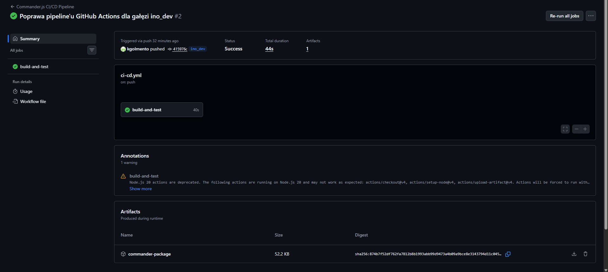

# Sprawozdanie - Metodyki DevOps (Zajęcia 12)

**Data:** 09.06.2026 r.  
**Imię i nazwisko:** Kacper Golmento  
**Grupa:** 3  

---

## Zajęcia 12: Shift-left: Potoki CI/CD w środowisku GitHub Actions

### 1. Przygotowanie infrastruktury repozytorium i gałęzi
Zgodnie z wytycznymi bezpieczeństwa i separacji kodu, operacje wykonywałem na wcześniej przygotowanym *forku* oficjalnego repozytorium oprogramowania **Commander.js**. 

Następnie, utworzyłem branch deweloperski, na którym dokonywałem zmian i którego zmiana wyzwalała **trigger** mojej akcji.

---

### 2. Definicja workflow'ów i wyzwalaczy (triggerów)

W katalogu .github/workflows/ usunąłem obecne w nim pliki i stworzyłem własny plik konfiguracyjny [ci-cd.yml](../12-Class/ci-cd.yml). Na początku skupiłem się na otrzymaniu reakcji na wypychanie zmian na tą gałąź (trigger `on push:`), co zakończyło się sukcesem. Dodałem również wyzwalacze `pull_request:` i `workflow_dispatch`, celem ręcznego uruchamiania potoku. Następnie przystąpiłem do przenoszenia struktury pipeline'u z Jenkinsa.

---

### 3. Odtworzenie struktury pipeline'u

Odtworzenie struktury mojego pipeline'u było relatywnie łatwe z uwagi na jego prostotę. Plik akcji jest jeszcze prostszy, niż pipeline z Jenkinsa, toteż zmiana nie była trudna. Każda z akcji jest osobnym krokiem w sekcji **jobs**.

Po wypchnięciu zmian na repozytorium w gałęzi deweloperskiej akcja zadziałała bez problemu i utworzyła artefakt [commander-package.zip](../12-Class/commander-package.zip).

Aby nie obawiać się przekroczenia limitów przechowywania plików przez GitHub ograniczyłem żywotność utworzonych artefaktów do jednego dnia parametrem `retention-days: 1`. Niestety, limity oferowane przez GitHub Actions są dość restrykcyjne i w przypadku większych repozytoriów można narazić się na dodatkowe koszta.

---

### Podsumowanie

Implementacja potoku w GitHub Actions pozwoliła na pełną realizację podejścia Shift-left. Proces budowania i testowania oprogramowania został w 100% zintegrowany z repozytorium kodu, eliminując konieczność utrzymywania zewnętrznego serwera automatyzacji (np. Jenkins), przynajmniej teoretycznie. W praktyce GitHub Actions w dalszym ciągu jest nowym rozwiązaniem, które ma wiele wad. Pomimo tego, niektóre organizacje już teraz decydują się przechodzić na nie z uwagi na jego prostotę i bliskość z kodem źródłowym.

Zastosowanie deklaratywnych akcji wielokrotnego użytku (actions/checkout, upload-artifact) pozwoliło na czyste odtworzenie struktury pipeline'u przy zerowych kosztach finansowych, dzięki optymalnemu wykorzystaniu zasobów. Z uwagi na niewielki rozmiar mojego repozytorium nie musiałem obawiać się przekroczenia limitów GitHub Actions. 