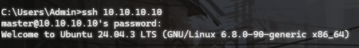
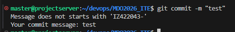

# Sprawozdanie 1

1. git

Autoryzacja gita poprzez Github CLI - `github auth login`

2. VM

Maszyna wirtualna z ubuntu, z kartą sieciową host-only do połączeń ssh



3. githook 

Plik hook'a: `.git/hooks/commit-msg`

```sh
#!/bin/bash

REQUIRED_PREFIX="IZ422043-"

COMMIT_MSG_FILE="$1"
COMMIT_MSG=$(head -n1 "$COMMIT_MSG_FILE")

if [[ "$COMMIT_MSG" != "$REQUIRED_PREFIX"* ]]; then
  echo "Message does not starts with '$REQUIRED_PREFIX'"
  echo "Your commit message: $COMMIT_MSG"
  exit 1
fi

exit 0
```


4. Pull request


