# Zajęcia 10 – Kubernetes: wdrażanie kontenerów
# 1. Cel ćwiczenia

Celem ćwiczenia było uruchomienie lokalnego klastra Kubernetes w środowisku Minikube oraz wykonanie pełnego cyklu życia aplikacji kontenerowej: od uruchomienia poda, przez deployment, skalowanie, aktualizacje wersji, aż po rollback i obsługę błędnych obrazów.

---

# 2. Środowisko

W ćwiczeniu wykorzystano:

- Kubernetes
- Minikube
- kubectl
- Docker

---

# 3. Uruchomienie klastra

Klaster uruchomiono poleceniem:

```
minikube start --driver=docker
```

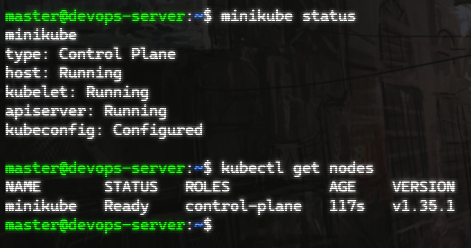

---

# 4. Dashboard Kubernetes

Uruchomiono dashboard:

```
minikube dashboard
```

Oraz proxy do łączenia się z dashboardem VM z hosta

```
kubectl proxy --address=0.0.0.0 --accept-hosts='.*'
```

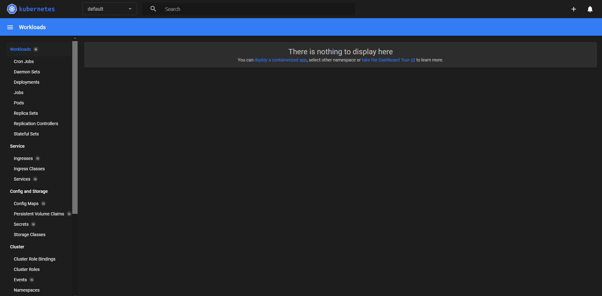

---

# 5. Uruchomienie poda

```
kubectl run nginx-test --image=nginx --port=80
```

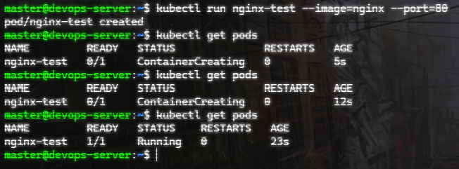

---

# 6. Dostęp do aplikacji

```
kubectl port-forward pod/nginx-test 8080:80
```

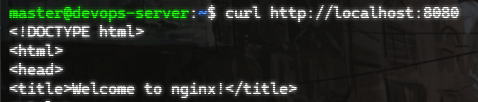

---

# 7. Własny kontener

Zbudowano obraz na postawie Dockerfile:
```
FROM nginx:alpine
COPY ./index.html /usr/share/nginx/html
```

```
docker build -t myapp:v1 .
```

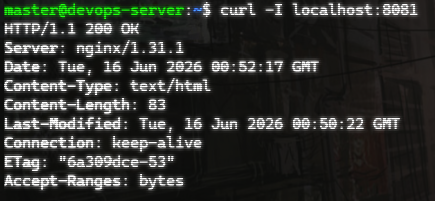

---

# 8. Deployment

```
kubectl create deployment myapp --image=myapp:v1
```

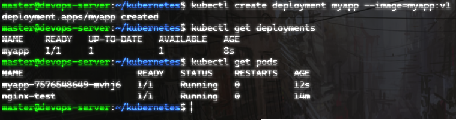

---

# 9. Service

```
kubectl expose deployment myapp --port=80 --type=ClusterIP
```

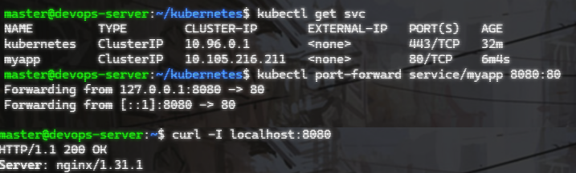

---

# 10. Skalowanie

```
kubectl scale deployment myapp --replicas=4
```

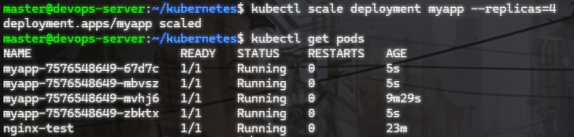

--- 

# 11. Aktualizacja

```
kubectl set image deployment/myapp myapp=myapp:v2
```

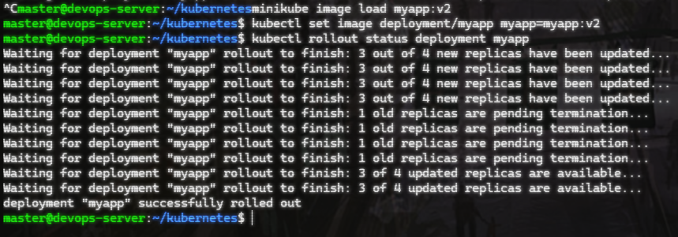

--- 

# 12. Rollback

```
kubectl rollout undo deployment myapp
```

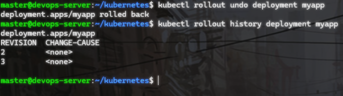

--- 

# 13. Błędna wersja

Błędny kontener zbudowany za pomocą pliku Dockerfile.fail
```
FROM alpine
CMD ["false"]
```

```
kubectl set image deployment/myapp myapp=myapp:v3
```

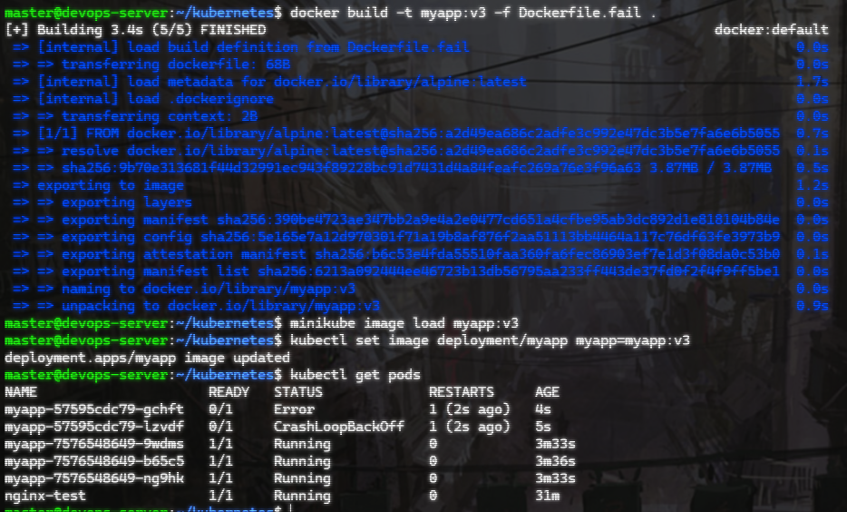

---

# 14. Dashboard – błąd

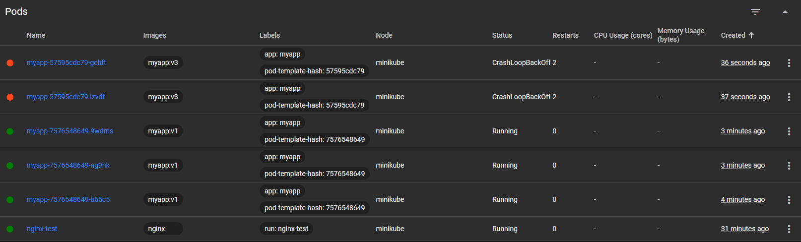

---

# 15. Wnioski

Minikube umożliwia szybkie uruchomienie lokalnego środowiska Kubernetes. Kubernetes zapewnia automatyczne zarządzanie kontenerami, skalowanie oraz mechanizmy rollback. Dzięki temu możliwe jest bezpieczne wdrażanie aplikacji oraz testowanie wielu wersji bez przerywania działania systemu.