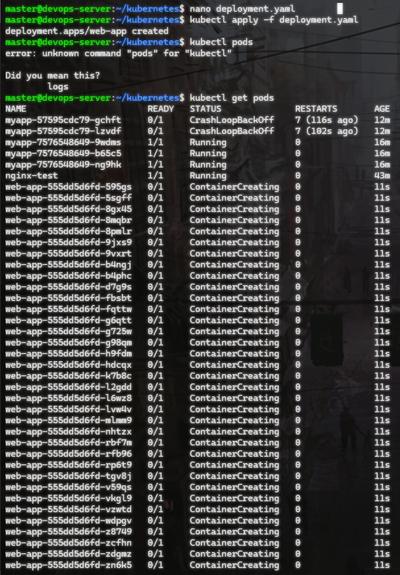
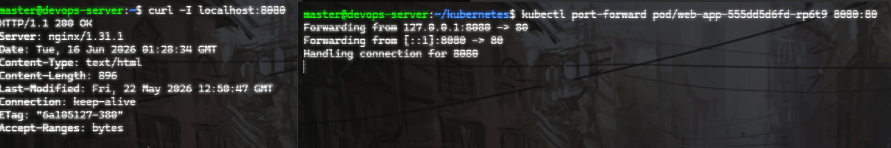
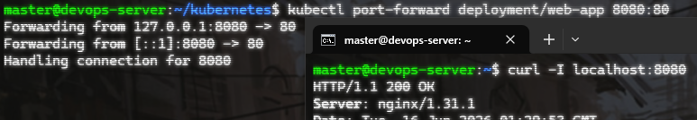
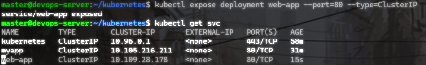
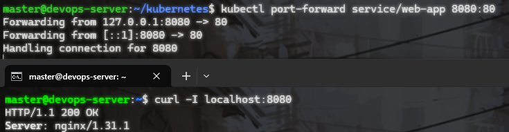
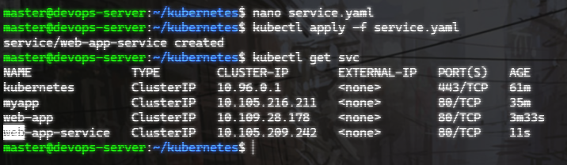
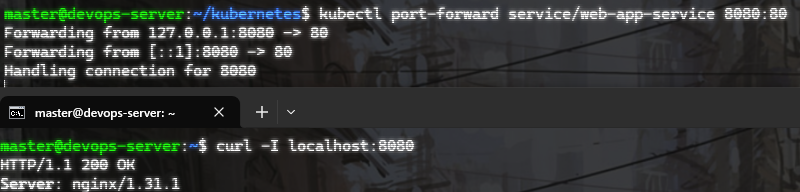
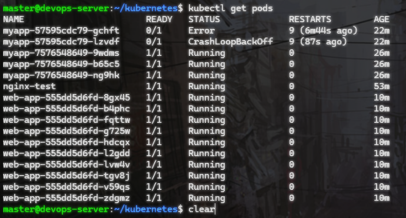
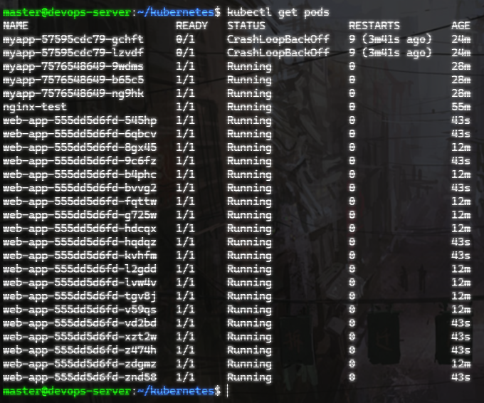

# Sprawozdanie – Eksponowanie aplikacji w Kubernetes

# 1. Cel ćwiczenia

Celem ćwiczenia było wdrożenie aplikacji webowej w klastrze Kubernetes przy użyciu Deploymentu z dużą liczbą replik, a następnie jej eksponowanie na różne sposoby: bezpośrednio z poda, poprzez Deployment oraz poprzez Service. Dodatkowo wykonano skalowanie aplikacji metodą imperatywną i deklaratywną.

# 2. Przygotowanie Deploymentu

Plik deployment.yaml
```
apiVersion: apps/v1
kind: Deployment
metadata:
  name: web-app
spec:
  replicas: 36
  selector:
    matchLabels:
      app: web-app
  template:
    metadata:
      labels:
        app: web-app
    spec:
      containers:
      - name: web-app
        image: nginx
        ports:
        - containerPort: 80
```

Wdrożenie:
```
kubectl apply -f deployment.yaml
```



# 3. Eksponowanie aplikacji

## A: Dostęp do pojedynczego poda

Port-forward do jednego poda:
```
kubectl port-forward pod/<nazwa-poda> 8080:80
```



## B. Dostęp do Deploymentu

```
kubectl port-forward deployment/web-app 8080:80
```



## C. Eksponowanie przez Service

Tworzenie service
```
kubectl expose deployment web-app --port=80 --type=ClusterIP
```




Dostęp przez service

```
kubectl port-forward service/web-app 8080:80
```



Service – YAML

```
apiVersion: v1
kind: Service
metadata:
  name: web-app-service
spec:
  selector:
    app: web-app
  ports:
    - port: 80
      targetPort: 80
  type: ClusterIP
```

```
kubectl apply -f service.yaml
```



Dostęp przez YAML service

```
kubectl port-forward service/web-app-service 8080:80
```



# 4. Skalowanie wdrożenia

## A. Imperatywne

```
kubectl scale deployment web-app --replicas=10
```



## B. YAML

```
spec:
    replicas: 20
```

```
kubectl apply -f deployment.yaml
```




# 5. Wnioski

- Deployment umożliwia łatwe zarządzanie wieloma replikami aplikacji
- Service zapewnia stabilny punkt dostępu do aplikacji
- Port-forward pozwala na szybkie testowanie bez Ingress
- Skalowanie można realizować zarówno imperatywnie, jak i deklaratywnie
- Kubernetes automatycznie utrzymuje zadaną liczbę replik