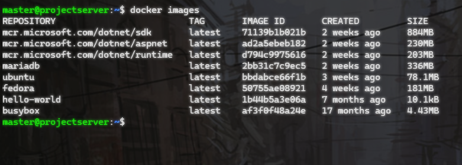
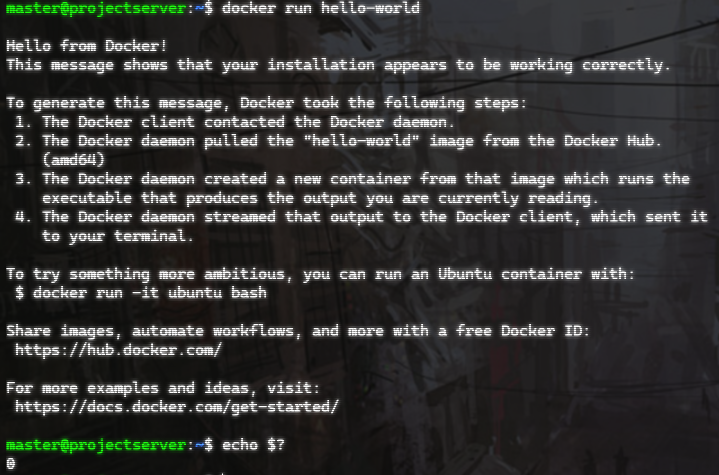
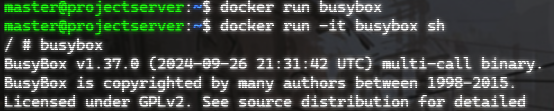
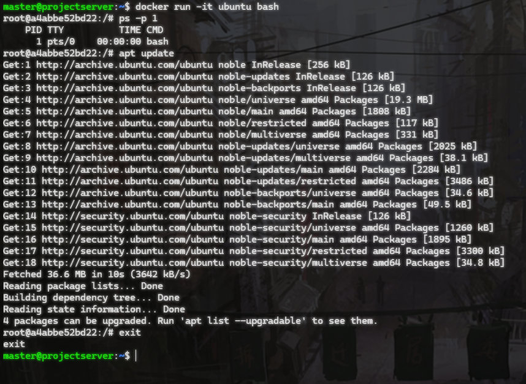
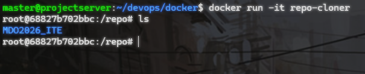
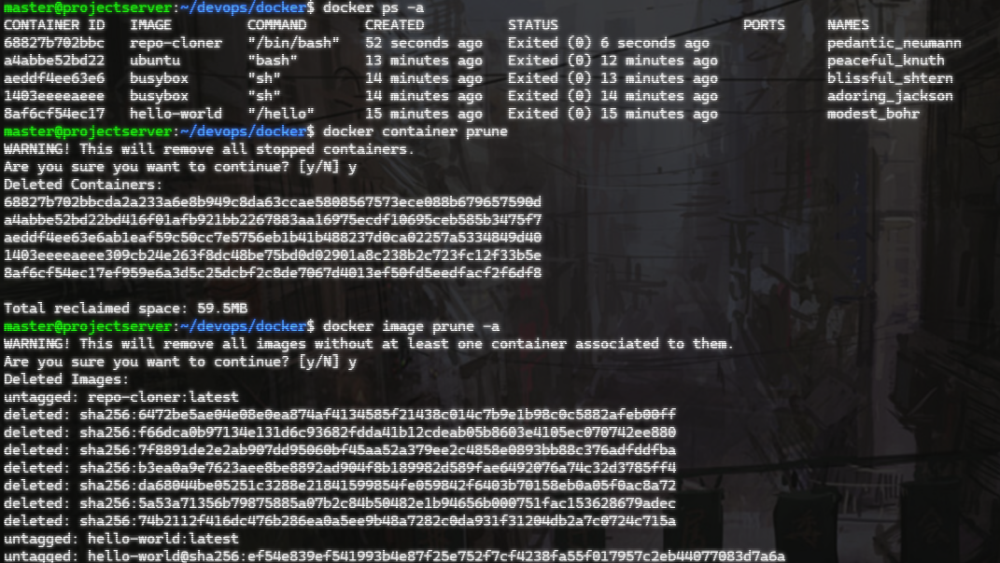

# Sprawozdanie 1

1. Setup

Instalacja dockera: `apt install  docker.io`

Uruchomienie deamona:

```sh
systemctl enable docker
systemctl start docker
```

Zalogowanie się na dockerhub: `docker login`

2. Obrazy

Pobranie obrazu: `docker pull NAZWA`

Lista obrazów: `docker images`


3. Uruchomienie obrazu i kod wyjścia

Uruchomienie: `docker run NAZWA`

Sprawdzenie kodu wyjścia `echo $?`



4. Uruchomienie busybox

Kontener uruchamia się i kończy działanie

Uruchomienie w trybie interaktywnym: `docker run -it busybox sh`



4. Uruchomienie systemu w kontenerze

`docker run -it ubuntu bash`

Wyświetlenie PID1: `ps -p 1`
Aktualizacja pakietów: `apt update`
Wyjście: `exit`



5. Dockerfile 

```dockerfile
FROM ubuntu:latest

#Instalacja git
RUN apt update && \
    apt install -y git && \
    apt clean

WORKDIR /repo

#Klonowanie repozytorium
RUN git clone https://github.com/InzynieriaOprogramowaniaAGH/MDO2026_ITE.git

CMD ["/bin/bash"]
```

Zbudowanie kontenera: `docker build -t repo-cloner .` 

Uruchomienie kontenera `docker run -it repo-cloner`



6. Zarządzanie

Pokaż uruchomione kontenery: `docker ps -a`

Wyczyść zakończone kontenery: `docker container prune`

Wyczyść obrazy przechowywane w lokalnym magazynie: `docker image prune -a`


