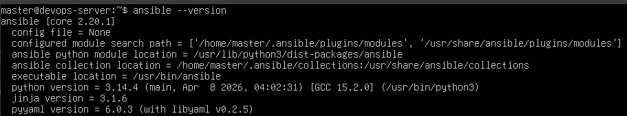
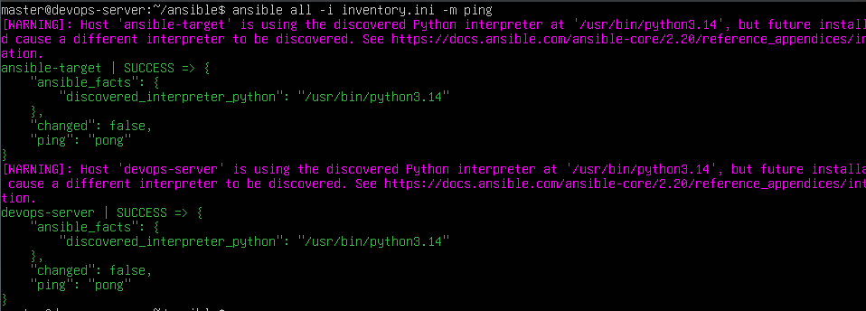
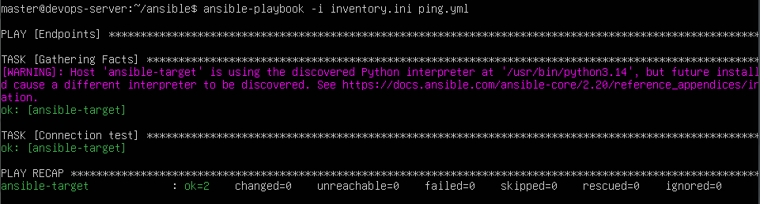
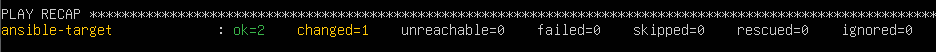
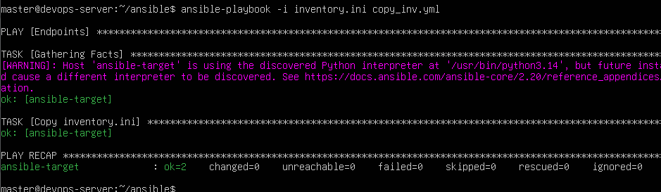
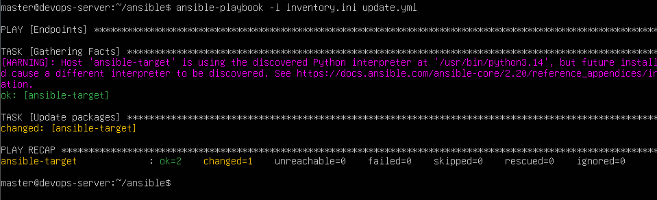
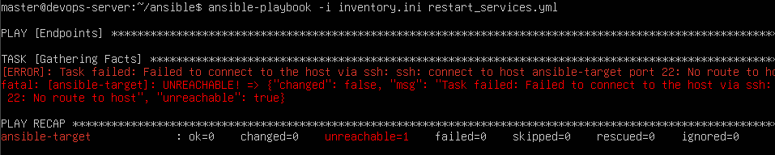
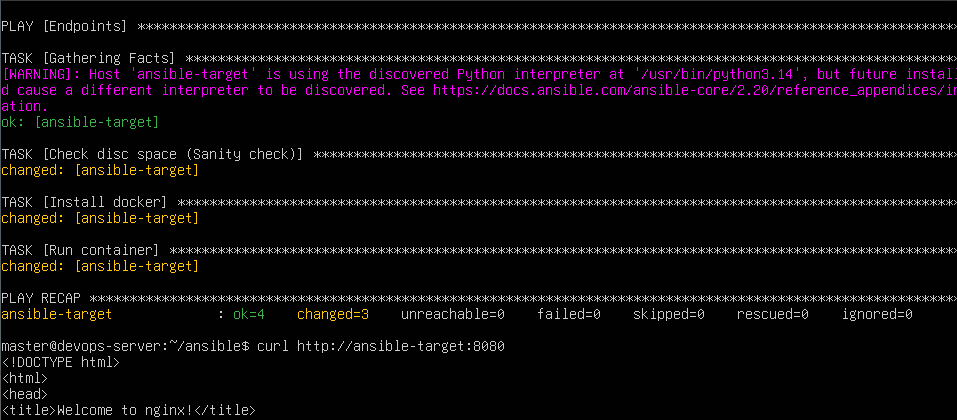
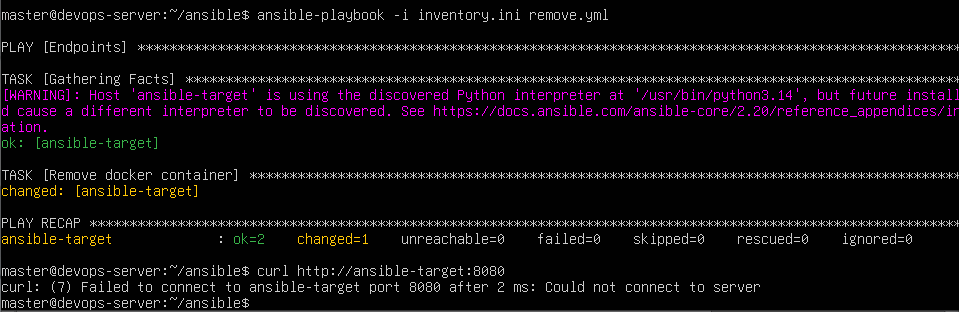

# Sprawozdanie – Automatyzacja i zdalne wykonywanie poleceń za pomocą Ansible

# 1. Cel ćwiczenia

Celem ćwiczenia było poznanie narzędzia Ansible do automatyzacji administracji systemami Linux, przygotowanie środowiska złożonego z kilku maszyn wirtualnych, skonfigurowanie komunikacji SSH bez użycia haseł oraz wykonanie operacji administracyjnych za pomocą playbooków Ansible.

---

# 2. Przygotowanie środowiska

## 2.1. Utworzenie maszyny docelowej

Utworzono dodatkową maszynę wirtualną.
Po zakończeniu instalacji wykonano migawkę maszyny.

---

## 2.2. Instalacja Ansible

Na maszynie głównej zainstalowano Ansible z repozytorium systemowego.



---

## 2.3. Konfiguracja SSH

Wygenerowano klucz SSH:

```bash
ssh-keygen
```

Skopiowano klucz na maszynę docelową:

```bash
ssh-copy-id ansible@ansible-target
```

Test połączenia:

```bash
ssh ansible@ansible-target
```

Logowanie odbywało się bez podawania hasła.

---

# 3. Inwentaryzacja systemów

## 3.1. Konfiguracja nazw hostów

Sprawdzono i ustawiono nazwy hostów w `/etc/hosts`

---

## 3.2. Utworzenie pliku inventory

Plik `inventory.ini`:

```ini
[Orchestrators]
devops-server ansible_user=master

[Endpoints]
ansible-target ansible_user=ansible
```

---

## 3.3. Test łączności

Polecenie:

```bash
ansible all -i inventory.ini -m ping
```




Potwierdzono poprawną komunikację między maszynami.

---

# 4. Zdalne wywoływanie procedur

## 4.1. Playbook testujący połączenie

Plik `ping.yml`:

```yaml
---
- hosts: all
  tasks:
    - name: Test połączenia
      ping:
```

Uruchomienie:

```bash
ansible-playbook -i inventory.ini ping.yml
```



---

## 4.2. Kopiowanie pliku inventory

Playbook:

```yaml
---
- hosts: Endpoints
  become: true

  tasks:
    - name: Kopiowanie inventory
      copy:
        src: inventory.ini
        dest: /tmp/inventory.ini
```

Pierwsze uruchomienie:




Drugie uruchomienie:



Zaobserwowano działanie mechanizmu idempotencji – przy ponownym wykonaniu zadania plik nie został ponownie skopiowany, ponieważ nie uległ zmianie.

---

## 4.3. Aktualizacja pakietów

Playbook:

```yaml
---
- hosts: Endpoints
  become: true

  tasks:
    - name: Aktualizacja pakietów
      apt:
        update_cache: yes
        upgrade: dist
```



---

## 4.4. Restart usług

```yaml
---
- hosts: Endpoints
  become: true

  tasks:
    - name: Restart SSH
      service:
        name: ssh
        state: restarted

    - name: Restart RNGD
      service:
        name: rng-tools
        state: restarted
      ignore_errors: true
```

---

## 4.5. Test niedostępnej maszyny

Wyłączono usługę SSH lub odłączono interfejs sieciowy.

Po uruchomieniu playbooka Ansible zgłosił błąd połączenia:




Potwierdzono prawidłowe wykrywanie niedostępnego hosta.

---

# 5. Zarządzanie artefaktem

## 5.1. Sanity check

Przed wdrożeniem sprawdzano:

* ilość wolnego miejsca,
* dostępność Dockera.


```yaml
- name: Sprawdzenie miejsca na dysku
  command: df -h
  register: disk_info
```

---

## 5.2. Instalacja Dockera

Docker został zainstalowany za pomocą Ansible.

Przykład:

```yaml
- name: Instalacja Dockera
  apt:
    name: docker.io
    state: present
```

---

## 5.3. Wdrożenie aplikacji

W tym wypadku użyłem kontener nginx

```yaml
- name: Uruchomienie kontenera
  docker_container:
    name: app
    image: nginx
    state: started
    ports:
      - "8080:80"
```

Weryfikacja:

```bash
curl http://ansible-target:8080
```



---

## 5.4. Usunięcie aplikacji

```yaml
- name: Usunięcie kontenera
  docker_container:
    name: app
    state: absent
```

Po wykonaniu zadania środowisko zostało wyczyszczone.



---

# 6. Utworzenie roli Ansible

Utworzono szkielet roli:

```bash
ansible-galaxy role init deploy_app
```

Struktura katalogów:

```text
deploy_app/
├── defaults
├── files
├── handlers
├── meta
├── tasks
├── templates
└── vars
```

Plik `meta/main.yml` został uzupełniony o informacje dotyczące autora i wspieranych systemów.

Repozytorium zostało umieszczone w serwisie GitHub.

---

# 7. Wnioski

Podczas ćwiczenia skonfigurowano środowisko Ansible składające się z wielu maszyn wirtualnych. Wykorzystano klucze SSH do bezhasłowej komunikacji, przygotowano plik inventory oraz wykonano operacje administracyjne przy pomocy playbooków. Dodatkowo utworzono rolę Ansible umożliwiającą automatyzację procesu wdrożenia aplikacji. Ćwiczenie pozwoliło poznać podstawowe mechanizmy automatyzacji zarządzania systemami Linux oraz potwierdziło zalety idempotentnego wykonywania zadań przez Ansible.
