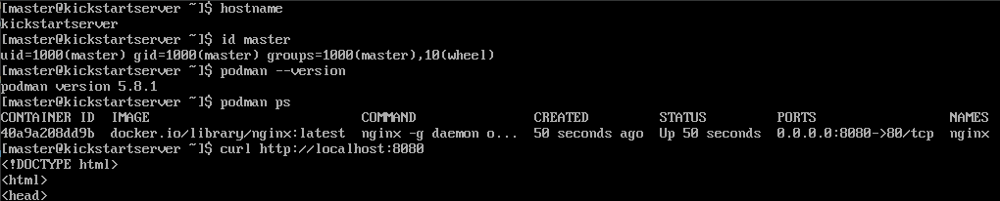

# Sprawozdanie – Zajęcia 09

## Pliki odpowiedzi dla wdrożeń nienadzorowanych

# 1. Cel ćwiczenia

Celem ćwiczenia było przygotowanie instalacji nienadzorowanej systemu Fedora przy użyciu pliku odpowiedzi Kickstart, a następnie automatyczne wdrożenie i uruchomienie aplikacji po zakończeniu instalacji systemu.

Dodatkowym celem było poznanie mechanizmów automatyzacji instalacji systemów operacyjnych oraz wykorzystanie sekcji `%post` do wykonywania działań konfiguracyjnych po instalacji.

---

# 2. Przygotowanie środowiska

## 2.1. Utworzenie maszyny wirtualnej

Utworzono nową maszynę wirtualną z firmware UEFI.

---

## 2.2. Instalacja wzorcowa

Przeprowadzono instalację systemu Fedora w celu wygenerowania przykładowego pliku Kickstart.

Po zakończeniu instalacji pobrano plik:

```bash
sudo cp /root/anaconda-ks.cfg ~/anaconda-ks.cfg
```

Plik ten został wykorzystany jako baza do dalszej konfiguracji instalacji automatycznej.

---

# 3. Modyfikacja pliku Kickstart

## 3.1. Konfiguracja źródła instalacji

Do pliku dodano źródło pakietów Fedora:

```text
url --mirrorlist=http://mirrors.fedoraproject.org/mirrorlist?repo=fedora-44&arch=x86_64
```

Pozwoliło to instalatorowi pobierać pakiety z oficjalnych repozytoriów.

---

## 3.2. Konfiguracja sieci i nazwy hosta

Ustawiono hostname systemu oraz dhcp:

```text
network --bootproto=dhcp --device=link --activate --hostname=kickstartserver
```

---

## 3.3. Konfiguracja użytkownika

Dodano użytkownika administracyjnego:

```text
user --name=master --groups=wheel --password=haslo
```

Użytkownik został automatycznie utworzony podczas instalacji.

---

## 3.4. Automatyczne czyszczenie dysku

Aby umożliwić wielokrotną reinstalację systemu bez interwencji użytkownika, zastosowano:

```text
clearpart --all --initlabel
autopart
```

Przy każdym uruchomieniu instalatora wszystkie istniejące partycje były usuwane, a następnie tworzony był nowy układ partycji.

---

## 3.5. Automatyczny restart

Na końcu instalacji dodano:

```text
reboot
```

Dzięki temu maszyna automatycznie uruchamiała się ponownie po zakończeniu instalacji.

---

# 4. Instalacja dodatkowego oprogramowania

## 4.1. Sekcja %packages

W sekcji pakietów umieszczono wymagane komponenty:

```text
%packages
@core
podman
curl
wget
git
%end
```

Zainstalowane zostały narzędzia niezbędne do pobrania i uruchomienia aplikacji.

---

# 5. Automatyczne wdrożenie aplikacji

## 5.1. Skrypt wdrożeniowy

W sekcji `%post` utworzono skrypt (na Fedorze użycie `podman` zamiast `docker` jest zalecane):

```bash
cat > /usr/local/bin/start-nginx.sh << 'EOF'
#!/bin/bash

podman pull nginx:latest

podman rm -f nginx 2>/dev/null

podman run -d \
  --name nginx \
  -p 8080:80 \
  nginx:latest
EOF

chmod +x /usr/local/bin/start-nginx.sh
```

Skrypt odpowiadał za pobranie i uruchomienie kontenera z aplikacją.

---

## 5.2. Utworzenie usługi systemd

Automatyczne uruchamianie aplikacji po starcie systemu zrealizowano poprzez usługę systemd:

```ini
[Unit]
Description=Nginx Podman Container
After=network-online.target
Wants=network-online.target

[Service]
Type=oneshot
RemainAfterExit=yes
ExecStart=/usr/local/bin/start-nginx.sh

[Install]
WantedBy=multi-user.target
EOF

systemctl daemon-reload
systemctl enable nginx.service
```

---

# 6. Instalacja nienadzorowana

## 6.1. Uruchomienie instalatora

Na hoście ustawiono serwer HTTP, serwujący plik `anaconda-ks.cfg`
Podczas uruchamiania instalatora Fedora dodano parametr:

```text
inst.ks=http://<adres-serwera>/anaconda-ks.cfg
```

Instalator pobrał przygotowany plik odpowiedzi.

---

## 6.2. Przebieg instalacji

Po uruchomieniu instalatora:

* nie pojawiły się żadne pytania konfiguracyjne,
* dysk został automatycznie wyczyszczony,
* system został zainstalowany,
* utworzono użytkownika,
* skonfigurowano hostname,
* zainstalowano wymagane pakiety,
* nastąpił automatyczny restart.

Proces przebiegał całkowicie bezobsługowo.

---

# 7. Weryfikacja działania



Ustawienia z pliku kickstart zostały zaaplikowane, oraz system uruchamia usługę z serwerem nginx automatycznie przy starcie.

---

# 8. Wnioski

W ramach ćwiczenia przygotowano plik odpowiedzi Kickstart umożliwiający całkowicie automatyczną instalację systemu Fedora. Instalacja nie wymagała żadnej interakcji użytkownika, automatycznie formatowała dysk, konfigurowała system oraz instalowała wymagane pakiety.

Dodatkowo wykorzystano sekcję `%post` do przygotowania środowiska uruchomieniowego aplikacji. Po pierwszym uruchomieniu systemu aplikacja została wdrożona i uruchomiona automatycznie, co pozwoliło uzyskać w pełni zautomatyzowany proces instalacji i konfiguracji środowiska.
