# Sprawozdanie 
## Lab 01: Git i SSH

## 1. Instalacja Git i konfiguracja SSH

Na samym początku zajęć musiałem przygotować swoje środowisko pracy na serwerze uczelnianym. Zacząłem od instalacji samego Gita oraz wygenerowania kluczy SSH, żeby nie musieć ciągle wpisywać haseł. Zgodnie z poleceniem wygenerowałem nowoczesny klucz (np. ed25519) i zabezpieczyłem go hasłem.

```bash
# Instalacja narzędzi
sudo apt update
sudo apt install git openssh-client -y


# Generowanie klucza SSH
ssh-keygen -t ed25519 -C "abaczynski@student.agh.edu.pl"
```

## Kopiowanie repozytorium
```bash
git clone https://github.com/InzynieriaOprogramowaniaAGH/MDO2026s_ITE.git #https
git clone git@github.com:InzynieriaOprogramowaniaAGH/MDO2026s_ITE.git #ssh
```

## 2. Praca na gałęziach (Branches)
Zgodnie z instrukcją, musiałem odgałęzić się od gałęzi grupowej (GCL1) i stworzyć własną gałąź ze swoimi inicjałami i numerem indeksu. Następnie utworzyłem wewnątrz odpowiedniego folderu swój własny katalog roboczy.

```bash
##Przełączenie się na gałąź grupy
git checkout GCL1

##Utworzenie i przejście na własną gałąź
git checkout -b AB420638

# Stworzenie własnego folderu
mkdir AB420638
cd AB420638
```
Sprawdzenie, czy jestem w odpowiednim branchu:

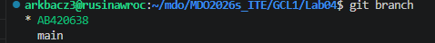


## 3. Git Hook - sprawdzanie commitów
Kolejnym zadaniem było napisanie skryptu (Git hooka), który będzie pilnował, abym przez przypadek nie wysłał commita bez moich inicjałów na początku wiadomości.

Utworzyłem plik skryptu i wpisałem w nim warunek sprawdzający, czy wiadomość zaczyna się od AB420638.
```bash
#!/bin/bash
# Wczytanie wiadomości commita
COMMIT_MSG_FILE=$1

# Sprawdzenie czy zaczyna się od BA420638
if ! grep -q "^AB420638" "$COMMIT_MSG_FILE"; then
    echo "BLAD: Wiadomosc commita musi zaczynac sie od 'AB420638'!"
    exit 1
fi
```

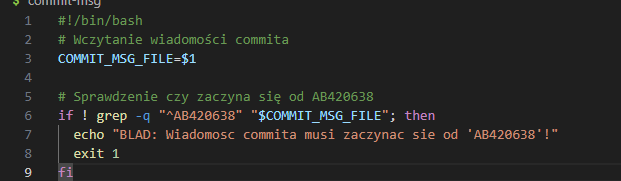


Żeby skrypt w ogóle działał, musiałem przenieść go do ukrytego folderu .git/hooks i nadać mu prawa do wykonywania.

```Bash
# Przeniesienie i nadanie uprawnień 
cp commit-msg ~/MDO2026s_ITE/.git/hooks/commit-msg;
chmod +x ~/MDO2026s_ITE/.git/hooks/commit-msg;
```
Spróbowałem zrobić commita z błędną wiadomością ("dodanie skryptu i sprawozdania"). Mój hook zadziałał i zablokował operację, zwracając zdefiniowany przeze mnie błąd: BLAD: Wiadomosc commita musi zaczynac sie od 'AB420638'!.

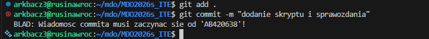


Gdy poprawiłem wiadomość na zaczynającą się od moich inicjałów, commit przeszedł bez problemu.

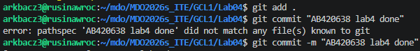

## Lab 02: Środowisko Skonteneryzowane (Docker)

### 1. Instalacja Dockera

W pierwszej kolejności zainstalowałem środowisko Docker na maszynie wirtualnej. Zgodnie z zaleceniami wykorzystałem pakiety z repozytorium dystrybucji Ubuntu, omijając instalatory takie jak Snap. Następnie dodałem swojego użytkownika do grupy `docker`, co pozwala na uruchamianie poleceń z poziomu konta bez konieczności każdorazowego używania `sudo`.

```bash
sudo apt install docker.io docker-compose
sudo usermod -aG docker $USER
newgrp docker
docker --version
```

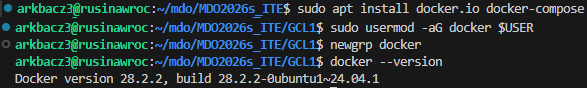

### 2. Logowanie do Docker Hub
W celu umożliwienia swobodnego pobierania obrazów, zalogowałem się na swoje konto na platformie Docker Hub. Proces logowania z poziomu terminala wymagał autoryzacji webowej – wygenerowany kod jednorazowy należało przepisać na stronie w przeglądarce. Operacja zakończyła się komunikatem "Login Succeeded".

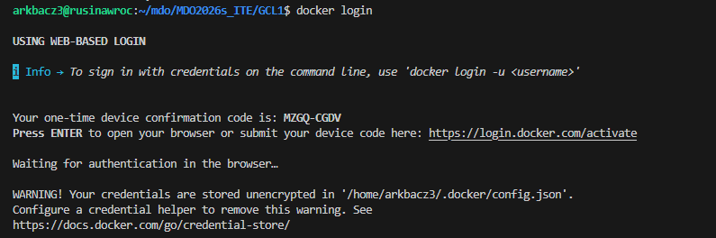

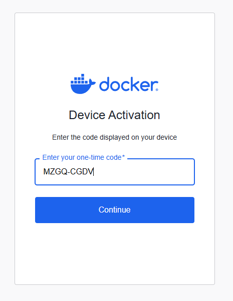


## 3. Pobieranie i testowanie obrazów
Następnie przeszedłem do zapoznania się z podstawowymi obrazami wskazanymi w instrukcji. Za pomocą polecenia pull pobrałem obrazy hello-world, busybox oraz ubuntu do lokalnego magazynu na serwerze.

```bash
docker pull hello-world
docker pull busybox
docker pull ubuntu
```


Kolejno przetestowałem uruchamianie poszczególnych kontenerów:

Hello-World: Uruchomienie polecenia docker run hello-world spowodowało pobranie obrazu, stworzenie z niego kontenera, wypisanie wiadomości powitalnej (potwierdzającej poprawne zainstalowanie platformy Docker) i automatyczne zakończenie jego działania.


Busybox: Uruchomiłem ten zoptymalizowany system, przekazując mu bezpośrednio polecenie echo "Busybox dziala", co wywołało jednorazowe wypisanie tekstu w terminalu.

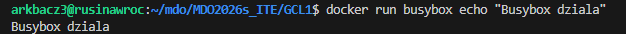

Ubuntu: Kontener z systemem Ubuntu uruchomiłem w trybie interaktywnym za pomocą flagi -it:
-i (interactive): Oznacza tryb interaktywny. 
-t (tty): Przydziela tzw. pseudo-TTY (od Teletypewriter). W praktyce oznacza, że Docker symuluje prawdziwy ekran terminala.
Pozwoliło mi to na wejście do powłoki systemu wewnątrz kontenera i wylistowanie drzewa katalogów poleceniem ls.


### Analiza rozmiarów i kodów wyjścia
Kolejnym krokiem było sprawdzenie listy pobranych obrazów (docker images) oraz historii wszystkich uruchamianych kontenerów (docker ps -a).
Rozmiary obrazów znacząco się od siebie różnią – obraz Ubuntu zajmuje około 78 MB, natomiast lekki Busybox niecałe 4,5 MB. Status większości moich zamkniętych kontenerów to Exited (0), co oznacza, że zakończyły one swoje procesy poprawnie i bez błędów.


## 4. Busybox interaktywnie
Zgodnie z poleceniem, podłączyłem się ponownie do kontenera z obrazu busybox w trybie interaktywnym, otwierając powłokę sh. Po uruchomieniu odpowiedniej komendy, kontener zwrócił informację o używanej wersji (w tym przypadku v1.37.0).


## 5. System w kontenerze, PID 1 oraz procesy hosta

Zgodnie z kolejnym punktem zadania, uruchomiłem "pełny" system operacyjny w kontenerze, bazując na obrazie Ubuntu, w trybie interaktywnym z powłoką `bash`.

Po wejściu do kontenera zaktualizowałem listę repozytoriów pakietów poleceniem `apt update`.

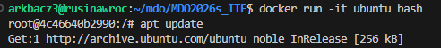

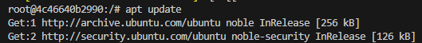

Następnie wykonałem pełną aktualizację zainstalowanych pakietów za pomocą polecenia `apt upgrade -y`.

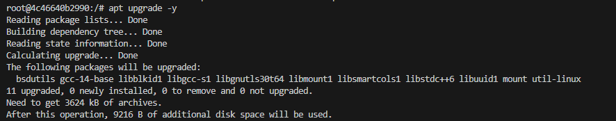

W celu zaprezentowania procesu o identyfikatorze PID 1 (czyli głównego procesu, dla którego żyje kontener), musiałem najpierw doinstalować pakiet `procps`, który dostarcza komendę `ps`. Po jego instalacji wywołanie `ps aux` potwierdziło, że procesem z PID 1 jest uruchomiona przeze mnie powłoka `bash`.

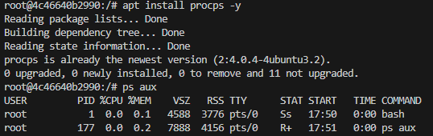

Po zakończeniu pracy opuściłem kontener poleceniem `exit`. Będąc z powrotem na maszynie hosta, zweryfikowałem działanie usługi Docker w tle, używając polecenia `ps aux | grep docker`. Wylistowało ono główny proces demona `dockerd`, zarządzający kontenerami na serwerze.

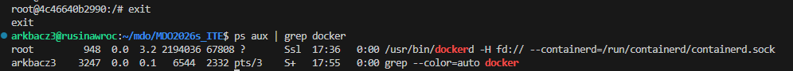

## 6. Tworzenie własnego obrazu (Dockerfile)

Kolejnym zadaniem było napisanie własnego pliku `Dockerfile`, który zautomatyzuje proces przygotowania środowiska z zainstalowanym systemem kontroli wersji Git oraz sklonowanym repozytorium przedmiotowym. 

Utworzyłem plik konfiguracyjny stosując się do dobrych praktyk tworzenia obrazów:
1. Użyłem oficjalnego obrazu bazowego `ubuntu:latest`.
2. Ustawiłem katalog roboczy poleceniem `WORKDIR`.
3. Zgrupowałem polecenia aktualizacji i instalacji (`apt-get update && apt-get install -y git`) w jednej warstwie `RUN`.
4. Dodatkowo oczyściłem pamięć podręczną menedżera pakietów (`rm -rf /var/lib/apt/lists/*`), co jest zalecaną praktyką pozwalającą znacząco zmniejszyć wagę finalnego obrazu.
5. W osobnej warstwie `RUN` sklonowałem repozytorium grupowe po protokole HTTPS.
6. Ustawiłem domyślną komendę startową kontenera na `bash`.

```bash
FROM ubuntu:latest

# katalog roboczy
WORKDIR /app

# aktualizacja i instalacja gita i czyszczenie śmieci apt
RUN apt-get update && \
    apt-get install -y git && \
    rm -rf /var/lib/apt/lists/*

# klonowanie repozytorium z GitHub
RUN git clone https://github.com/InzynieriaOprogramowaniaAGH/MDO2026s_ITE.git

# domyslna komenda po uruchomieniu kontenera
CMD ["bash"]
```

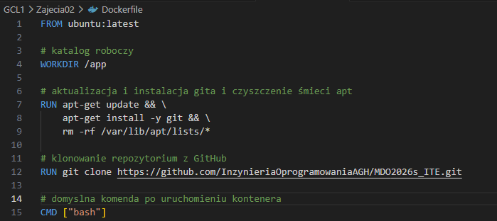

### Budowa i weryfikacja własnego obrazu

Mając przygotowany plik `Dockerfile`, przystąpiłem do zbudowania z niego obrazu, oznaczając go tagiem `moje-repo` za pomocą polecenia `docker build -t moje-repo .`. Proces przeszedł pomyślnie, wykonując i zapisując po kolei zdefiniowane wcześniej warstwy.

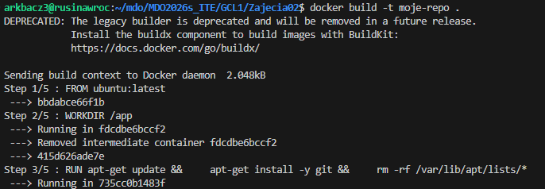

Aby zweryfikować poprawność konfiguracji, uruchomiłem nowo zbudowany kontener w trybie interaktywnym. Po wejściu do powłoki poleceniem `ls` sprawdziłem zawartość domyślnego katalogu roboczego (`/app`). Katalog repozytorium `MDO2026s_ITE` znajdował się na swoim miejscu, a wewnątrz niego obecne były pliki projektowe. Potwierdza to skuteczność operacji klonowania zdefiniowanej wewnątrz pliku Dockerfile.


### 7 Porządkowanie środowiska

Po zakończeniu wszystkich testów, wyświetliłem pełną listę kontenerów pracujących w systemie za pomocą komendy `docker ps -a`. Na liście znajdowały się liczne wpisy z wcześniejszych etapów zadania o statusie `Exited`, które wciąż zajmowały zasoby systemowe.


### 8. Czyszczenie Dockera (Czyszczenie Dockera)

Zgodnie z dobrymi praktykami, w celu zwolnienia przestrzeni dyskowej na serwerze, wykonałem operację masowego usunięcia wszystkich zatrzymanych kontenerów wykorzystując polecenie `docker container prune`.

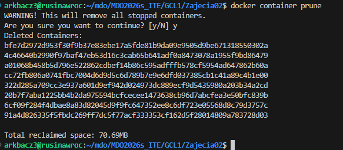

Następnie usunąłem z lokalnego magazynu zbędne i nieużywane obrazy bazowe poleceniem `docker image prune -a`. Obie te operacje zakończyły się sukcesem i pozwoliły odzyskać od kilkudziesięciu do kilkuset megabajtów przestrzeni.


### 9. Zapisanie wyników w repozytorium

Ostatnim etapem pracy na tych zajęciach było zarchiwizowanie postępów. Wszystkie utworzone pliki (w tym `Dockerfile` oraz katalog na sprawozdanie) dodałem do przestrzeni roboczej systemu Git. Następnie utworzyłem commit z wiadomością rozpoczynającą się od wymaganego identyfikatora (`AB420638`) i wypchnąłem zmiany na serwer (poleceniem `git push`) do mojej gałęzi.


## Lab 03: Dockerfiles, kontener jako definicja etapu

### 1. Wybór oprogramowania i kompilacja na maszynie hosta

Zgodnie z wytycznymi, na obiekt testowy wybrałem otwartoźródłowy projekt `xz` (XZ Utils). Projekt ten dysponuje otwartą licencją, a proces jego budowania i testowania opiera się na standardowych narzędziach systemu Linux (takich jak `automake`, `autoconf` oraz `make`).

Pracę rozpocząłem od przygotowania środowiska na moim serwerze (hoście). Za pomocą menedżera pakietów `apt` pobrałem niezbędne zależności kompilacyjne, takie jak kompilator `gcc` oraz narzędzia `make`, `automake`, `libtool` czy `gettext`.

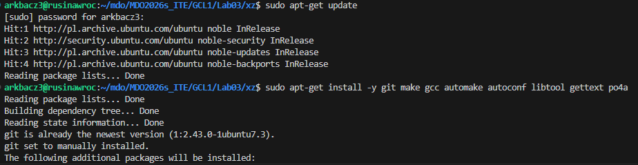

Podczas pierwszej próby wygenerowania skryptów konfiguracyjnych poleceniem `./autogen.sh`, proces zakończył się błędem z powodu braku narzędzia `autopoint`. Problem ten rozwiązałem doinstalowując brakujący pakiet z repozytorium systemowego.

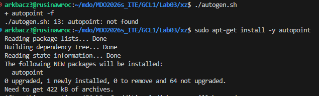

Po uzupełnieniu zależności, ponowne uruchomienie skryptu `./autogen.sh` powiodło się, poprawnie przygotowując pliki konfiguracyjne.

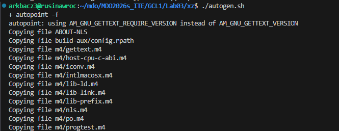

Następnie wykonałem komendę `./configure`, która dostosowała parametry kompilacji do środowiska i architektury mojego serwera (x86_64-pc-linux-gnu).

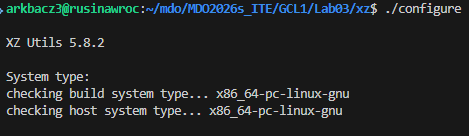

Po udanej kompilacji (za pomocą polecenia `make`), uruchomiłem wbudowane w projekt testy jednostkowe. 

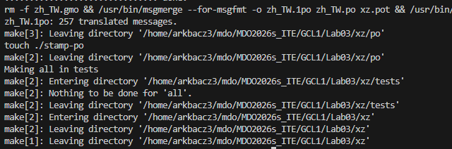

Testy zakończyły się pełnym sukcesem. Zgodnie z wygenerowanym podsumowaniem, wszystkie 19 testów zostało zaliczonych poprawnie, bez żadnych błędów.

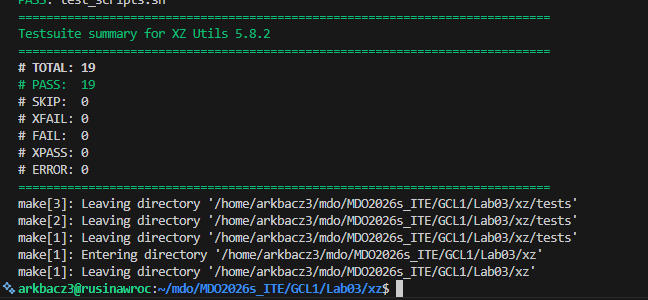

### 2. Izolacja i powtarzalność: kompilacja interaktywna w kontenerze

Przed pełną automatyzacją procesu, zgodnie z instrukcją, zweryfikowałem przenośność kompilacji wykonując wszystkie kroki interaktywnie wewnątrz czystego kontenera. W tym celu uruchomiłem podstawowy obraz systemu Ubuntu poleceniem `docker run -it ubuntu bash` i zaktualizowałem repozytoria.

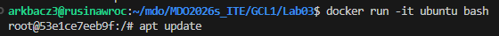

Będąc wewnątrz odizolowanego środowiska, zainstalowałem wszystkie pakiety niezbędne do zbudowania projektu (takie same jak na maszynie hosta, m.in. `git`, `make`, `gcc`, `autoconf`, `autopoint`).

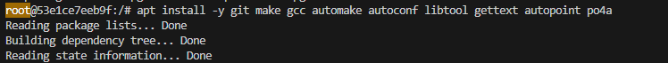

Mając przygotowane narzędzia, sklonowałem repozytorium XZ Utils.

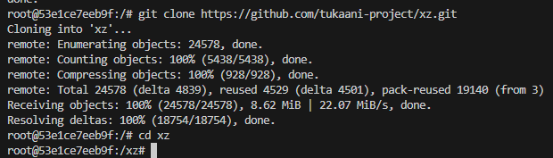

Kolejno przeszedłem do katalogu pobranego projektu i uruchomiłem skrypty przygotowujące środowisko kompilacji (`./autogen.sh` oraz `./configure`).

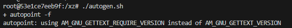

Gdy pliki konfiguracyjne zostały wygenerowane, uruchomiłem proces budowania za pomocą komendy `make`. Kompilacja przebiegła pomyślnie.

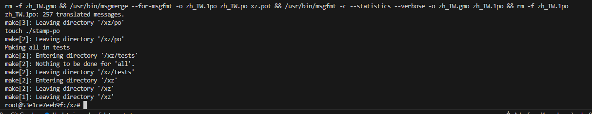

Aby ostatecznie potwierdzić powtarzalność środowiska, uruchomiłem zestaw testów jednostkowych poleceniem `make check`. Rezultat był identyczny jak w przypadku kompilacji na hoście – wszystkie 19 testów zakończyło się statusem PASS, co udowadnia, że proces można bezpiecznie i bezbłędnie przenieść do kontenera.

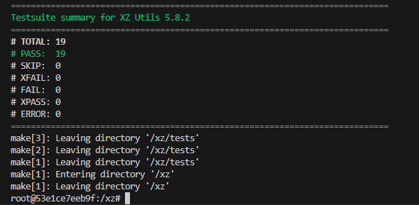


### 4. Izolacja procesu kompilacji w kontenerze (Pierwszy Dockerfile)

Mając pewność, że projekt prawidłowo kompiluje się na hoście, przystąpiłem do przeniesienia i zautomatyzowania tego procesu w izolowanym środowisku kontenerowym. Wybrałem obraz bazowy systemu `fedora`.

W tym celu przygotowałem pierwszy plik o nazwie `Dockerfile.xz.bld`. Jego zadaniem jest przygotowanie czystego środowiska kompilacyjnego. Zdefiniowałem w nim warstwy odpowiedzialne za:
1. Pobranie obrazu `fedora`.
2. Instalację wszystkich wymaganych pakietów za pomocą menedżera `dnf`.
3. Sklonowanie kodu źródłowego z repozytorium GitHub.
4. Ustawienie katalogu roboczego (`WORKDIR`).
5. Uruchomienie sekwencji budowania: `./autogen.sh`, `./configure` oraz `make`.

```bash
FROM fedora

RUN dnf -y install git make gcc automake autoconf libtool gettext-devel po4a

RUN git clone https://github.com/tukaani-project/xz.git

WORKDIR /xz

RUN ./autogen.sh
RUN ./configure
RUN make
```

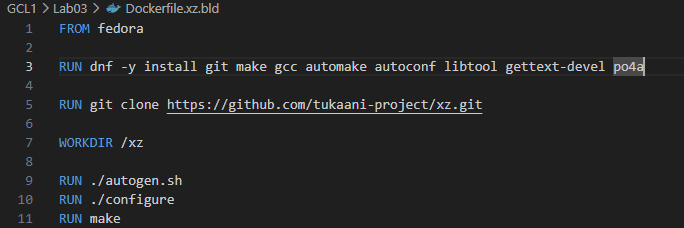

Następnie zbudowałem obraz poleceniem `docker build -t xzbld -f Dockerfile.xz.bld .`. Proces budowania przeszedł pomyślnie, poprawnie pobierając repozytoria Fedory i kompilując kod w odizolowanym kontenerze.

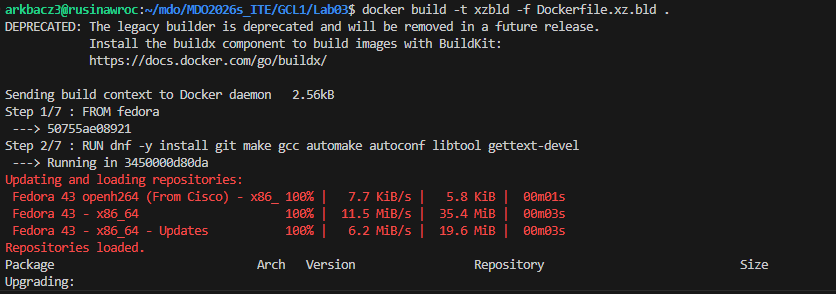

### 3. Kontener jako definicja etapu testów (Drugi Dockerfile)

Zgodnie z poleceniem, uruchamianie testów powinno być oddzielnym etapem. W tym celu stworzyłem drugi plik konfiguracyjny o nazwie `Dockerfile.xz.test`. 

Jego konstrukcja bazuje bezpośrednio na utworzonym przed chwilą obrazie kompilacyjnym (`FROM xzbld`). Dzięki temu zawiera on już gotowy, skompilowany program, i jego jedynym zadaniem jest wywołanie warstwy testującej komendą `RUN make check`. Różnica polega na tym, że ten kontener nie wykonuje ponownego budowania kodu.

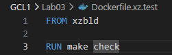

Finalnie, zbudowałem obraz testujący poleceniem `docker build -t xztest -f Dockerfile.xz.test .`. Budowa obrazu potwierdziła poprawne wykonanie testów jednostkowych w wyizolowanym środowisku, wykazując identyczny, pozytywny rezultat (19 zaliczonych testów) jak w przypadku bezpośredniej kompilacji na hoście.

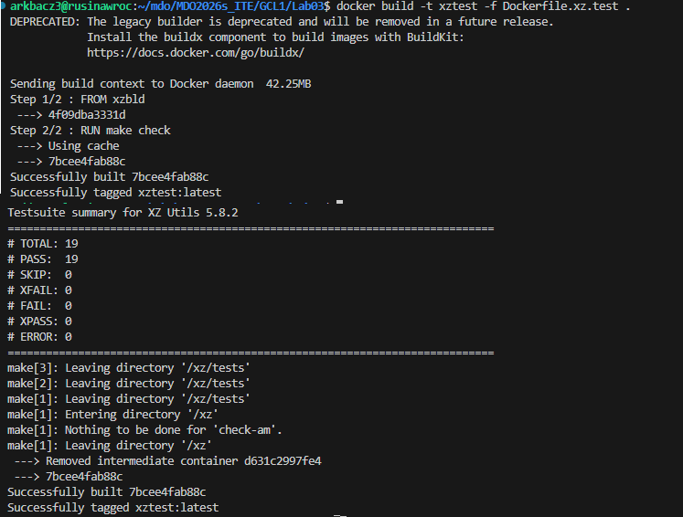

Poprawność wdrożenia obrazów została potwierdzona komunikatami systemowymi `Successfully built` oraz `Successfully tagged` widocznymi w logach operacji budowania. Ostatecznym dowodem na to, że kontener pracuje poprawnie, jest pomyślne wykonanie zestawu testów jednostkowych projektu XZ Utils wewnątrz izolowanego środowiska, co zakończyło się raportem: `# PASS: 19`.

## Różnica między obrazem a kontenerem:

### Obraz (Image): To statyczny, przeznaczony tylko do odczytu plik, który zawiera kompletne środowisko: system operacyjny, biblioteki, narzędzia kompilacyjne oraz kod źródłowy projektu. Sam w sobie nie wykonuje żadnych działań

### Kontener (Container): To uruchomiona, żywa instancja obrazu. Stanowi on izolowany proces w systemie hosta. Kontener posiada dodatkową, zapisywalną warstwę, która pozwala mu na wykonywanie operacji np. kompilację kodu lub uruchamianie testów w czasie rzeczywistym.

## Lab 04: Dodatkowa terminologia w konteneryzacji, instancja Jenkins

### 1. Zachowywanie stanu między kontenerami

### Celem tego zadania było rozdzielenie procesu pobierania kodu źródłowego od procesu jego budowania przy użyciu woluminów (Volumes/Bind Mounts). Pozwala to na zachowanie czystości kontenera budującego, który nie musi posiadać zainstalowanego klienta Git.

Zamiast instalować Gita w kontenerze budującym, zdecydowałem się pobrać kod źródłowy projektu `xz` bezpośrednio na maszynie hosta do katalogu, który następnie został zamontowany do kontenera. Wykorzystałem strukturę folderów wejscie (dla kodu źródłowego) oraz wyjscie (dla skompilowanych plików).

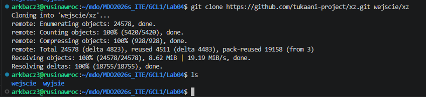

Następnie uruchomiłem kontener i zainstalowałem konieczne zależności:
```bash
docker run -it --name xz-builder -v $(pwd)/wejscie:/wejscie -v $(pwd)/wyjscie:/wyjscie ubuntu bash
```

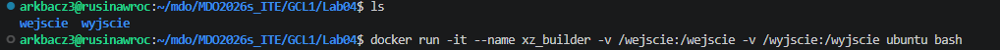

```bash
apt install -y make gcc automake autoconf libtool gettext autopoint po4a
```

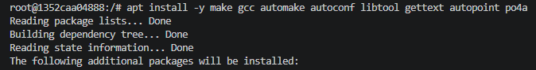

Na zrzutach ekranu możemy zobaczyć, że utworzenie woluminu odbyło się poprawnie - repozytorium jest widoczne zarówno na hoście, jak i kontenerze:

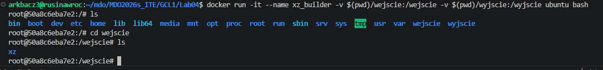

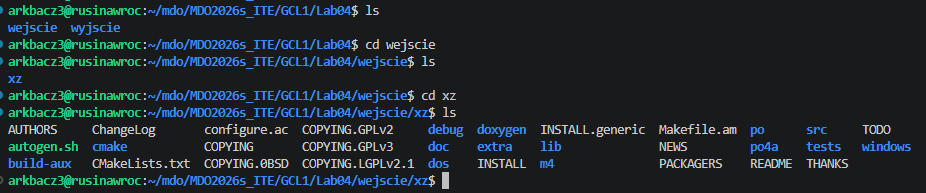

Będąc w katalogu /wejscie, przeprowadziłem standardową procedurę budowania oprogramowania, tak aby efekty pracy nie przepadły po usunięciu kontenera. 

```bash
./autogen.sh
./configure
```

Build został wykonany pomyślnie:

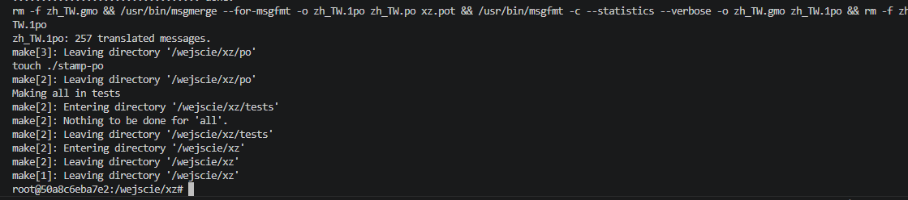

Następnie posłużyłem się zmienną środowiskową `DESTDIR`, aby zapisać strukturę plików do zamontowanego woluminu `wyjscie`
```bash
make install DESTDIR=/wyjscie/xz_zbudowane
```

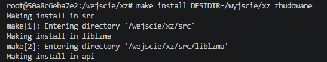

Wolumin wyjscie również zadziałał prawidłowo, trwale zapisując strukturę skompilowanych plików bezpośrednio na dysku maszyny hosta:

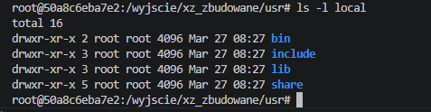

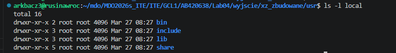

W drugiej części tego zadania ponowiłem operację, ale tym razem proces klonowania kodu miał odbyć się wewnątrz kontenera. Utworzyłem na hoście dwa nowe, puste foldery i zamontowałem je do nowego kontenera `xz_odwrotnie`:

```bash
mkdir -p wejscie_z_srodka wyjscie_z_srodka
docker run -it --name xz_odwrotnie -v $(pwd)/wejscie_z_srodka:/wejscie -v $(pwd)/wyjscie_z_srodka:/wyjscie ubuntu bash
```

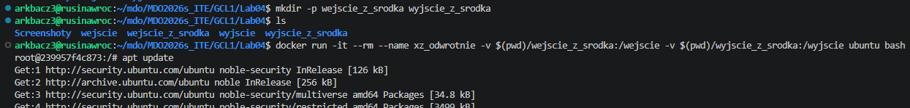

Następnie zainstalowałem zależności (należy zauważyć, że wśród nich jest wcześniej wspomniany git) i sklonowałem repozytorium do woluminu wejściowego

```bash
apt update
apt install -y git make gcc automake autconf libtool gettext autopoint po4a
```

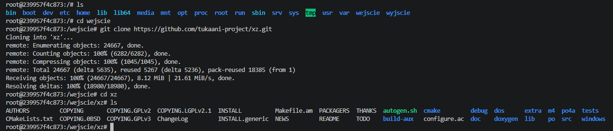

Następnie za pomocą tych samych komend
```bash
./autogen.sh
./configure
make install DESTDIR=/wyjscie/zbudowane_odwrotnie
```

zbudowałem bibliotekę do woluminu `wyjscie`. Na poniższych zrzutach ekranu widać, że wolumin został zamontowany poprawnie:

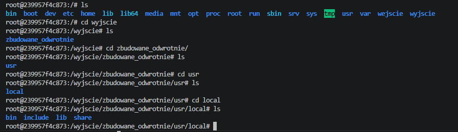

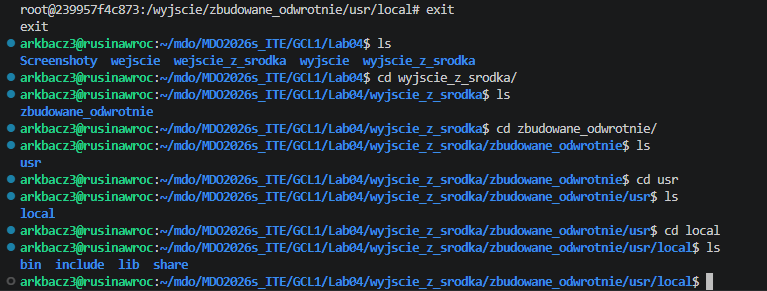

### Wykorzystanie Dockerfile i instrukcji RUN --mount
Opisane wyżej kroki można w pełni zautomatyzować na etapie budowania obrazu za pomocą `docker build`, wykorzystując nowoczesne funkcje silnika `BuildKit`. Kluczowa jest tu instrukcja `RUN --mount.`
Zamiast ręcznie montować woluminy flagą `-v` przy uruchamianiu, w pliku Dockerfile można użyć zapisu:

`RUN --mount=type=bind,source=.,target=/wejscie`

Pozwala to na tymczasowe, bezpieczne podmontowanie lokalnego kodu źródłowego na czas kompilacji. Kod jest dostępny dla kompilatora, ale nie jest trwale kopiowany do warstw budowanego obrazu, jak miałoby to miejsce przy użyciu instrukcji COPY. Powoduje to znaczne zmniejszenie rozmiaru finalnego obrazu oraz przyspiesza cały proces wdrażania CI/CD.

### 2. Eksponowanie portu i łączność między kontenerami

### Celem zadania była analiza wydajności i mechanizmów komunikacji sieciowej w środowisku docker. Zadanie miało na celu przetestowanie przepustowości łącza za pomocą iperf3 w różnych konfiguracjach: wewnątrz domyślnej sieci, z wykorzystaniem DNS i przy bezpośrednim mapowaniu portów

### Na początku utworzyłem kontener, w którym zainstalowałem narzędzie `iperf3` oraz `iproute2` (aby mieć potem dostęp do komendy ip a):

```bash
docker run -it --rm --name iperf_serwer ubuntu bash
apt update && apt install -y iperf3 iproute2
```

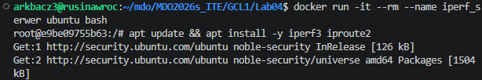

Następnie wykorzystałem wspomniane wcześniej polecenie ip a, aby odnaleźć adres IP kontenera, a następnie uruchomiłem serwer w mojej lokalnej sieci LAN:

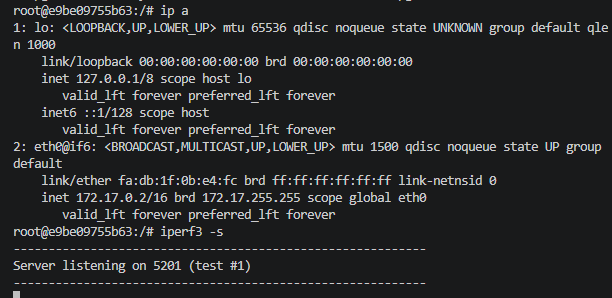

Kolejnym krokiem było utworzenie drugiego kontenera - klienta, który połączy się z serwerem:

```bash
docker run -it --rm --name iperf_klient ubuntu bash
apt update && apt install -y iperf3
```
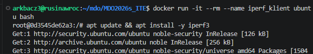

### Po połączeniu się z serwerem otrzymałem przepustowość na poziomie 34 Gbit/s. Ponieważ oba kontenery współdzielą fizycznie tę samą maszynę hosta, dane nie przechodziły przez sprzętowe interfejsy sieciowe, lecz były wymieniane za pośrednictwem wirtualnego mostu sieciowego bezpośrednio w pamięci RAM serwera.

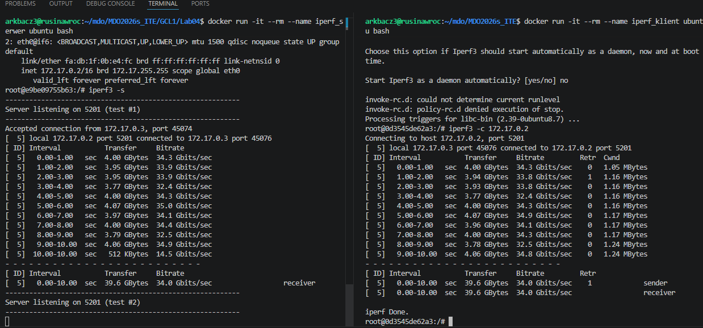

### Kolejne zadanie polegało na ponowieniu tego kroku, ale z wykorzystaniem dedykowanej sieci mostkowej. Sieci te oferują automatycznie rozwiązywanie nazw - DNS. co pozwala zrezygnować z niestabilnych adresów IP na rzecz sztywnych nazw kontenerów
-Utworzyłem dedykowaną sieć poleceniem docker network create, następnie uruchomiłem kontener, zainstalowałem zależności i stworzyłem serwer:

```bash
docker network create moja_siec
docker run -it --rm --name serwer --network moja_siec ubuntu bash
apt update && apt install -y iperf3
iperf3 -s
```

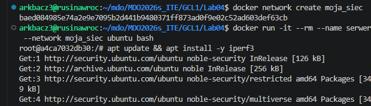


-Uruchomiłem kontenery serwera i klienta, przypisując je do nowej sieci oraz nadając im unikalne nazwy.

```bash
docker run -it --rm --ame klient2 --network moja_siec ubuntu bash
apt update && apt install -y iperf3
```


-Przeprowadziłem test przepustowości iperf3, wskazując cel nie poprzez adres IP, ale bezpośrednio przez nazwę kontenera `serwer2`.


Uzyskałem wyniki na poziomie 31.8Gbit/s. Jest to o 2.2 Gbit/s mniej od pierwszego badania. Najprawdopodobniej spowodowane jest to dodatkowym narzutem 
spowodowanym dodatkową logiką wirtualnego mostka, co zmniejsza nieznacznie przepustowość.

Ostatnim badaniem w tym temacie było połączenie się z serwerem z zewnątrz kontenera. Aby to zrobić, musiałem otworzyć port `5201` - domyślny port `iperf3`. Co należy zauważyć, użyłem flagi `-d` która odpala kontener w tle, przez co nie blokuje on terminala.

```bash
docker run -d --rm --name iperf-serwer-port -p 5201:5201 ubuntu bash -c "apt update && apt install -y iperf3 && iperf3 -s"
```


Następnie na hoście połączyłem sie z nowo utworzonym serwerem w kontenerze:

```bash
iperf3 -c localhost
```


Otrzymałem tutaj przepustowość rzędu 50,2Gbit/s. Jest ona najwyższa z otrzymanych, ponieważ przy tej konfiguracji ścieżka, którą muszą pokonać dane, jest najprostsza - omijamy wirtualny mostek i routing, co pozwala osiągnąć rzeczywiste maksimum szybkości operacji w pamięci.

### 3. Usługi w rozumieniu systemu, kontenera i klastra

### Celem zadania było zrozumienie różnic między tradycyjnym zarządzaniem usługami systemowymi a podejściem kontenerowym. Poprzez konfigurację demona sshd wewnątrz kontenera, zadanie miało wykazać techniczne możliwości dostępu zdalnego oraz pozwolić na krytyczną ocenę takiego rozwiązania jako antywzorca w stosunku do natywnych narzędzi takich jak `docker exec`.

Utworzyłem kontener z otworzonym portem a następnie zainstalowałem w nim serwer SSH:

```bash
docker run -it --rm --name sejf_z_ssh -p 2222:22 ubuntu bash
apt update && apt install  -y openssh-server
```


Następnie utworzyłem folder do działania SSH, ustawiłem hasło dla użytkownika `root`, oraz pozwoliłem mu logować się przez SSH, a na końcu włączyłem demona SSH

```bash
mkdir -p /run/sshd
echo 'root:studia' | chpasswd
sed -i 's/#PermitRootLogin prohibit-password/PermitRootLogin yes/' /etc/ssh/sshd_config
/usr/sbin/sshd
```


Następnie włączyłem drugi terminal i na hoście połączyłem się przez port `2222` do kontenera:

```bash
ssh root@localhost -p 2222
```


### Na zrzucie ekranu widać pomyślnie zalogowanie się przez SSH do wnętrza kontenera. Uważane jest to za antywzorzec, ponieważ Docker od lat ma komendę docker exec -it <nazwa> bash, która pozwala wejść do kontenera bez żadnych haseł, instalowania SSH i otwierania portów. Dodatkowo, łamiemy tym zasadę jednej odpowiedzialności - kontener powinien uruchamiać tylko jeden proces główny. Ponadto, przez instalację demona `openssh-server` i bibliotek do niego potrzebnych skrajnie zwiększamy wagę obrazu oraz zużycie pamięci RAM.

## 4. Przygotowanie do uruchomienia serwera Jenkins

### Cel zadania: Zestawienie złożonego środowiska CI/CD w oparciu o architekturę Docker-in-Docker (DIND). Celem było poprawne skonfigurowanie współzależnych kontenerów (serwera Jenkins oraz pomocniczego silnika Docker), zapewnienie im wspólnej sieci komunikacyjnej oraz przeprowadzenie pełnej inicjalizacji systemu wraz z weryfikacją poprawności wdrożenia poprzez interfejs przeglądarkowy.

Po zapoznaniu się z dokumentacją Jenkinsa, zacząłem instalację od utworzenia kontenera udostępniającego silnik Dockera:

```bash
docker run \
  --name jenkins-docker \
  --rm \
  --detach \
  --privileged \
  --network jenkins \
  --network-alias docker \
  --env DOCKER_TLS_CERTDIR=/certs \
  --volume jenkins-docker-certs:/certs/client \
  --volume jenkins-data:/var/jenkins_home \
  --publish 2376:2376 \
  docker:dind \
  --storage-driver overlay2
  ```

  

Następnie, zgodnie z dokumentacją, utworzyłem `Dockerfile`:

```bash
FROM jenkins/jenkins:2.541.3-jdk21
USER root
RUN apt-get update && apt-get install -y lsb-release ca-certificates curl && \
    install -m 0755 -d /etc/apt/keyrings && \
    curl -fsSL https://download.docker.com/linux/debian/gpg -o /etc/apt/keyrings/docker.asc && \
    chmod a+r /etc/apt/keyrings/docker.asc && \
    echo "deb [arch=$(dpkg --print-architecture) signed-by=/etc/apt/keyrings/docker.asc] \
    https://download.docker.com/linux/debian $(. /etc/os-release && echo \"$VERSION_CODENAME\") stable" \
    | tee /etc/apt/sources.list.d/docker.list > /dev/null && \
    apt-get update && apt-get install -y docker-ce-cli && \
    apt-get clean && rm -rf /var/lib/apt/lists/*
USER jenkins
RUN jenkins-plugin-cli --plugins "blueocean docker-workflow json-path-api"
```


a nastepnie utworzyłem obraz:

```bash
docker build -t myjenkins-blueocean:2.541.3-1 . 
```


Następnie uruchomiłem obraz Jenkinsa jako kontener w dockerze za pomocą komendy `docker run`:


Sprawdziłem działanie obu kontenerów za pomocą komendy `docker ps`


Kolejnym krokiem było zobycie hasła inicjalizacyjnego, wyciągnąłem je dzięki wcześniej tłumaczonemu `docker exec`:
```bash
docker exec jenkins-blueocean cat /var/jenkins_home/secrets/initialAdminPassword
```


Ostatnim krokiem było rozpoczęcie instalacji Jenkinsa w przeglądarce na hoście. Otworzyłem adres: `172.26.2.165:8080`, przeszedłem do interfejsu graficznego i wkleiłem wydobyte z pliku hasło autoryzacyjne.:


Na końcu rozpocząłem instalację z zalecanymi ustawieniami:


