# Sprawozdanie z laboratoriów 5-7: Jenkins i automatyzacja CI/CD

**Autor:** Arkadiusz Baczyński
**Gałąź w repozytorium:** `AB420638`

---

## 1: Przygotowanie środowiska i zadania wstępne

### 1.1 Uruchomienie infrastruktury Jenkins (DinD)
Aby zrealizować zadania z zakresu ciągłej integracji, konieczne było utworzenie odpowiedniego środowiska CI/CD. Wdrożenie oparłem o architekturę Docker-in-Docker (DinD), postępując ściśle według oficjalnej dokumentacji ze strony Jenkinsa. Skonfigurowałem środowisko opierające się na dedykowanej sieci w Dockerze, w której uruchomiłem dwa współgrające ze sobą kontenery: jeden pełniący rolę demona Dockera oraz drugi – właściwy serwer Jenkins. 

Pozwala to na pełną izolację środowiska Jenkinsa przy jednoczesnym zachowaniu możliwości budowania, testowania i uruchamiania obrazów wewnątrz agentów. Pierwsze logowanie wymagało uwierzytelnienia za pomocą jednorazowego hasła administratora, które wyciągnąłem z logów uruchomionego kontenera (polecenie `docker logs`). 

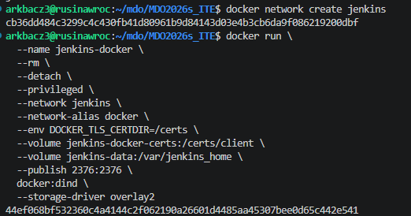
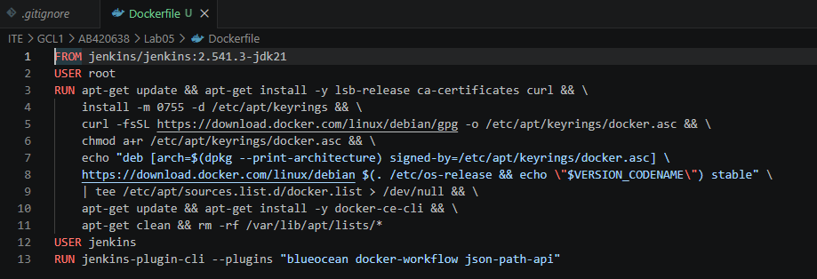
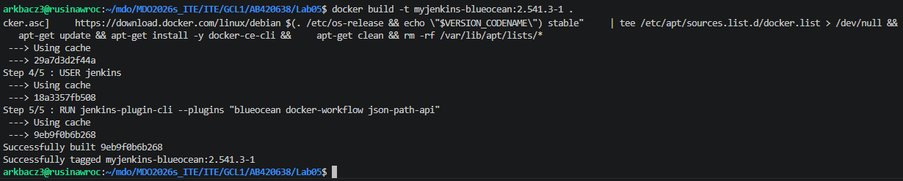
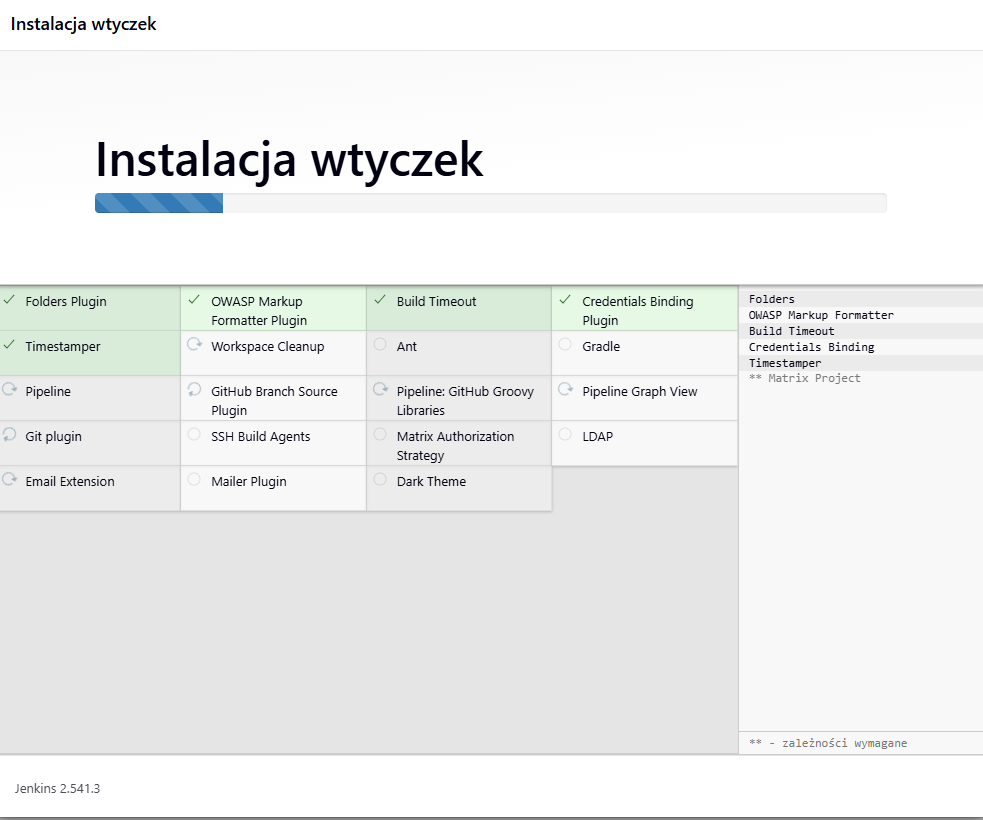
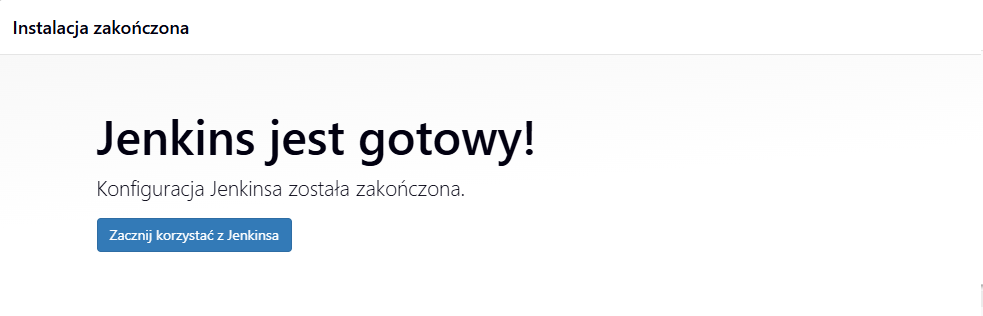

### 1.2 Początkowe zadania
Zanim przeszedłem do potoków deklaratywnych, w celu weryfikacji poprawności działania środowiska stworzyłem trzy proste projekty. Miały one udowodnić, że Jenkins potrafi komunikować się z systemem operacyjnym oraz demonem Dockera.

1. **Weryfikacja systemu (uname):** Zbudowałem zadanie wywołujące proste komendy systemowe (`uname -a`, `whoami`). Jego pomyślne wykonanie potwierdziło, że Jenkins prawidłowo egzekwuje skrypty powłoki i ma przypisane odpowiednie uprawnienia.

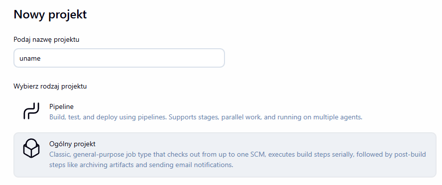
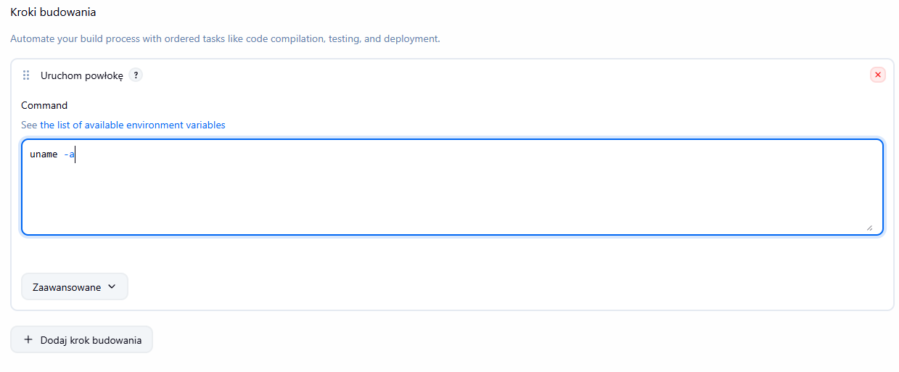
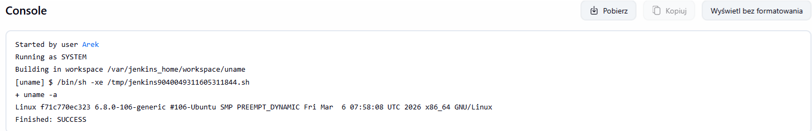


2. **Wymuszenie błędu warunkowego:** Zaimplementowałem skrypt w bashu, który pobierał aktualną godzinę i za pomocą operacji modulo (`% 2`) sprawdzał jej parzystość. W przypadku godziny nieparzystej celowo przerywał wykonanie komendą `exit 1`. Pozwoliło to przetestować obsługę błędów przez Jenkinsa – zadanie prawidłowo przybrało status `FAILURE`, co udowadnia, że Jenkins skutecznie wyłapuje kody wyjścia różne od zera.

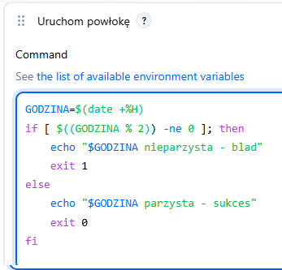
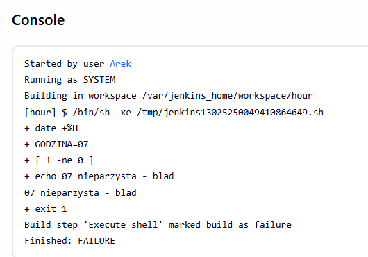


Następnie, dla weryfikacji, zmieniłem przyrównywaną zmienną do obecnego dnia (10) i ponownie uruchomiłem skrypt - tym razem zadanie, zgodnie z oczekiwaniami, przybrało status `SUCCES`

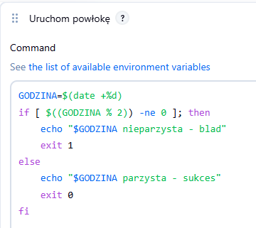
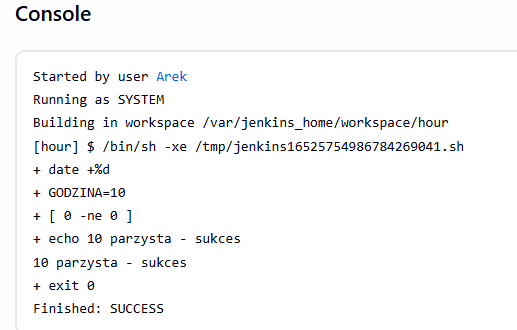

3. **Komunikacja z Dockerem:** Uruchomiłem zadanie pobierające obraz z zewnętrznego rejestru za pomocą komendy `docker pull ubuntu`. Przebiegło ono pomyślnie, co jest ostatecznym dowodem na to, że agent Jenkinsa posiada prawidłowe uprawnienia do zarządzania kontenerami w architekturze DinD.

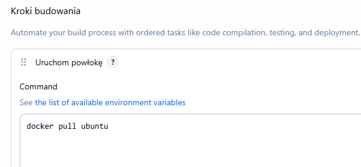
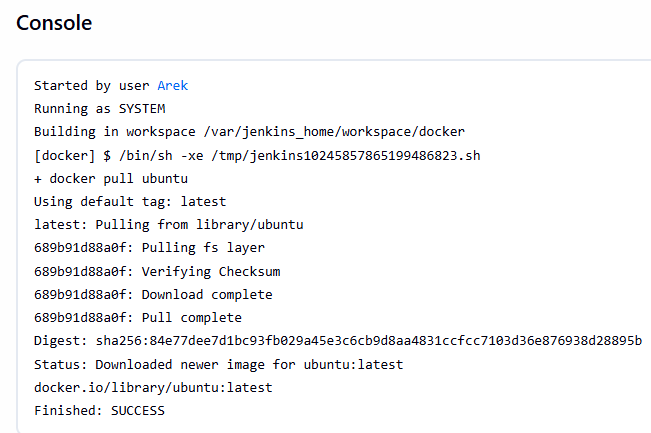

### Podstawowe środowisko CI zostało pomyślnie zweryfikowane. Jenkins potrafi zarządzać procesami systemowymi, odpowiednio reaguje na błędy w kodzie oraz posiada bezpośrednią łączność z silnikiem Dockera.


### 1.3 Pierwszy obiekt Pipeline i mechanizm cache'owania
Kolejnym krokiem było przejście z prostych projektów na rzecz nowoczesnego, deklaratywnego obiektu Pipeline. Wprowadziłem skrypt potoku bezpośrednio w interfejsie graficznym Jenkinsa. Zgodnie z kodem widocznym na zrzutach ekranu, rurociąg klonował moje repozytorium i budował wstępny obraz o nazwie moj-xz-builder, wykorzystując do tego plik Dockerfile.xz.bld z poprzednich laboratoriów.

Zgodnie z poleceniem, uruchomiłem stworzony potok dwukrotnie, aby dogłębnie przeanalizować zachowanie środowiska budującego:
* **Pierwsze uruchomienie:** Przebiegło standardowo – Docker pobrał bazę, zaktualizował repozytoria, zainstalował niezbędne pakiety (`dnf install`) i skompilował kod od zera.

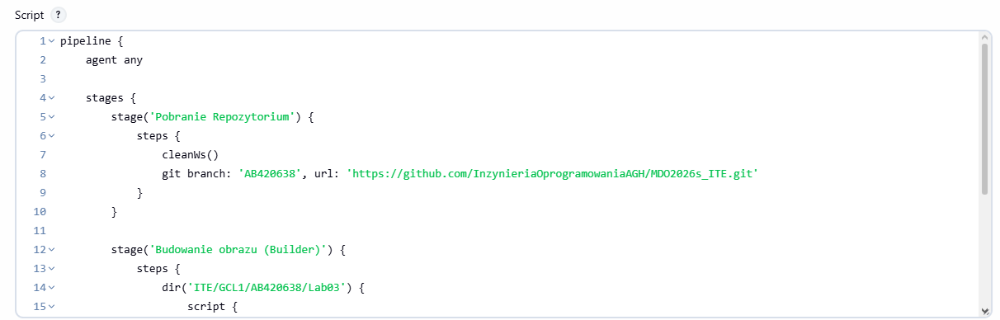
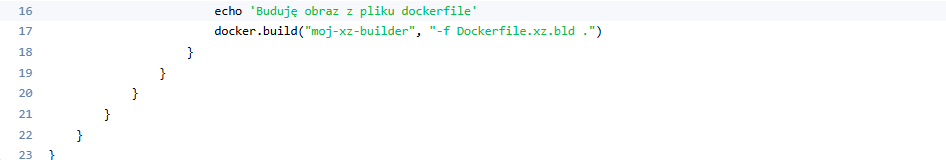
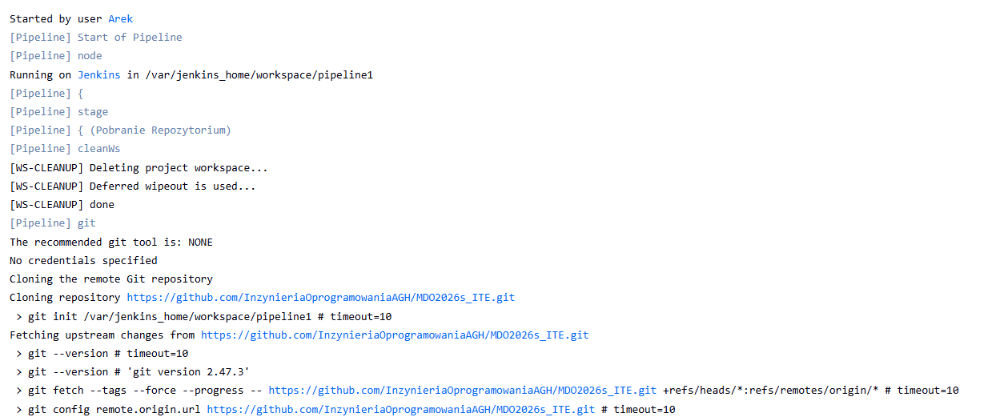
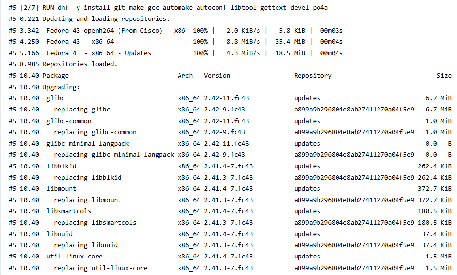
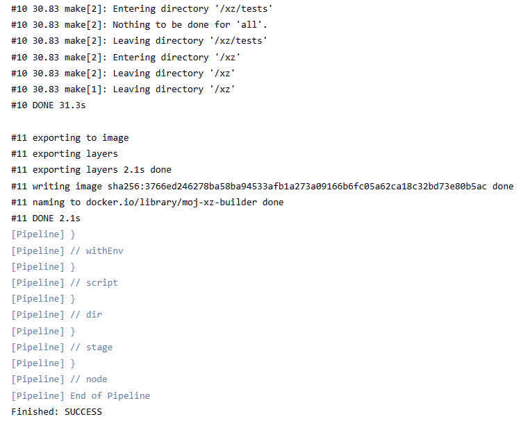

* **Drugie uruchomienie:** Zakończyło się w zaledwie kilka sekund. Analiza logów z tego przejścia wykazała powtarzające się komunikaty `CACHED` przy każdej instrukcji `RUN` zdefiniowanej w pliku Dockerfile.


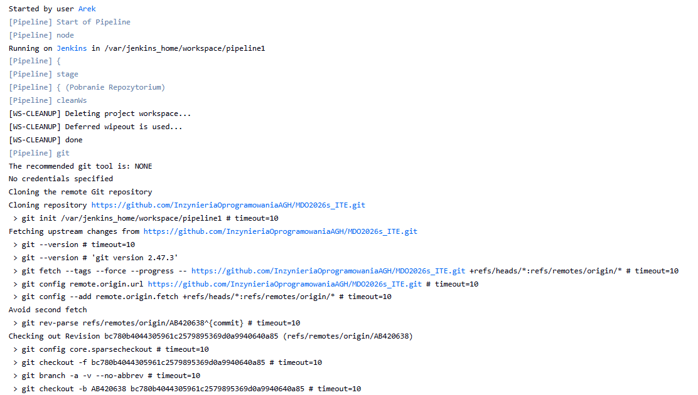
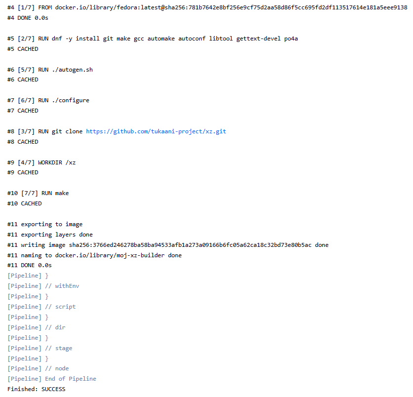

### Drugie uruchomienie udowodniło, że agent Jenkinsa współdzieli pamięć podręczną (cache) z demonem Dockera na hoście. Zjawisko to, choć optymalizuje czas budowania lokalnego, w profesjonalnym środowisku CI/CD jest wysoce ryzykowne – prowadzi do tzw. "zatrutego cache'u", gdzie Docker zamiast pobrać nową wersję kodu, buduje obraz ze starych warstw. To doświadczenie bezpośrednio udowadnia, że w ostatecznym, produkcyjnym potoku (Lab 6 i 7) absolutnie konieczne będzie stosowanie instrukcji sprzątającej `cleanWs()` oraz wymuszanie flagi `--no-cache` w komendach budujących Dockera.

## 2. Lab 6 i 7: Specyficzny Pipeline CI/CD (Przetwarzanie Danych XZ)

### 2.1 Architektura i analiza problemu technologicznego


Zgodnie z wytycznymi od prowadzącego, proces CI/CD w ramach tego zadania nie polegał na klasycznym wdrożeniu aplikacji webowej, lecz na zrealizowaniu unikalnego potoku służącego do przetwarzania i dekompresji danych. Zlecona na tablicy architektura bazowa zakładała:
1. Utworzenie wejściowego pliku tekstowego (`my_input`).
2. Kompresję do formatu `.gz` narzędziem `gzip`.
3. Zbudowanie lekkiego obrazu Dockera zawierającego narzędzie `xz`.
4. Uruchomienie docelowego kontenera z podmontowanym wolumenem celem dekompresji (`xz -d`) wygenerowanego archiwum w locie.
5. Walidację zgodności rozpakowanego pliku z oryginałem za pomocą komendy systemowej `cmp` (`out ok?`).

**Krytyczny problem technologiczny (Format kompresji):** Oryginalny schemat zaproponowany przez prowadzącego był technologicznie niemożliwy do zrealizowania. Narzędzie `xz` opiera się na algorytmie LZMA2 i fizycznie nie potrafi rozpoznać formatu `.gz` (bazującego na algorytmie DEFLATE). Próba bezpośredniej implementacji tego schematu w Jenkinsie zakończyła się natychmiastowym przerwaniem potoku i wyrzuceniem błędu: `xz: (stdin): File format not recognized`.

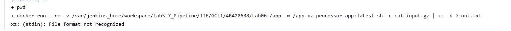

**Korekta i optymalizacja procesu:** Aby zachować nadrzędny cel zadania (którym było udowodnienie, że kontener z zainstalowanym narzędziem `xz` działa sprawnie), musiałem zmodyfikować etap przygotowywania danych wejściowych. Zamiast `gzip`, użyłem formatu wspieranego przez narzędzie docelowe. Ponieważ domyślny agent Jenkinsa nie posiadał programu `xz`, zaimplementowałem dynamiczne wykorzystanie jednorazowego kontenera `alpine:3.19` wewnątrz potoku. Służył on wyłącznie do skompresowania pliku wejściowego do formatu `.xz`. Dzięki temu nowo zbudowany, docelowy kontener (oparty na Ubuntu) mógł bezbłędnie przeprowadzić proces dekompresji.

**Wniosek częściowy:** Automatyzacja wybacza błędy w kodzie, ale obnaża błędy logiczne w architekturze. Błyskawiczna zmiana narzędzia kompresującego pozwoliła utrzymać ciągłość procesu bez rezygnowania z docelowych technologii środowiska testowego.

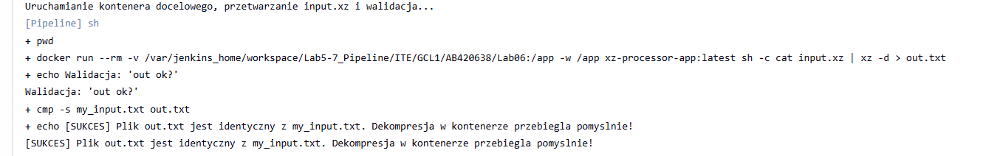

### 2.2 Diagram Aktywności (Proces CI/CD)

Poniższy diagram obrazuje zmodyfikowany i w pełni poprawny przepływ logiki wewnątrz nowo zaprojektowanego potoku:

```mermaid
stateDiagram-v2
    direction TB

    [*] --> SCM_Checkout
    
    state SCM_Checkout {
        [*] --> Clean_Workspace
        Clean_Workspace --> Git_Clone
    }

    SCM_Checkout --> Prepare_Input

    state Prepare_Input {
        [*] --> Create_Text_File
        Create_Text_File --> Alpine_Container : Uruchom docker run alpine
        Alpine_Container --> Compress_XZ : Wygeneruj input
    }

    Prepare_Input --> Build_Image

    state Build_Image {
        [*] --> Docker_Build
        Docker_Build --> Image_Ubuntu_XZ : docker build --no-cache
    }

    Build_Image --> Deploy_And_Test

    state Deploy_And_Test {
        [*] --> Run_Target_Container : docker run z wolumenem
        Run_Target_Container --> Unpack : xz -d
        Unpack --> Validation : cmp -s my_input.txt out.txt
        Validation --> Success : Zwróć kod 0
    }

    Deploy_And_Test --> Publish

    state Publish {
        [*] --> Archive_Artifacts : my_input.txt, input.xz, out.txt
        Archive_Artifacts --> Tag_Image
    }

    Publish --> Post_Cleanup
    
    state Post_Cleanup {
        [*] --> Remove_Local_Images : docker rmi
    }
    
    Post_Cleanup --> [*]
```
### 2.3 Deklaracja Infrastruktury (Infrastructure as Code)

Zgodnie z koncepcją IaC (Infrastructure as Code), zrezygnowałem z przetrzymywania definicji Pipeline'u w interfejsie Jenkinsa. Potok budowania został w pełni przeniesiony do repozytorium jako kod.

**Wdrożenie SCM:** Konfiguracja projektu w Jenkinsie została ustawiona na tryb *Pipeline script from SCM*, wskazując na moją gałąź `AB420638` oraz ścieżkę do pliku `Jenkinsfile`. Dzięki temu cała konfiguracja procesu CI jest wersjonowana wspólnie z resztą plików i każdy programista w zespole ma do niej wgląd.

**Plik `Dockerfile` (w gałęzi AB420638)**
Obraz docelowy jest maksymalnie odchudzony – bazuje na minimalnej wersji Ubuntu i instaluje wyłącznie pakiet `xz-utils` niezbędny do działania aplikacji.

```dockerfile
FROM ubuntu:22.04
ENV DEBIAN_FRONTEND=noninteractive

RUN apt-get update && \
    apt-get install -y xz-utils && \
    rm -rf /var/lib/apt/lists/*

WORKDIR /app
CMD ["xz", "--help"]
```

**Plik `Jenkinsfile` (w gałęzi AB420638)**
```jenkinsfile
pipeline {
    agent any
    environment {
        IMAGE_NAME = "xz-processor-app"
        WORK_DIR = "ITE/GCL1/AB420638/Lab06"
    }

    stages {
        stage('1. Clean & Checkout') {
            steps {
                cleanWs()
                checkout scm
            }
        }

        stage('2. Prepare Input (xz)') {
            steps {
                dir("${WORK_DIR}") {
                    script {
                        echo "Tworzenie pliku my_input i kompresja xz..."
                        sh '''
                            echo "To jest testowy tekst, ktory Jenkins skompresuje, a Docker zdekompresuje." > my_input.txt
                            # Dynamiczne uruchomienie kontenera do obejścia problemu z brakiem paczki 'xz' na systemie hosta/agencie
                            docker run --rm -v $(pwd):/app -w /app alpine:3.19 sh -c "apk add --no-cache xz > /dev/null && xz -c my_input.txt > input.xz"
                        '''
                    }
                }
            }
        }

        stage('3. Build (XZ Image)') {
            steps {
                dir("${WORK_DIR}") {
                    script {
                        echo "Budowanie obrazu Dockera (Ubuntu) z narzędziem xz..."
                        sh 'docker build --no-cache -t ${IMAGE_NAME}:latest .'
                    }
                }
            }
        }

        stage('4. Deploy & Test (out ok?)') {
            steps {
                dir("${WORK_DIR}") {
                    script {
                        echo "Uruchamianie kontenera docelowego, przetwarzanie input.xz i walidacja..."
                        sh '''
                            docker run --rm -v $(pwd):/app -w /app ${IMAGE_NAME}:latest sh -c "cat input.xz | xz -d > out.txt"
                            
                            echo "Walidacja: 'out ok?'"
                            if cmp -s my_input.txt out.txt; then
                                echo "[SUKCES] Plik out.txt jest identyczny z my_input.txt. Dekompresja w kontenerze przebiegla pomyslnie!"
                            else
                                echo "[BŁĄD] Pliki się różnią!"
                                exit 1
                            fi
                        '''
                    }
                }
            }
        }

        stage('5. Publish & Archive') {
            steps {
                dir("${WORK_DIR}") {
                    script {
                        echo "Zapisywanie artefaktów w Jenkinsie..."
                        archiveArtifacts artifacts: 'my_input.txt, input.xz, out.txt', fingerprint: true
                        sh 'docker tag ${IMAGE_NAME}:latest ${IMAGE_NAME}:${BUILD_NUMBER}'
                    }
                }
            }
        }
    }

    post {
        always {
            script {
                echo "Czyszczenie pozostałości po procesie na hoście"
                sh "docker rmi ${IMAGE_NAME}:latest || true"
                sh "docker rmi ${IMAGE_NAME}:${BUILD_NUMBER} || true"
            }
        }
    }
}
```

### 2.4 Definition of Done (Walidacja i Podsumowanie)

Zaprojektowany rurociąg CI/CD spełnia wszystkie założenia tzw. *Definition of Done*:

* **100% Powtarzalność i higiena procesu:** Dzięki zastosowaniu instrukcji `cleanWs()` na początku skryptu oraz wymuszeniu flagi `--no-cache` w `docker build`, każde uruchomienie potoku odbywa się na całkowicie czystym środowisku. Działanie potoku będzie identyczne na każdym komputerze i zabezpiecza przed użyciem przestarzałych plików konfiguracyjnych w cache'u Dockera.
* **Bezbłędna Skuteczność (Smoke Test):** Najważniejszy etap (Deploy & Test) potwierdził na poziomie bajtów (komenda `cmp -s`), że zdekompresowany przez kontener plik jest identyczny z podanym mu oryginałem. Pomyślnie zwalidowany status wyjścia objawił się sukcesem całego procesu: `[SUKCES] Plik out.txt jest identyczny z my_input.txt`.
* **Archiwizacja Artefaktów:** Każde przejście *pipeline'u* kończy się zabezpieczeniem niezbędnych logów i plików. Artefakty wynikowe (`my_input.txt`, `input.xz`, `out.txt`) są automatycznie zachowywane i eksponowane do pobrania bezpośrednio na platformie Jenkinsa, co ułatwia ewentualny audyt operacji.

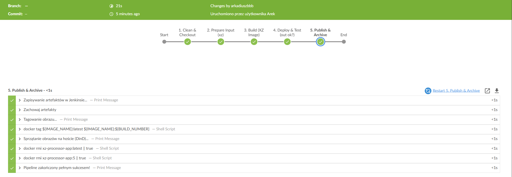
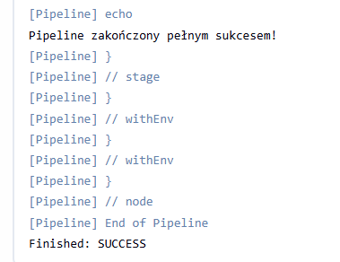
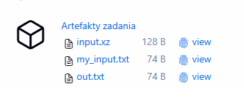