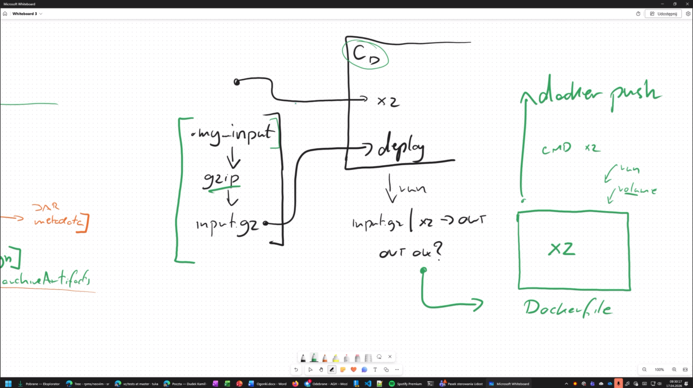

lab06
check

kontener zawierajacy xz taki, ze jak zrobie mu docker run i mu powiem zeby ten docker run odpalil xz i rozpakowal plik to z podpietym volumem rozpakowal plik na wolumenie, bez entrypointa,