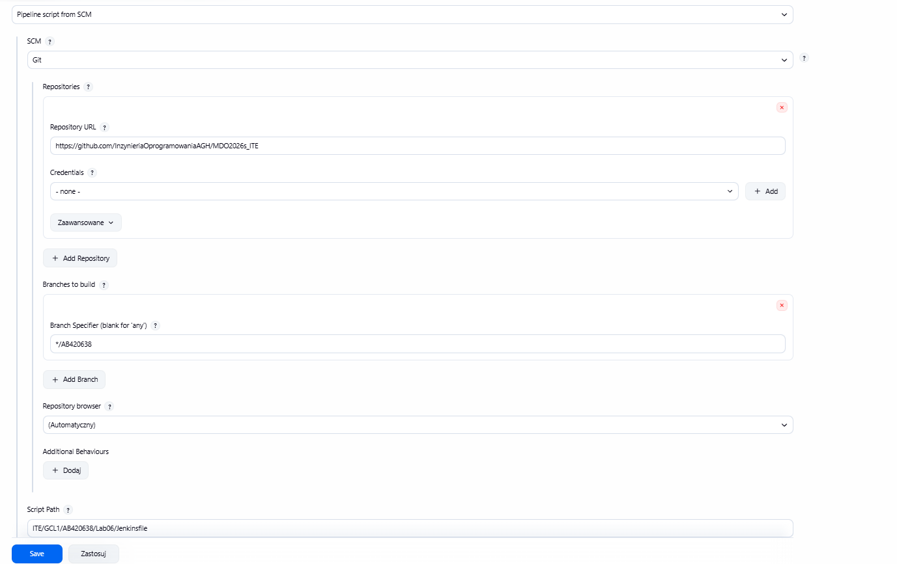

# Sprawozdanie z laboratoriów 5-7: Jenkins i automatyzacja CI/CD

**Autor:** [Twoje Imię i Nazwisko]
**Gałąź w repozytorium:** `AB420638`

---

## 1. Lab 5: Przygotowanie środowiska i zadania wstępne

### 1.1 Uruchomienie infrastruktury Jenkins (DinD)
Wdrożenie środowiska oparto o architekturę Docker-in-Docker (DinD), uruchamiając serwer Jenkins jako kontener posiadający dostęp do demona Dockera. Pozwala to na pełną izolację środowiska ciągłej integracji przy jednoczesnym zachowaniu możliwości budowania i uruchamiania obrazów wewnątrz agentów. Konfigurację oraz proces instalacji wtyczek (w tym interfejsu Blue Ocean) przedstawiają poniższe zrzuty ekranu.


### 1.2 Zadania typu Freestyle Project
W celu weryfikacji poprawności działania środowiska, stworzono proste projekty typu Freestyle. 

1. **Weryfikacja systemu (uname):** Zbudowano zadanie wywołujące proste komendy systemowe, co potwierdziło, że Jenkins prawidłowo egzekwuje skrypty powłoki.
2. **Wymuszenie błędu warunkowego:** Zaimplementowano skrypt sprawdzający aktualną datę/godzinę, celowo przerywając rurociąg statusem `FAILURE` w określonych warunkach, aby przetestować obsługę błędów.
3. **Komunikacja z Dockerem:** Uruchomiono zadanie pobierające obraz z zewnętrznego rejestru (`docker pull ubuntu`), co dowiodło, że agent Jenkinsa posiada poprawne uprawnienia do zarządzania kontenerami.


### 1.3 Pierwszy obiekt Pipeline
Kolejnym krokiem było utworzenie pierwszego, deklaratywnego obiektu Pipeline bezpośrednio w interfejsie graficznym Jenkinsa. Rurociąg klonował repozytorium i wykonywał podstawowe budowanie obrazu. Po rozwiązaniu początkowych problemów, drugie uruchomienie przeszło pomyślnie.


---

## 2. Lab 6 i 7: Specyficzny Pipeline CI/CD (Przetwarzanie Danych XZ)

### 2.1 Architektura i analiza problemu technologicznego

Zgodnie z wytycznymi z zajęć, proces CI/CD nie polegał na wdrożeniu klasycznej aplikacji webowej, lecz na zrealizowaniu potoku przetwarzania i kompresji danych. Architektura bazowa zakładała:
1. Stworzenie pliku wejściowego (`my_input`).
2. Kompresję do formatu `.gz` narzędziem `gzip`.
3. Zbudowanie obrazu Dockera zawierającego narzędzie `xz`.
4. Uruchomienie kontenera z podmontowanym wolumenem celem dekompresji (`xz -d`) wygenerowanego archiwum.
5. Walidację zgodności rozpakowanego pliku z oryginałem (`cmp`).

**Problem formatu kompresji:** Oryginalny schemat był technologicznie niemożliwy do zrealizowania, ponieważ narzędzie `xz` (korzystające z algorytmu LZMA2) nie obsługuje formatu `.gz` (algorytm DEFLATE). Próba bezpośredniej implementacji tego schematu zakończyła się krytycznym błędem w środowisku testowym: `xz: (stdin): File format not recognized`.


**Rozwiązanie i korekta:** Aby zachować cel zadania (weryfikacja kontenera z zainstalowanym narzędziem `xz`), zmodyfikowano etap przygotowania pliku. Wykorzystano jednorazowy kontener `alpine:3.19` w potoku Jenkinsa, aby na etapie przygotowawczym skompresować plik wejściowy poprawnie do formatu `.xz`. Docelowy kontener oparty na Ubuntu bezbłędnie przeprowadził dekompresję.


### 2.2 Diagram Aktywności (Proces CI/CD)

```mermaid
stateDiagram-v2
    direction TB

    [*] --> SCM_Checkout
    
    state SCM_Checkout {
        [*] --> Clean_Workspace
        Clean_Workspace --> Git_Clone
    }

    SCM_Checkout --> Prepare_Input

    state Prepare_Input {
        [*] --> Create_Text_File
        Create_Text_File --> Alpine_Container : Uruchom docker run alpine
        Alpine_Container --> Compress_XZ : Wygeneruj input.xz
    }

    Prepare_Input --> Build_Image

    state Build_Image {
        [*] --> Docker_Build
        Docker_Build --> Image_Ubuntu_XZ : docker build --no-cache
    }

    Build_Image --> Deploy_And_Test

    state Deploy_And_Test {
        [*] --> Run_Target_Container : docker run z wolumenem
        Run_Target_Container --> Unpack : xz -d
        Unpack --> Validation : cmp -s my_input.txt out.txt
        Validation --> Success : Zwróć kod 0
    }

    Deploy_And_Test --> Publish

    state Publish {
        [*] --> Archive_Artifacts : my_input.txt, input.xz, out.txt
        Archive_Artifacts --> Tag_Image
    }

    Publish --> Post_Cleanup
    
    state Post_Cleanup {
        [*] --> Remove_Local_Images : docker rmi
    }
    
    Post_Cleanup --> [*]
```



### 2.3 Deklaracja Infrastruktury (Infrastructure as Code)

Potok budowania został w pełni zautomatyzowany i przeniesiony z GUI Jenkinsa do repozytorium jako kod. Dzięki temu cała konfiguracja procesu CI stała się częścią projektu i jest wersjonowana.

**Wdrożenie SCM:** Konfiguracja Jenkinsa została ustawiona na tryb *Pipeline script from SCM*, wskazując na gałąź `AB420638` oraz ścieżkę do pliku wewnątrz repozytorium: `ITE/GCL1/AB420638/Lab06/Jenkinsfile`.


**Plik `Dockerfile` (w gałęzi AB420638)**
```
FROM ubuntu:22.04
ENV DEBIAN_FRONTEND=noninteractive

RUN apt-get update && \
    apt-get install -y xz-utils && \
    rm -rf /var/lib/apt/lists/*

WORKDIR /app
CMD ["xz", "--help"]
```

**Plik `Jenkinsfile` (w gałęzi AB420638)**
```
pipeline {
    agent any
    environment {
        IMAGE_NAME = "xz-processor-app"
        WORK_DIR = "ITE/GCL1/AB420638/Lab06"
    }

    stages {
        stage('1. Clean & Checkout') {
            steps {
                cleanWs()
                checkout scm
            }
        }

        stage('2. Prepare Input (xz)') {
            steps {
                dir("${WORK_DIR}") {
                    script {
                        echo "Tworzenie pliku my_input i kompresja xz..."
                        sh '''
                            echo "To jest testowy tekst, ktory Jenkins skompresuje, a Docker zdekompresuje." > my_input.txt
                            docker run --rm -v $(pwd):/app -w /app alpine:3.19 sh -c "apk add --no-cache xz > /dev/null && xz -c my_input.txt > input.xz"
                        '''
                    }
                }
            }
        }

        stage('3. Build (XZ Image)') {
            steps {
                dir("${WORK_DIR}") {
                    script {
                        echo "Budowanie obrazu Dockera (Ubuntu) z narzędziem xz..."
                        sh 'docker build --no-cache -t ${IMAGE_NAME}:latest .'
                    }
                }
            }
        }

        stage('4. Deploy & Test (out ok?)') {
            steps {
                dir("${WORK_DIR}") {
                    script {
                        echo "Uruchamianie kontenera docelowego, przetwarzanie input.xz i walidacja..."
                        sh '''
                            docker run --rm -v $(pwd):/app -w /app ${IMAGE_NAME}:latest sh -c "cat input.xz | xz -d > out.txt"
                            
                            echo "Walidacja: 'out ok?'"
                            if cmp -s my_input.txt out.txt; then
                                echo "[SUKCES] Plik out.txt jest identyczny z my_input.txt. Dekompresja w kontenerze przebiegla pomyslnie!"
                            else
                                echo "[BŁĄD] Pliki się różnią! Proces zawiódł."
                                exit 1
                            fi
                        '''
                    }
                }
            }
        }

        stage('5. Publish & Archive') {
            steps {
                dir("${WORK_DIR}") {
                    script {
                        echo "Zapisywanie artefaktów w Jenkinsie..."
                        archiveArtifacts artifacts: 'my_input.txt, input.xz, out.txt', fingerprint: true
                        sh 'docker tag ${IMAGE_NAME}:latest ${IMAGE_NAME}:${BUILD_NUMBER}'
                    }
                }
            }
        }
    }

    post {
        always {
            script {
                sh "docker rmi ${IMAGE_NAME}:latest || true"
                sh "docker rmi ${IMAGE_NAME}:${BUILD_NUMBER} || true"
            }
        }
    }
}
```

### 2.4 Wyniki i Archiwizacja (Definition of Done)
**Powtarzalność:** Rurociąg wykonuje się poprawnie przy każdym uruchomieniu dzięki czyszczeniu przestrzeni roboczej (`cleanWs`) oraz wymuszaniu budowania bez cache'u.
**Skuteczność:** Etap walidacji potwierdził, że zdekompresowany plik jest identyczny z oryginałem, co skutkowało komunikatem o sukcesie: `[SUKCES] Plik out.txt jest identyczny z my_input.txt`


Proces kończy się archiwizacją artefaktów buildu (`my_input.txt`, `input.xz`, `out.txt`), które są dostępne bezpośrednio w panelu Jenkinsa po zakończeniu zadania.


---
