# Sprawozdanie 
# Lab 08: Automatyzacja i zdalne wykonywanie poleceń za pomocą Ansible

## 1. Architektura i przygotowanie bazowego środowiska

Zajęcia rozpocząłem od zaprojektowania i wdrożenia bazowej architektury środowiska składającego się z węzła kontrolnego (Control Node) oraz maszyny zarządzanej (Managed Node). Zgodnie z dobrymi praktykami bezpieczeństwa i minimalizacji wektorów ataku, drugą maszynę wirtualną zainstalowałem z jak najmniejszym zbiorem oprogramowania bazowego. 

Podczas procesu instalacji systemu operacyjnego (zgodnego dystrybucyjnie z maszyną główną) nadałem jej jednoznaczny hostname `ansible-target` oraz utworzyłem dedykowanego użytkownika `ansible`. Upewniłem się również, że w docelowym systemie obecne są pakiety absolutnie krytyczne do działania Ansible: serwer `openssh-server` (odpowiedzialny za nasłuchiwanie na porcie 22) oraz program `tar` (wykorzystywany przez Ansible do rozpakowywania przesyłanych modułów). W tym celu na maszynie docelowej zaktualizowałem pakiety i doinstalowałem niezbędne oprogramowanie.

W hypervisorze upewniłem się, że struktura maszyn jest poprawna i wykonałem punkt kontrolny (migawkę) czystej maszyny docelowej, aby móc do niej wrócić w razie krytycznego błędu konfiguracji.

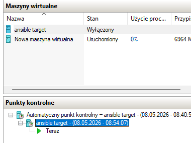

Następnie przełączyłem się na główną maszynę (węzeł kontrolny) i przeszedłem do instalacji samego silnika Ansible, korzystając z oficjalnych repozytoriów dystrybucji i menedżera `apt`.

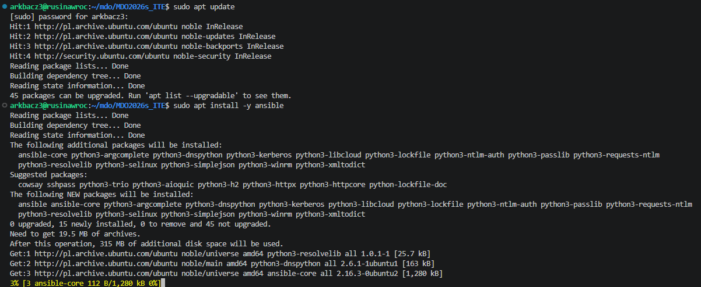

### Zapewnienie bezagentowej łączności (SSH)
Siłą Ansible jest jego bezagentowa architektura (agentless) – nie musimy instalować żadnych dodatkowych demonów na maszynach docelowych, gdyż wykorzystywany jest standardowy protokół SSH. Posiadałem już wygenerowany wcześniej domyślny klucz asymetryczny `id_ed25519`, co zweryfikowałem wyświetlając zawartość klucza publicznego.

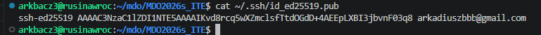

Kolejnym krokiem było ustabilizowanie warstwy sieciowej na maszynie docelowej. Zaaplikowałem przygotowaną konfigurację `netplan` i upewniłem się komendą `ip a`, że maszynie poprawnie przypisano statyczny adres IP (`10.0.0.20`) na interfejsie `eth0`. 

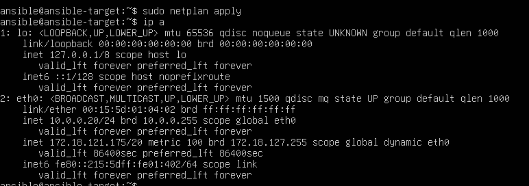

Aby uniezależnić konfigurację od suchych adresów IP, na węźle kontrolnym wyedytowałem plik lokalnej konfiguracji DNS (`/etc/hosts`), mapując przypisany adres `10.0.0.20` na czytelną nazwę `ansible-target`.

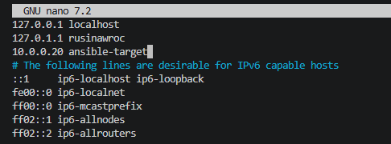

W celu zwiększenia bezpieczeństwa i organizacji, postanowiłem wygenerować nową, dedykowaną parę kluczy SSH (o nazwie `ansible_key`) specjalnie do komunikacji w ramach tego laboratorium.

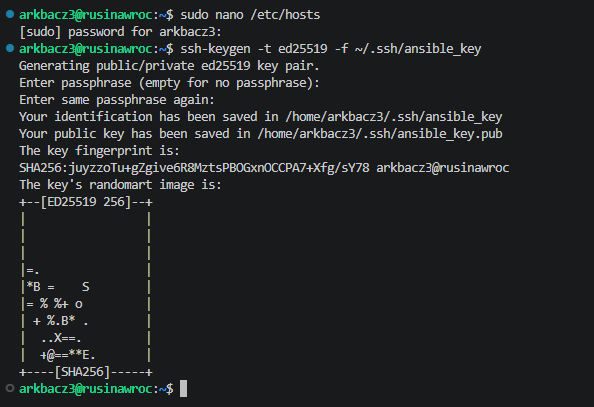

Poprawność łączności sieciowej pomiędzy węzłami zweryfikowałem z pełnym sukcesem za pomocą komendy ping (protokół ICMP).

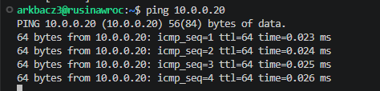

Mimo sprawnej warstwy sieciowej, przy próbie przesłania wygenerowanego klucza publicznego na maszynę docelową za pomocą `ssh-copy-id`, natrafiłem na błąd autoryzacji i odrzucenie żądania (`Permission denied (publickey,password)`). Oznaczało to, że serwer docelowy całkowicie odrzucał próby uwierzytelnienia.

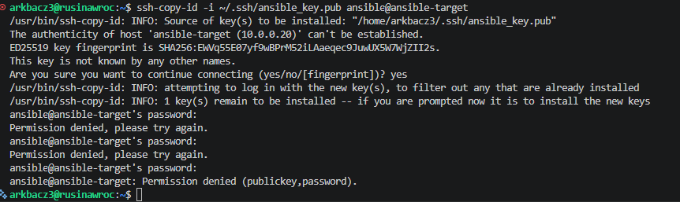

Problem wynikał z faktu, że demon SSH na maszynie docelowej miał domyślnie wyłączoną opcję logowania się za pomocą hasła, przez co `ssh-copy-id` nie miało jak autoryzować się przy pierwszym połączeniu w celu wgrania klucza. Zalogowałem się lokalnie na maszynę `ansible-target` i wyedytowałem plik konfiguracyjny `/etc/ssh/sshd_config`, odkomentowując dyrektywę `PasswordAuthentication yes`. Po ponownym uruchomieniu usługi SSH mogłem pomyślnie skopiować klucz.

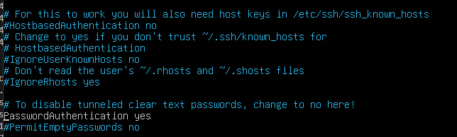

Zauważyłem również, że po rekonfiguracji maszyna docelowa otrzymała nowy adres IP z innej puli DHCP. Zaktualizowałem więc jej interfejsy i ponownie zaaplikowałem nową konfigurację `netplan`.

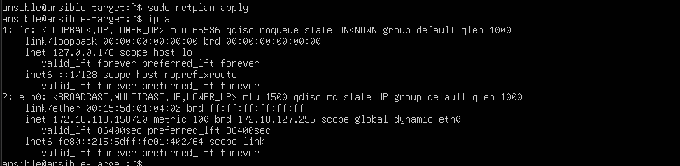

Zmiana adresu IP (lub przebudowa maszyny) spowodowała krytyczny konflikt bezpieczeństwa na węźle kontrolnym. Przy próbie użycia `ssh-copy-id`, klient SSH zablokował połączenie z powodu niezgodności odcisku palca hosta (błąd "REMOTE HOST IDENTIFICATION HAS CHANGED!"), chroniąc przed potencjalnym atakiem Man-in-the-Middle. 

Problem ten rozwiązałem zgodnie ze sztuką, usuwając zapamiętany, stary klucz z pliku `known_hosts` za pomocą polecenia `ssh-keygen -R 'ansible-target'`. Następnie bezpiecznie i pomyślnie wgrałem nowy klucz komendą `ssh-copy-id`.

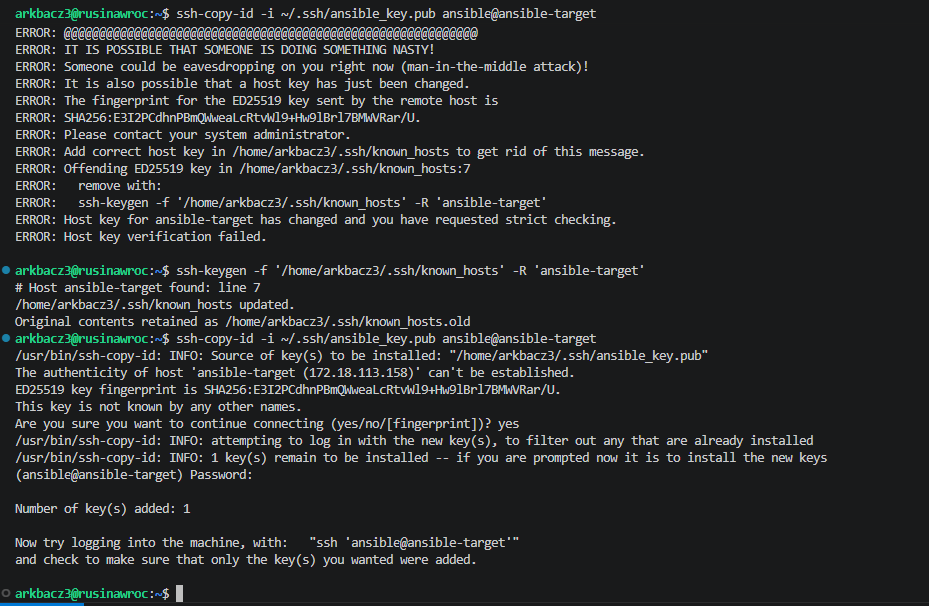

Po tych zabiegach infrastrukturalnych poprawnie zalogowałem się na maszynę docelową po SSH, potwierdzając ostatecznie stabilne działanie komunikacji.

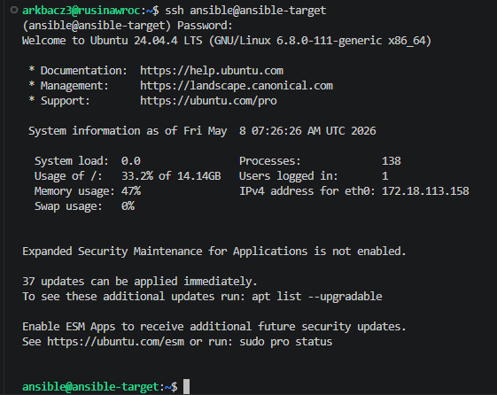

## 2. Inwentaryzacja środowiska i warstwa abstrakcji DNS

Zarządzanie infrastrukturą opartą wyłącznie na zmiennych adresach IP jest antywzorcem, który drastycznie utrudnia utrzymanie środowiska. Przeszedłem zatem do logicznej inwentaryzacji. Za pomocą polecenia `hostnamectl set-hostname` trwale wyeliminowałem domyślne nazwy maszyn, nadając im czytelne identyfikatory: `devops-main` dla węzła kontrolnego oraz `ansible-target` dla węzła docelowego.

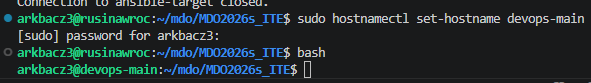

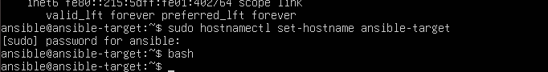

Następnie zaimplementowałem lokalne rozwiązywanie nazw. Zaktualizowałem mapowanie w lokalnym pliku DNS (`/etc/hosts`) na węźle kontrolnym, przypisując nowe adresy IP do odpowiednich nazw hostów.

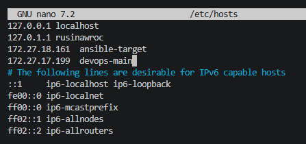

Mając przygotowaną spójną warstwę sieciową, przystąpiłem do napisania pliku inwentaryzacji (Inventory) o nazwie `inventory.ini`. Podzieliłem architekturę na dwie logiczne grupy: `[Orchestrators]`, gdzie zdefiniowałem maszynę główną nakazując jej połączenie lokalne (`ansible_connection=local`), oraz `[Endpoints]` reprezentującą węzły wykonawcze.

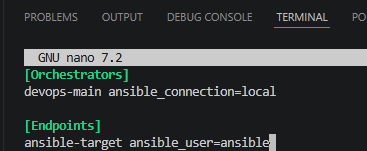

Warto zaznaczyć, że dla maszyny docelowej jawnie wskazałem ścieżkę do wygenerowanego wcześniej dedykowanego klucza prywatnego parametrem `ansible_ssh_private_key_file`. Zapewnia to, że Ansible podczas łączenia zawsze użyje odpowiedniej tożsamości.

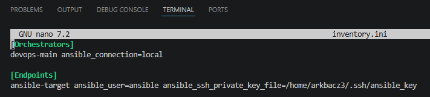

Aby potwierdzić operacyjność tak zdefiniowanego klastra, wywołałem polecenie `ansible all -i inventory.ini -m ping`. Moduł `ping` w Ansible nawiązuje rzeczywistą sesję SSH, przesyła miniaturowy skrypt w języku Python na węzeł docelowy, wykonuje go i weryfikuje, czy otrzymuje zwrotny obiekt JSON `{ "ping": "pong" }`. Operacja dla obu maszyn zakończyła się statusem `SUCCESS`.

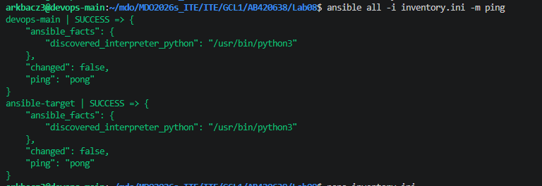

## 3. Zdalne wywoływanie procedur: Playbooki i analiza idempotencji

Odchodząc od jednorazowych komend wywoływanych z terminala (ad-hoc), przystąpiłem do tworzenia deklaratywnych Playbooków zapisanych w formacie YAML. Pierwszy playbook został podzielony na dwa bloki zadań (plays). Pierwszy z nich ma za zadanie wysłać kontrolny sygnał ping do wszystkich maszyn w inwentarzu (`hosts: all`). Drugi blok wykorzystuje moduł `ansible.builtin.copy`, wymuszając przesłanie lokalnego pliku `inventory.ini` bezpośrednio na maszyny przynależące wyłącznie do grupy docelowej `Endpoints`.

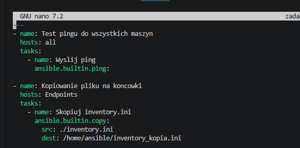

Podczas pierwszego wywołania `ansible-playbook`, system wykrył brak pliku na serwerze docelowym i wykonał jego transfer, co zostało zaraportowane w podsumowaniu stanem `changed`.

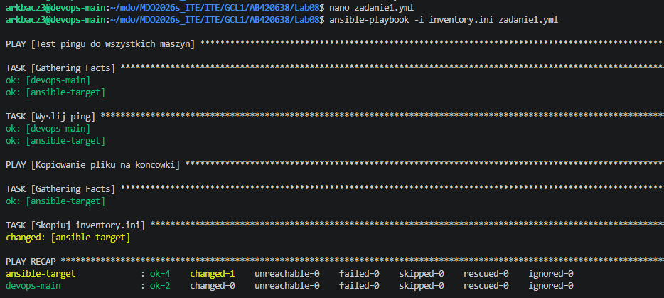

Kluczowym konceptem w podejściu Infrastructure as Code jest **idempotencja** – uruchomienie tego samego playbooka po raz kolejny nie powinno wywoływać żadnych zmian, jeśli docelowa konfiguracja została już wcześniej osiągnięta. Sprawdziłem to, ponawiając wykonanie komendy. Ansible, wyliczając sumy kontrolne (checksums) pliku lokalnego i zdalnego, stwierdziło, że stan faktyczny jest równy stanowi pożądanemu. Zgłoszono brak modyfikacji (status `ok=4`, `changed=0`).

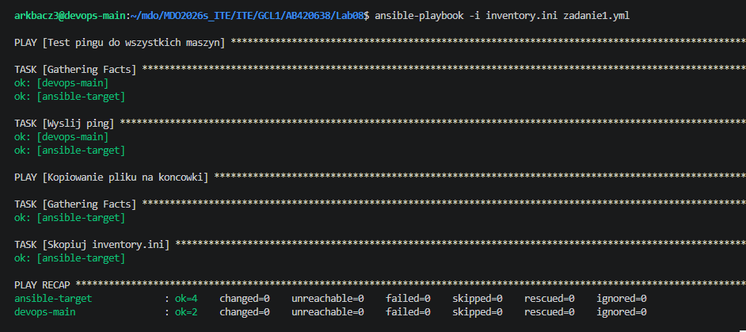

W dalszej części laboratorium rozbudowałem playbook o drugie zadanie konfiguracyjne (Administracja systemem). Wykorzystałem moduł `apt` do aktualizacji pamięci podręcznej i pełnej aktualizacji pakietów (`upgrade: dist`). Następnie użyłem modułu `service` w pętli (`loop`), aby wymusić restart kluczowych usług: `ssh` oraz `rngd`. Ponieważ na maszynie o minimalnej instalacji (jak mój `ansible-target`) usługa generatora liczb losowych `rngd` mogła nie być w ogóle zainstalowana, prewencyjnie zastosowałem dyrektywę `ignore_errors: yes`, co zapobiega przerwaniu całego potoku w razie błędu.

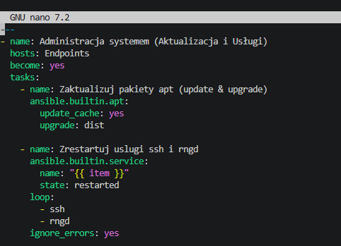

Uruchomienie tego playbooka idealnie potwierdziło założenia. Aktualizacja pakietów APT oraz restart demona SSH powiodły się (status `changed`). Przy próbie restartu `rngd` Ansible zgłosiło spodziewany błąd (`Could not find the requested service rngd`). Dzięki zastosowanej klauzuli ignorowania błędów, potok operacji nie uległ awarii (komunikat `...ignoring`) i zakończył się poprawnym podsumowaniem z flagą `ignored=1`.

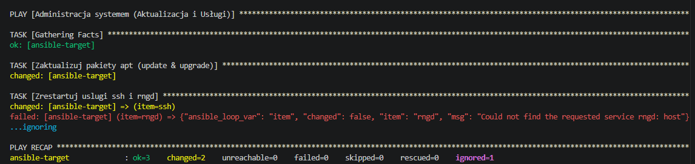

## 4. Zarządzanie cyklem życia artefaktu: Role i integracja z Dockerem

Utrzymywanie wszystkich zadań w jednym gigantycznym pliku YAML to znany antywzorzec. Aby przygotować zautomatyzowane wdrożenie, rozpocząłem od stworzenia testowego artefaktu – skompresowanego pliku tekstowego `input.xz`. Następnie zrefaktoryzowałem projekt, wykorzystując wbudowane polecenie `ansible-galaxy role init deploy_xz_app`. Generuje to ustandaryzowaną strukturę podfolderów (m.in. `tasks`, `vars`, `handlers`, `meta`), która ułatwia reużywalność kodu. 

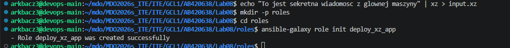

W pliku `meta/main.yml` uzupełniłem podstawowe metadane, takie jak autor i opis wdrażanej roli.

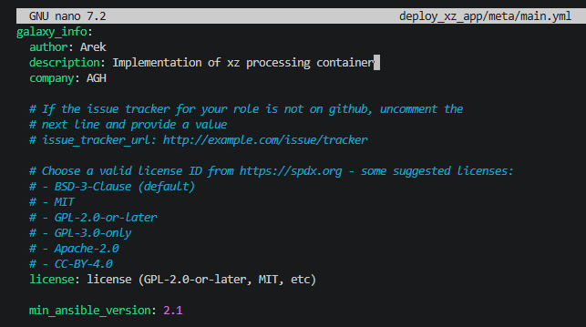

Główną logikę wdrożeniową zdefiniowałem w pliku `tasks/main.yml`. Zaprojektowałem w nim proces składający się z 6 precyzyjnych kroków:
1. **Sanity Check:** Sprawdzenie dostępnego miejsca na dysku docelowym poleceniem `df -h /` (z klauzulą `ignore_errors`).
2. **Instalacja Dockera:** Zapewnienie środowiska uruchomieniowego poprzez instalację pakietu `docker.io` oraz upewnienie się, że usługa działa (`state: started`).
3. **Przygotowanie środowiska:** Utworzenie docelowego katalogu roboczego (`/home/ansible/app_deploy`) i skopiowanie do niego artefaktu `input.xz`.
4. **Zarządzanie kontenerem:** Pobranie bazowego obrazu `ubuntu:22.04` i uruchomienie w nim potoku komend. Kontener mapuje przygotowany wcześniej wolumen, instaluje program `xz-utils` za pomocą wewnętrznego menedżera `apt`, a następnie dekompresuje artefakt do pliku `out.txt`.
5. **Weryfikacja:** Użycie modułu `stat` do sprawdzenia, czy plik `out.txt` faktycznie pojawił się na serwerze docelowym. Zarejestrowana zmienna warunkuje wywołanie modułu `debug`, który wypisuje komunikat o sukcesie.
6. **Czyszczenie (Teardown):** Zatrzymanie kontenera, jego usunięcie oraz całkowite skasowanie katalogu roboczego na serwerze docelowym (`state: absent`).

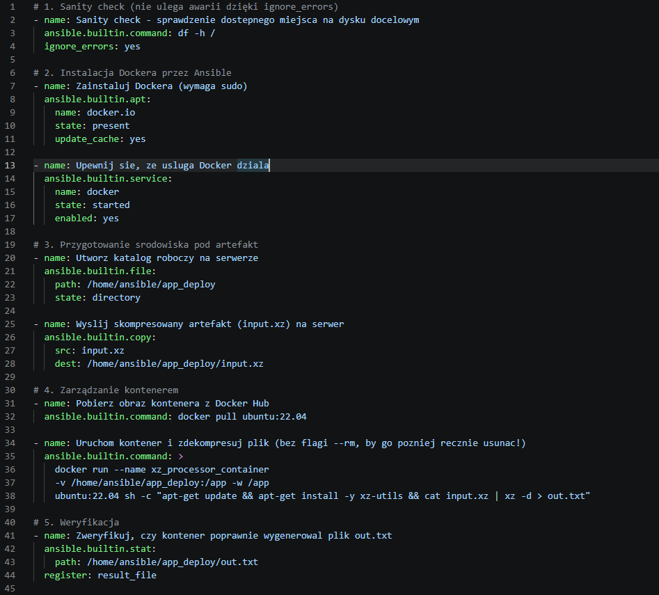

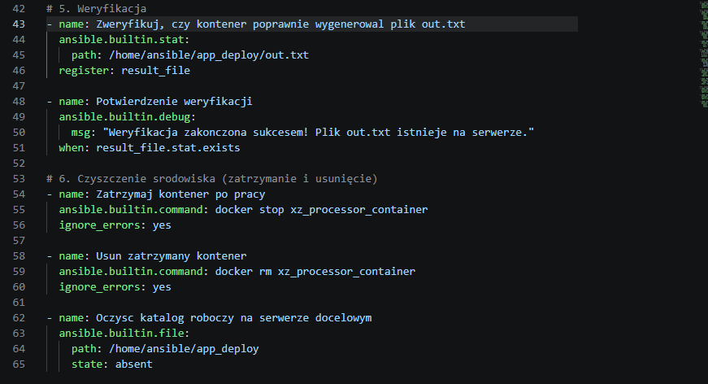

Mając gotową Rolę, utworzyłem zwięzły plik wdrożeniowy (Master Deploy), który instruował Ansible do uruchomienia roli `deploy_xz_app` na wszystkich hostach w grupie `Endpoints`.

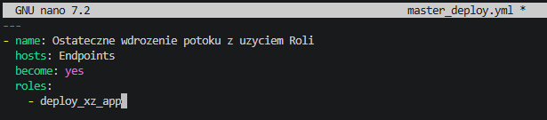

Wykonanie głównego playbooka zakończyło się fenomenalnym rezultatem. Ansible krok po kroku połączyło się z endpointem, przygotowało środowisko, zainstalowało Dockera, wykreowało kontener dekompresujący i poprawnie posprzątało system, wypisując po drodze zdefiniowany komunikat weryfikacyjny: *"Weryfikacja zakonczona sukcesem! Plik out.txt istnieje na serwerze."*

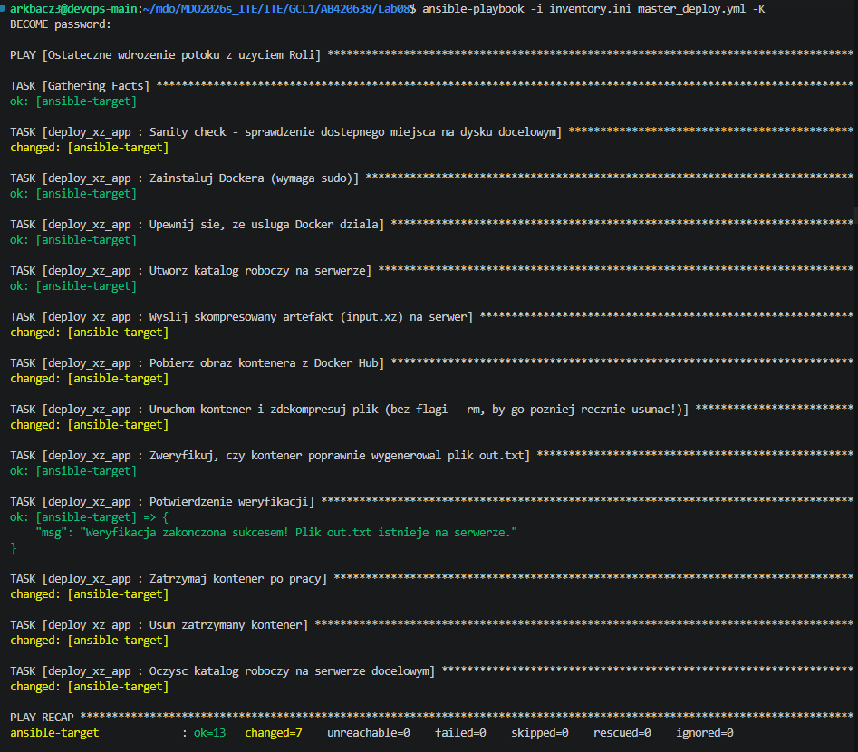

### Wnioski
Wykonane laboratorium ukazuje radykalną przewagę systematycznego podejścia Infrastructure as Code nad ręcznym logowaniem się na maszyny. Główne wnioski z przeprowadzonych prac to:
* **Idempotencyjność i obsługa błędów:** Narzędzie pozwala nie tylko powtarzać te same wdrożenia bez obawy o awarię systemu, ale także bezpiecznie radzić sobie z brakiem oczekiwanych zależności (np. wykorzystując `ignore_errors` przy brakującej usłudze systemowej).
* **Bezagentowość:** Wszystkie te zaawansowane konfiguracje, łącznie z budowaniem struktury Dockera, wykonują się w pełni po protokole SSH, bez instalacji dodatkowych programów szpiegujących/agentów na serwerach docelowych.
* **Modularyzacja z Ansible Galaxy:** Rozbicie płaskiego pliku YAML na ustrukturyzowaną Rolę drastycznie zwiększa czytelność logiki wdrożeniowej, pozwala na jej proste wersjonowanie w systemach Git i bezproblemowe użycie w potokach Continuous Deployment (CI/CD).

## Lab 09: Pliki odpowiedzi dla wdrożeń nienadzorowanych (Kickstart)

## 1. Wstęp i pozyskanie bazowego pliku odpowiedzi

Celem laboratorium było zautomatyzowanie procesu instalacji (provisioningu) systemu operacyjnego dla maszyny docelowej, w tym przypadku Fedory 44 (Server Edition). Wdrożenia nienadzorowane (unattended installations) eliminują konieczność ręcznego "klikania" w instalatorze, co jest fundamentem w środowiskach chmurowych i potokach CI/CD.

Instalator systemu z rodziny Red Hat (Anaconda) po każdej udanej ręcznej instalacji generuje plik `anaconda-ks.cfg` w katalogu domowym użytkownika `root`. Postanowiłem wykorzystać ten mechanizm. W pierwszej kolejności zainstalowałem system referencyjny, a następnie, korzystając z protokołu SCP, pobrałem wygenerowany plik na moją maszynę kontrolną (hosta) w celu jego dalszej modyfikacji.

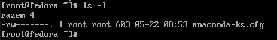

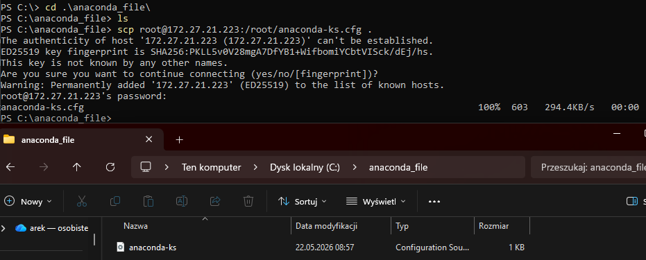

## 2. Przygotowanie infrastruktury wirtualnej i hostingu pliku

Aby nowa maszyna mogła pobrać plik odpowiedzi z sieci podczas rozruchu instalatora, musiałem udostępnić zmodyfikowany plik Kickstart (`ks.cfg`) oraz zbudowany artefakt w sieci lokalnej. Wykorzystałem do tego wbudowany w język Python moduł serwera HTTP. Będąc w katalogu z plikami, uruchomiłem serwer na porcie 8000 komendą `python3 -m http.server 8000`.

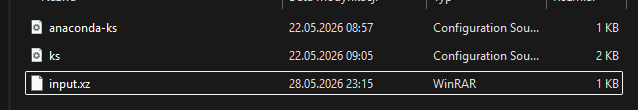

Następnie skonfigurowałem docelową maszynę wirtualną w menedżerze Hyper-V. Zgodnie z dobrymi praktykami i wymaganiami środowiskowymi, upewniłem się, że jest to maszyna generacji 2 (UEFI). Wyłączyłem funkcję bezpiecznego rozruchu (Secure Boot), przydzieliłem 6 procesorów wirtualnych oraz 2048 MB pamięci RAM. Jako nośnik rozruchowy wskazałem sieciowy obraz instalacyjny (Netinst ISO) Fedory.

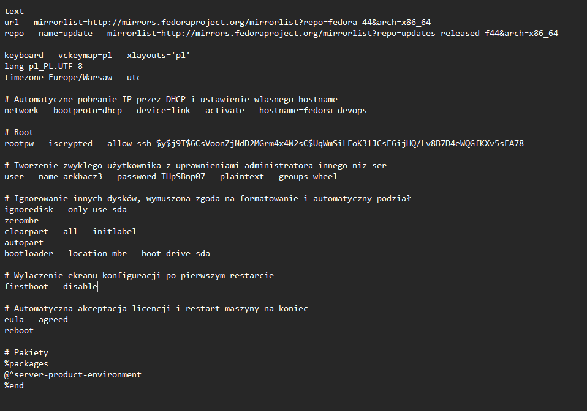

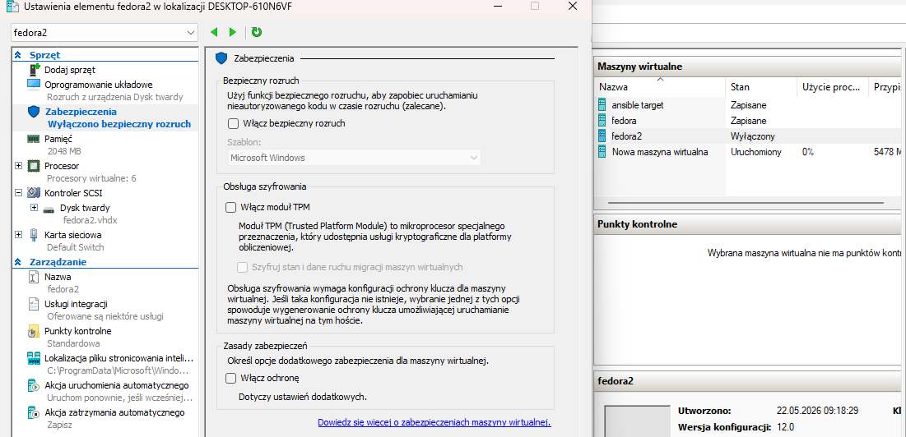

## 3. Analiza i adaptacja pliku Kickstart (ks.cfg)

Aby instalacja przebiegła w trybie całkowicie "bezdotykowym" i pozwalała na wielokrotne reinstalacje bez zawieszania się na prośbach o potwierdzenie, dokonałem szeregu modyfikacji w pliku `ks.cfg`:

1. **Źródła sieciowe i język:** Wskazałem bezpośrednie adresy URL do repozytoriów lustrzanych Fedory (`url --mirrorlist=...`) oraz ustawiłem polski układ klawiatury i strefę czasową `Europe/Warsaw`.
2. **Partycjonowanie:** To krytyczny punkt wdrożeń nienadzorowanych. Użyłem dyrektyw `zerombr` (czyszczenie Master Boot Record), `clearpart --all --initlabel` (usunięcie wszystkich istniejących partycji) oraz `ignoredisk --only-use=sda`. Dzięki temu instalator nigdy nie zapyta, czy sformatować dysk przy kolejnych próbach instalacji. Automatyczny podział dysku zapewniła dyrektywa `autopart`.
3. **Użytkownicy i Sieć:** Skonfigurowałem sieć do pobierania adresu z serwera DHCP oraz wymusiłem niestandardowy hostname `fedora-devops`. Utworzyłem również zwykłego użytkownika z uprawnieniami administratora (grupa `wheel`) o nazwie `arkbacz3`.
4. **Zakończenie:** Dodanie flagi `eula --agreed` i `reboot` zapewniło, że maszyna nie zawiśnie na ekranie podsumowania, lecz od razu po instalacji uruchomi się ponownie.

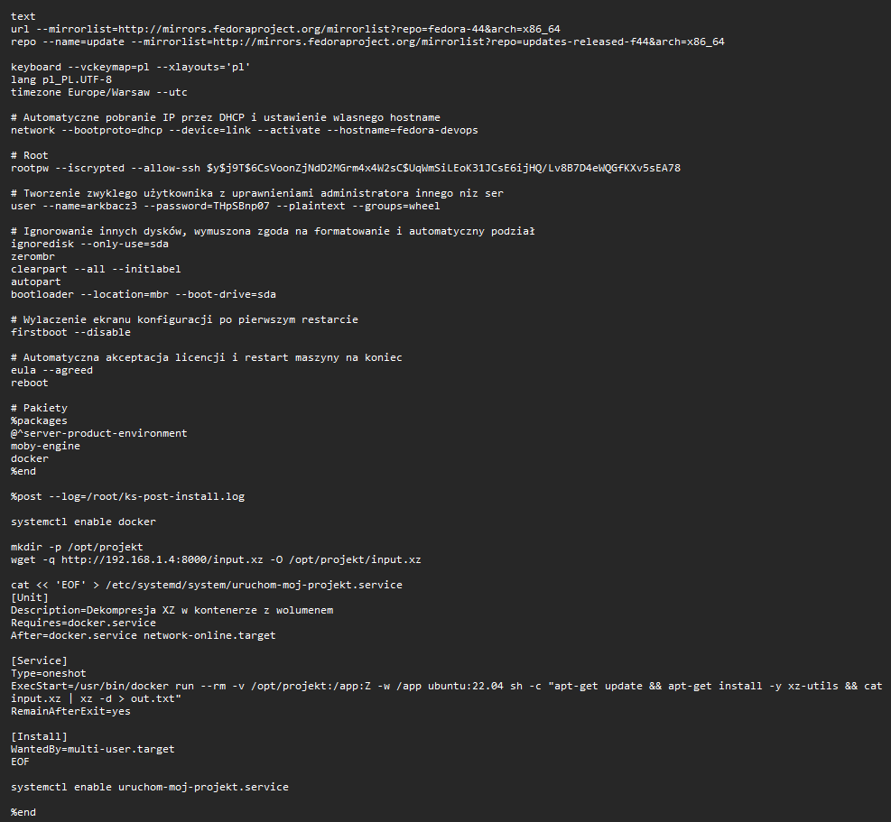

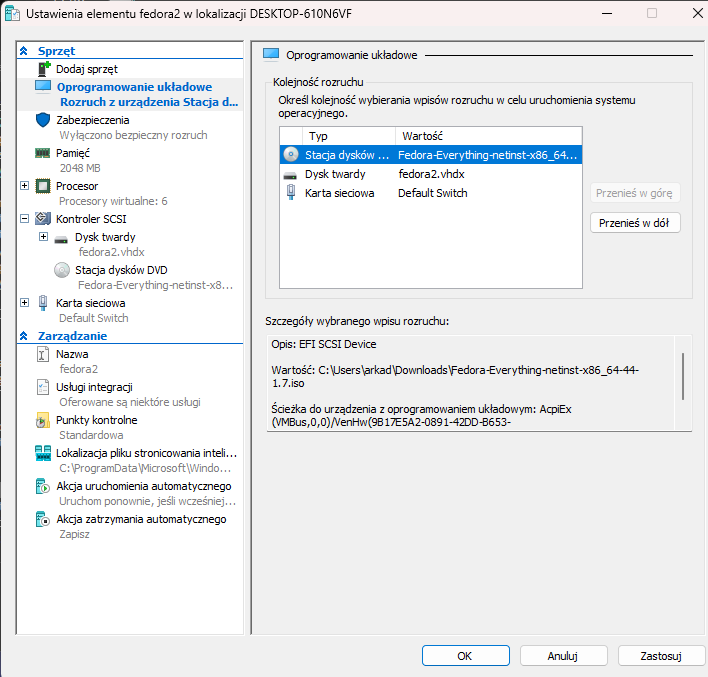

## 4. Konfiguracja sekcji %packages oraz %post (Wdrożenie Artefaktu)

Zgodnie z poleceniem, musiałem nie tylko zainstalować system, ale także automatycznie wdrożyć moją aplikację opartą o konteneryzację.

W sekcji `%packages` nakazałem instalatorowi pobranie środowiska `server-product-environment` oraz zainstalowanie narzędzi Dockerowych (`moby-engine`, `docker`). 

Największym wyzwaniem inżynieryjnym była sekcja `%post`. Skrypty w tej sekcji wykonują się w środowisku `chroot` pod koniec instalacji. **Kluczowy problem polega na tym, że demon Dockera nie działa w trakcie działania instalatora Anaconda.** Oznacza to, że bezpośrednie wpisanie `docker run` w sekcji `%post` zakończyłoby się fatalnym błędem braku łączności z socketem Dockera.

Aby to obejść, zastosowałem mechanizm usług `systemd`:
1. Włączyłem demona dockera poleceniem `systemctl enable docker` (co jest dozwolone w chroot, gdyż jedynie tworzy symlinki na przyszłość).
2. Za pomocą komendy `wget` pobrałem mój artefakt (`input.xz` - skompresowany plik tekstowy z Jenkinsa) z serwera HTTP hosta do katalogu `/opt/projekt/`.
3. Wygenerowałem w locie (przy użyciu `cat << EOF`) własną jednostkę systemd (`uruchom-moj-projekt.service`). Usługa ta ma dyrektywę `After=docker.service`, co gwarantuje, że uruchomi się *dopiero*, gdy system wstanie i demon Dockera będzie gotowy do pracy.
4. Zdefiniowany w usłudze kontener (na bazie obrazu Ubuntu 22.04) mapuje wolumen, instaluje narzędzia dekompresyjne i rozpakowuje podany artefakt (`input.xz | xz -d > out.txt`).
5. Na koniec aktywowałem nową usługę komendą `systemctl enable uruchom-moj-projekt.service`.

## 5. Wykonanie instalacji nienadzorowanej i weryfikacja

Po uruchomieniu maszyny wirtualnej z podpiętym obrazem ISO, w menu bootloadera GRUB przerwałem domyślny proces naciskając klawisz `e` (edycja parametrów jądra). Na końcu linii inicjującej jądro (`vmlinuz`) dopisałem parametr wskazujący na mój serwer HTTP: `inst.ks=http://192.168.1.4:8000/ks.cfg`.

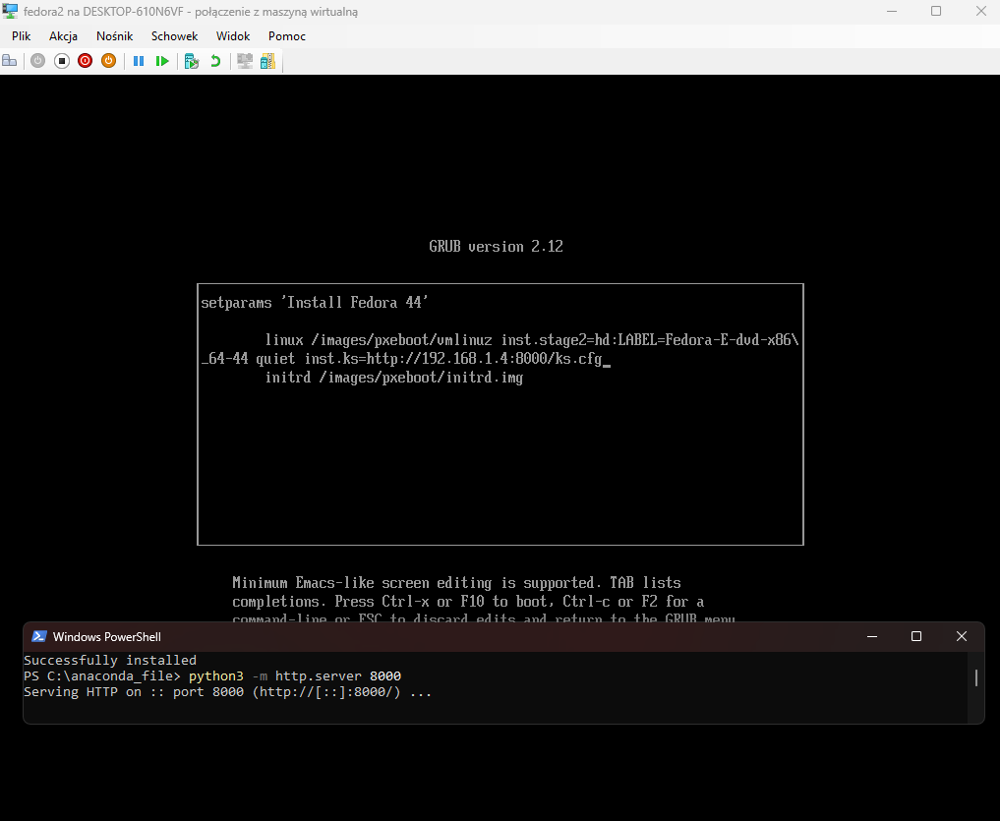

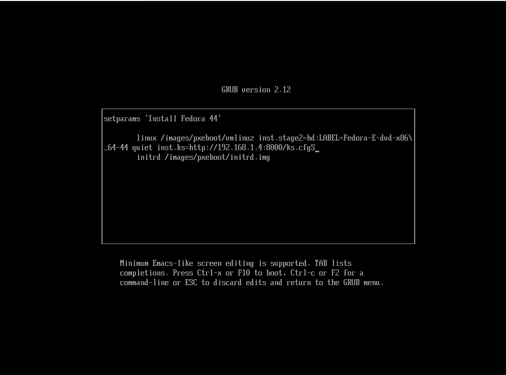

Po wciśnięciu `Ctrl-x` maszyna rozpoczęła proces bootowania. Instalator Anaconda odczytał plik z sieci, przeanalizował go i rozpoczął automatyczne partycjonowanie oraz instalację bez zadawania ani jednego pytania.

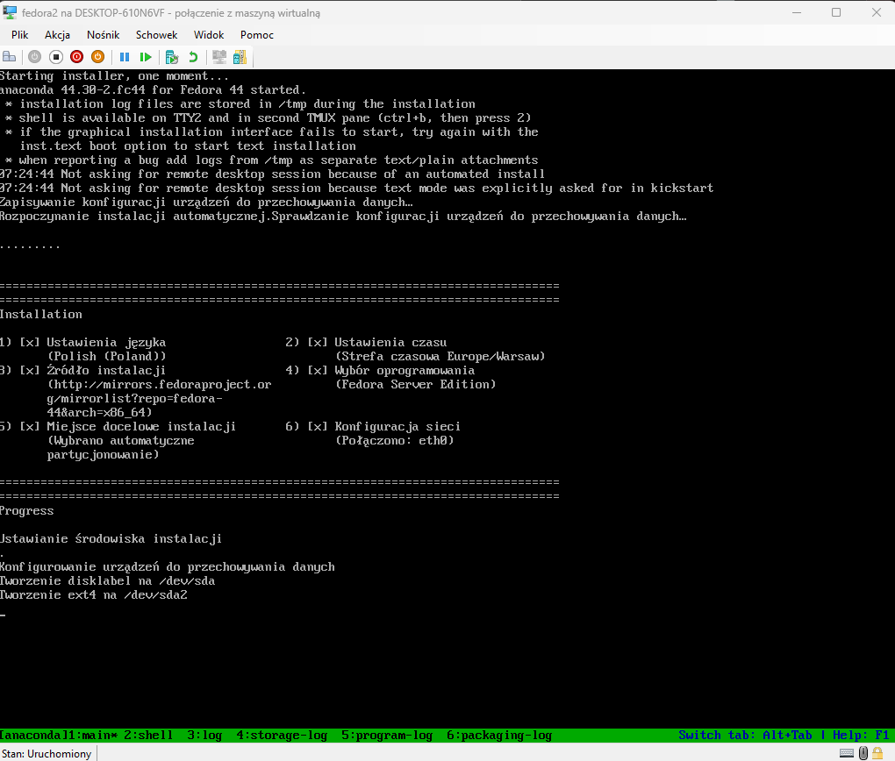

Po zakończonej instalacji maszyna uruchomiła się ponownie (zgodnie z dyrektywą `reboot`). Zalogowałem się na utworzonego użytkownika `arkbacz3` na hoście `fedora-devops`. 

Przeszedłem do katalogu `/opt/projekt/` i wylistowałem jego zawartość. Obok pierwotnie pobranego pliku `input.xz` znajdował się plik `out.txt`. Wypisanie jego zawartości udowodniło, że usługa `systemd` zadziałała poprawnie po rozruchu, odpaliła kontener Dockera, zdekodowała artefakt i zapisała na dysk docelowy wiadomość: *"To jest testowy tekst, ktory Jenkins skompresuje, a Docker zdekompresuje"*.

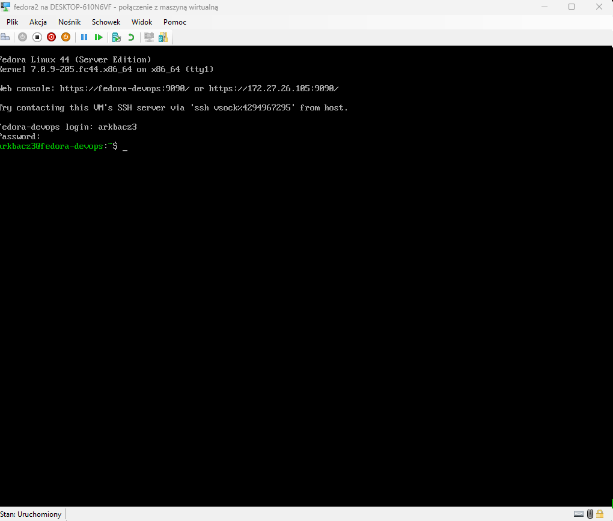

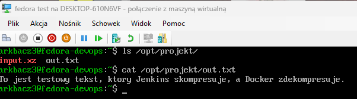

## Wnioski
Laboratorium udowodniło potęgę plików odpowiedzi w automatyzacji tworzenia infrastruktury (Infrastructure Provisioning). 
Najważniejsze wnioski techniczne:
* **Przewidywalność:** Posiadając plik `ks.cfg`, możemy w kilka minut odtworzyć identyczny serwer od zera, bez obawy o błąd ludzki (tzw. "literówki" podczas wpisywania haseł czy złe sformatowanie partycji).
* **Niezmienna Infrastruktura (Immutable Infrastructure):** Koncepcja łączenia Kickstartu (konfiguracja systemu) z Ansible i Dockerem pozwala traktować same maszyny wirtualne jako "bydło, a nie zwierzęta domowe" (cattle vs pets). W razie awarii systemu operacyjnego nie naprawiamy go, lecz wdrażamy nową, czystą maszynę w sposób nienadzorowany.
* **Ograniczenia środowiska chroot:** Zrozumienie, że skrypty `%post` instalatora wykonują się w fałszywym środowisku bez włączonego menedżera PID 1 (systemd) i usług (jak Docker), jest kluczowe w projektowaniu takich wdrożeń. Tworzenie jednostek `.service` ładujących się przy pierwszym rzeczywistym rozruchu (First-boot configuration) to poprawny i jedyny bezpieczny wzorzec projektowy w tym przypadku.

# Lab 10: Wdrażanie na zarządzalne kontenery: Kubernetes

# 1. Instalacja klastra Kubernetes (Minikube)

Zajęcia rozpocząłem od przygotowania środowiska uruchomieniowego Kubernetes w postaci klastra `minikube`. Jest to implementacja przeznaczona do lokalnego testowania aplikacji, tworząca środowisko klastrowe wewnątrz maszyny wirtualnej bądź kontenera.

Przed samą instalacją pobrałem pliki binarne za pomocą narzędzia `curl`, a następnie zweryfikowałem ich sumy kontrolne komendą `sha256sum --check`. Wynik `OK` potwierdził integralność pobranych plików, co jest kluczowym krokiem z perspektywy bezpieczeństwa (zapobiega uruchomieniu zmodyfikowanego, złośliwego kodu).

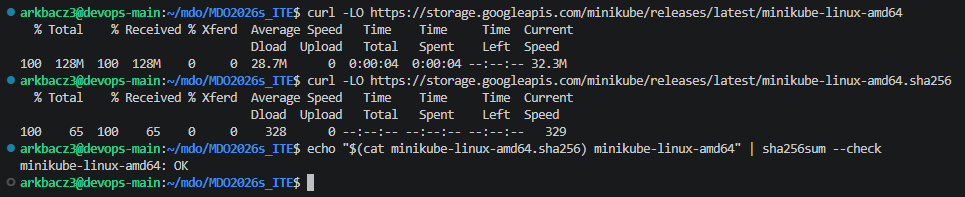

Aby środowisko działało płynnie, zmitygowałem ewentualne problemy z wymaganiami sprzętowymi, wymuszając w ustawieniach maszyny wirtualnej odpowiednią ilość przydzielonej pamięci RAM (4096 MB) oraz zasobów procesora (6 wirtualnych rdzeni). Dodatkowo podczas startu klastra zadeklarowałem sterownik Docker (`--driver=docker`).

Dla wygody pracy w terminalu utworzyłem alias dla głównego narzędzia administracyjnego. Edytując plik konfiguracyjny powłoki (`~/.bashrc`), dodałem wpis: `alias minikubctl="minikube kubectl --"`, po czym przeładowałem konfigurację komendą `source`. Dzięki temu mogłem wydawać polecenia bezpośrednio do API Kubernetesa, omijając niewygodne, domyślne przedrostki.

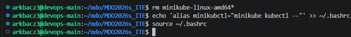

Następnie uruchomiłem środowisko i zweryfikowałem jego status. Polecenie `minikubctl get nodes` potwierdziło, że węzeł pracuje poprawnie w statusie `Ready` jako `control-plane`. Dodatkowo polecenie `minikubctl get pods -A` wylistowało pracujące w tle fundamentalne komponenty klastra (m.in. `kube-apiserver` czy `etcd`).

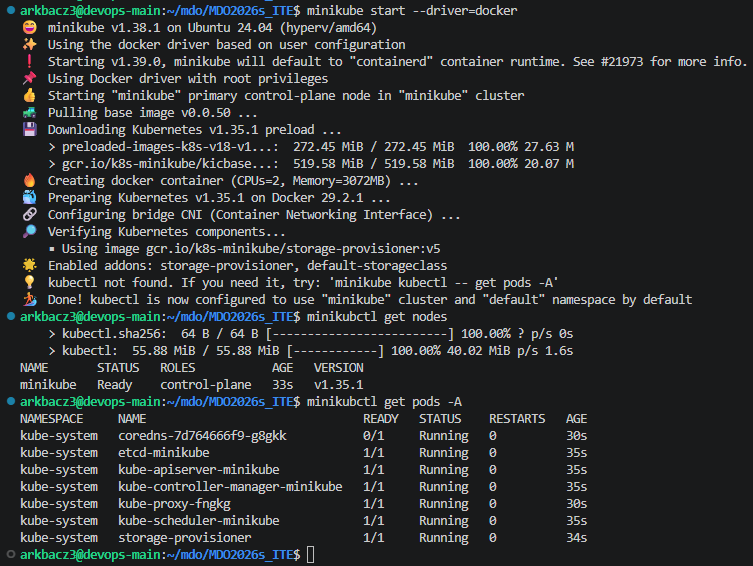

Na koniec tej sekcji uruchomiłem i wyeksponowałem wbudowany, graficzny panel zarządzania, który pozwolił mi na wizualną weryfikację łączności oraz podgląd zasobów klastra z poziomu przeglądarki.

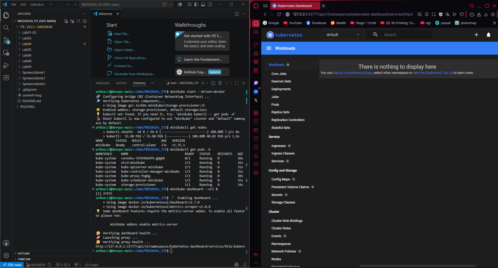

## 2. Analiza kontenera i ręczne uruchomienie (Pod)

Kolejnym krokiem było zdefiniowanie i przetestowanie kroku "Deploy" na platformę chmurową. Aby upewnić się, że aplikacja nie ulegnie natychmiastowemu zamknięciu po starcie, przygotowałem własny, zmodyfikowany obraz oparty na lekkim serwerze `nginx:alpine`.

Utworzyłem plik `Dockerfile`, który kopiował niestandardową stronę w formacie HTML do domyślnego katalogu serwera oraz eksponował port 80. Pozwoliło mi to w prosty sposób udowodnić na późniejszym etapie, że uruchomiony kontener to rzeczywiście mój zadeklarowany artefakt.

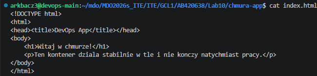

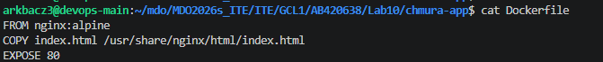

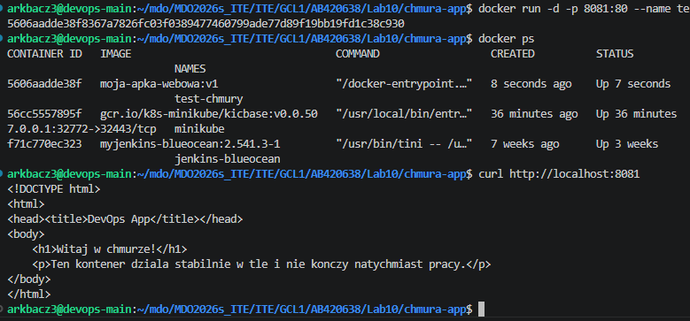

Mając przygotowany obraz, wdrożyłem aplikację w klastrze. Kubernetes automatycznie "ubrał" mój kontener w najmniejszą logiczną jednostkę obliczeniową — **Pod**. Wydając komendę sprawdzającą zasoby, potwierdziłem, że Pod o nazwie `apka-pod` został pomyślnie utworzony i przeszedł w stan `Running` (1/1).

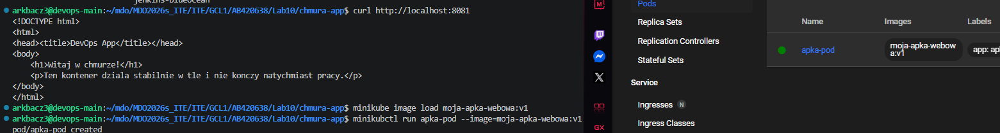

Pody w Kubernetesie otrzymują adresy IP dostępne wyłącznie wewnątrz wirtualnej sieci klastra. Aby dostać się do mojego serwera WWW z poziomu hosta, wyeksponowałem port narzędziem `minikubctl port-forward pod/apka-pod 8082:80`. Po przekierowaniu portów komenda `curl localhost:8082` poprawnie zwróciła kod mojej strony HTML, co potwierdziło w pełni sprawną komunikację.

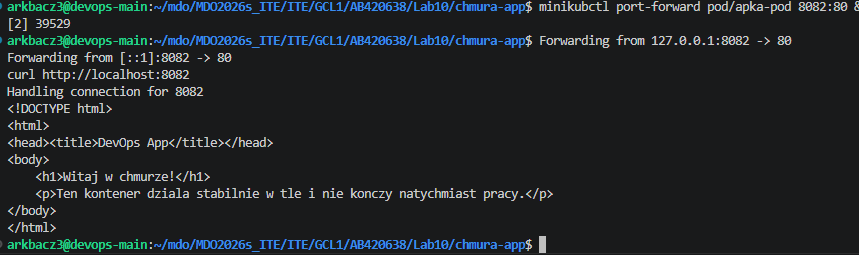

## 3. Przekucie wdrożenia w plik YAML (Deployment i Service)

Zarządzanie imperatywne (z wiersza poleceń) jest antywzorcem w środowiskach produkcyjnych. Przeszedłem na zarządzanie deklaratywne (Infrastructure as Code), tworząc plik wdrożenia `deployment.yaml`. 

W pliku zdefiniowałem m.in. oczekiwaną liczbę replik (`replicas: 4`), co instruuje kontroler Kubernetesa, aby za pomocą obiektu `ReplicaSet` zawsze utrzymywał przy życiu dokładnie cztery kopie mojego Poda, używając obrazu `moja-apka-webowa:v1` z polityką `imagePullPolicy: Never` (aby zapobiec pobieraniu z zewnętrznych rejestrów).

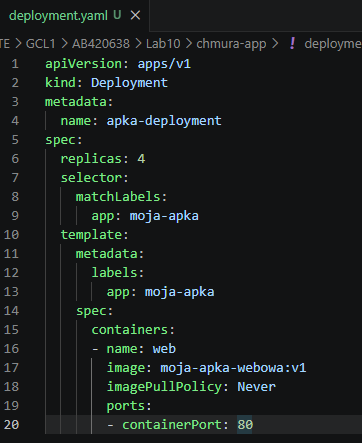

Zastosowałem konfigurację poleceniem `minikubctl apply -f deployment.yaml`. System natychmiast utworzył żądane repliki, co zweryfikowałem odpytując klaster o dostępne Pody (`minikubctl get pods`), widząc proces ich powoływania do życia (`ContainerCreating`).

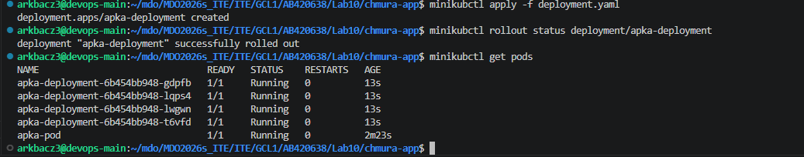

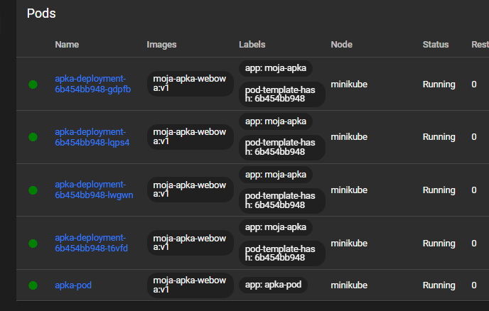

Cztery losowo przydzielone Pody potrzebują jednego, stabilnego punktu wejścia, który będzie między nimi równoważył ruch sieciowy (Load Balancing). W tym celu wyeksponowałem Deployment jako **Serwis** typu `ClusterIP` komendą `minikubctl expose deployment apka-deployment --type=ClusterIP --port=80`. Następnie wykonałem przekierowanie portu bezpośrednio na zdefiniowany Serwis (`minikubctl port-forward service/apka-deployment 8083:80`), co udostępniło aplikację na moim hoście lokalnym.

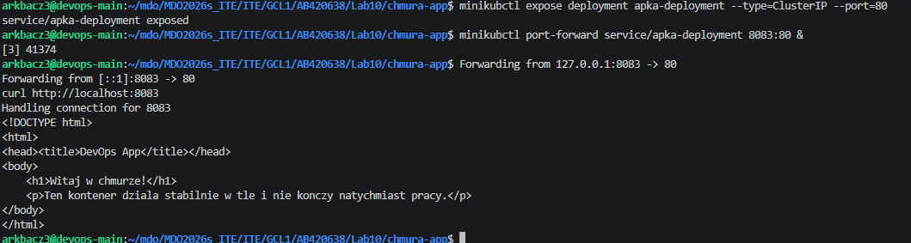

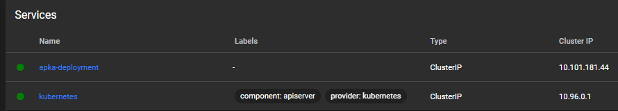

## 4. Przygotowanie nowych wersji obrazu

Przed przystąpieniem do aktualizacji, musiałem posiadać różne rewizje mojej aplikacji. 
1. `v1` - Działająca, dotychczasowa wersja.
2. `v2` - Nowa wersja, z zauważalną zmianą na stronie frontendowej (dodałem nagłówek "wersja 2.0!").
3. `v3-error` - Błędny, uszkodzony obraz, w którym celowo do pliku `Dockerfile` dopisałem dyrektywę `CMD ["/bin/false"]`. Powoduje ona natychmiastowy Crash po uruchomieniu kontenera i nie pozwala na podniesienie serwera.

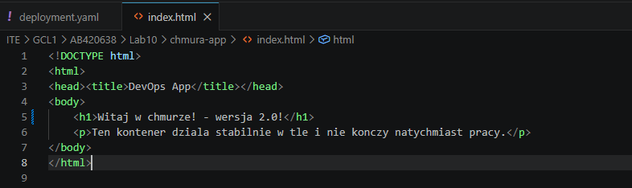

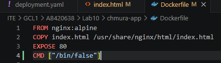

Obrazy załadowałem bezpośrednio do cache'u Minikube za pomocą polecenia `minikube image load`, aby klaster nie próbował bezskutecznie pobierać ich z publicznego rejestru Docker Hub. Skontrolowałem poprawność ich wgrania komendą `docker images | grep moja-apka`.

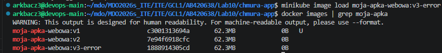

## 5. Skalowanie, Aktualizacje i Rollbacki

Wykonałem szereg operacji modyfikujących plik YAML w celu przetestowania kontrolera Deploymentów. Zmieniałem sekcję `replicas`, sprawdzając jak błyskawicznie Kubernetes niszczy lub powołuje nowe instancje kontenerów do życia.

**Zmiana liczby replik na 8:** W pliku `deployment.yaml` zwiększyłem żądaną liczbę instancji do 8.

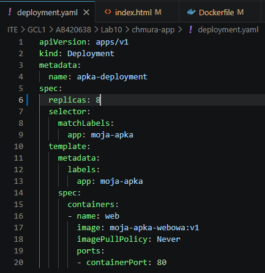

Po zaaplikowaniu nowego pliku kontroler ReplicaSet natychmiastowo rozszerzył flotę podów. Odpytanie klastra wykazało 8 działających kontenerów z prefiksem `apka-deployment`.

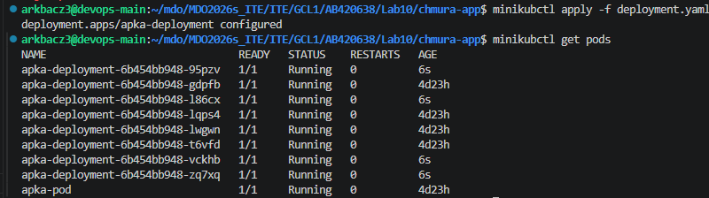
**Zmiana liczby replik na 1:** Zmodyfikowałem plik konfiguracyjny, zmniejszając wartość `replicas` do 1. Po zaaplikowaniu zmian poleceniem `minikubctl apply -f`, klaster natychmiastowo zredukował zasoby, bezpiecznie wyłączając 7 nadmiarowych kontenerów i pozostawiając przy życiu dokładnie jedną instancję usługi.

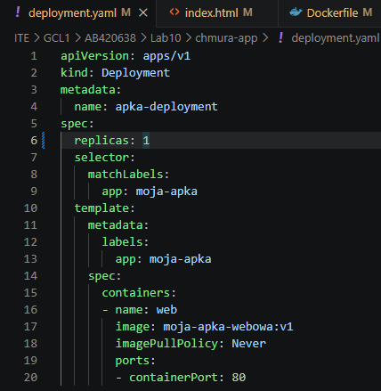

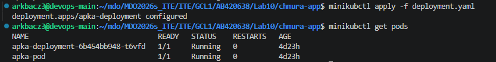

**Zmiana liczby replik na 0 (skalowanie do zera):** Przetestowałem funkcjonalność całkowitego wygaszenia usługi (często stosowaną do optymalizacji kosztów utrzymania środowisk testowych w chmurze), ustawiając wartość `replicas: 0`. Kontroler poprawnie i płynnie zamknął wszystkie Pody przypisane do tego Deploymentu, co potwierdziło polecenie `get pods`.

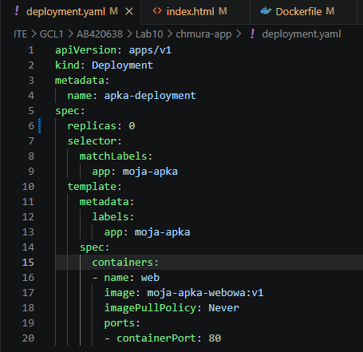

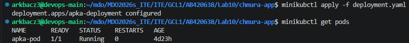

**Ostateczne przeskalowanie na 4 repliki:** Przywróciłem docelową, bazową architekturę, deklarując w YAML-u ponowne podniesienie 4 replik. Klaster w ułamek sekundy powołał kontenery z powrotem do życia.

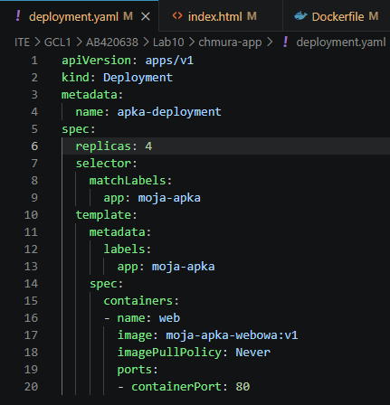

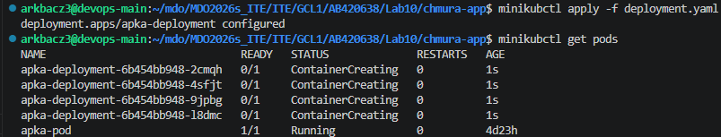

Następnie przeszedłem do przetestowania mechanizmu podmiany obrazu (tzw. `Rollout`). 
W pliku konfiguracyjnym zmieniłem tag obrazu na nową wersję: `moja-apka-webowa:v2`. Po wysłaniu nowej konfiguracji do API Kubernetesa, system zainicjował proces aktualizacji kaskadowej. Mechanizm bezpiecznie wyłączał stare kontenery i podnosił nowe. Weryfikację pomyślnego wdrożenia przeprowadziłem poleceniem `curl` na wyeksponowanym Serwisie – odpowiedź serwera zawierała zaktualizowany nagłówek HTML: "wersja 2.0!".

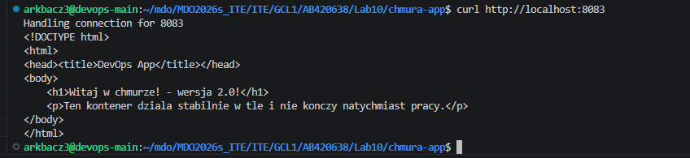

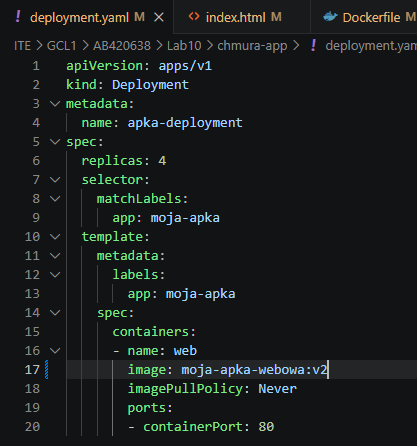

Zasymulowałem również ręczny powrót (downgrade) do starszej rewizji oprogramowania (`v1`). Powtórna edycja pliku wdrożenia i zaaplikowanie go wymusiło na klastrze kolejny, zautomatyzowany cykl wymiany Podów na ich stabilne, wcześniejsze odpowiedniki. 

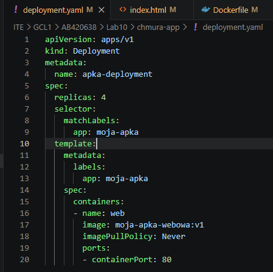

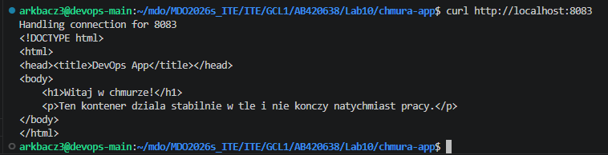

Na koniec przetestowałem zachowanie klastra w przypadku wdrożenia wadliwego obrazu. W pliku `deployment.yaml` zmieniłem tag na `moja-apka-webowa:v3-error` i zaaplikowałem zmiany. Kubernetes rozpoczął aktualizację, ale po wdrożeniu pierwszych uszkodzonych Podów zauważył, że kontenery natychmiast kończą pracę błędem (status `Error` i pętla restartów). Mechanizm obronny (RollingUpdate) wstrzymał dalszą aktualizację, pozostawiając resztę starych replik przy życiu, co zapobiegło całkowitej awarii i niedostępności aplikacji.

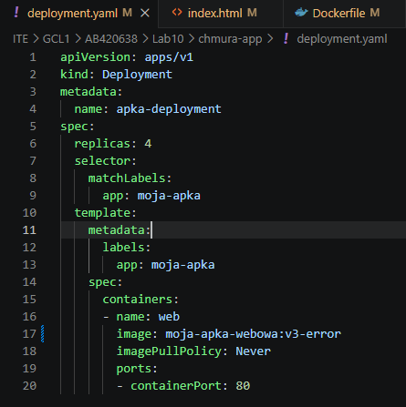

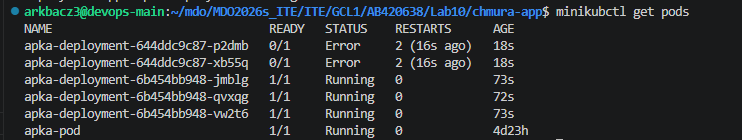

Korzystając z polecenia `minikubctl rollout undo deployment/apka-deployment`, wydałem polecenie natychmiastowego wycofania błędnej zmiany do ostatniej stabilnej rewizji. Po weryfikacji poleceniem `get pods` upewniłem się, że klaster powrócił do poprawnego działania, a uszkodzone Pody zostały automatycznie zniszczone.

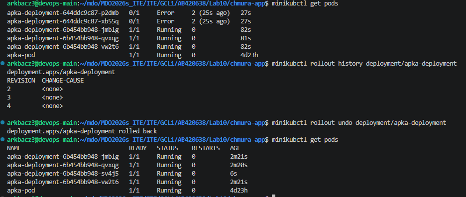

## 6. Kontrola wdrożenia i historia rewizji

Przeanalizowałem historię zmian korzystając z polecenia `minikubctl rollout history deployment/apka-deployment`. Klaster przechowuje numery kolejnych wdrożeń (na zrzucie widoczne rewizje 2, 3 i 4), co ułatwia zarządzanie incydentami, korelowanie ich z konkretną zmianą w konfiguracji oraz umożliwia precyzyjny powrót do historycznego stanu.

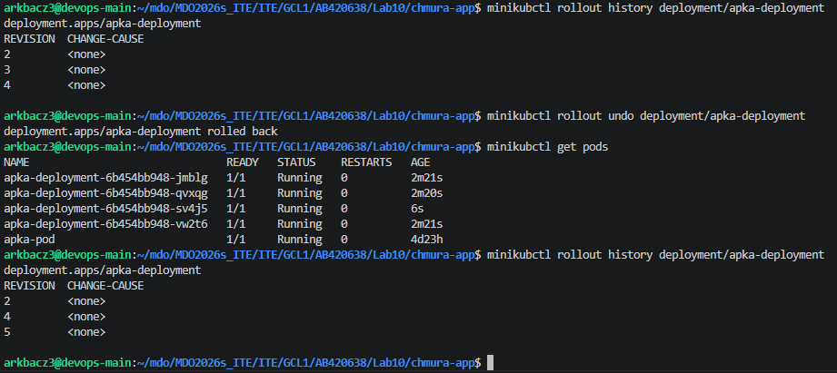

Aby zautomatyzować proces weryfikacji ciągłej (Continuous Deployment) w potokach takich jak Jenkins, stworzyłem skrypt Bash o nazwie `check.sh`. Wykorzystywał on wbudowaną flagę `--timeout=60s` dla polecenia `rollout status`. W przypadku "zdrowego" wdrożenia, skrypt weryfikował gotowość i kończył pracę komunikatem o sukcesie. W przypadku pętli błędów, po minucie zabiłby proces i rzucił kodem błędu (`exit 1`), natychmiastowo przerywając pipeline CI/CD.

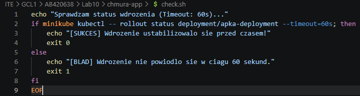

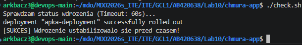

## 7. Strategie Wdrożenia (Deployment Strategies)

W Kubernetesie domyślna strategia aktualizacji to Rolling Update. Przetestowałem ją oraz alternatywną technikę uwalniania oprogramowania, przygotowując osobne pliki YAML. 

1. **Recreate (Odtworzenie)**:
Zdefiniowałem strategię `Recreate` w dedykowanym pliku `deploy-recreate.yaml`. Po jego zaaplikowaniu i obserwowaniu zmian w czasie rzeczywistym (flaga `-w`), zauważyłem, że strategia ta wymusza natychmiastowe ubicie (stan `Terminating`) wszystkich starych replik przed uruchomieniem nowych. Powoduje to chwilowy przestój aplikacji (Downtime), ale gwarantuje, że w klastrze nigdy nie będą działać jednocześnie dwie różne wersje oprogramowania (np. w przypadku skomplikowanych migracji bazodanowych).

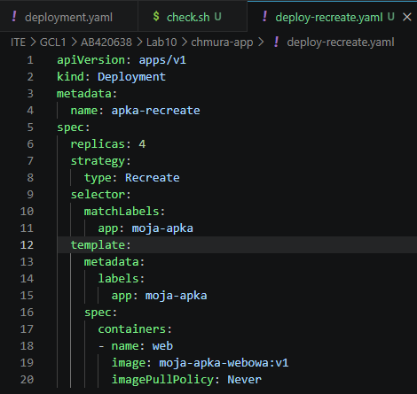

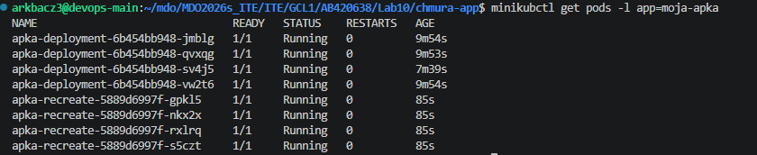

2. **Rolling Update (Aktualizacja Kaskadowa)**:
Najlepsza i domyślna strategia, którą zadeklarowałem jawnie w pliku `deploy-rolling.yaml`. Skonfigurowałem w niej dwa kluczowe parametry: `maxUnavailable: 2` (maksymalnie dwie repliki mogą być niedostępne w trakcie podmiany) oraz `maxSurge: 25%` (limit nadmiarowych podów tworzonych w trakcie aktualizacji). Obserwacja procesu wdrożenia potwierdziła, że Pody były wymieniane płynnie i kaskadowo – część przetwarzała ruch jako `Running`, podczas gdy inne przechodziły w stan `Terminating` lub `ContainerCreating`. Umożliwia to proces aktualizacji typu "Zero-Downtime".

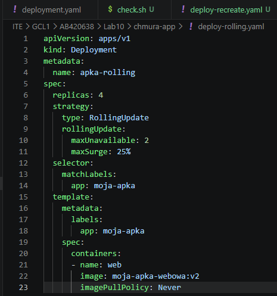

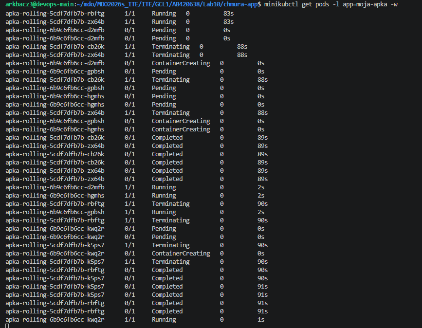

3. **Canary Deployment (Wdrożenie Kanarkowe)**:
Wykorzystałem etykiety (Labels) i wspólny obiekt Serwisu, aby wypuścić nową wersję tylko dla niewielkiego ułamka ruchu sieciowego. Działa to poprzez utrzymanie standardowego Deploymentu z wersją stabilną na czterech replikach (zaaplikowanego z pliku `deployment.yaml`) i jednoczesne dodanie małego Deploymentu o wielkości 1 repliki z wersją testową (zdefiniowanego i zaaplikowanego z pliku `deployment-canary.yaml`).

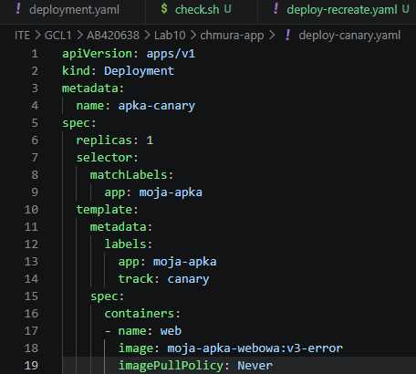

Wynik polecenia `get pods` pokazał obok siebie cztery pracujące stabilne instancje oraz jedną instancję kanarkową. Serwis z odpowiednim selektorem będzie równoważył ruch między wszystkie Pody, co daje ułamek ruchu dla kanarka. Gdy wersja kanarkowa okazuje się stabilna, pełne wdrożenie jest aplikowane do wariantu głównego.

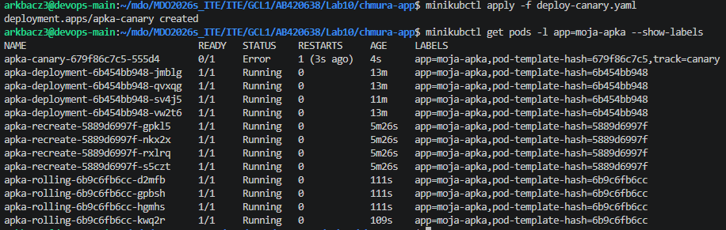

## Wnioski 

**Eksponowanie usług**: Przetestowałem różne poziomy abstrakcji (Pod, Deployment, Service), co pozwoliło zrozumieć różnicę między dostępem tymczasowym (debugowanie przez port-forward) a produkcyjnym (stałe obiekty Service z selektorami).

**Idempotencja i deklaratywność:** Zastosowanie kubectl apply zamiast zmian imperatywnych pozwala na śledzenie historii rewizji (rollout history), co jest niezbędne przy debugowaniu awarii wdrożeń.

**Strategie wdrożeniowe (Bonus):** Wdrożenie kanarkowe (Canary) pokazało, jak za pomocą etykiet (Labels) można ograniczyć ryzyko biznesowe przy wprowadzaniu nowych wersji, kierując na nie tylko ułamek ruchu (np. 20% replik), co jest kluczowe w nowoczesnych potokach CI/CD.

**Weryfikacja automatyczna:** Skrypt oparty na rollout status z timeoutem udowodnił, że automatyzacja wdrożeń musi posiadać wbudowany "bezpiecznik" – w przypadku błędu (np. CrashLoopBackOff przy wadliwym obrazie), potok musi zostać natychmiast przerwany, aby zapobiec rozprzestrzenieniu się awarii.

# Sprawozdanie
## Lab 11: Wdrażanie na zarządzalne kontenery: Kubernetes (2) - Eksponowanie i Skalowanie

## 1. Wdrożenie web-serwera w dużej skali

Laboratorium rozpocząłem od zmodyfikowania pliku wdrożeniowego YAML dla mojego serwera WWW. Zgodnie z wytycznymi, aby przetestować wydajność klastra oraz mechanizmy równoważenia obciążenia (Load Balancing), zdefiniowałem w pliku `deployment.yaml` początkową wielkość wdrożenia na 36 replik (`replicas: 36`). Do testu wykorzystałem mój własny, zbudowany wcześniej obraz `moja-apka-webowa:v1`.

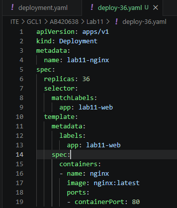

Po uruchomieniu polecenia `minikubctl apply -f deployment.yaml`, kontroler natychmiast rozpoczął alokowanie zasobów. Wywołanie `minikubctl get pods` ukazało 36 nowo tworzonych kontenerów w stanie `ContainerCreating`, co obrazuje i potwierdza asynchroniczny i równoległy charakter pracy orkiestratora Kubernetes.

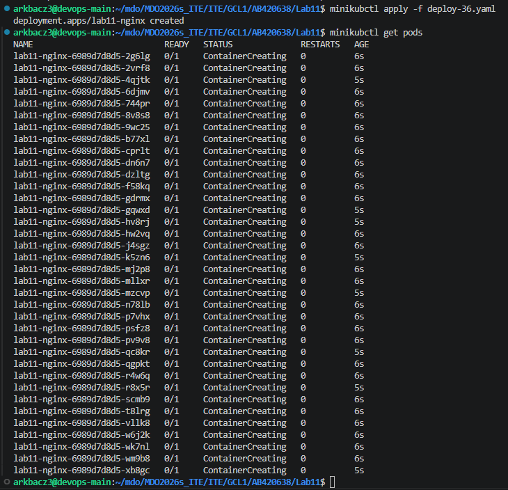

## 2. Metody eksponowania dostępu do aplikacji i zadanie bonusowe

Środowiska chmurowe oferują różnorodne poziomy abstrakcji sieciowej. W celu ich weryfikacji, przetestowałem cztery różne sposoby na dotarcie do mojej aplikacji.

### A. Eksponowanie pojedynczego poda
Najniższym poziomem dostępu jest wpięcie się w sieć konkretnego kontenera, pomijając całkowicie Load Balancer. Wykorzystałem polecenie `minikubctl port-forward pod/apka-deployment-644ddc9c87-8l8f6 8082:80`. Operacja zakończyła się sukcesem – powłoka przekierowała ruch, a komenda `curl localhost:8082` poprawnie zwróciła kod HTML ze zmodyfikowanym nagłówkiem "Witaj w chmurze! wersja 2.0!".

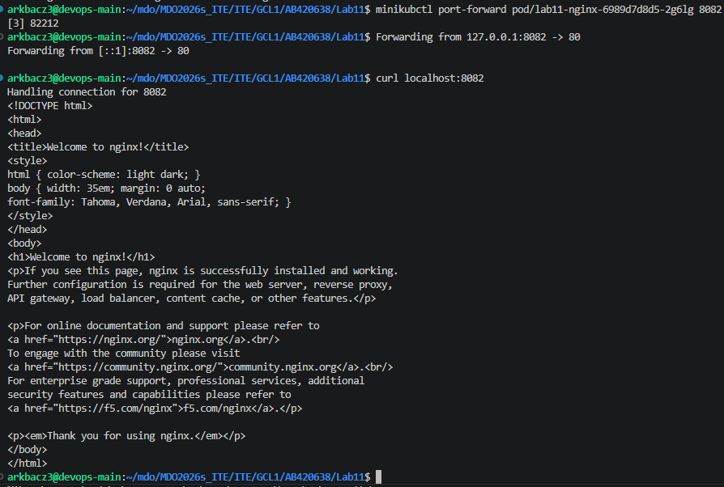

### B. Eksponowanie Deploymentu i weryfikacja routingu (Zadanie Bonusowe)
Kolejnym krokiem było udostępnienie poziomu wyżej – całego wdrożenia (Deploymentu) na porcie 8083. W tym wariancie to klaster decyduje, do którego z pracujących podów trafi moje zapytanie.
Aby wykonać **zadanie bonusowe** i sprawdzić, który dokładnie pod obsłużył mój ruch, zastosowałem następujący trik inżynieryjny:
1. Wykonałem celowo zapytanie do nieistniejącej ścieżki: `curl http://localhost:8083/moj-test`.
2. Zamiast przeglądać ręcznie logi wszystkich kontenerów, wywołałem polecenie zrzucające logi całego wdrożenia z włączonym prefiksem nazwy poda (`minikubctl logs deployment/apka-deployment --prefix`) i przefiltrowałem je poleceniem `grep "moj-test"`.
3. System bezbłędnie wskazał, że zapytanie zostało obsłużone i odrzucone statusem HTTP 404 przez poda o identyfikatorze `apka-deployment-644ddc9c87-bczd7`.

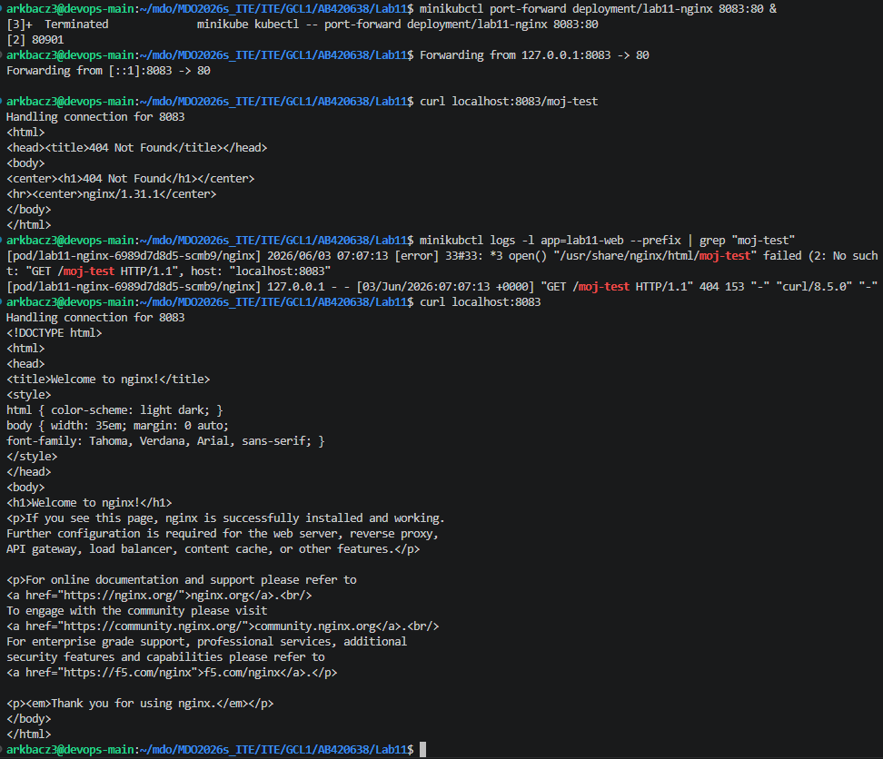

### C. Wyeksponowanie imperatywne jako Serwis
Eksponowanie za pomocą `port-forward` działa tylko dopóki terminal jest otwarty, co czyni to narzędziem wyłącznie debuggowym. Wdrożyłem dedykowany zasób sieciowy używając imperatywnej komendy `minikubctl expose deployment apka-deployment --name=serwis-z-komendy --port=80 --target-port=80`. 
Następnie wystawiłem ten serwis na porcie 8084, dopisując flagę `--address 0.0.0.0`, co pozwoliło mi połączyć się z serwerem i podejrzeć stronę graficznie z poziomu przeglądarki mojego systemu Windows.

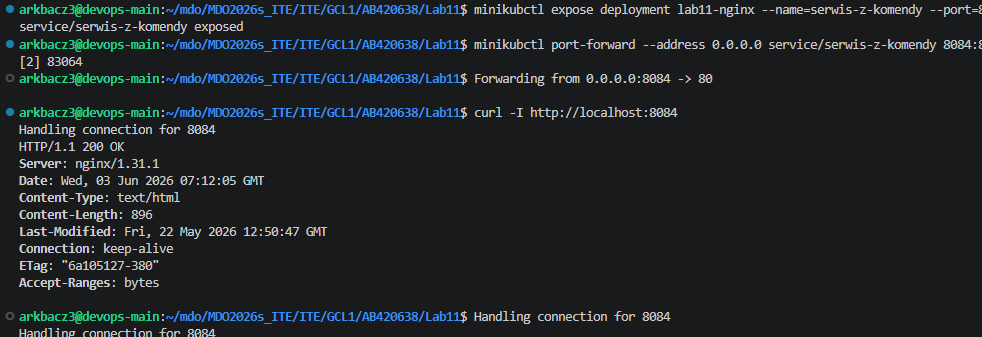

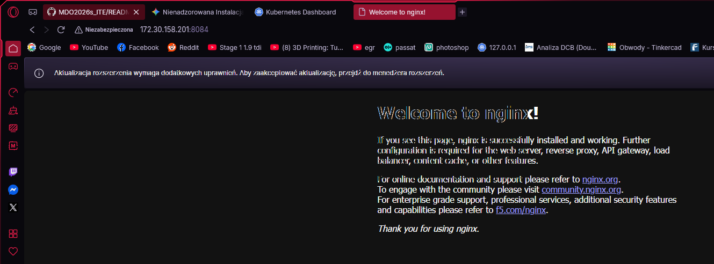

### D. Wyeksponowanie deklaratywne (plik YAML)
Zgodnie z dobrymi praktykami Infrastructure as Code (IaC), definicję sieciową należy trzymać w kodzie. Utworzyłem plik `serwis.yaml`, w którym zdefiniowałem obiekt typu `Service` o nazwie `serwis-z-pliku` z odpowiednim selektorem łączącym go z etykietą `app: moja-apka`. Po zastosowaniu pliku (`minikubctl apply -f serwis.yaml`) i przekierowaniu na niego portu 8085, sprawdziłem nagłówki odpowiedzi HTTP za pomocą `curl -I localhost:8085`, co ostatecznie potwierdziło prawidłowe wdrożenie serwisu (HTTP/1.1 200 OK).

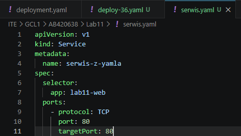

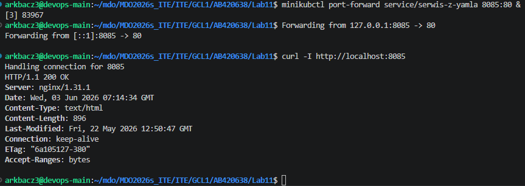

## 3. Zarządzanie skalą wdrożenia

Ostatnim zadaniem było przetestowanie elastyczności klastra poprzez zmianę pożądanej liczby replik (tzw. skalowanie poziome architektury).

W pierwszej kolejności użyłem szybkiej, operacyjnej metody imperatywnej: `minikubctl scale deployment apka-deployment --replicas=10`. Kubernetes natychmiastowo zareagował na nowe wytyczne, w kontrolowany sposób wygaszając ("Terminating") nadmiarowe Pody, pozostawiając dokładnie 10 przy życiu.

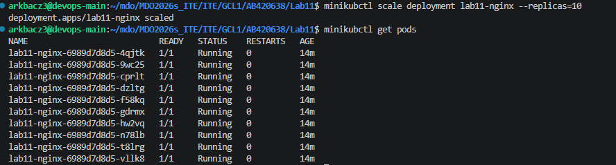

Następnie przeszedłem do metody optymalnej (deklaratywnej). Otworzyłem w edytorze mój bazowy plik `deployment.yaml` i zmieniłem parametr `replicas` na 15. 

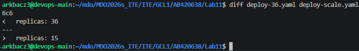

Po wywołaniu `minikubctl apply -f deployment.yaml`, środowisko pobrało nową definicję stanu, automatycznie przeliczyło różnice i powołało do życia brakującą ilość instancji, bezbłędnie doprowadzając klaster do zadanego stanu 15 podów.

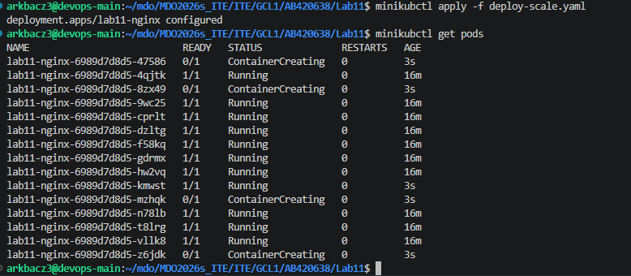

## Wnioski

Laboratorium 11 miało na celu dogłębne przetestowanie mechanizmów sieciowych (eksponowania) oraz zarządzania stanem klastra (skalowania). Na podstawie zrealizowanych punktów polecenia wyciągnąłem następujące wnioski techniczne:

1. **Różnice w metodach eksponowania dostępu:**
   * **Do jednego poda:** Użycie `port-forward` na konkretnym podzie ukazało kruchość tego rozwiązania. W klastrze pody są bytami ulotnymi (ephemeral). Jeśli ten konkretny pod ulegnie awarii, cała nasza komunikacja zostaje zerwana, mimo że obok działa 35 innych, zdrowych instancji aplikacji.
   * **Do Deploymentu:** Przekierowanie ruchu na cały Deployment włącza wbudowany mechanizm load balancingu. Środowisko udostępnia jeden punkt wejścia, a ruch jest rozdzielany na dostępne repliki. Wciąż jest to jednak rozwiązanie doraźne (wymaga otwartego terminala z procesem tunelowania).
   * **Do Serwisu (imperatywnie vs deklaratywnie):** Serwisy to jedyny stabilny i produkcyjny sposób eksponowania aplikacji w Kubernetesie. Niezależnie od tego, czy użyjemy komendy `expose` czy pliku `service.yaml`, klaster tworzy trwały punkt styku (NodePort/ClusterIP), który dynamicznie śledzi adresy IP wszystkich naszych 36 podów za pomocą selektorów etykiet (`labels`). 

2. **Zarządzanie skalą (Scale vs YAML):**
   * Metoda imperatywna (`minikubctl scale`) jest błyskawiczna i przydaje się w sytuacjach kryzysowych (np. nagły skok ruchu). Jej wadą jest tworzenie tzw. dryftu konfiguracji (Configuration Drift) – stan faktyczny klastra przestaje zgadzać się z tym, co mamy zapisane w repozytorium.
   * Metoda deklaratywna (edycja pliku `yaml` i `apply -f`) to wzorcowe podejście zgodne z GitOps (Infrastructure as Code). Narzędzie `diff` pozwala na audyt zmian przed ich wdrożeniem, a my mamy pełną historię tego, dlaczego i kiedy infrastruktura uległa powiększeniu.

3. **Load Balancing w praktyce:**
   Zbadanie logów po przeskalowaniu udowodniło, że sieć w Kubernetesie działa w oparciu o algorytmy dystrybucji ruchu (domyślnie round-robin lub warianty randomizowane przez kube-proxy). Próba wywołania celowego błędu HTTP i przefiltrowanie złączonych strumieni logów za pomocą poleceń systemowych (`grep`) jasno wykazała, że żądania nie trafiają zawsze do pierwszego poda z listy, lecz są dynamicznie rozdzielane na całą pulę dostępnych instancji w ramach Serwisu/Deploymentu.