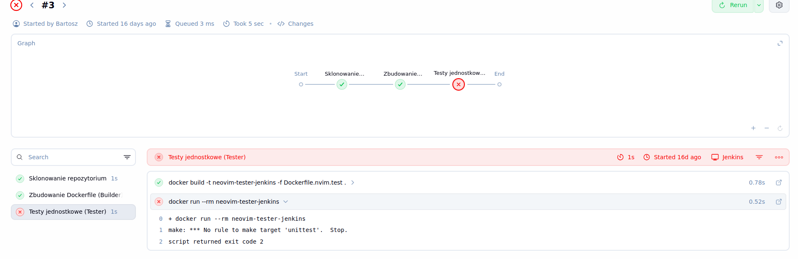

# Sprawozdanie 2

Bartosz Bodulski, grupa 1, Tematy 5 - 7

## Temat 5

Cel zajęć - zainstalowanie i zapoznanie się z środowiskiem Jenkins.

Instalacja środowiska Jenkins (potrzebujemy także obrazu DIND):


Blueocean to  wrapper graficzny na Jenkinsa, który sam jest silnikiem do tworzenia Pipeline'ów CI/CD. Pozwala na szybsze postawianie projektów osobom, które dopiero zaczynąją przygode w tym obszarze i pozwala na lepsze wizualizacje etapów budowania, testowania i postawiania oprogramowania.


Sprawdzamy działanie kontenerów:


Robimy początkowy setup Jenkinsa - pobieramy hasło pierwszego logowania i tworzymy nasze konto admina, logując się na: http://localhost:8080


Podajemy nasze hasło jednorazowego dostępu:


Po utworzeniu naszego admina wchodzimy na dashboard jenkinsa i  przystępujemy do utworzenia projektu dla 1 zadania.


Tutaj musimy tylko pokazać wynik komendy uname w powłoce Jenkinsa.


Wynikiem jest wersja jądra naszej maszyny wirtulanej - jak widać Jenkins
wywołuje /bin/sh zamiast /bin/bash. Należy o tym wiedzieć, gdyż poźniej się to prawdopodobnie nam przyda.


Kolejny projekt sprawdza, czy godzina w systemie operacyjnym jest nieparzysta i w związku z tym zwraca błąd. Można to zrobić za pomocą prostego skryptu powłoki (sh, nie bash!):


Trzeci projekt próbuje stworzyć kontener dockera na podstawie obrazu ubuntu:latest za pomocą polecenia ```docker pull```


Polecenie kończy się sukcesem:


Nasze projekty wyglądają tak:


Na koniec tworzę obiekt typu pipeline, który klonuje repozytorium przedmiotu, robi ```git checkout``` na mojego brancha i buduje kontener za pomocą podanego dockerfile:


```groovy
pipeline {
    agent any
    
    environment {
        // Zmienne do połączenia z silnikiem Docker in Docker (DIND)
        DOCKER_HOST = 'tcp://docker:2376'
        DOCKER_CERT_PATH = '/certs/client'
        DOCKER_TLS_VERIFY = '1'
    }

    stages {
        stage('Sklonowanie repozytorium') {
            steps {
                git branch: 'BB419678', url: 'https://github.com/InzynieriaOprogramowaniaAGH/MDO2026s_ITE.git'
            }
        }
        
        stage('Zbudowanie (Builder)') {
            steps {
                dir('ITE/GCL1/BB419678/Dockerfiles_lab5') {
                    sh 'docker build -t neovim-builder-jenkins -f Dockerfile.nvim.build .'
                }
            }
        }
        
        stage('Testy jednostkowe (Tester)') {
            steps {
                dir('ITE/GCL1/BB419678/Dockerfiles_lab5') {
                    sh 'docker build -t neovim-tester-jenkins -f Dockerfile.nvim.test .'
                    
                    // catchError pozwala potokowi isc dalej pomimo bledow dockera, ewentualnie mozna zrobic sh ... || true
                    catchError(buildResult: 'UNSTABLE', stageResult: 'FAILURE') {
                        sh 'docker run --rm neovim-tester-jenkins'
                    }
                }
            }
        }
        
        stage('Publikacja (Publish)') {
            steps {
                dir('ITE/GCL1/BB419678/Dockerfiles_lab5') {
                    // utworzenie tarball'a (tar.gz) z binarki
                    sh '''
                        docker create --name temp-container neovim-builder-jenkins
                        docker cp temp-container:/workspace/build/bin/nvim ./nvim-binary
                        tar -czvf neovim-artifact.tar.gz nvim-binary
                        docker rm temp-container
                    '''
                    // Publikacja w interfejsie Jenkinsa
                    archiveArtifacts artifacts: 'neovim-artifact.tar.gz', fingerprint: true
                }
            }
        }
        
        stage('Wdrożenie (Deploy)') {
            steps {
                dir('ITE/GCL1/BB419678/Dockerfiles_lab5') {
                    // Tworzenie ekstremalnie lekkiego obrazu Runtime (Slim)
                    sh '''
cat <<EOF > Dockerfile.nvim.runtime
FROM ubuntu:24.04
COPY nvim-binary /usr/local/bin/nvim
RUN chmod +x /usr/local/bin/nvim
CMD ["sleep", "infinity"]
EOF
                        docker build -t neovim-runtime-jenkins -f Dockerfile.nvim.runtime .
                    '''
                    
                    // Uruchomienie nieblokujące w tle
                    sh 'docker run -d --name neovim-prod --rm neovim-runtime-jenkins'
                    
                    // Program działa w nowym, docelowym kontenerze
                    sh 'docker exec neovim-prod nvim --version'
                    
                    // Zatrzymanie i posprzątanie
                    sh 'docker stop neovim-prod'
                }
            }
        }
    }
}
```
### Wyjaśnienie pipeline:

1. Clone - Klonowanie repozytorium z plikami dockerfile do budowania i testowania oprogramowania.

2. Build - Budowanie oprogramowania na oddzielnym kontenerze 'builder'(build-dependencies, build-tools itp.)

3. Test - Testowanie oprogramowania na  kontenerze 'tester' (test-dependencies, make unittest)

4. Publish - stworzenie tzw. tarball (tar.gz) na tymczasowym kontenerze i stworzenie archiveArtefacts.

5. Deploy - testowanie tarball'a w środowisku runtime na minimalnym kontenerze (slim).


### Problemy 
Problemem podczas tworzenia tego pipeline'u okazał się ```make unittest``` - niektóre testy nie przechodzą ze względu na brak systemd w kontenerze dockera, dlatego trzeba owinąć stage testowania w klauzule CatchError lub dodać do polecenia powłoki ```|| true```, co nie jest optymalnym rozwiązaniem. Poprawa i rozwinięcie tego pipeline jest tematem na następne zajęcia. Dodatkowo warto poprawnie wpisywać nazwy scieżek w woluminach, gdyż też może dać nam problem z wyłowywaniem testów.


 


## Temat 6
Cel zajęć - modyfikacja  pipeline'u do wybranego oprogramowania

Głownym zadaniem jest tutaj dostosowanie pipeline do wymagań ustalonych zajęciach.


Tutaj musimy wykonać trochę modyfikacji względem naszego pierwotnego workflow'u. Po zbudowaniu binarki z repozytorium przenosimy wraz z przykładowymi plikiem/plikami do parsowania do kontenera 'deploy', w którym wykonujemy modyfikacje plików i sprawdzamy czy oprogramowanie działa poprawnie. Jeżeli krok 'deploy' przechodzi, tworzymy paczkę DEB (tutaj wybrałem ubuntu czyli musi być to paczka DEB, zależy to od systemu operacyjnego) i dodajemy zależności do niej tak, aby przy instalacji tej paczki aby apt (package manager dla ubuntu) pobrał jej zależności runtime (libluajit, libvterm itp.)

W związku z tym modyfikuje mój pipeline w celu dodania tych funkcjonalności:

```groovy
pipeline {
    agent any
    
    environment {
        DOCKER_HOST = 'tcp://docker:2376'
        DOCKER_CERT_PATH = '/certs/client'
        DOCKER_TLS_VERIFY = '1'
    }

    stages {
        stage('Sklonowanie repozytorium') { // klonowanie przez https
            steps {
                git branch: 'BB419678', url: 'https://github.com/InzynieriaOprogramowaniaAGH/MDO2026s_ITE.git'
            }
        }
        
        stage('Zbudowanie Neovima i paczki DEB') {
            steps {
                dir('ITE/GCL1/BB419678/Dockerfiles_lab6') {
                    sh 'docker build -t neovim-builder-jenkins -f Dockerfile.nvim.build .'
                }
            }
        }
        
        stage('Testy jednostkowe') {
            steps {
                dir('ITE/GCL1/BB419678/Dockerfiles_lab6') {
                    sh 'docker build -t neovim-tester-jenkins -f Dockerfile.nvim.test .'
                    sh 'docker run --rm neovim-tester-jenkins || true'
                }
            }
        }

stage('Archiwizacja Artefaktów (Paczka DEB)') {
            steps {
                dir('ITE/GCL1/BB419678/Dockerfiles_lab6') {
                    sh '''
                        # Tworzymy tymczasowy kontener 
                        docker create --name temp-archive-container neovim-builder-jenkins
                        # Kopiujemy cały folder build z kontenera do obecnego katalogu roboczego
                        docker cp temp-archive-container:/workspace/build ./temp_build_dir
                        # Szukamy pliku .deb w skopiowanym folderze i zmieniamy mu nazwę na docelową
                        cp ./temp_build_dir/*.deb ./neovim-final.deb
                        echo "--- SPRAWDZANIE ZALEŻNOŚCI PACZKI ---"
                        # metadane pliku .deb
                        dpkg -I ./neovim-final.deb | grep 'Depends'
                        # Sprzątamy
                        docker rm temp-archive-container
                        rm -rf ./temp_build_dir
                    '''
                    
                    // plik neovim-final.deb istnieje w workspace i tworzymy tzw. archiveArtefacts
                    archiveArtifacts artifacts: 'neovim-final.deb', fingerprint: true
                }
            }
        }
    }
}
```


### Pełna lista kontrolna projektu:

1. Wybrana aplikacja - neovim,

2. Licencja - Apache 2.0 (open source) - pozwala na wykonanie zadania,

3. Program buduje się (kontener neovim-jenkins-builder),

4. Testy przechodzą oprócz tych, które wymagają systemd w środowisku testowania (4/600),

5. Fork własnej kopii repozytorium - nie robimy tego.

6. Przykładowy deployment diagram:


7. Nie ma stricte kontenera bazowego - po sklonowaniu bazowego repozytorium obraz build klonuje neovima i zaczyna jego budowanie,

8. Build wykonuje się w kontenerze neovim-builder-jenkins,

9. Testy wykonują się w kontenerze neovim-tester-jenkins,

10. Tak, potwierdza to dockerfile: ```FROM neovim-builder-jenkins:latest```,

11. logi z całego procesu są przechwytywane przez Jenkinsa,

12. Do zrobienia.

13. Teoretycznie nadaje się, ale lepiej zrobić oddzielny. Musi być on w takim samym systemie, na jakim budowany był program, dodatkowo musi mieć wszystkie zależności runtime, aby można było sprawdzić jego działanie,

14. Do zrobienia.

15. Do zrobienia.

16. Wcześniej był to tarball, teraz tworzymy paczkę .deb,


17. Projekt jest skonfigurowany pod ubuntu 24.04, a jego package manager - apt, używa paczek .deb do zarządzania oprogramowaniem,

18. Teoretycznie nie ma strice wersjonowania, mamy natomiast opcje ```fingerprint: true```, czyli hash wersji oprogramowania, który wraz z rozrostem projektu będzie się zmieniać, aczkolwiek nie jest to najlepsze rozwiązanie,

19. Artefakt załączony jest jako wynik builda w Jenkinsie,

20. Do tego używamy wcześniej wspomnianego ```fingerprint: true```

21. Tak, w folderze Dockerfiles_lab6

22. Do zrobienia.


## Temat 7

Cel zajęć - Przygotowanie kompletnego obiektu typu pipeline dla wybranego projektu.


