Pracę wykonałem na maszynie wirtualnej z systemem Ubuntu Server 24.04 LTS. Logowanie odbywało się przez SSH z poziomu zwykłego użytkownika (bez uprawnień root).
Zajęcia 01: Git, Gałęzie, SSH
Wygenerowałem klucze SSH (Ed25519)

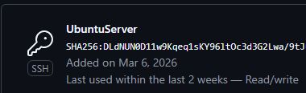

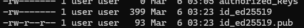

Sklonowałem repozytorium z użyciem HTTPS oraz SSH.

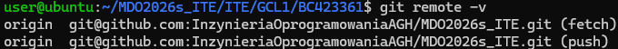

Utworzyłem własną gałąź BC423361.

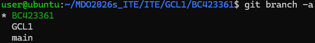

Utworzyłem skrypt walidujący wiadomości commitów.

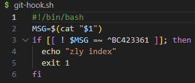

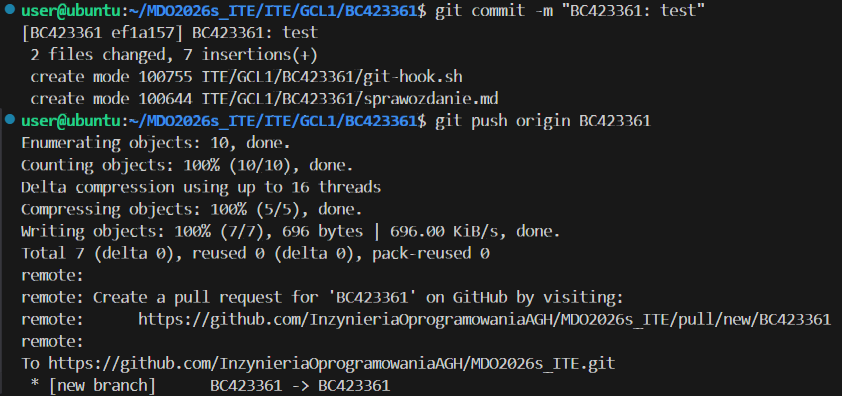

Wysłałem zmiany na własną gałąź do zdalnego repozytorium.

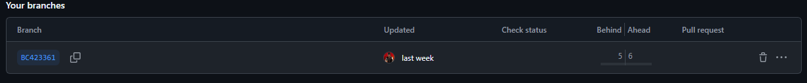

Zajęcia 02: Podstawy Dockera

Zainstalowałem Dockera i pobrałem zadane obrazy.

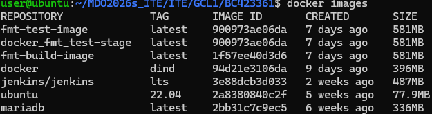

Uruchomiłem kontener z obrazem busybox

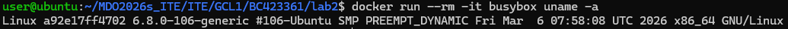

Uruchomiłem system Ubuntu w kontenerze i sprawdziłem PID 1.

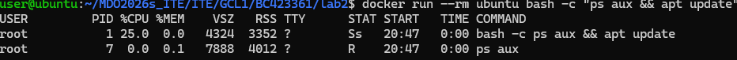

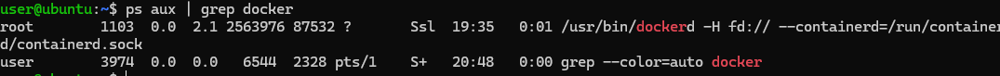

Zbudowałem obraz instalujący narzędzie Git i klonujący repozytorium.

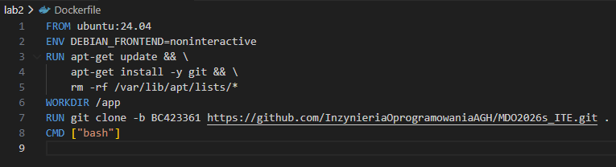

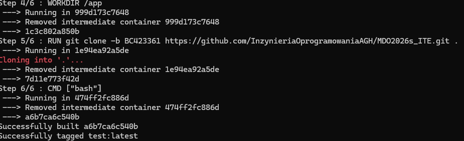

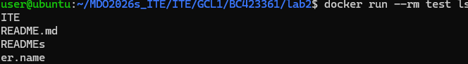

Usunąłem nieaktywne kontenery i obrazy.

Zajęcia 03: Build i Test w kontenerach

Wybrałem do zbudowania bibliotekę fmt. Zbudowałem ją i przetestowałem lokalnie.

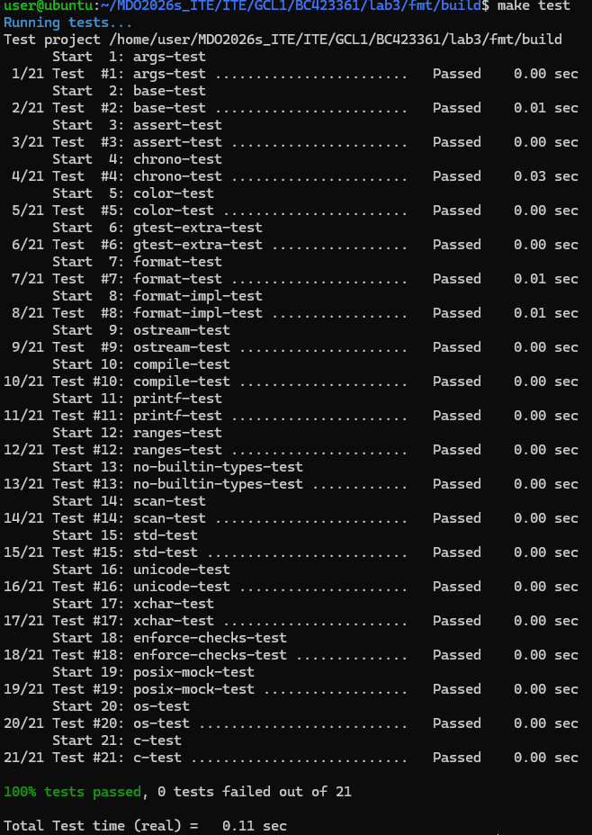

Powtórzyłem ten proces w kontenerze, interaktywnie.

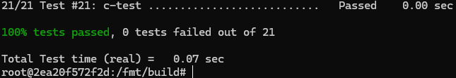

Utworzyłem Dockerfile.build oraz Dockerfile.test.

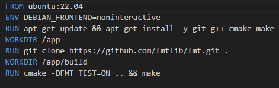

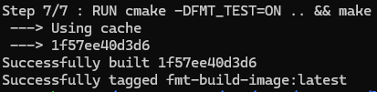

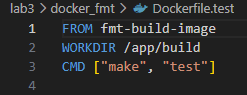

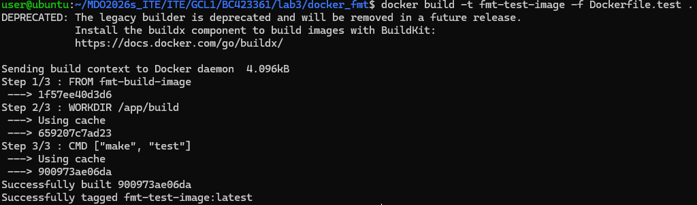

Utworzyłem plik docker-compose.yml

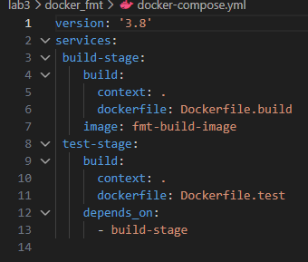

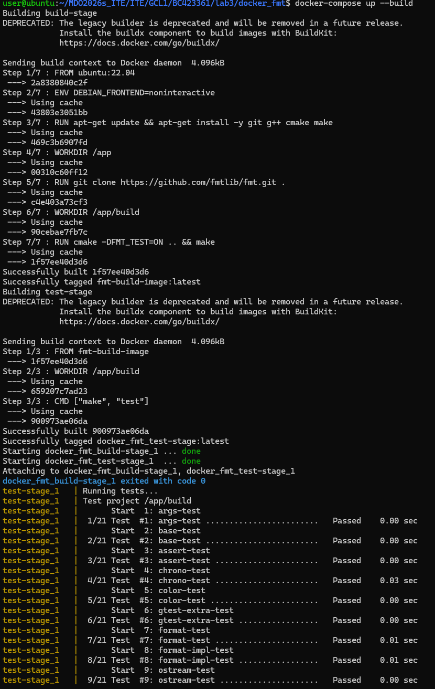

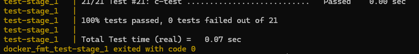

Pytanie: Różnica między obrazem a kontenerem? Co tu pracuje?

Obraz to martwy szablon/przepis (kod, kompilator, skompilowane pliki). Kontener to ożywiona, uruchomiona instancja obrazu.

Zajęcia 04: Woluminy, Sieci i Jenkins

Utworzyłem wolumin wejściowy i wyjściowy.

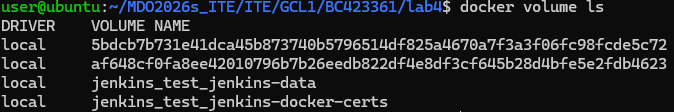

Uruchomiłem dwa kontenery z iperf3 w dedykowanej sieci bridge_serwer

Uruchomiłem demona SSH wewnątrz kontenera testowego i połączono się z nim z zewnątrz.

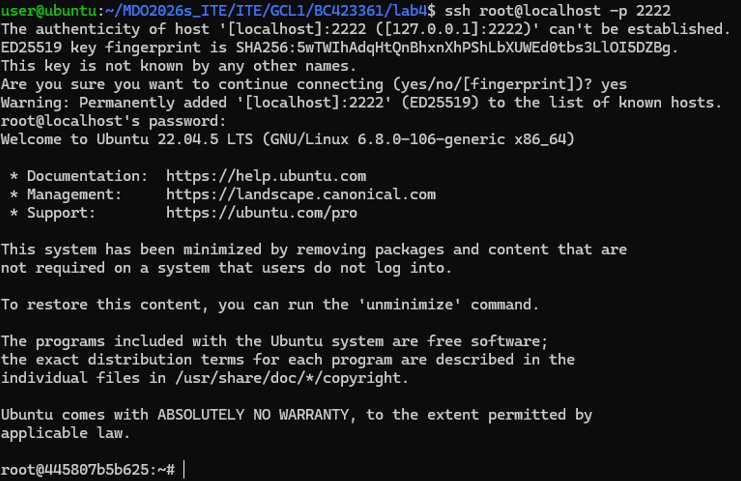

Uruchomiłem Jenkinsa wraz z DinD.

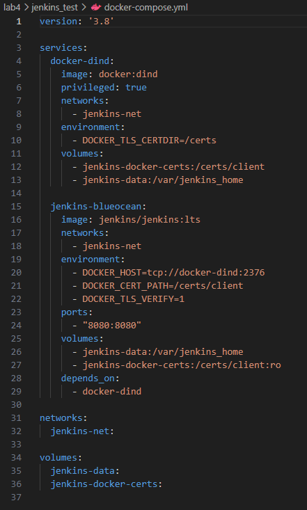

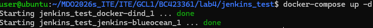

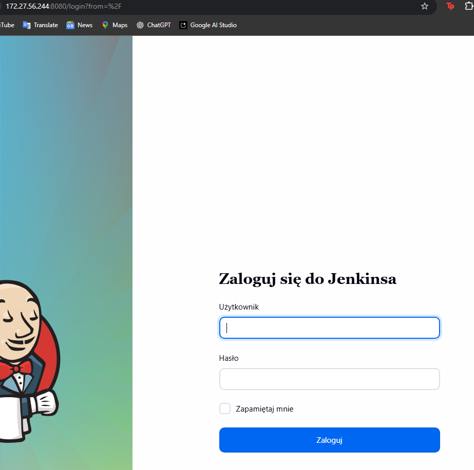

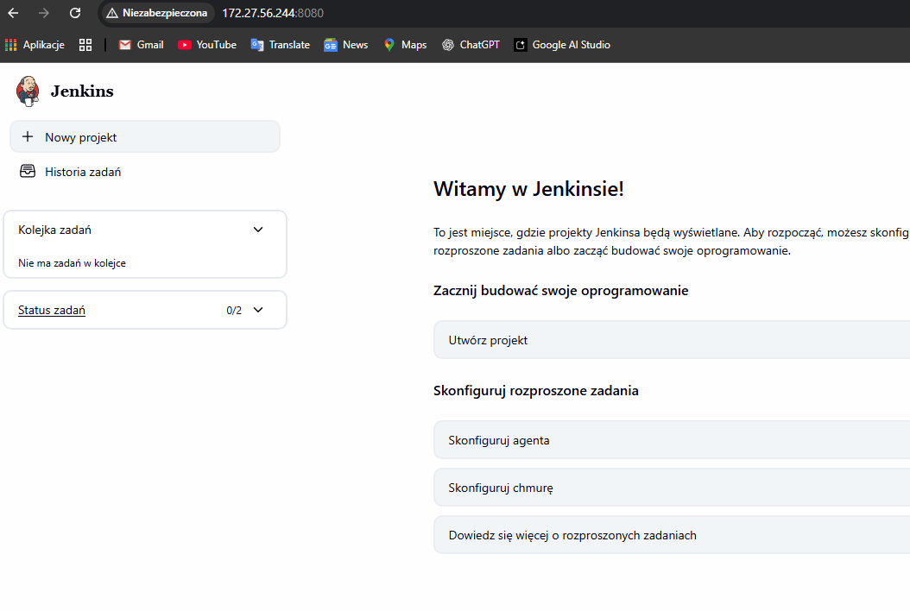

