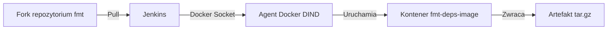
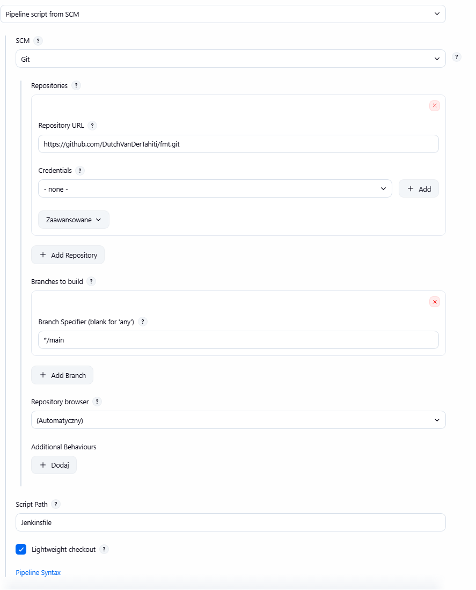

1. Uruchomiłem Jenkinsa oraz zainstalowalem plugin blueocean


2. Wykonałem początkowe zadania

2.1 Uname


2.2 Błąd dla nieparzystej godziny


   


2.3 Test DinD


3. CI/CD dla biblioteki fmt


3.1 Ponowne uruchomienie pipelineu wykonało się szybciej, ponieważ Jenkins współdzielił cache z demonem Dockera


3.2 Diagram aktywności
```mermaid
 A[Start: SCM Checkout] --> B[Wyczyszczenie Workspaceu]
    B --> C[Budowa obrazu z zależnościami C++]
    C --> D[Etap BUILD: cmake i make]
    D --> E[Etap TEST: make test]
    E --> F[Etap DEPLOY: Kompilacja i uruchomienie smoke testu]
    F --> G[Etap PUBLISH: Spakowanie biblioteki do tar.gz]
```
3.3 Diagram wdrożeniowy



3.4 Architektura Deploy i Publish

Ponieważ kompilowany kod to biblioteka, a nie demon serwera czy aplikacja webowa, dostosowałem etapy:

Deploy: Skompilowanie całkowicie odrębnego, miniaturowego programu w C++, który w swoim kodzie załączy nagłówek biblioteki (#include <fmt/core.h>) i spróbuje się z nią zlinkować. Uruchomienie tego programu w kontenerze stanowi dowód, że biblioteka działa poprawnie po stronie docelowego użytkownika. Nie wdrażamy tu kontenera na stałe, z racji charakteru oprogramowania.

Publish: Stworzenie spakowanego archiwum tar.gz zawierającego plik biblioteki statycznej (libfmt.a) oraz folder z nagłówkami. Użytkownik końcowy może to archiwum pobrać i wdrożyć w swoim środowisku programistycznym.

3.5 Wzdrożenie SCM

Utworzyłem własny fork repozytorium na GitHubie, co umożliwia integrację Jenkinsa przez SCM




3.6 Realizacja Pipelineu

Przepis dostarczany jest z SCM, a nie napisany bezpośrednio w Jenkinsie. Gwarantuje to pracę na najnowszym kodzie – polecenie cleanWs(), a sam etap SCM automatycznie pobiera rewizję z repozytorium GitHub przy każdym uruchomieniu.

Pipeline buduje dynamicznie kontener bazujący na systemie Ubuntu 22.04 z doinstalowanymi niezbędnymi dependencjami (cmake, g++, make). Wszelkie kroki budowania oraz testowaniania odbywają się w izolacji wewnątrz tego kontenera.

Proces kończy się wygenerowaniem pliku tar.gz. Plik jest wersjonowany poprzez fingerprint i przypisanie do numeru builda. Przygotowany artefakt jest gotowy do pobrania ze strony podsumowania.