1. Uruchomiłem Jenkinsa oraz zainstalowalem plugin blueocean

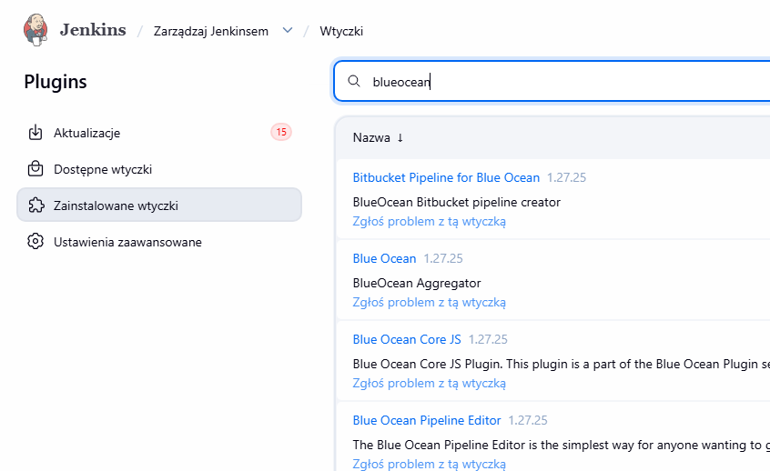

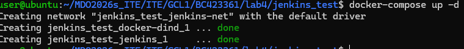

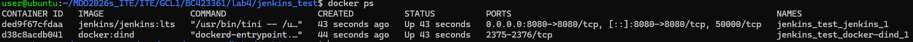

2. Wykonałem początkowe zadania

2.1 Uname

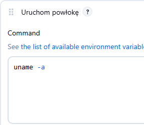

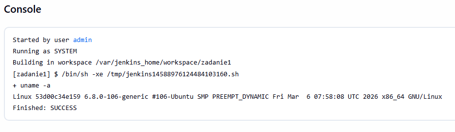

2.2 Błąd dla nieparzystej godziny

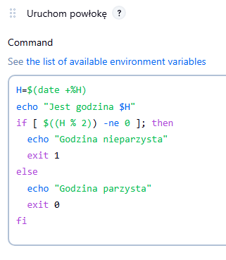

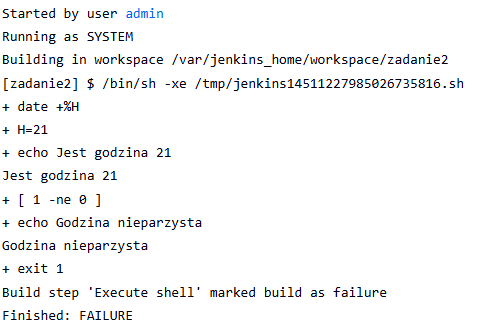    
                                                                         //POPRAW
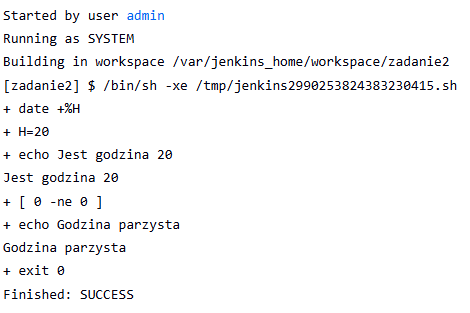

2.3 Test DinD

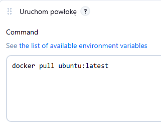

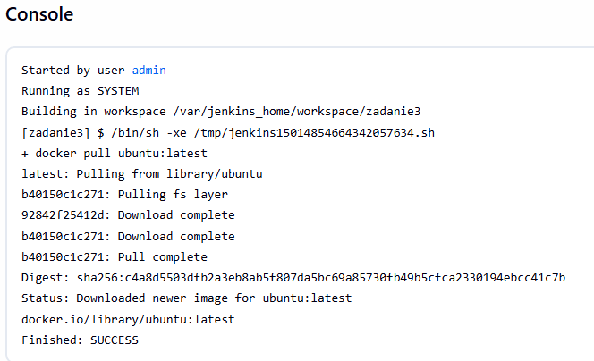

3. Pipeline dla biblioteki fmt

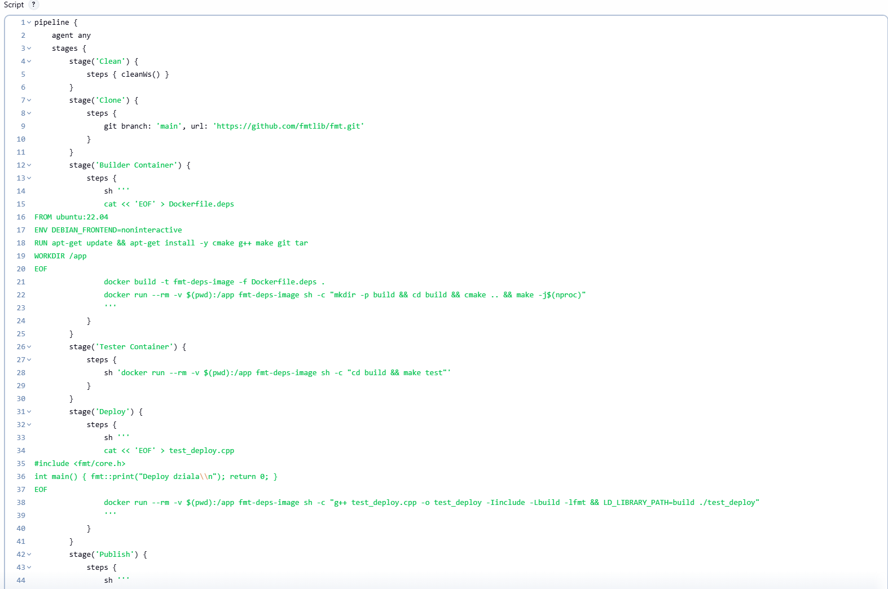

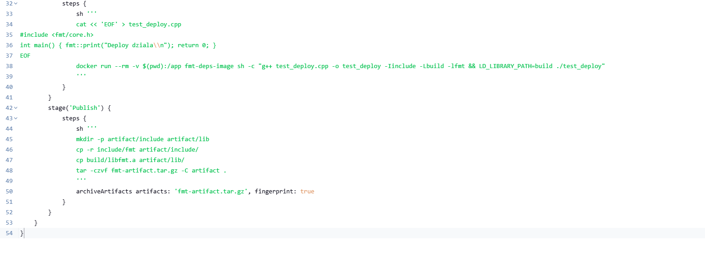

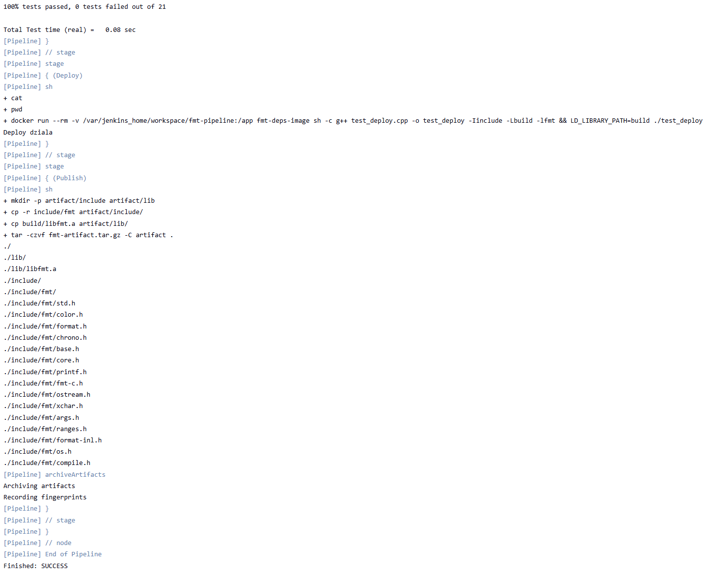

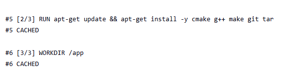

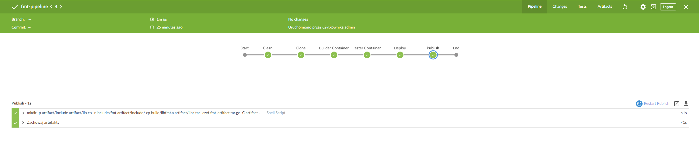

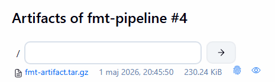

3.1 Ponowne uruchomienie pipelineu wykonało się szybciej, ponieważ Jenkins współdzielił cache z demonem Dockera
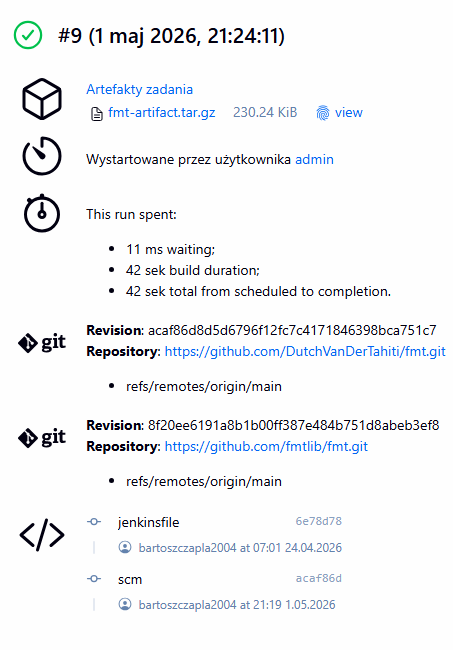

