# Ansible
1. Konfiguracja bezhasłowego logowania SSH
Skonfigurowano dostęp SSH z maszyny głównej na docelową z użyciem kluczy publicznych.

2. Inwentaryzacja i konfiguracja lokalnego DNS
Utworzono plik inventory.ini oraz przypisano nazwy maszyn do ich adresów IP w /etc/hosts.

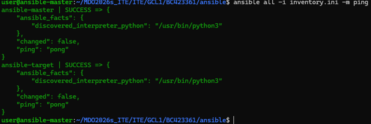

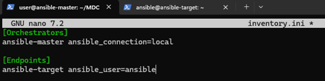

3. Uruchomienie playbooka i weryfikacja idempotencji
Utworzono i uruchomiono playbook aktualizujący system oraz instalujący pakiety. Wykazano zjawisko idempotencji (brak powtarzania niepotrzebnych akcji).

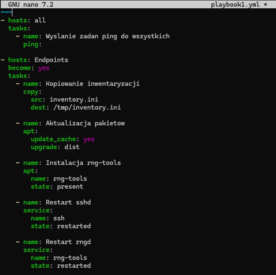

4. Symulacja awarii sieci (Sanity check)
Odłączono wirtualną kartę sieciową w Hyper-V maszyny docelowej i przetestowano zachowanie Ansible.

5. Automatyzacja wdrożenia (Deployment do Dockera)
Napisano playbook instalujący Dockera, przesyłający plik artefaktu (.tar.gz) i uruchamiający go wewnątrz kontenera. Po weryfikacji środowisko zostało automatycznie oczyszczone.

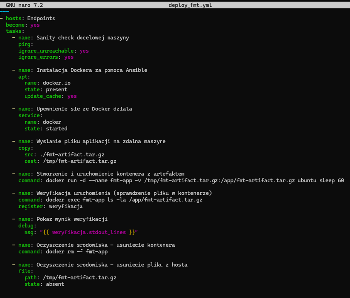

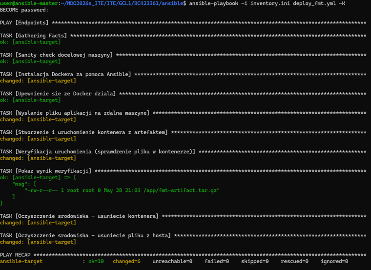

6. Generowanie struktury roli (Ansible Galaxy)
Stworzony kod wdrożeniowy przeniesiono do ustandaryzowanej struktury roli Ansible, wygenerowanej poleceniem ansible-galaxy.

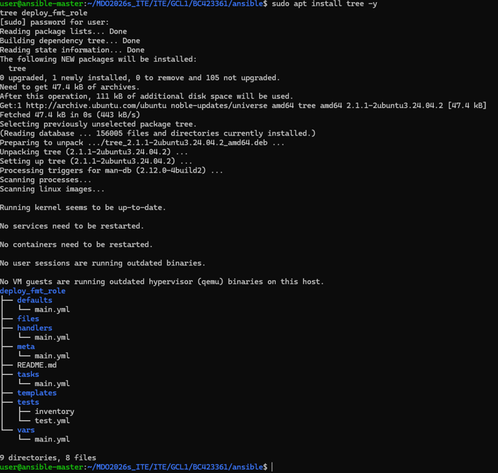

# Kickstart
1. Przygotowanie pliku odpowiedzi (Kickstart) i serwera HTTP
Utworzono plik ks.cfg z pełną konfiguracją dla Fedory 44 (partycje, nazwa hosta fedora-autodeploy, użytkownik student, repozytoria). Następnie uruchomiono serwer WWW w Pythonie, aby udostępnić ten plik maszynie instalacyjnej.

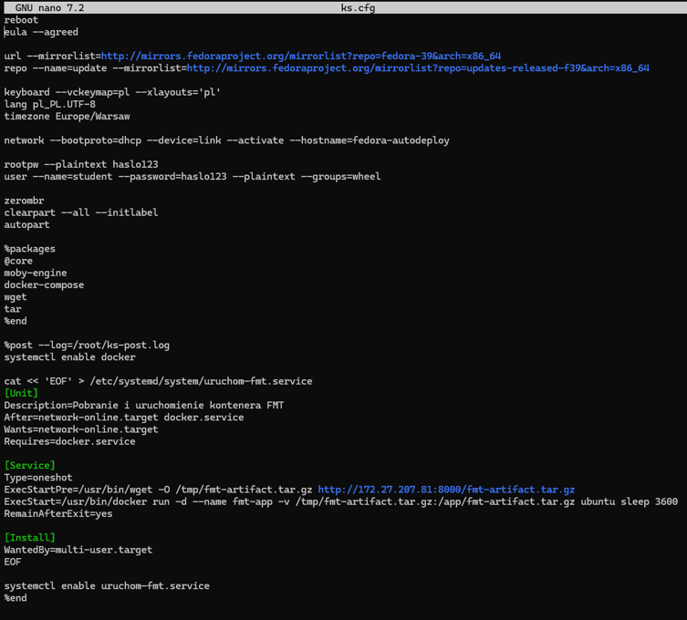

2. Mechanizm wdrożenia (CD) w sekcji %post
Aby ominąć brak Dockera podczas instalacji, w sekcji %post pliku Kickstart napisano własną usługę systemd (uruchom-fmt.service). Gwarantuje ona, że przy pierwszym uruchomieniu po instalacji system sam pobierze artefakt i wystartuje kontener.

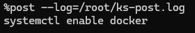

3. Zautomatyzowana instalacja Fedory
Uruchomiono maszynę wirtualną, a w menu GRUB dopisano parametr inst.ks=... wskazujący na nasz plik odpowiedzi. Instalacja przebiegła od tego momentu w 100% bezdotykowo.

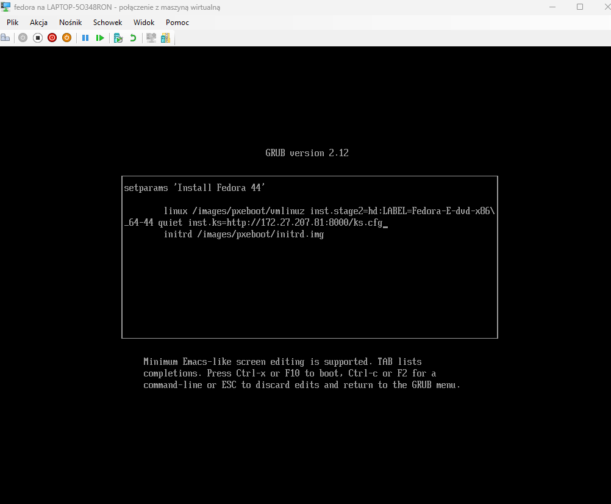

4. Weryfikacja działania środowiska po restarcie
Po samoczynnym restarcie maszyny zalogowano się na konto student i sprawdzono, czy plik odpowiedzi oraz skrypt uruchomieniowy zadziałały poprawnie.

# Kubernetes
1. Instalacja klastra Kubernetes (Minikube)
Uruchomiono klaster Minikube z wykorzystaniem demona Docker. Zapewniono odpowiednie zasoby sprzętowe (CPU/RAM) i zweryfikowano działanie narzędzia kubectl oraz samego węzła.

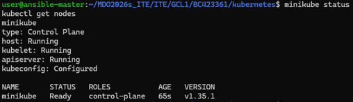

2. Uruchomienie Dashboardu i weryfikacja łączności
Wyeksponowano panel graficzny Kubernetes za pomocą polecenia kubectl proxy (z wyłączeniem filtrów), co pozwoliło na połączenie się z panelem bezpośrednio z przeglądarki na maszynie hosta (Windows).

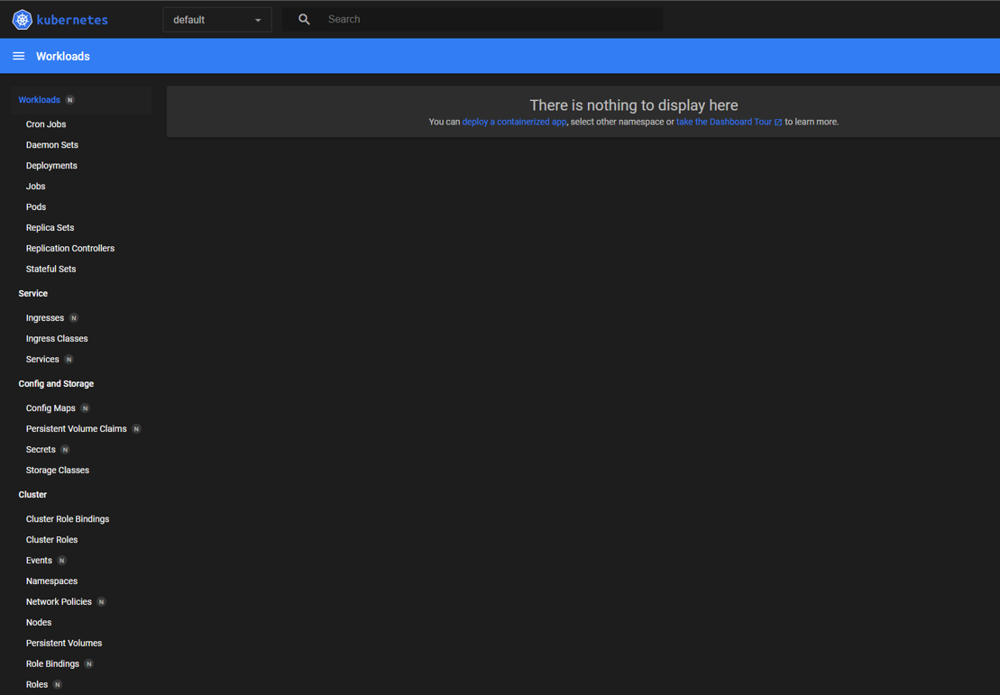

3. Ręczne uruchamianie Poda i przekierowanie portów (Port-Forwarding)
Ze względu na brak interfejsu sieciowego w budowanej wcześniej aplikacji kompilowanej, przygotowano własne obrazy oparte na Nginx. Uruchomiono z nich pojedynczego Poda i wyeksponowano jego ruch komendą kubectl port-forward.

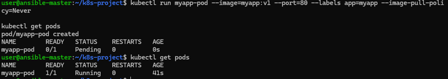

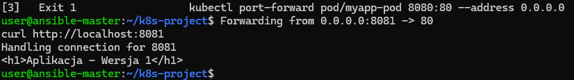

4. Skalowanie z użyciem pliku Deployment YAML
Przekuto ręczne wdrożenie na deklaratywny plik konfiguracyjny (Deployment). Przetestowano płynne zarządzanie klastrem poprzez komendy skalowania replik.

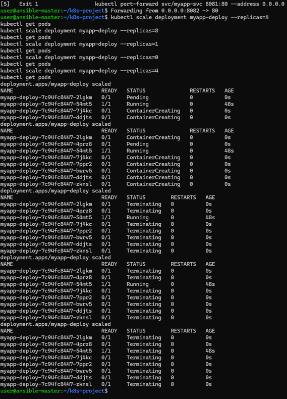

5. Wersjonowanie (Rollout), symulacja awarii i wycofanie zmian (Undo)
Wykorzystano kubectl set image do aktualizacji aplikacji (V2), a następnie zasymulowano błąd celowo wdrażając wadliwy obraz. Awarię zdiagnozowano i pomyślnie cofnięto za pomocą poleceń rollout history oraz rollout undo. Zbudowano też skrypt weryfikujący (monitor.sh).

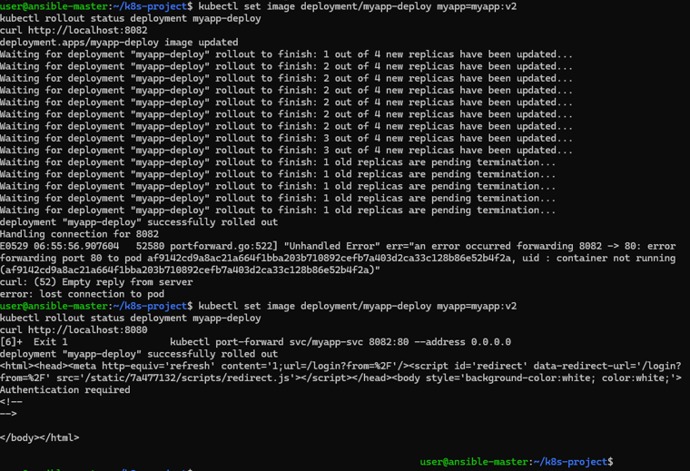

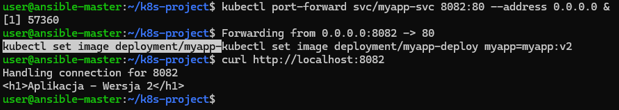

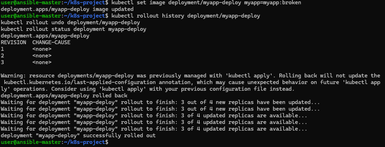

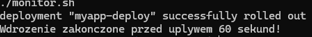

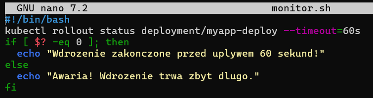

6. Przygotowanie strategii wdrożeń (Pliki konfiguracyjne)
Zrozumiano i zdefiniowano różnice w strategiach (Recreate - wiążący się z przerwą w działaniu; RollingUpdate - płynny; Canary - ułamek ruchu na testową wersję). Utworzono dla nich dedykowane pliki YAML.

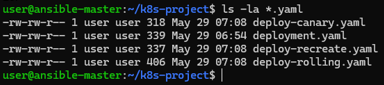

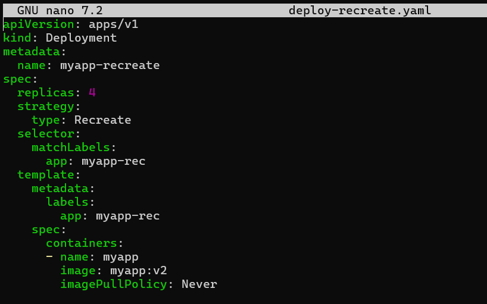

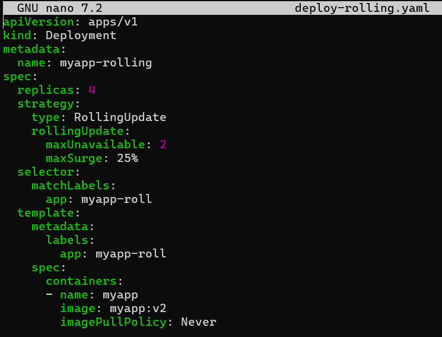

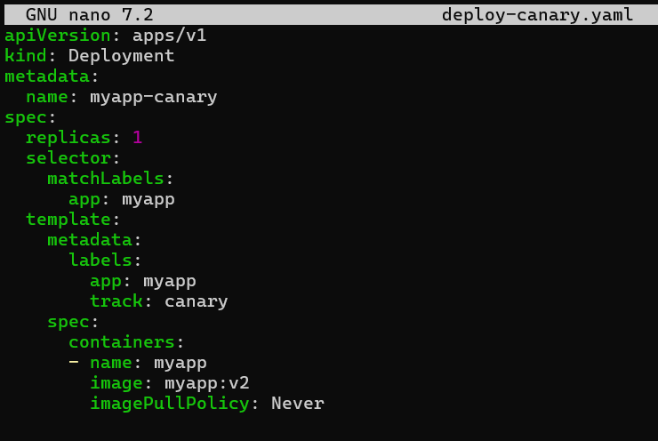

# Kubernetes 2

1. Wdrożenie masowe (36 replik)
Utworzono plik deploy11.yaml z definicją wdrożenia (Deployment) web-serwera, w którym zadeklarowano masowe uruchomienie 36 replik aplikacji.

2. Eksponowanie ruchu sieciowego na kilka sposobów
Udostępniono dostęp do serwera za pomocą czterech metod: przekierowania bezpośrednio do Poda, przekierowania do Deploymentu, wygenerowania Serwisu z palca (kubectl expose) oraz utworzenia Serwisu z pliku konfiguracyjnego service11.yaml.

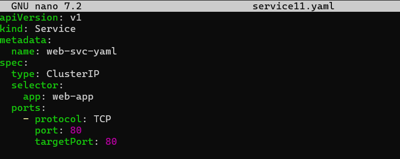

3. Skalowanie metodą imperatywną i deklaratywną
Przetestowano i udowodniono działanie dwóch metod skalowania. Najpierw użyto bezpośredniej komendy kubectl scale aby zredukować liczbę replik do 10. Następnie wyedytowano plik YAML (na 15 replik) i zaaplikowano nowy stan komendą kubectl apply -f.

