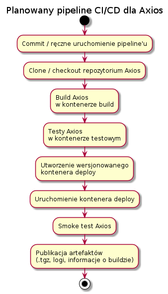

# Lab06 – Pipeline CI/CD dla Axios

## Planowany pipeline

Diagram przedstawia planowany proces CI/CD dla projektu Axios.

## Ścieżka krytyczna

Planowany pipeline CI/CD obejmuje następujące etapy:

1. **Trigger** – uruchomienie pipeline'u po zmianie w repozytorium lub ręcznie z poziomu Jenkinsa.
2. **Clone** – pobranie kodu źródłowego projektu Axios.
3. **Build** – zbudowanie projektu wewnątrz kontenera build.
4. **Test** – uruchomienie testów projektu Axios wewnątrz kontenera testowego.
5. **Deploy** – przygotowanie i uruchomienie wersjonowanego kontenera zawierającego zbudowaną aplikację.
6. **Smoke test** – podstawowa weryfikacja działania Axios w uruchomionym środowisku.
7. **Publish** – zapisanie i udostępnienie artefaktów powstałych podczas procesu.

## Lista kontrolna – stan prac

### Elementy zrealizowane

- [x] Wybrano aplikację – projekt **Axios**.
- [x] Potwierdzono możliwość wykorzystania kodu na potrzeby zadania – projekt korzysta z licencji MIT.
- [x] Zweryfikowano możliwość zbudowania projektu.
- [x] Build został wykonany wewnątrz kontenera.
- [x] Wybrano środowisko bazowe potrzebne do budowania projektu.
- [x] Stworzono diagram UML przedstawiający planowany proces CI/CD.
- [x] Testy projektu Axios zostały wykonane wewnątrz kontenera testowego – 1062 testy zakończone powodzeniem.
- [x] Kontener testowy jest oparty o obraz build `axios-build:v1.20.0`.
- [x] Przygotowano kontener runtime/deploy oparty o `node:26.8.1-bookworm-slim`.
- [x] Zdefiniowano artefakt publikowany jako pakiet `axios-1.20.0.tgz`.
- [x] Przygotowano wersjonowanie obrazu deploy jako `axios-runtime:v1.20.0`.
- [x] Przygotowano pliki `Jenkinsfile` i `Dockerfile.runtime`.

### Elementy zweryfikowane w Jenkinsie

- [x] Zweryfikowano archiwizację numerowanego logu `build-12.log` w Jenkinsie.
- [x] Zweryfikowano wdrożenie obrazu `axios-runtime:v1.20.0` w pipeline Jenkins.
- [x] Zweryfikowano smoke test – `Axios version: 1.20.0`.
- [x] Zweryfikowano publikację `axios-1.20.0.tgz` jako artefaktu buildu #12.
- [x] Zweryfikowano fingerprint oraz pochodzenie artefaktu na podstawie `build-info-12.txt`.
- [x] Porównano przygotowaną implementację z diagramem UML i opisano różnice.

## Decyzja dotycząca forka repozytorium

Nie zdecydowano się na tworzenie własnego forka repozytorium Axios. Pipeline wykorzystuje oficjalne repozytorium projektu i pobiera konkretną wersję `v1.20.0`.

W ramach zadania nie są wprowadzane zmiany w kodzie źródłowym Axios. Przygotowywane elementy dotyczą procesu CI/CD, konteneryzacji, testowania, wdrożenia i publikacji artefaktu, dlatego utrzymywanie osobnego forka projektu nie jest konieczne.

## Wersjonowanie i pochodzenie artefaktu

Publikowanym artefaktem jest pakiet npm `axios-1.20.0.tgz`. Numer `1.20.0` pochodzi z wersji projektu Axios i jest zgodny z zasadami semantic versioning.

Każde wykonanie pipeline'u posiada dodatkowo własny numer `BUILD_NUMBER` nadawany przez Jenkins. Pozwala on powiązać artefakt i logi z konkretnym wykonaniem procesu CI/CD.

Pochodzenie artefaktu będzie możliwe do ustalenia na podstawie:

- wersji źródłowej Axios `v1.20.0`,
- numeru buildu Jenkins `BUILD_NUMBER`,
- identyfikatora commita `GIT_COMMIT`,
- fingerprintu artefaktu zapisywanego przez Jenkins.

Dzięki temu można ustalić, z jakiej wersji źródeł oraz z którego wykonania pipeline'u pochodzi opublikowany artefakt.

## Lokalna weryfikacja obrazu deploy

Przed uruchomieniem pipeline'u w Jenkinsie zweryfikowano lokalnie proces przygotowania obrazu runtime.

Z pakietu `axios-1.20.0.tgz` zbudowano obraz:

`axios-runtime:v1.20.0`

przy użyciu pliku `Dockerfile.runtime`.

Następnie wykonano smoke test:

`docker run --rm axios-runtime:v1.20.0`

Kontener zakończył działanie poprawnie i zwrócił:

`Axios version: 1.20.0`

Potwierdza to, że przygotowany artefakt można zainstalować i uruchomić niezależnie od obrazu build.

## Porównanie UML z przygotowaną implementacją

Planowany diagram UML odpowiada przygotowanemu procesowi CI/CD w zakresie kolejności głównych czynności: uruchomienie procesu, pobranie kodu, build, test, deploy, smoke test oraz publish.

Nie wszystkie czynności przedstawione na diagramie są osobnymi etapami `stage` w Jenkinsfile.

Checkout repozytorium zawierającego pliki pipeline'u jest wykonywany automatycznie przez Jenkins przed rozpoczęciem zdefiniowanych etapów. Kod źródłowy Axios jest następnie pobierany podczas budowania obrazu Buildera przez `Dockerfile.build`.

Smoke test również nie został wydzielony jako osobny etap Jenkins. Jest wykonywany na końcu etapu `Deploy` poprzez uruchomienie obrazu:

`docker run --rm axios-runtime:v1.20.0`

i sprawdzenie, czy kontener poprawnie uruchamia Axios.

Pozostałe główne elementy diagramu odpowiadają bezpośrednio etapom `Build`, `Test`, `Deploy` oraz `Publish` w Jenkinsfile.

## Wybór osobnego obrazu deploy/runtime

Obraz build `axios-build:v1.20.0` nie został wykorzystany jako końcowy obraz deploy. Zawiera on pełne repozytorium projektu, zależności oraz narzędzia potrzebne do budowania i testowania, które nie są wymagane podczas uruchamiania gotowego artefaktu.

Dlatego przygotowano osobny obraz runtime `axios-runtime:v1.20.0`, oparty o lżejszy obraz `node:26.8.1-bookworm-slim`.

Do obrazu runtime trafia przygotowany pakiet `axios-1.20.0.tgz`, który jest następnie instalowany w czystym środowisku. Pozwala to rozdzielić środowisko budowania od środowiska uruchomieniowego oraz zweryfikować, że opublikowany artefakt działa niezależnie od kontenera build.
