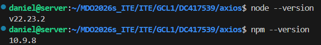

# Sprawozdanie 1

## Zajęcia 01 — Git, SSH i gałęzie

### Środowisko

Ćwiczenia wykonano na maszynie wirtualnej z systemem Ubuntu Server 24.04 LTS uruchomionej w Hyper-V. Do pracy zdalnej wykorzystano Visual Studio Code oraz rozszerzenie Remote - SSH.

### Konfiguracja Git i SSH

Sprawdzono dostępność klienta Git oraz SSH:

```bash
git --version
ssh -V
```

Repozytorium przedmiotowe znajduje się w katalogu:

```text
/home/daniel/MDO2026s_ITE
```

Adres zdalnego repozytorium wykorzystuje protokół HTTPS. Praca odbywa się na gałęzi:

```text
DC417539
```

Gałąź lokalna śledzi gałąź zdalną:

```text
origin/DC417539
```


### Git Hook `commit-msg`

Utworzono hook sprawdzający, czy komunikat commita rozpoczyna się od numeru identyfikacyjnego `DC417539`.

Treść skryptu:

```bash
#!/bin/bash

message=$(cat "$1")

if [[ $message != DC417539* ]]; then
    echo "Commit message must start with DC417539"
    exit 1
fi
```

Hook został zainstalowany w lokalnym katalogu repozytorium:

```text
.git/hooks/commit-msg
```

Ponieważ zawartość katalogu `.git` nie jest wersjonowana, kopię skryptu zapisano również w:

```text
Lab01/commit-msg
```

Sprawdzono działanie hooka dla nieprawidłowego komunikatu:

Hook odrzucił komunikat i zwrócił kod zakończenia `1`.


Następnie wykonano test z prawidłowym komunikatem:

Hook zaakceptował komunikat i zwrócił kod zakończenia `0`.


### Commit i synchronizacja z repozytorium

Plik Git Hooka został zatwierdzony w commicie:

```text
60dd2db DC417539 Add commit-msg hook
```

Commit został następnie wysłany na zdalną gałąź `origin/DC417539`.


## Zajęcia 02 — Git i Docker

### Środowisko Docker

Ćwiczenia wykonano w systemie Ubuntu Server 24.04 LTS. Sprawdzono wersję klienta Docker oraz poprawność działania usługi:

```bash
docker --version
docker info
```

Wykorzystano Docker w wersji 29.1.3 zainstalowany z pakietów przeznaczonych dla systemu Ubuntu.

### Uruchamianie gotowych obrazów

Uruchomiono i sprawdzono obrazy:

* `hello-world`
* `busybox`
* `ubuntu`
* `nginx`
* `node`
* `mcr.microsoft.com/dotnet/runtime`
* `mcr.microsoft.com/dotnet/aspnet`
* `mcr.microsoft.com/dotnet/sdk`

Po każdym uruchomieniu sprawdzano kod zakończenia ostatniego polecenia:

```bash
echo $?
```

Kod `0` potwierdzał poprawne zakończenie działania kontenera.


Sprawdzone rozmiary obrazów:

| Obraz                                     | Rozmiar |
| ----------------------------------------- | ------: |
| `hello-world:latest`                      | 10,1 kB |
| `busybox:latest`                          | 4,45 MB |
| `ubuntu:latest`                           |  100 MB |
| `nginx:latest`                            |  161 MB |
| `node:latest`                             | 1,24 GB |
| `mcr.microsoft.com/dotnet/runtime:latest` |  203 MB |
| `mcr.microsoft.com/dotnet/aspnet:latest`  |  230 MB |
| `mcr.microsoft.com/dotnet/sdk:latest`     |  883 MB |


### BusyBox

Uruchomiono kontener BusyBox i potwierdzono jego działanie:

```bash
docker run --name s1-z02-busybox busybox echo "BusyBox działa"
```

Następnie uruchomiono kontener interaktywnie:

```bash
docker run --rm -it busybox sh
```

Sprawdzona wersja:

```text
BusyBox v1.38.0
```


### Ubuntu i procesy kontenera

Uruchomiono interaktywny kontener Ubuntu:

```bash
docker run --name s1-z02-ubuntu -it ubuntu bash
```

Sprawdzono proces o PID 1:

```bash
ps -p 1 -o pid,comm,args
```

Procesem PID 1 w kontenerze był `bash`.

W kontenerze zaktualizowano listę pakietów oraz zainstalowane pakiety:

```bash
apt update
apt upgrade -y
```


Uruchomiono również pomocniczy kontener z poleceniem `sleep infinity`. Proces kontenera był widoczny na hoście za pomocą:

```bash
ps aux | grep '[s]leep infinity'
```


### Własny obraz Docker

Utworzono plik `Dockerfile` bazujący na obrazie Ubuntu 24.04. Plik instaluje Git i certyfikaty CA, usuwa niepotrzebną pamięć podręczną APT oraz klonuje repozytorium przedmiotowe.

Treść pliku:

```dockerfile
FROM ubuntu:24.04

RUN apt-get update \
    && apt-get install -y --no-install-recommends git ca-certificates \
    && rm -rf /var/lib/apt/lists/*

WORKDIR /workspace

RUN git clone https://github.com/InzynieriaOprogramowaniaAGH/MDO2026s_ITE.git

CMD ["/bin/bash"]
```

Obraz zbudowano poleceniem:

```bash
docker build -t moj-test .
```


Następnie uruchomiono kontener w trybie interaktywnym:

```bash
docker run --name wlasny -it moj-test
```

W kontenerze potwierdzono obecność repozytorium w katalogu:

```text
/workspace/MDO2026s_ITE
```

Sprawdzono również wersję Git oraz stan sklonowanego repozytorium:

```bash
git --version
cd /workspace/MDO2026s_ITE
git status
```

Repozytorium znajdowało się na gałęzi `main`, a katalog roboczy był czysty.


### Czyszczenie środowiska

Wyświetlono wszystkie utworzone kontenery:

```bash
docker ps -a
```


Zakończone kontenery usunięto za pomocą:

```bash
docker container prune
```

Lokalne obrazy usunięto poleceniem:

```bash
docker image prune -a
```

Po zakończeniu sprawdzono, że listy kontenerów i obrazów były puste:

```bash
docker ps -a
docker images
```


Plik `Dockerfile` zapisano w katalogu:

```text
ITE/GCL1/DC417539/sprawozdanie1/Lab02/Dockerfile
```

## Zajęcia 03 – Dockerfiles, kontener jako definicja etapu

### Wybór i przygotowanie projektu

Do realizacji zadania wybrano bibliotekę **Axios** w wersji `v1.20.0`. Projekt jest udostępniany na otwartej licencji MIT oraz posiada zdefiniowane procesy budowania i testowania przy użyciu środowiska Node.js i npm.

Repozytorium zostało sklonowane i przełączone na konkretny tag:

```bash
git clone https://github.com/axios/axios.git
cd axios
git checkout v1.20.0
```


Na hoście `server` wykorzystano Node.js `v22.23.2` oraz npm `10.9.8`.



Zależności projektu zostały zainstalowane na podstawie pliku `package-lock.json`:

```bash
npm ci
```


### Lokalny build programu

Proces budowania projektu został uruchomiony poleceniem:

```bash
npm run build
```

W wyniku działania procesu zostały utworzone pliki wynikowe w katalogu `dist`, między innymi wersje przeznaczone dla środowiska Node.js, przeglądarki oraz modułów ESM.


Następnie uruchomiono testy jednostkowe:

```bash
npm run test:vitest:unit
```

Testy zostały wykonane przy użyciu Vitest. Wszystkie testy zakończyły się powodzeniem:

```text
Test Files  58 passed (58)
Tests       1062 passed (1062)
```


### Interaktywny build w kontenerze

Do odtworzenia procesu w izolowanym środowisku wykorzystano obraz:

```text
node:26.8.1-bookworm
```

Kontener został uruchomiony w trybie interaktywnym:

```bash
docker run -it --name axios-interactive node:26.8.1-bookworm bash
```

W kontenerze ponownie sklonowano repozytorium, wybrano wersję `v1.20.0`, zainstalowano zależności oraz wykonano build:

```bash
cd /opt
git clone https://github.com/axios/axios.git
cd axios
git checkout v1.20.0
npm ci
npm run build
```


Podczas uruchamiania testów w kontenerze wystąpiła różnica w sposobie rozwiązywania adresu `localhost`. Problem rozwiązano przez wymuszenie preferowania IPv4 przez Node.js:

```bash
NODE_OPTIONS=--dns-result-order=ipv4first npm run test:vitest:unit
```

Po zastosowaniu tego ustawienia wszystkie testy zakończyły się powodzeniem:

```text
Test Files  58 passed (58)
Tests       1062 passed (1062)
```


Po opuszczeniu kontenera sprawdzono stan obrazów i kontenerów. Obraz stanowi szablon środowiska, natomiast kontener jest jego konkretną instancją. Po wykonaniu polecenia `exit` główny proces `bash` zakończył działanie, dlatego kontener przeszedł do stanu `Exited (0)`.


### Automatyzacja procesu – Dockerfile

W katalogu `Lab03` przygotowano dwa osobne pliki Dockerfile.

Pierwszy plik `Dockerfile.build` odpowiada za przygotowanie środowiska, pobranie kodu, instalację zależności i wykonanie builda:

```dockerfile
FROM node:26.8.1-bookworm

WORKDIR /opt

RUN git clone https://github.com/axios/axios.git

WORKDIR /opt/axios

RUN git checkout v1.20.0
RUN npm ci
RUN npm run build
```

Obraz został zbudowany poleceniem:

```bash
docker build -f Dockerfile.build -t axios-build:v1.20.0 .
```


Drugi plik `Dockerfile.test` bazuje na wcześniej przygotowanym obrazie i nie wykonuje ponownego builda:

```dockerfile
FROM axios-build:v1.20.0

ENV NODE_OPTIONS=--dns-result-order=ipv4first

CMD ["npm", "run", "test:vitest:unit"]
```

Obraz testowy został utworzony poleceniem:

```bash
docker build -f Dockerfile.test -t axios-test:v1.20.0 .
```


Uruchomienie kontenera utworzonego z obrazu testowego automatycznie wykonało testy:

```bash
docker run --name axios-test-run axios-test:v1.20.0
```

Wszystkie `1062` testy zostały zaliczone.


Polecenia:

```bash
docker ps -a
docker images
```

pozwoliły również potwierdzić obecność trzech obrazów oraz zakończonych kontenerów.


### Docker Compose

Proces budowania został następnie ujęty w kompozycję Docker Compose.

Przygotowano plik `compose.yml`:

```yaml
services:
  build:
    build:
      context: .
      dockerfile: Dockerfile.build
    image: axios-build:v1.20.0

  test:
    build:
      context: .
      dockerfile: Dockerfile.test
    image: axios-test:v1.20.0
```

Poprawność konfiguracji sprawdzono poleceniem:

```bash
docker compose config
```

Pierwszy etap został zbudowany poleceniem:

```bash
docker compose build build
```


Następnie zbudowano obraz testowy:

```bash
docker compose build test
```

Testy uruchomiono bez ręcznego wdrażania kontenera:

```bash
docker compose run --rm test
```

Wynik końcowy:

```text
Test Files  58 passed (58)
Tests       1062 passed (1062)
```

potwierdził poprawne działanie przygotowanej kompozycji.


## Zajęcia 04 — Dodatkowa terminologia w konteneryzacji, instancja Jenkins

Podczas zajęć sprawdzono działanie woluminów Docker, komunikację sieciową między kontenerami, uruchamianie usługi SSHD w kontenerze oraz przygotowano instancję Jenkins współpracującą z Docker-in-Docker.

### Zachowywanie stanu między kontenerami

Utworzono dwa nazwane woluminy: `lab04-input` oraz `lab04-output`. Pierwszy służył do przechowywania kodu źródłowego Axios, a drugi do zapisywania wyników builda.

Na podstawie wcześniejszego obrazu przygotowano również wersję bez programu Git. Dzięki temu kod mógł zostać pobrany przez osobny kontener i zapisany na woluminie, a kontener buildowy zajmował się tylko budowaniem projektu.


Repozytorium Axios zostało sklonowane na wolumin `lab04-input` przy pomocy osobnego kontenera.


Następnie wykonano build projektu, a katalog `dist` zapisano na woluminie `lab04-output`. Po uruchomieniu kolejnego kontenera dane nadal były dostępne, co potwierdziło trwałość named volume niezależnie od kontenera.


Sprawdzono również drugi wariant, w którym Git znajdował się bezpośrednio w kontenerze wykonującym build. Repozytorium zostało sklonowane, projekt zbudowany, a wynik ponownie zapisany na woluminie wyjściowym.


### Eksponowanie portów i komunikacja między kontenerami

Do sprawdzenia komunikacji sieciowej wykorzystano `iperf3`.

Najpierw dwa kontenery działały w domyślnej sieci `bridge`. Połączenie wykonano po adresie IP, uzyskując przepustowość około `25,8 Gbit/s`.


Następnie utworzono własną sieć `lab04-net`. W tej sieci kontenery mogły komunikować się po nazwach, dlatego klient połączył się z serwerem jako `lab04-iperf-server`. Uzyskano około `21,0 Gbit/s`.


Port `5201` został również opublikowany na hoście. Z komputera poza maszyną `server` sprawdzono jego dostępność przy pomocy `Test-NetConnection`.


Na hoście wykonano także test `iperf3` do kontenera przez opublikowany port. Otrzymano wynik około `17,7 Gbit/s`.


Logi serwera `iperf3` potwierdziły wykonane połączenia i uzyskane wyniki.


Najwyższy wynik uzyskano podczas komunikacji kontener-kontener w domyślnej sieci `bridge`. Nieco niższy wynik wystąpił w dedykowanej sieci Docker, a najniższy przy połączeniu host-kontener przez opublikowany port. Wszystkie warianty działały poprawnie.

### Usługa SSHD w kontenerze

Przygotowano obraz Ubuntu 24.04 z zainstalowanym `openssh-server`. W kontenerze utworzono użytkownika `labuser`, a port `22` udostępniono na porcie `2222` hosta.

Połączenie wykonano poleceniem:

```bash
ssh -p 2222 labuser@127.0.0.1
```

Polecenia `whoami` oraz `hostname` potwierdziły, że połączenie działało wewnątrz właściwego kontenera.


SSHD może być przydatny w niektórych przypadkach, ale w typowej pracy z kontenerami prostszym rozwiązaniem jest używanie `docker exec` oraz logów kontenera.

### Skonteneryzowana instancja Jenkins z Docker-in-Docker

Na końcu przygotowano środowisko Jenkins działające w Dockerze. Utworzono sieć `jenkins` oraz woluminy na dane i certyfikaty.

Uruchomiono kontener `jenkins-docker` z obrazem `docker:dind`, który udostępnia daemon Dockera dla Jenkinsa.

Właściwy Jenkins działał w kontenerze `jenkins-blueocean` na przygotowanym obrazie `myjenkins-blueocean:2.568.3-1`. Kontener został połączony z `jenkins-docker` i skonfigurowany do korzystania z jego daemona Docker.


Połączenie sprawdzono przez wykonanie `docker info` wewnątrz kontenera Jenkins. Polecenie zwróciło informacje o daemonie działającym w `jenkins-docker`, co potwierdziło poprawną komunikację między kontenerami.


Po konfiguracji uzyskano działający panel Jenkins dostępny przez port `8080`.


Instancję Jenkins oraz kontener Docker-in-Docker pozostawiono uruchomione, ponieważ były potrzebne podczas kolejnych zajęć.
