# Sprawozdanie 1

## Zajęcia 01 — Git, SSH i gałęzie

### Środowisko

Ćwiczenia wykonano na maszynie wirtualnej z systemem Ubuntu Server 24.04 LTS uruchomionej w Hyper-V. Do pracy zdalnej wykorzystano Visual Studio Code oraz rozszerzenie Remote - SSH.

### Konfiguracja Git i SSH

Sprawdzono dostępność klienta Git oraz SSH:

```bash
git --version
ssh -V
```

Repozytorium przedmiotowe znajduje się w katalogu:

```text
/home/daniel/MDO2026s_ITE
```

Adres zdalnego repozytorium wykorzystuje protokół HTTPS. Praca odbywa się na gałęzi:

```text
DC417539
```

Gałąź lokalna śledzi gałąź zdalną:

```text
origin/DC417539
```

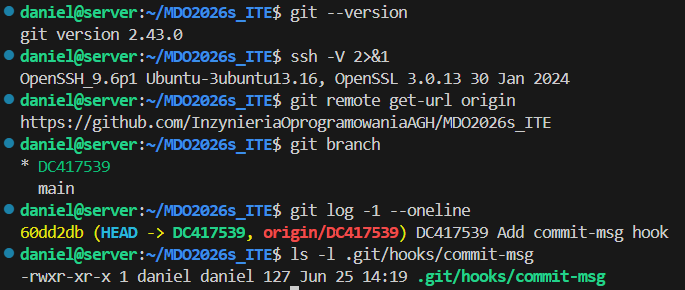


### Git Hook `commit-msg`

Utworzono hook sprawdzający, czy komunikat commita rozpoczyna się od numeru identyfikacyjnego `DC417539`.

Treść skryptu:

```bash
#!/bin/bash

message=$(cat "$1")

if [[ $message != DC417539* ]]; then
    echo "Commit message must start with DC417539"
    exit 1
fi
```

Hook został zainstalowany w lokalnym katalogu repozytorium:

```text
.git/hooks/commit-msg
```

Ponieważ zawartość katalogu `.git` nie jest wersjonowana, kopię skryptu zapisano również w:

```text
Lab01/commit-msg
```

Sprawdzono działanie hooka dla nieprawidłowego komunikatu:

```bash
printf '%s\n' "Dodanie pliku" > /tmp/commit-message-test
.git/hooks/commit-msg /tmp/commit-message-test
echo "Kod zakończenia: $?"
```

Hook odrzucił komunikat i zwrócił kod zakończenia `1`.

Następnie wykonano test z prawidłowym komunikatem:

```bash
printf '%s\n' "DC417539 Dodanie pliku" > /tmp/commit-message-test
.git/hooks/commit-msg /tmp/commit-message-test
echo "Kod zakończenia: $?"
```

Hook zaakceptował komunikat i zwrócił kod zakończenia `0`.


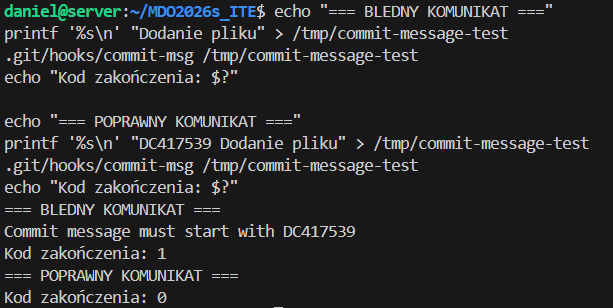

### Commit i synchronizacja z repozytorium

Plik Git Hooka został zatwierdzony w commicie:

```text
60dd2db DC417539 Add commit-msg hook
```

Commit został następnie wysłany na zdalną gałąź `origin/DC417539`.

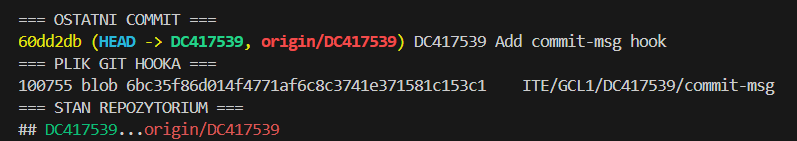


## Zajęcia 02 — Git i Docker

### Środowisko Docker

Ćwiczenia wykonano w systemie Ubuntu Server 24.04 LTS. Sprawdzono wersję klienta Docker oraz poprawność działania usługi:

```bash
docker --version
docker info
```

Wykorzystano Docker w wersji 29.1.3 zainstalowany z pakietów przeznaczonych dla systemu Ubuntu.

### Uruchamianie gotowych obrazów

Uruchomiono i sprawdzono obrazy:

* `hello-world`
* `busybox`
* `ubuntu`
* `nginx`
* `node`
* `mcr.microsoft.com/dotnet/runtime`
* `mcr.microsoft.com/dotnet/aspnet`
* `mcr.microsoft.com/dotnet/sdk`

Po każdym uruchomieniu sprawdzano kod zakończenia ostatniego polecenia:

```bash
echo $?
```

Kod `0` potwierdzał poprawne zakończenie działania kontenera.

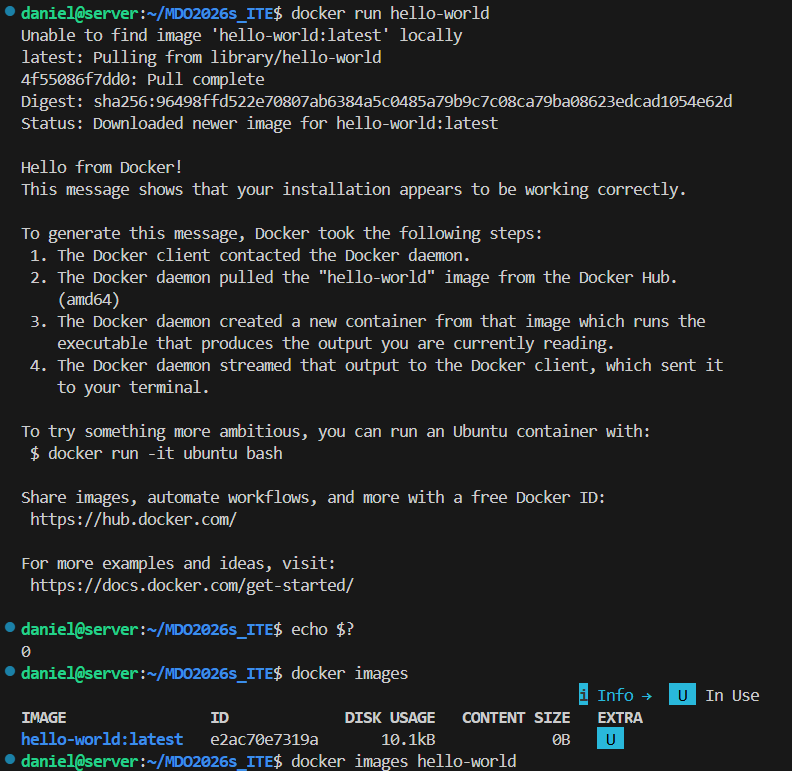

Sprawdzone rozmiary obrazów:

| Obraz                                     | Rozmiar |
| ----------------------------------------- | ------: |
| `hello-world:latest`                      | 10,1 kB |
| `busybox:latest`                          | 4,45 MB |
| `ubuntu:latest`                           |  100 MB |
| `nginx:latest`                            |  161 MB |
| `node:latest`                             | 1,24 GB |
| `mcr.microsoft.com/dotnet/runtime:latest` |  203 MB |
| `mcr.microsoft.com/dotnet/aspnet:latest`  |  230 MB |
| `mcr.microsoft.com/dotnet/sdk:latest`     |  883 MB |

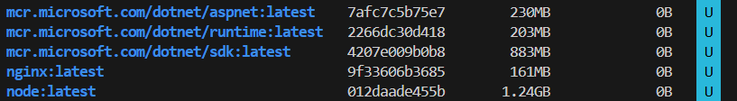

### BusyBox

Uruchomiono kontener BusyBox i potwierdzono jego działanie:

```bash
docker run --name s1-z02-busybox busybox echo "BusyBox działa"
```

Następnie uruchomiono kontener interaktywnie:

```bash
docker run --rm -it busybox sh
```

Sprawdzona wersja:

```text
BusyBox v1.38.0
```

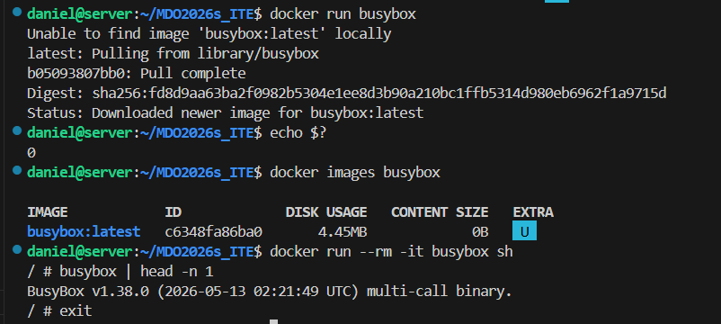

### Ubuntu i procesy kontenera

Uruchomiono interaktywny kontener Ubuntu:

```bash
docker run --name s1-z02-ubuntu -it ubuntu bash
```

Sprawdzono proces o PID 1:

```bash
ps -p 1 -o pid,comm,args
```

Procesem PID 1 w kontenerze był `bash`.

W kontenerze zaktualizowano listę pakietów oraz zainstalowane pakiety:

```bash
apt update
apt upgrade -y
```

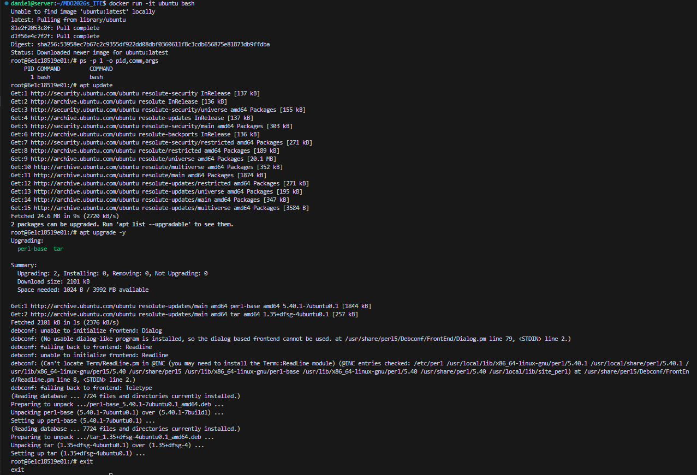

Uruchomiono również pomocniczy kontener z poleceniem `sleep infinity`. Proces kontenera był widoczny na hoście za pomocą:

```bash
ps aux | grep '[s]leep infinity'
```

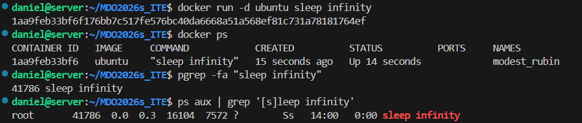

### Własny obraz Docker

Utworzono plik `Dockerfile` bazujący na obrazie Ubuntu 24.04. Plik instaluje Git i certyfikaty CA, usuwa niepotrzebną pamięć podręczną APT oraz klonuje repozytorium przedmiotowe.

Treść pliku:

```dockerfile
FROM ubuntu:24.04

RUN apt-get update \
    && apt-get install -y --no-install-recommends git ca-certificates \
    && rm -rf /var/lib/apt/lists/*

WORKDIR /workspace

RUN git clone https://github.com/InzynieriaOprogramowaniaAGH/MDO2026s_ITE.git

CMD ["/bin/bash"]
```

Obraz zbudowano poleceniem:

```bash
docker build -t s1-z02-repo:1.0 .
```

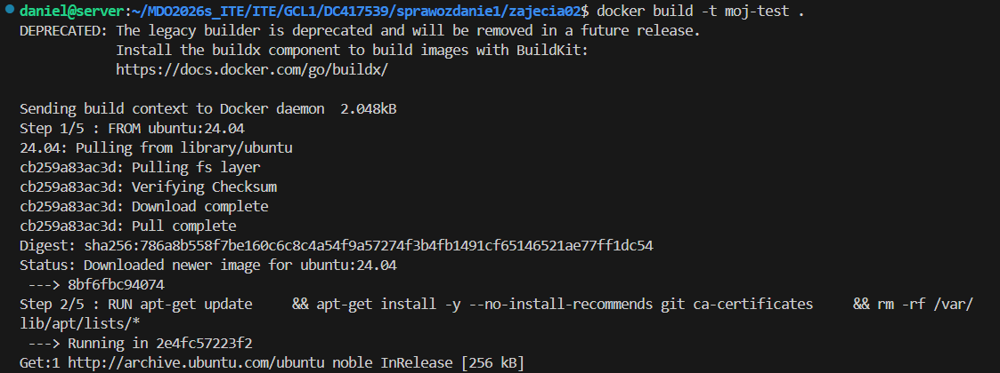

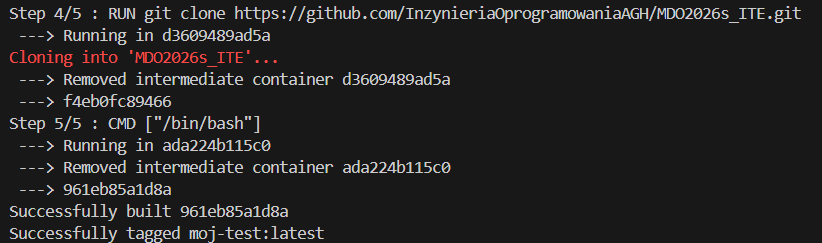

Następnie uruchomiono kontener w trybie interaktywnym:

```bash
docker run --name s1-z02-wlasny -it s1-z02-repo:1.0
```

W kontenerze potwierdzono obecność repozytorium w katalogu:

```text
/workspace/MDO2026s_ITE
```

Sprawdzono również wersję Git oraz stan sklonowanego repozytorium:

```bash
git --version
cd /workspace/MDO2026s_ITE
git status
```

Repozytorium znajdowało się na gałęzi `main`, a katalog roboczy był czysty.

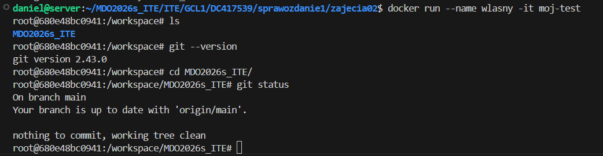

### Czyszczenie środowiska

Wyświetlono wszystkie utworzone kontenery:

```bash
docker ps -a
```

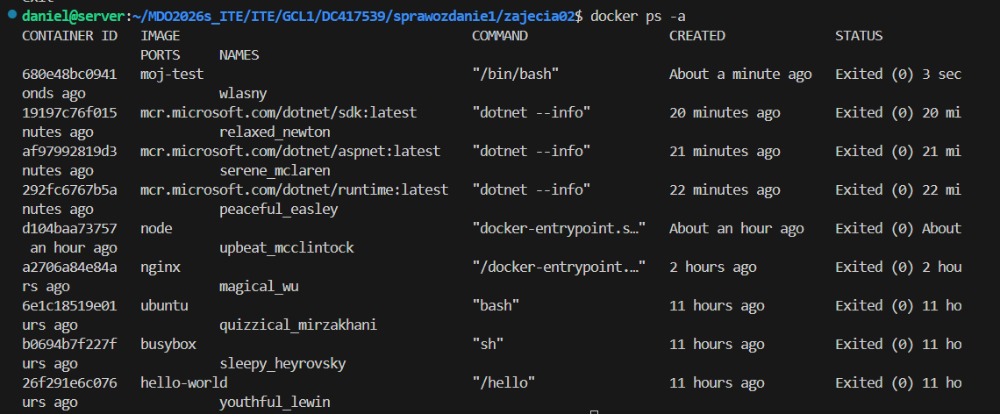

Zakończone kontenery usunięto za pomocą:

```bash
docker container prune
```

Lokalne obrazy usunięto poleceniem:

```bash
docker image prune -a
```

Po zakończeniu sprawdzono, że listy kontenerów i obrazów były puste:

```bash
docker ps -a
docker images
```

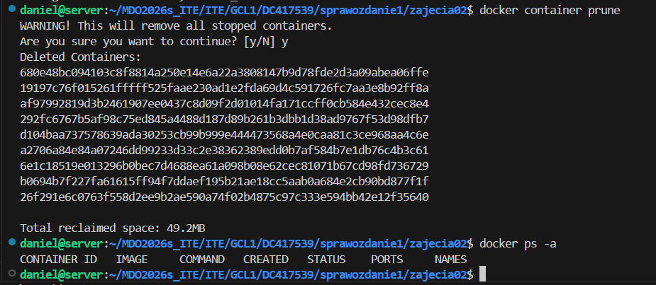

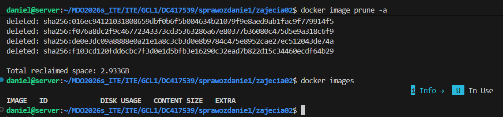

Plik `Dockerfile` zapisano w katalogu:

```text
ITE/GCL1/DC417539/sprawozdanie1/Lab02/Dockerfile
```

## Zajęcia 03 – Dockerfiles, kontener jako definicja etapu

### Wybór i przygotowanie projektu

Do realizacji zadania wybrano bibliotekę **Axios** w wersji `v1.20.0`. Projekt jest udostępniany na otwartej licencji MIT oraz posiada zdefiniowane procesy budowania i testowania przy użyciu środowiska Node.js i npm.

Repozytorium zostało sklonowane i przełączone na konkretny tag:

```bash
git clone https://github.com/axios/axios.git
cd axios
git checkout v1.20.0
```

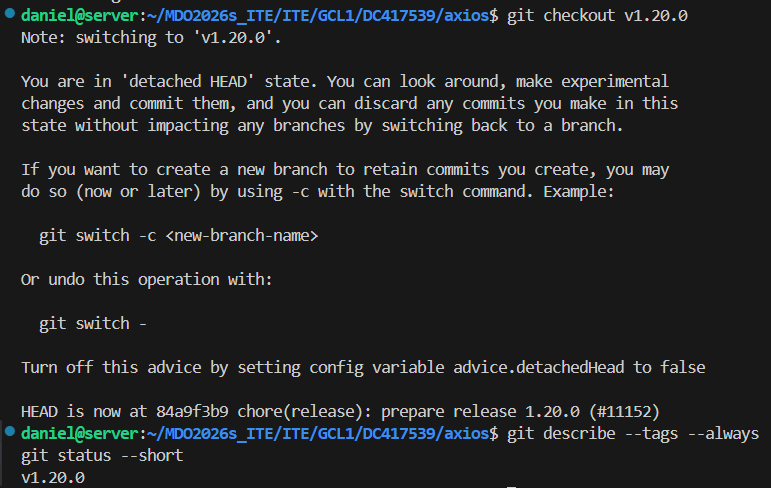

Projekt wymagał nowszej wersji Node.js niż dostępna domyślnie w repozytorium Ubuntu. Do wykonania zadania wykorzystano Node.js `26.8.1`.

Zależności projektu zostały zainstalowane na podstawie pliku `package-lock.json`:

```bash
npm ci
```

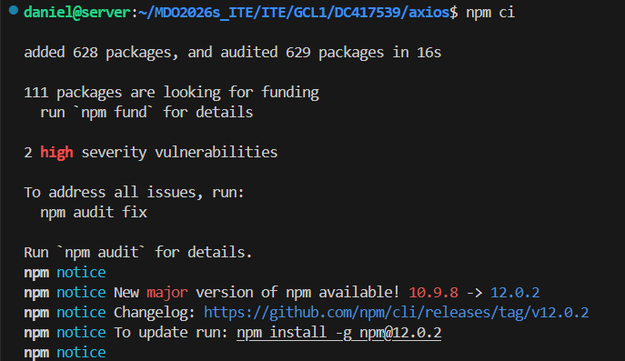

### Lokalny build programu

Proces budowania projektu został uruchomiony poleceniem:

```bash
npm run build
```

W wyniku działania procesu zostały utworzone pliki wynikowe w katalogu `dist`, między innymi wersje przeznaczone dla środowiska Node.js, przeglądarki oraz modułów ESM.

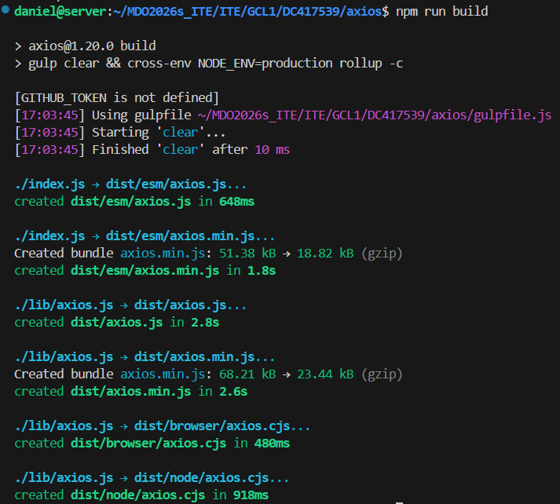

Następnie uruchomiono testy jednostkowe:

```bash
npm run test:vitest:unit
```

Testy zostały wykonane przy użyciu Vitest. Wszystkie testy zakończyły się powodzeniem:

```text
Test Files  58 passed (58)
Tests       1062 passed (1062)
```

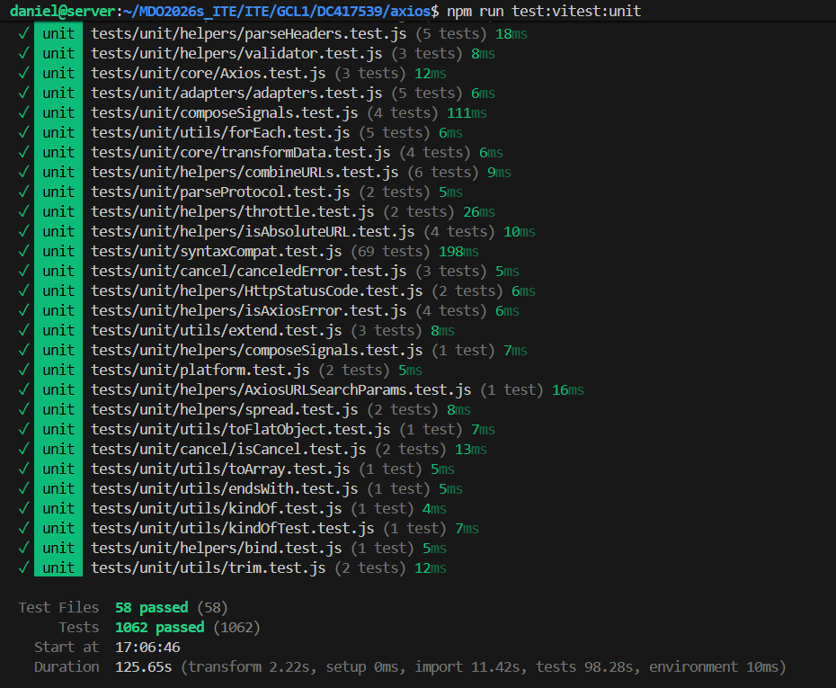

### Interaktywny build w kontenerze

Do odtworzenia procesu w izolowanym środowisku wykorzystano obraz:

```text
node:26.8.1-bookworm
```

Kontener został uruchomiony w trybie interaktywnym:

```bash
docker run -it --name axios-interactive node:26.8.1-bookworm bash
```

W kontenerze ponownie sklonowano repozytorium, wybrano wersję `v1.20.0`, zainstalowano zależności oraz wykonano build:

```bash
cd /opt
git clone https://github.com/axios/axios.git
cd axios
git checkout v1.20.0
npm ci
npm run build
```

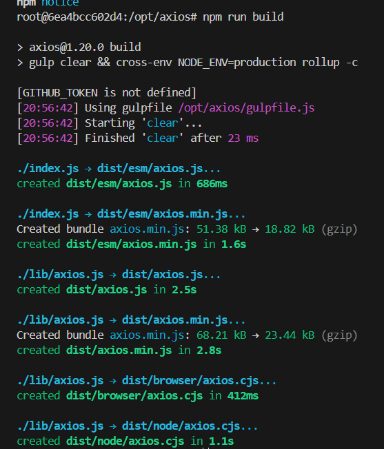

Podczas uruchamiania testów w kontenerze wystąpiła różnica w sposobie rozwiązywania adresu `localhost`. Problem rozwiązano przez wymuszenie preferowania IPv4 przez Node.js:

```bash
NODE_OPTIONS=--dns-result-order=ipv4first npm run test:vitest:unit
```

Po zastosowaniu tego ustawienia wszystkie testy zakończyły się powodzeniem:

```text
Test Files  58 passed (58)
Tests       1062 passed (1062)
```

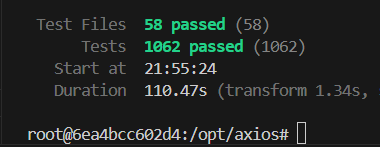

Po opuszczeniu kontenera sprawdzono stan obrazów i kontenerów. Obraz stanowi szablon środowiska, natomiast kontener jest jego konkretną instancją. Po wykonaniu polecenia `exit` główny proces `bash` zakończył działanie, dlatego kontener przeszedł do stanu `Exited (0)`.

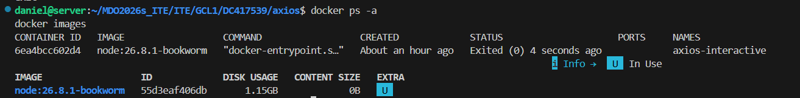

### Automatyzacja procesu – Dockerfile

W katalogu `Lab03` przygotowano dwa osobne pliki Dockerfile.

Pierwszy plik `Dockerfile.build` odpowiada za przygotowanie środowiska, pobranie kodu, instalację zależności i wykonanie builda:

```dockerfile
FROM node:26.8.1-bookworm

WORKDIR /opt

RUN git clone https://github.com/axios/axios.git

WORKDIR /opt/axios

RUN git checkout v1.20.0
RUN npm ci
RUN npm run build
```

Obraz został zbudowany poleceniem:

```bash
docker build -f Dockerfile.build -t axios-build:v1.20.0 .
```

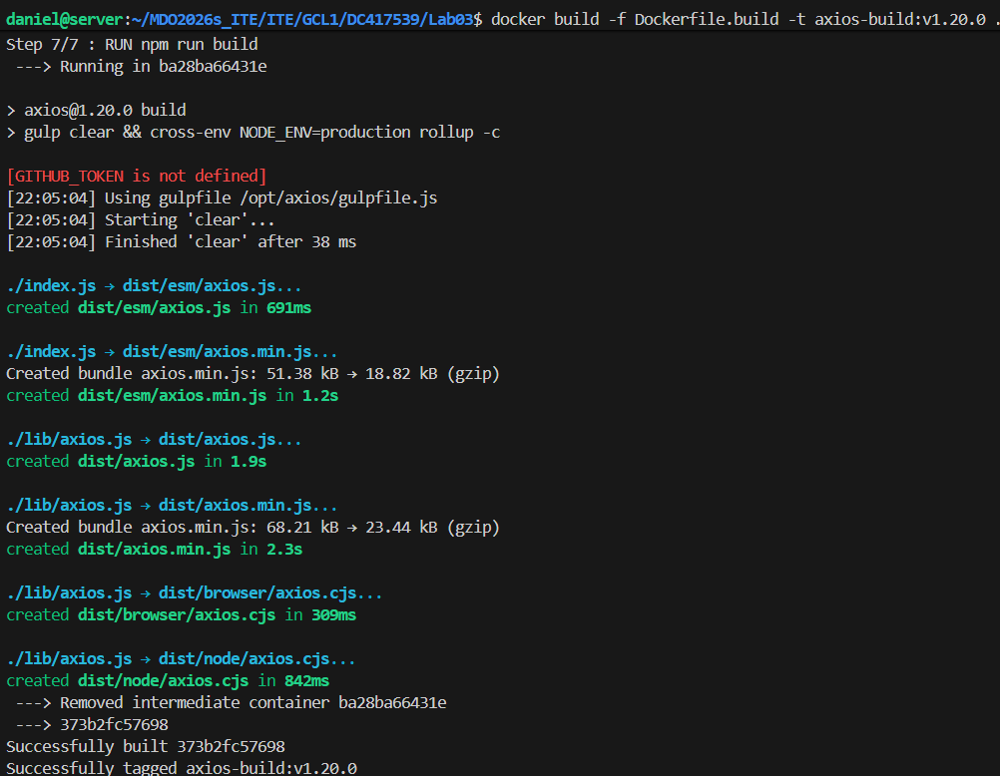

Drugi plik `Dockerfile.test` bazuje na wcześniej przygotowanym obrazie i nie wykonuje ponownego builda:

```dockerfile
FROM axios-build:v1.20.0

ENV NODE_OPTIONS=--dns-result-order=ipv4first

CMD ["npm", "run", "test:vitest:unit"]
```

Obraz testowy został utworzony poleceniem:

```bash
docker build -f Dockerfile.test -t axios-test:v1.20.0 .
```

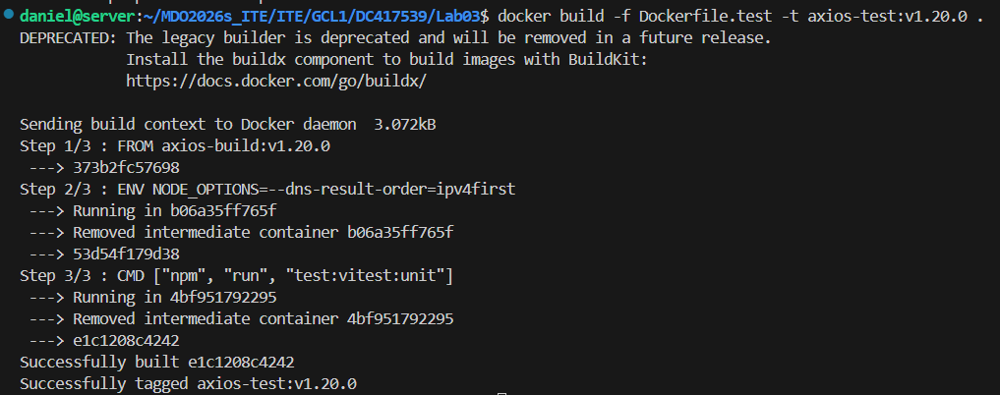

Uruchomienie kontenera utworzonego z obrazu testowego automatycznie wykonało testy:

```bash
docker run --name axios-test-run axios-test:v1.20.0
```

Wszystkie `1062` testy zostały zaliczone.

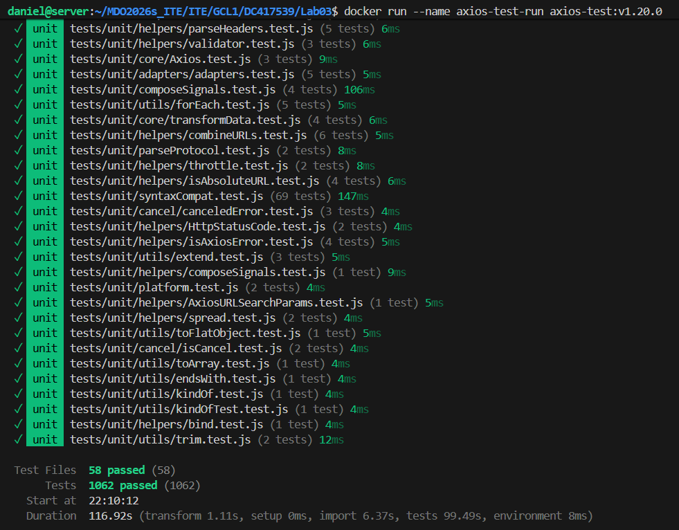

Polecenia:

```bash
docker ps -a
docker images
```

pozwoliły również potwierdzić obecność trzech obrazów oraz zakończonych kontenerów.

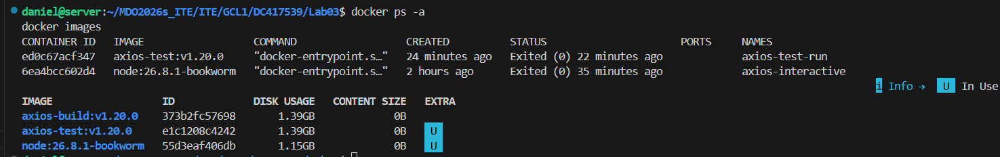

### Docker Compose

Proces budowania został następnie ujęty w kompozycję Docker Compose.

Przygotowano plik `compose.yml`:

```yaml
services:
  build:
    build:
      context: .
      dockerfile: Dockerfile.build
    image: axios-build:v1.20.0

  test:
    build:
      context: .
      dockerfile: Dockerfile.test
    image: axios-test:v1.20.0
```

Poprawność konfiguracji sprawdzono poleceniem:

```bash
docker compose config
```

Pierwszy etap został zbudowany poleceniem:

```bash
docker compose build build
```

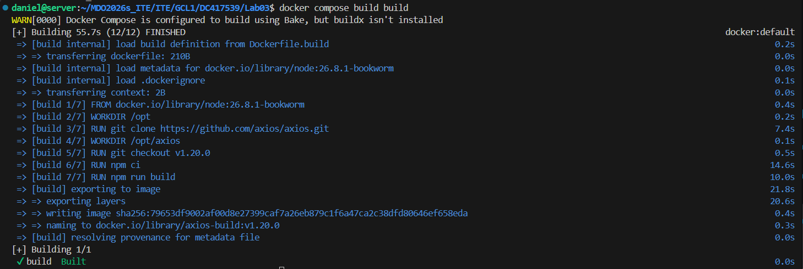

Następnie zbudowano obraz testowy:

```bash
docker compose build test
```

Testy uruchomiono bez ręcznego wdrażania kontenera:

```bash
docker compose run --rm test
```

Wynik końcowy:

```text
Test Files  58 passed (58)
Tests       1062 passed (1062)
```

potwierdził poprawne działanie przygotowanej kompozycji.

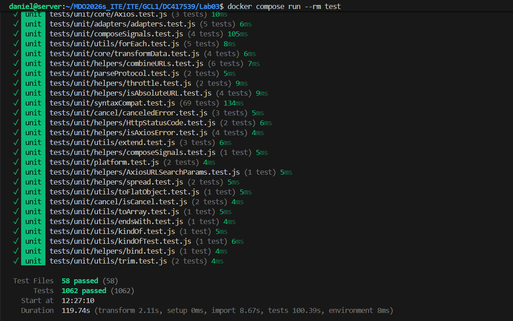


## Zajęcia 04 — Dodatkowa terminologia w konteneryzacji, instancja Jenkins

Celem zajęć było zapoznanie się z mechanizmami przechowywania danych pomiędzy kolejnymi uruchomieniami kontenerów, komunikacją sieciową kontenerów, uruchamianiem usług wewnątrz kontenera oraz przygotowaniem skonteneryzowanej instancji serwera Jenkins współpracującej z pomocniczym kontenerem Docker-in-Docker.

### Zachowywanie stanu między kontenerami

Do realizacji pierwszej części przygotowano dwa nazwane woluminy Docker: `lab04-input` oraz `lab04-output`. Wolumin wejściowy służył do przechowywania kodu źródłowego projektu Axios, natomiast wolumin wyjściowy przeznaczono na artefakty powstałe w wyniku budowania projektu.

Kontener bazowy używany wcześniej do budowania projektu zawierał program Git. Ponieważ w pierwszym wariancie zadania Git nie powinien być dostępny w kontenerze budującym, na bazie obrazu `axios-build:v1.20.0` przygotowano dodatkowy obraz `axios-build-nogit:v1.20.0`, z którego usunięto pakiety `git` oraz `git-man`. Jednocześnie zachowano dostępność Node.js oraz npm.

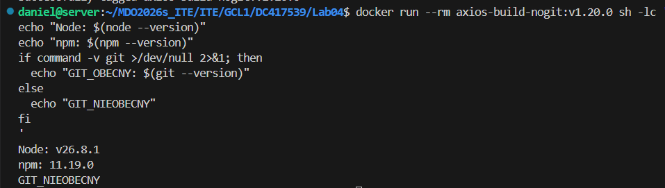

W pierwszym wariancie klonowanie repozytorium zostało wykonane za pomocą kontenera pomocniczego posiadającego Git. Do kontenera podłączono wolumin `lab04-input`, a repozytorium `https://github.com/axios/axios.git` w wersji `v1.20.0` sklonowano bezpośrednio na ten wolumin. Takie rozwiązanie pozwoliło całkowicie oddzielić operację pobrania kodu od właściwego procesu budowania. Kontener wykonujący build nie posiadał programu Git, ale dzięki współdzielonemu woluminowi miał dostęp do wcześniej pobranych źródeł.

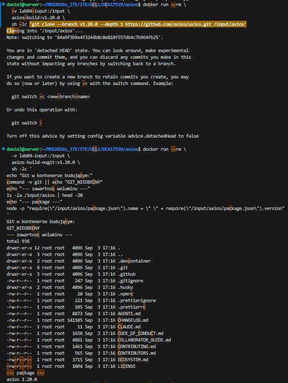

W kontenerze budującym wykonano instalację zależności projektu oraz polecenie `npm run build`. Powstały katalog `dist` został następnie skopiowany na wolumin `lab04-output`. Po zakończeniu kontenera budującego uruchomiono nowy kontener z podłączonym wyłącznie woluminem wyjściowym. Artefakty nadal były dostępne, co potwierdziło trwałość danych zapisanych w nazwanym woluminie niezależnie od cyklu życia kontenera.

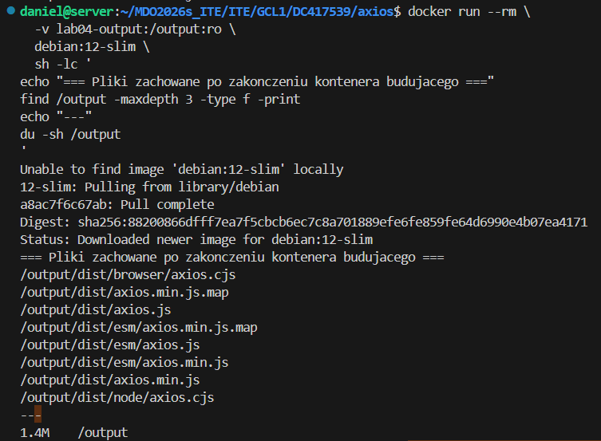

Następnie doświadczenie powtórzono w drugim wariancie. Tym razem wykorzystano kontener posiadający Git, a polecenie `git clone` wykonano bezpośrednio wewnątrz niego. Repozytorium ponownie zapisano na woluminie wejściowym, wykonano build projektu i skopiowano wynik na wolumin wyjściowy. Potwierdzono obecność programu Git w kontenerze, poprawny adres repozytorium i wersję projektu oraz obecność artefaktów na woluminie `lab04-output`.

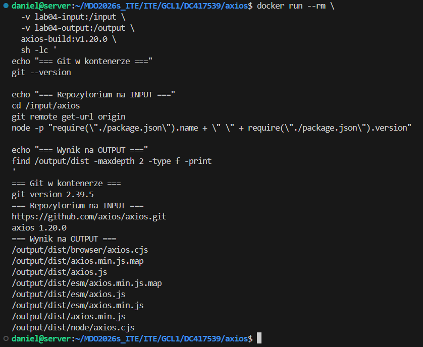

Rozważono również możliwość realizacji podobnego procesu przy pomocy `docker build` oraz instrukcji `RUN --mount`. Mechanizm ten umożliwia tymczasowe zamontowanie danych podczas konkretnego kroku budowania obrazu, np. jako `type=bind`, `type=cache`, `type=secret` lub `type=ssh`. Nie jest on jednak bezpośrednim odpowiednikiem trwałego named volume wykorzystywanego podczas `docker run`. Do przekazywania wyników pomiędzy etapami budowania bardziej naturalne jest wykorzystanie wieloetapowego Dockerfile i instrukcji `COPY --from`.

### Eksponowanie portów i komunikacja między kontenerami

Do testów komunikacji sieciowej przygotowano obraz `lab04-iperf:1.0` zawierający program `iperf3` oraz narzędzia `iproute2`. Pierwszy kontener uruchomiono jako serwer `iperf3`, a drugi jako klient.

Początkowo oba kontenery korzystały z domyślnej sieci Docker `bridge`. Ustalono ich adresy IP i wykonano test połączenia z klienta do serwera po adresie IP. Dla pięciosekundowego testu uzyskano przepustowość około 25,8 Gbit/s.

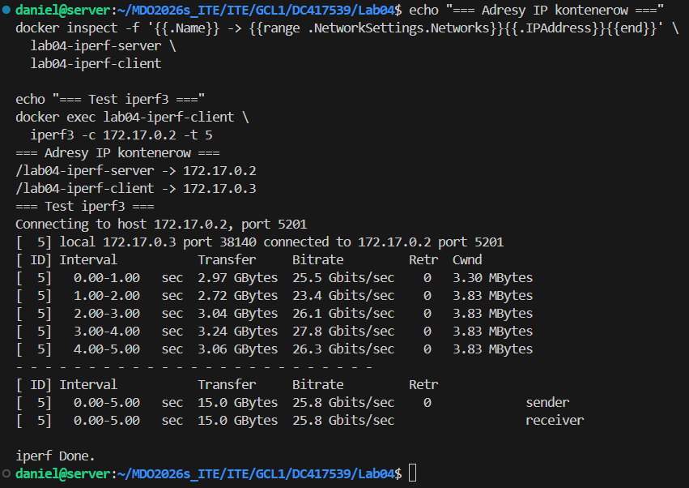

Następnie utworzono własną sieć mostkową `lab04-net` i podłączono do niej oba kontenery. W sieci użytkownika możliwe było wykorzystanie mechanizmu rozwiązywania nazw Dockera. Klient połączył się więc z serwerem za pomocą nazwy `lab04-iperf-server`, bez bezpośredniego podawania jego adresu IP. Pomiar w dedykowanej sieci wykazał przepustowość około 21,0 Gbit/s.

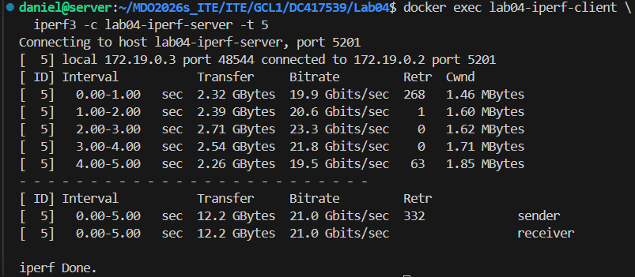

W kolejnym etapie port `5201` serwera `iperf3` został opublikowany na hoście. Z komputera znajdującego się poza maszyną `server` sprawdzono dostępność portu za pomocą PowerShell i `Test-NetConnection`. Uzyskany wynik `TcpTestSucceeded : True` potwierdził możliwość połączenia z usługą spoza hosta.

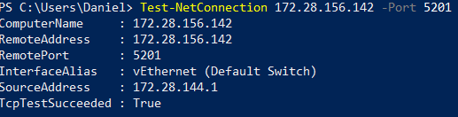

Na hoście `server` zainstalowano również `iperf3` i wykonano właściwy pomiar host–kontener przez opublikowany port `5201`. Osiągnięto przepustowość około 17,7 Gbit/s.

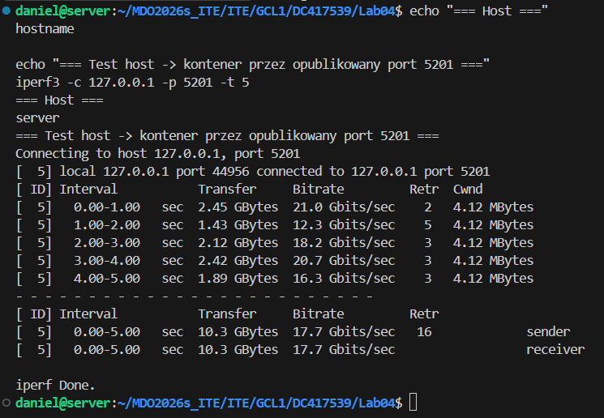

Dodatkowo odczytano logi serwera `iperf3` bezpośrednio z kontenera. Widoczny był zaakceptowany klient oraz wynik ostatniego pomiaru z wartością około 17,7 Gbit/s. Wcześniejsze komunikaty o błędnych danych wynikały z testów samej dostępności portu wykonywanych bez użycia protokołu `iperf3`.

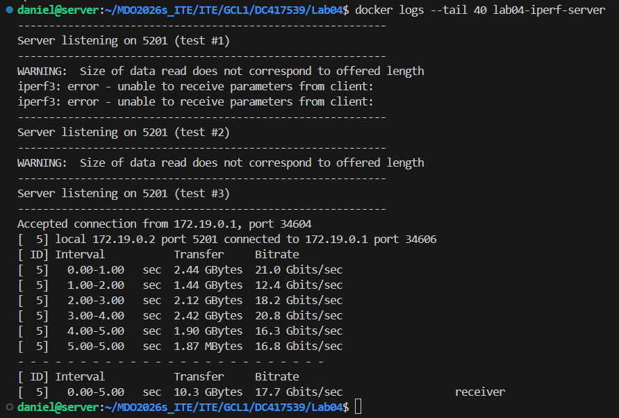

### Usługa SSHD w kontenerze

W kolejnym etapie przygotowano obraz oparty na Ubuntu 24.04 z zainstalowaną usługą `openssh-server`. Utworzono użytkownika testowego `labuser`, włączono możliwość uwierzytelniania hasłem, a proces `/usr/sbin/sshd -D` uruchomiono jako główny proces kontenera. Port `22` kontenera opublikowano na porcie `2222` hosta.

Z hosta wykonano połączenie:

`ssh -p 2222 labuser@127.0.0.1`

Po zalogowaniu polecenia `whoami` i `hostname` potwierdziły, że sesja działa jako użytkownik `labuser` wewnątrz właściwego kontenera.

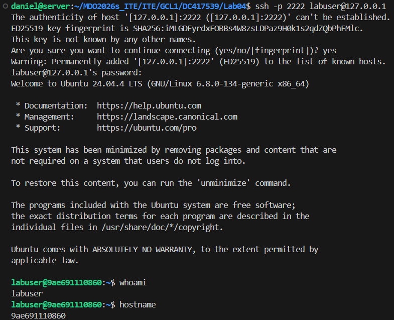

Uruchomienie SSHD w kontenerze może być przydatne w szczególnych przypadkach wymagających zdalnego dostępu administracyjnego i użycia istniejących narzędzi SSH. Podejście to ma jednak również wady: zwiększa rozmiar i złożoność obrazu, wymaga zarządzania użytkownikami, hasłami lub kluczami oraz zwiększa powierzchnię ataku. W typowym środowisku kontenerowym diagnostykę i administrację częściej wykonuje się przez `docker exec`, logi kontenera lub mechanizmy dostarczane przez orkiestrator.

### Skonteneryzowana instancja Jenkins z Docker-in-Docker

Ostatnim etapem było przygotowanie serwera Jenkins w środowisku kontenerowym. Utworzono dedykowaną sieć `jenkins` oraz trwałe woluminy `jenkins-data` i `jenkins-docker-certs`. Nazwy nie zostały powiązane wyłącznie z `Lab04`, ponieważ utworzona instancja Jenkins będzie wykorzystywana również podczas kolejnych zajęć.

Jako pomocnika uruchomiono kontener `jenkins-docker` na obrazie `docker:dind`. Kontener pracuje w trybie uprzywilejowanym, wykorzystuje sterownik `overlay2` oraz udostępnia daemon Dockera w prywatnej sieci `jenkins`.

Dla właściwego Jenkinsa przygotowano własny obraz `myjenkins-blueocean:2.568.3-1` oparty na Jenkins LTS z JDK 21. Do obrazu doinstalowano Docker CLI oraz wymagane wtyczki Jenkinsa. Kontener `jenkins-blueocean` został uruchomiony w tej samej sieci co DIND i skonfigurowany do komunikacji z daemonem poprzez `DOCKER_HOST=tcp://docker:2376`. Port interfejsu WWW Jenkinsa został opublikowany jako `8080`, a port agentów jako `50000`.

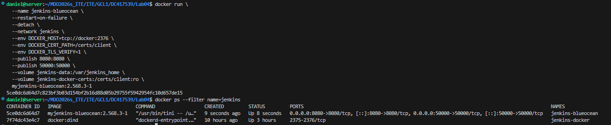

Poprawność połączenia pomiędzy kontenerami zweryfikowano, uruchamiając `docker info` wewnątrz kontenera Jenkins. Polecenie zwróciło zarówno część kliencką, jak i informacje o serwerze Docker działającym wewnątrz `jenkins-docker`, w tym wersję daemona i sterownik `overlay2`. Potwierdziło to, że Jenkins może korzystać z pomocniczego środowiska Docker-in-Docker.

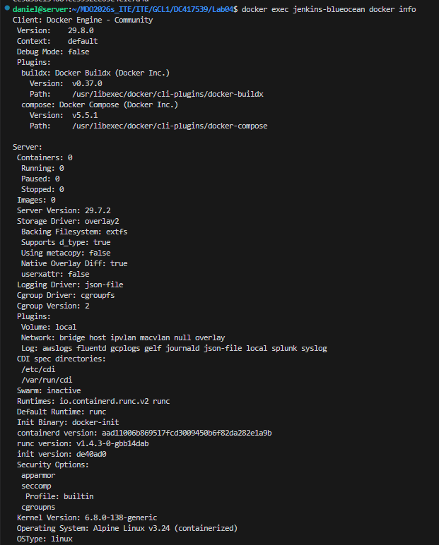

Po pierwszym uruchomieniu Jenkins został odblokowany hasłem inicjalizacyjnym, zainstalowano sugerowane wtyczki, utworzono konto administratora oraz skonfigurowano adres instancji. Po zakończeniu inicjalizacji uzyskano działający panel Jenkins. Po wylogowaniu wyświetlono właściwy ekran logowania pod adresem `http://172.28.157.163:8080/`.

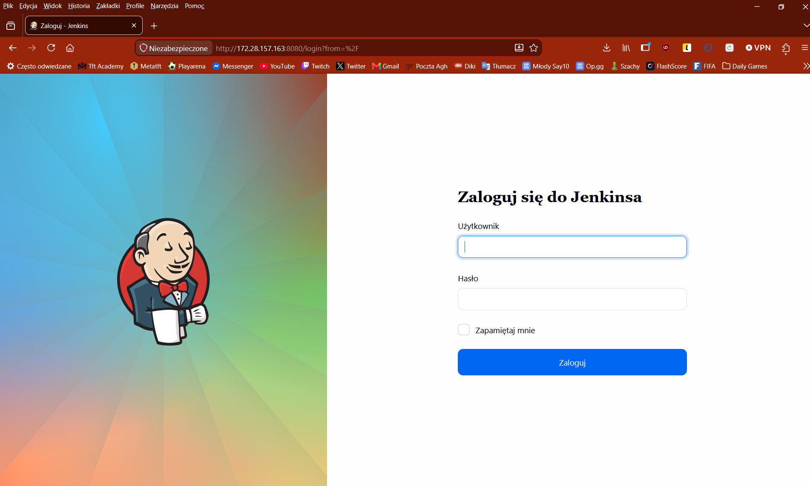

Instancja Jenkins, pomocniczy kontener `jenkins-docker`, sieć `jenkins` oraz woluminy z danymi i certyfikatami pozostawiono w systemie, ponieważ będą wykorzystywane podczas kolejnych zajęć.