# Zajęcia 05 — Jenkins i pipeline

## Cel zajęć

Celem zajęć było przygotowanie środowiska Jenkins z Docker-in-Docker oraz zbudowanie pipeline'u dla projektu Axios. Pipeline został rozdzielony na etapy `Build`, `Test`, `Deploy` i `Publish`.

## Jenkins i zadania wstępne

Na początku sprawdzono działanie kontenerów:

* `jenkins-blueocean`,
* `jenkins-docker`.

Zweryfikowano również wcześniejsze obrazy Buildera i Testera.

Następnie utworzono prosty projekt Jenkins wykonujący polecenie:

```bash
uname
```

Projekt zakończył się sukcesem i zwrócił:

```text
Linux
```

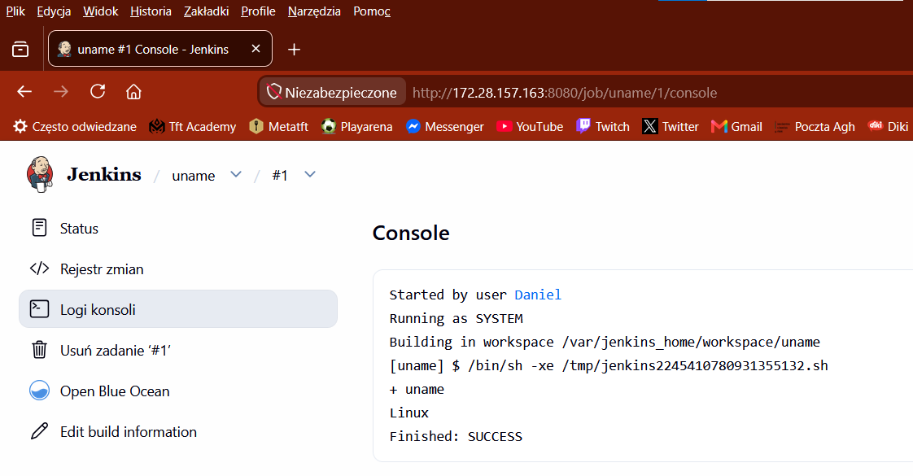

Kolejny projekt miał zwracać błąd, jeśli aktualna godzina była nieparzysta. W czasie testu Jenkins odczytał godzinę `19`, dlatego build zakończył się jako `FAILURE`.

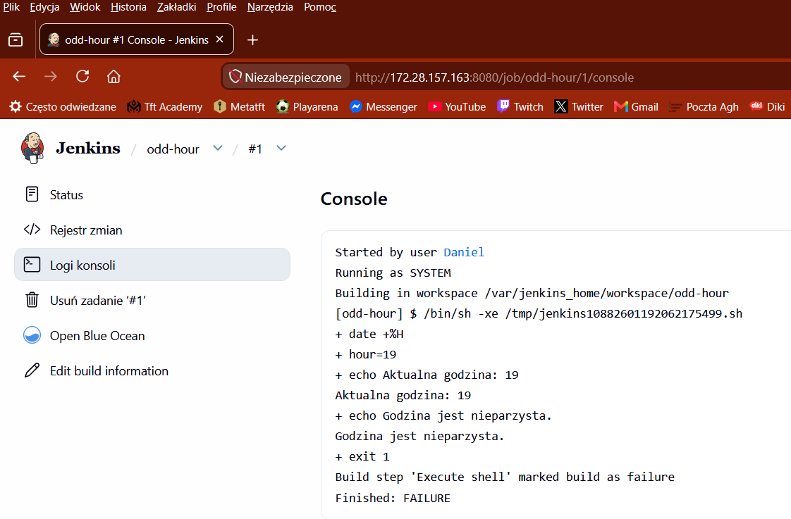

Utworzono również projekt wykonujący:

```bash
docker pull ubuntu
```

Obraz został pobrany poprawnie.

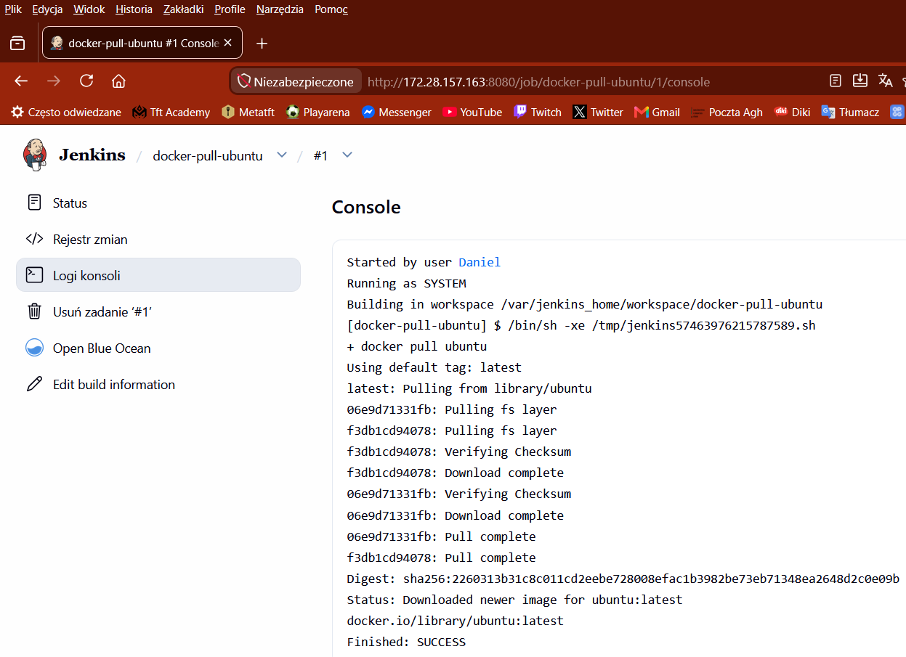

## Pierwszy pipeline

Utworzono nowy obiekt typu `Pipeline`. Na początku jego treść była wpisywana bezpośrednio w konfiguracji Jenkinsa.

Pipeline pobierał repozytorium `MDO2026s_ITE`.

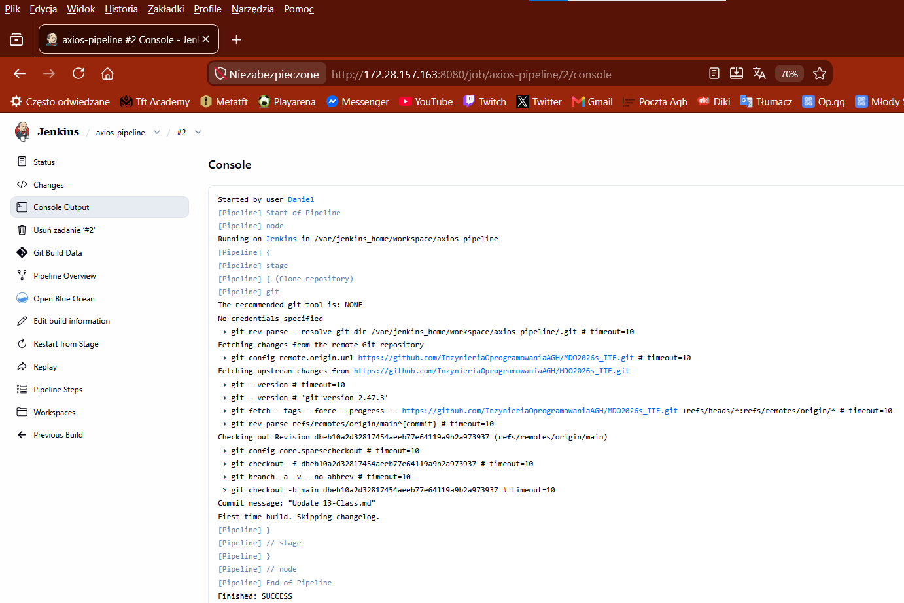

Następnie ustawiono osobistą gałąź:

```text
DC417539
```

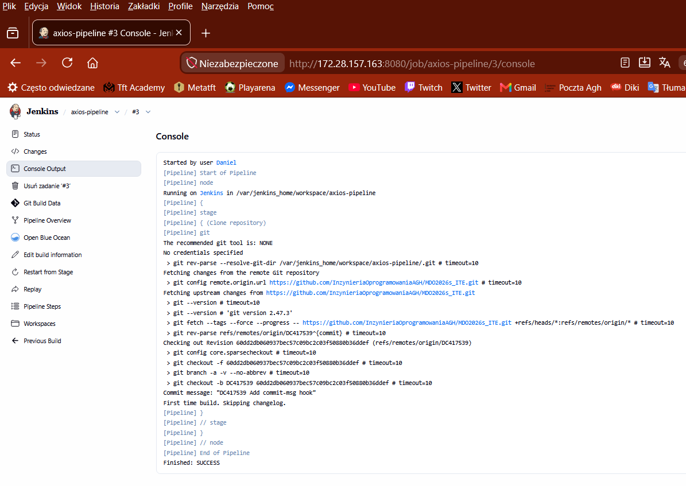

## Build

Etap `Build` korzystał z pliku:

```text
ITE/GCL1/DC417539/Lab03/Dockerfile.build
```

Do budowania wykorzystano obraz:

```text
node:26.8.1-bookworm
```

Pipeline tworzył obraz `axios-build:v1.20.0` oraz dodatkowy tag `axios-build:jenkins`.

Build zakończył się poprawnie.

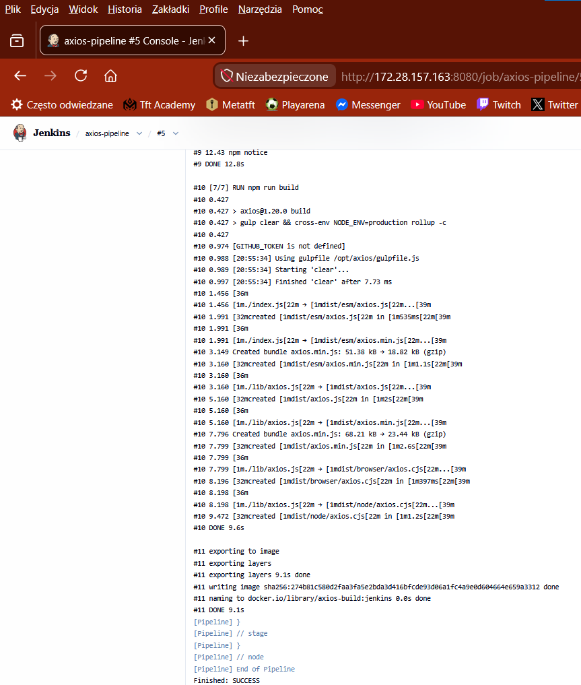

## Test

Etap `Test` korzystał z:

```text
ITE/GCL1/DC417539/Lab03/Dockerfile.test
```

Na jego podstawie tworzony był obraz:

```text
axios-test:jenkins
```

Następnie uruchamiano testy jednostkowe Axiosa.

Końcowy wynik testów:

```text
58 plików testowych zaliczonych
1062 testy zaliczone
Finished: SUCCESS
```

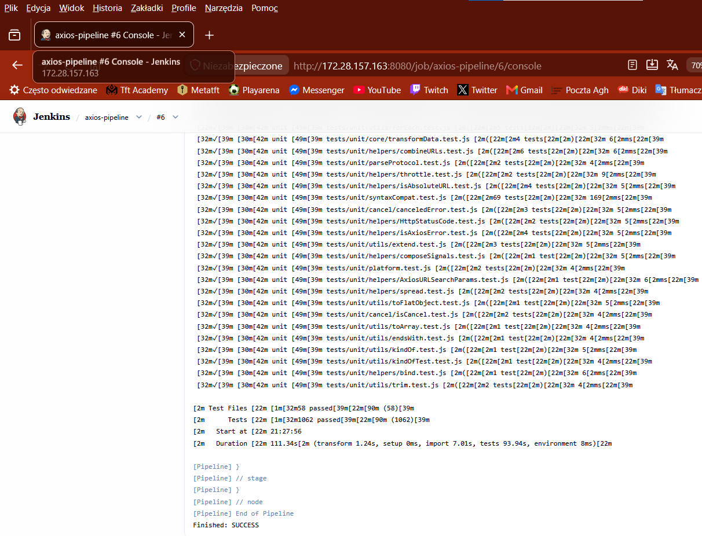

## Izolacja DIND

Porównano obrazy widoczne przez Jenkinsa z obrazami znajdującymi się bezpośrednio na hoście.

Identyfikatory obrazów były różne, co potwierdziło, że Jenkins korzysta z osobnego demona Docker działającego w kontenerze `jenkins-docker`.

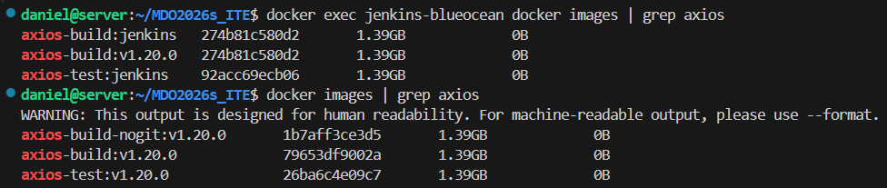

## Publish

Dla projektu Axios jako artefakt wybrano pakiet npm tworzony przez:

```bash
npm pack
```

Powstał plik:

```text
axios-1.20.0.tgz
```

Plik został zapisany w Jenkinsie jako artefakt buildu przy użyciu `archiveArtifacts`.

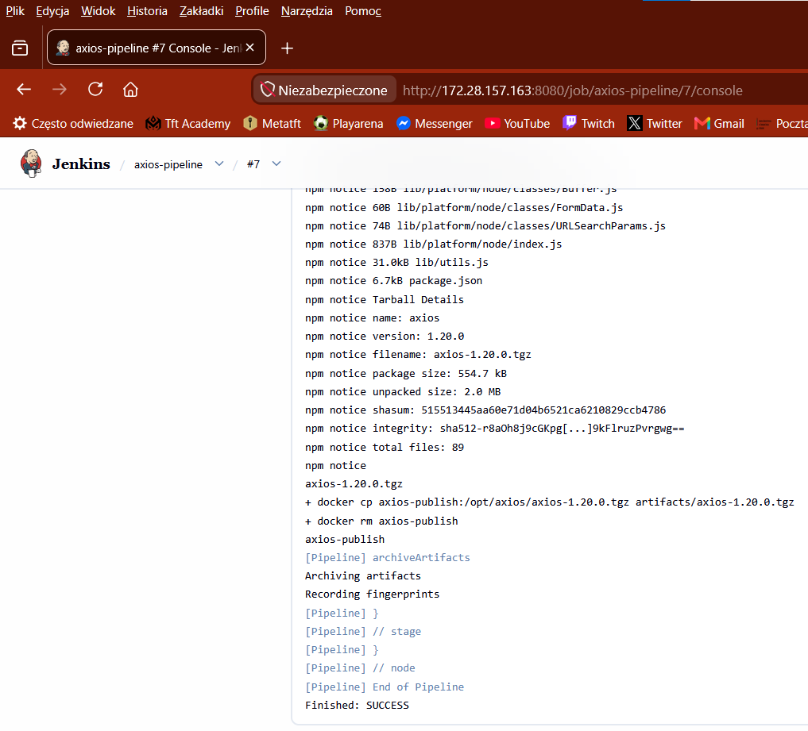

Artefakt można było następnie pobrać z wyników buildu.

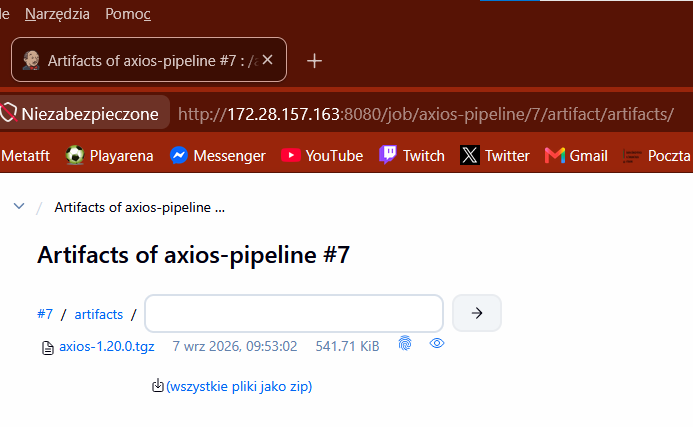

## Deploy

Axios jest biblioteką, dlatego etap `Deploy` został wykonany jako sprawdzenie, czy przygotowany pakiet `.tgz` można zainstalować w czystym środowisku runtime.

Utworzono obraz bazujący na:

```text
node:26.8.1-bookworm-slim
```

Do obrazu kopiowany był tylko pakiet `axios-1.20.0.tgz`, a następnie instalowano go przy użyciu `npm`.

Po uruchomieniu kontenera uzyskano:

```text
Axios version: 1.20.0
```

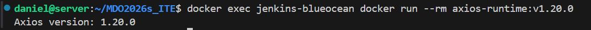

## Pełny pipeline

Pipeline został ostatecznie uporządkowany do kolejności:

```text
Build -> Test -> Deploy -> Publish
```

Całość zakończyła się statusem `SUCCESS`.

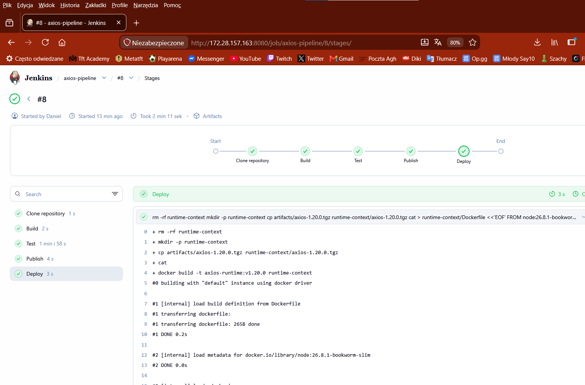

Finalna kolejność etapów była widoczna również w widoku Pipeline Overview.

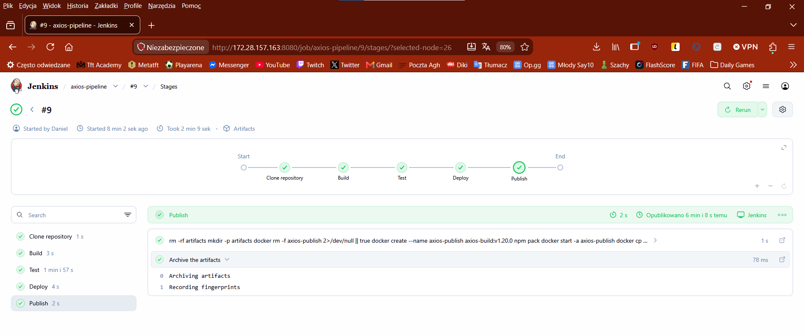

## Jenkinsfile z SCM

Definicja pipeline'u została przeniesiona do pliku:

```text
ITE/GCL1/DC417539/Lab05/Jenkinsfile
```

Następnie Jenkins został skonfigurowany jako:

```text
Pipeline script from SCM
```

z gałęzi:

```text
DC417539
```

Po tej zmianie Jenkins automatycznie pobierał `Jenkinsfile` z repozytorium.

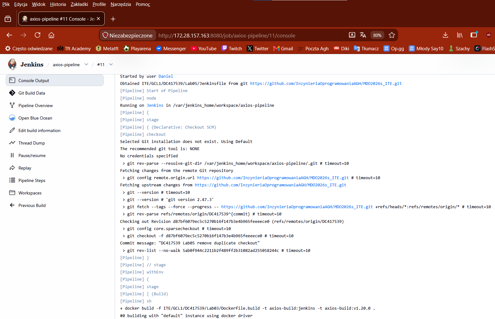

## Logi

Dane Jenkinsa są przechowywane w wolumenie `jenkins-data`, dzięki czemu historia buildów nie znajduje się tylko wewnątrz warstwy kontenera.

Dodatkowo wykonano osobną kopię logów pipeline'u do pliku:

```text
/home/daniel/jenkins-backups/axios-pipeline-logs.tar.gz
```

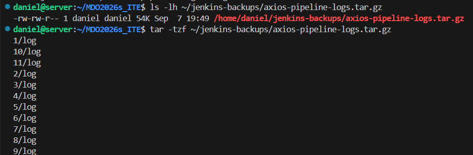

## Jenkins i Blue Ocean

Jenkins odpowiada za wykonywanie zadań CI/CD i obsługę pipeline'ów.

Blue Ocean jest dodatkowym interfejsem Jenkinsa, który ułatwia przeglądanie i wizualizację kolejnych etapów pipeline'u.

## Diagramy

Przygotowano diagram aktywności procesu CI:

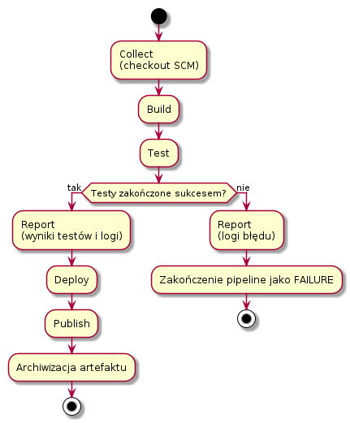

oraz diagram wdrożeniowy:

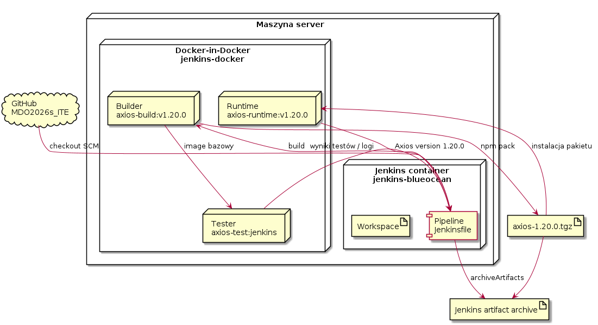

Diagram aktywności przedstawia przebieg:

```text
Collect -> Build -> Test -> Report -> Deploy -> Publish
```

Diagram wdrożeniowy pokazuje relacje pomiędzy maszyną `server`, Jenkins, DIND, Builderem, Testerem, obrazem runtime oraz artefaktem `axios-1.20.0.tgz`.

## Podsumowanie

Podczas zajęć przygotowano działające środowisko Jenkins z Docker-in-Docker oraz pipeline dla projektu Axios.

Pipeline realizuje etapy:

```text
Build -> Test -> Deploy -> Publish
```

Tester działa w osobnym kontenerze, a obraz runtime korzysta z lżejszego `node:26.8.1-bookworm-slim`.

Końcowym artefaktem jest pakiet:

```text
axios-1.20.0.tgz
```

który jest archiwizowany w Jenkinsie i może zostać pobrany z wyników buildu.


# Zajęcia 06 — Pipeline CI/CD i lista kontrolna

## Cel zajęć

Celem zajęć było uporządkowanie dotychczas przygotowanego procesu CI/CD dla projektu Axios oraz jego weryfikacja względem wymaganej ścieżki krytycznej i pełnej listy kontrolnej.

Przyjęta ścieżka procesu obejmuje:

```text
Trigger -> Clone -> Build -> Test -> Deploy -> Smoke test -> Publish
```

Dotychczasowy pipeline został rozszerzony o numerowane logi, informacje pozwalające zidentyfikować pochodzenie artefaktu oraz osobny plik Dockerfile dla środowiska runtime.

## Plan pipeline'u

Przygotowano diagram UML przedstawiający planowany proces CI/CD.

Źródło diagramu zapisano w:

```text
ITE/GCL1/DC417539/Lab06/pipeline.puml
```

oraz wygenerowano jego wersję graficzną:

```text
ITE/GCL1/DC417539/Lab06/pipeline.png
```

Diagram przedstawia kolejno uruchomienie procesu, pobranie kodu, budowanie, testowanie, wdrożenie, smoke test oraz publikację artefaktów.


## Kontenery Build i Test

Do budowania nadal wykorzystywany jest obraz:

```text
axios-build:v1.20.0
```

oparty o:

```text
node:26.8.1-bookworm
```

Kontener testowy korzysta bezpośrednio z obrazu Buildera:

```dockerfile
FROM axios-build:v1.20.0
```

W kontenerze uruchamiane są testy jednostkowe projektu Axios:

```text
npm run test:vitest:unit
```

Podczas weryfikacji uzyskano wynik:

```text
Test Files  58 passed (58)
Tests       1062 passed (1062)
```

Potwierdza to, że testowana jest biblioteka Axios, a nie narzędzie pomocnicze `curl`.

## Decyzja dotycząca forka

Nie utworzono własnego forka repozytorium Axios.

Pipeline korzysta z oficjalnego repozytorium projektu oraz konkretnej wersji:

```text
v1.20.0
```

W ramach zadania nie są modyfikowane źródła biblioteki Axios. Przygotowywane zmiany dotyczą procesu CI/CD, konteneryzacji, testowania, wdrażania oraz publikowania artefaktów, dlatego utrzymywanie osobnego forka nie jest wymagane.

## Kontener Deploy / Runtime


Obraz Buildera nie został wykorzystany jako końcowy obraz deploy.

Zawiera on pełne repozytorium, zależności oraz narzędzia potrzebne podczas budowania i testowania, które nie są wymagane w środowisku wykonawczym.

Przygotowano osobny plik:

```text
ITE/GCL1/DC417539/Lab06/Dockerfile.runtime
```

wykorzystujący obraz:

```text
node:26.8.1-bookworm-slim
```

Na jego podstawie powstaje wersjonowany obraz:

```text
axios-runtime:v1.20.0
```

Do obrazu runtime kopiowany jest gotowy pakiet:

```text
axios-1.20.0.tgz
```

a następnie instalowany przy użyciu `npm`.

Takie rozwiązanie rozdziela środowisko budowania od środowiska uruchomieniowego i pozwala sprawdzić, czy przygotowany artefakt może zostać wykorzystany niezależnie od obrazu Buildera.


## Uzasadnienie formy Deploy

Axios jest biblioteką npm, a nie samodzielną aplikacją serwerową. Z tego powodu etap Deploy nie polega na uruchomieniu usługi dostępnej na konkretnym porcie. Zamiast tego przygotowany pakiet axios-1.20.0.tgz jest instalowany w osobnym, czystym środowisku runtime.

Takie rozwiązanie pozwala sprawdzić, czy artefakt przygotowany w etapie Build może zostać poprawnie wykorzystany poza środowiskiem Buildera. Uruchomienie obrazu i odczyt wersji Axios pełni rolę prostego smoke testu wdrożenia.


## Lokalna weryfikacja Deploy

Przed uruchomieniem zmodyfikowanego pipeline'u w Jenkinsie przeprowadzono lokalną weryfikację obrazu runtime.

Zbudowano obraz:

```bash
docker build \
  -f Dockerfile.runtime \
  -t axios-runtime:v1.20.0 \
  runtime-context
```

Następnie wykonano smoke test:

```bash
docker run --rm axios-runtime:v1.20.0
```

Uzyskano:

```text
Axios version: 1.20.0
```

Potwierdziło to poprawność instalacji oraz możliwość uruchomienia przygotowanego pakietu w osobnym środowisku runtime.

## Rozszerzenie Jenkinsfile

Przygotowano nową wersję pliku:

```text
ITE/GCL1/DC417539/Lab06/Jenkinsfile
```

Pipeline składa się z etapów:

```text
Build -> Test -> Deploy -> Publish
```

Czynności `Clone` i `Smoke test` nie zostały wydzielone jako osobne etapy Jenkins.

Checkout repozytorium jest wykonywany automatycznie przed rozpoczęciem etapów pipeline'u, natomiast smoke test jest wykonywany wewnątrz etapu `Deploy` poprzez uruchomienie:

```bash
docker run --rm axios-runtime:v1.20.0
```

Zmodyfikowany pipeline został uruchomiony jako build numer 12 i zakończył się statusem `SUCCESS`.

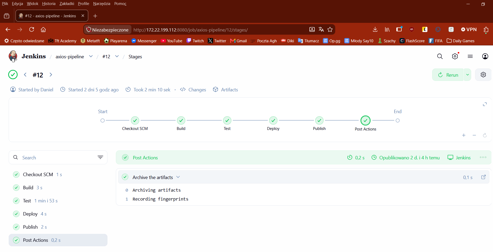

## Publikacja artefaktów

Po zakończeniu buildu Jenkins udostępnił artefakty utworzone podczas procesu.

W katalogu artefaktów znalazły się:

```text
axios-1.20.0.tgz
build-info-12.txt
```

Pakiet `axios-1.20.0.tgz` jest końcowym artefaktem przeznaczonym do dalszej dystrybucji projektu.

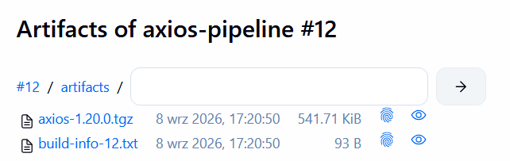

## Uzasadnienie formy Publish

Końcowym artefaktem wybrano pakiet axios-1.20.0.tgz, ponieważ Axios jest biblioteką przeznaczoną do instalowania jako zależność npm. Taki format odpowiada sposobowi, w jaki biblioteka może być później przekazana i wykorzystana przez użytkownika lub inne środowisko.

Obraz axios-runtime służy jedynie do sprawdzenia poprawności wdrożenia, dlatego nie jest traktowany jako główny artefakt publikacji. Właściwym wynikiem pipeline'u jest paczka npm archiwizowana przez Jenkins.

## Numerowane logi

Pipeline został rozszerzony o zapisywanie logów do pliku powiązanego z numerem konkretnego buildu Jenkins.

Nazwa pliku ma postać:

```text
build-${BUILD_NUMBER}.log
```

Dla zweryfikowanego buildu numer 12 utworzony został:

```text
build-12.log
```

Log został zarchiwizowany przez Jenkins jako artefakt konkretnego wykonania pipeline'u.

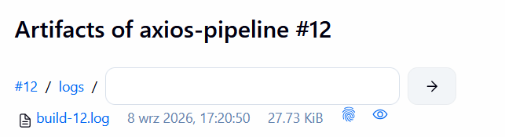

## Wersjonowanie i pochodzenie artefaktu

Końcowym artefaktem pozostaje pakiet npm:

```text
axios-1.20.0.tgz
```

Numer `1.20.0` odpowiada wersji projektu Axios.

Dodatkowo pipeline tworzy plik:

```text
build-info-${BUILD_NUMBER}.txt
```

Dla buildu numer 12 powstał:

```text
build-info-12.txt
```

o zawartości:

```text
Axios version: 1.20.0
Jenkins build: 12
Git commit: 8288442df4a23a673952118d69a31d5f8a2cdca3
```

Pozwala to powiązać opublikowany artefakt z wersją projektu Axios, konkretnym wykonaniem pipeline'u oraz commitem Git.

Dodatkowo artefakty zostały zapisane w Jenkinsie z włączoną opcją `fingerprint`, umożliwiającą ich dodatkową identyfikację.

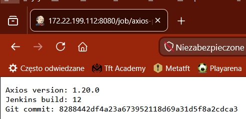

## Smoke test w Jenkinsie

W etapie `Deploy` pipeline uruchomił przygotowany obraz:

```text
axios-runtime:v1.20.0
```

W ramach smoke testu otrzymano:

```text
Axios version: 1.20.0
```

Poprawne wykonanie etapu `Deploy` oraz całego buildu numer 12 potwierdza działanie przygotowanego obrazu runtime.


## Porównanie UML z implementacją

Końcowa implementacja odpowiada planowi przedstawionemu na diagramie UML.

Główne etapy Jenkinsfile to:

```text
Build -> Test -> Deploy -> Publish
```

Na diagramie dodatkowo przedstawiono `Trigger`, `Clone` oraz `Smoke test`.

Nie stanowią one jednak osobnych etapów Jenkins:

* `Trigger` odpowiada uruchomieniu pipeline'u ręcznie lub poprzez zmianę w repozytorium,
* `Clone` jest realizowany przez checkout SCM oraz pobranie źródeł projektu,
* `Smoke test` wykonywany jest w końcowej części etapu `Deploy`.

Rozbieżność dotyczy więc jedynie sposobu grupowania czynności, a nie funkcjonalności procesu.

## Podsumowanie

Podczas zajęć zweryfikowano dotychczasowy pipeline względem ścieżki krytycznej procesu CI/CD oraz rozszerzono go o elementy wymagane przez pełną listę kontrolną.

Potwierdzono poprawne wykonanie etapów:

```text
Build       -> poprawny
Test        -> 1062/1062 testów
Deploy      -> axios-runtime:v1.20.0
Smoke test  -> Axios version: 1.20.0
Publish     -> axios-1.20.0.tgz
```

Dodatkowo Jenkins archiwizuje numerowany log:

```text
build-12.log
```

oraz informacje o pochodzeniu artefaktu:

```text
build-info-12.txt
```

Build numer 12 zakończył się statusem `SUCCESS`, a końcowy artefakt został powiązany z numerem buildu, commitem Git oraz fingerprintem Jenkins.

# Zajęcia 07 — Jenkinsfile i lista kontrolna pipeline'u

## Cel zajęć

Celem zajęć była końcowa weryfikacja przygotowanego pipeline'u Jenkins na podstawie listy kontrolnej Jenkinsfile.

Sprawdzono przede wszystkim, czy pipeline:

- korzysta z Jenkinsfile przechowywanego w repozytorium,
- pracuje na aktualnej wersji kodu,
- poprawnie realizuje etapy Build, Test, Deploy i Publish,
- może zostać uruchomiony wielokrotnie,
- pozostawia po wykonaniu możliwy do wykorzystania artefakt.

## Jenkinsfile pobierany z SCM

Na początku zweryfikowano, czy Jenkins korzysta z definicji pipeline'u znajdującej się w repozytorium.

Plik wykorzystywany przez Jenkins znajduje się w:

```text
ITE/GCL1/DC417539/Lab06/Jenkinsfile
```

Konfiguracja zadania `axios-pipeline` wykorzystuje:

```text
Pipeline script from SCM
```

oraz gałąź:

```text
DC417539
```

Ścieżka ustawiona w konfiguracji Jenkinsa to:

```text
ITE/GCL1/DC417539/Lab06/Jenkinsfile
```

Potwierdzono również, że Jenkinsfile znajduje się na zdalnej gałęzi `DC417539`.

Dzięki temu definicja procesu CI/CD nie jest przechowywana wyłącznie w konfiguracji Jenkinsa, ale stanowi część repozytorium projektu.

## Czyszczenie workspace i świeży checkout

W ramach listy kontrolnej zwrócono uwagę na konieczność zapewnienia, że kolejne uruchomienia pipeline'u nie korzystają ze starych plików pozostawionych w Jenkins workspace.

Do Jenkinsfile dodano:

```groovy
options {
    skipDefaultCheckout()
}
```

Wyłączono w ten sposób domyślny checkout wykonywany automatycznie przez Jenkins.

Następnie dodano osobny etap:

```groovy
stage('Checkout') {
    steps {
        deleteDir()
        checkout scm
    }
}
```

Polecenie:

```text
deleteDir()
```

usuwa poprzednią zawartość workspace, natomiast:

```text
checkout scm
```

pobiera aktualną wersję kodu zgodnie z konfiguracją SCM.

Po zmianie pipeline posiada kolejność:

```text
Checkout -> Build -> Test -> Deploy -> Publish
```

Zmiana została zapisana w commicie:

```text
0bf25a6
```

o opisie:

```text
DC417539 update Jenkins pipeline checkout
```

## Weryfikacja nowego etapu Checkout

Po wysłaniu zmodyfikowanego Jenkinsfile do repozytorium uruchomiono pipeline jako build numer 13.

Build zakończył się statusem:

```text
SUCCESS
```

W logu Jenkinsa widoczny był nowy etap:

```text
[Pipeline] { (Checkout)
```

oraz checkout konkretnej rewizji:

```text
Checking out Revision 0bf25a633663808f681f1165f3909068d740884a
(refs/remotes/origin/DC417539)
```

Potwierdziło to, że Jenkins pobrał wersję kodu zawierającą zmodyfikowany Jenkinsfile.

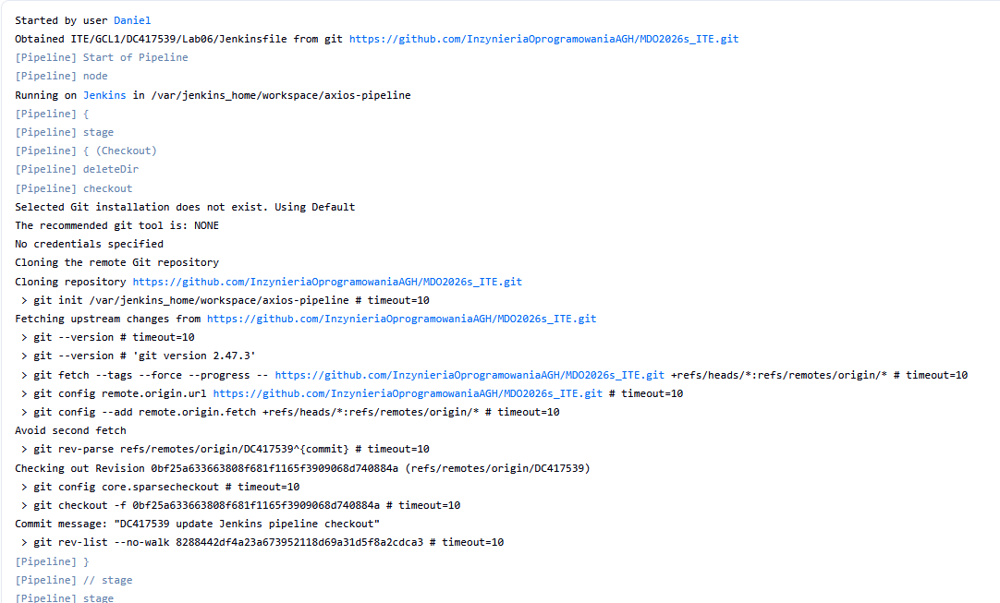

## Ponowne uruchomienie pipeline'u

Jednym z wymagań listy kontrolnej było sprawdzenie, czy pipeline może zostać wykonany więcej niż jeden raz.

Po poprawnym zakończeniu buildu 13 uruchomiono pipeline ponownie.

Powstał build numer:

```text
14
```

który również zakończył się statusem:

```text
SUCCESS
```

Oznacza to, że proces jest powtarzalny, a czyszczenie workspace i ponowne pobranie kodu nie powodują problemów podczas kolejnych uruchomień.

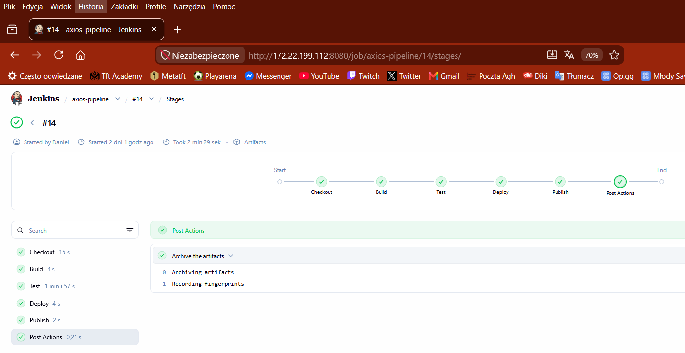

## Weryfikacja etapów Jenkinsfile

Po zmianach pipeline realizuje następujące etapy:

```text
Checkout -> Build -> Test -> Deploy -> Publish
```

Etap `Checkout` czyści workspace i pobiera aktualny kod z repozytorium.

Etap `Build` wykorzystuje:

```text
ITE/GCL1/DC417539/Lab03/Dockerfile.build
```

i tworzy obrazy:

```text
axios-build:jenkins
axios-build:v1.20.0
```

Etap `Test` korzysta z:

```text
ITE/GCL1/DC417539/Lab03/Dockerfile.test
```

i uruchamia testy jednostkowe projektu Axios.

Etap `Deploy` przygotowuje pakiet:

```text
axios-1.20.0.tgz
```

oraz buduje końcowy obraz:

```text
axios-runtime:v1.20.0
```

Następnie obraz runtime jest uruchamiany w ramach smoke testu.

Etap `Publish` archiwizuje końcowy artefakt oraz dodatkowe informacje dotyczące konkretnego buildu.

## Definition of done

Sprawdzono również, czy wynik pipeline'u może zostać wykorzystany bez dodatkowej modyfikacji.

Końcowy obraz runtime wykorzystuje:

```text
node:26.8.1-bookworm-slim
```

Do obrazu kopiowany jest gotowy pakiet:

```text
axios-1.20.0.tgz
```

który następnie jest instalowany przy użyciu `npm`.

Plik `Dockerfile.runtime` posiada polecenie:

```dockerfile
CMD ["node", "-e", "const axios = require('axios'); console.log('Axios version:', axios.VERSION);"]
```

Dzięki temu obraz:

```text
axios-runtime:v1.20.0
```

może zostać uruchomiony bez ręcznego modyfikowania jego zawartości.

Poprawne działanie potwierdza wynik:

```text
Axios version: 1.20.0
```

Oznacza to, że przygotowany obraz spełnia założenie deployable artifact.

## Artefakty buildu 14

Zweryfikowano zawartość archiwum Jenkinsa dla buildu numer 14.

W historii buildu znajdują się:

```text
artifacts/axios-1.20.0.tgz
artifacts/build-info-14.txt
logs/build-14.log
```

Pakiet:

```text
axios-1.20.0.tgz
```

jest końcowym artefaktem npm przygotowanym podczas pipeline'u.

Plik:

```text
build-info-14.txt
```

zawiera informacje pozwalające powiązać artefakt z konkretnym wykonaniem procesu.

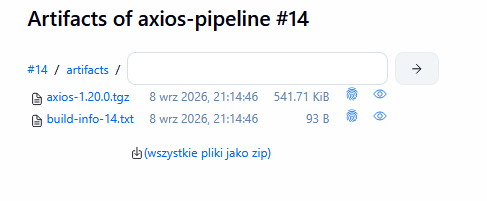

## Log buildu 14

Pipeline archiwizuje również osobny log dla każdego wykonania.

Dla buildu numer 14 utworzony został:

```text
build-14.log
```

Log jest przechowywany razem z historią konkretnego buildu Jenkinsa, dzięki czemu możliwe jest późniejsze sprawdzenie przebiegu całego procesu.

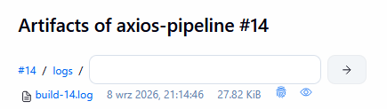

## Podsumowanie

Podczas zajęć zakończono weryfikację przygotowanego Jenkinsfile względem listy kontrolnej.

Pipeline posiada obecnie strukturę:

```text
Checkout -> Build -> Test -> Deploy -> Publish
```

Przed rozpoczęciem właściwych etapów workspace jest czyszczony przy użyciu:

```text
deleteDir()
```

a następnie aktualna wersja repozytorium jest pobierana przez:

```text
checkout scm
```

Pipeline został wykonany jako build numer 13 oraz ponownie jako build numer 14.

Oba wykonania zakończyły się statusem:

```text
SUCCESS
```

co potwierdziło jego powtarzalność.

Dla buildu numer 14 Jenkins zachował:

```text
axios-1.20.0.tgz
build-info-14.txt
build-14.log
```

Potwierdzono również, że końcowy obraz:

```text
axios-runtime:v1.20.0
```

może zostać uruchomiony bez dodatkowych modyfikacji i poprawnie wykorzystuje przygotowany pakiet Axios.

Tym samym lista kontrolna Jenkinsfile została zweryfikowana, a pipeline spełnia wymagania dotyczące budowania, testowania, wdrażania, publikacji oraz powtarzalności procesu.
