## Zajęcia 08 – Automatyzacja i zdalne wykonywanie poleceń za pomocą Ansible

Podczas zajęć przygotowano środowisko do zdalnego zarządzania maszynami za pomocą Ansible. Wykorzystano maszynę główną `server` oraz maszynę docelową `ansible-target`. Na maszynie głównej działał Ansible, natomiast na maszynie docelowej skonfigurowano użytkownika `ansible`, serwer SSH oraz wymagane narzędzia. Logowanie SSH odbywało się bez podawania hasła.

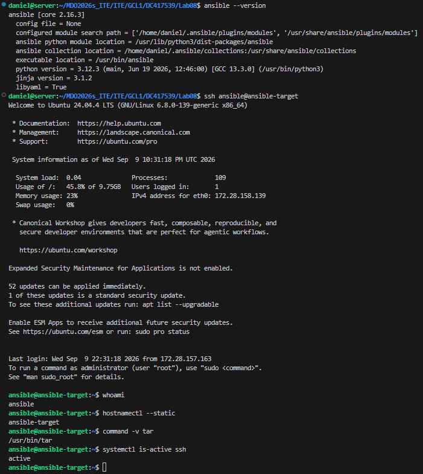

Utworzono plik `inventory.ini` zawierający grupy `Orchestrators` oraz `Endpoints`. Poprawność konfiguracji sprawdzono za pomocą `ansible-inventory`, a następnie wykonano test `ping` do obu maszyn.

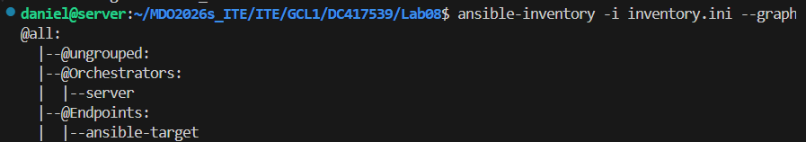

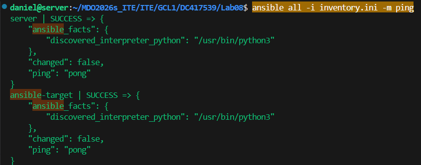

Następnie przygotowano playbook realizujący test łączności oraz kopiowanie pliku inventory na maszynę docelową. Pierwsze wykonanie kopiowania zwróciło `changed=1`, natomiast ponowne uruchomienie tego samego playbooka zakończyło się wynikiem `changed=0`, co potwierdziło idempotentne działanie Ansible.

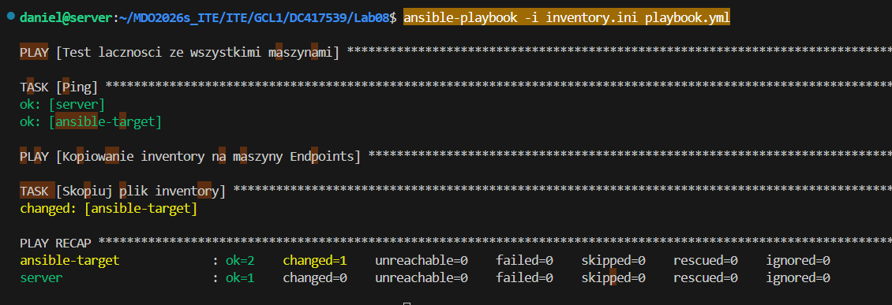

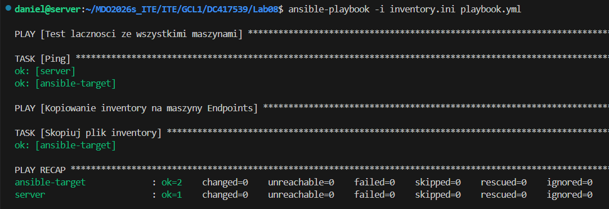

Za pomocą Ansible wykonano również aktualizację pakietów systemowych oraz zainstalowano `rng-tools5`. Następnie zrestartowano usługi `ssh` oraz `rngd`.

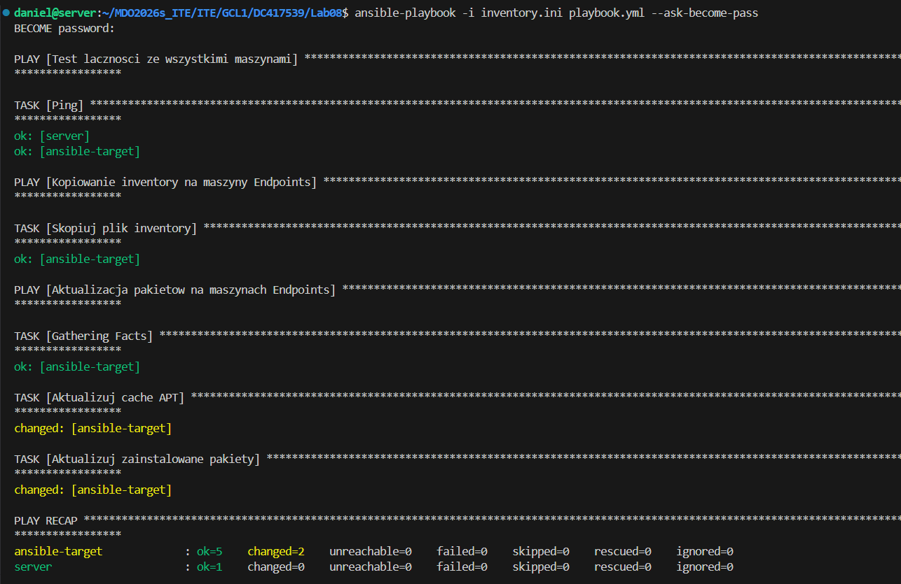

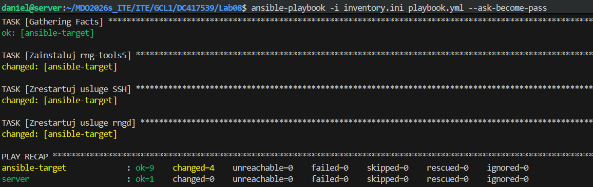

Sprawdzono także zachowanie Ansible w sytuacjach awaryjnych. Po wyłączeniu usługi SSH maszyna została oznaczona jako `UNREACHABLE` z komunikatem `Connection refused`. Po odłączeniu karty sieciowej od przełącznika Hyper-V otrzymano `Connection timed out`.

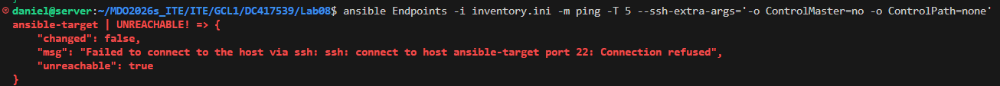

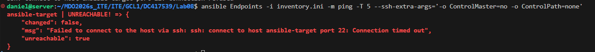

W dalszej części zajęć wykorzystano artefakt `axios-1.20.0.tgz` utworzony podczas wcześniejszego pipeline'u Jenkins. Plik został pobrany z archiwum Jenkinsa i wysłany za pomocą Ansible na maszynę `ansible-target`. Poprawność transferu potwierdzono porównaniem sum SHA-256.

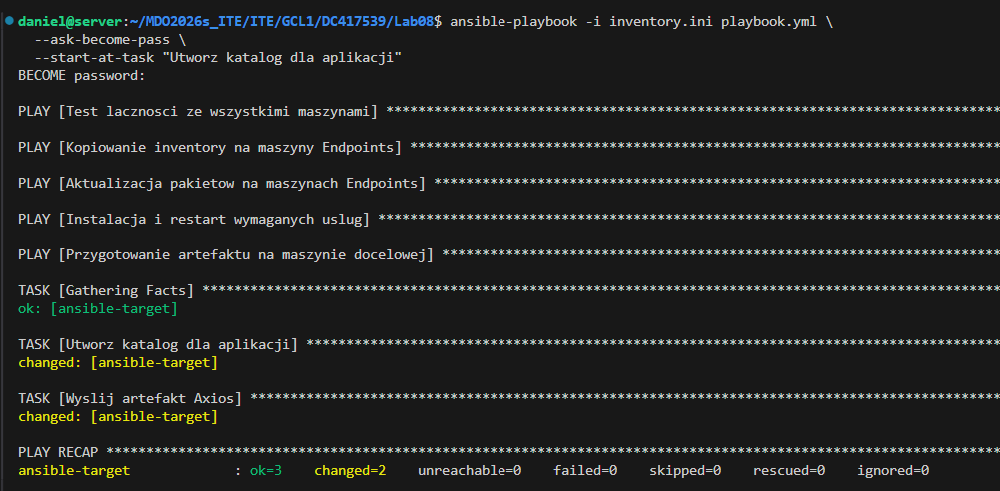

Docker nie był wcześniej zainstalowany na maszynie docelowej, dlatego jego instalację wykonano za pomocą Ansible. Następnie sprawdzono działanie usługi Docker oraz przeprowadzono sanity check przed wdrożeniem.

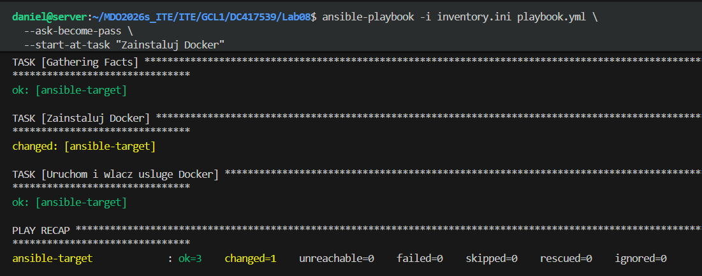

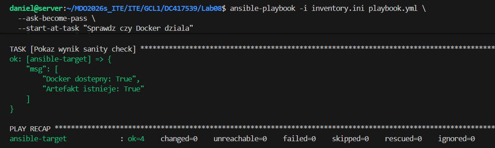

Dla artefaktu Axios przygotowano `Dockerfile` oraz prosty skrypt `verify-axios.js`. Obraz został zbudowany na maszynie docelowej, a następnie uruchomiono kontener wykorzystujący bezpośrednio plik `axios-1.20.0.tgz`.

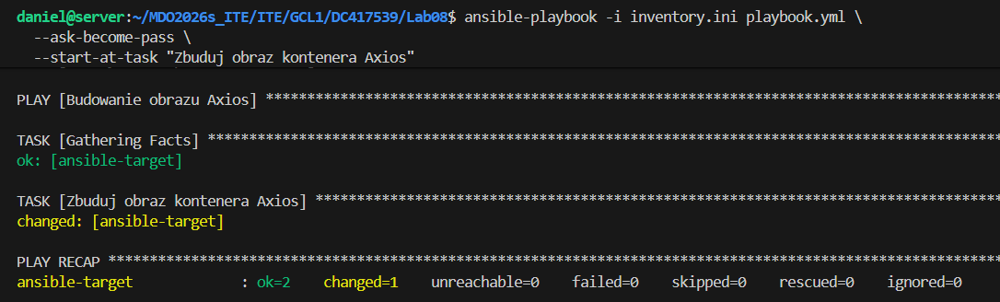

Poprawne uruchomienie artefaktu potwierdzono wynikiem:

```text
Axios version: 1.20.0
Axios artifact loaded successfully
```

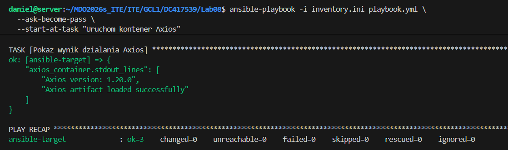

Po zakończeniu testów wykonano cleanup środowiska. Usunięto kontener, obraz Docker oraz katalog aplikacji, a następnie zweryfikowano brak pozostałości po wdrożeniu.

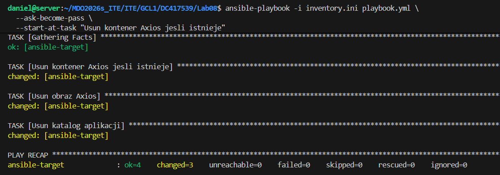

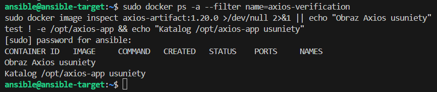

Na końcu utworzono rolę `axios_deploy` za pomocą `ansible-galaxy role init`. Uzupełniono plik `meta/main.yml`, zdefiniowano zmienne oraz przeniesiono do roli zadania odpowiedzialne za przygotowanie środowiska, wysłanie artefaktu, budowanie obrazu, uruchomienie aplikacji, weryfikację oraz cleanup.

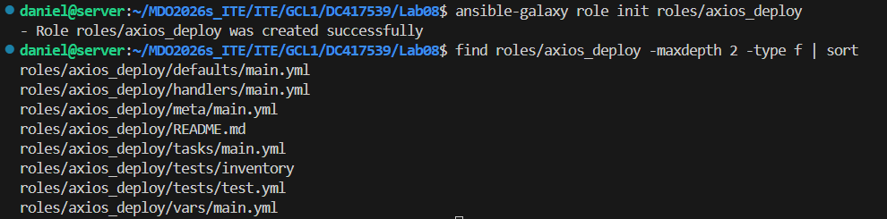

Pełne uruchomienie roli zakończyło się bez błędów i ponownie potwierdziło poprawne działanie Axios w wersji `1.20.0`.

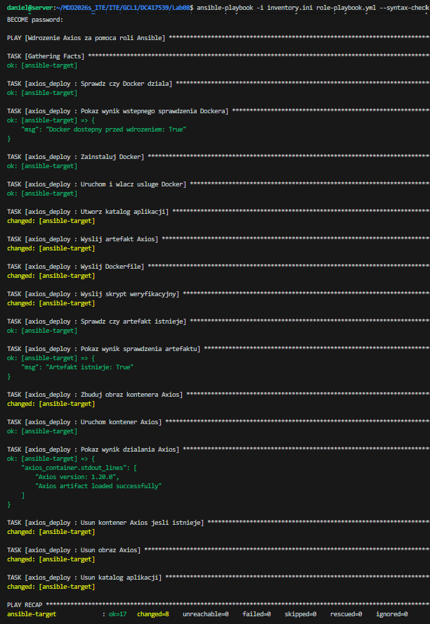

Cała struktura `Lab08` została następnie dodana do repozytorium i wysłana na branch `DC417539` w commicie `DC417539 Lab08`.


## Zajęcia 09 – Instalacja nienadzorowana systemu Fedora z użyciem Kickstart

Podczas zajęć przygotowano automatyczną instalację systemu Fedora Server 43 z wykorzystaniem pliku odpowiedzi Kickstart. W Hyper-V utworzono nową maszynę wirtualną drugiej generacji z UEFI, dyskiem 30 GB oraz dostępem do sieci przez `Default Switch`.

Najpierw wykonano standardową instalację systemu Fedora w celu uzyskania wygenerowanego przez instalator pliku `/root/anaconda-ks.cfg`. Plik został następnie skopiowany i zmodyfikowany tak, aby umożliwiał wielokrotną, całkowicie nienadzorowaną reinstalację systemu.

W konfiguracji Kickstart ustawiono m.in. automatyczne czyszczenie dysku za pomocą `clearpart --all --initlabel`, automatyczne partycjonowanie, hostname `fedora`, użytkownika `daniel`, wyłączenie kreatora pierwszego uruchomienia oraz automatyczny restart po zakończeniu instalacji.

Plik `ks.cfg` został udostępniony z maszyny `server` przez prosty serwer HTTP. Podczas uruchamiania instalatora do parametrów startowych dodano:

```text
inst.ks=http://172.22.199.112:8000/ks.cfg ip=dhcp
```

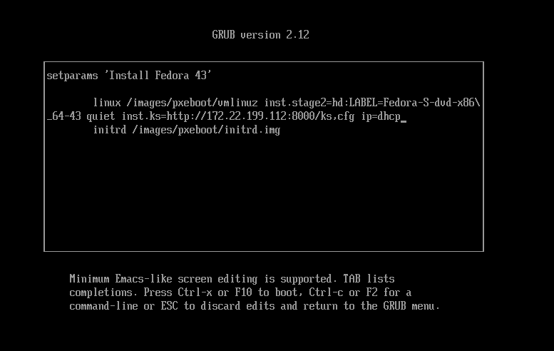

Poprawne pobranie pliku odpowiedzi przez instalator potwierdzono w logu serwera HTTP. Żądanie do `/ks.cfg` zakończyło się kodem odpowiedzi `200`.

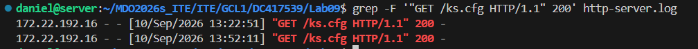

Po sprawdzeniu podstawowej instalacji plik Kickstart rozszerzono o dodatkowe repozytoria Fedory oraz pakiety `nodejs`, `nodejs-npm` i `python3`, potrzebne do uruchomienia artefaktu przygotowanego wcześniej przez pipeline Jenkins.

W sekcji `%post` dodano mechanizm pobierający artefakt `axios-1.20.0.tgz`, jego instalację za pomocą `npm` oraz utworzenie prostej aplikacji wykorzystującej bibliotekę Axios. Przygotowano również usługę `systemd` o nazwie `axios-app.service`, która jest automatycznie włączana podczas instalacji. Dodatkowo w konfiguracji firewalla otwarto port `3000/tcp`.

Po zakończeniu finalnej instalacji system automatycznie uruchomił się ponownie. Sprawdzenie usługi wykazało, że `axios-app.service` jest ustawiona jako `enabled` oraz działa ze statusem `active (running)`. W logu usługi widoczna była również informacja o uruchomieniu Axios w wersji `1.20.0`.

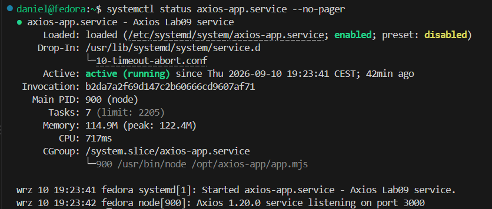

Na końcu sprawdzono dostęp do aplikacji z maszyny `server`. Odpowiedź z portu `3000` potwierdziła poprawne działanie wdrożonego artefaktu:

```text
Axios 1.20.0 działa na Fedora Lab09
```

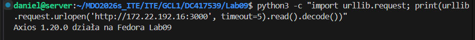

Finalny plik `ks.cfg` został dodany do katalogu `Lab09` i wysłany na branch `DC417539` w commicie `DC417539 Lab09`.


# Zajęcia 10 — Wdrażanie aplikacji w Kubernetes

## Przygotowanie klastra Kubernetes

Na początku sprawdzono dostępność Minikube, klienta `kubectl` oraz Dockera. Zweryfikowano również zasoby maszyny, takie jak liczba procesorów, pamięć RAM oraz wolne miejsce na dysku. Maszyna posiadała ograniczoną ilość pamięci RAM, jednak klaster udało się poprawnie uruchomić.

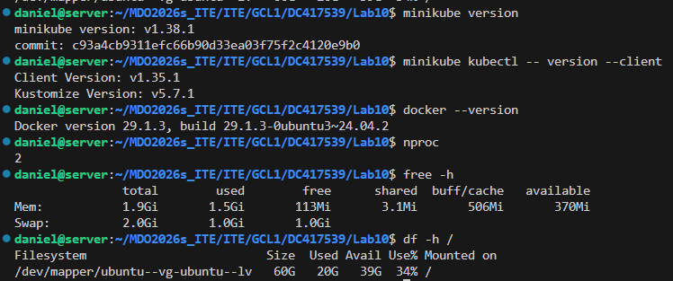

Sprawdzono również sposób instalacji Minikube. Program był uruchamiany przez zwykłego użytkownika, natomiast jego plik wykonywalny należał do użytkownika `root` i nie posiadał ustawionego bitu `setuid`.

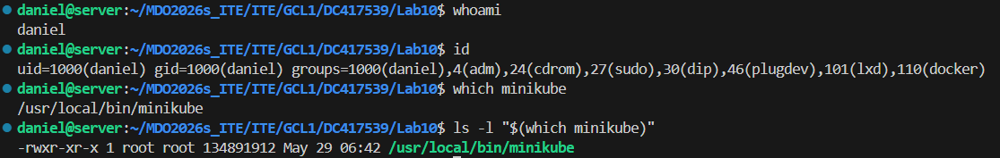

Następnie uruchomiono klaster Minikube z wykorzystaniem sterownika Docker. Sprawdzono stan klastra oraz działający węzeł Kubernetes. Wszystkie podstawowe komponenty działały poprawnie, a node `minikube` miał status `Ready`.

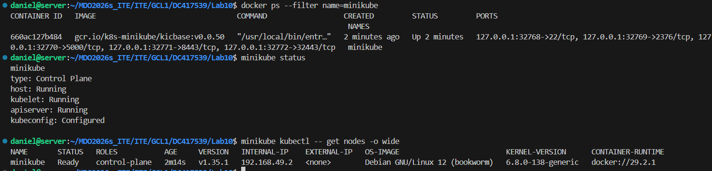

Uruchomiono również Kubernetes Dashboard i sprawdzono możliwość dostępu do niego z poziomu przeglądarki.

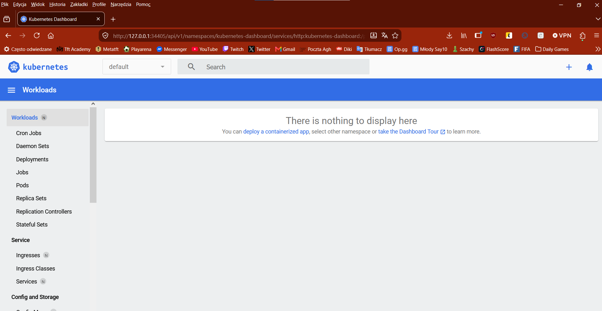

## Przygotowanie aplikacji do wdrożenia

Najpierw sprawdzono wcześniej przygotowany obraz `axios-runtime:v1.20.0`. Kontener poprawnie uruchamiał bibliotekę Axios i wypisywał jej wersję, jednak natychmiast kończył działanie. Z tego powodu nie nadawał się jako kontener działający stale w Kubernetes.

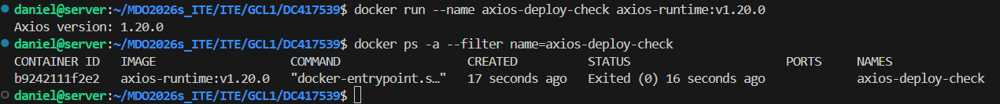

Na potrzeby dalszej części ćwiczenia przygotowano własny obraz oparty na `nginx:alpine`. Dodano własną stronę HTML oraz konfigurację nginx. Po uruchomieniu kontenera sprawdzono jego stan oraz odpowiedź aplikacji za pomocą `curl`.

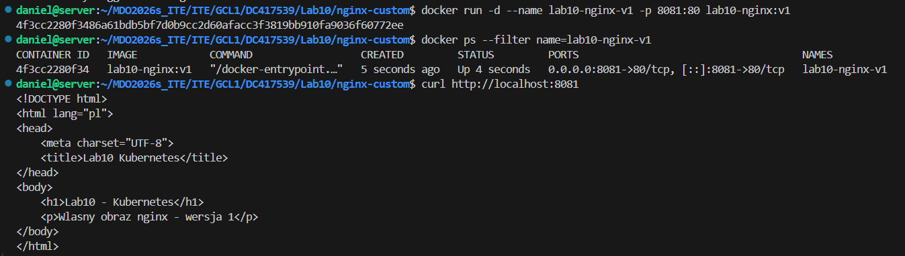

## Uruchomienie aplikacji w Kubernetes

Obraz `lab10-nginx:v1` został załadowany do Minikube, a następnie uruchomiono go jako pojedynczy pod. Jego działanie sprawdzono zarówno za pomocą `kubectl`, jak i Kubernetes Dashboard.

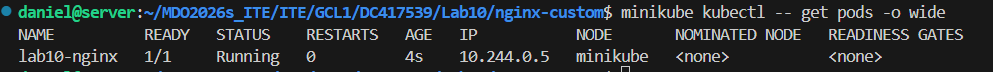

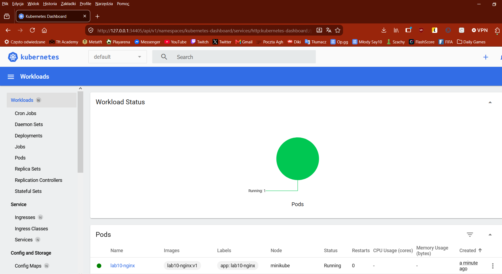

Za pomocą `port-forward` przekierowano port poda na port lokalny i potwierdzono dostęp do aplikacji przy użyciu `curl`.

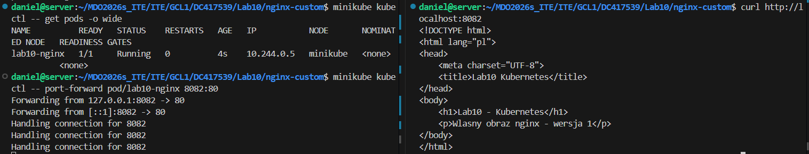

## Deployment i Service

Ręczne uruchomienie aplikacji zastąpiono plikiem `deployment.yaml`. Początkowo Deployment posiadał jedną replikę, a następnie zwiększono ich liczbę do czterech. Stan wdrożenia sprawdzono poleceniem `kubectl rollout status`.

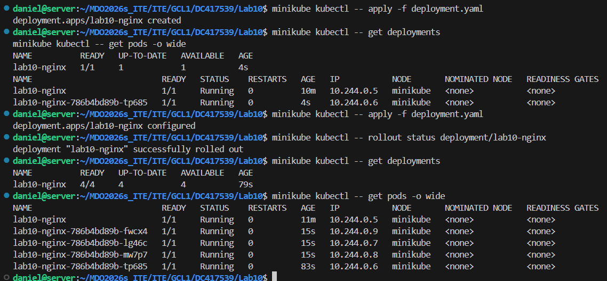

Deployment został następnie udostępniony jako Service typu `ClusterIP`. Port serwisu przekierowano na lokalny port i ponownie sprawdzono działanie aplikacji.

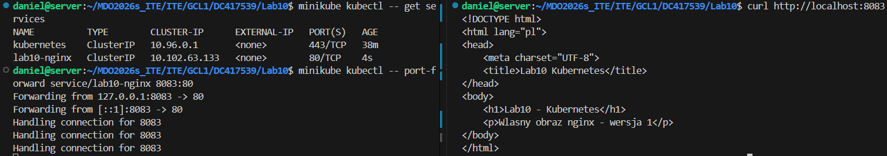

## Wersje obrazu i skalowanie

Przygotowano drugą wersję obrazu `lab10-nginx:v2` oraz celowo wadliwą wersję `lab10-nginx:bad`. Wadliwy obraz kończył działanie kodem błędu `1`.

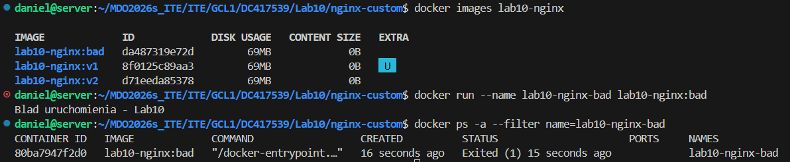

Następnie sprawdzono skalowanie Deploymentu. Liczbę replik zwiększono do ośmiu.

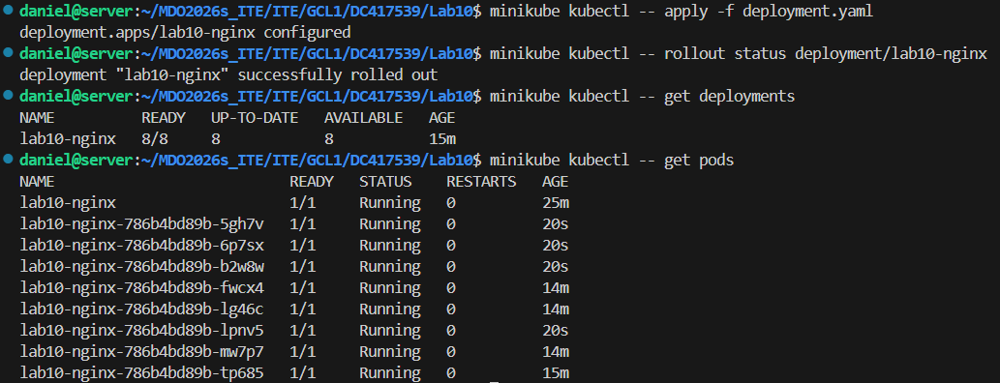

Deployment zmniejszono następnie do jednej repliki.

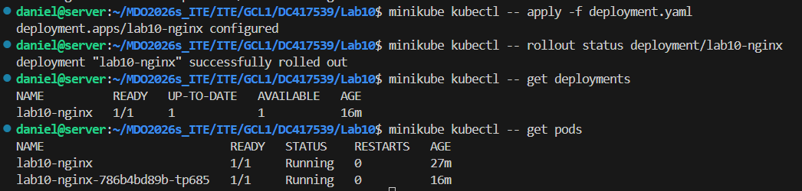

Sprawdzono również skalowanie do zera, co spowodowało zatrzymanie wszystkich podów należących do Deploymentu.

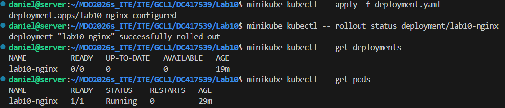

Na końcu ponownie zwiększono liczbę replik do czterech.

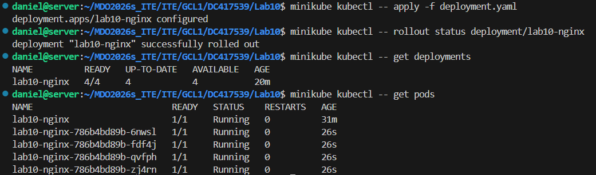

## Aktualizacje i rollback

Deployment zaktualizowano z obrazu `lab10-nginx:v1` do `lab10-nginx:v2`. Kubernetes wykonał aktualizację i uruchomił nowe pody.

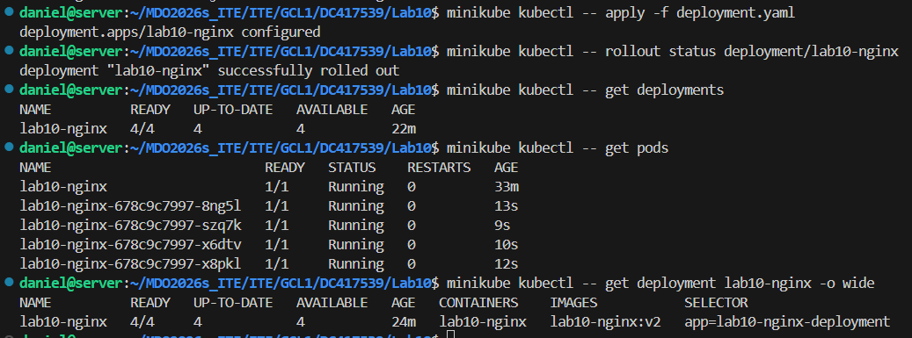

Następnie ponownie zastosowano starszą wersję `v1`.

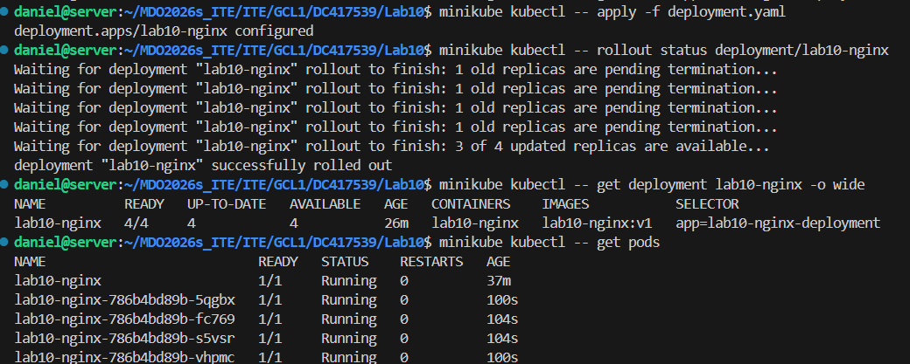

Kolejnym testem było zastosowanie obrazu `lab10-nginx:bad`. Nowe pody nie były w stanie poprawnie się uruchomić i przechodziły w stany `Error` oraz `CrashLoopBackOff`. Polecenie sprawdzające rollout zakończyło się przekroczeniem limitu czasu.

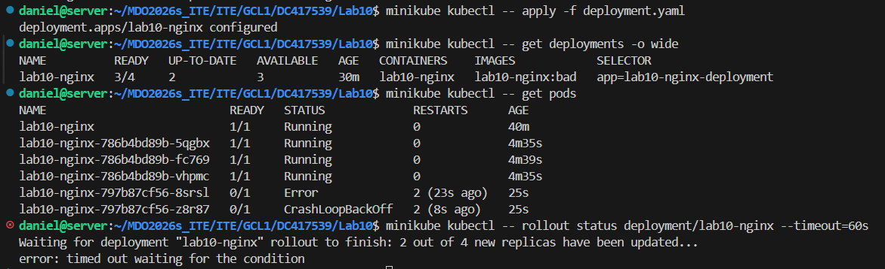

Za pomocą historii rolloutów sprawdzono wcześniejsze rewizje Deploymentu. Poszczególne rewizje odpowiadały obrazom `v2`, `v1` oraz `bad`.

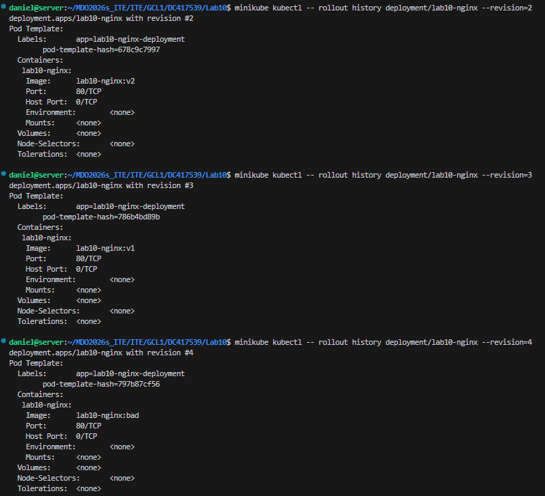

Wadliwe wdrożenie cofnięto poleceniem `kubectl rollout undo`. Po rollbacku Deployment ponownie działał na obrazie `lab10-nginx:v1` i posiadał cztery gotowe repliki.

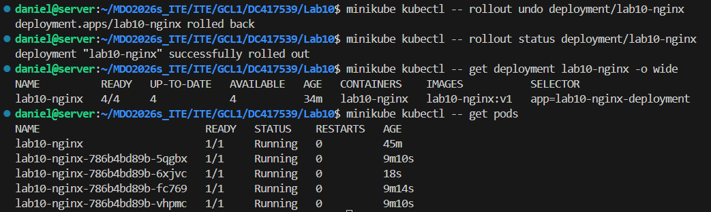

## Kontrola wdrożenia

Przygotowano skrypt `check-deployment.sh`, który sprawdza, czy Deployment zakończy rollout w czasie maksymalnie 60 sekund. Dla poprawnego wdrożenia skrypt zakończył się powodzeniem.

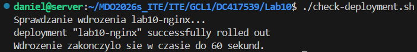

## Strategie wdrożenia

Pierwszą sprawdzoną strategią było `Recreate`. Podczas aktualizacji wszystkie stare pody zostały najpierw zatrzymane, a dopiero później uruchomiono nowe.

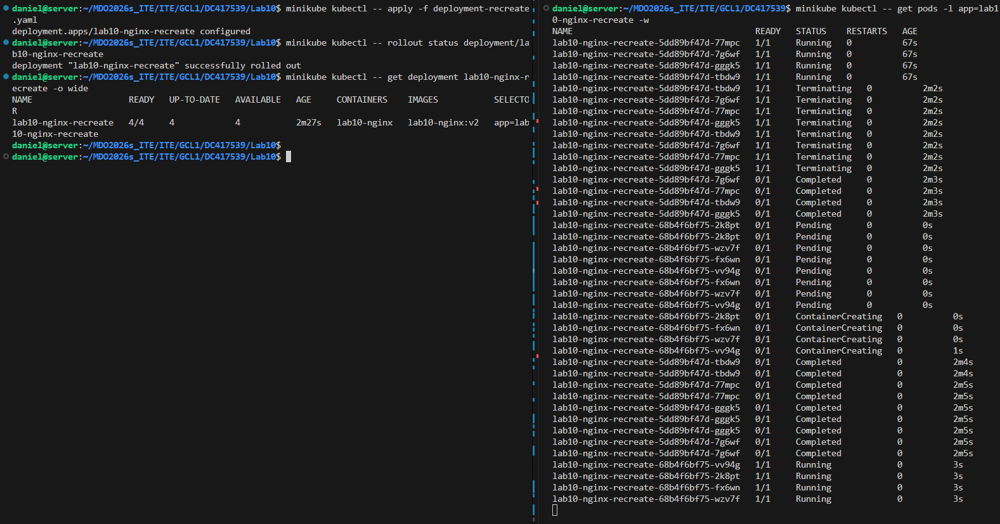

Następnie sprawdzono `RollingUpdate` z parametrami `maxUnavailable: 2` oraz `maxSurge: 50%`. Podczas aktualizacji stare i nowe pody przez pewien czas działały równocześnie.

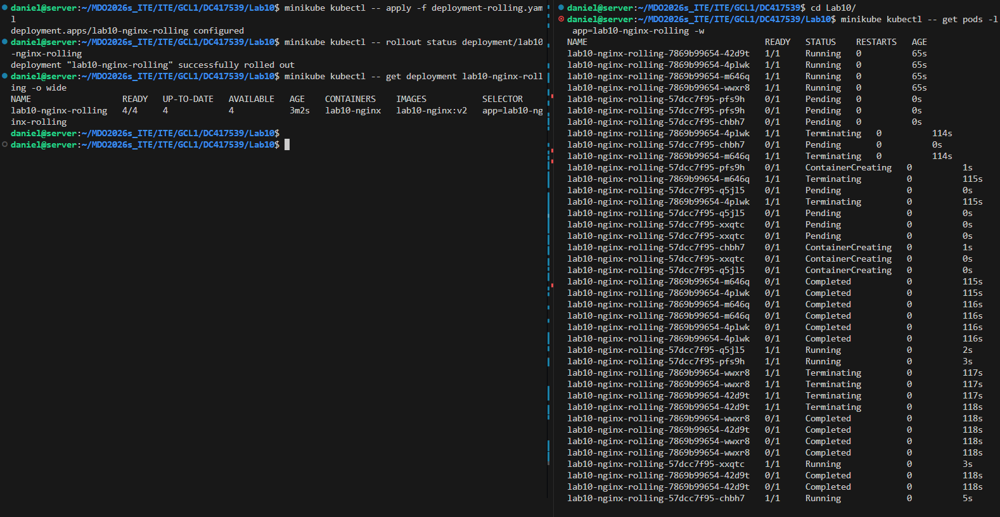

Na końcu przygotowano wdrożenie Canary. Utworzono trzy repliki stabilnej wersji `v1` oraz jedną replikę nowej wersji `v2`. Oba Deploymenty korzystały ze wspólnej etykiety i były dostępne przez jeden Service.

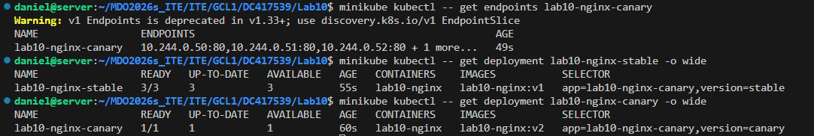

Krótko porównując strategie: `Recreate` usuwa stare pody przed uruchomieniem nowych, `RollingUpdate` stopniowo zastępuje stare pody nowymi, natomiast `Canary` pozwala jednocześnie uruchomić wersję stabilną i nową wersję aplikacji.

## Zajęcia 11 – Kubernetes (2)

Podczas zajęć kontynuowano pracę z Kubernetes. Przygotowano deployment wykorzystujący wcześniej utworzony obraz `lab10-nginx:v1`. Początkowo uruchomiono 36 replik aplikacji, a następnie sprawdzono różne sposoby udostępniania aplikacji oraz skalowania wdrożenia.

Deployment został zdefiniowany w pliku `deployment.yaml` z liczbą `36` replik. Po zastosowaniu manifestu wszystkie pody zostały poprawnie uruchomione.

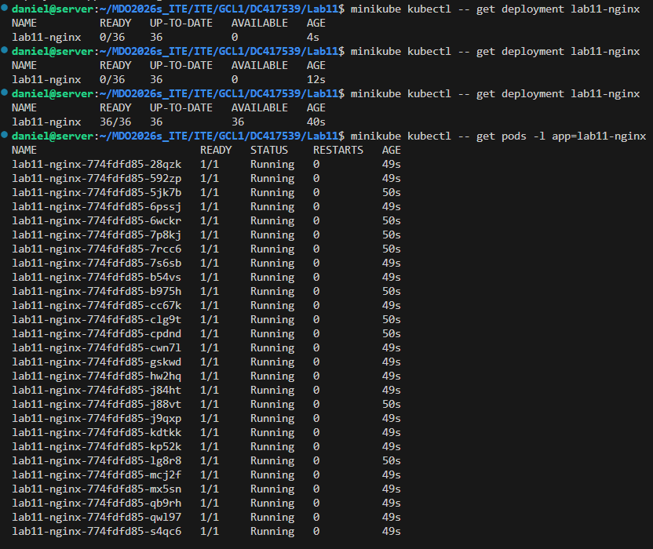

### Eksponowanie pojedynczego poda

W pierwszej kolejności udostępniono bezpośrednio jeden wybrany pod za pomocą polecenia `port-forward`. Przekierowano port `18081` hosta na port `80` kontenera. Poprawność działania sprawdzono wykonując zapytanie HTTP do lokalnego portu.

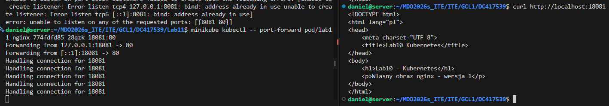

### Eksponowanie deploymentu

Następnie wykonano przekierowanie portu bezpośrednio do deploymentu `lab11-nginx`. W tym przypadku nie wskazywano konkretnego poda, tylko cały deployment.

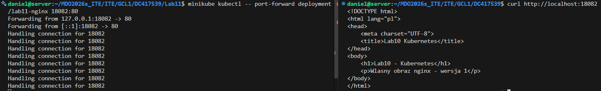

### Service utworzony poleceniem `kubectl expose`

Kolejnym sposobem udostępnienia aplikacji było utworzenie serwisu typu `ClusterIP` za pomocą polecenia:

```bash
minikube kubectl -- expose deployment lab11-nginx \
  --name=lab11-nginx-service \
  --type=ClusterIP \
  --port=80 \
  --target-port=80
```

Dostęp do utworzonego serwisu sprawdzono przez `port-forward` oraz zapytanie HTTP.

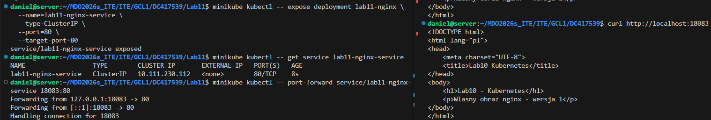

### Service utworzony z pliku YAML

Następnie ten sam rodzaj serwisu utworzono deklaratywnie za pomocą pliku `service.yaml`. Manifest zawierał selektor `app: lab11-nginx`, dzięki któremu Service kierował ruch do podów należących do deploymentu.

Po zastosowaniu pliku YAML ponownie sprawdzono działanie aplikacji przez przekierowanie portu.

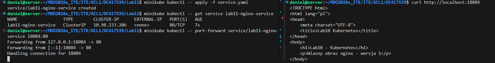

### Skalowanie za pomocą polecenia `scale`

Pierwsze skalowanie wykonano za pomocą polecenia:

```bash
minikube kubectl -- scale deployment lab11-nginx --replicas=12
```

Liczba replik została zmniejszona z 36 do 12. Kubernetes zakończył nadmiarowe pody, pozostawiając 12 aktywnych replik.

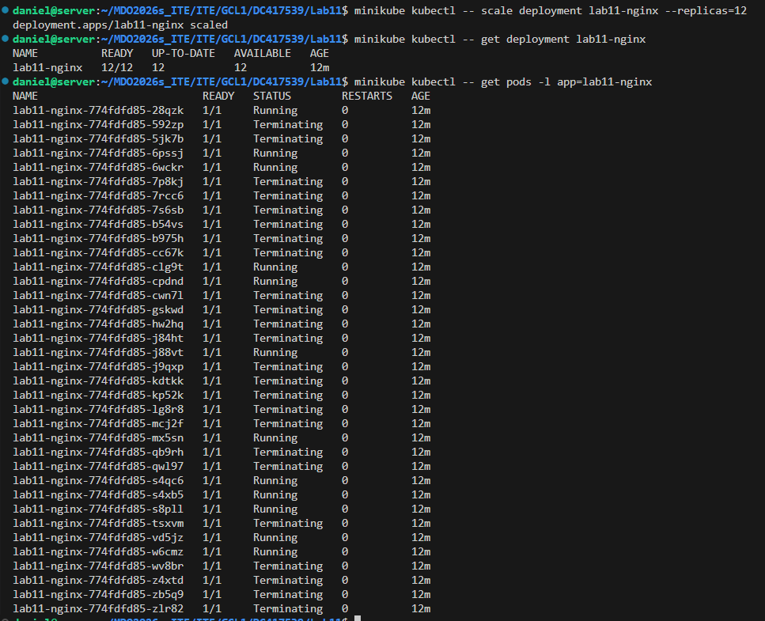

### Skalowanie za pomocą nowego pliku YAML

Drugie skalowanie wykonano deklaratywnie. Utworzono plik `deployment-scaled.yaml`, w którym zmieniono liczbę replik z `36` na `20`.

Różnicę pomiędzy manifestami pokazano za pomocą polecenia:

```bash
diff -u deployment.yaml deployment-scaled.yaml
```

Najważniejsza zmiana wyglądała następująco:

```diff
-  replicas: 36
+  replicas: 20
```

Po zastosowaniu nowego manifestu deployment został przeskalowany do 20 działających replik.

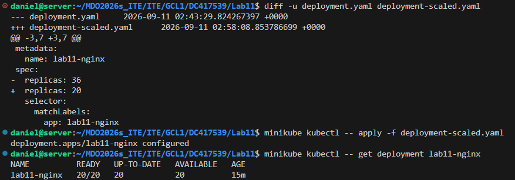

### Sprawdzenie rozdzielania ruchu pomiędzy pody

W ramach zadania dodatkowego sprawdzono, do których podów trafiają żądania kierowane do serwisu. Do adresu `ClusterIP` wysłano serię zapytań HTTP, a następnie przeanalizowano logi nginx.

W logach widoczne były odpowiedzi pochodzące z wielu różnych podów, co potwierdziło, że Service rozdziela ruch pomiędzy repliki deploymentu.

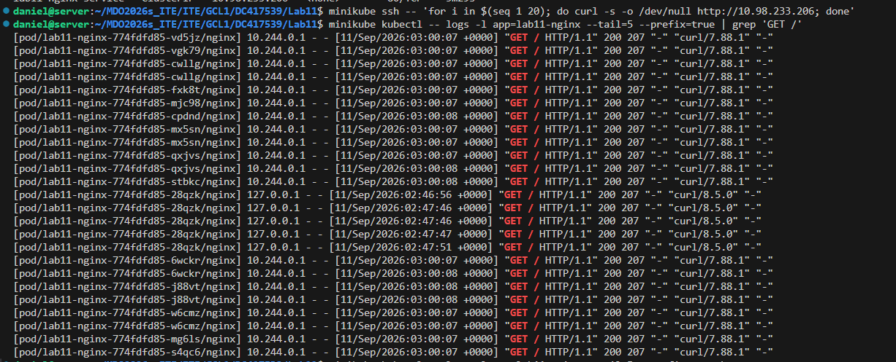

W ramach zajęć przećwiczono więc udostępnianie aplikacji na poziomie pojedynczego poda, deploymentu oraz Service, a także dwa
