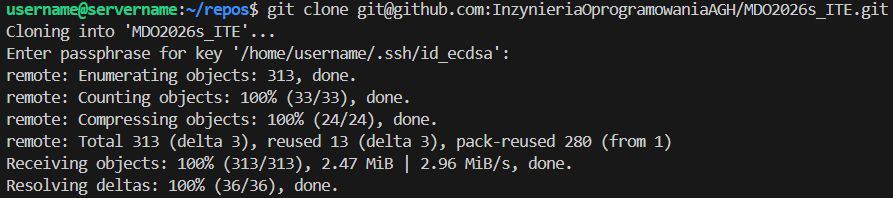

Sprawozdanie Metodyki DevOps (jego składowa)

Przed zajęciami przygotowano środowisko:
-HyperV
-System maszyny Ubuntu (bez GUI)
-VS Code i jego połączenie z maszyną wirtualną

Na zajęciach skonfigurowano połączenie ssh z repozytorium, oraz sklonowano je.
