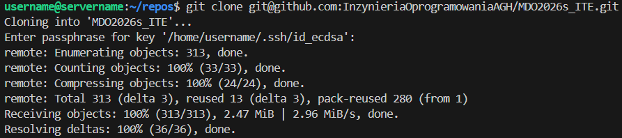
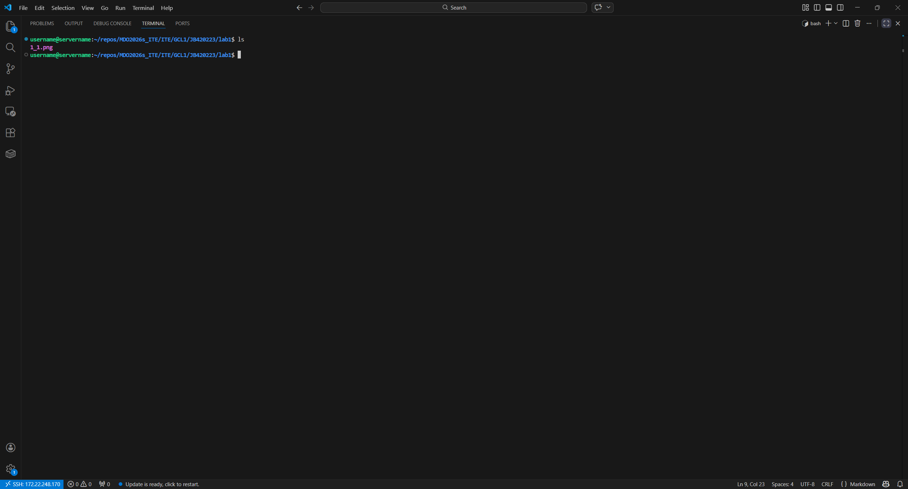
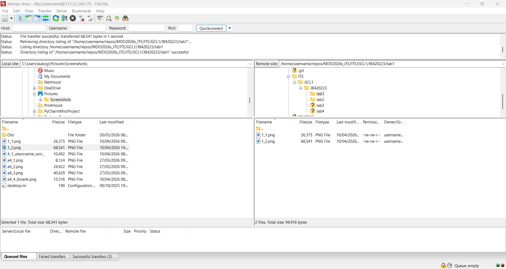

# Sprawozdanie Metodyki DevOps
Jakub Bednarczyk

## Lab 1
Na maszynie wirtualnej (HyperV) z systemem Ubuntu zaisntalowano git'a,
od razu utworzono klucze SSH, aby łączyć się z maszyną przez Visual Studio Code.
Już z poziomu IDE zalogowano się do maszyny oraz skolonowano repozytorium i połączono się z maszyną wirtualną poprzez filezille w celu wygodnej wymiany plików

W trakcie zajęć nie dodano hook'a przez co wczesne commity nie posiadają na początku inicjałów oraz numeru indeksu, ale dodano go w trakcie tworzenia sprawozdania, poprzez nadpisanie pliku commit-msg.sample:

<pre>
#!/bin/sh
COMMIT_MSG_FILE=$1
FIRST_LINE=$(head -n 1 "$COMMIT_MSG_FILE")

REQUIRED_START="JB420223"

case "$FIRST_LINE" in
    "$REQUIRED_START"*)
        exit 0
        ;;
    *)
        echo "------------------------------------------------------------------"
        echo "ERROR: Commit message must start with: $REQUIRED_START"
        echo "Your message: $FIRST_LINE"
        echo "------------------------------------------------------------------"
        exit 1
        ;;
esac
</pre>

Po przygotowaniu powyższych zrobiono commit i push tworząc nową gałąź JB420223
