# Sprawozdanie Metodyki DevOps
Jakub Bednarczyk

## Lab 1 Wprowadzenie, Git, Gałęzie, SSH
Na maszynie wirtualnej (HyperV) z systemem Ubuntu zaisntalowano git'a,
od razu utworzono klucze SSH, aby łączyć się z maszyną przez Visual Studio Code.
Już z poziomu IDE zalogowano się do maszyny oraz skolonowano repozytorium i połączono się z maszyną wirtualną poprzez program Filezilla w celu wygodnej wymiany plików

W trakcie zajęć nie dodano hook'a przez co wczesne commity nie posiadają na początku inicjałów oraz numeru indeksu, ale dodano go w trakcie tworzenia sprawozdania, poprzez dodanie pliku commit-msg w ścieżce .git/hooks/ (samo ls nie wyświetla tego pliku, trzeba dopisać -a)

<pre>
#!/bin/sh
COMMIT_MSG_FILE=$1
FIRST_LINE=$(head -n 1 "$COMMIT_MSG_FILE")

REQUIRED_START="JB420223"

case "$FIRST_LINE" in
    "$REQUIRED_START"*)
        exit 0
        ;;
    *)
        echo "------------------------------------------------------------------"
        echo "ERROR: Commit message must start with: $REQUIRED_START"
        echo "Your message: $FIRST_LINE"
        echo "------------------------------------------------------------------"
        exit 1
        ;;
esac
</pre>

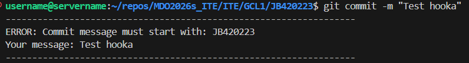

Po przygotowaniu powyższych zrobiono commit i push tworząc nową gałąź JB420223

Potem sprawdzono możliwość merge'a lokalnie, z poziomu drugiej gałęzi main przeprowadzono merge z gałęzią JB420223 który zakończył się sukcesem co oznacza brak konfilktów

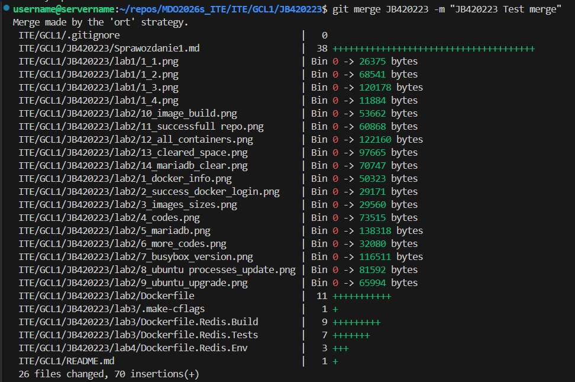

## Lab 2 Git, Docker
Zainstalowano docker'a za pomocą natywnych pakietów Ubuntu:

<pre>
sudo apt install docker.io
</pre>
Instalacja docker'a

<pre>
sudo systemctl enable --now docker
</pre>
Włącznie autostartu (skojarzenie z startup apps w windows'ie)

<pre>
sudo usermod -aG docker $USER
</pre>
Pozwala aktualnemu użytkownikowi używać dockera bez potrzeby pisania sudo (root)

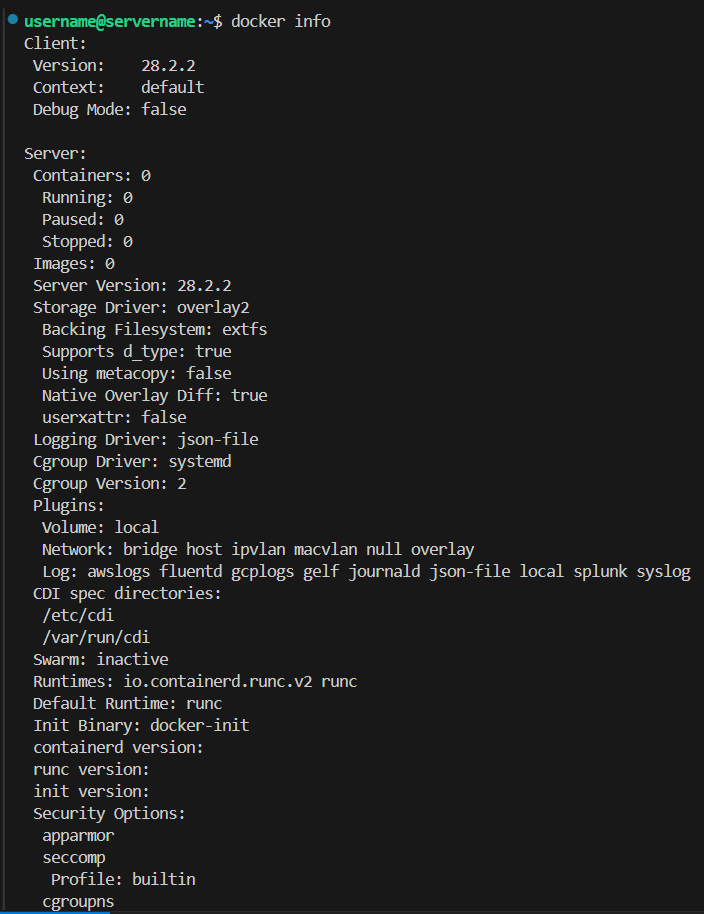

Logowanie do dockera

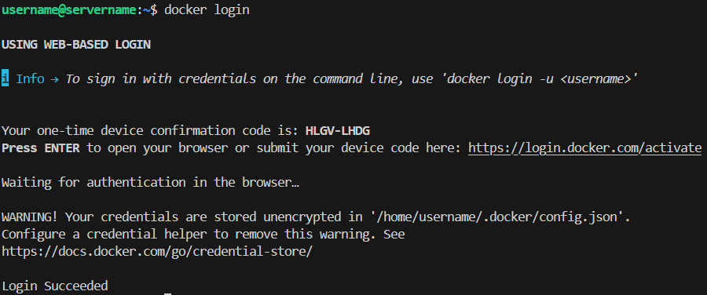

Następnie zapoznano się z obrazami, uruchomiono je, sprawdzono ich rozmiary i kody wyjścia

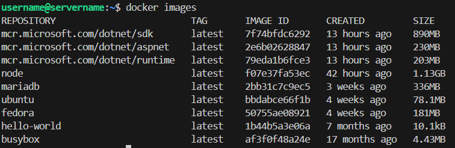

Obrazy różnią się znacząco rozmiarami, niektóre ważą kilka Megabajtów, a niektóre ważą ponad Gigabajt

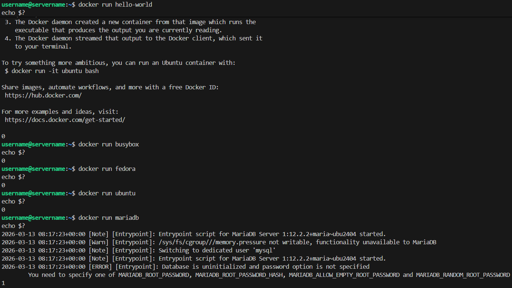

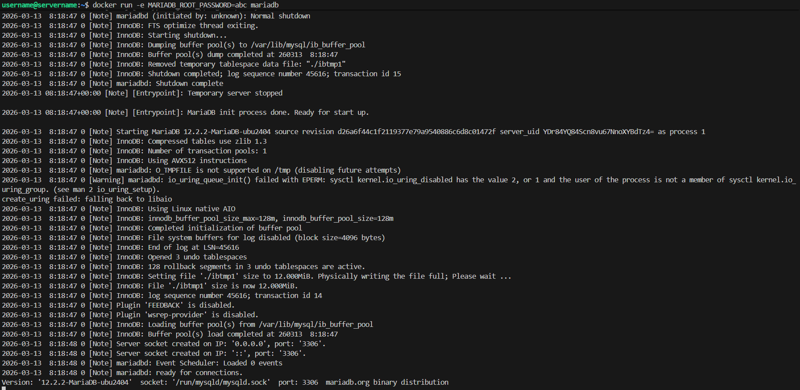

Obraz MariaDB przy próbie uruchomienia potrzebował dodatkowego setup'u

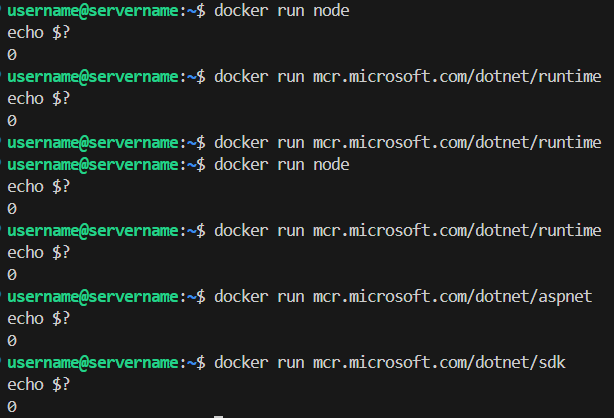

Następnie uruchomiono kontener z obrazu busybox w trybie interaktywnym (-it) oraz wywołanie wersji

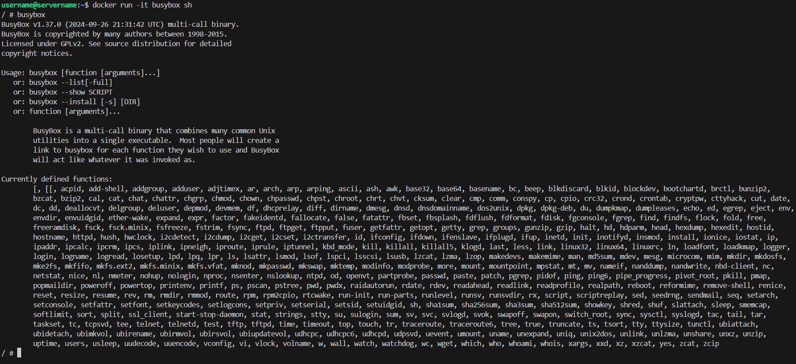

Uruchomiono kontener na podstawie Ubuntu w którym wyświetlono aktualne procesy, były to tylko bash i ps (proces samej komendy). Potwierdza to że kontenery to tylko minimalna ilość elementów systemu zamiast całego kernela. Potem zauktualizowano pliki kontenera do najnowszej wersji

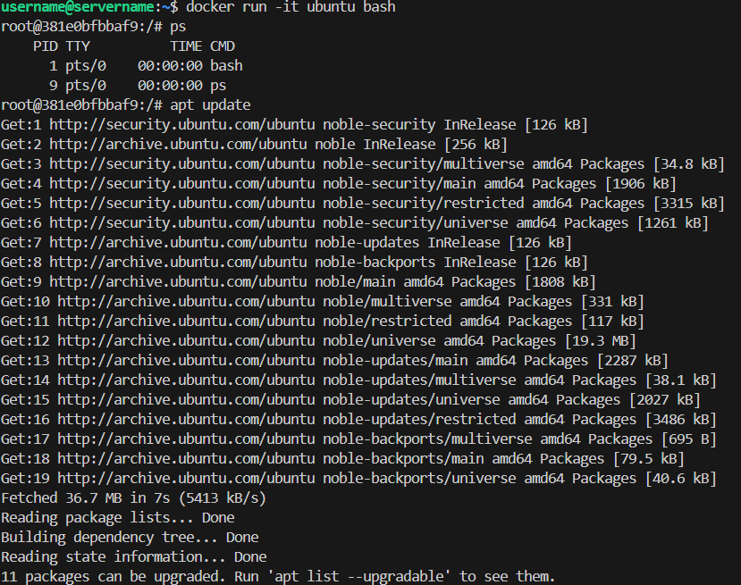

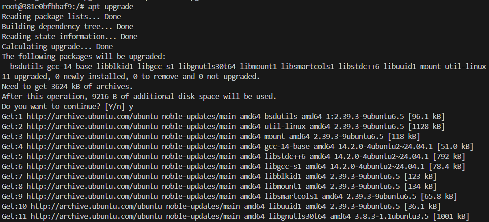

Następnym zadaniem było utworzenie dockerfile który klonuje nasze repozytorium

<pre>
FROM ubuntu:22.04

RUN apt update && \
    apt install -y git ca-certificates

WORKDIR /workdir

RUN git clone https://github.com/InzynieriaOprogramowaniaAGH/MDO2026s_ITE.git
</pre>

Dockerfile bazujący na Ubuntu aktualizuje pliki kontenera następnie pobiera gita wraz z narzędziami do weryfikacji połączeń, następnie w ścieżce workdir klonowane jest repozytorium

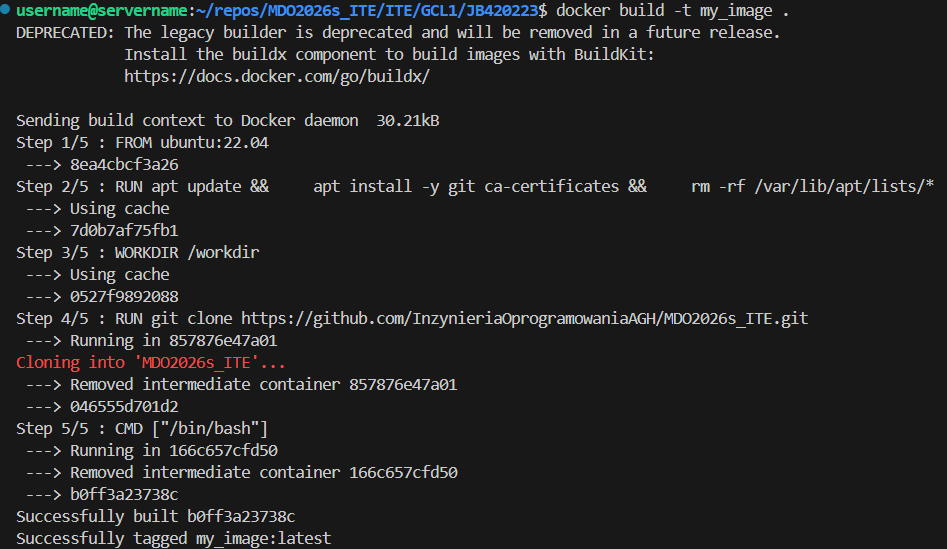

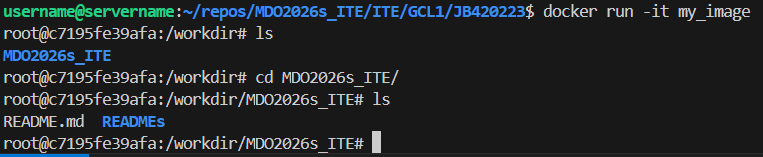

Dockerfile zadziałał poprawnie i sklonował repozytorium co widać na powyższych zrzutach ekranu

Następnie wyczyszczono pozostałe kontenery i pobrane obrazy

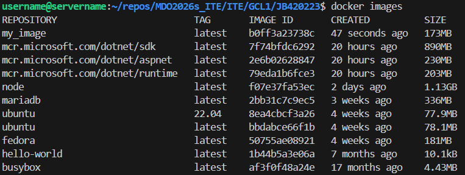

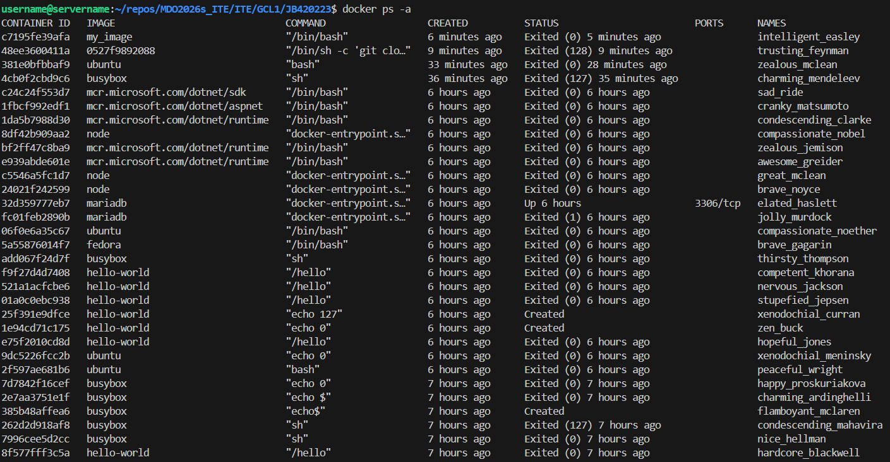

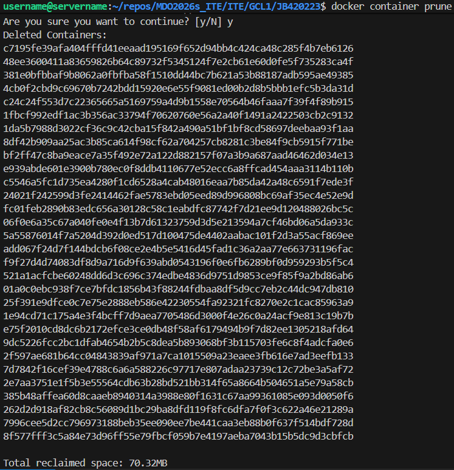

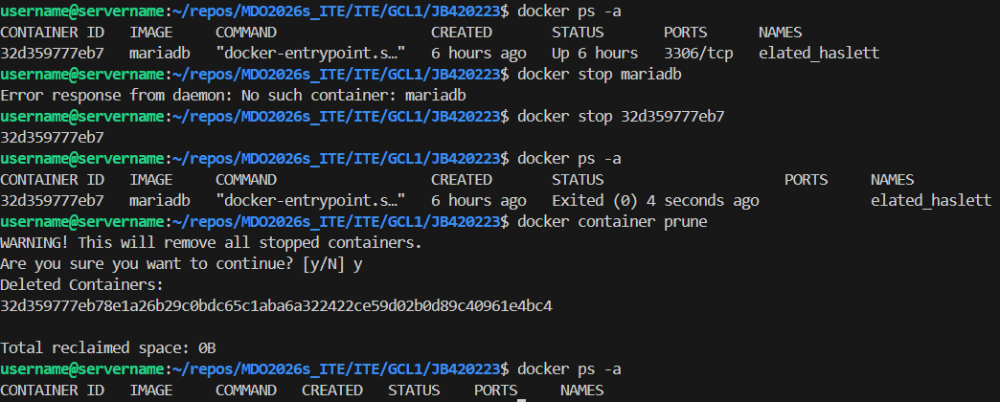

## Lab 3 Dockerfiles, kontener jako definicja etapu
Repozytorium które wybrano to serwer redis https://github.com/redis/redis.git, wcześniej próbowano wykorzystać repozytorium które  używało python'a i flask'a, ale pojawiły się problemy z kompatybilnością wersji pythona z flaskiem. Chcąc zaoszczędzić czas zmieniono repozytorium.

Podczas próby zbudowania serwera wykryto zależności:
* **`make`, `gcc`, `gcc-c++`** Podstawowe narzędzia kompilacji

* **`pkgconf`** Narzędzie pomocnicze, które automatycznie podaje kompilatorowi ścieżki do zainstalowanych bibliotek. Dzięki niemu kompilator wie, gdzie szukać plików potrzebnych do zbudowania programu bez konieczności ręcznego wpisywania lokalizacji przez użytkownika

* **`openssl-devel`** Biblioteka programistyczna niezbędna do obsługi połączeń szyfrowanych (TLS/SSL). Pozwala na skompilowanie Redisa z funkcjami bezpieczeństwa, co jest kluczowe w nowoczesnych środowiskach sieciowych.

* **`tcl`** Język skryptowy wykorzystywany do uruchamiania testów automatycznych. Jest wymagany, aby po zakończeniu kompilacji sprawdzić poprawność działania serwera za pomocą komendy `make test`.

* **`diffutils`** Zestaw narzędzi używany przez skrypty testowe do porównywania wyników działania bazy danych ze wzorcami, co pozwala wykryć ewentualne błędy w skompilowanym kodzie.

* **`procps-ng`** Dostarcza narzędzia do monitorowania procesów. Są one niezbędne podczas testów, aby środowisko mogło kontrolować status uruchomionego serwera Redis.

* **`git`** Narzędzie kontroli wersji użyte do sklonowania najnowszej wersji kodu źródłowego Redisa z repozytorium zdalnego

Po wykryciu zależności utworzono pliki dockerfile:

Do budowania `redis_build`
<pre>
FROM fedora:40

RUN dnf install -y git make gcc gcc-c++ pkgconf openssl-devel tcl diffutils bash which procps-ng

RUN git clone https://github.com/redis/redis.git /redis

WORKDIR /redis

RUN make
</pre>

Dockerfile bazuje na fedorze, uwzględnia wszystkie potrzebne zależności redisa, oraz buduje redis'a

Oraz do testowania `redis_tests`
<pre>
FROM redis_build

WORKDIR /redis

RUN bash runtest
</pre>

Ten Dockerfile bazuje na wcześniejszym, który przygotował już wszystkie dependencje, można byłoby podzielić zależności pomiędzy testami, aby nie uwzględniać w buildzie czegość czego nie potrzebujemy

Pliki Dockerfile poprawnie budują swoje obrazy:

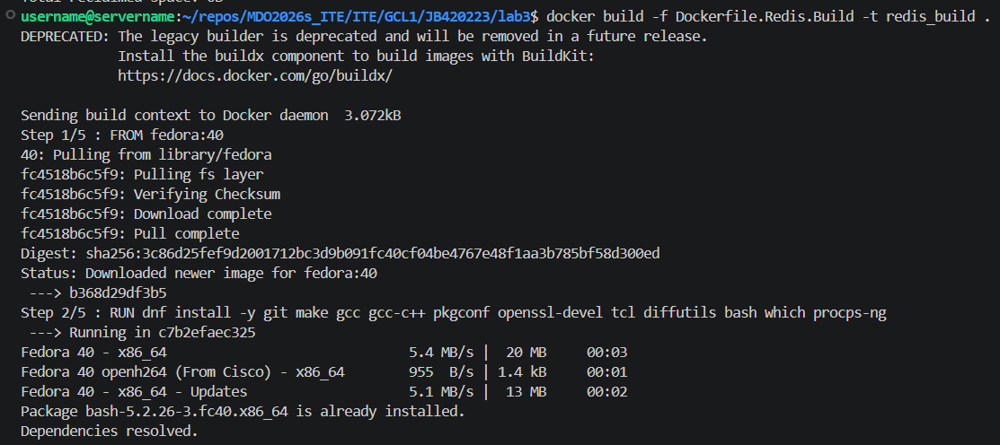

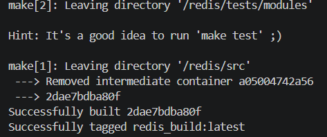

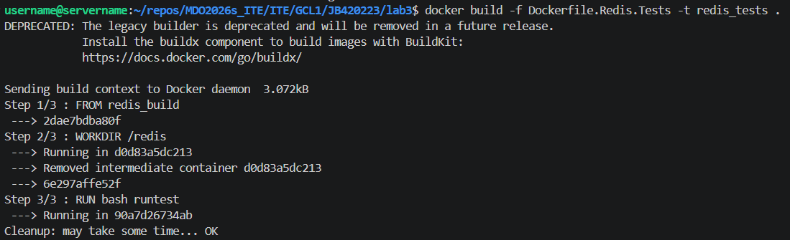

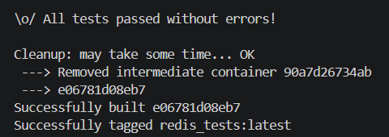

A kontenery na ich podstawie prawidłowo się uruchamiają i zawierają potrzebne pliki

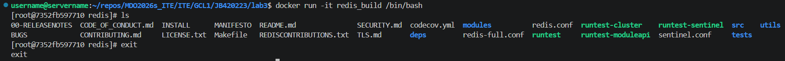

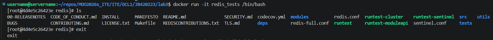

W kotnenerach pracuje tylko bash (interaktywne włączenie) ponieważ klonowanie, budowanie i testowanie dzieje się przy budowaniu obrazu, a nie uruchamianiu kontenera

## Lab 4 Dodatkowa terminologia w konteneryzacji, instancja Jenkins

### Zachowywanie stanu między kontenerami

W celu przygotowania środowiska budowania stworzono plik Dockerfile oparty na obrazie `fedora:40`. Zawiera on zależności niezbędne do kompilacji serwera Redis, ale celowo pominięto w nim instalację narzędzia Git, aby wymusić dostarczenie kodu z zewnątrz

**Dockerfile.Redis.Env**
<pre>
FROM fedora:40
RUN dnf install -y make gcc gcc-c++ pkgconf openssl-devel tcl diffutils bash which procps-ng
</pre>

Na początku utworzono dwa woluminy, które pełnią rolę zewnętrznych dysków. Wolumin **input** przeznaczono na kod źródłowy, a wolumin **output** na gotowe pliki binarne

<pre>
docker volume create input
docker volume create output
</pre>

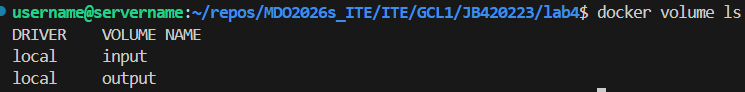

Z uwagi na brak Gita w obrazie bazowym, do dostarczenia kodu wykorzystano kontener pomocniczy `alpine`. Kod skopiowano z katalogu lokalnego hosta na wolumin za pomocą poniższego polecenia:

<pre>
docker run --rm \
  -v input:/data \
  -v $(pwd):/src \
  alpine sh -c "cp -r /src/* /data/"
</pre>

W powyższej operacji folder hosta zamontowano jako **Bind Mount**, a wolumin jako miejsce docelowe. Poprawność kopiowania zweryfikowano wyświetlając zawartość woluminu:

<pre>
docker run --rm -it -v input:/data alpine ls /data
</pre>

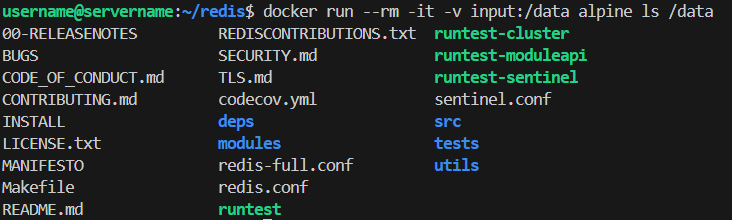

Proces budowania przeprowadzono uruchamiając kontener `redis_env` z jednoczesnym montowaniem obu woluminów. Wolumin wejściowy podpięto pod `/app/src`, a wyjściowy pod `/app/build`

<pre>
docker run -it \
  -v input:/app/src \
  -v output:/app/build \
  --name redis_env \
  redis_env:latest
</pre>

Wewnątrz kontenera wykonano komendę `make`. Po zakończeniu kompilacji pliki binarne skopiowano na wolumin **output**

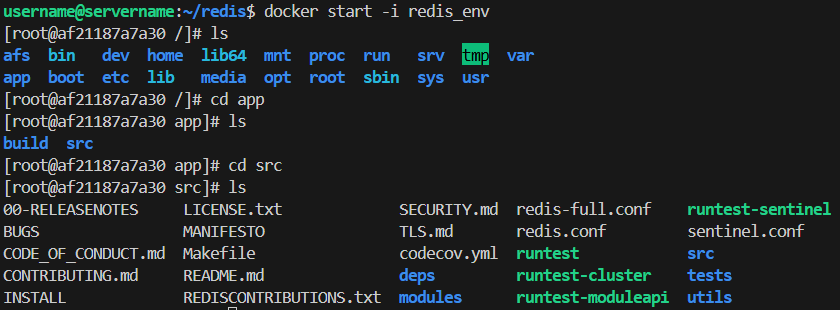
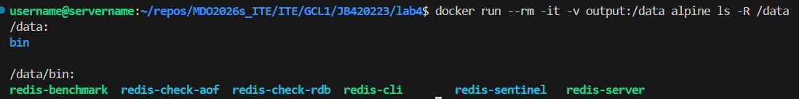

Następnie wyczyszczono kontenery poniższymi komendami:

<pre>
docker run --rm -v input:/data alpine sh -c "rm -rf /data/*"
</pre>

<pre>
docker run --rm -v output:/data alpine sh -c "rm -rf /data/*"
</pre>

Oraz sklonowano repozytorium na wolumin korzystając z git'a w kontenerze:

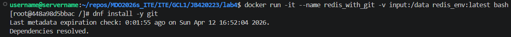

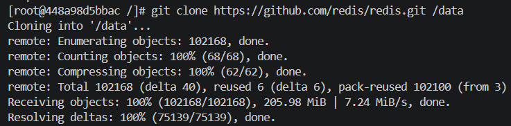

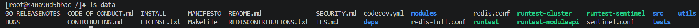

Wykonanie powyższych kroków można zautomatyzować przy użyciu pliku Dockerfile i mechanizmu **RUN --mount=type=bind**. Metoda ta pozwala na tymczasowe podpięcie zewnętrznego katalogu z kodem źródłowym tylko na czas trwania konkretnej instrukcji budowania.

Zaletą tego rozwiązania jest fakt, że kod źródłowy jest dostępny dla kompilatora, ale nie zostaje on skopiowany do obrazu na stałe. Dzięki temu finalny obraz jest znacznie mniejszy, a cały proces nie wymaga ręcznego tworzenia woluminów przed uruchomieniem kompilacji

### Eksponowanie portu i łączność między kontenerami
Stworzono dwa kontenery:

<pre>
docker run -it --name con1 fedora:40
</pre>

<pre>
docker run -it --name con2 fedora:40
</pre>

Na obu zainstalowano iperf3:

<pre>
dnf install -y iperf3
</pre>

Na pierwszym włączono nasłuchiwanie:

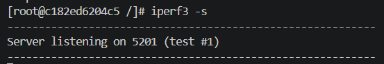

Sprawdzono ip kontenerów:

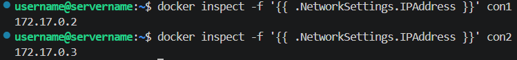

Połączono się z drugiego kontenera do peirwszego jako klient:

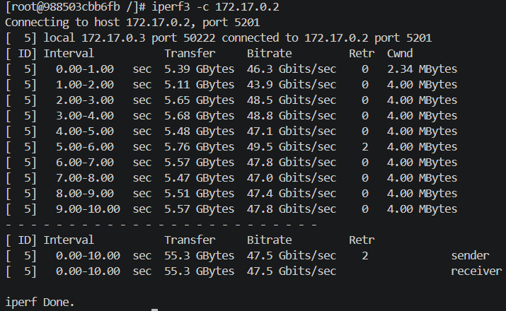

Połączenie istnieje i jest bardzo szybkie co wynika z tego że oba kontenery są na tej samej maszynie fizycznej

W kolejnej części wykorzystujemy narzędzia wbudowane dockera, towrzymy sieć:

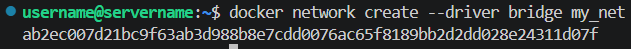

Uruchamiamy kontener z serwerem:

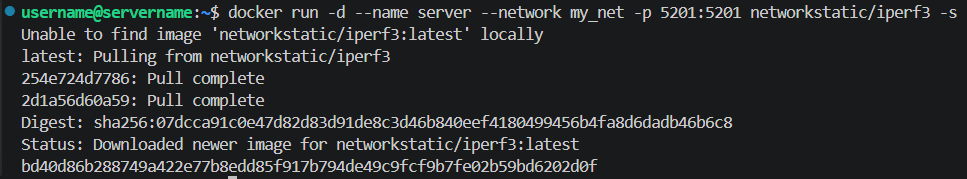

Łączymy się z serwerem jako klient:

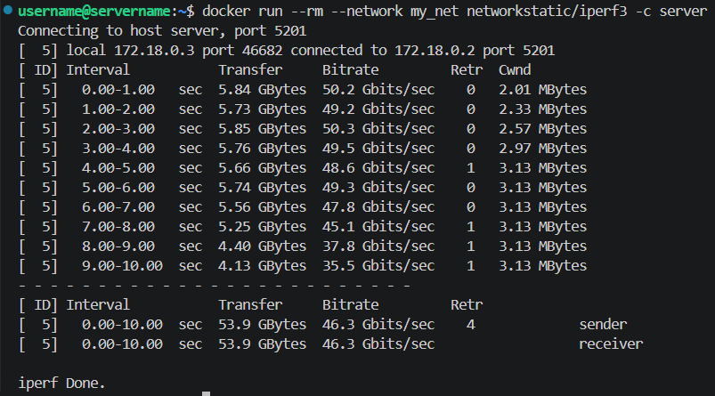

Połączenie działa

Łączymy się z hosta:

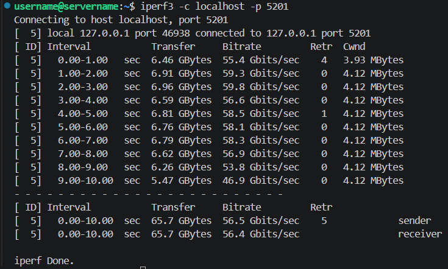

Z poza hosta:

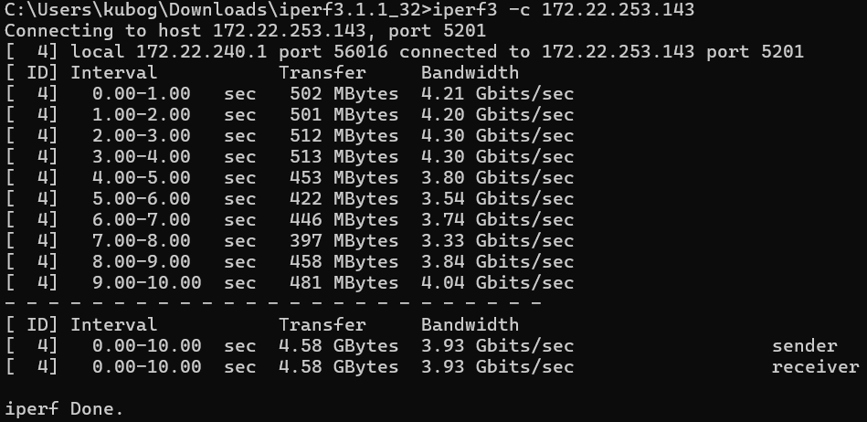

Logi:

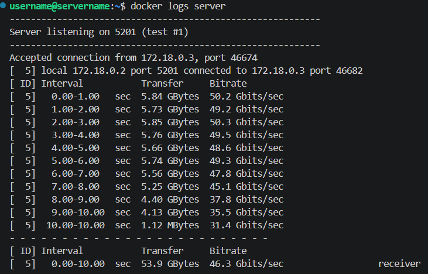

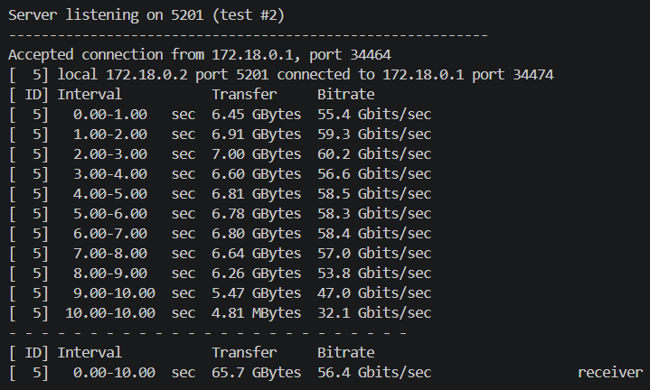

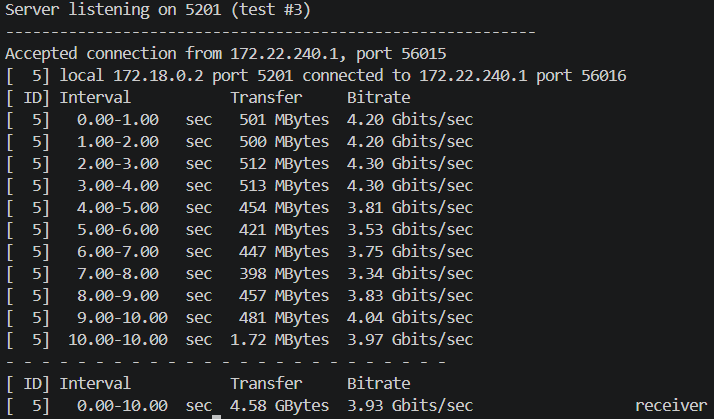

Wnioski z testów przepustowości sieci Docker

* **Rozwiązywanie nazw i DNS:** Testy potwierdziły, że utworzenie własnej sieci mostkowej (`my_net`) automatycznie aktywuje wbudowany serwer DNS Dockera. Pozwoliło to na bezproblemową komunikację między kontenerami przy użyciu nazw (np. `server`), eliminując konieczność ręcznego wpisywania adresów IP.
* **Wydajność wewnątrz hosta:** W komunikacji kontener-kontener oraz host-kontener (Linux) uzyskano bardzo wysoką przepustowość rzędu **46-56 Gb/s**. Tak wysoki wynik świadczy o minimalnym narzucie wirtualizacji sieciowej Dockera, gdyż ruch odbywa się bezpośrednio przez stos sieciowy jądra i pamięć RAM.
* **Wpływ warstwy wirtualizacji (Windows 11):** Podczas połączenia z systemu Windows do kontenera odnotowano spadek wydajności do ok. **4 Gb/s**. Jest to spowodowane koniecznością przejścia ruchu przez dodatkowe warstwy izolacji (wirtualny switch Hyper-V) oraz translację adresów NAT.
* **Diagnostyka i logowanie:** Mechanizm `docker logs` umożliwił skuteczne wyciągnięcie wyników pomiarów bezpośrednio z procesu działającego w tle. Potwierdziło to, że konteneryzacja pozwala na łatwą archiwizację danych pomiarowych bez potrzeby interaktywnego śledzenia konsoli serwera.

### Usługi w rozumieniu systemu, kontenera i klastra

Tworzymy kontener i do niego wchodzimy:

<pre>
docker run -dit --name ssh_container -p 2222:22 ubuntu bash

docker exec -it ssh_container bash
</pre>

Instalujemy SSH

<pre>
apt update
apt install -y openssh-server
</pre>

Ustawiamy hasło dla root'a:

<pre>
passwd
</pre>

Umożliwiamy logowanie jako root przez SSH oraz tworzymy klucz i folder i uruchamiamy usługę:

<pre>
sed -i 's/#PermitRootLogin prohibit-password/PermitRootLogin yes/' /etc/ssh/sshd_config
mkdir -p /var/run/sshd
ssh-keygen -A
/usr/sbin/sshd
</pre>

Logujemy się do kontenera z hosta:

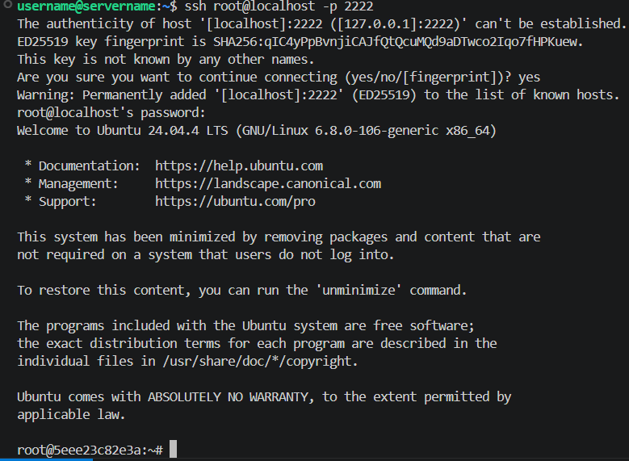

Zalogowano pomyślnie

Wady i zalety komunikacji rpzez SSH:

**Zalety**
*   Wsparcie dla narzędzi zewnętrznych: Umożliwia integrację z systemami, które natywnie komunikują się przez SSH, takimi jak starsze serwery CI/CD (np. Jenkins)

*   Zdalne środowiska programistyczne: Pozwala na bezpośrednie podłączenie nowoczesnych środowisk IDE (np. VS Code Remote) do wnętrza kontenera, co ułatwia debugowanie w środowisku identycznym z produkcyjnym

*   Uproszczony transfer plików: Wykorzystanie protokołów scp oraz sftp pozwala na łatwe przesyłanie danych bez konieczności używania specyficznych komend silnika kontenerowego

**Wady**
*   Zwiększenie powierzchni ataku: Każda dodatkowa usługa (demon SSHD) stanowi potencjalny wektor ataku i wymaga osobnego zarządzania aktualizacjami oraz poświadczeniami (hasła/klucze)

*   Utrata ulotności: Manualne wprowadzanie zmian w kontenerze poprzez sesję SSH sprzyja powstawaniu różnic między stanem faktycznym a definicją w pliku Dockerfile. W przypadku restartu kontenera, wszelkie zmiany nietrwałe zostają utracone

### Przygotowanie do uruchomienia serwera Jenkins

Przygotowanie serwera dla jenkinsa:

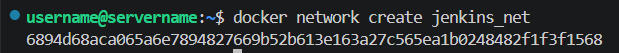

Uruchomienie Docker-in-Docker (DIND):

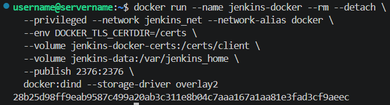

Uruchomienie instancji Jenkinsa:

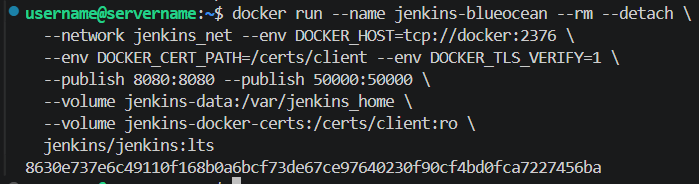

Działające kontenery:

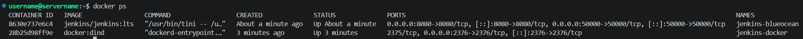

Ekran tworzenia konta po zalogowaniu jako admin:

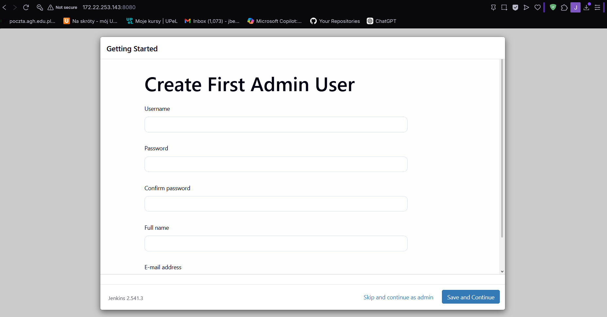

