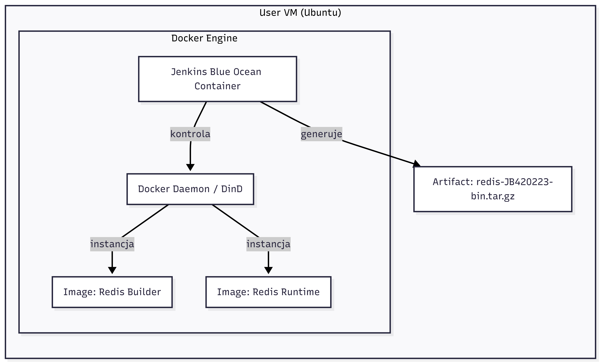
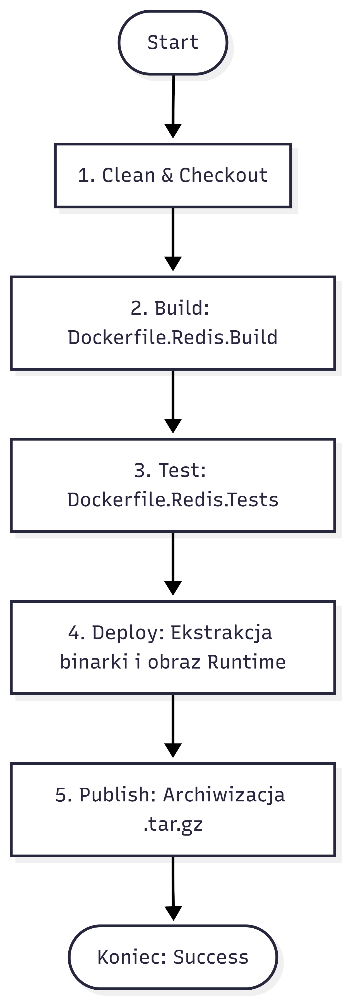
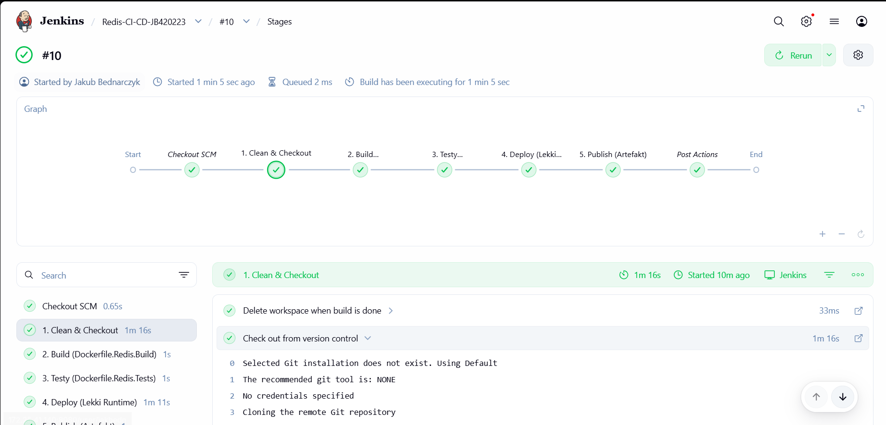
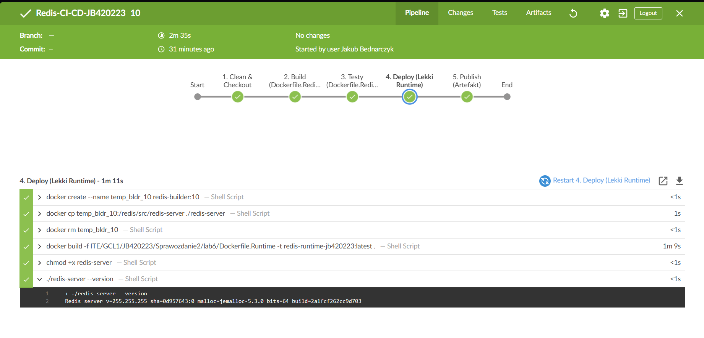
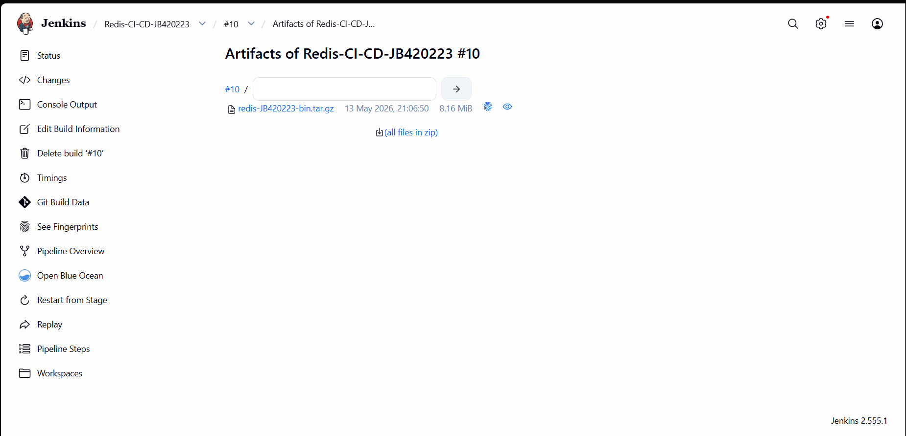

# Sprawozdanie Metodyki DevOps
Jakub Bednarczyk

## Lab 5 Pipeline, Jenkins, izolacja etapów

### Utworzenie instancji Jenkins
Jenkins to kompletny serwer CI/CD z silnikiem pipeline, schedulerem, agentami i systemem pluginów, a Blue Ocean to jedynie nowoczesny interfejs graficzny oraz zestaw pluginów, które same nie wystarczą.

Zaczynamy od setup'u jenkinsa z oficjalnej instrukcji dla linuxa:
https://www.jenkins.io/doc/book/installing/docker/

Po jej wykonaniu powinniśmy być zalogowaniu do Jenkinsa (w przypadku pracy z maszyną wirtualną zamiast local host'a w adresie jenkinsa jest jej adres)

Jenkins został skonfigurowany, czas na upewnienie się że logi porpawnie się zapisują, tworzymy przykładowy job i odpalamy build pokazowy:

Następnie sprawdzamy czy logi są zapisane na woluminie.
Pierwsze podpinamy się do woluminy jenkinsa:

<pre>
docker volume inspect jenkins-data | grep Mountpoint
</pre>

by następnie podejrzeć logi:

Gdy wiemy że logi z build'ów są zapisywane na woluminie możęmy przejść dalej

### Zadanie wstępne: uruchomienie
Stworzono nowy job który uruchamiał komendę `uname -a`

Dalej stowrzono job który sprawdza cyz godzina ejst nieparzysta, nie była więc cały build zakończył się błędem, mimo żę logika wykonała się poprawnie

A na końcu pobrano stworzono job który pobiera najnowszy obraz ubuntu

Poprawnie pobrał obraz

### Obiekt typu pipeline
Pierwsze tworzymy skrypt który definiuje pipeline:

<pre>
pipeline {
    agent any

    stages {
        stage('Klonowanie') {
            steps {
                git branch: 'JB420223', 
                    url: 'https://github.com/InzynieriaOprogramowaniaAGH/MDO2026s_ITE.git'
            }
        }

        stage('Budowanie obrazu z dockerfile') {
            steps {
                script {
                    dir('ITE/GCL1/JB420223/Sprawozdanie1/lab4') {
                        sh 'docker build -f Dockerfile.Redis.Env -t redis-env-jb420223:latest .'
                    }
                }
            }
        }

        stage('Weryfikacja') {
            steps {
                sh 'docker images | grep redis-env-jb420223'
            }
        }
    }
}
</pre>

Następnie wykonujemy pipeline:

Następnie uruchamiamy build drugi raz:

Jest to dużo szybsze ponieważ poprzednie zmiany są cache'owane:

### Opis celu

Wymagania:
*   System operacyjny fedora:40
*   Kompilatory i narzędzia builda: gcc, gcc-c++, make, pkgconf
*   Biblioteki systemowe: openssl-devel
*   Git
*   Środowisko testowe tcl
*   Narzędzia pomocnicze systemu diffutils, bash, which, procps-ng.
*   Dostęp do Internetu w celu pobrania repozytorium https://github.com/redis/redis.git
*   Miejsce na dysku wewnątrz kontenera na skompilowane binaria

## Lab 6 i 7: Pipeline CI/CD (Automatyzacja Redis)

### Architektura i analiza problemu technologicznego
Celem tej części laboratorium było przeniesienie manualnego procesu budowania i testowania serwera Redis (zrealizowanego w Lab 3 i 4) do pełnej, zautomatyzowanej formy pipeline'u CI/CD (Pipeline).

**Analiza izolacji i etapów:**
*   **Środowisko Build:** Wykorzystano przygotowany wcześniej `Dockerfile.Redis.Build` (Fedora 40) z katalogu Lab 3. Zawiera on pełny zestaw narzędzi kompilacji (`gcc`, `make`, `openssl-devel`).
*   **Środowisko Test:** Wykorzystano `Dockerfile.Redis.Tests` (Lab 3), który bazując na obrazie builda, przeprowadza automatyczne testy jednostkowe Redisa (`make test`).
*   **Środowisko Runtime (Wdrożenie):** W celu optymalizacji stworzono nowy, lekki `Dockerfile.Runtime`. Zamiast kopiować cały kod źródłowy, zawiera on jedynie niezbędne biblioteki oraz gotową binarkę `redis-server` wyekstrahowaną z kontenera budującego.

#### Diagram Aktywności (Proces CI/CD)

#### Diagram Wdrożeniowy (Deployment Diagram)

*Diagram wdrożeniowy pokazujący relację między serwerem Jenkins, demonem Dockera (DinD) oraz powstającymi artefaktami.*

---

### Deklaracja Infrastruktury (Infrastructure as Code)

Proces budowania został w pełni opisany w pliku `Jenkinsfile`, co czyni infrastrukturę częścią kodu (IaC). Pipeline korzysta z izolacji etapów w osobnych kontenerach, co gwarantuje powtarzalność buildu.

**Plik: ITE/GCL1/JB420223/Sprawozdanie2/lab6/Dockerfile.Runtime**
<pre>
FROM fedora:40
RUN dnf install -y openssl && dnf clean all
WORKDIR /app
COPY redis-server /usr/local/bin/redis-server
EXPOSE 6379
CMD ["redis-server"]
</pre>

**Plik: ITE/GCL1/JB420223/Sprawozdanie2/lab6/Jenkinsfile**

<pre>
pipeline {
    agent any
    
    environment {
        IMAGE_NAME = "redis-runtime-jb420223"
        BUILD_DIR = "ITE/GCL1/JB420223/Sprawozdanie2/lab5"
        RUNTIME_DIR = "ITE/GCL1/JB420223/Sprawozdanie2/lab6"
    }

    stages {
        stage('1. Clean & Checkout') {
            steps {
                cleanWs()
                checkout scm
            }
        }

        stage('2. Build (Dockerfile.Redis.Build)') {
            steps {
                script {
                    sh "docker build -f ${BUILD_DIR}/Dockerfile.Redis.Build -t redis-builder:${env.BUILD_NUMBER} ${BUILD_DIR}"
                }
            }
        }

        stage('3. Testy (Dockerfile.Redis.Tests)') {
            steps {
                script {
                    sh "docker tag redis-builder:${env.BUILD_NUMBER} redis_build:latest"
                    sh "docker build -f ${BUILD_DIR}/Dockerfile.Redis.Tests -t redis-tester:${env.BUILD_NUMBER} ${BUILD_DIR}"
                    echo "Testy zakonczone sukcesem."
                }
            }
        }

        stage('4. Deploy (Lekki Runtime)') {
            steps {
                script {
                    sh "docker create --name temp_bldr_${env.BUILD_NUMBER} redis-builder:${env.BUILD_NUMBER}"
                    sh "docker cp temp_bldr_${env.BUILD_NUMBER}:/redis/src/redis-server ./redis-server"
                    sh "docker rm temp_bldr_${env.BUILD_NUMBER}"
                    
                    sh "docker build -f ${RUNTIME_DIR}/Dockerfile.Runtime -t ${IMAGE_NAME}:latest ."
                    
                    sh "chmod +x redis-server"
                    sh "./redis-server --version"
                }
            }
        }

        stage('5. Publish (Artefakt)') {
            steps {
                script {
                    sh "tar -czvf redis-JB420223-bin.tar.gz redis-server"
                    archiveArtifacts artifacts: 'redis-JB420223-bin.tar.gz', fingerprint: true
                }
            }
        }
    }

    post {
        always {
            sh "docker rmi redis-builder:${env.BUILD_NUMBER} redis-tester:${env.BUILD_NUMBER} || true"
        }
    }
}
</pre>

### Wyniki i Archiwizacja (Definition of Done)

#### Przebieg pipeline'u w Blue Ocean
Pipeline został wykonany pomyślnie. Wszystkie etapy (Build, Test, Deploy, Publish) zakończyły się statusem SUCCESS.

#### Logi z weryfikacji (Smoke Test)
W logach etapu Deploy widać, że skompilowana binarka została poprawnie wyodrębniona i jest funkcjonalna (wyświetlenie wersji).

#### Archiwizacja artefaktu
Końcowy artefakt w postaci spakowanej binarki jest dostępny do pobrania bezpośrednio z interfejsu Jenkinsa, co zamyka proces publikacji.

### Analiza formy redystrybucyjnej
W projekcie zdecydowano się na podwójną formę publikacji:
*   **Archiwum .tar.gz:** Pozwala na szybkie przeniesienie samej binarki na systemy, które nie posiadają zainstalowanego silnika Docker. Jest to format lekki i uniwersalny dla systemów Linux.
*   **Obraz Docker (Runtime):** Jest to docelowa forma wdrożenia (Deploy). Dzięki zastosowaniu obrazu opartego na Fedorze (bez narzędzi kompilacji), obraz jest bezpieczny i gotowy do uruchomienia w architekturze mikroserwisowej.

### Wnioski
*   **Redukcja długu technologicznego:** Wykorzystanie obrazów z Lab 3 pozwoliło na szybką automatyzację bez konieczności redefiniowania środowiska budowania.
*   **Optymalizacja rozmiaru i bezpieczeństwa:** Dzięki rozdzieleniu etapu kompilacji od uruchomienia (multi-stage), końcowy obraz runtime nie zawiera kodu źródłowego ani narzędzi kompilacji, co jest dobrą praktyką bezpieczeństwa.
*   **Wersjonowanie IaC:** Umieszczenie logiki CI/CD w pliku `Jenkinsfile` zapewnia pełną powtarzalność procesu na dowolnym serwerze Jenkins z dostępem do Dockera.
*   **Odniesienie do diagramu aktywności:** Ostatecznie zrealizowany pipeline w pełni pokrywa się z założeniami przedstawionymi na diagramie aktywności. Nie stwierdzono rozbieżności między fazą projektową a implementacją w Jenkinsfile.