# Sprawozdanie Metodyki DevOps
Jakub Bednarczyk

## Lab 5 Pipeline, Jenkins, izolacja etapów

### Utworzenie instancji Jenkins
Jenkins to kompletny serwer CI/CD z silnikiem pipeline, schedulerem, agentami i systemem pluginów, a Blue Ocean to jedynie nowoczesny interfejs graficzny oraz zestaw pluginów, które same nie wystarczą.

Zaczynamy od setup'u jenkinsa z oficjalnej instrukcji dla linuxa:
https://www.jenkins.io/doc/book/installing/docker/

Po jej wykonaniu powinniśmy być zalogowaniu do Jenkinsa (w przypadku pracy z maszyną wirtualną zamiast local host'a w adresie jenkinsa jest jej adres)

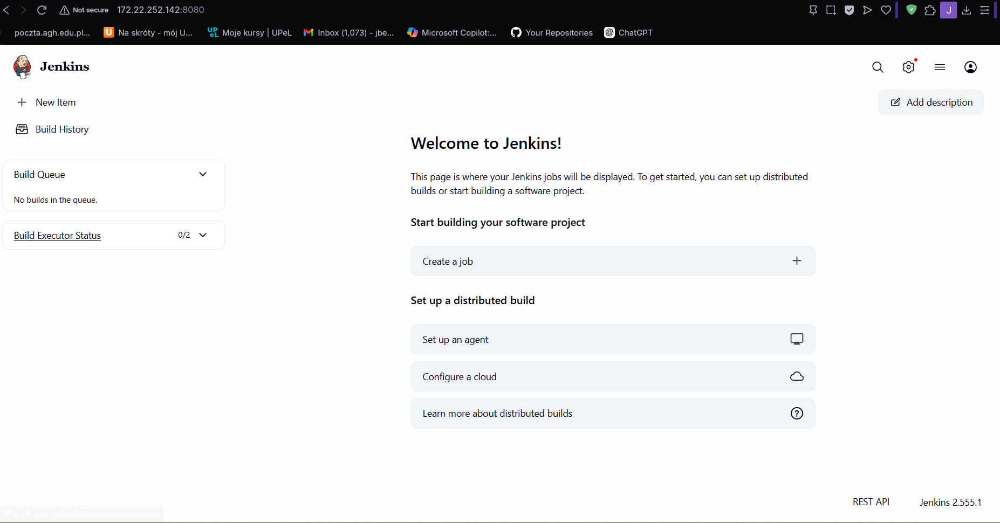

Jenkins został skonfigurowany, czas na upewnienie się że logi porpawnie się zapisują, tworzymy przykładowy job i odpalamy build pokazowy:

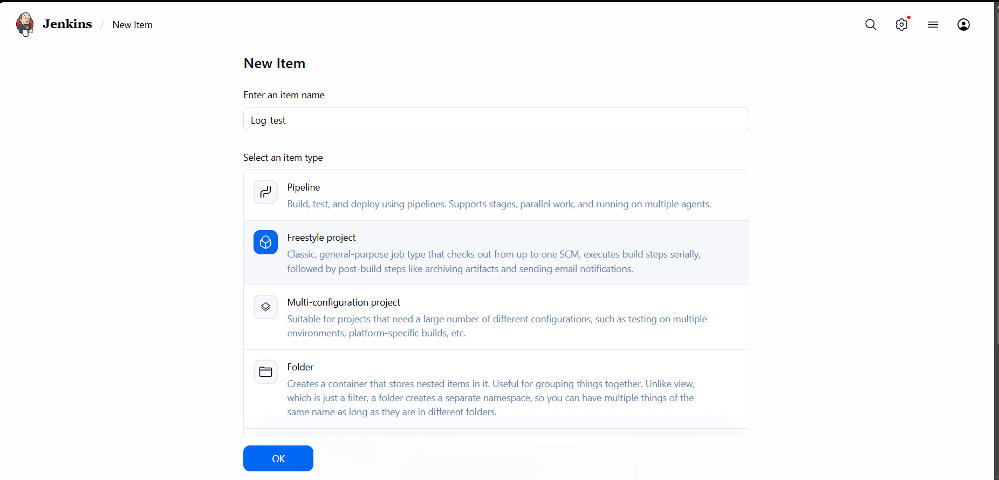

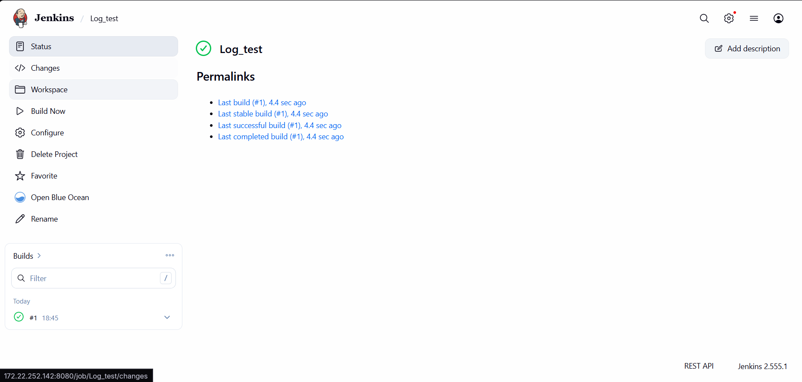

Następnie sprawdzamy czy logi są zapisane na woluminie.
Pierwsze podpinamy się do woluminy jenkinsa:

<pre>
docker volume inspect jenkins-data | grep Mountpoint
</pre>

by następnie podejrzeć logi:

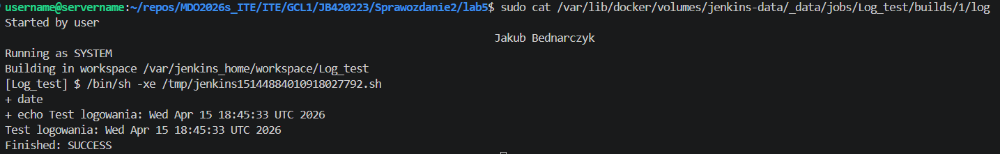

Gdy wiemy że logi z build'ów są zapisywane na woluminie możęmy przejść dalej

### Zadanie wstępne: uruchomienie
Stworzono nowy job który uruchamiał komendę `uname -a`

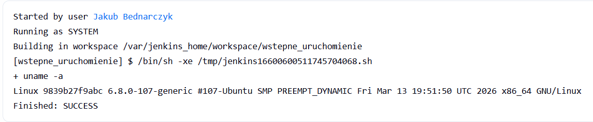

Dalej stowrzono job który sprawdza cyz godzina ejst nieparzysta, nie była więc cały build zakończył się błędem, mimo żę logika wykonała się poprawnie

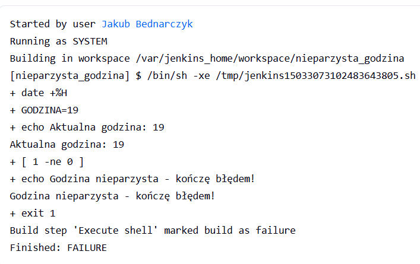

A na końcu pobrano stworzono job który pobiera najnowszy obraz ubuntu

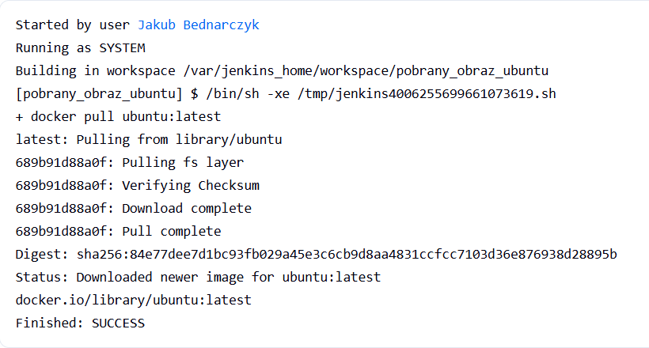

Poprawnie pobrał obraz

### Obiekt typu pipeline
Pierwsze tworzymy skrypt który definiuje pipeline:

<pre>
pipeline {
    agent any

    stages {
        stage('Klonowanie') {
            steps {
                git branch: 'JB420223', 
                    url: 'https://github.com/InzynieriaOprogramowaniaAGH/MDO2026s_ITE.git'
            }
        }

        stage('Budowanie obrazu z dockerfile') {
            steps {
                script {
                    dir('ITE/GCL1/JB420223/Sprawozdanie1/lab4') {
                        sh 'docker build -f Dockerfile.Redis.Env -t redis-env-jb420223:latest .'
                    }
                }
            }
        }

        stage('Weryfikacja') {
            steps {
                sh 'docker images | grep redis-env-jb420223'
            }
        }
    }
}
</pre>

Następnie wykonujemy pipeline:

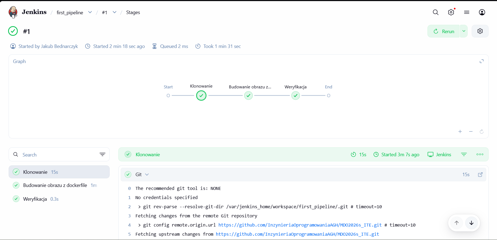

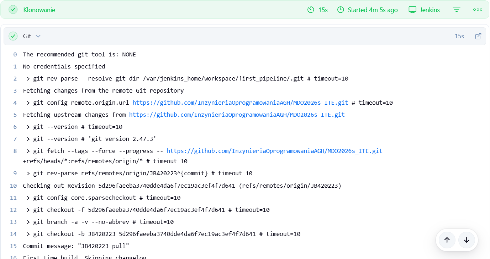

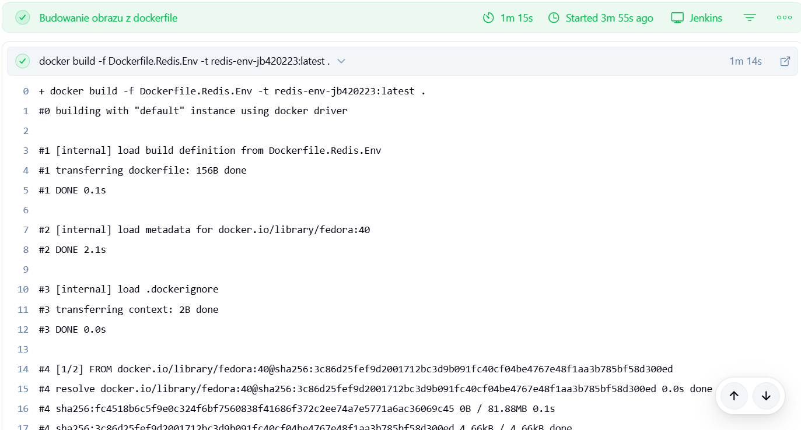

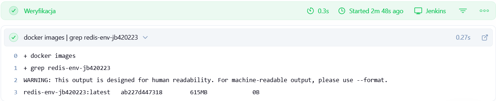

Następnie uruchamiamy build drugi raz:

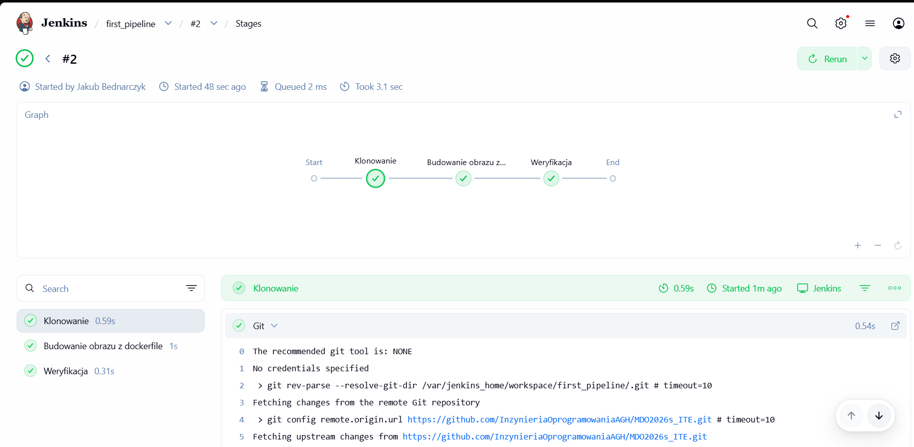

Jest to dużo szybsze ponieważ poprzednie zmiany są cache'owane:

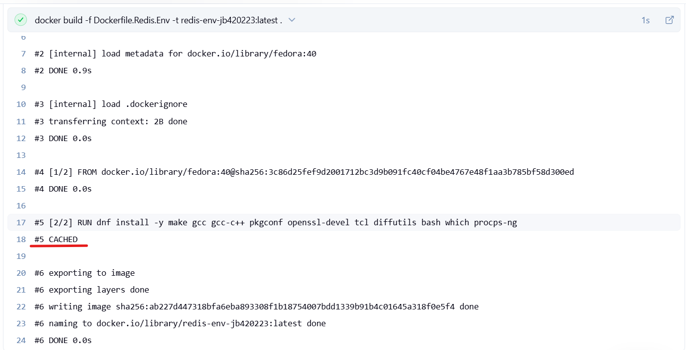

### Opis celu

Wymagania:
*   System operacyjny fedora:40
*   Kompilatory i narzędzia builda: gcc, gcc-c++, make, pkgconf
*   Biblioteki systemowe: openssl-devel
*   Git
*   Środowisko testowe tcl
*   Narzędzia pomocnicze systemu diffutils, bash, which, procps-ng.
*   Dostęp do Internetu w celu pobrania repozytorium https://github.com/redis/redis.git
*   Miejsce na dysku wewnątrz kontenera na skompilowane binaria
