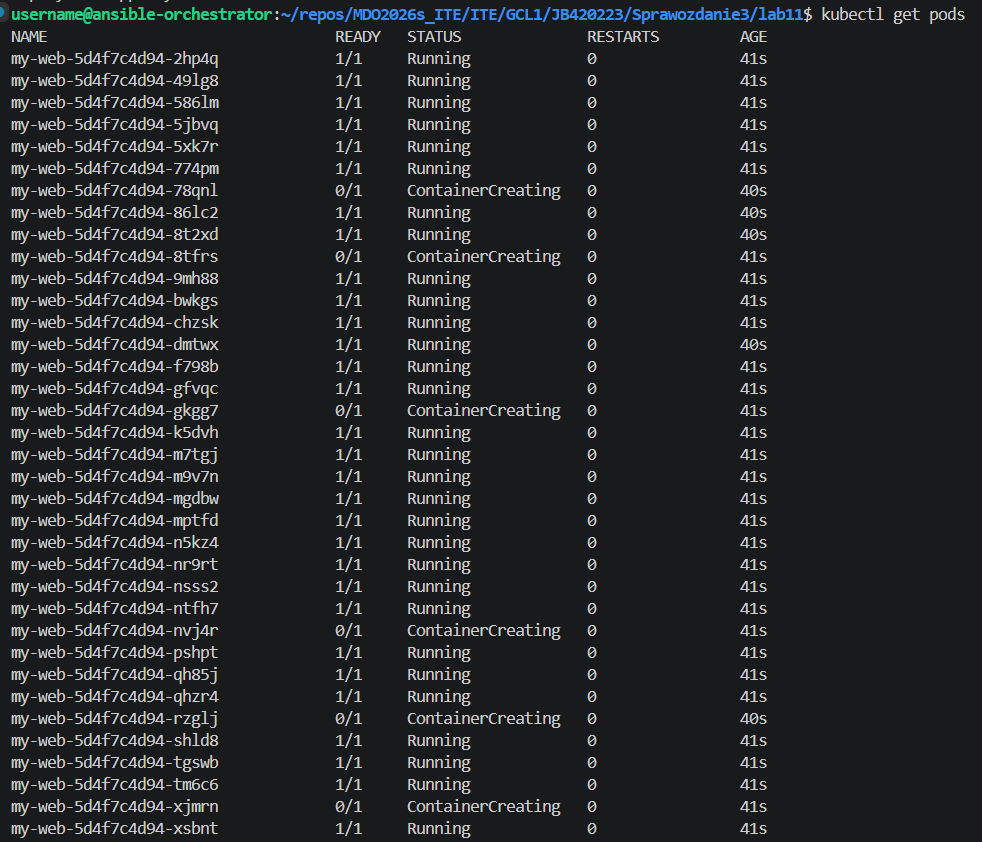
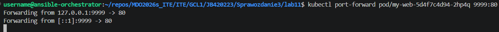
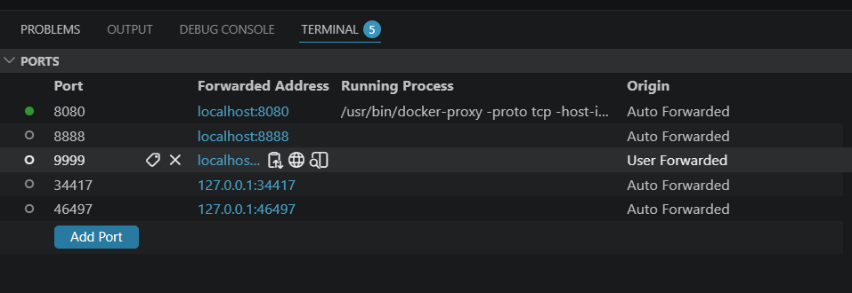
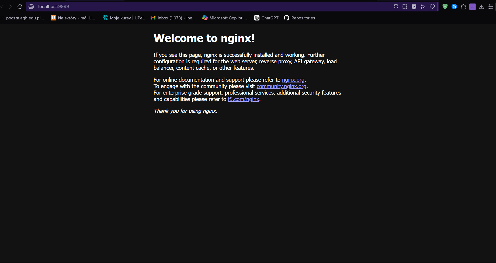
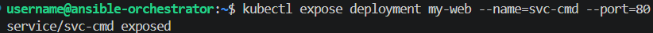
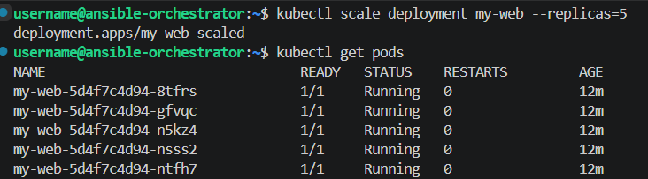

# Sprawozdanie Metodyki DevOps
Jakub Bednarczyk

## Lab 8 Automatyzacja i zdalne wykonywanie poleceń za pomocą Ansible

### Instalacja zarządcy Ansible

Utworzono maszynę wirtualną w hyper-v która posiada:
* System [Ubuntu](https://ubuntu.com/download/server)
* 2 GB RAM
* 16 GB miejsca na dysku
* Program tar
* Serwer OpenSSH
* Default switch (dostęp do internetu)

Ważnym jest wyłączenie Secure Boot, w innym przypakdu masyzna nie rozpocznie instalacji z iso

Zapisano checkpoint


Zainstalowano program Ansible na głównej maszynie


Ustawiono dostęp poprzez ssh do maszyny ansible poprzez komendy z poziomu głównej maszyny (użyto już istniejącego klucza na maszynie głównej)

```
ssh-copy-id ansible@172.30.174.56
```
```
ssh ansible@172.30.174.56
```


### Inwentaryzacja

Zmieniono nazwy hostnamectl

Główna maszyna
```
sudo hostnamectl set-hostname ansible-orchestrator
```

Maszyna ansible
```
sudo hostnamectl set-hostname ansible-target
```

Aby ustawić nazwę DNS maszyny ansible w głównej maszynie trzeba do pliku `/etc/hosts` dopisać `ip_maszyny nazwa_w_dns`

```
172.30.170.110 ansible-orchestrator // Główna
172.30.174.56 ansible-target // Ansible
```

Połączenie istnieje i jest stabilne


Stworzono plik inwentaryzacji

```
// Plik: inventory.ini

[Orchestrators]
ansible-orchestrator ansible_connection=local

[Endpoints]
ansible-target ansible_user=ansible
```

Połączenie ansible'a z maszynami jest poprawne


### Zdalne wywoływanie procedur

Utworzenie pliku `tasks.yml`

```
---
- name: Laboratorium - Zdalne wywoływanie procedur
  hosts: all
  become: no

  tasks:
    - name: 1. Pingowanie maszyn przez moduł Ansible
      ansible.builtin.ping:

    - name: 2. Kopiowanie pliku inwentaryzacji na Endpoints
      ansible.builtin.copy:
        src: inventory.ini
        dest: /home/ansible/inventory_backup.ini
        mode: '0644'
      when: "'Endpoints' in group_names"

    - name: 3. Aktualizacja listy pakietów (apt update)
      ansible.builtin.apt:
        update_cache: yes
      become: yes
      ignore_errors: yes

    - name: 4. Restart usługi SSH (Ubuntu)
      ansible.builtin.systemd:
        name: ssh
        state: restarted
      become: yes
      ignore_errors: yes

    - name: 4b. Restart usługi RNGD
      ansible.builtin.systemd:
        name: rngd
        state: restarted
      become: yes
      ignore_errors: yes
```

Użycie pliku `tasks.yml` w ansible


Pierwszy test wykazał że plik wykonuje to co miał robić dopóki nie dochodzi do wykorzystania sudo na ansible-target. Jednak co ważne nic się nie wysypało bo błędy są ignorowane. Sudo potrzebuje hasła, aby zatwierdzić komendę, dlatego musimy ustawić użytkownikowi drugiej maszyny uprawnienia tak, aby nie musiał wpisywać hasła przy sudo, aby to zrobić musimy dopisać `ansible ALL=(ALL) NOPASSWD:ALL` po wywołaniu komendy `sudo visudo`. Oprócz tego nie było usługi rngd, dlatego musimy ją zainstalować na obu maszynach za pomocą komendy `sudo apt install rng-tools`

Po tych zmianach


Wszystko działa tak jak powinno

Następnie wyłączono ssh na maszynie ansible


I ponownie spróbowano się połączyć


Maszyna od razu jest nieosiągalna

Potem odłączono kartę sieciową w hyper - v ustawiając `Virtual switch` na `Not connected`


Tym razem trzeba chwilę poczekać (kilka sekund), aby pojawił się komunikat `Unreachable`


### Zarządzanie stworzonym artefaktem

Na głównej maszynie wygenerowano rolę

```
ansible-galaxy role init redis_deploy
```

Następnie edytujemy plik `main.yml` w folderze `meta` naszej roli

```
galaxy_info:
  author: Jakub Bednarczyk
  description: desc
  license: MIT
  min_ansible_version: 2.1
  platforms:
    - name: Ubuntu
      versions:
        - plucky

dependencies: []
```

Następnie do folderu `files` wrzucamy plik artefaktu

Potem w folderze `tasks` edytujemy plik `main.yml` tak aby:

* Przeprowadzał sanity check maszyny docelowej przed rozpoczęciem wdrożenia (np. * sprawdzenie dostępnej pamięci RAM), upewniając się, że skrypt nie ulegnie awarii w przypadku niepowodzenia tego kroku

* Zapewniał obecność środowiska Docker, instalując go za pomocą modułów Ansible (w tym zależności, klucze GPG oraz repozytoria) bezpośrednio na maszynie docelowej

* Przesyłał i rozpakowywał artefakt (plik aplikacji tar.gz) na zdalną maszynę do wyznaczonego katalogu wdrożeniowego

* Uruchamiał aplikację wewnątrz kontenera Docker, mapując odpowiednie porty oraz montując wolumen z przesłanym plikiem binarnym i wymaganymi zależnościami

* Weryfikował poprawne uruchomienie aplikacji, sprawdzając rzeczywisty stan kontenera (czy jego status to running), a nie tylko sam fakt pomyślnego zakończenia wcześniejszych zadań w playbooku

* Oczyszczał środowisko docelowe poprzez zatrzymanie, usunięcie kontenera oraz skasowanie wdrożonych plików aplikacji po zakończeniu testów

```
---
- name: Sanity check - Sprawdzenie wolnej pamięci RAM przed wdrożeniem
  ansible.builtin.shell: free -m | awk '/^Mem:/{print $4}'
  register: free_memory
  ignore_errors: yes

- name: Wyświetl ostrzeżenie, jeśli pamięć jest na wyczerpaniu
  ansible.builtin.debug:
    msg: "UWAGA: Wykryto mało pamięci RAM, ale kontynuuję wdrożenie!"
  when: free_memory.stdout | int < 200
  ignore_errors: yes

- name: Instalacja wymaganych zależności systemowych
  ansible.builtin.apt:
    name:
      - apt-transport-https
      - ca-certificates
      - curl
      - software-properties-common
      - python3-pip
    state: present
    update_cache: yes
  become: yes

- name: Upewnij się, że katalog na klucze repozytoriów istnieje
  ansible.builtin.file:
    path: /etc/apt/keyrings
    state: directory
    mode: '0755'
  become: yes

- name: Dodanie oficjalnego klucza GPG Dockera
  ansible.builtin.get_url:
    url: https://download.docker.com/linux/ubuntu/gpg
    dest: /etc/apt/keyrings/docker.asc
    mode: '0644'
  become: yes

- name: Rejestracja repozytorium Docker w systemie
  ansible.builtin.apt_repository:
    repo: "deb [arch=amd64 signed-by=/etc/apt/keyrings/docker.asc] https://download.docker.com/linux/ubuntu {{ ansible_distribution_release }} stable"
    state: present
  become: yes

- name: Instalacja silnika Docker (docker-ce)
  ansible.builtin.apt:
    name: docker-ce
    state: present
    update_cache: yes
  become: yes

- name: Upewnij się, że usługa Docker jest uruchomiona i włączona
  ansible.builtin.systemd:
    name: docker
    state: started
    enabled: yes
  become: yes

- name: Utworzenie dedykowanego katalogu pod aplikację
  ansible.builtin.file:
    path: /opt/redis_app
    state: directory
    mode: '0755'
  become: yes

- name: Przesłanie i automatyczne wypakowanie archiwum binarnego
  ansible.builtin.unarchive:
    src: redis-JB420223-bin.tar.gz
    dest: /opt/redis_app/
  become: yes

- name: Uruchomienie aplikacji w kontenerze
  ansible.builtin.shell: |
    docker stop redis_runtime_container || true
    docker rm redis_runtime_container || true
    docker run -d \
      --name redis_runtime_container \
      --restart always \
      -v /opt/redis_app:/app \
      -p 6379:6379 \
      ubuntu:latest /app/redis-server
  become: yes

- name: Oczekiwanie na inicjalizację Redis
  ansible.builtin.pause:
    seconds: 5

- name: Sprawdzenie statusu kontenera przez docker ps
  ansible.builtin.shell: docker ps --filter "name=redis_runtime_container" --format "{{"{{.Status}}"}}"
  register: container_status
  become: yes

- name: Walidacja czy status kontenera zawiera 'Up'
  ansible.builtin.assert:
    that:
      - "'Up' in container_status.stdout"
    fail_msg: "Błąd: Aplikacja wewnątrz kontenera nie działa poprawnie!"
    success_msg: "Sukces: Kontener wdrożony i działa w tle."

- name: Czyszczenie - Zatrzymanie i usunięcie kontenera testowego
  ansible.builtin.shell: |
    docker stop redis_runtime_container || true
    docker rm redis_runtime_container || true
  become: yes

- name: Czyszczenie - Skasowanie katalogu aplikacyjnego wraz z artefaktami
  ansible.builtin.file:
    path: /opt/redis_app
    state: absent
  become: yes
```

Następnie tworzymy nowy plik `tasks2.yml` który wywoła naszą rolę

```
---
- name: Zarządzanie artefaktem z Pipeline
  hosts: all
  vars:
    ansible_python_interpreter: /usr/bin/python3

  roles:
    - redis_deploy
```

Oraz należy wykomentować główną maszynę z pliku `inventory.ini`

```
#[Orchestrators]
#ansible-orchestrator ansible_connection=local

[Endpoints]
ansible-target ansible_user=ansible
```

Wtedy cały proces przejdzie prawidłowo bez żadnych przeszkód


## Lab 9 Pliki odpowiedzi dla wdrożeń nienadzorowanych

Zaczęto od pobrania wersji systemu fedora: `Fedora-Everything-netinst-x86_64-44-1.7.iso`

Po pobraniu utworzono maszynę wirtualną na podstawie pliku obrazu z 4 GB pamięci RAM i 16 GB pojemności dysku wirtualnego, oraz default switch'em (dostęp do internetu).

Ważnym jest wyłączenie Secure Boot, w innym przypakdu masyzna nie rozpocznie instalacji z iso

Miłym zaskoczeniem jest UI instalatora w którym wybieramy domyślny dysk oraz tworzymy nowego zwykłego usera `fedora_user`


Następnie wysietlamy treść pliku odpowiedzi na konsolę (w przypadku odmowy uprawnień warto spróbować `sudo -i`)


Następnie modyfikujemy plik odpowiedzi dodając:

* Zewnętrzne źródła instalacyjne oraz oficjalne repozytoria systemu Fedora 44, umożliwiające instalatorowi sieciowemu bezproblemowe pobranie pakietów.

* Wymóg automatycznego formatowania i czyszczenia nośników (zerombr, clearpart --all), co pozwala na bezdotykową reinstalację systemu „w kółko”

* Niestandardową nazwę hosta (fedora-target-jb) oraz nowego użytkownika z uprawnieniami administratora (devops-jb)

* Instalację środowiska Docker bezpośrednio na etapie konfiguracji pakietów systemu w sekcji %packages.

* Skrypt postinstalacyjny w sekcji %post, tworzący dedykowaną usługę systemd, która automatycznie pobiera i uruchamia kontener z aplikacją zaraz po pierwszym uruchomieniu systemu

* Dyrektywę automatycznego restartu (reboot) po zakończeniu całego procesu instalacji

```
// Zmodyfikowany plik odpowiedzi

text
cmdline

url --mirrorlist=http://mirrors.fedoraproject.org/mirrorlist?repo=fedora-44&arch=x86_64
repo --name=updates --mirrorlist=http://mirrors.fedoraproject.org/mirrorlist?repo=updates-released-f44&arch=x86_64
repo --name=docker-ce-stable --baseurl=https://download.docker.com/linux/fedora/44/x86_64/stable

keyboard --vckeymap=pl --xlayouts='pl'
lang en_US.UTF-8

%packages
@^custom-environment
wget
curl
docker-ce
docker-ce-cli
containerd.io
%end

firstboot --enable

zerombr
clearpart --all --initlabel
autopart
bootloader --location=mbr

timezone Europe/Warsaw --utc

network --bootproto=dhcp --device=link --activate
network --hostname=fedora-target-jb

rootpw --lock
user --groups=wheel --name=devops-jb --password=admin1234 --gecos="devops-jb"

reboot

%post --log=/root/kickstart_post.log

systemctl enable docker

cat << 'EOF' > /etc/rc.d/init.d/start_app.sh
#!/bin/bash
sleep 10
docker run -d --name moj_pipeline_app --restart always -p 6379:6379 redis:latest
EOF

chmod +x /etc/rc.d/init.d/start_app.sh

cat << 'EOF' > /etc/systemd/system/run-app-once.service
[Unit]
Description=Uruchomienie aplikacji z Pipeline po pierwszym boocie
After=docker.service network-online.target
Wants=docker.service network-online.target

[Service]
Type=oneshot
ExecStart=/etc/rc.d/init.d/start_app.sh
RemainAfterExit=yes

[Install]
WantedBy=multi-user.target
EOF

systemctl enable run-app-once.service

%end
```

Następnym krokiem jest isntalacja fedory na podstawie zmodyfikowanego pliku, aby nie musieć go ręcznie wpiysywać. Jendak najpierw musimy go w jakiś sposób podać instalatorowi, można zrobić to poprzez postawienie małego serwera https i udostępnienia przez niego pliku instalatorowi

W tym celu na głównej maszynie w folderze ze zmodyfikowanym plikiem otwieramy serwer:

```
python3 -m http.server 8000 // 8080 był zajęty
```

Potem tworzymy drugą maszynę na fedorę identyczną jak poprzednio z takimi samymi parametrami

Po uruchomieniu i połączeniu się z maszyną zaznaczamy (nie klikamy!) opcję Fedora 44 (lub inna wersja np. 38), i klikamy 'e', następnie dopisujemy na końcu:

```
inst.ks=http://ip_maszyny_z_plikiem:8000/nazwa_pliku.cfg
```


Następnie w celu przejścia dalej naciskamy 'F10'

Po instalacji możemy zalogować się na automatycznie utworzone konto dowodząc że plik jest poprawny i instalacja przebiegła automatycznie i poprawnie


Sprawdzono również działanie mechanizmów postinstalacyjnych oraz statusu automatycznie wdrożonej aplikacji


* `sudo docker ps`: Pokazuje działający kontener moj_pipeline_app (bazujący na redis:latest). Kontener działa stabilnie od 8 minut (Up 8 minutes) i ma wystawiony port 6379.

* `sudo cat /root/kickstart_post.log`: Potwierdza, że sekcja %post instalatora Kickstart pomyślnie utworzyła dowiązania symboliczne (symlinki) dla usłgi Docker oraz Twojej dedykowanej usługi startowej.

* `sudo systemctl status run-app-once.service`: Pokazuje status active (exited) z kodem status=0/SUCCESS. Oznacza to, że przygotowana usługa systemd odpaliła skrypt, skrypt pomyślnie wykonał docker run (w logach na dole widać warstwy pobierania obrazu: Pull complete), po czym usługa zakończyła pracę, zostawiając kontener uruchomiony w tle.


## Lab 10 Wdrażanie na zarządzalne kontenery: Kubernetes

### Instalacja klastra Kubernetes

Wpierw pobrano i zainstalowano minikube

```
curl -LO https://github.com/kubernetes/minikube/releases/latest/download/minikube-linux-amd64

sudo install minikube-linux-amd64 /usr/local/bin/minikube && rm minikube-linux-amd64

minikube start
```


Większość działa poprawnie ale nie ma kubectl

Następnie pobieramy kubectl, instalujemy i weryfikujemy instalację 

```
curl -LO "https://dl.k8s.io/release/$(curl -L -s https://dl.k8s.io/release/stable.txt)/bin/linux/amd64/kubectl"

sudo install -o root -g root -m 0755 kubectl /usr/local/bin/kubectl

kubectl version --client

kubectl cluster-info

alias kubectl="minikube kubectl --"
```


Jak widać instalacje przebiegły poprawnie, możemy teraz uruchomić panel kubernetesa prz okazji weryfikując jego stan

```
minikube dashboard
```


Jak widać panel uruchamia się poprawnie

Następnie zapoznano się z dokumentacją kubernetesa i jego koncepcjami


### Analiza posiadanego kontenera

Najpierw tworzymy odpowienid obraz z serwerem, do tego celu wykorzystamy artefakt wcześneijszego builda:


Ładujemy go do minikube i odpalamy jako poda

```
minikube image load my-redis:v1

kubectl run redis-jednopodowe --image=my-redis:v1 --image-pull-policy=Never --port=6379 --labels app=redis-jednopodowe
```


Redis w środku poda żyje i ma się dobrze


### Uruchamianie oprogramowania

Skoro Redis działa należy teraz wyprowadzić jego portu tak aby byl dostępny z zewnątrz

```
kubectl port-forward pod/redis-jednopodowe 6379:6379
```


Możemy komunikować się z Redisem z poziomu głownego systemu


### Przekucie wdrożenia manualnego w plik wdrożenia

Tworzymy plik konfiguracyjny YAML dla nginx

```
apiVersion: apps/v1
kind: Deployment
metadata:
  name: nginx-deployment
  labels:
    app: nginx
spec:
  replicas: 4
  selector:
    matchLabels:
      app: nginx
  template:
    metadata:
      labels:
        app: nginx
    spec:
      containers:
      - name: nginx
        image: nginx:latest
        ports:
        - containerPort: 80
```

Następnie wdrażamy nasz plik:


Oraz sprawdzamy jego stan


Funkcjonuje bez problemów

Teraz czas aby wyeksponować nginx jako serwis na porcie 8888 i sprawdzić połączenie

```
kubectl expose deployment nginx-deployment --type=ClusterIP --name=nginx-service --port=8888 --target-port=80
```


Usługa jest aktywna i działa prawidłowo

### Przygotowanie nowego obrazu

Tworzymy nowy obraz na bazie starego i ładujemy go do minikube


Nastepnie tworzymy plik `Dockerfile.Bad`

```
FROM my-redis:v1
CMD ["/usr/local/bin/redis-server", "--gupi-blad"]
```

i na jego podstawie tworzymy wadliwy obraz


i ładujemy go do minikube

```
minikube image load my-redis:v3-bug
```

Towrzymy następnie nowy plik wdrożenia `deployment2.yaml`

```
apiVersion: apps/v1
kind: Deployment
metadata:
  name: redis-deployment
  labels:
    app: my-redis
spec:
  replicas: 3
  selector:
    matchLabels:
      app: my-redis
  template:
    metadata:
      labels:
        app: my-redis
    spec:
      containers:
      - name: redis
        image: my-redis:v1
        imagePullPolicy: Never
        ports:
        - containerPort: 6379
```

Oraz wdrażamy go:

```
kubectl apply -f deployment2.yaml
```

Nastepnie symulujemy wdrożenie nowej wersji aplikacji


A potem jeszcze raz ale tym razem wprowadzamy wadliwy obraz


Widzimy że nasz pod się wywalił, dlatego trzeba zrobić undo


Teraz widzimy że pod działa poprawnie ponieważ przywróciliśmy starą wersję


### Kontrola wdrożenia

Sprawdzamy historię wdrożeń


Wywołanie polecenia kubectl rollout history pozwoliło na identyfikację pełnej historii zmian wdrożenia, w której rewizja numer 3 została jednoznacznie skorelowana z wadliwym obrazem my-redis:v3-bug. Szczegółowa inspekcja szablonu poda ujawniła, że to właśnie ta wersja wywołała błędy aplikacyjne na środowisku z powodu błędnej konfiguracji startowej kontenera. Przechowywanie takich metadanych przez Kubernetes udowadnia, jak kluczowa jest deklaratywna kontrola wersji, umożliwiająca administratorowi natychmiastowe wskazanie źródła awarii oraz precyzyjne wycofanie zmian do stabilnego stanu

Nastepnie stowrzono skrypt `verify_deployment.sh` który weryfikuje wdrożenie aplikacji

```
#!/bin/bash

DEPLOYMENT_NAME="redis-deployment"
TIMEOUT=60

echo "Rozpoczynam weryfikację wdrożenia: $DEPLOYMENT_NAME (Limit czasu: ${TIMEOUT}s)..."

# Sprawdzenie statusu rolloutu z twardym limitem czasowym
kubectl rollout status deployment/$DEPLOYMENT_NAME --timeout=${TIMEOUT}s

if [ $? -eq 0 ]; then
    echo "SUKCES: Wdrożenie zakończyło się pomyślnie w zadanym czasie!"
    exit 0
else
    echo "BŁĄD: Wdrożenie przekroczyło limit czasu lub zakończyło się awarią!"
    exit 1
fi

```

Należy mu nadać również odpowiednie uprawnienia

```
chmod +x verify_deployment.sh
```


Skrypt działa


### Strategie wdrożenia

#### Recreate

Plik `deployment-recreate.yaml`

```
apiVersion: apps/v1
kind: Deployment
metadata:
  name: redis-recreate
  labels:
    strategy: recreate
spec:
  replicas: 3
  strategy:
    type: Recreate
  selector:
    matchLabels:
      app: redis-recreate
  template:
    metadata:
      labels:
        app: redis-recreate
    spec:
      containers:
      - name: redis
        image: my-redis:v1
        imagePullPolicy: Never
        ports:
        - containerPort: 6379
```

Aby go przetestować wdrażamy go

```
kubectl apply -f deployment-canary.yaml
```

oraz włączamy podgląd na żywo:

```
kubectl get pods -l app=redis-recreate -w
```

a w innym terminalu

```
kubectl set image deployment/redis-recreate redis=my-redis:v2
```

Wszystkie 3 pody wchodzą jednocześnie w stan Terminating (liczba działających podów spadnie do zera). Dopiero gdy całkowicie znikają, status zmienia się na Pending -> ContainerCreating -> Running dla nowej wersji

#### Rolling Update

Plik `deployment-rolling.yaml`

```
apiVersion: apps/v1
kind: Deployment
metadata:
  name: redis-rolling
  labels:
    strategy: rolling-update
spec:
  replicas: 4
  strategy:
    type: RollingUpdate
    rollingUpdate:
      maxUnavailable: 2
      maxSurge: 25%
  selector:
    matchLabels:
      app: redis-rolling
  template:
    metadata:
      labels:
        app: redis-rolling
    spec:
      containers:
      - name: redis
        image: my-redis:v1
        imagePullPolicy: Never
        ports:
        - containerPort: 6379
---
apiVersion: v1
kind: Service
metadata:
  name: redis-rolling-service
spec:
  ports:
  - port: 6379
    targetPort: 6379
  selector:
    app: redis-rolling
```

Wyniki testów


Strategia Rolling Update realizuje bezpieczną aktualizację przyrostową, która pozwala na bezprzestojową (zero-downtime) podmianę oprogramowania bez przerywania obsługi ruchu sieciowego. Zamiast jednoczesnego wygaszania wszystkich kontenerów, Kubernetes wymienia pody stopniowo, kontrolując proces za pomocą parametrów maxSurge (liczba tymczasowo nadprogramowych podów) oraz maxUnavailable (maksymalna liczba podów niedostępnych w trakcie operacji). Dzięki temu, podczas wdrożenia wersji v2, starsze repliki są usuwane dopiero w momencie, gdy nowe pody pomyślnie przejdą testy gotowości i przejmą ich zadania. Taka konfiguracja gwarantuje wysoką dostępność usług, eliminując ryzyko wystąpienia przerw w działaniu aplikacji dla użytkowników końcowych

#### Canary Deployment

Plik `deployment-canary.yaml`

```
apiVersion: apps/v1
kind: Deployment
metadata:
  name: redis-stable
spec:
  replicas: 3
  selector:
    matchLabels:
      app: redis-canary-mix
  template:
    metadata:
      labels:
        app: redis-canary-mix
        version: v1
    spec:
      containers:
      - name: redis
        image: my-redis:v1
        imagePullPolicy: Never
        ports:
        - containerPort: 6379
---
apiVersion: apps/v1
kind: Deployment
metadata:
  name: redis-canary
spec:
  replicas: 1
  selector:
    matchLabels:
      app: redis-canary-mix
  template:
    metadata:
      labels:
        app: redis-canary-mix
        version: v2
    spec:
      containers:
      - name: redis
        image: my-redis:v2
        imagePullPolicy: Never
        ports:
        - containerPort: 6379
---
apiVersion: v1
kind: Service
metadata:
  name: redis-canary-service
spec:
  ports:
  - port: 6379
    targetPort: 6379
  selector:
    app: redis-canary-mix
```

Wyniki testów


Strategia Canary Deployment umożliwia bezpieczne testowanie nowej wersji oprogramowania na produkcji poprzez skierowanie do niej jedynie niewielkiej części ruchu sieciowego. Cel ten osiągnięto za pomocą wspólnego serwisu balansującego (redis-canary-service), który dzięki selektorowi etykiet połączył w jedną pulę punktów końcowych (Endpoints) trzy stabilne pody wersji v1 oraz jeden testowy pod wersji v2. W efekcie system automatycznie dystrybuuje zapytania w bezpiecznym stosunku 75% do 25%, izolując potencjalne błędy nowego kodu od większości użytkowników. Taka architektura pozwala na bezprzestojową weryfikację stabilności aplikacji i daje możliwość natychmiastowego wycofania zmian poprzez proste usunięcie "kanarkowego" wdrożenia

#### Różnice

Przeprowadzone testy laboratoryjne wykazały fundamentalne różnice w sposobie zarządzania cyklem życia aplikacji przez poszczególne rozwiązania. Strategia Recreate generuje widoczny przestój (downtime), ponieważ najpierw całkowicie usuwa stare pody, a dopiero potem tworzy nowe, co gwarantuje, że różne wersje kodu nigdy nie działają jednocześnie. W opozycji do niej, Rolling Update realizuje wdrożenie bezprzestojowe (zero-downtime) poprzez stopniową, falową wymianę kontenerów, sterowaną limitami nadmiarowości (maxSurge) oraz niedostępności (maxUnavailable), przez co starsze repliki są usuwane dopiero po uruchomieniu nowych

Z kolei Canary Deployment reprezentuje podejście hybrydowe i najbardziej bezpieczne z punktu widzenia produkcji. Nie modyfikuje ono istniejącej infrastruktury, lecz uruchamia pojedynczy pod nowej wersji obok stabilnego rdzenia, wykorzystując wspólny serwis sieciowy do statystycznego rozdzielenia ruchu (w tym przypadku 75% do 25%). Jeśli nowa wersja okaże się niestabilna, awaria dotyka jedynie ułamka użytkowników, a samo wycofanie zmian ogranicza się do natychmiastowego usunięcia "kanarkowego" wdrożenia bez dotykania stabilnej bazy

## Lab 11 Wdrażanie na zarządzalne kontenery: Kubernetes (2)

### Eksponowanie

Tworzymy nowy plik wdrożenia `web.yaml`

```
apiVersion: apps/v1
kind: Deployment
metadata:
  name: my-web
spec:
  replicas: 36
  selector:
    matchLabels:
      app: web
  template:
    metadata:
      labels:
        app: web
    spec:
      containers:
      - name: nginx
        image: nginx:alpine
```

Wdrażamy go

```
kubectl apply -f web.yaml
```

Sprawdzamy czy pody się wdrożyły



Po prawidłowym wdrożeniu wybieramy dowolnego i otwieramy na niego port 



Następnie w visual studio codedodajemy port 9999



i klikamy w ikonę po środku (link)



Nastepnie przerywamy udostępnianie portu, po czym ustawiamy stały punkt dostępu do 36 podów



Aby potem móc przekskalować wdrożenie



## Wnioski
Podczas ćwiczeń laboratoryjnych zrealizowano pełny proces automatyzacji konfiguracji systemowej przy użyciu narzędzia Ansible, co pozwoliło na całkowite wyeliminowanie błędów manualnych poprzez deklaratywne definiowanie stanu środowiska. Wykorzystanie playbooków i ról umożliwiło ujednolicenie konfiguracji maszyn orchestrator oraz target, zapewniając pełną audytowalność działań. Kluczowym aspektem okazała się idempotentność platformy Ansible, dzięki której wielokrotne uruchamianie tych samych skryptów nie wprowadzało niepożądanych zmian w systemie. Wdrożenie bezhasłowego dostępu SSH oraz mechanizmu become zagwarantowało natomiast wysoki poziom bezpieczeństwa podczas zdalnego zarządzania

W obszarze provisioningu infrastruktury jako kodu (IaC) wykorzystano technologię Kickstart dla dystrybucji Fedora, co umożliwiło w pełni nienadzorowaną, błyskawiczną instalację systemów operacyjnych maszyn wirtualnych bez konieczności ingerencji człowieka. Istotnym elementem konfiguracji była sekcja %post, w której zaimplementowano automatyczne wstrzykiwanie logiki post-instalacyjnej, obejmującej m.in. konfigurację menedżera systemd oraz uruchamianie środowisk kontenerowych Docker. Podejście to udowodniło swoją efektywność, drastycznie skracając czas potrzebny na przejście od etapu czystego dysku do w pełni funkcjonalnego węzła aplikacyjnego

W ramach zadań z orkiestracji kontenerów w środowisku Kubernetes (minikube) przeanalizowano mechanizmy zarządzania cyklem życia aplikacji na poziomie klastra za pomocą obiektów Deployment oraz Pods. Przetestowano w praktyce trzy kluczowe strategie wdrażania oprogramowania: bezprzestojową Rolling Update, wymagającą czasowego wyłączenia usług Recreate oraz najbardziej bezpieczną produkcyjnie Canary Deployment, która pozwoliła na kontrolowane skierowanie jedynie 25% ruchu sieciowego do nowej wersji aplikacji. Dodatkowo zweryfikowano działanie mechanizmu awaryjnego wycofywania zmian (rollout undo), który w przypadku wykrycia błędów pozwala na natychmiastowy powrót do stabilnego stanu systemu, minimalizując wskaźnik MTTR (Mean Time To Recovery)

Ostatni etap prac laboratoryjnych pozwolił na zbadanie mechanizmów dynamicznego skalowania oraz abstrakcji sieciowej w Kubernetesie. Poprzez modyfikację plików YAML oraz użycie poleceń imperatywnych skutecznie przeskalowano wdrożenie do poziomu 36 replik, co zobrazowało elastyczność klastra w obszarze zarządzania zasobami. Wykorzystanie obiektów typu Service (zarówno generowanych dedykowanym poleceniem, jak i deklaratywnym plikiem konfiguracyjnym) umożliwiło stworzenie stałych punktów dostępowych (load balancerów), które automatycznie dystrybuowały ruch pomiędzy dynamicznie zmieniającą się pulą podów, eliminując potrzebę ręcznego mapowania portów dla pojedynczych kontenerów