# Sprawozdanie Metodyki DevOps
Jakub Bednarczyk

## Lab 8 Automatyzacja i zdalne wykonywanie poleceń za pomocą Ansible

### Instalacja zarządcy Ansible

Utworzono maszynę wirtualną w hyper-v która posiada:
* System [Ubuntu](https://ubuntu.com/download/server)
* 2 GB RAM
* 16 GB miejsca na dysku
* Program tar
* Serwer OpenSSH
* Default switch (dostęp do internetu)

Ważnym jest wyłączenie Secure Boot, w innym przypakdu masyzna nie rozpocznie instalacji z iso

Zapisano checkpoint

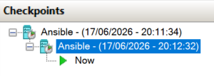

Zainstalowano program Ansible na głównej maszynie

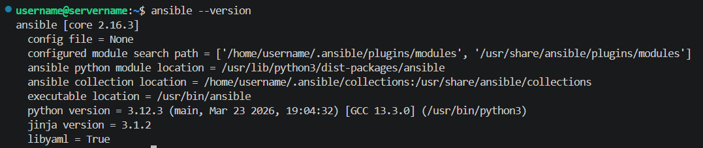

Ustawiono dostęp poprzez ssh do maszyny ansible poprzez komendy z poziomu głównej maszyny (użyto już istniejącego klucza na maszynie głównej)

```
ssh-copy-id ansible@172.30.174.56
```
```
ssh ansible@172.30.174.56
```

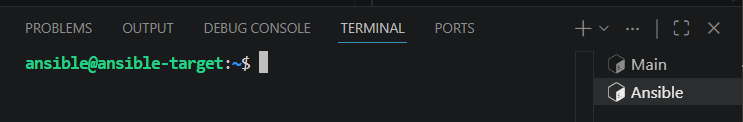


### Inwentaryzacja

Zmieniono nazwy hostnamectl

Główna maszyna
```
sudo hostnamectl set-hostname ansible-orchestrator
```

Maszyna ansible
```
sudo hostnamectl set-hostname ansible-target
```

Aby ustawić nazwę DNS maszyny ansible w głównej maszynie trzeba do pliku `/etc/hosts` dopisać `ip_maszyny nazwa_w_dns`

```
172.30.170.110 ansible-orchestrator // Główna
172.30.174.56 ansible-target // Ansible
```

Połączenie istnieje i jest stabilne
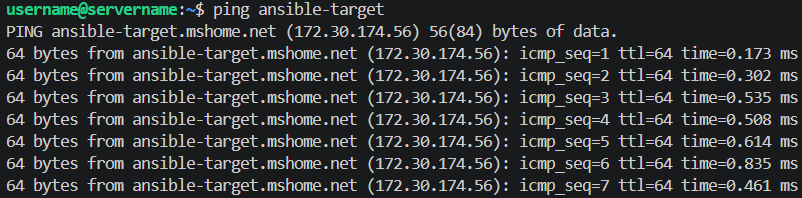

Stworzono plik inwentaryzacji

```
// Plik: inventory.ini

[Orchestrators]
ansible-orchestrator ansible_connection=local

[Endpoints]
ansible-target ansible_user=ansible
```

Połączenie ansible'a z maszynami jest poprawne

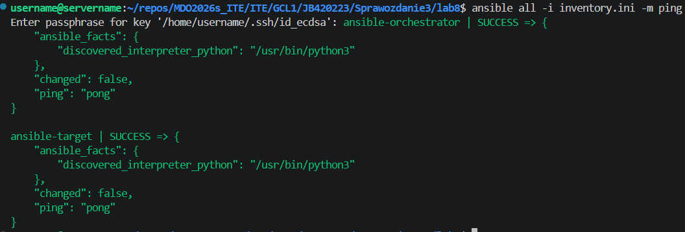


### Zdalne wywoływanie procedur

Utworzenie pliku `tasks.yml`

```
---
- name: Laboratorium - Zdalne wywoływanie procedur
  hosts: all
  become: no

  tasks:
    - name: 1. Pingowanie maszyn przez moduł Ansible
      ansible.builtin.ping:

    - name: 2. Kopiowanie pliku inwentaryzacji na Endpoints
      ansible.builtin.copy:
        src: inventory.ini
        dest: /home/ansible/inventory_backup.ini
        mode: '0644'
      when: "'Endpoints' in group_names"

    - name: 3. Aktualizacja listy pakietów (apt update)
      ansible.builtin.apt:
        update_cache: yes
      become: yes
      ignore_errors: yes

    - name: 4. Restart usługi SSH (Ubuntu)
      ansible.builtin.systemd:
        name: ssh
        state: restarted
      become: yes
      ignore_errors: yes

    - name: 4b. Restart usługi RNGD
      ansible.builtin.systemd:
        name: rngd
        state: restarted
      become: yes
      ignore_errors: yes
```

Użycie pliku `tasks.yml` w ansible

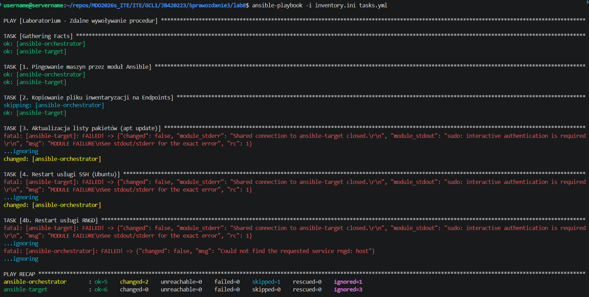

Pierwszy test wykazał że plik wykonuje to co miał robić dopóki nie dochodzi do wykorzystania sudo na ansible-target. Jednak co ważne nic się nie wysypało bo błędy są ignorowane. Sudo potrzebuje hasła, aby zatwierdzić komendę, dlatego musimy ustawić użytkownikowi drugiej maszyny uprawnienia tak, aby nie musiał wpisywać hasła przy sudo, aby to zrobić musimy dopisać `ansible ALL=(ALL) NOPASSWD:ALL` po wywołaniu komendy `sudo visudo`. Oprócz tego nie było usługi rngd, dlatego musimy ją zainstalować na obu maszynach za pomocą komendy `sudo apt install rng-tools`

Po tych zmianach

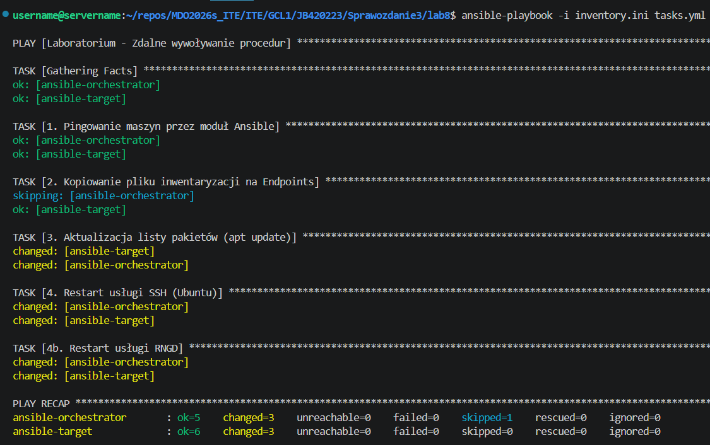

Wszystko działa tak jak powinno

Następnie wyłączono ssh na maszynie ansible

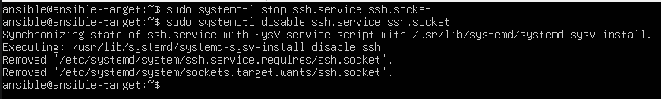

I ponownie spróbowano się połączyć

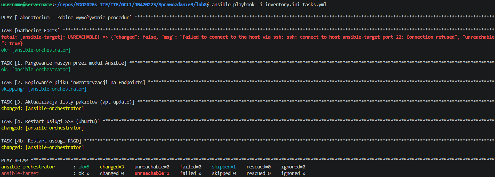

Maszyna od razu jest nieosiągalna

Potem odłączono kartę sieciową w hyper - v ustawiając `Virtual switch` na `Not connected`

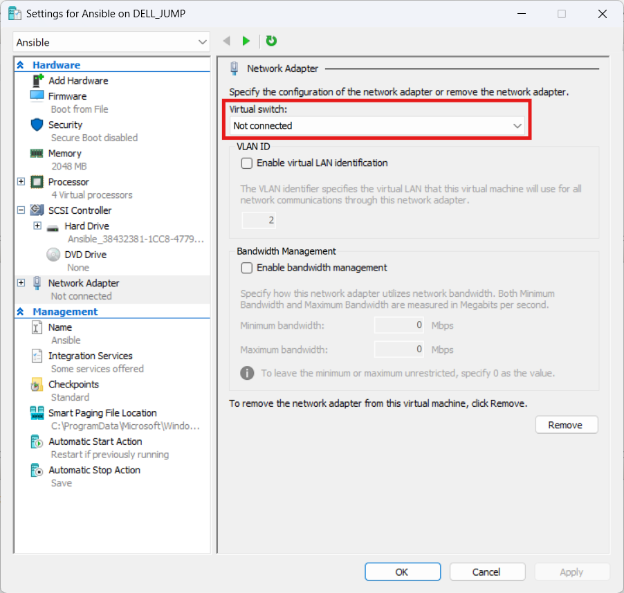

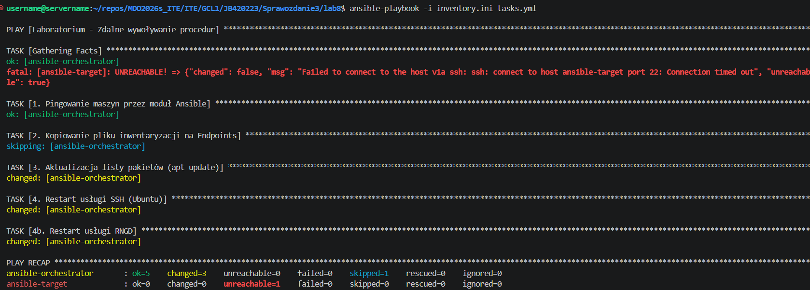

Tym razem trzeba chwilę poczekać (kilka sekund), aby pojawił się komunikat `Unreachable`


### Zarządzanie stworzonym artefaktem

Na głównej maszynie wygenerowano rolę

```
ansible-galaxy role init redis_deploy
```

Następnie edytujemy plik `main.yml` w folderze `meta` naszej roli

```
galaxy_info:
  author: Jakub Bednarczyk
  description: desc
  license: MIT
  min_ansible_version: 2.1
  platforms:
    - name: Ubuntu
      versions:
        - plucky

dependencies: []
```

Następnie do folderu `files` wrzucamy plik artefaktu

Potem w folderze `tasks` edytujemy plik `main.yml` tak aby:

* Przeprowadzał sanity check maszyny docelowej przed rozpoczęciem wdrożenia (np. * sprawdzenie dostępnej pamięci RAM), upewniając się, że skrypt nie ulegnie awarii w przypadku niepowodzenia tego kroku

* Zapewniał obecność środowiska Docker, instalując go za pomocą modułów Ansible (w tym zależności, klucze GPG oraz repozytoria) bezpośrednio na maszynie docelowej

* Przesyłał i rozpakowywał artefakt (plik aplikacji tar.gz) na zdalną maszynę do wyznaczonego katalogu wdrożeniowego

* Uruchamiał aplikację wewnątrz kontenera Docker, mapując odpowiednie porty oraz montując wolumen z przesłanym plikiem binarnym i wymaganymi zależnościami

* Weryfikował poprawne uruchomienie aplikacji, sprawdzając rzeczywisty stan kontenera (czy jego status to running), a nie tylko sam fakt pomyślnego zakończenia wcześniejszych zadań w playbooku

* Oczyszczał środowisko docelowe poprzez zatrzymanie, usunięcie kontenera oraz skasowanie wdrożonych plików aplikacji po zakończeniu testów

```
---
- name: Sanity check - Sprawdzenie wolnej pamięci RAM przed wdrożeniem
  ansible.builtin.shell: free -m | awk '/^Mem:/{print $4}'
  register: free_memory
  ignore_errors: yes

- name: Wyświetl ostrzeżenie, jeśli pamięć jest na wyczerpaniu
  ansible.builtin.debug:
    msg: "UWAGA: Wykryto mało pamięci RAM, ale kontynuuję wdrożenie!"
  when: free_memory.stdout | int < 200
  ignore_errors: yes

- name: Instalacja wymaganych zależności systemowych
  ansible.builtin.apt:
    name:
      - apt-transport-https
      - ca-certificates
      - curl
      - software-properties-common
      - python3-pip
    state: present
    update_cache: yes
  become: yes

- name: Upewnij się, że katalog na klucze repozytoriów istnieje
  ansible.builtin.file:
    path: /etc/apt/keyrings
    state: directory
    mode: '0755'
  become: yes

- name: Dodanie oficjalnego klucza GPG Dockera
  ansible.builtin.get_url:
    url: https://download.docker.com/linux/ubuntu/gpg
    dest: /etc/apt/keyrings/docker.asc
    mode: '0644'
  become: yes

- name: Rejestracja repozytorium Docker w systemie
  ansible.builtin.apt_repository:
    repo: "deb [arch=amd64 signed-by=/etc/apt/keyrings/docker.asc] https://download.docker.com/linux/ubuntu {{ ansible_distribution_release }} stable"
    state: present
  become: yes

- name: Instalacja silnika Docker (docker-ce)
  ansible.builtin.apt:
    name: docker-ce
    state: present
    update_cache: yes
  become: yes

- name: Upewnij się, że usługa Docker jest uruchomiona i włączona
  ansible.builtin.systemd:
    name: docker
    state: started
    enabled: yes
  become: yes

- name: Utworzenie dedykowanego katalogu pod aplikację
  ansible.builtin.file:
    path: /opt/redis_app
    state: directory
    mode: '0755'
  become: yes

- name: Przesłanie i automatyczne wypakowanie archiwum binarnego
  ansible.builtin.unarchive:
    src: redis-JB420223-bin.tar.gz
    dest: /opt/redis_app/
  become: yes

- name: Uruchomienie aplikacji w kontenerze
  ansible.builtin.shell: |
    docker stop redis_runtime_container || true
    docker rm redis_runtime_container || true
    docker run -d \
      --name redis_runtime_container \
      --restart always \
      -v /opt/redis_app:/app \
      -p 6379:6379 \
      ubuntu:latest /app/redis-server
  become: yes

- name: Oczekiwanie na inicjalizację Redis
  ansible.builtin.pause:
    seconds: 5

- name: Sprawdzenie statusu kontenera przez docker ps
  ansible.builtin.shell: docker ps --filter "name=redis_runtime_container" --format "{{"{{.Status}}"}}"
  register: container_status
  become: yes

- name: Walidacja czy status kontenera zawiera 'Up'
  ansible.builtin.assert:
    that:
      - "'Up' in container_status.stdout"
    fail_msg: "Błąd: Aplikacja wewnątrz kontenera nie działa poprawnie!"
    success_msg: "Sukces: Kontener wdrożony i działa w tle."

- name: Czyszczenie - Zatrzymanie i usunięcie kontenera testowego
  ansible.builtin.shell: |
    docker stop redis_runtime_container || true
    docker rm redis_runtime_container || true
  become: yes

- name: Czyszczenie - Skasowanie katalogu aplikacyjnego wraz z artefaktami
  ansible.builtin.file:
    path: /opt/redis_app
    state: absent
  become: yes
```

Następnie tworzymy nowy plik `tasks2.yml` który wywoła naszą rolę

```
---
- name: Zarządzanie artefaktem z Pipeline
  hosts: all
  vars:
    ansible_python_interpreter: /usr/bin/python3

  roles:
    - redis_deploy
```

Oraz należy wykomentować główną maszynę z pliku `inventory.ini`

```
#[Orchestrators]
#ansible-orchestrator ansible_connection=local

[Endpoints]
ansible-target ansible_user=ansible
```

Wtedy cały proces przejdzie prawidłowo bez żadnych przeszkód

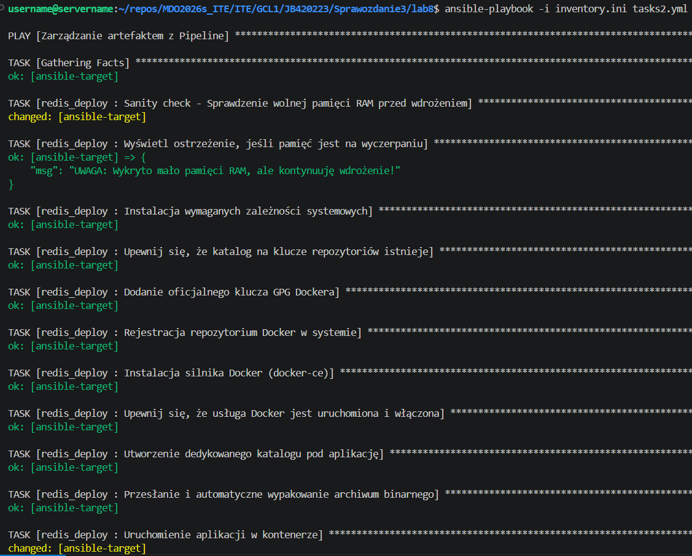

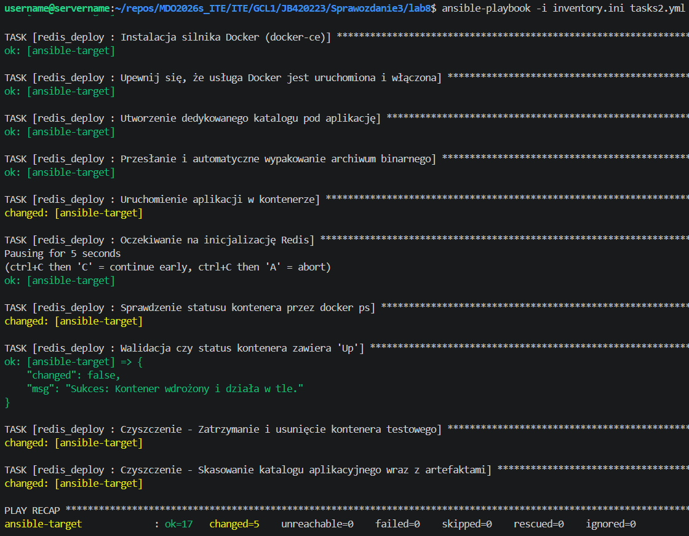


## Lab 9 Pliki odpowiedzi dla wdrożeń nienadzorowanych

Zaczęto od pobrania wersji systemu fedora: `Fedora-Everything-netinst-x86_64-44-1.7.iso`

Po pobraniu utworzono maszynę wirtualną na podstawie pliku obrazu z 4 GB pamięci RAM i 16 GB pojemności dysku wirtualnego, oraz default switch'em (dostęp do internetu).

Ważnym jest wyłączenie Secure Boot, w innym przypakdu masyzna nie rozpocznie instalacji z iso

Miłym zaskoczeniem jest UI instalatora w którym wybieramy domyślny dysk oraz tworzymy nowego zwykłego usera `fedora_user`

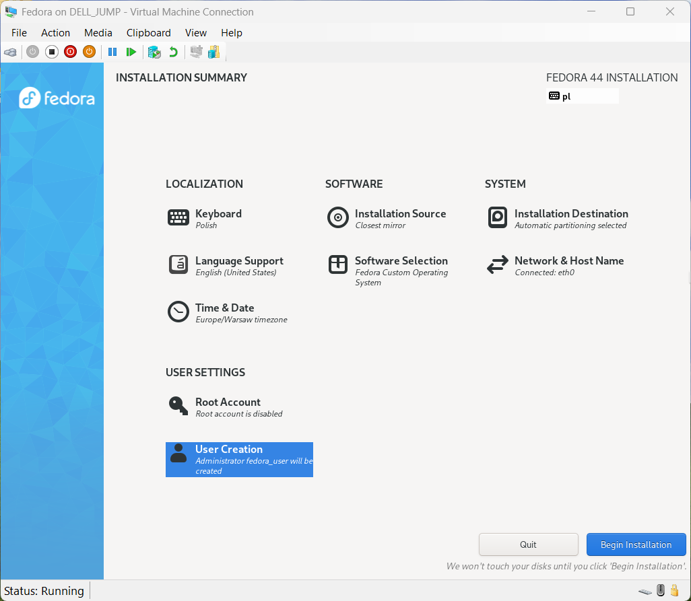

Następnie wysietlamy treść pliku odpowiedzi na konsolę (w przypadku odmowy uprawnień warto spróbować `sudo -i`)

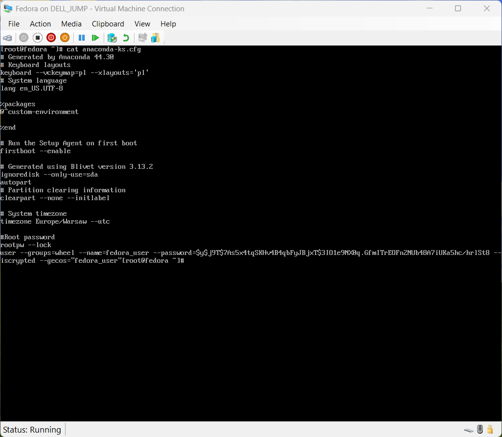

Następnie modyfikujemy plik odpowiedzi dodając:

* Zewnętrzne źródła instalacyjne oraz oficjalne repozytoria systemu Fedora 44, umożliwiające instalatorowi sieciowemu bezproblemowe pobranie pakietów.

* Wymóg automatycznego formatowania i czyszczenia nośników (zerombr, clearpart --all), co pozwala na bezdotykową reinstalację systemu „w kółko”

* Niestandardową nazwę hosta (fedora-target-jb) oraz nowego użytkownika z uprawnieniami administratora (devops-jb)

* Instalację środowiska Docker bezpośrednio na etapie konfiguracji pakietów systemu w sekcji %packages.

* Skrypt postinstalacyjny w sekcji %post, tworzący dedykowaną usługę systemd, która automatycznie pobiera i uruchamia kontener z aplikacją zaraz po pierwszym uruchomieniu systemu

* Dyrektywę automatycznego restartu (reboot) po zakończeniu całego procesu instalacji

```
// Zmodyfikowany plik odpowiedzi

text
cmdline

url --mirrorlist=http://mirrors.fedoraproject.org/mirrorlist?repo=fedora-44&arch=x86_64
repo --name=updates --mirrorlist=http://mirrors.fedoraproject.org/mirrorlist?repo=updates-released-f44&arch=x86_64
repo --name=docker-ce-stable --baseurl=https://download.docker.com/linux/fedora/44/x86_64/stable

keyboard --vckeymap=pl --xlayouts='pl'
lang en_US.UTF-8

%packages
@^custom-environment
wget
curl
docker-ce
docker-ce-cli
containerd.io
%end

firstboot --enable

zerombr
clearpart --all --initlabel
autopart
bootloader --location=mbr

timezone Europe/Warsaw --utc

network --bootproto=dhcp --device=link --activate
network --hostname=fedora-target-jb

rootpw --lock
user --groups=wheel --name=devops-jb --password=admin1234 --gecos="devops-jb"

reboot

%post --log=/root/kickstart_post.log

systemctl enable docker

cat << 'EOF' > /etc/rc.d/init.d/start_app.sh
#!/bin/bash
sleep 10
docker run -d --name moj_pipeline_app --restart always -p 6379:6379 redis:latest
EOF

chmod +x /etc/rc.d/init.d/start_app.sh

cat << 'EOF' > /etc/systemd/system/run-app-once.service
[Unit]
Description=Uruchomienie aplikacji z Pipeline po pierwszym boocie
After=docker.service network-online.target
Wants=docker.service network-online.target

[Service]
Type=oneshot
ExecStart=/etc/rc.d/init.d/start_app.sh
RemainAfterExit=yes

[Install]
WantedBy=multi-user.target
EOF

systemctl enable run-app-once.service

%end
```

Następnym krokiem jest isntalacja fedory na podstawie zmodyfikowanego pliku, aby nie musieć go ręcznie wpiysywać. Jendak najpierw musimy go w jakiś sposób podać instalatorowi, można zrobić to poprzez postawienie małego serwera https i udostępnienia przez niego pliku instalatorowi

W tym celu na głównej maszynie w folderze ze zmodyfikowanym plikiem otwieramy serwer:

```
python3 -m http.server 8000 // 8080 był zajęty
```

Potem tworzymy drugą maszynę na fedorę identyczną jak poprzednio z takimi samymi parametrami

Po uruchomieniu i połączeniu się z maszyną zaznaczamy (nie klikamy!) opcję Fedora 44 (lub inna wersja np. 38), i klikamy 'e', następnie dopisujemy na końcu:

```
inst.ks=http://ip_maszyny_z_plikiem:8000/nazwa_pliku.cfg
```

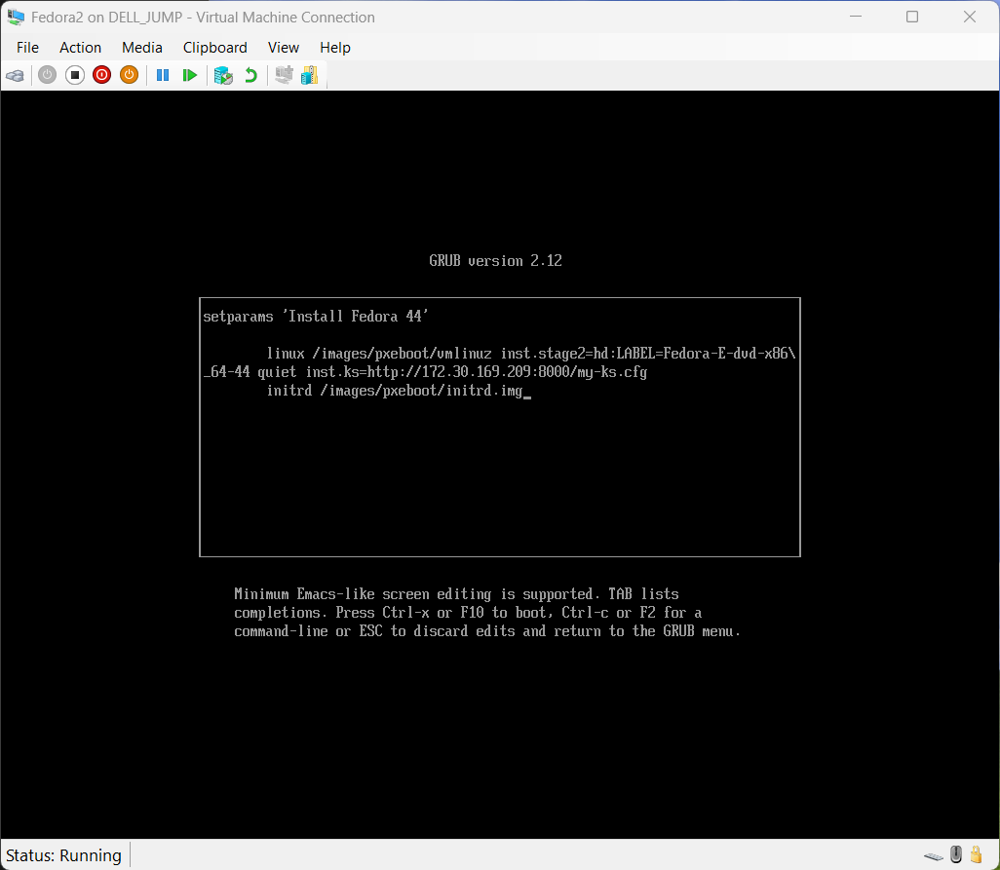

Następnie w celu przejścia dalej naciskamy 'F10'

Po instalacji możemy zalogować się na automatycznie utworzone konto dowodząc że plik jest poprawny i instalacja przebiegła automatycznie i poprawnie

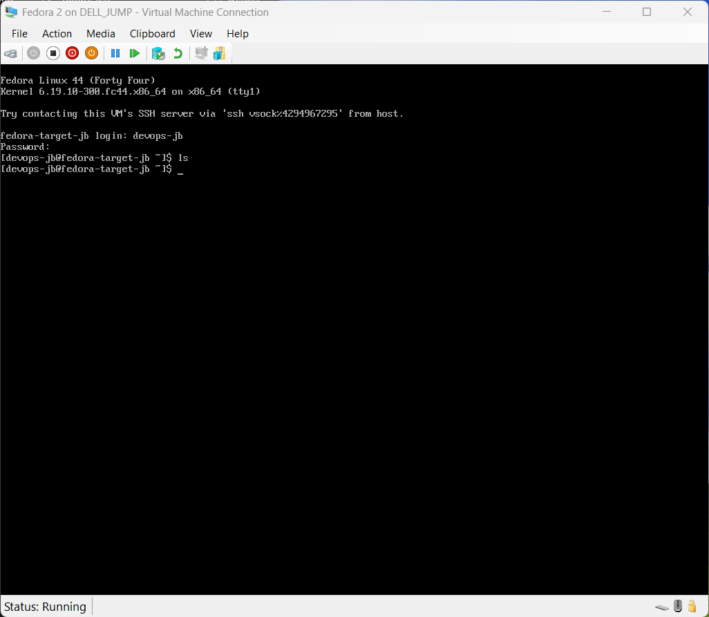

Sprawdzono również działanie mechanizmów postinstalacyjnych oraz statusu automatycznie wdrożonej aplikacji

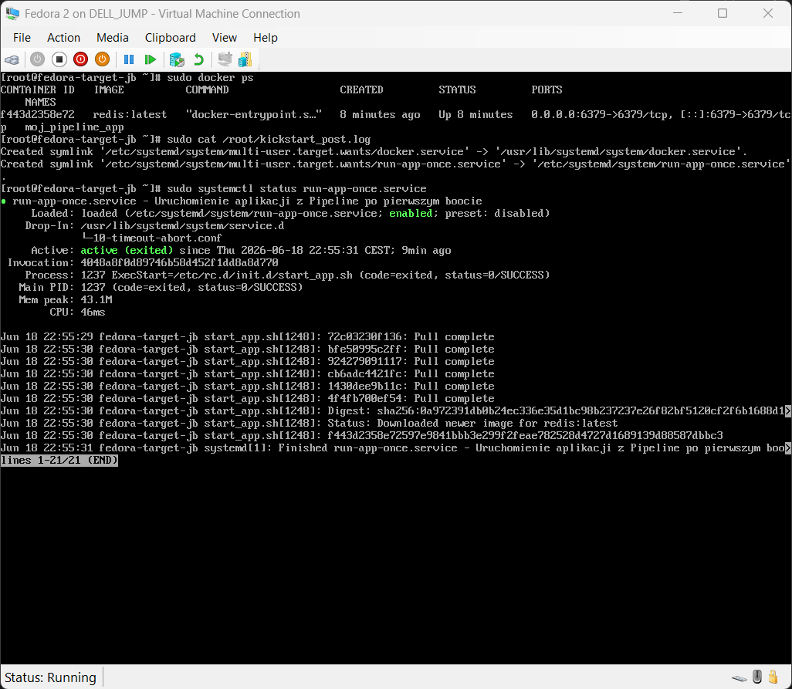

* `sudo docker ps`: Pokazuje działający kontener moj_pipeline_app (bazujący na redis:latest). Kontener działa stabilnie od 8 minut (Up 8 minutes) i ma wystawiony port 6379.

* `sudo cat /root/kickstart_post.log`: Potwierdza, że sekcja %post instalatora Kickstart pomyślnie utworzyła dowiązania symboliczne (symlinki) dla usłgi Docker oraz Twojej dedykowanej usługi startowej.

* `sudo systemctl status run-app-once.service`: Pokazuje status active (exited) z kodem status=0/SUCCESS. Oznacza to, że przygotowana usługa systemd odpaliła skrypt, skrypt pomyślnie wykonał docker run (w logach na dole widać warstwy pobierania obrazu: Pull complete), po czym usługa zakończyła pracę, zostawiając kontener uruchomiony w tle.


## Lab 10 Wdrażanie na zarządzalne kontenery: Kubernetes

### Instalacja klastra Kubernetes

Wpierw pobrano i zainstalowano minikube

```
curl -LO https://github.com/kubernetes/minikube/releases/latest/download/minikube-linux-amd64

sudo install minikube-linux-amd64 /usr/local/bin/minikube && rm minikube-linux-amd64

minikube start
```


Większość działa poprawnie ale nie ma kubectl

Następnie pobieramy kubectl, instalujemy i weryfikujemy instalację 

```
curl -LO "https://dl.k8s.io/release/$(curl -L -s https://dl.k8s.io/release/stable.txt)/bin/linux/amd64/kubectl"

sudo install -o root -g root -m 0755 kubectl /usr/local/bin/kubectl

kubectl version --client

kubectl cluster-info

alias kubectl="minikube kubectl --"
```


Jak widać instalacje przebiegły poprawnie, możemy teraz uruchomić panel kubernetesa prz okazji weryfikując jego stan

```
minikube dashboard
```


Jak widać panel uruchamia się poprawnie

Następnie zapoznano się z dokumentacją kubernetesa i jego koncepcjami


### Analiza posiadanego kontenera

Aby otryzmać obraz dla kuberentesa musimy dodać do naszego pipeline'u stage który daje nam stosowny obraz, w tym celu modyfikujemy stary plik i umieszczamy go w nowej lokacji którą również trzeba zmienić w jenkinsie

 

W stosownym miejscu należy stowrzyć plik JenkinsfileCloud który będzie zmodyfikowanym plikiem (plik jest w ścieżce jak na zdjęciu)

