# Laboratorium 1

#### Przejscie do odpowiednich branchy:

#### Utworzenie wlasnej galezi:

#### Utworzenie wlasnego folderu:

#### Utworzenie hook'a i dodanie go do katalogu:

#### Tresc hook'a:

#### Skopiowanie hook'a do odpowiedniego folderu:

#### Modyfikacja uprawnien hook'a:

#### Dodanie sprawozdania i zrzutow ekranu:

#### Efekt dzialania hook'a:

#### Proba wciagniecia wlasnej galezi do grupowej:

# Laboratorium 2

#### Instalacja Docker'a:
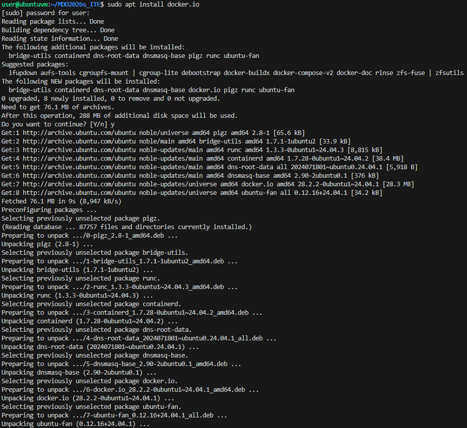
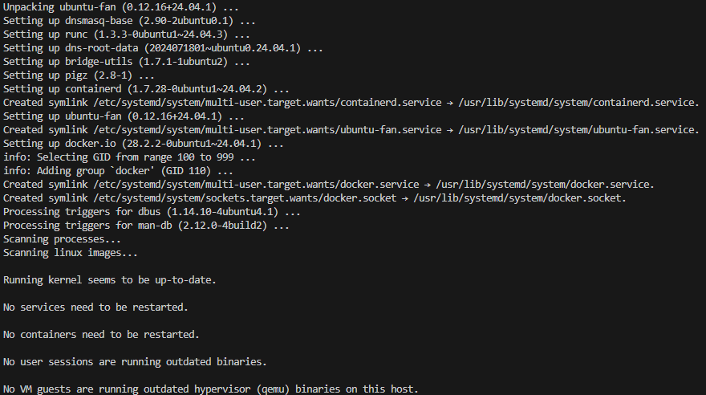

#### Weryfikacja instalacji:
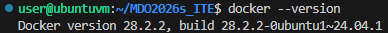

#### Zarejestrowanie sie do Docker Hub'a:
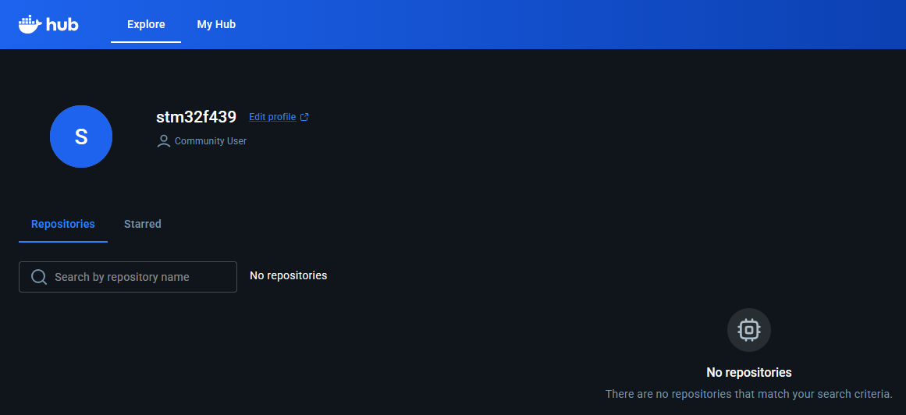

#### Uruchomienie poszczegolnych obrazow i sprawdzenie ich kodow wyjscia:
* hello-world

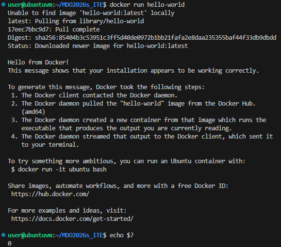
* busybox

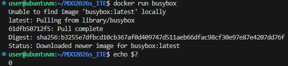
* ubuntu

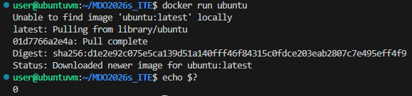
* fedora

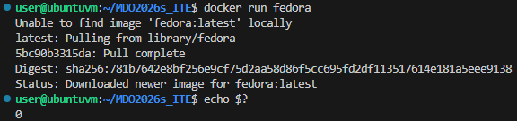
* mariadb

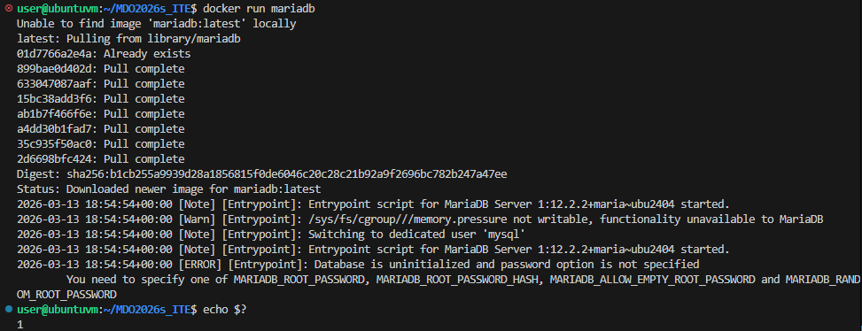
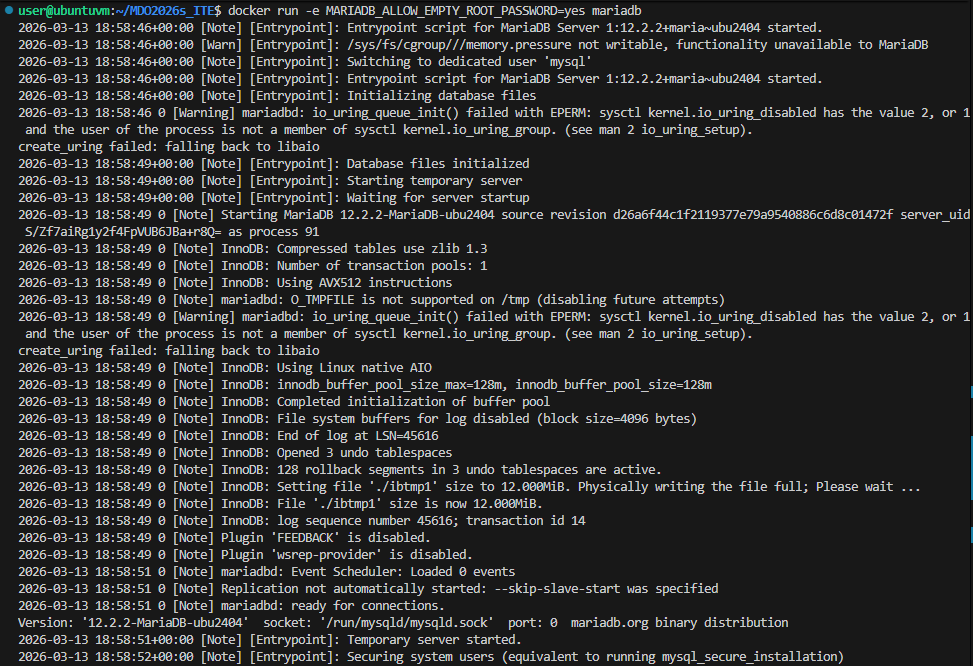
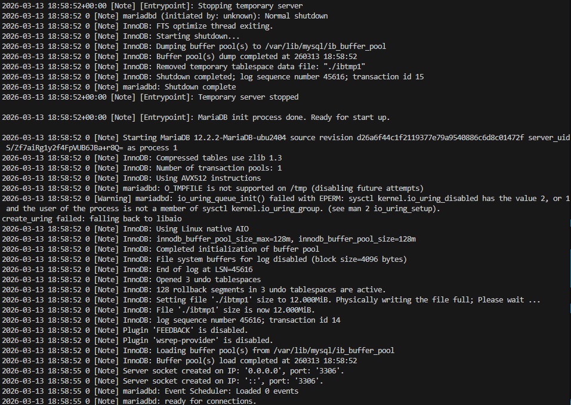
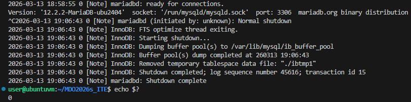
* runtime

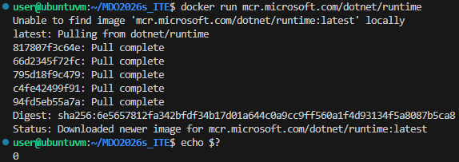
* aspnet

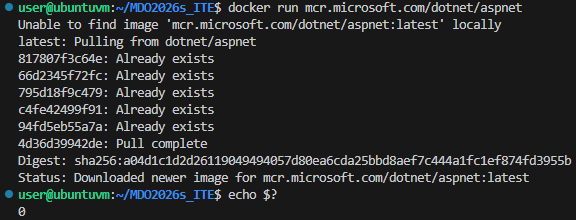
* sdk

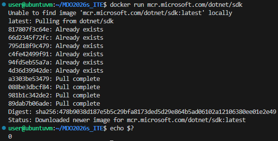

#### Sprawdzenie rozmiarow obrazow:
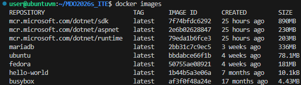

#### Uruchomienie kontenera z obrazu Busybox:
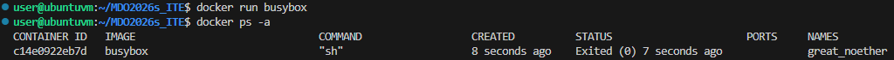

#### Podlaczenie i sprawdzenie wersji:
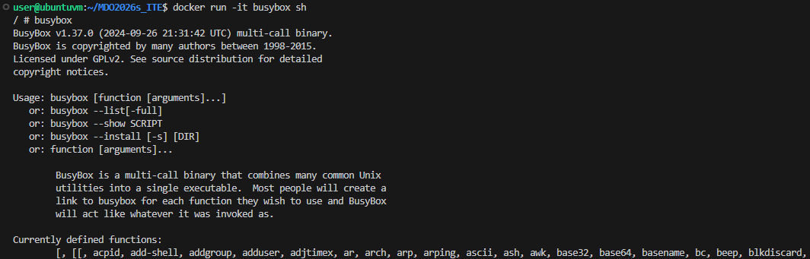

#### Uruchomienie kontenera z obrazu Ubuntu (prezentacja procesow, aktualizacja pakietow):
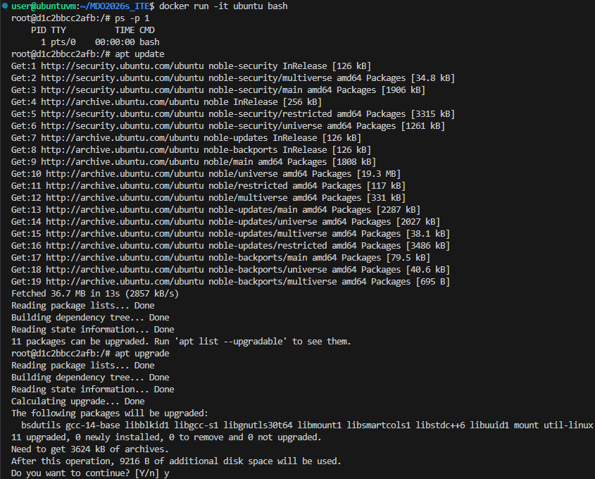
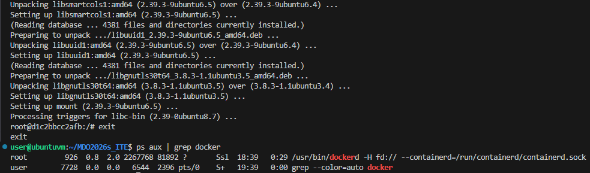

#### Stworzenie wlasnego obrazu:
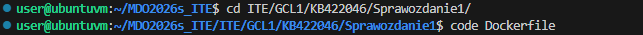

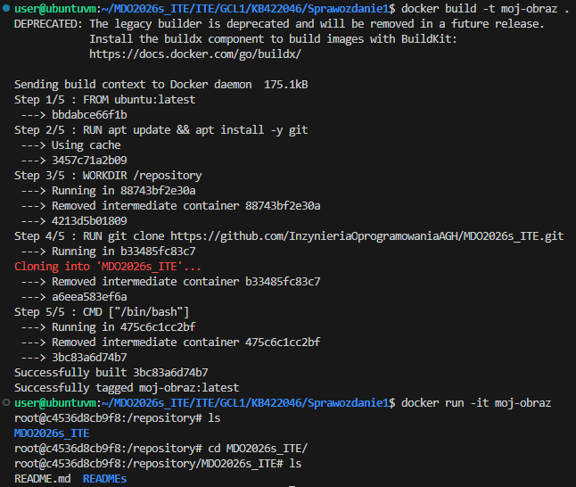

#### Uruchomione kontenery:
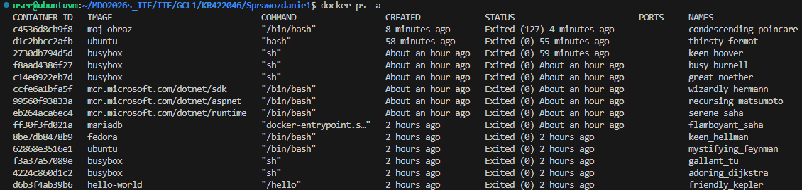

#### Pozbycie sie zakonczonych kontenerow:
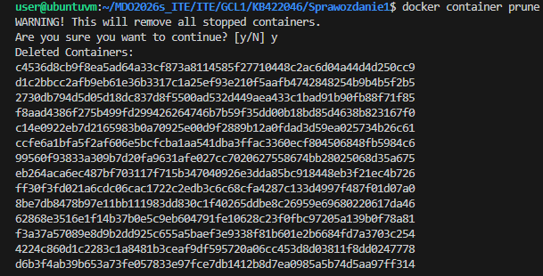

#### Pozbycie sie obrazow:
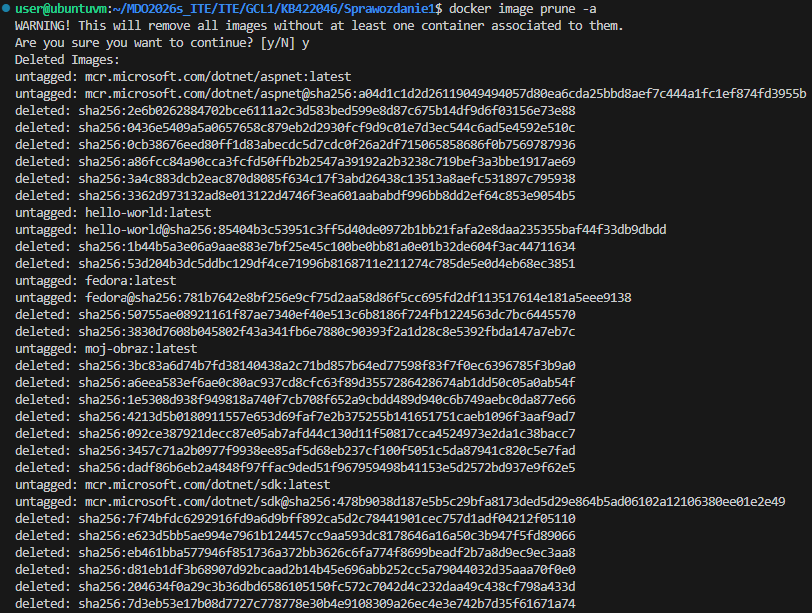