# Sprawozdanie 3

[historia poleceń](command_history.txt)

## Laboratorium 8

#### Utworzono drugą maszynę wirtualną:


#### Zapewniono obecność programu tar i serwera OpenSSH oraz utworzono użytkownika *ansible*:


*hostname "ansible-target" został nadany już w trakcie konfiguracji maszyny*

#### Zainstalowano oprogramowanie Ansible na maszynie głównej:


#### Wymieniono klucze ssh między maszyną główną a użytkownikiem *ansible* z *ansible-target*:


*możliwe jest nawiązanie połączenia bez konieczności podawania hasła*

#### Nadanie maszynie głównej nowej nazwy:


*nazewnictwo zostało zaktualizowane, ale pozostało niezmienione w interfejsie VS Code*

#### Zweryfikowano połączenie poprzez wykonanie *ping'u*:


#### Stworzono [plik inwentaryzacji](inventory.ini) i wysłano za jego pośrednictwem żądanie *ping* do wszystkich maszyn:


#### Utworzono [playbook'a Ansible](pbook.yml):


#### Uruchomiono playbook'a:


#### Wyłączono obsługę ssh na *ansible-target* i uruchomiono ponownie playbook'a:


#### Utworzono [playbook'a do zarządzania artefaktem](pbook_artifact.yml):
```
---
- name: Manage .deb artifact
  hosts: Endpoints
  become: yes
  vars:
    artifact_src: "/home/user/my-custom-curl_1.0.1_amd64.deb"
    mocks_src_dir: "/home/user/MDO2026s_ITE/ITE/GCL1/KB422046/Sprawozdanie2"
    work_dir: "/opt/my-curl"
    container_name: "my-curl"
  tasks:
    - name: Sanity check - connectivity and disk
      ansible.builtin.shell: |
        echo "disk_free=$(df -h / | tail -1 | awk '{print $4}')"
      register: sanity
      failed_when: false
      changed_when: false

    - name: Install Docker
      ansible.builtin.apt:
        name:
          - docker.io
          - openssl
        state: present
        update_cache: yes

    - name: Ensure Docker running
      ansible.builtin.service:
        name: docker
        state: started
        enabled: yes

    - name: Resolve artifact filename
      ansible.builtin.set_fact:
        artifact_file: "{{ artifact_src | basename }}"
      changed_when: false

    - name: Create work directory
      ansible.builtin.file:
        path: "{{ work_dir }}"
        state: directory
        mode: "0755"

    - name: Copy artifact to target
      ansible.builtin.copy:
        src: "{{ artifact_src }}"
        dest: "{{ work_dir }}/{{ artifact_file }}"
        mode: "0644"

    - block:
        - name: Remove old container if exists
          ansible.builtin.command: "docker rm -f {{ container_name }}"
          failed_when: false
          changed_when: false

        - name: Start base container
          ansible.builtin.command: "docker run -d --name {{ container_name }} ubuntu:24.04 sleep infinity"

        - name: Copy artifact into container
          ansible.builtin.command: "docker cp {{ work_dir }}/{{ artifact_file }} {{ container_name }}:/tmp/{{ artifact_file }}"

        - name: Install runtime dependencies and .deb inside container
          ansible.builtin.shell: |
            docker exec {{ container_name }} bash -lc "apt-get update && apt-get install -y --no-install-recommends ca-certificates libpsl5 zlib1g libssl3 && dpkg -i /tmp/{{ artifact_file }} && ldconfig"

        - name: Copy mock_http.py
          ansible.builtin.copy:
            src: "{{ mocks_src_dir }}/mock_http.py"
            dest: "{{ work_dir }}/mock_http.py"
            mode: "0644"

        - name: Copy mock_https.py
          ansible.builtin.copy:
            src: "{{ mocks_src_dir }}/mock_https.py"
            dest: "{{ work_dir }}/mock_https.py"
            mode: "0644"

        - name: Copy mock_rest.py
          ansible.builtin.copy:
            src: "{{ mocks_src_dir }}/mock_rest.py"
            dest: "{{ work_dir }}/mock_rest.py"
            mode: "0644"

        - name: Create test network
          ansible.builtin.command: docker network create test-net
          failed_when: false
          changed_when: false

        - name: Connect runtime container to test network
          ansible.builtin.command: "docker network connect test-net {{ container_name }}"
          failed_when: false
          changed_when: false

        - name: Generate SSL certificate for C2
          ansible.builtin.shell: |
            openssl req -x509 -newkey rsa:2048 -keyout {{ work_dir }}/key.pem -out {{ work_dir }}/cert.pem -days 1 -nodes -subj "/CN=C2"

        - name: Remove old mock containers if exist
          ansible.builtin.command: "docker rm -f C1 C2 C3"
          failed_when: false
          changed_when: false

        - name: Start mock servers
          ansible.builtin.command: >
            docker run -d --name C1 --network test-net --network-alias C1 -v {{ work_dir }}:/workspace python:3-slim python /workspace/mock_http.py

        - name: Start mock HTTPS server
          ansible.builtin.command: >
            docker run -d --name C2 --network test-net --network-alias C2 -v {{ work_dir }}:/workspace python:3-slim python /workspace/mock_https.py

        - name: Start mock REST server
          ansible.builtin.command: >
            docker run -d --name C3 --network test-net --network-alias C3 -v {{ work_dir }}:/workspace python:3-slim python /workspace/mock_rest.py

        - name: HTTP test (C1)
          ansible.builtin.command: docker exec {{ container_name }} curl -sS http://C1:81
          register: http_out
          failed_when: http_out.stdout != "HTTP_OK"

        - name: HTTPS test (C2)
          ansible.builtin.command: docker exec {{ container_name }} curl -sS -k https://C2:82
          register: https_out
          failed_when: https_out.stdout != "HTTPS_OK"

        - name: REST POST test (C3)
          ansible.builtin.command: docker exec {{ container_name }} curl -sS -X POST http://C3:93
          register: rest_out
          failed_when: rest_out.stdout != "REST_OK"

      always:
        - name: Cleanup container
          ansible.builtin.command: "docker rm -f {{ container_name }}"
          failed_when: false
          changed_when: false

        - name: Cleanup mock containers
          ansible.builtin.command: "docker rm -f C1 C2 C3"
          failed_when: false
          changed_when: false

        - name: Cleanup test network
          ansible.builtin.command: "docker network rm test-net"
          failed_when: false
          changed_when: false

        - name: Cleanup work directory
          ansible.builtin.file:
            path: "{{ work_dir }}"
            state: absent
```

*playbook instaluje i uruchamia Docker'a, umieszcza artefat w nowym kontenerze, doinstalowywuje zależności i wykonuje testy potwierdzające poprawne działanie (analogiczne do tych z [Jenkinsfile'a](../Sprawozdanie2/Jenkinsfile) - żądania htpp, https, post)*

*(artefakt został uprzednio przeniesiony do katalogu użytkownika (/home/user))*

#### Uruchomiono playbook'a:
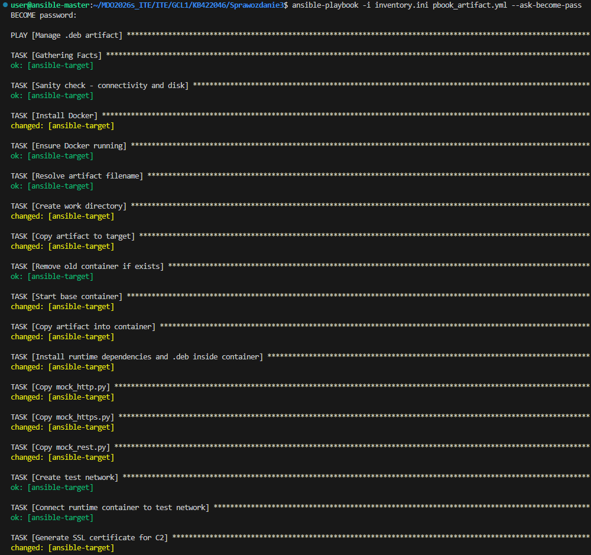
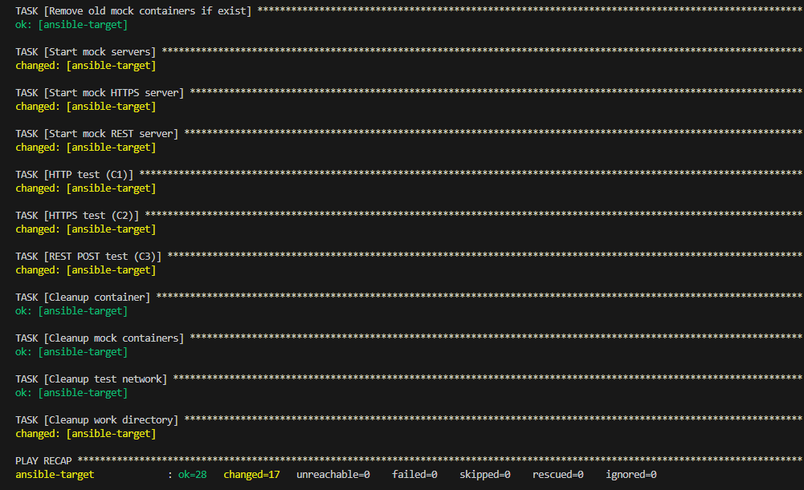

#### Utworzono rolę:
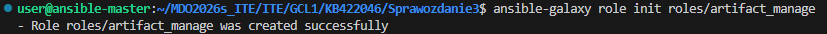

#### Zmodyfikowano plik [main.yml](roles/artifact_manage/meta/main.yml) z katalogu *roles/artifact_manage/meta/*:
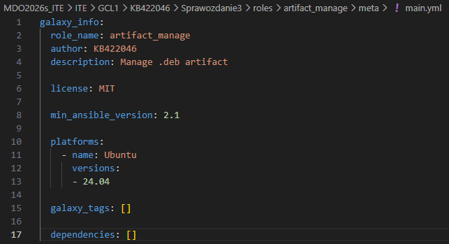

#### Zmodyfikowano plik [main.yml](roles/artifact_manage/tasks/main.yml) z katalogu *roles/artifact_manage/tasks/*:
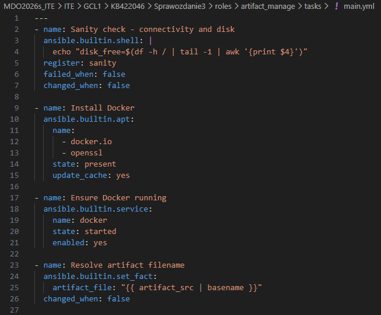

#### Utworzono [playbook'a do roli](pbook_artifact_w_role.yml):
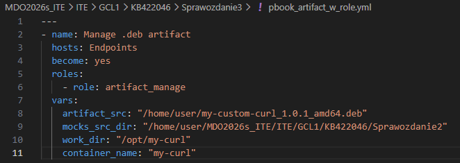

#### Uruchomiono playbook'a z rolą:
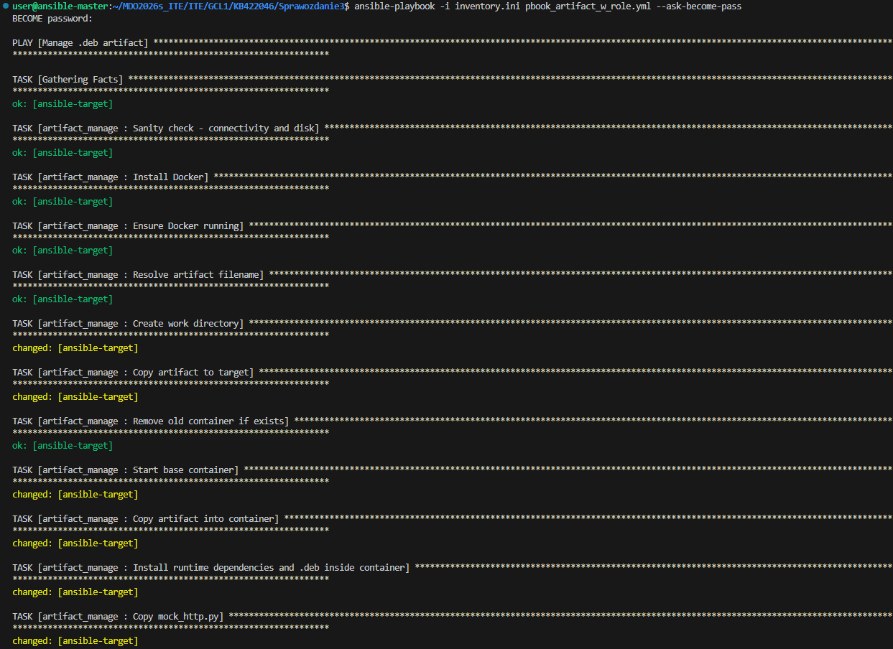
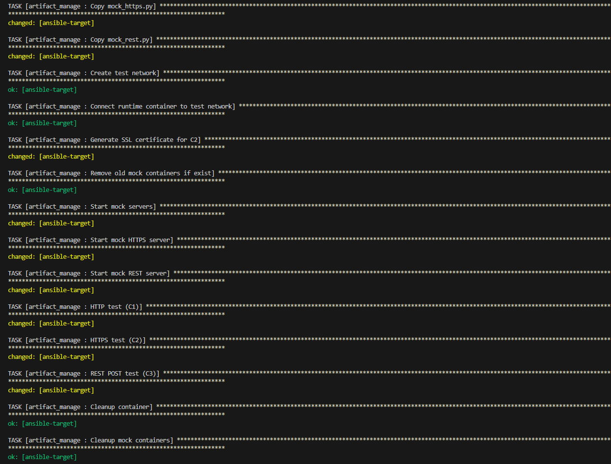
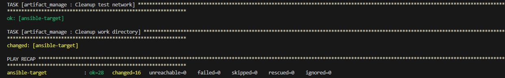

*wszystkie zadania poza instalacją Docker'a uzyskały te same statusy wykonania - Docker został już zainstalowany przy pierwszym wykonanym playbook'u, więc przy drugim nie było potrzeby ponawiać tej operacji*

## Laboratorium 9

#### Utworzono nową maszynę wirtualną przy pomocy obrazu Fedora serwer netinst:
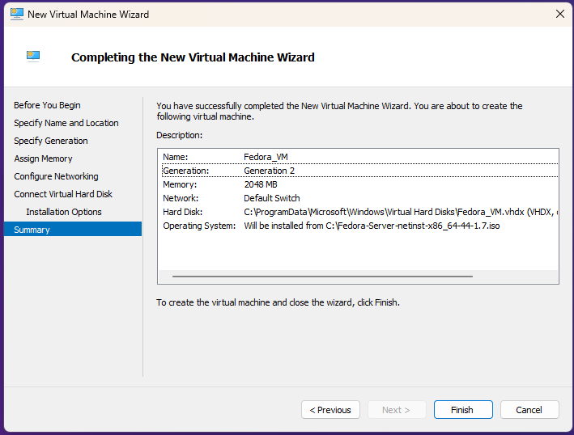
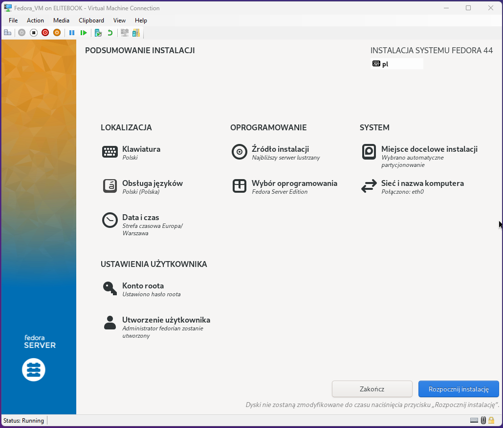
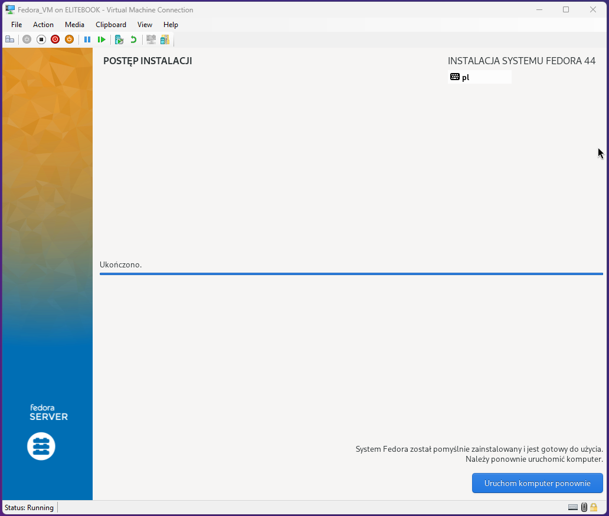
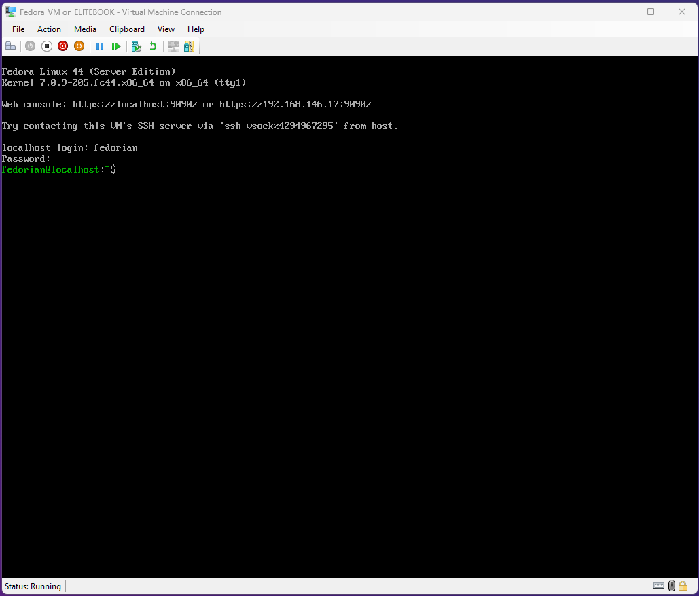

#### Wyekstraktowano [plik odpowiedzi](anaconda-ks.cfg):
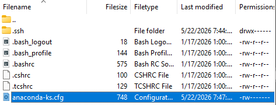

#### Utworzono na jego podstawie [nowy plik](ks-modified.cfg) odpowiedzi umożliwiający przeprowadzanie instalacji nienadzorowanej:
```
# Installation source
url --mirrorlist=http://mirrors.fedoraproject.org/mirrorlist?repo=fedora-44&arch=x86_64
repo --name=updates --mirrorlist=http://mirrors.fedoraproject.org/mirrorlist?repo=updates-released-f44&arch=x86_64

# Keyboard layouts
keyboard --vckeymap=pl --xlayouts='pl'
# System language
lang pl_PL.UTF-8
# System timezone
timezone Europe/Warsaw --utc

# Hostnaming
network --hostname=fedora-vm

# Packages
%packages
@^server-product-environment
%end

# Run the Setup Agent on first boot
firstboot --disable

# Partition clearing information
zerombr
clearpart --all --initlabel
autopart --type=lvm

# Root password
rootpw --iscrypted --allow-ssh XXXXXXXXXX
user --groups=wheel --name=fedorian --password=XXXXXXXXXX --iscrypted

# Reboot after installation
reboot
```

#### Uruchomiono pomocniczy serwer w celu przekazania pliku odpowiedzi instalatorowi:
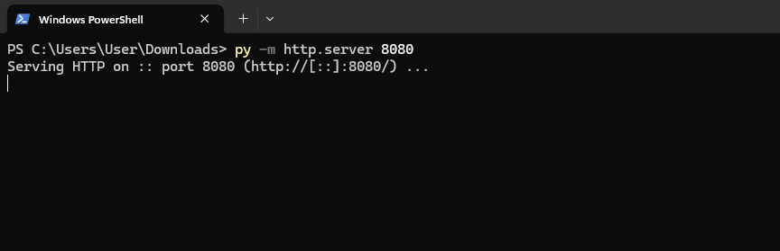

#### Przeinstalowano maszynę przekazując instalatorowi zmodyfikowany plik odpowiedzi:
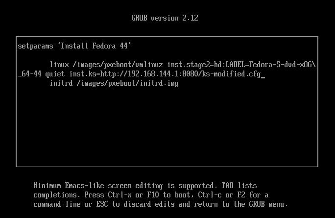
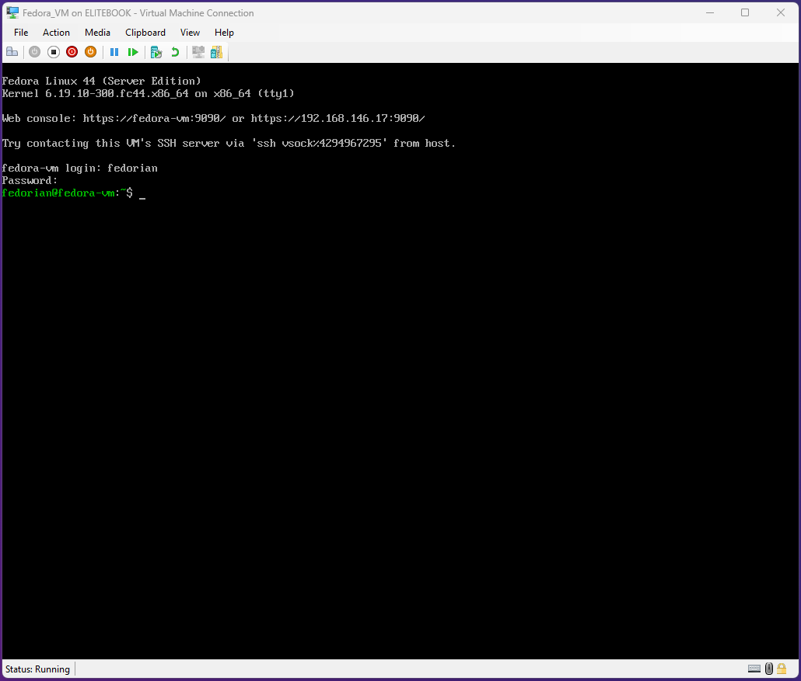

#### Poszerzono plik odpowiedzi o szereg zadań *post* mających zapewnić działanie artefaktu na nowej maszynie:
```
# Installation source
url --mirrorlist=http://mirrors.fedoraproject.org/mirrorlist?repo=fedora-44&arch=x86_64
repo --name=updates --mirrorlist=http://mirrors.fedoraproject.org/mirrorlist?repo=updates-released-f44&arch=x86_64

# Keyboard layouts
keyboard --vckeymap=pl --xlayouts='pl'
# System language
lang pl_PL.UTF-8
# System timezone
timezone Europe/Warsaw --utc

# Hostnaming
network --hostname=fedora-vm

# Packages
%packages
@^server-product-environment
openssh-server
ca-certificates
openssl-libs
libpsl
zlib
wget
binutils
tar
%end

# Run the Setup Agent on first boot
firstboot --disable

# Partition clearing information
zerombr
clearpart --all --initlabel
autopart --type=lvm

# Root password
rootpw --iscrypted --allow-ssh XXXXXXXXXX
user --groups=wheel --name=fedorian --password=XXXXXXXXXX --iscrypted

# Reboot after installation
reboot --eject

%post --interpreter=/bin/bash --log=/root/ks-post.log
set -euxo pipefail

ARTIFACT_HOST="192.168.144.1"
ARTIFACT_PORT="8080"
ARTIFACT_FILE="my-custom-curl_1.0.1_amd64.deb"
ARTIFACT_URL="http://${ARTIFACT_HOST}:${ARTIFACT_PORT}/${ARTIFACT_FILE}"

wget --tries=5 --waitretry=2 -O "/root/${ARTIFACT_FILE}" "$ARTIFACT_URL"

mkdir -p /root/ks-artifact
cd /root/ks-artifact
ar x "/root/${ARTIFACT_FILE}"
DATA_TAR="$(ls data.tar.* | head -n 1)"
tar -C / -xf "$DATA_TAR"

echo "/usr/local/lib" > /etc/ld.so.conf.d/my-curl.conf
ldconfig
chmod 0755 /usr/local/bin/curl

cat >/usr/local/bin/my-curl-start.sh <<'EOF'
#!/usr/bin/env bash
/usr/local/bin/curl --version > /var/log/my-curl.log
EOF
chmod 0755 /usr/local/bin/my-curl-start.sh

cat >/etc/systemd/system/my-curl.service <<'EOF'
[Unit]
Description=Run custom curl on boot
After=network-online.target
Wants=network-online.target

[Service]
Type=oneshot
ExecStart=/usr/local/bin/my-curl-start.sh
RemainAfterExit=yes

[Install]
WantedBy=multi-user.target
EOF

systemctl enable my-curl.service
%end
```

#### Ponownie przeinstalowano maszynę przekazując instalatorowi zmodyfikowany plik odpowiedzi:
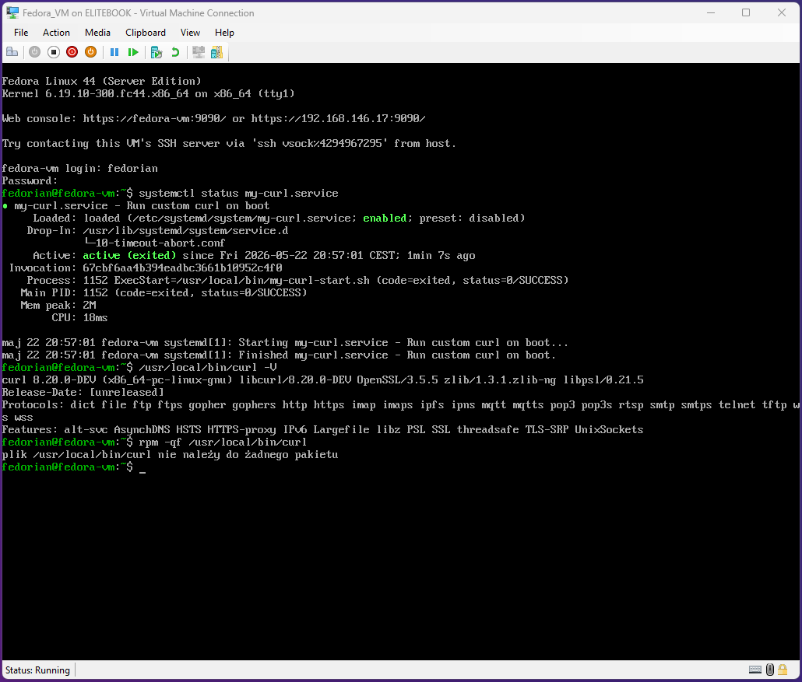

*logi potwierdzają, że program został uruchomiony po starcie i że nie jest to zainstalowany podczas instalacji wariant programu curl*

#### Logi serwera potwierdzają poprawne pobranie kickstarter'ów i artefaktu podczas instalacji:
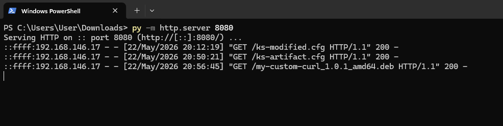