# Sprawozdanie 3

[historia poleceń](command_history.txt)

## Laboratorium 8

#### Utworzono drugą maszynę wirtualną:
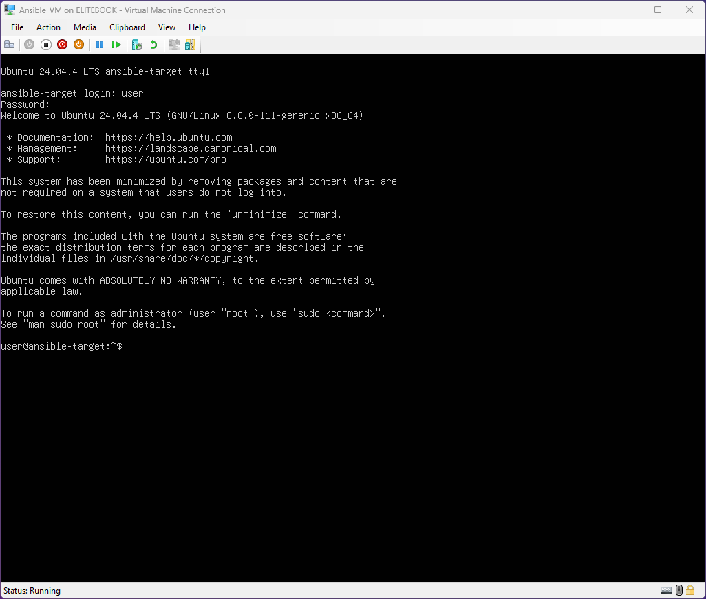

#### Zapewniono obecność programu tar i serwera OpenSSH oraz utworzono użytkownika *ansible*:
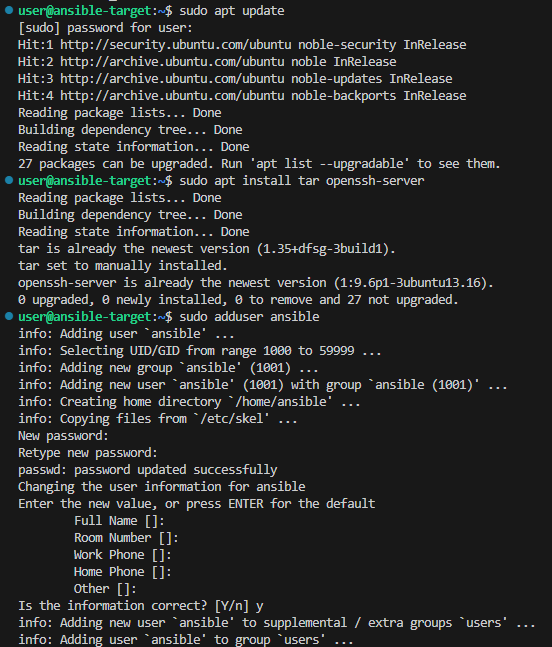

*hostname "ansible-target" został nadany już w trakcie konfiguracji maszyny*

#### Zainstalowano oprogramowanie Ansible na maszynie głównej:
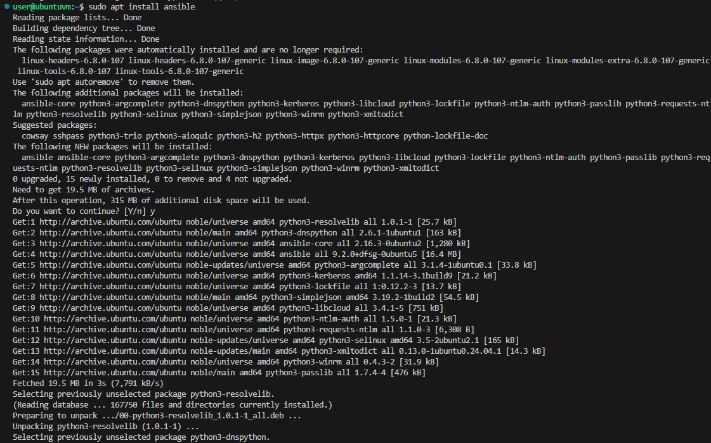
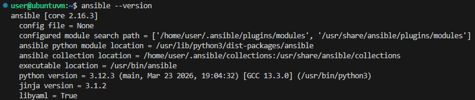

#### Wymieniono klucze ssh między maszyną główną a użytkownikiem *ansible* z *ansible-target*:
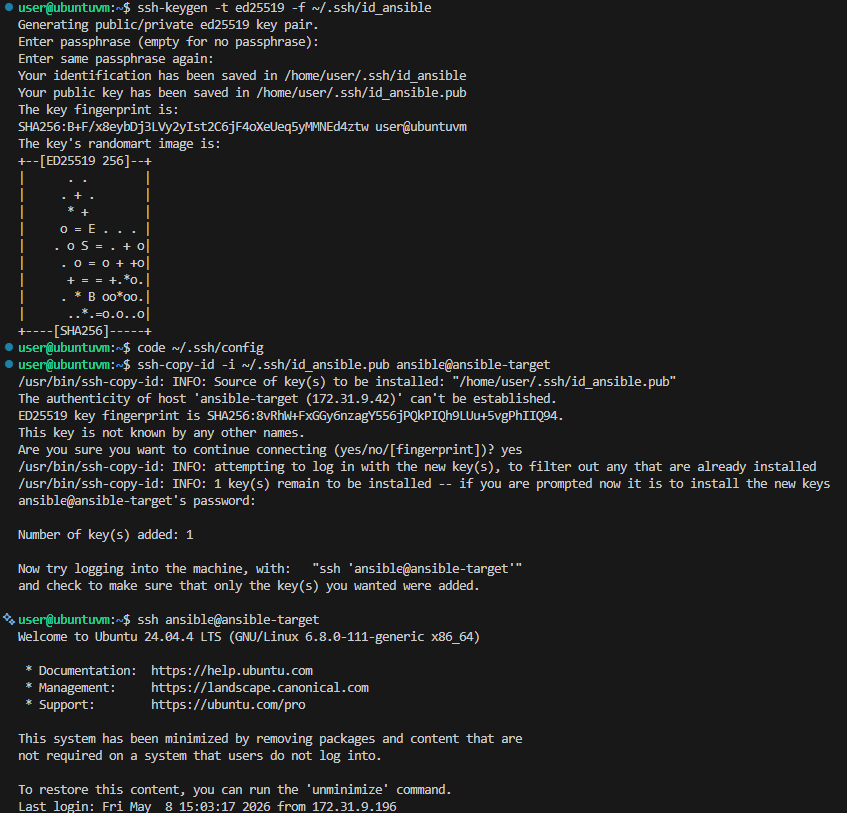

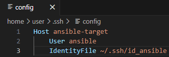

*możliwe jest nawiązanie połączenia bez konieczności podawania hasła*

#### Nadanie maszynie głównej nowej nazwy:
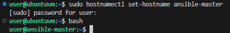

*nazewnictwo zostało zaktualizowane, ale pozostało niezmienione w interfejsie VS Code*

#### Zweryfikowano połączenie poprzez wykonanie *ping'u*:
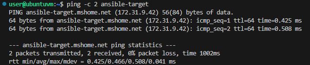

#### Stworzono [plik inwentaryzacji](inventory.ini) i wysłano za jego pośrednictwem żądanie *ping* do wszystkich maszyn:
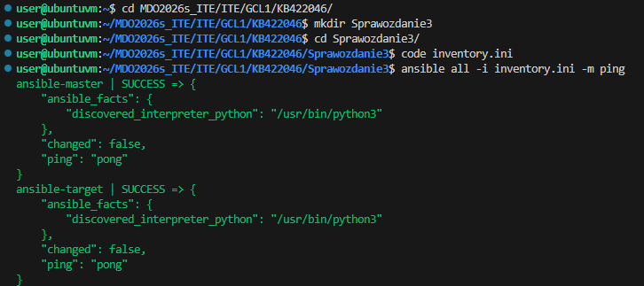

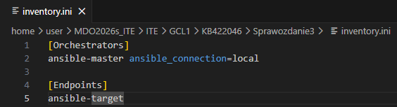

#### Utworzono [playbook'a Ansible](pbook.yml):
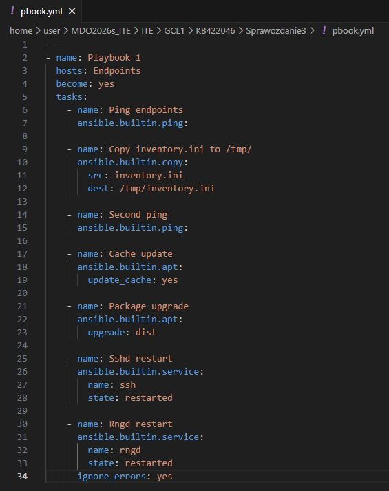

#### Uruchomiono playbook'a:
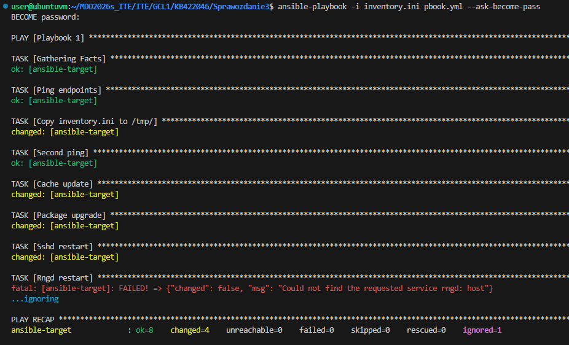

#### Wyłączono obsługę ssh na *ansible-target* i uruchomiono ponownie playbook'a:
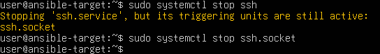
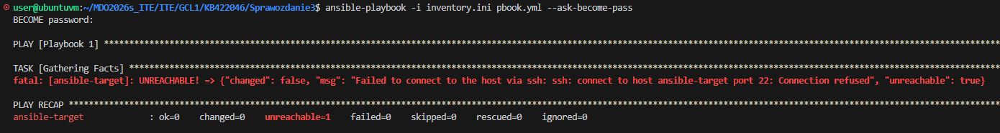