# Sprawozdanie 4

#### Informacje wstępne
Stanowisko pracy obejmuje: maszynę wirtualną postawioną w Hyper-v (na bazie obrazu Ubuntu Serwer 24.04.4), edytor VS Code połączony zdalnie z maszyną oraz program FileZilla dla ułatwionego przesyłania plików.

Do realizacji laboratoriów wybrano repozytorium narzędzia [*curl*](https://github.com/curl/curl) - posiada ono otwartą licencję, możliwość budowy kodu oraz uruchamialne testy.

Wszystkie zawarte w poniższym sprawozdaniu polecenia wykonane zostały z poziomu wbudowanego terminala VS Code. Szczegółowa historia poleceń została zawarta w oddzielnym [pliku](command_history.txt).

## Laboratorium 12

#### Sforkowano repozytorium wybranego oprogramowania:
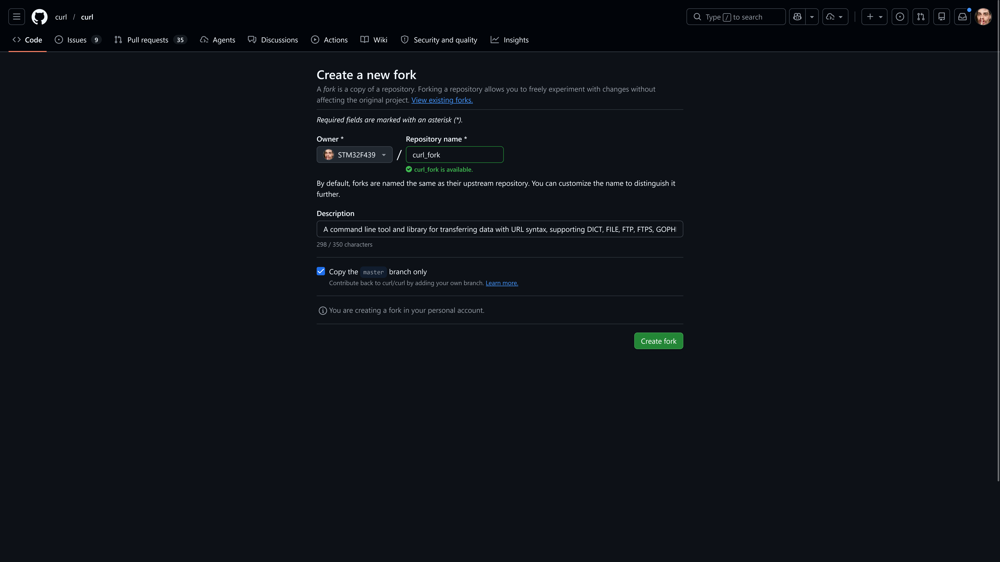
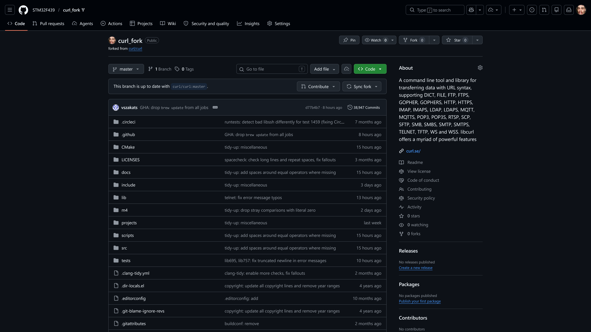

#### Sklonowano lokalnie fork'a:
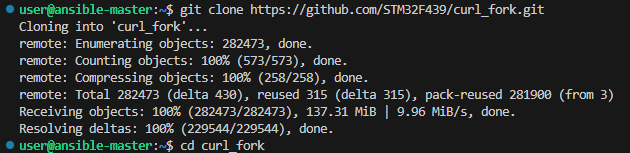

#### Usunięto obecne w projekcie *workflows*:
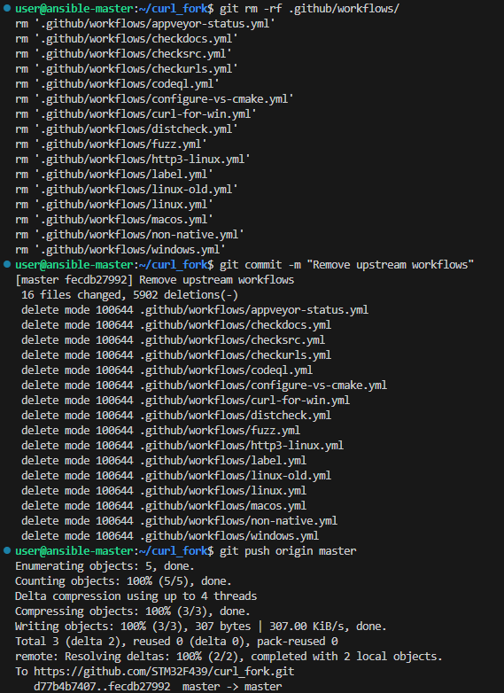

#### Utworzono gałąź *ino_dev*:
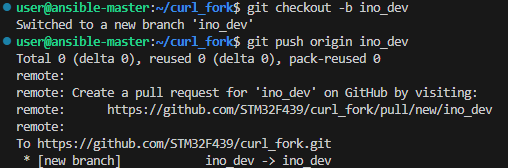

#### Utworzono [akcję](build.yml) przeprowadzającą build przy kontrybucji do gałęzi *ino_dev*:
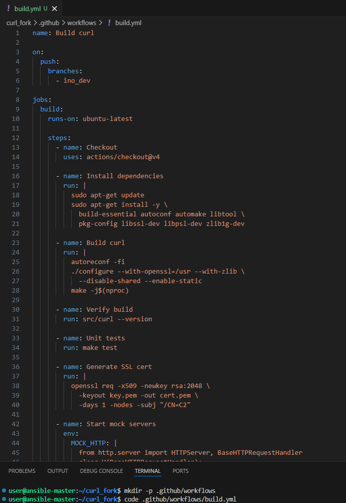

```
name: Build curl

on:
  push:
    branches:
      - ino_dev

jobs:
  build:
    runs-on: ubuntu-latest

    steps:
      - name: Checkout
        uses: actions/checkout@v4

      - name: Install dependencies
        run: |
          sudo apt-get update
          sudo apt-get install -y \
            build-essential autoconf automake libtool \
            pkg-config libssl-dev libpsl-dev zlib1g-dev

      - name: Build curl
        run: |
          autoreconf -fi
          ./configure --with-openssl=/usr --with-zlib \
            --disable-shared --enable-static
          make -j$(nproc)

      - name: Verify build
        run: src/curl --version

      - name: Unit tests
        run: make test

      - name: Generate SSL cert
        run: |
          openssl req -x509 -newkey rsa:2048 \
            -keyout key.pem -out cert.pem \
            -days 1 -nodes -subj "/CN=C2"

      - name: Start mock servers
        env:
          MOCK_HTTP: |
            from http.server import HTTPServer, BaseHTTPRequestHandler
            class H(BaseHTTPRequestHandler):
                def log_message(self, *a): pass
                def do_GET(self):
                    self.send_response(200)
                    self.end_headers()
                    self.wfile.write(b"HTTP_OK")
            HTTPServer(("0.0.0.0", 8081), H).serve_forever()
          MOCK_HTTPS: |
            import ssl
            from http.server import HTTPServer, BaseHTTPRequestHandler
            class H(BaseHTTPRequestHandler):
                def log_message(self, *a): pass
                def do_GET(self):
                    body = b"HTTPS_OK"
                    self.send_response(200)
                    self.send_header("Content-Length", str(len(body)))
                    self.end_headers()
                    self.wfile.write(body)
            httpd = HTTPServer(("0.0.0.0", 8082), H)
            ctx = ssl.SSLContext(ssl.PROTOCOL_TLS_SERVER)
            ctx.load_cert_chain("cert.pem", "key.pem")
            httpd.socket = ctx.wrap_socket(httpd.socket, server_side=True)
            httpd.serve_forever()
          MOCK_REST: |
            from http.server import HTTPServer, BaseHTTPRequestHandler
            class H(BaseHTTPRequestHandler):
                def log_message(self, *a): pass
                def do_POST(self):
                    self.send_response(200)
                    self.end_headers()
                    self.wfile.write(b"REST_OK")
            HTTPServer(("0.0.0.0", 8093), H).serve_forever()
        run: |
          echo "$MOCK_HTTP"  > mock_http.py
          echo "$MOCK_HTTPS" > mock_https.py
          echo "$MOCK_REST"  > mock_rest.py
          python3 mock_http.py  &
          python3 mock_https.py &
          python3 mock_rest.py  &
          sleep 5
          nc -z localhost 8081 || (echo "C1 not listening" && exit 1)
          nc -z localhost 8082 || (echo "C2 not listening" && exit 1)
          nc -z localhost 8093 || (echo "C3 not listening" && exit 1)

      - name: Test C1 (HTTP)
        run: |
          out=$(src/curl -sS http://localhost:8081)
          [ "$out" = "HTTP_OK" ] || (echo "C1: $out" && exit 1)

      - name: Test C2 (HTTPS)
        run: |
          out=$(src/curl -sS -k https://localhost:8082)
          [ "$out" = "HTTPS_OK" ] || (echo "C2: $out" && exit 1)

      - name: Test C3 (REST POST)
        run: |
          out=$(src/curl -sS -X POST http://localhost:8093)
          [ "$out" = "REST_OK" ] || (echo "C3: $out" && exit 1)

      - name: Upload artifact
        uses: actions/upload-artifact@v4
        with:
          name: curl-binary
          path: src/curl
          retention-days: 1
```

*stworzony pipeline obejmuje działania analogiczne do tych z wcześniejszego [Jenkinsfile](../Sprawozdanie2/Jenkinsfile) - instaluje potrzebne zależności, wykonuje build, przeprowadza testy jednostkowe i integracyjne, a na końcu opublikowywuje artefakt*

#### Wypchnięto zmiany do gałęzi:
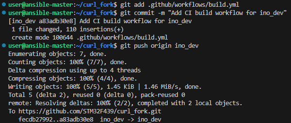

#### Zweryfikowano poprawność działania akcji:

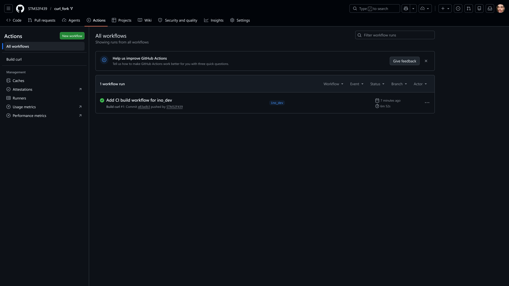
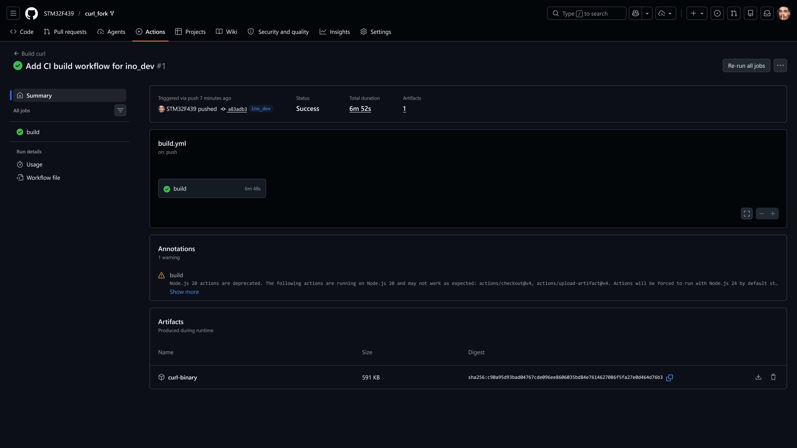

*wykonanie pipeline'u zakończyło się sukcesem - nie wystąpiły żadne błędy i uzyskany został binarny artefakt*

#### Dokonano zmian na gałęzi:
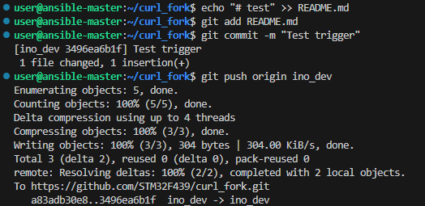
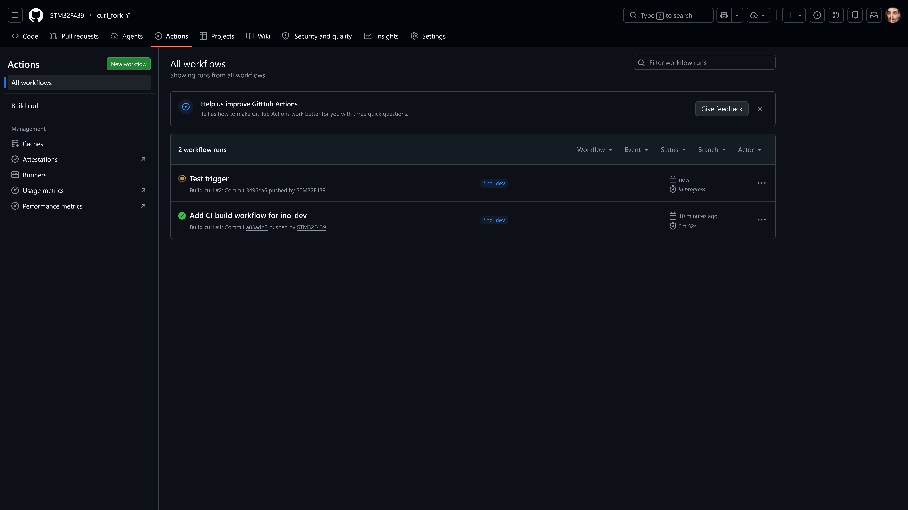
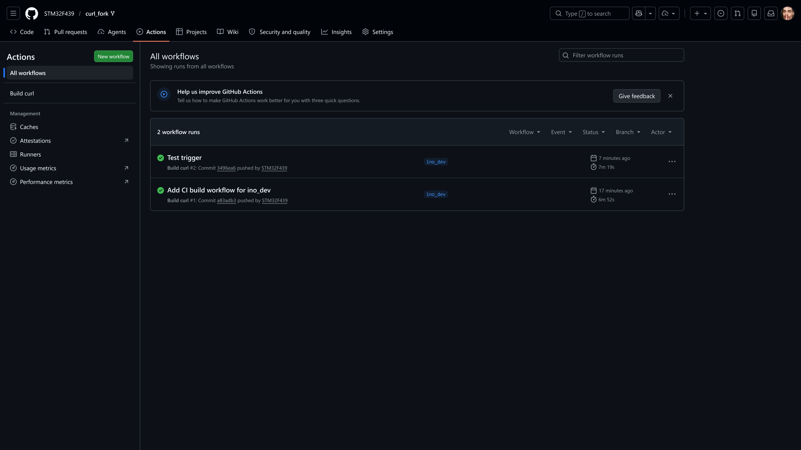

*po wprowadzeniu zmian na gałęzi pipeline wykonał się automatycznie*