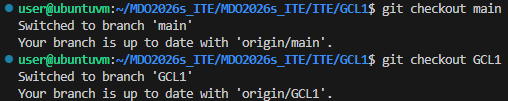
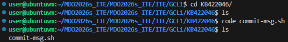
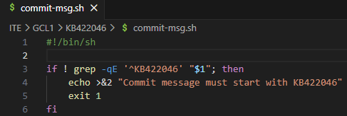

Przejscie do odpowiednich branchy:

Utworzenie wlasnej galezi:

Utworzenie wlasnego folderu:

Utworzenie hook'a i dodanie go do katalogu:

Tresc hook'a:

Skopiowanie hook'a do odpowiedniego folderu:

Modyfikacja uprawnien hook'a:

Dodanie sprawozdania i zrzutow ekranu:

Efekt dzialania hook'a:
