# Sprawozdanie 1 - Git, Docker i Jenkins

## Zajęcia 01 - Git, SSH i przygotowanie repozytorium

Celem pierwszych zajęć było przygotowanie środowiska do pracy z repozytorium GitHub. W ramach pracy skonfigurowano połączenie z maszyną wirtualną, sprawdzono dostęp przez SSH/SFTP, wygenerowano klucze SSH, dodano klucz publiczny do GitHuba oraz przygotowano własną gałąź do dalszej pracy.

---

### 1. Przygotowanie dostępu do maszyny wirtualnej

Na początku przygotowałem połączenie z maszyną wirtualną. Do pracy używałem Visual Studio Code oraz rozszerzenia Remote - SSH, które pozwala wygodnie pracować na plikach znajdujących się na zdalnym systemie.

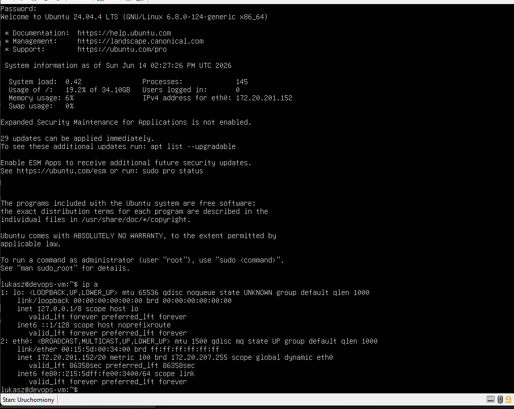

Po skonfigurowaniu połączenia sprawdziłem, czy mogę zalogować się na maszynę przez SSH. Dzięki temu można było wykonywać komendy bezpośrednio na Ubuntu.


Dodatkowo sprawdziłem podstawowe informacje o połączeniu i adresie IP maszyny.

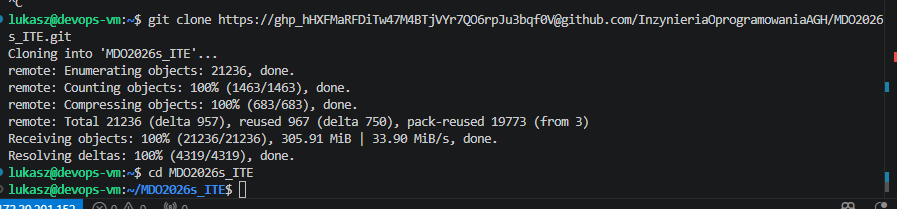

---

### 2. Połączenie przez SFTP

Oprócz pracy przez terminal sprawdziłem też połączenie przez FileZillę. Użyłem protokołu SFTP, żeby móc łatwiej przenosić pliki między komputerem lokalnym a maszyną wirtualną.

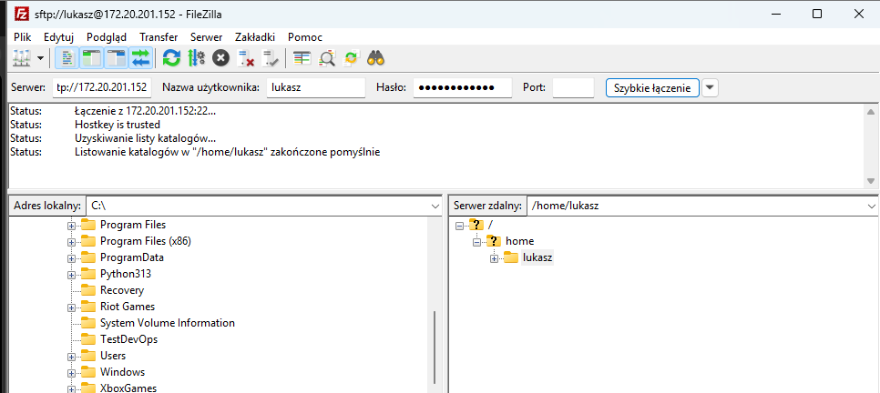

Połączenie zostało nawiązane poprawnie, a po stronie zdalnej widoczny był katalog użytkownika.

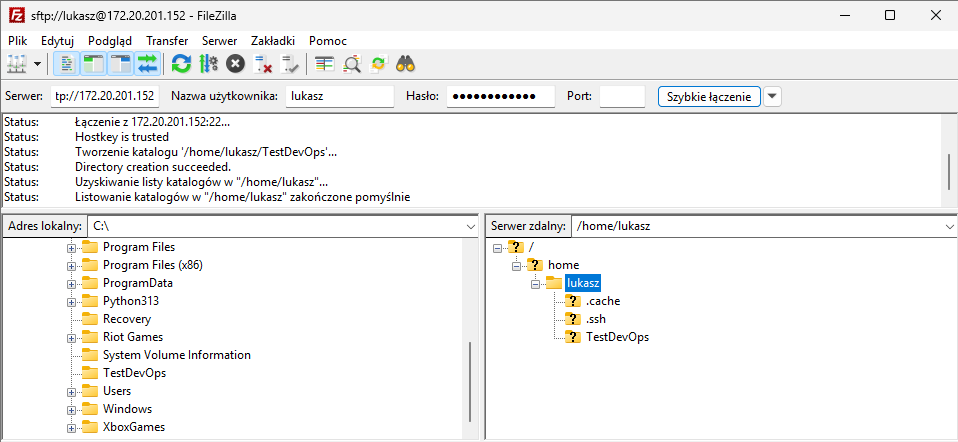

Następnie sprawdziłem listowanie katalogów i dostęp do plików na maszynie wirtualnej.


---

### 3. Sprawdzenie pracy z terminalem

Po poprawnym połączeniu można było pracować z terminalem na maszynie wirtualnej. W terminalu wykonywałem dalsze komendy związane z Gitem oraz konfiguracją repozytorium.

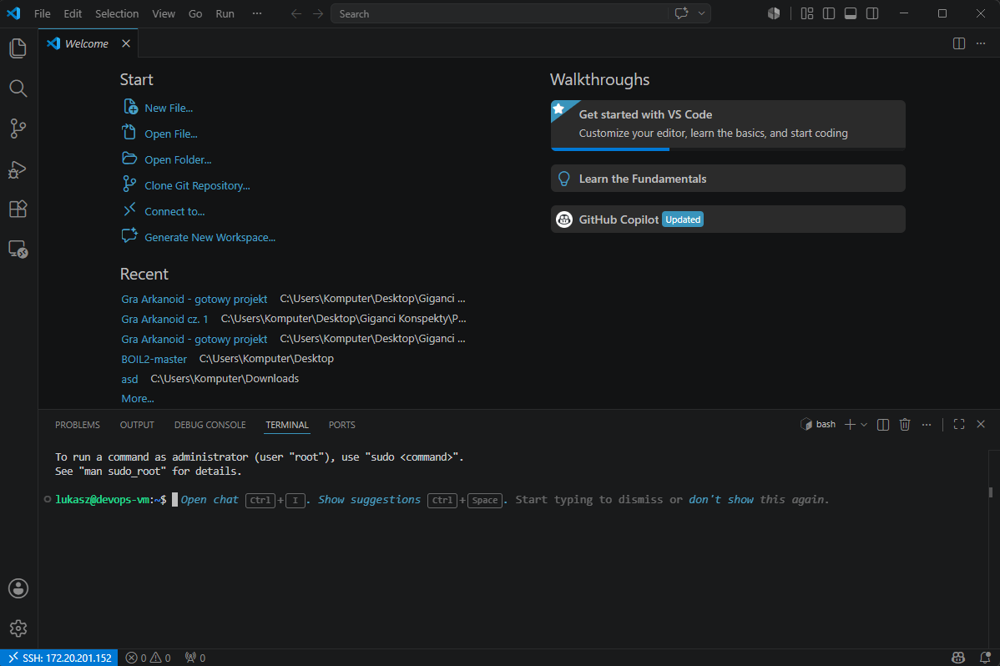

---

### 4. Generowanie kluczy SSH

Następnie wygenerowałem klucze SSH. Najpierw został utworzony klucz Ed25519, a później dodatkowo klucz ECDSA. Klucz publiczny jest potrzebny do dodania go na GitHubie, natomiast klucz prywatny zostaje lokalnie na maszynie.

Przykładowe komendy:

```bash
ssh-keygen -t ed25519 -C "lcurylo@student.agh.edu.pl"
ssh-keygen -t ecdsa -b 521 -C "lcurylo@student.agh.edu.pl"
```

Na zrzucie część danych została zamazana, żeby nie pokazywać pełnych informacji o kluczach.

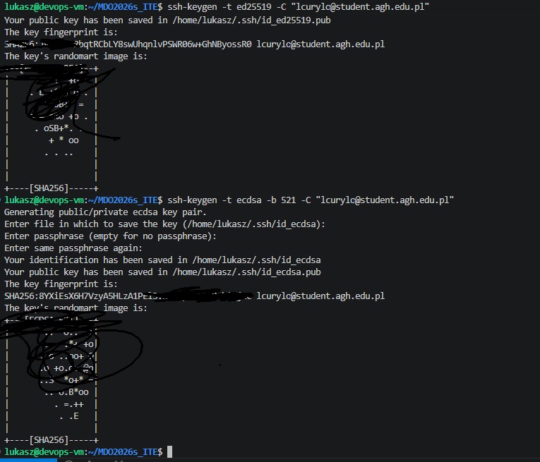

---

### 5. Dodanie klucza publicznego do GitHuba

Po wygenerowaniu klucza publicznego dodałem go w ustawieniach GitHuba w sekcji SSH and GPG keys. Dzięki temu GitHub może rozpoznać moją maszynę i pozwolić na klonowanie oraz wypychanie zmian przez SSH.

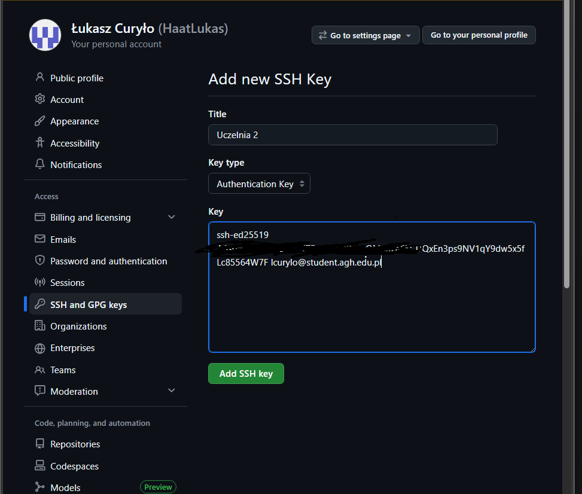

Po dodaniu klucza można było korzystać z adresu SSH repozytorium.

Przykładowa komenda klonowania:

```bash
git clone git@github.com:InzynieriaOprogramowaniaAGH/MDO2026s_ITE.git
```


---

### 6. Przygotowanie repozytorium i gałęzi

Po sklonowaniu repozytorium pobrałem aktualny stan zdalnych gałęzi:

```bash
git fetch --all
```

Następnie przełączyłem się na gałąź główną oraz gałąź zajęciową:

```bash
git checkout main
git checkout GCL1
```

Na końcu utworzyłem własną gałąź roboczą:

```bash
git checkout -b LC417617
```


---

### 7. Utworzenie struktury katalogów

Dla własnej gałęzi przygotowałem katalog na sprawozdanie oraz katalog na obrazki:

```bash
mkdir -p ITE/GCL1/LC417617/Sprawozdanie1/img
```

Dzięki temu kolejne pliki ze sprawozdania mogły być trzymane w jednym miejscu.

---

### 8. Przygotowanie hooka `commit-msg`

Na zajęciach przygotowałem też prosty hook Git, który sprawdza wiadomość commita. Chodziło o to, żeby commit zaczynał się od mojego numeru:

```text
LC417617
```

Plik `commit-msg` miał następującą zawartość:

```bash
#!/bin/bash

PREFIX="LC417617"
COMMIT_MSG=$(head -n 1 "$1")

if [[ ! $COMMIT_MSG == $PREFIX* ]]; then
    echo "=========================================="
    echo "BŁĄD COMMITA!"
    echo "Wiadomość musi zaczynać się od '$PREFIX'."
    echo "Twoja wiadomość: $COMMIT_MSG"
    echo "=========================================="
    exit 1
fi

exit 0
```


Po zapisaniu pliku nadałem mu uprawnienia do wykonywania i skopiowałem do katalogu hooków Gita:

```bash
chmod +x ITE/GCL1/LC417617/Sprawozdanie1/commit-msg
cp ITE/GCL1/LC417617/Sprawozdanie1/commit-msg .git/hooks/commit-msg
```

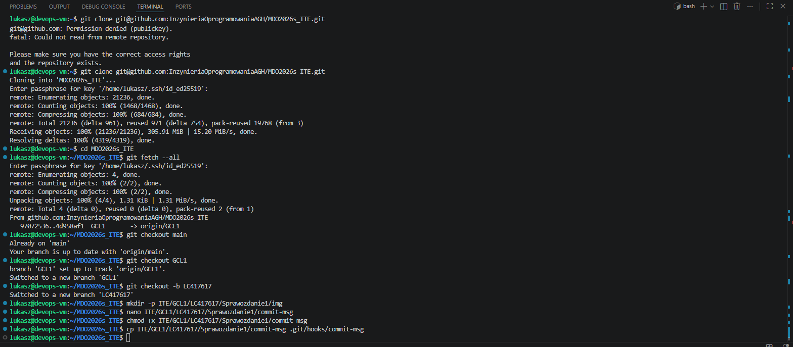

---

### 9. Wnioski

Po wykonaniu ćwiczenia repozytorium było gotowe do dalszej pracy. Udało się skonfigurować połączenie z maszyną, sprawdzić dostęp przez SSH i SFTP, dodać klucz publiczny do GitHuba oraz sklonować repozytorium przez SSH. Dodatkowo utworzono własną gałąź `LC417617` i przygotowano hook `commit-msg`, który pilnuje poprawnego prefiksu w wiadomościach commitów.

---

### 10. Użycie narzędzi generatywnej AI

Podczas przygotowywania sprawozdania skorzystałem z pomocy LLM głównie do uporządkowania tekstu i poprawienia opisu kroków w Markdownzie.

Przykładowe pytania:

```text
Jak opisać konfigurację SSH i kluczy GitHub w sprawozdaniu?
```

```text
Jak poprawnie opisać działanie hooka commit-msg w Git?
```

```text
Jak sprawdzić, czy obrazki w README mają poprawne ścieżki?
```

Odpowiedzi zostały sprawdzone ręcznie przez porównanie z wykonanymi komendami oraz zrzutami ekranu.


## Zajęcia 02 - Docker i konteneryzacja

Celem zajęć było uruchomienie Dockera na maszynie wirtualnej i sprawdzenie podstawowej pracy z kontenerami. W ramach ćwiczenia pobrano kilka obrazów, uruchomiono kontenery, sprawdzono izolację procesów, przygotowano prosty `Dockerfile` oraz na końcu wyczyszczono środowisko.

---

### 1. Instalacja Dockera i pierwsze obrazy

Na początku zainstalowałem pakiet `docker.io`, a następnie sprawdziłem, czy Docker działa poprawnie. Do podstawowego testu wykorzystałem obraz `hello-world`.

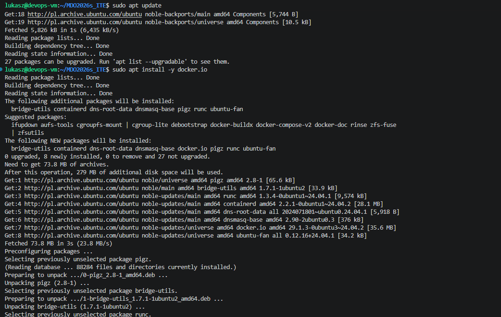

Pobrano i uruchomiono kilka podstawowych obrazów. Dzięki temu można było porównać ich rozmiary oraz sposób działania.

| Obraz         | Przybliżony rozmiar | Kod wyjścia  | Do czego został użyty           |
| :------------ | :------------------ | :----------- | :------------------------------ |
| `hello-world` | około 13 KB         | `0`          | sprawdzenie, czy Docker działa  |
| `busybox`     | około 4 MB          | `0`          | prosty, mały kontener do testów |
| `ubuntu`      | około 78 MB         | `0`          | pełniejsze środowisko Linux     |
| `nginx`       | około 190 MB        | działa w tle | przykład kontenera z usługą WWW |

---

### 2. Uruchamianie kontenerów i izolacja procesów

Następnie uruchomiłem kontener `busybox` w trybie interaktywnym. W środku kontenera wykonałem proste komendy, między innymi `uname -a`, żeby sprawdzić, że pracuję wewnątrz osobnego środowiska.

Później uruchomiłem kontener z obrazem `ubuntu`. W nim doinstalowałem pakiet `procps`, żeby móc użyć komendy `ps -ef` i zobaczyć procesy działające w kontenerze.

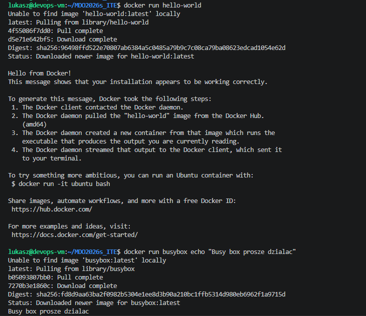

*Rys. 1. Uruchamianie kontenerów i sprawdzanie podstawowych komend.*

W kontenerze proces `/bin/bash` był widoczny jako jeden z głównych procesów. Po stronie hosta ten sam kontener był jednak zwykłym procesem zarządzanym przez Dockera. Pokazuje to, że kontener ma własne odizolowane środowisko, ale nadal działa na tym samym systemie hosta.

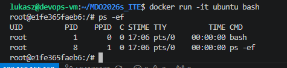

*Rys. 2. Lista procesów widoczna wewnątrz kontenera Ubuntu.*

---

### 3. Przygotowanie własnego Dockerfile

W kolejnym kroku przygotowałem własny plik `Dockerfile`. Obraz bazował na `ubuntu:24.04`. W środku instalowany był `git`, a następnie klonowane było repozytorium do katalogu `/app`.

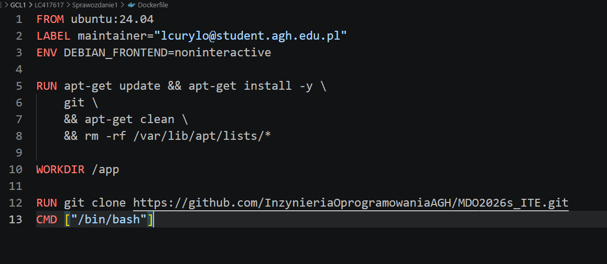

*Rys. 3. Zawartość przygotowanego pliku Dockerfile.*

Obraz został zbudowany poleceniem:

```bash
docker build -t lc-obraz .
```

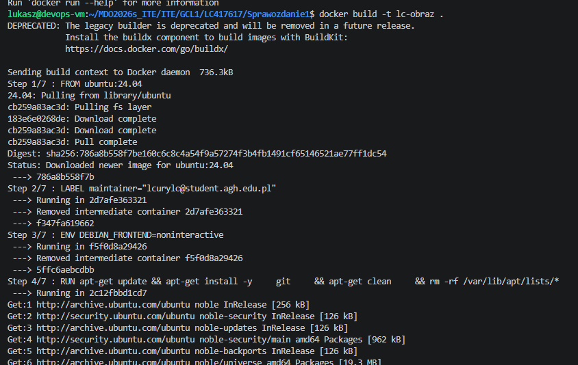

*Rys. 4. Budowanie własnego obrazu na podstawie Dockerfile.*

Po zbudowaniu obrazu uruchomiłem kontener i sprawdziłem, czy repozytorium zostało poprawnie pobrane do katalogu roboczego.

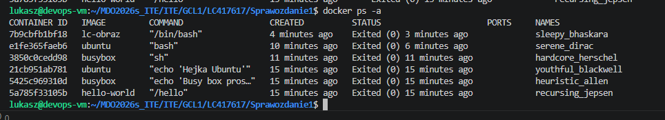

*Rys. 5. Sprawdzenie plików w katalogu `/app` wewnątrz kontenera.*

---

### 4. Czyszczenie kontenerów i obrazów

Na końcu wyczyściłem środowisko, żeby nie zostawiać niepotrzebnych kontenerów i obrazów. Najpierw usunąłem zatrzymane kontenery:

```bash
docker container prune -f
```

Następnie usuwałem niepotrzebne obrazy:

```bash
docker rmi <nazwa_obrazu>
```

Dodatkowo użyłem czyszczenia nieużywanych obrazów:

```bash
docker image prune -a -f
```

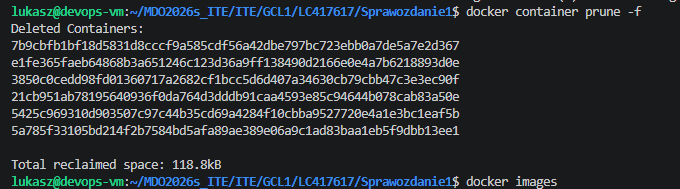

*Rys. 6. Czyszczenie zatrzymanych kontenerów.*

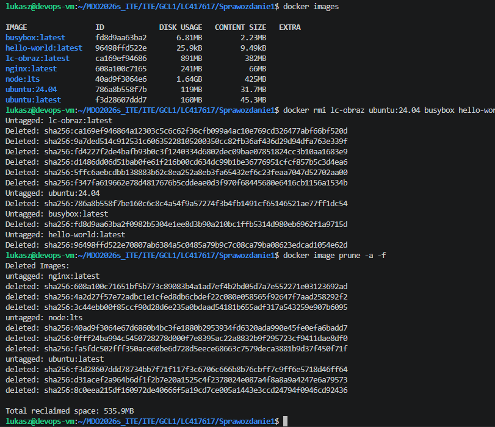

*Rys. 7. Usuwanie nieużywanych obrazów Dockera.*

---

### 5. Wnioski

Po wykonaniu ćwiczenia Docker był poprawnie zainstalowany i można było uruchamiać kontenery z różnych obrazów. Sprawdziłem też, że kontener ma własne środowisko i własną listę procesów, ale nadal działa jako proces na hoście.

Przygotowanie własnego `Dockerfile` pozwoliło zautomatyzować tworzenie obrazu z potrzebnymi pakietami i sklonowanym repozytorium. Na końcu ważne było też posprzątanie środowiska, ponieważ obrazy i zatrzymane kontenery mogą szybko zajmować sporo miejsca.

---

### Użycie narzędzi generatywnej AI

Podczas przygotowywania sprawozdania skorzystałem z pomocy LLM głównie przy uporządkowaniu opisu i poprawieniu Markdowna.

Przykładowe pytania:

```text
Jak opisać podstawowe działanie Dockera i kontenerów w sprawozdaniu?
```

```text
Jak krótko wyjaśnić różnicę między obrazem a kontenerem?
```

```text
Jak opisać prosty Dockerfile bazujący na Ubuntu 24.04?
```

Odpowiedzi zostały sprawdzone ręcznie na podstawie wykonanych komend, zrzutów ekranu oraz działania kontenerów.


## Zajęcia 03 - Dockerfiles, kontener jako definicja etapu

### 1. Wybór projektu

Do wykonania zadania wybrałem bibliotekę **cJSON**. Jest to lekki parser JSON napisany w języku C. Projekt nadaje się do tego ćwiczenia, ponieważ można go zbudować za pomocą `CMake`, a testy można uruchomić przez `CTest`.

Dodatkowo projekt ma otwartą licencję MIT, więc można go bez problemu wykorzystać do ćwiczeń laboratoryjnych.

---

### 2. Build i testy w kontenerze interaktywnym

Na początku sprawdziłem budowanie projektu ręcznie, wewnątrz kontenera `ubuntu:24.04`. W kontenerze zainstalowałem potrzebne pakiety:

```bash
apt update
apt install -y git cmake build-essential
```

Następnie sklonowałem projekt `cJSON`, przygotowałem katalog `build`, uruchomiłem `cmake`, zbudowałem projekt i odpaliłem testy.

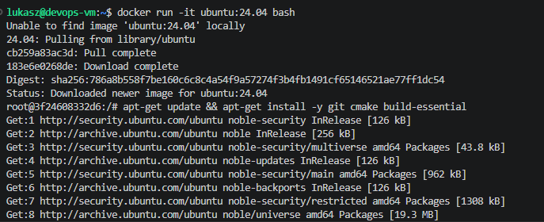

*Rys. 1. Przygotowanie kontenera i instalacja potrzebnych pakietów.*

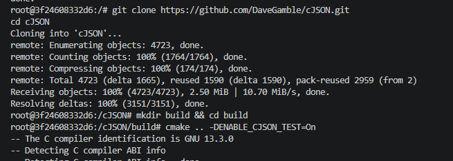

*Rys. 2. Praca wewnątrz kontenera Ubuntu.*

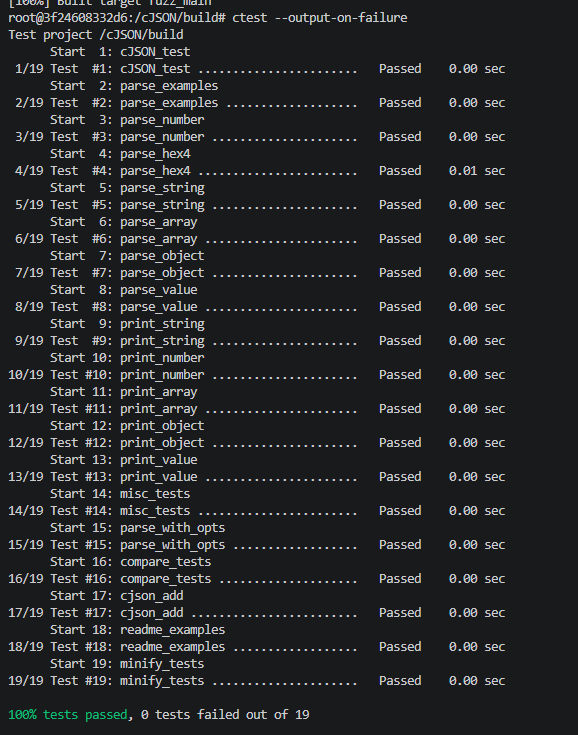

*Rys. 3. Uruchomienie testów projektu cJSON w kontenerze.*

Ten etap był potrzebny, żeby najpierw ręcznie sprawdzić, jakie komendy są wymagane do zbudowania i przetestowania projektu. Dopiero potem te same kroki można było przenieść do plików Dockerfile.

---

### 3. Automatyzacja procesu przez Dockerfile

Po ręcznym sprawdzeniu komend przygotowałem dwa osobne pliki:

1. `Dockerfile.build` — przygotowuje środowisko, pobiera kod i buduje projekt.
2. `Dockerfile.test` — bazuje na obrazie buildowym i uruchamia testy.

Taki podział pozwala potraktować kontener jako osobny etap procesu CI. Najpierw powstaje obraz z gotowym buildem, a potem drugi etap używa tego obrazu do testowania.

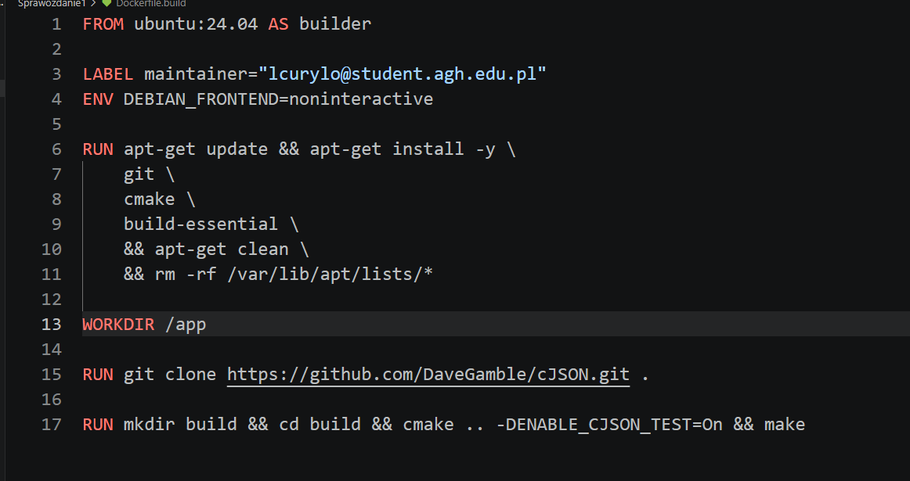

*Rys. 4. Plik Dockerfile.build używany do budowania projektu.*

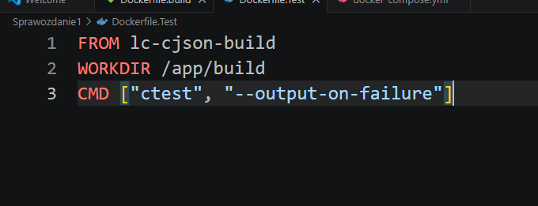

*Rys. 5. Plik Dockerfile.test używany do uruchomienia testów.*

---

### 4. Docker Compose

Na końcu użyłem Docker Compose, żeby nie uruchamiać wszystkiego ręcznie pojedynczymi komendami. Plik `docker-compose.yml` opisuje usługę testową i pozwala zbudować oraz uruchomić testy jednym poleceniem.

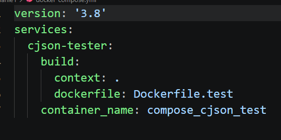

*Rys. 6. Plik docker-compose.yml przygotowany dla testów.*

Do uruchomienia kompozycji użyłem polecenia:

```bash
docker compose up --build
```

W razie braku narzędzia `docker compose` konieczne było doinstalowanie odpowiednich pakietów.

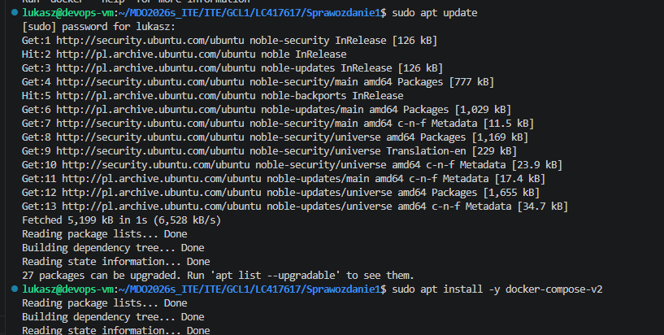

*Rys. 7. Instalacja pakietów potrzebnych do użycia Docker Compose.*

Po uruchomieniu Docker Compose obraz został zbudowany, a testy zostały wykonane automatycznie.

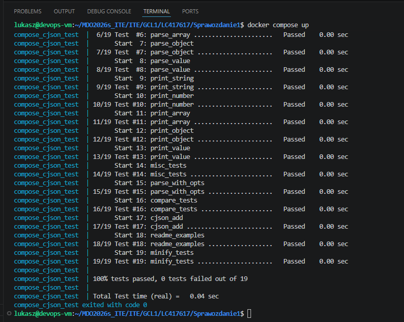

*Rys. 8. Wynik działania Docker Compose — zbudowanie obrazu i uruchomienie testów cJSON.*

---

### 5. Dyskusja o wdrożeniu i artefaktach

### Czy program nadaje się do wdrażania jako kontener?

W tym przypadku raczej nie. `cJSON` jest biblioteką programistyczną, a nie samodzielną aplikacją serwerową. Nie ma więc dużego sensu uruchamiać jej jako stałego kontenera produkcyjnego. Kontener jest tutaj bardziej przydatny jako powtarzalne środowisko do budowania i testowania.

### Jak przygotować finalny artefakt?

Finalnym artefaktem nie powinien być cały ciężki obraz z kompilatorem, CMake i innymi narzędziami. Lepszym rozwiązaniem byłoby wyciągnięcie samej zbudowanej biblioteki albo przygotowanie paczki instalacyjnej.

### Czy deploy/publish powinien być osobnym etapem?

Tak. Build i testy mogą być osobnymi etapami, a publikacja artefaktu powinna być kolejnym krokiem. W praktyce można to zrobić na przykład przez multi-stage build albo przez zapisanie wyniku budowania jako artefaktu pipeline'u.

### Czy zbudowany program warto dystrybuować jako pakiet?

Dla biblioteki C sensownym rozwiązaniem byłaby paczka systemowa, np. `.deb` albo `.rpm`, ewentualnie archiwum z plikami biblioteki i nagłówkami. Do takiego pakowania można wykorzystać np. `CPack`, ponieważ projekt korzysta z CMake.

---

### 6. Wnioski

Na tych zajęciach najpierw ręcznie sprawdziłem, jak zbudować i przetestować projekt w kontenerze, a potem przeniosłem te kroki do plików Dockerfile. Dzięki temu proces stał się bardziej powtarzalny.

Najważniejszy wniosek jest taki, że kontener nie musi oznaczać tylko gotowej aplikacji do uruchomienia. Może też opisywać konkretny etap pracy, np. build albo testy. W przypadku `cJSON` kontener najlepiej sprawdził się właśnie jako środowisko CI, a nie jako finalny produkt do wdrożenia.

---

### Użycie narzędzi generatywnej AI

Podczas przygotowywania tej części sprawozdania skorzystałem z pomocy LLM przy uporządkowaniu odpowiedzi do części dyskusyjnej oraz przy poprawieniu opisu w Markdownzie.

Przykładowe pytania:

```text
Jak opisać różnicę między etapem build i test w Dockerfile?
```

```text
Czy biblioteka cJSON nadaje się do wdrażania jako kontener?
```

```text
Jak opisać artefakt dla biblioteki budowanej przez CMake?
```

Odpowiedzi zostały sprawdzone ręcznie na podstawie działania przygotowanych plików `Dockerfile.build`, `Dockerfile.test` oraz `docker-compose.yml`.

## Zajęcia 04 - Woluminy, sieci, SSHD i Jenkins

Na tych zajęciach sprawdzałem kilka dodatkowych elementów Dockera: woluminy, bind mounty, własne sieci, komunikację między kontenerami, kontener z SSHD oraz uruchomienie Jenkinsa z Docker-in-Docker. Celem było zobaczenie, jak kontenery mogą wymieniać dane, jak można zachować pliki po zakończeniu kontenera i jak przygotować proste środowisko pod późniejsze pipeline'y.

---

### 1. Woluminy wejściowy i wyjściowy

Na początku przygotowałem dwa woluminy:

```text
wejscie_lc417617
wyjscie_lc417617
```

Pierwszy wolumin służył do przekazania kodu źródłowego do kontenera, a drugi do zapisania wyniku budowania. Dzięki temu dane nie znikały razem z kontenerem.

Po sprawdzeniu mountów było widać, że kontener `builder_vol` korzystał z obu woluminów:

```text
builder_vol
volume: /var/lib/docker/volumes/wejscie_lc417617/_data -> /wejscie
volume: /var/lib/docker/volumes/wyjscie_lc417617/_data -> /wyjscie
```

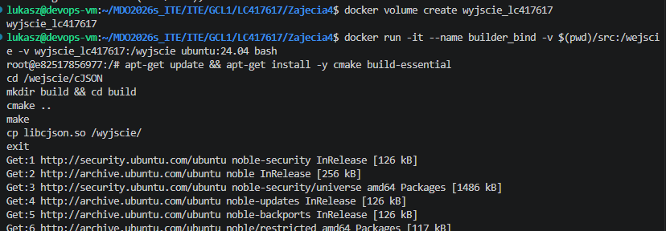

---

### 2. Bind mount jako drugi wariant

Drugim sposobem przekazania plików do kontenera był bind mount. W tym przypadku katalog z hosta został podłączony bezpośrednio do katalogu `/wejscie` w kontenerze.

Wynik sprawdzania mountów wyglądał tak:

```text
builder_bind
bind: /home/lukasz/MDO2026s_ITE/ITE/GCL1/LC417617/Zajecia4/src -> /wejscie
volume: /var/lib/docker/volumes/wyjscie_lc417617/_data -> /wyjscie
```

Bind mount jest wygodny przy pracy lokalnej, bo zmiany w plikach na hoście są od razu widoczne w kontenerze. Wolumin jest z kolei bardziej zarządzany przez Dockera i lepiej nadaje się do przechowywania danych kontenera.

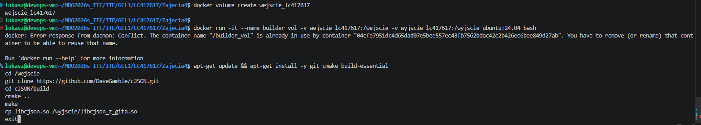

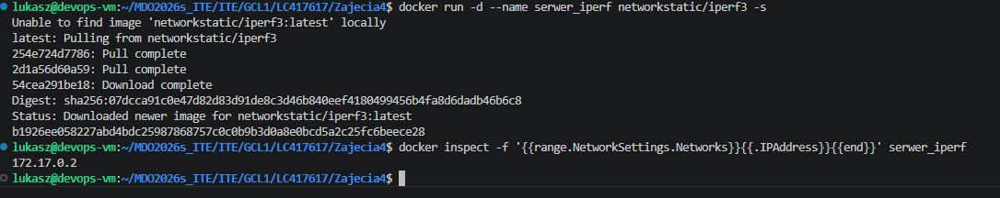

---

### 3. Budowanie projektu w kontenerze

Do testów ponownie wykorzystałem projekt `cJSON`. Kod źródłowy był dostępny w katalogu wejściowym, a wyniki budowania trafiały do katalogu wyjściowego.

W tym podejściu kontener pełnił rolę środowiska buildowego. Na hoście nie trzeba było instalować wszystkich narzędzi potrzebnych do kompilacji, bo znajdowały się one wewnątrz kontenera. Dzięki temu taki build można łatwiej powtórzyć na innej maszynie.

---

### 4. Własna sieć bridge

Następnie utworzyłem własną sieć Dockera:

```text
siec_lc417617
```

Polecenie `docker network ls` potwierdziło, że sieć została utworzona:

```text
siec_lc417617    bridge    local
```

Własna sieć bridge pozwala kontenerom komunikować się ze sobą po nazwach. Jest to wygodniejsze niż ręczne sprawdzanie adresów IP, bo nazwy kontenerów są czytelniejsze i łatwiejsze do użycia.

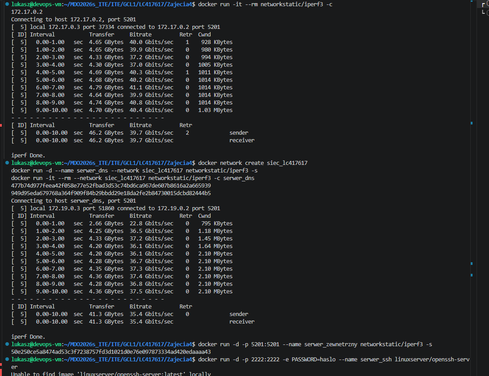

---

### 5. Komunikacja między kontenerami i iperf3

Do sprawdzenia komunikacji między kontenerami użyłem `iperf3`. Przygotowane były kontenery związane z testem sieci:

```text
serwer_iperf
serwer_dns
serwer_zewnetrzny
```

W trakcie pracy pojawiły się problemy z uruchomieniem części kontenerów i połączeniem między nimi. Po poprawkach można było sprawdzić konfigurację sieci oraz komunikację w obrębie własnej sieci Dockera.

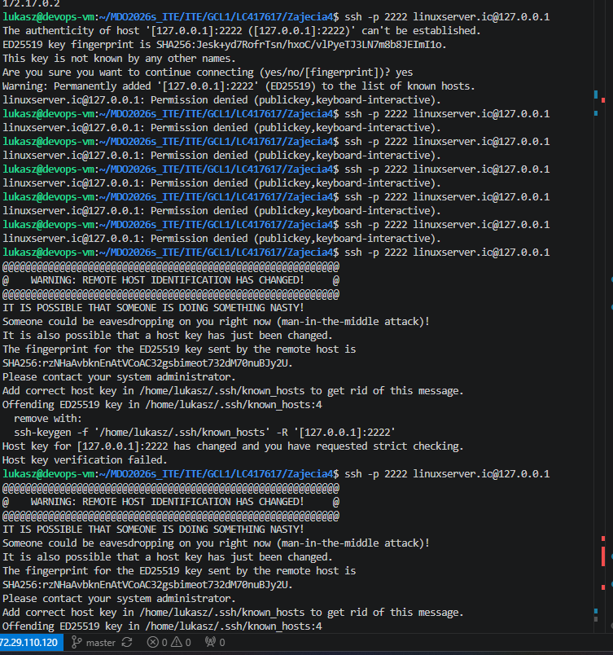

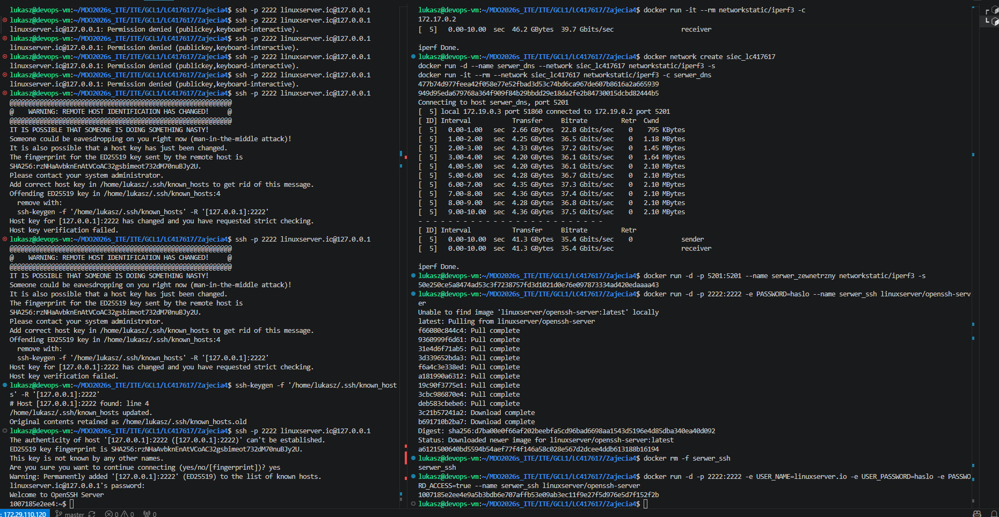

---

### 6. SSHD w kontenerze

W ramach ćwiczenia uruchomiłem też kontener z usługą SSHD. Kontener miał nazwę:

```text
serwer_ssh
```

Był oparty na obrazie:

```text
linuxserver/openssh-server
```

Dla tego kontenera utworzony był również wolumin konfiguracyjny:

```text
serwer_ssh
volume: /var/lib/docker/volumes/.../_data -> /config
```

Taki kontener pokazuje, że można uruchomić w Dockerze usługę podobną do tej znanej z klasycznej maszyny Linux. W praktyce do zwykłej pracy z kontenerem częściej używa się jednak `docker exec`, bo jest prostsze i nie wymaga osobnej konfiguracji SSH.

---

### 7. Docker Compose

Do automatyzacji uruchamiania kontenerów użyłem Docker Compose. Po wejściu do katalogu `Sprawozdanie1` uruchomiłem:

```bash
docker compose up -d
docker compose ps
```

Docker Compose uruchomił usługę testującą projekt `cJSON`:

```text
NAME                 IMAGE                        COMMAND                  SERVICE
compose_cjson_test   sprawozdanie1-cjson-tester   "ctest --output-on-f…"   cjson-tester
```

Po wykonaniu testów kontener zakończył działanie z kodem `0`, czyli testy przeszły poprawnie:

```text
compose_cjson_test    Exited (0)
```

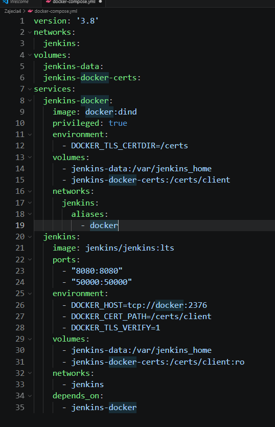

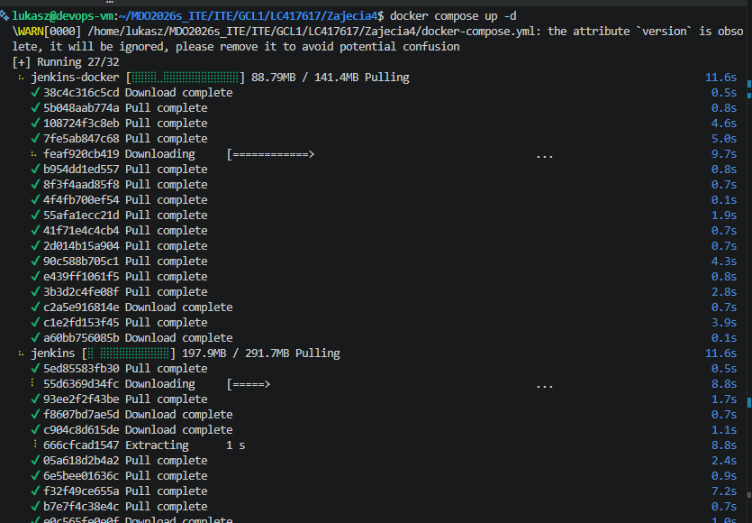

---

### 8. Jenkins i Docker-in-Docker

Na końcu uruchomiłem Jenkinsa w kontenerze razem z kontenerem Docker-in-Docker. Taki układ pozwala Jenkinsowi korzystać z Dockera, na przykład do budowania obrazów i uruchamiania kontenerów w pipeline'ach.

W środowisku widoczne były kontenery:

```text
zajecia4-jenkins-1
zajecia4-jenkins-docker-1
```

Dla Jenkinsa utworzone były też woluminy:

```text
zajecia4_jenkins-data
zajecia4_jenkins-docker-certs
```

oraz sieć:

```text
zajecia4_jenkins
```

Po sprawdzeniu mountów było widać, że Jenkins miał trwały katalog domowy:

```text
zajecia4-jenkins-1
volume: /var/lib/docker/volumes/zajecia4_jenkins-data/_data -> /var/jenkins_home
volume: /var/lib/docker/volumes/zajecia4_jenkins-docker-certs/_data -> /certs/client
```

Kontener Docker-in-Docker miał dodatkowo własny katalog na dane Dockera:

```text
zajecia4-jenkins-docker-1
volume: /var/lib/docker/volumes/.../_data -> /var/lib/docker
```

Dzięki temu stan Jenkinsa i dane Dockera nie znikały od razu po zatrzymaniu kontenerów.

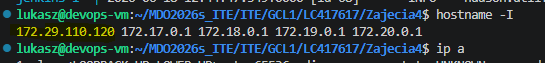

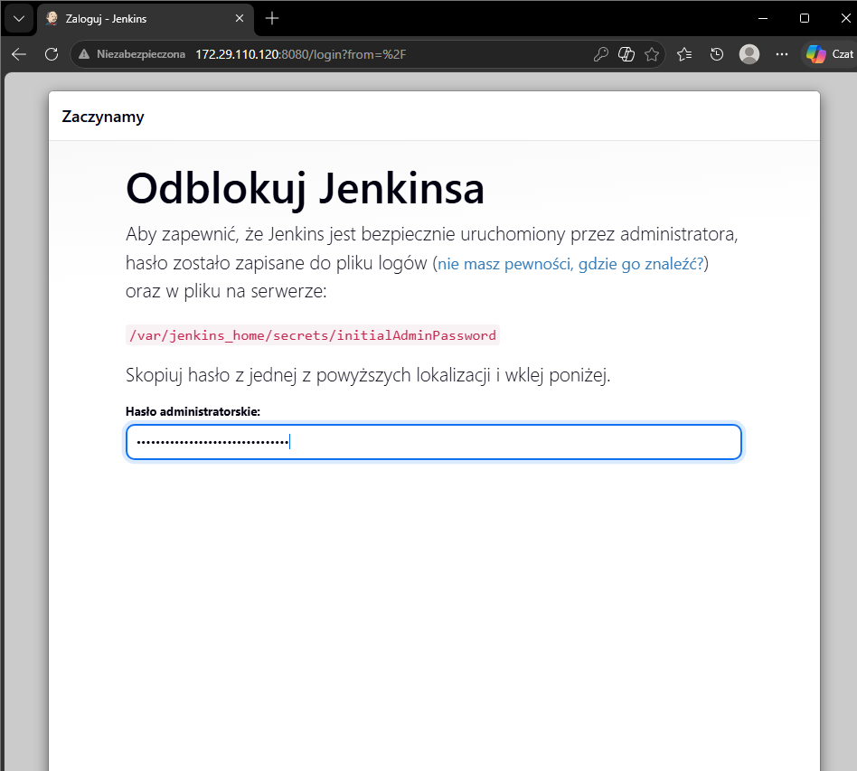

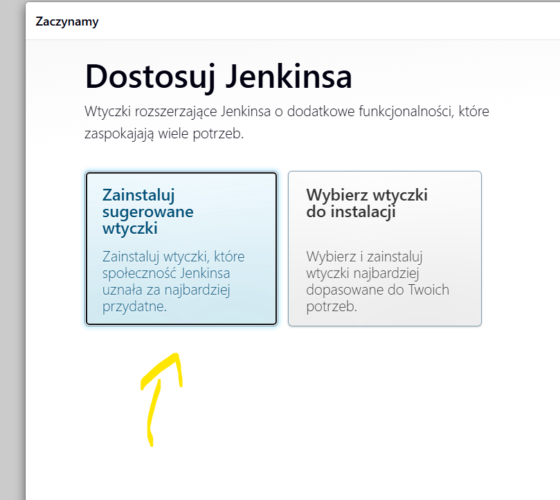

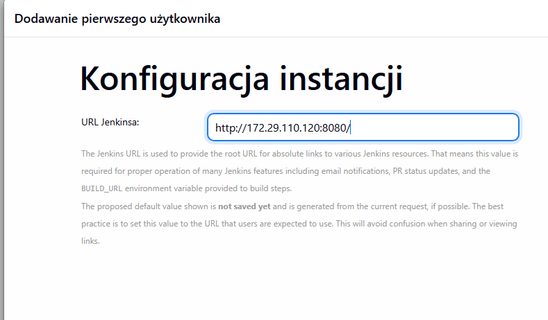

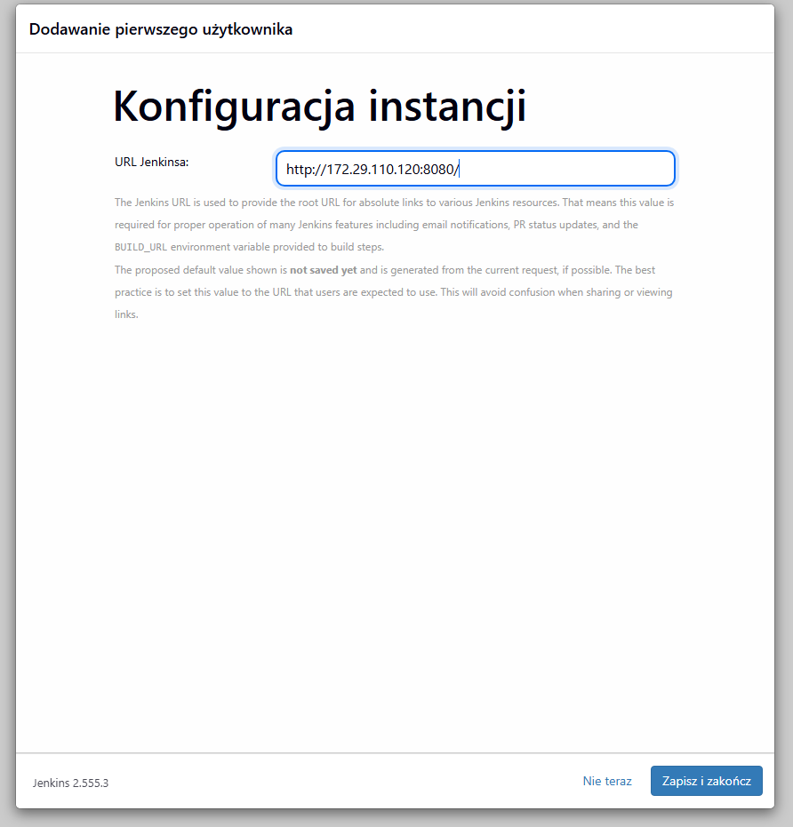

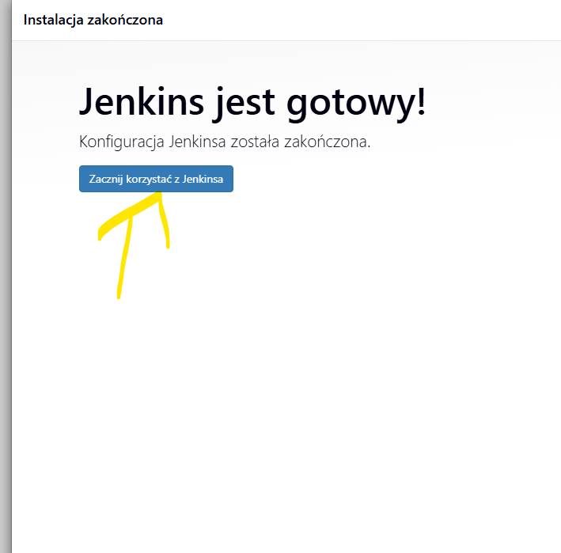

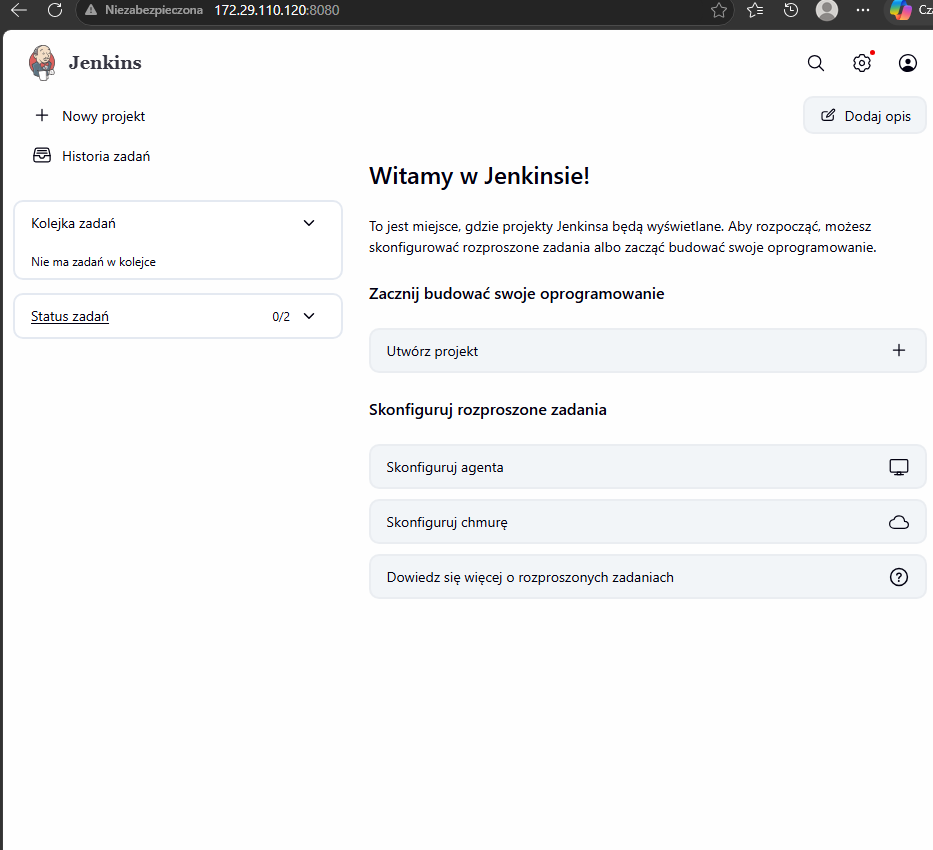

---

### 9. Stan końcowy środowiska

Na końcu sprawdziłem kontenery, woluminy i sieci Dockera.

Wśród kontenerów były widoczne między innymi:

```text
builder_vol
builder_bind
serwer_iperf
serwer_dns
serwer_zewnetrzny
serwer_ssh
zajecia4-jenkins-1
zajecia4-jenkins-docker-1
compose_cjson_test
```

Wśród woluminów znajdowały się między innymi:

```text
wejscie_lc417617
wyjscie_lc417617
zajecia4_jenkins-data
zajecia4_jenkins-docker-certs
```

Widoczne były też sieci:

```text
siec_lc417617
sprawozdanie1_default
zajecia4_jenkins
```

To potwierdziło, że wykonane zostały części związane z woluminami, bind mountami, siecią, Docker Compose oraz Jenkinsem.

---

### 10. Krótka dyskusja o `docker build` i `RUN --mount`

Część pracy z przekazywaniem plików można byłoby wykonać także podczas budowania obrazu przez `docker build`. Służy do tego między innymi `RUN --mount`, które pozwala tymczasowo podłączyć katalog lub cache podczas wykonywania konkretnej instrukcji `RUN`.

W tym ćwiczeniu łatwiejsze było jednak użycie `docker run` z woluminami i bind mountami. Dzięki temu dało się prosto sprawdzić, co znajduje się w katalogu wejściowym i wyjściowym. `RUN --mount` byłoby lepsze przy bardziej uporządkowanym Dockerfile, gdzie cały proces builda miałby być opisany jako część budowania obrazu.

---

### 11. Wnioski

Na tych zajęciach sprawdziłem, czym różni się zwykły kontener od kontenera z woluminem i kontenera z bind mountem. Woluminy dobrze nadają się do danych zarządzanych przez Dockera, a bind mounty są wygodne wtedy, gdy chcemy pracować bezpośrednio na plikach z hosta.

Własna sieć bridge pozwoliła przetestować komunikację między kontenerami. Kontener z SSHD pokazał, że w Dockerze można uruchomić klasyczną usługę sieciową, chociaż do codziennej pracy z kontenerem zwykle wystarczy `docker exec`.

Na końcu uruchomiłem Jenkinsa z Docker-in-Docker. Było to dobre przygotowanie do dalszych zajęć, gdzie Jenkins miał wykonywać pipeline'y i korzystać z Dockera.

---

### 12. Użycie narzędzi generatywnej AI

Podczas przygotowywania tej części sprawozdania skorzystałem z pomocy LLM przy uporządkowaniu opisu i wyjaśnieniu różnic między woluminem, bind mountem oraz siecią Dockera.

Przykładowe pytania:

```text
Jak prosto opisać różnicę między Docker volume i bind mount?
```

```text
Jak sprawdzić mounty kontenerów poleceniem docker inspect?
```

```text
Jak opisać własną sieć bridge w Dockerze?
```

```text
Jak wyjaśnić uruchomienie Jenkinsa z Docker-in-Docker?
```

Odpowiedzi zostały sprawdzone ręcznie przez uruchomienie poleceń `docker ps -a`, `docker volume ls`, `docker network ls`, `docker inspect` oraz przez sprawdzenie działania Docker Compose.
