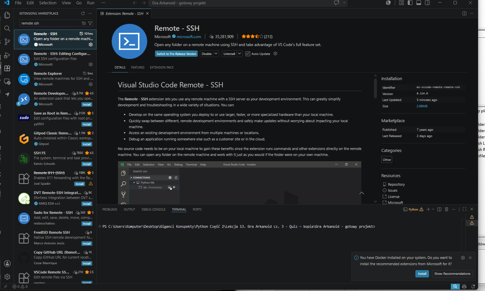
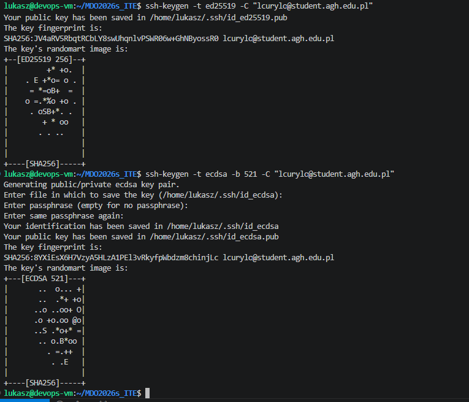
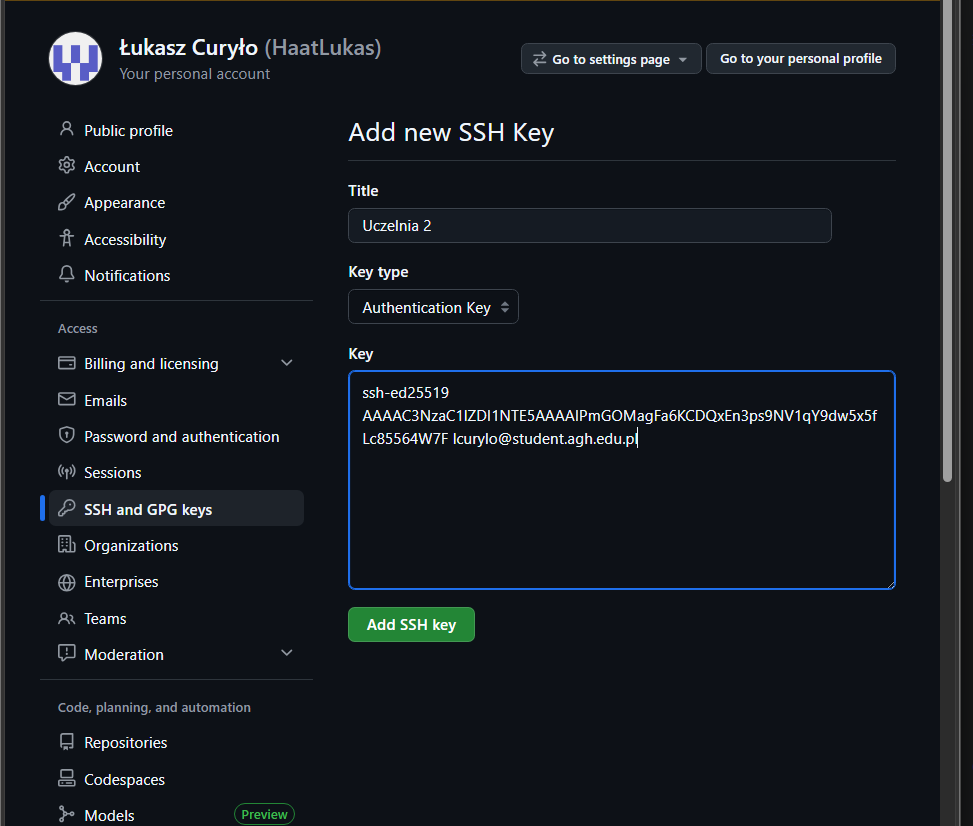
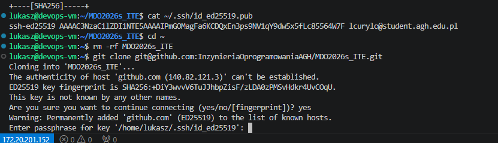
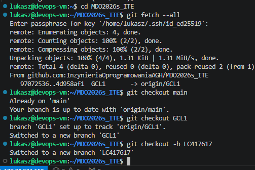
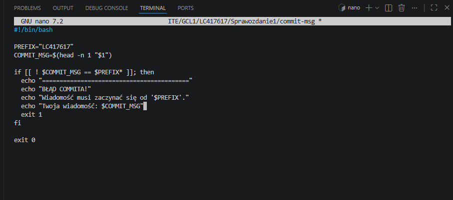

# Sprawozdanie 1 - Git, Gałęzie, SSH
## Zajęcia 01
Na maszynie wirtualnej z systemem Ubuntu zainstalowano klienta Git z wykorzystaniem
systemowego menedżera pakietów `apt`. Repozytorium przedmiotowe zostało najpierw
sklonowane przez HTTPS z użyciem Personal Access Token (PAT). Przed zajęciami
zainstalowano wtyczkę do Visual Studio Code dla SSH oraz skonfigurowano również

narzędzia pomocnicze (Visual Studio Code Remote-SSH oraz FileZilla do transferu SFTP).
Następnie wygenerowano nowoczesne klucze SSH (Ed25519 zabezpieczony hasłem oraz
ECDSA bez hasła), dodano klucz do platformy GitHub i sklonowano repozytorium przy
użyciu protokołu SSH.
Skonfigurowano globalne ustawienia wymagane do poprawnego podpisywania commitów:
```bash
git config --global user.name "HaatLukas"
git config --global user.email "lcurylo@student.agh.edu.pl"
```


Rys. 1. Konfiguracja programu FileZilla i nawiązanie pomyślnego połączenia przez protokół SFTP.



Rys. 2. Instalacja oficjalnego rozszerzenia Remote - SSH w edytorze Visual Studio Code.


Rys. 3. Weryfikacja aktywnego i stabilnego połączenia SSH z poziomu systemu hosta.


Rys. 4. Klonowanie repozytorium.

Sklonowanie repozytorium z użyciem protokołu SSH:
```bash
git clone git@github.com:InzynieriaOprogramowaniaAGH/MDO2026s_ITE.git
```


Rys. 5. Proces generowania kluczy SSH.



Rys. 6. Dodanie klucza publicznego


Rys. 7. Pomyślne pobranie struktury projektu przy użyciu protokołu SSH.

Przygotowanie gałęzi (branches):

Rys. 8. Sprawdzenie statusu repozytorium oraz przełączenie na gałęzie main i GCL1.


Rys. 9. Tworzenie dedykowanej gałęzi osobistej LC417617 oraz wymaganej struktury folderów.


Napisano skrypt weryfikujący (Git Hook), sprawdzający poprawność wpisywanych
wiadomości:
```bash
#!/bin/bash
PREFIX="LC417617"

COMMIT_MSG=$(head -n 1 "$1")
if [[ ! $COMMIT_MSG == $PREFIX* ]]; then
echo "=========================================="
echo "BŁĄD COMMITA!"
echo "Wiadomość musi zaczynać się od '$PREFIX'."
echo "Twoja wiadomość: $COMMIT_MSG"
echo "=========================================="
exit 1
fi
exit 0
```

Skrypt został skopiowany do katalogu `.git/hooks/commit-msg` i nadano mu uprawnienia do
wykonywania poleceniem `chmod +x`. Każdy commit bez prefiksu `LC417617` jest
rygorystycznie odrzucany przez system kontroli wersji, co przetestowano w praktyce
podczas próby scalenia (merge) historii z serwera.


Rys. 10. Zapisanie skryptu w edytorze nano, nadanie uprawnień wykonywalności i test działania blokady.


## Użycie narzędzi Generatywnej AI

W celu sprawnego przygotowania, ustrukturyzowania oraz poprawnego sformatowania dokumentacji technicznej, skonsultowano się z modelem LLM.

### Treść wysłanego zapytania (Prompt):
> "Pomóż mi poprawnie sformatować i uporządkować plik README.md na potrzeby sprawozdania z zajęć z Gita. Mam przygotowaną treść oraz zrzuty ekranu o nazwach od L0_Start_0 itd. Jak poprawnie ułożyć strukturę w języku Markdown, aby całość poprawnie wyrenderowała się na GitHubie?"

### Metoda weryfikacji i modyfikacji:
Zaproponowany przez model układ dokumentu został ręcznie zweryfikowany w edytorze Visual Studio Code. Dokonano manualnej korekty ścieżek do zrzutów ekranu (dodano brakujące rozszerzenie `.png` przy pliku L0_Start_0). Bloki kodu Bash zawierające komendy konfiguracyjne tożsamości (`git config`) oraz strukturę skryptu Git Hook zostały poprawnie domknięte znacznikami Markdown, eliminując błędy formatowania tekstu ciągłego.


# Zajęcia 02 - Docker i konteneryzacja

Celem zajęć było zestawienie środowiska skonteneryzowanego do pracy nad procesami Continuous Integration (CI) oraz weryfikacja mechanizmów izolacji procesów.

## 1. Instalacja i zarządzanie obrazami

Zainstalowano pakiet `docker.io`. Pobrano i przeanalizowano podstawowe obrazy systemowe oraz aplikacyjne.


Poniższa tabela przedstawia zestawienie pobranych obrazów wraz z ich rozmiarami oraz kodami wyjścia (Exit Code) po zakończeniu działania:

| Nazwa obrazu  | Rozmiar lokalny | Kod wyjścia (Exit Code) | Funkcja / Rola w systemie                  |
| :------------ | :-------------- | :---------------------- | :----------------------------------------- |
| `hello-world` | ~13 KB          | `0` (Success)           | Test weryfikacyjny poprawności instalacji  |
| `busybox`     | ~4.3 MB         | `0` (Success)           | Minimalistyczny system do zadań osadzonych |
| `ubuntu`      | ~78 MB          | `0` (Success)           | Pełny obraz bazowy dystrybucji Linux       |
| `nginx`       | ~190 MB         | - (Działa w tle)        | Serwer WWW / Reverse Proxy                 |

---

## 2. Izolacja procesów i tryb interaktywny

Uruchomiono kontener `busybox` w trybie interaktywnym (`-it`), wywołując polecenie `uname -a`. Następnie uruchomiono obraz `ubuntu`, w którym zainstalowano pakiet `procps` w celu weryfikacji drzewa procesów za pomocą `ps -ef`.


Wewnątrz kontenera proces `/bin/bash` uzyskał najwyższy priorytet i identyfikator **PID 1**, co udowadnia pełną izolację środowiska. Na hoście ten sam proces widoczny był pod standardowym, wysokim identyfikatorem systemowym.


*Rys. 11. Drzewo procesów wewnątrz kontenera Ubuntu z widocznym procesem PID 1.*

---

## 3. Własny plik Dockerfile i klonowanie repozytorium

Napisano plik `Dockerfile` bazujący na warstwie `ubuntu:24.04`. Połączono instrukcje instalacji, wyczyszczono pamięć podręczną menedżera pakietów (`apt-get clean`) oraz usunięto listy pakietów w celu redukcji rozmiaru końcowego obrazu. Obraz automatycznie klonuje repozytorium projektowe do katalogu `/app`.


*Rys. 12.1. Plik Dockerfile

Budowanie obrazu wykonano poleceniem:

```bash
docker build -t lc-obraz .
```


Po uruchomieniu kontenera zweryfikowano poprawność pobrania struktur Git.


*Rys. 12.2. Sprawdzenie zawartości katalogu roboczego `/app` wewnątrz własnego obrazu `lc-obraz`.*

---

## 4. Czyszczenie środowiska

Dokonano zwolnienia zasobów dyskowych poprzez usunięcie zatrzymanych kontenerów narzędziem:

```bash
docker container prune -f
```

Następnie usunięto pobrane obrazy z lokalnego magazynu poleceniem:

```bash
docker rmi <nazwa_obrazu>
```

oraz przeprowadzono głębokie czyszczenie nieużywanych warstw komendą:

```bash
docker image prune -a -f
```


*Rys. 13. Czyszczenie – część 1.*


*Rys. 14. Czyszczenie – część 2.*


---

## Użycie narzędzi Generatywnej AI (Zajęcia 02)

### Treść wysłanego zapytania (Prompt)

> 1. Jak napisać plik Dockerfile oparty na Ubuntu 24.04, który automatycznie instaluje git i klonuje repozytorium?
>
> 2. Sprawdź plik README pod kątem błędów i zgodności z wymaganiami sprawozdania.

### Metoda weryfikacji i modyfikacji

Na podstawie otrzymanych wskazówek przygotowano plik Dockerfile oraz uzupełniono dokumentację. Następnie samodzielnie zweryfikowano poprawność działania kontenera, poleceń Dockera oraz treści sprawozdania, wprowadzając niezbędne poprawki redakcyjne i techniczne.

