# Zajęcia 07 - Jenkinsfile i przygotowanie do Ansible

Celem zajęć było przeniesienie definicji pipeline'u Jenkins do repozytorium w postaci pliku `Jenkinsfile`, a następnie sprawdzenie, czy pipeline realizuje pełną ścieżkę CI/CD: pobranie aktualnego kodu, czyszczenie workspace, build, test, deploy oraz publikację artefaktów. Drugą częścią zadania było przygotowanie lekkiej maszyny docelowej pod kolejne zajęcia z Ansible.

Do realizacji części Jenkins wykorzystano projekt `cJSON` z repozytorium:

```text
https://github.com/DaveGamble/cJSON
```

Projekt jest biblioteką napisaną w języku C, budowaną przez `CMake` i testowaną z użyciem `CTest`.

## 1. Środowisko pracy

Zadanie wykonano na głównej maszynie wirtualnej `devops-vm`, na użytkowniku `lukasz`. Jenkins był uruchomiony w kontenerach Docker na podstawie konfiguracji przygotowanej podczas poprzednich zajęć. Do obsługi Dockera w Jenkinsie wykorzystano układ z kontenerem Jenkins oraz kontenerem Docker-in-Docker.

Druga maszyna wirtualna została przygotowana jako lekka maszyna docelowa dla Ansible:

```text
hostname: ansible-target
użytkownik: ansible
system: Ubuntu Server minimized
usługi: OpenSSH server, tar
```

Pliki dla zajęć 07 zostały umieszczone w katalogu:

```text
Sprawozdanie2/Zajecia7/
```

W katalogu tym przygotowano:

```text
Jenkinsfile
Dockerfile.build
Dockerfile.test
Dockerfile.deploy
ansible/inventory.ini
```

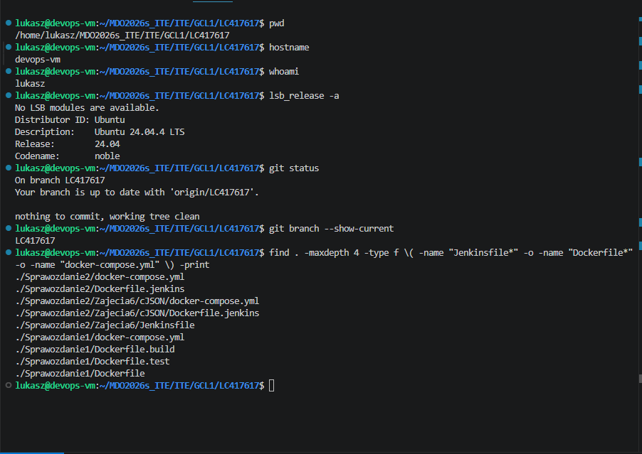

*Rys. 1. Pliki `Jenkinsfile`, `Dockerfile.build`, `Dockerfile.test`, `Dockerfile.deploy` oraz katalog Ansible przygotowane w repozytorium.*

Zmiany zostały dodane do gałęzi osobistej `LC417617` i wysłane do zdalnego repozytorium.

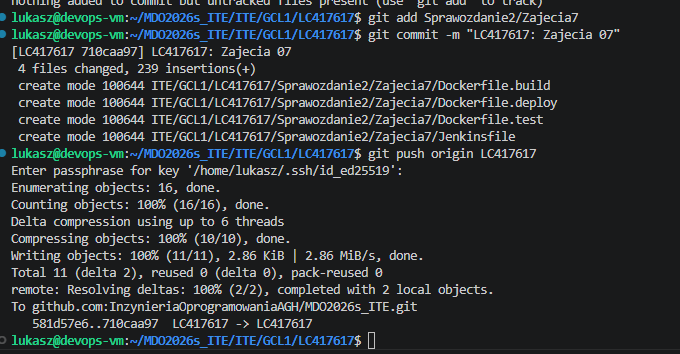

*Rys. 2. Commit oraz wysłanie plików wymaganych do realizacji zajęć 07.*

---

## 2. Jenkinsfile pobierany z SCM

W Jenkinsie utworzono projekt typu `Pipeline`. Ważnym wymaganiem zadania było to, aby definicja pipeline'u nie była wklejana ręcznie w ustawieniach Jenkinsa, tylko była pobierana bezpośrednio z repozytorium.

W konfiguracji projektu ustawiono:

```text
Definition: Pipeline script from SCM
SCM: Git
Branch Specifier: */LC417617
Script Path: ITE/GCL1/LC417617/Sprawozdanie2/Zajecia7/Jenkinsfile
```

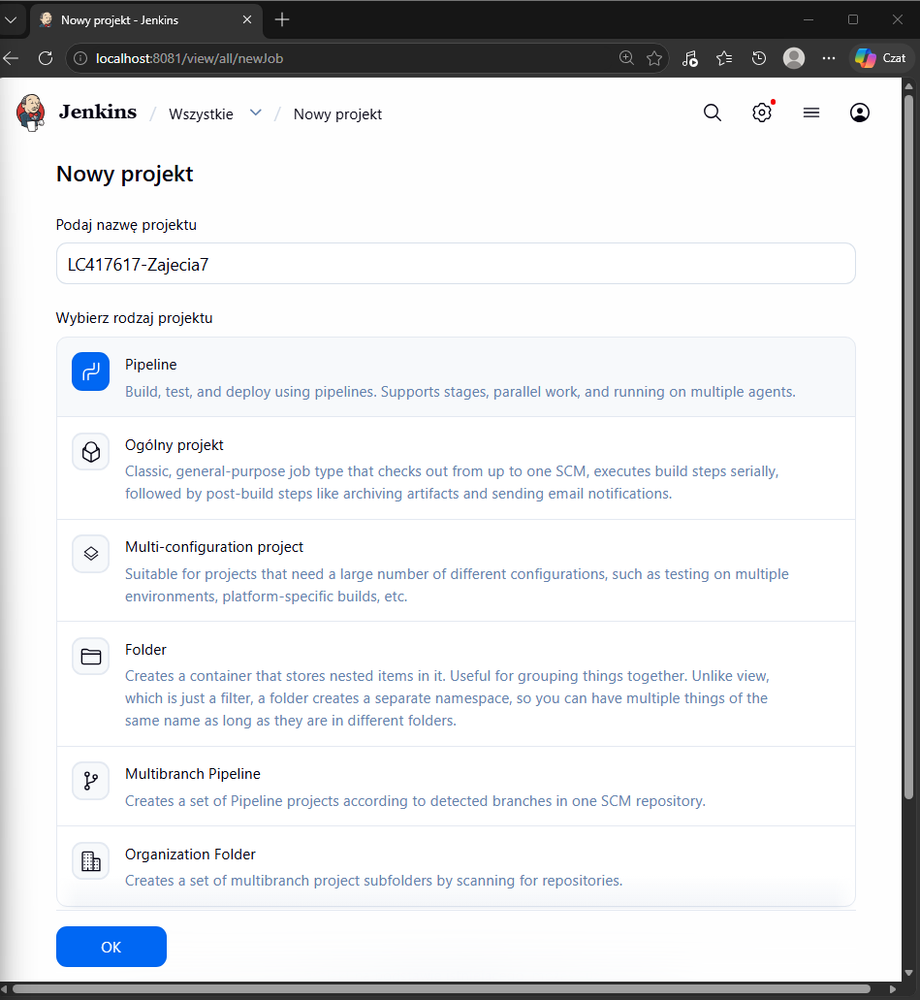

*Rys. 3. Utworzenie projektu typu Pipeline w Jenkinsie.*

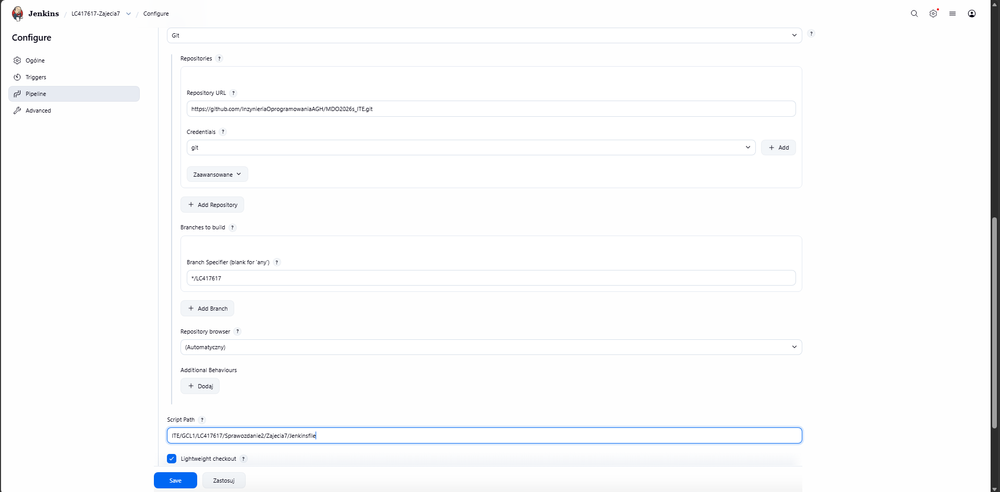

*Rys. 4. Konfiguracja projektu Jenkins tak, aby `Jenkinsfile` był pobierany z repozytorium Git.*

---

## 3. Czyszczenie workspace i checkout aktualnego kodu

Pipeline rozpoczyna działanie od wyczyszczenia workspace za pomocą `deleteDir()`. Następnie Jenkins wykonuje `checkout scm`, czyli pobiera aktualny kod z repozytorium.

Dodatkowo wykonano:

```bash
git reset --hard HEAD
git clean -xfd
git rev-parse --short HEAD
git log -1 --oneline
```

Pozwala to upewnić się, że pipeline pracuje na najnowszym kodzie z repozytorium, a nie na przypadkowo pozostawionych plikach z poprzednich uruchomień.

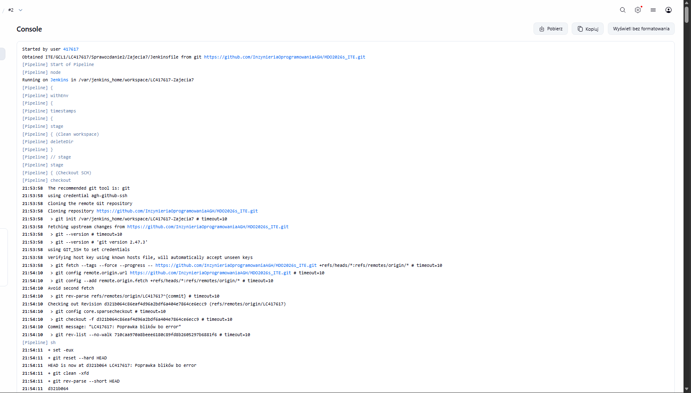

*Rys. 5. Czyszczenie workspace oraz pobranie aktualnej wersji kodu z gałęzi `LC417617`.*

---

## 4. Etap Build

Etap `Build` tworzy obraz buildowy dla projektu cJSON. Obraz ten bazuje na `ubuntu:24.04`, instaluje wymagane narzędzia (`git`, `cmake`, `build-essential`) oraz klonuje repozytorium cJSON.

Najważniejsza komenda wykonywana w pipeline:

```bash
docker build --pull --no-cache \
  --build-arg CJSON_REPO="$CJSON_REPO" \
  --build-arg CJSON_REF="$CJSON_REF" \
  -f "$REPORT_DIR/Zajecia7/Dockerfile.build" \
  -t "$BUILD_IMAGE" \
  "$REPORT_DIR"
```

Obraz buildowy kompiluje projekt przez `CMake`, wykonuje instalację do katalogu artefaktu oraz przygotowuje prosty program `cjson-smoke`, który później służy do sprawdzenia artefaktu w etapie deploy.

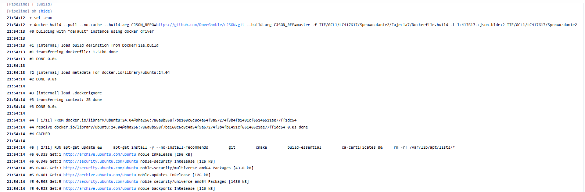

*Rys. 6. Budowanie obrazu buildowego `lc417617-cjson-bldr`.*

---

## 5. Etap Test

Etap `Test` tworzy osobny obraz testowy na podstawie obrazu buildowego. Następnie uruchamia testy cJSON za pomocą `CTest`.

Najważniejsze polecenie testowe:

```bash
docker run --rm "$TEST_IMAGE"
```

Wynik testów potwierdził poprawne zbudowanie projektu i przejście testów jednostkowych.

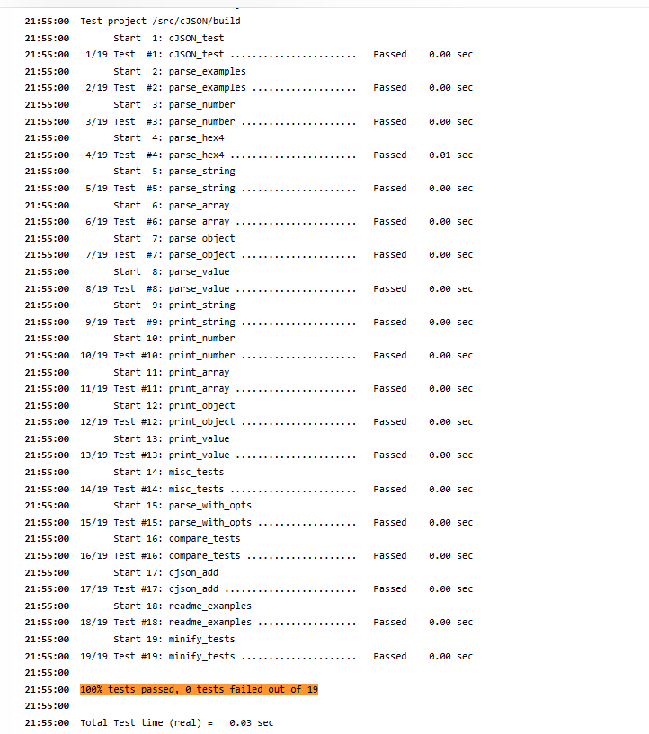

*Rys. 7. Uruchomienie testów cJSON w kontenerze testowym.*

---

## 6. Etap Deploy

Etap `Deploy` przygotowuje obraz docelowy z gotowym artefaktem. W przypadku cJSON nie jest to typowa aplikacja webowa działająca stale w kontenerze, tylko biblioteka C. Dlatego etap wdrożeniowy został zrealizowany jako obraz zawierający zainstalowany artefakt oraz program `cjson-smoke` ustawiony jako `ENTRYPOINT`.

W etapie Deploy wykonywane jest uruchomienie kontenera:

```bash
docker run --rm \
  --name "$CONTAINER_NAME" \
  "$DEPLOY_IMAGE"
```

Poprawny wynik smoke testu potwierdza, że przygotowany artefakt może zostać uruchomiony w środowisku docelowym.

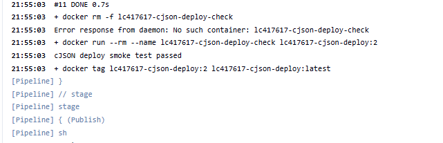

*Rys. 8. Przygotowanie obrazu deploy oraz uruchomienie smoke testu artefaktu.*

---

## 7. Etap Publish

Etap `Publish` zapisuje artefakty z przebiegu pipeline'u. Przygotowano między innymi archiwum artefaktu cJSON, wynik `docker inspect` oraz zapisany obraz deploy w postaci pliku `.tar.gz`.

Przykładowe artefakty:

```text
lc417617-cjson-artifact-<BUILD_NUMBER>.tar.gz
lc417617-cjson-deploy-<BUILD_NUMBER>-inspect.json
lc417617-cjson-deploy-image-<BUILD_NUMBER>.tar.gz
```

W Jenkinsie artefakty zostały dodane do historii builda przez `archiveArtifacts`.

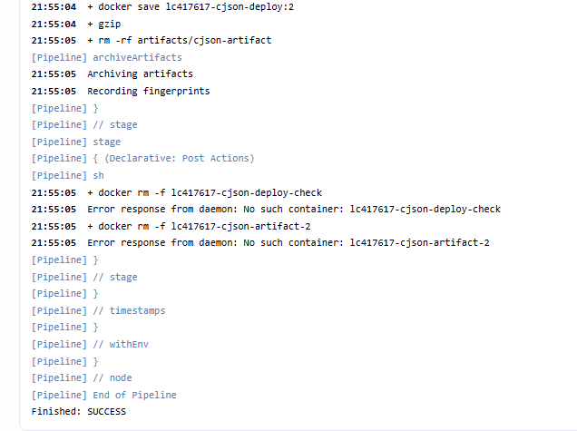

*Rys. 9. Publikacja artefaktów w Jenkinsie.*

---

## 8. Ponowne uruchomienie pipeline'u

Pipeline został uruchomiony więcej niż jeden raz. Drugie udane uruchomienie potwierdziło, że proces nie działa wyłącznie dzięki przypadkowemu cache'owi lub pozostałościom po poprzednim buildzie.

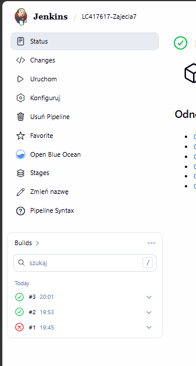

*Rys. 10. Kolejne udane uruchomienie pipeline'u.*

---

## 9. Przygotowanie maszyny `ansible-target`

Na potrzeby kolejnych zajęć utworzono drugą, lekką maszynę wirtualną. Maszyna otrzymała nazwę `ansible-target` i została zainstalowana w wariancie minimalnym Ubuntu Server.

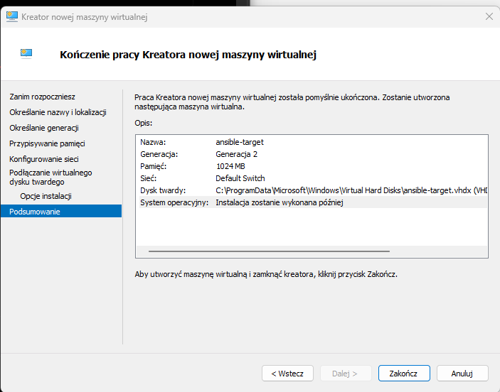

*Rys. 11. Utworzenie lekkiej maszyny wirtualnej `ansible-target`.*

Podczas instalacji skonfigurowano profil użytkownika oraz hostname maszyny.

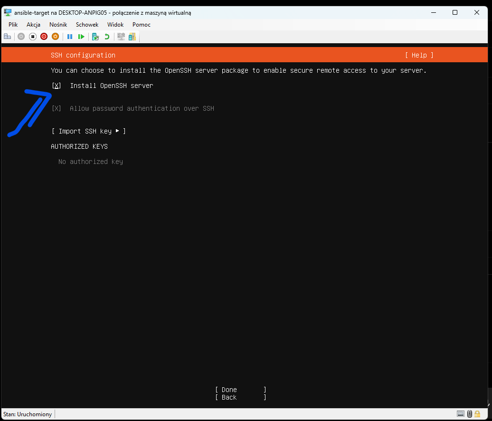

*Rys. 12. Konfiguracja profilu użytkownika `ansible` i hostname `ansible-target`.*

Po instalacji sprawdzono hostname, użytkownika, obecność programu `tar` oraz działanie usługi SSH.

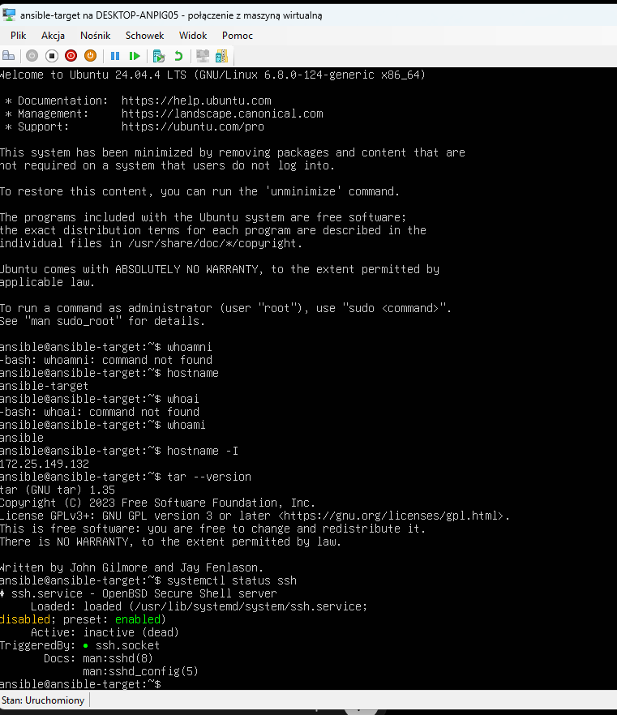

*Rys. 13. Weryfikacja hostname, użytkownika, programu `tar` oraz działania usługi SSH na maszynie `ansible-target`.*

---

## 10. Instalacja Ansible na głównej maszynie

Na głównej maszynie wirtualnej zainstalowano Ansible z repozytorium systemowego.

Wykonane polecenia:

```bash
sudo apt update
sudo apt install -y ansible
ansible --version
```

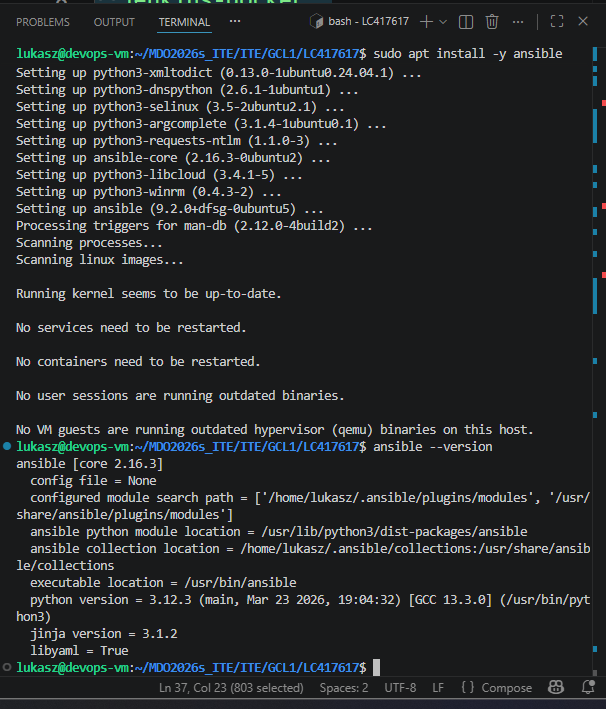

*Rys. 14. Instalacja i sprawdzenie wersji Ansible na głównej maszynie wirtualnej.*

---

## 11. Konfiguracja nazwy `ansible-target`

Aby możliwe było łączenie się z maszyną po nazwie `ansible-target`, na głównej maszynie uzupełniono plik `/etc/hosts`.

Następnie sprawdzono połączenie poleceniem:

```bash
ping -c 3 ansible-target
```

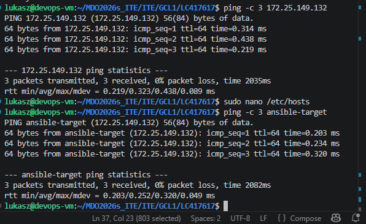

*Rys. 15. Dodanie wpisu do `/etc/hosts` oraz test połączenia z maszyną `ansible-target`.*

---

## 12. Logowanie SSH

Najpierw sprawdzono pierwsze logowanie SSH na maszynę docelową z użyciem hasła:

```bash
ssh ansible@ansible-target
```

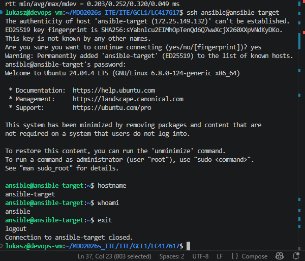

*Rys. 16. Pierwsze logowanie SSH na użytkownika `ansible`.*

Następnie skonfigurowano logowanie za pomocą klucza publicznego, tak aby logowanie nie wymagało podawania hasła:

```bash
ssh-copy-id ansible@ansible-target
ssh ansible@ansible-target
```

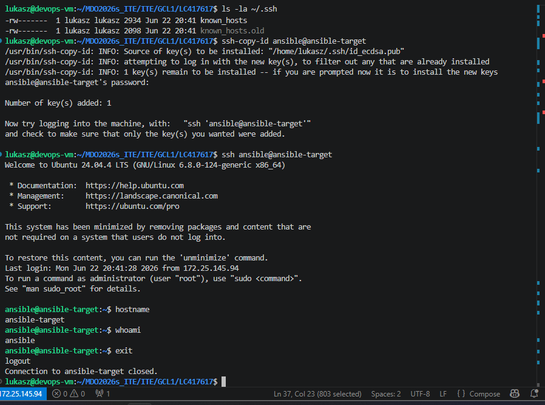

*Rys. 17. Poprawne logowanie SSH na `ansible-target` bez podawania hasła.*

---

## 13. Inventory Ansible

W repozytorium utworzono plik inventory:

```text
Sprawozdanie2/Zajecia7/ansible/inventory.ini
```

Zawartość pliku:

```ini
[targets]
ansible-target ansible_user=ansible
```

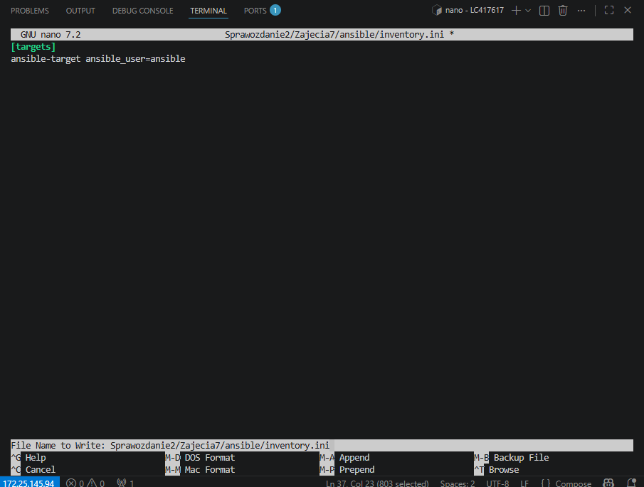

*Rys. 18. Plik `inventory.ini` wskazujący maszynę `ansible-target`.*

---

## 14. Test połączenia Ansible

Na końcu wykonano test połączenia Ansible:

```bash
ansible targets -i Sprawozdanie2/Zajecia7/ansible/inventory.ini -m ping
```

Poprawny wynik:

```text
ansible-target | SUCCESS => {
    "changed": false,
    "ping": "pong"
}
```

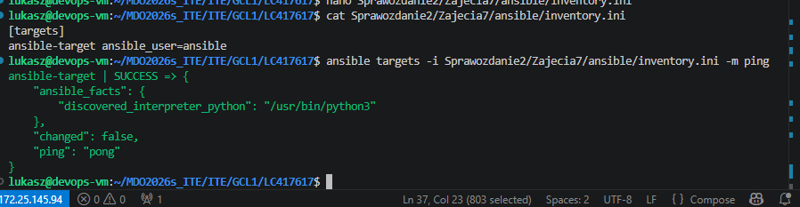

*Rys. 19. Poprawny wynik modułu `ping` Ansible dla maszyny `ansible-target`.*

---

## 15. Punkt kontrolny maszyny

Po przygotowaniu maszyny `ansible-target` wykonano punkt kontrolny w Hyper-V. Pozwala to szybko wrócić do gotowego stanu maszyny przed kolejnymi zajęciami.

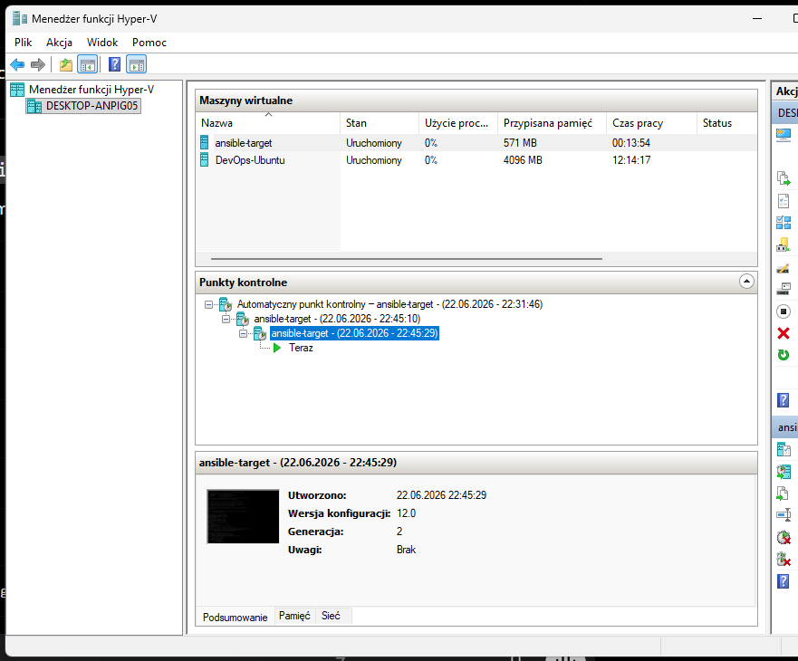

*Rys. 20. Punkt kontrolny maszyny `ansible-target`.*

---

## 16. Listing najważniejszych poleceń

Poniżej przedstawiono najważniejsze polecenia użyte podczas realizacji zadania. Listing został przygotowany bez danych wrażliwych, tokenów i haseł.

```bash
cd ~/MDO2026s_ITE/ITE/GCL1/LC417617

mkdir -p Sprawozdanie2/Zajecia7
nano Sprawozdanie2/Zajecia7/Dockerfile.build
nano Sprawozdanie2/Zajecia7/Dockerfile.test
nano Sprawozdanie2/Zajecia7/Dockerfile.deploy
nano Sprawozdanie2/Zajecia7/Jenkinsfile

git add Sprawozdanie2/Zajecia7
git commit -m "LC417617: Zajecia 07"
git push origin LC417617

sudo apt update
sudo apt install -y ansible
ansible --version

sudo nano /etc/hosts
ping -c 3 ansible-target

ssh ansible@ansible-target
ssh-copy-id ansible@ansible-target
ssh ansible@ansible-target

mkdir -p Sprawozdanie2/Zajecia7/ansible
nano Sprawozdanie2/Zajecia7/ansible/inventory.ini
cat Sprawozdanie2/Zajecia7/ansible/inventory.ini

ansible targets -i Sprawozdanie2/Zajecia7/ansible/inventory.ini -m ping

git add Sprawozdanie2/Zajecia7
git add Sprawozdanie2/img/S07_*.png
git commit -m "LC417617 dodanie materialow do Zajec 07"
git push origin LC417617
```

---

## 17. Użycie narzędzi generatywnej AI

Podczas realizacji zadania wykorzystano model LLM jako pomoc przy uporządkowaniu kolejności działań, przygotowaniu struktury `Jenkinsfile`, analizie błędu w etapie Deploy oraz opracowaniu opisu do sprawozdania.

### Treść głównego zapytania

> Używam projektu cJSON z GitHuba. Chcę przygotować pipeline pobierany z SCM, który wykona clean, checkout, build, test, deploy i publish. Opisz kroki jakie powinienem podjąć.
> Sprawdź poniższy plik .md pod kątem błędów.
> O co chodzi z tym errorem Jenkinsa (przy próbie uruchomienia nr 1).

### Metoda weryfikacji odpowiedzi

* działanie etapu Build potwierdzono przez zbudowanie obrazu buildowego,
* działanie etapu Test potwierdzono przez poprawne przejście testów `CTest`,
* działanie etapu Deploy potwierdzono przez smoke test `cjson-smoke`,
* działanie etapu Publish potwierdzono przez obecność artefaktów w Jenkinsie,


W trakcie pracy wykryto błąd w ścieżce artefaktu w `Dockerfile.deploy`. Błąd został zweryfikowany w logach Jenkinsa i poprawiony przez zmianę sposobu instalacji artefaktu w `Dockerfile.build` oraz poprawienie ścieżki kopiowania w `Dockerfile.deploy`.
