# Sprawozdanie 3 - Automatyzacja i zdalne wykonywanie poleceń za pomocą Ansible

## Zajęcia 08

Celem zajęć było przygotowanie środowiska zarządzanego przez Ansible, wykonanie inwentaryzacji maszyn, sprawdzenie zdalnego wykonywania poleceń oraz wdrożenie przygotowanego artefaktu na maszynie docelowej. W ramach zadania wykorzystano dwie maszyny wirtualne:

```text
devops-vm        - maszyna główna, pełniąca rolę orchestratora
ansible-target   - maszyna docelowa, pełniąca rolę endpointa
```

Maszyna `ansible-target` została przygotowana wcześniej jako lekka instalacja Ubuntu Server w wersji minimalnej. Zapewniono obecność programu `tar`, serwera `OpenSSH` oraz użytkownika `ansible`. Na głównej maszynie zainstalowano Ansible, skonfigurowano połączenie SSH bez hasła oraz przygotowano pliki inventory, playbooki i rolę Ansible.

---

## 1. Przygotowanie struktury sprawozdania

Na początku utworzono osobny katalog dla trzeciego sprawozdania oraz katalogi potrzebne do pracy z Ansible:

```bash
cd ~/MDO2026s_ITE/ITE/GCL1/LC417617

mkdir -p Sprawozdanie3/Zajecia8/playbooks
mkdir -p Sprawozdanie3/Zajecia8/roles
mkdir -p Sprawozdanie3/Zajecia8/artifact_source
mkdir -p Sprawozdanie3/Zajecia8/artifacts
mkdir -p Sprawozdanie3/img
```

Do katalogu `artifact_source` skopiowano również plik `Dockerfile.build` przygotowany przy poprzednich zajęciach. Plik ten posłużył później do ponownego przygotowania artefaktu `cJSON`.

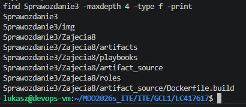

*Rys. 1. Przygotowana struktura katalogów dla zajęć 08.*

---

## 2. Ustalenie nazw maszyn

W zadaniu ważne było unikanie `localhost` i korzystanie z przewidywalnych nazw maszyn. Maszyna główna pełni rolę orchestratora, a maszyna `ansible-target` rolę endpointa.

Sprawdzono nazwy maszyn poleceniami:

```bash
hostnamectl
hostname
ssh ansible@ansible-target "hostnamectl && hostname && whoami"
```

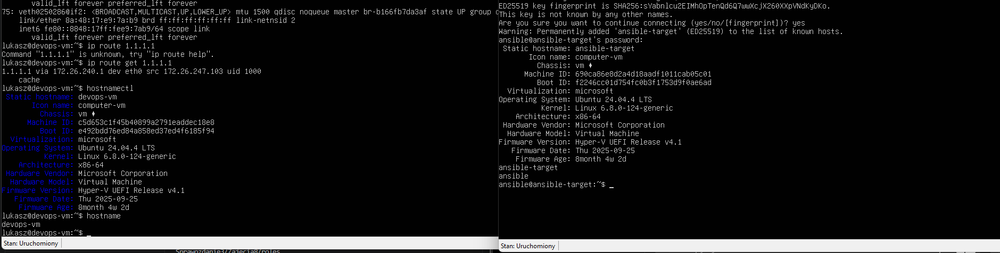

*Rys. 2. Sprawdzenie nazw maszyn `devops-vm` oraz `ansible-target`.*

---

## 3. Konfiguracja nazw w `/etc/hosts` i weryfikacja łączności

Aby możliwe było odwoływanie się do maszyn po nazwach, skonfigurowano wpisy w pliku `/etc/hosts`. Dzięki temu maszyna docelowa mogła być wywoływana jako `ansible-target`, a nie wyłącznie przez adres IP.

Przykładowy wpis:

```text
IP_MASZYNY_GLOWNEJ devops-vm
IP_MASZYNY_DOCELOWEJ ansible-target
```

Po zapisaniu konfiguracji wykonano testy:

```bash
ping -c 3 devops-vm
ping -c 3 ansible-target
```

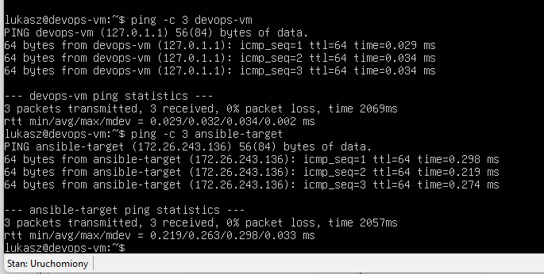

*Rys. 3. Sprawdzenie wpisów w `/etc/hosts` oraz test połączenia po nazwach maszyn.*

---

## 4. Plik konfiguracyjny Ansible i inventory

W katalogu `Sprawozdanie3/Zajecia8` utworzono plik `ansible.cfg`, aby Ansible korzystał z lokalnego pliku inventory oraz lokalnego katalogu ról:

```ini
[defaults]
inventory = inventory.ini
roles_path = ./roles
host_key_checking = False
retry_files_enabled = False
stdout_callback = default

[privilege_escalation]
become_ask_pass = True
```

Następnie przygotowano plik `inventory.ini` z sekcjami wymaganymi w zadaniu:

```ini
[Orchestrators]
devops-vm ansible_connection=local

[Endpoints]
ansible-target ansible_user=ansible

[all:vars]
ansible_python_interpreter=/usr/bin/python3
```

Sekcja `Orchestrators` zawiera maszynę zarządzającą, a sekcja `Endpoints` zawiera maszynę docelową.

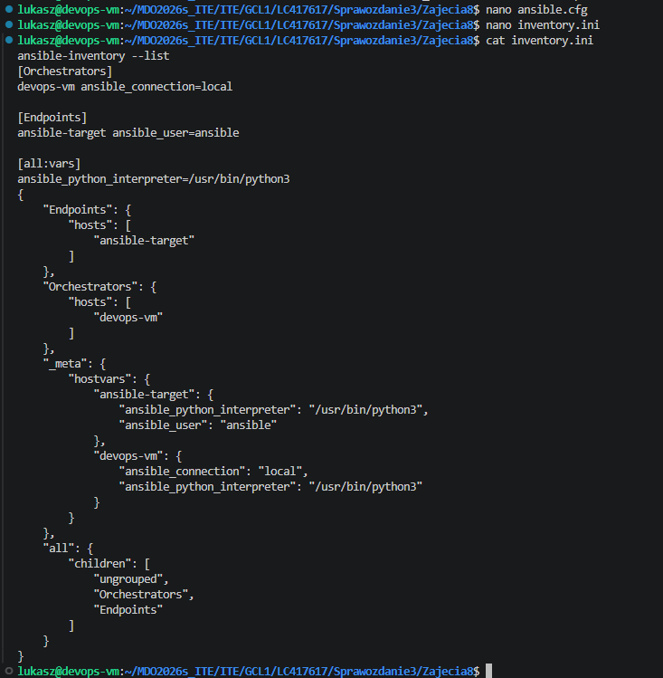

*Rys. 4. Plik inventory z sekcjami `Orchestrators` oraz `Endpoints`.*

---

## 5. Ping Ansible do wszystkich maszyn

Po przygotowaniu inventory wykonano test połączenia z użyciem modułu `ping` Ansible:

```bash
ansible all -m ping
```

Test potwierdził, że Ansible widzi zarówno maszynę główną, jak i endpoint.

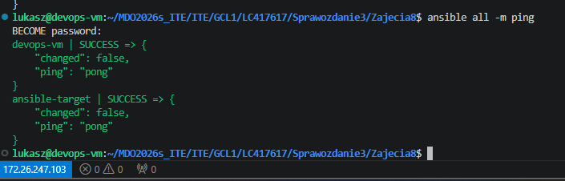

*Rys. 5. Wynik polecenia `ansible all -m ping`.*

---

## 6. Playbook sprawdzający łączność

Utworzono playbook `01_ping_all.yml`, który wysyła żądanie ping do wszystkich maszyn z inventory:

```yaml
---
- name: Ping wszystkich maszyn z inventory
  hosts: all
  gather_facts: false

  tasks:
    - name: Sprawdzenie odpowiedzi ping Ansible
      ansible.builtin.ping:
```

Uruchomienie playbooka:

```bash
ansible-playbook playbooks/01_ping_all.yml
```

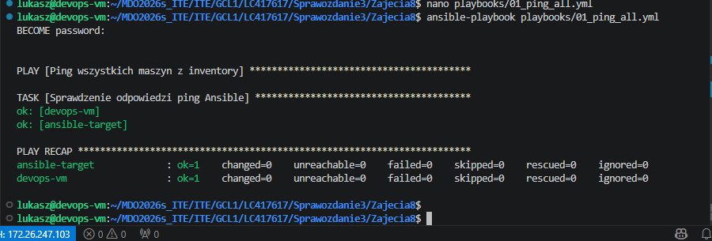

*Rys. 6. Uruchomienie playbooka sprawdzającego łączność ze wszystkimi maszynami.*

---

## 7. Kopiowanie pliku inventory na endpoint

Kolejny playbook wykonywał operacje administracyjne na maszynie `ansible-target`. Jednym z pierwszych zadań było skopiowanie pliku inventory na endpoint:

```yaml
- name: Skopiowanie pliku inventory na endpoint
  ansible.builtin.copy:
    src: ../inventory.ini
    dest: /tmp/inventory.ini
    owner: ansible
    group: ansible
    mode: "0644"
```

Playbook uruchomiono dwukrotnie, aby porównać różnice w wyjściu. Przy pierwszym uruchomieniu plik został skopiowany i zadanie otrzymało status `changed`.

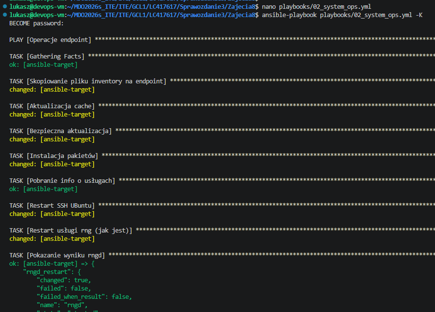

*Rys. 7. Pierwsze skopiowanie pliku inventory na endpoint.*

Przy drugim uruchomieniu Ansible wykazał mniejszą liczbę zmian, ponieważ część stanu była już zgodna z oczekiwanym. Pokazuje to idempotentny charakter zadań Ansible.

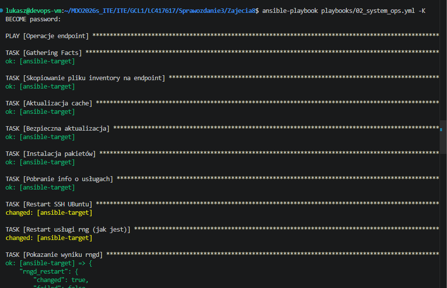

*Rys. 8. Ponowne uruchomienie operacji i porównanie różnic w wyjściu.*

---

## 8. Aktualizacja pakietów i restart usług

W playbooku wykonano również aktualizację cache pakietów APT, bezpieczną aktualizację pakietów oraz instalację wymaganych pakietów:

```yaml
- name: Aktualizacja cache
  ansible.builtin.apt:
    update_cache: true
    cache_valid_time: 3600

- name: Bezpieczna aktualizacja
  ansible.builtin.apt:
    upgrade: safe

- name: Instalacja pakietów
  ansible.builtin.apt:
    name:
      - tar
      - openssh-server
      - rng-tools5
    state: present
```

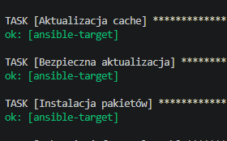

*Rys. 9. Aktualizacja cache APT, bezpieczna aktualizacja systemu oraz instalacja wymaganych pakietów.*

Następnie pobrano informacje o usługach i wykonano restart usług `ssh` oraz `rngd`:

```yaml
- name: Restart SSH Ubuntu
  ansible.builtin.service:
    name: ssh
    state: restarted

- name: Restart usługi rngd, jeśli istnieje
  ansible.builtin.service:
    name: rngd
    state: restarted
  register: rngd_restart
  failed_when: false
```

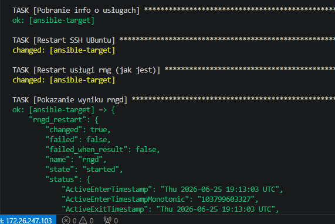

*Rys. 10. Restart usług `ssh` oraz `rngd` na maszynie docelowej.*

---

## 9. Test maszyny z wyłączonym SSH

W ramach testu awarii zatrzymano usługę SSH na maszynie `ansible-target`. Ponieważ w Ubuntu SSH może być aktywowane przez socket, zatrzymano zarówno usługę, jak i socket:

```bash
sudo systemctl stop ssh.socket
sudo systemctl stop ssh.service
```

Następnie uruchomiono playbook testujący zachowanie Ansible przy niedostępnym endpoincie:

```bash
ansible-playbook playbooks/03_unreachable_test.yml
```

Playbook został przygotowany tak, aby nie kończył całej pracy awarią w przypadku niedostępności maszyny:

```yaml
---
- name: Test zachowania Ansible przy niedostępnym endpoincie
  hosts: Endpoints
  gather_facts: false
  ignore_unreachable: true

  tasks:
    - name: Próba ping Ansible do endpointa
      ansible.builtin.ping:
      register: ping_result
      failed_when: false

    - name: Pokazanie wyniku próby połączenia
      ansible.builtin.debug:
        var: ping_result
```

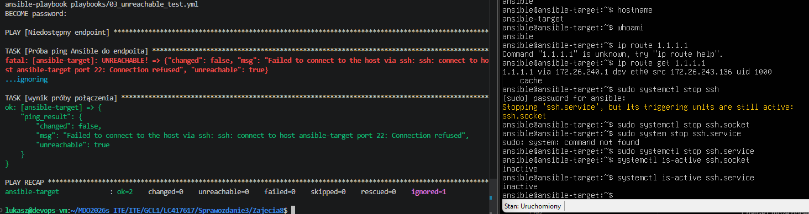

*Rys. 11. Test zachowania playbooka przy niedostępnej usłudze SSH.*

Po zakończeniu testu SSH zostało ponownie uruchomione:

```bash
sudo systemctl start ssh.socket
sudo systemctl start ssh.service
```

Następnie sprawdzono, że połączenie z maszyną docelową znowu działa.

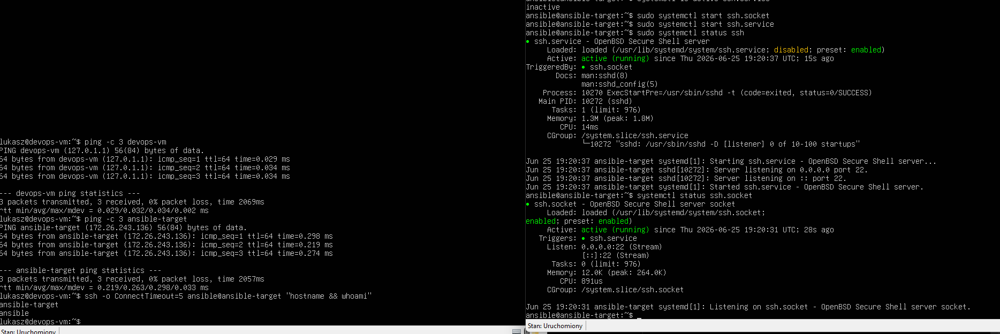

*Rys. 12. Przywrócenie działania SSH po teście awarii.*

---

## 10. Przygotowanie artefaktu cJSON

Artefaktem z poprzednich zajęć był zestaw plików zbudowanych dla projektu `cJSON`. Na potrzeby zajęć 08 artefakt został ponownie przygotowany lokalnie, a następnie spakowany do pliku `cjson-artifact.tar.gz`.

Wykonano między innymi:

```bash
docker build --no-cache \
  -f artifact_source/Dockerfile.build \
  -t lc417617-cjson-bldr:s08 \
  artifact_source

mkdir -p artifacts

docker create --name cjson_artifact_s08 lc417617-cjson-bldr:s08 /bin/true
docker cp cjson_artifact_s08:/artifact artifacts/cjson-artifact
docker rm cjson_artifact_s08

tar -czf artifacts/cjson-artifact.tar.gz -C artifacts cjson-artifact
```

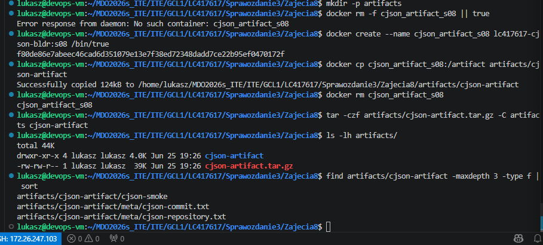

*Rys. 13. Przygotowanie artefaktu `cJSON` do wdrożenia przez Ansible.*

---

## 11. Utworzenie roli Ansible

Zgodnie z wymaganiem zadania kroki wdrożeniowe zostały ujęte w rolę Ansible. Strukturę roli utworzono komendą:

```bash
cd Sprawozdanie3/Zajecia8/roles
ansible-galaxy role init cjson_deploy
```

Następnie sprawdzono wygenerowaną strukturę katalogów.

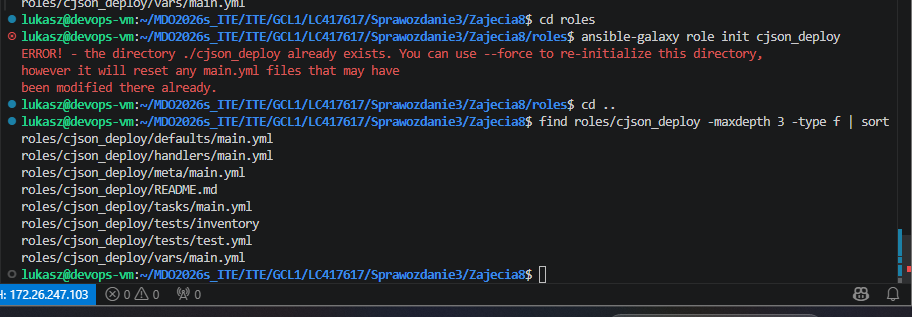

*Rys. 14. Utworzenie szkieletu roli `cjson_deploy` za pomocą `ansible-galaxy`.*

---

## 12. Plik `meta/main.yml`

W roli uzupełniono plik `meta/main.yml`, opisujący autora, przeznaczenie roli, wspierany system oraz tagi.

Przykładowa zawartość:

```yaml
galaxy_info:
  author: LC417617
  description: Deploy artefaktu cJSON w Docker na endpoint
  company: AGH
  license: MIT
  min_ansible_version: "2.14"

  platforms:
    - name: Ubuntu
      versions:
        - noble

  galaxy_tags:
    - devops
    - docker
    - cjson
    - deployment

dependencies: []
```

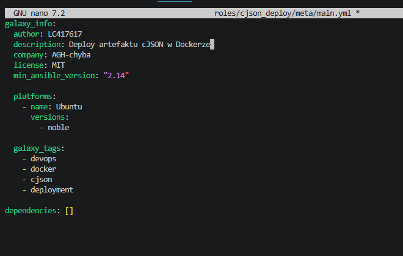

*Rys. 15. Uzupełniony plik `meta/main.yml` roli `cjson_deploy`.*

---

## 13. Sanity check i instalacja Dockera przez Ansible

Rola `cjson_deploy` rozpoczyna się od sanity checka maszyny docelowej. Sprawdzono między innymi informacje o systemie, obecność programu `tar` oraz ilość miejsca na dysku.

Następnie Docker został zainstalowany na maszynie docelowej przez Ansible:

```yaml
- name: Instalacja Dockera na maszynie docelowej
  ansible.builtin.apt:
    name:
      - docker.io
      - tar
    state: present

- name: Uruchomienie i włączenie usługi Docker
  ansible.builtin.service:
    name: docker
    state: started
    enabled: true
```

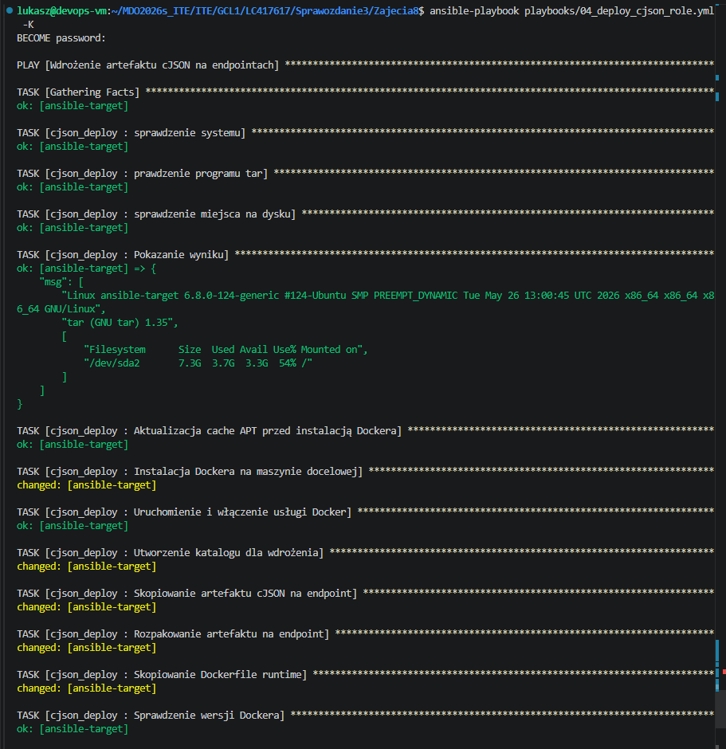

*Rys. 16. Sanity check maszyny docelowej oraz instalacja Dockera przez Ansible.*

---

## 14. Wdrożenie artefaktu na endpoint

Rola kopiuje artefakt `cjson-artifact.tar.gz` na maszynę `ansible-target`, rozpakowuje go w katalogu `/opt/cjson-demo`, kopiuje `Dockerfile.runtime`, a następnie buduje obraz runtime.

Najważniejsze zadania:

```yaml
- name: Skopiowanie artefaktu cJSON na endpoint
  ansible.builtin.copy:
    src: cjson-artifact.tar.gz
    dest: /opt/cjson-demo/cjson-artifact.tar.gz
    owner: root
    group: root
    mode: "0644"

- name: Rozpakowanie artefaktu na endpoint
  ansible.builtin.unarchive:
    src: /opt/cjson-demo/cjson-artifact.tar.gz
    dest: /opt/cjson-demo
    remote_src: true

- name: Zbudowanie obrazu runtime dla artefaktu cJSON
  ansible.builtin.command: docker build -t lc417617-cjson-deploy:s08 /opt/cjson-demo
```

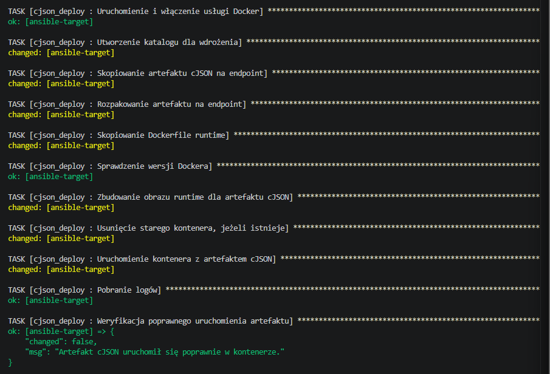

*Rys. 17. Skopiowanie artefaktu, rozpakowanie go i zbudowanie obrazu runtime na maszynie docelowej.*

---

## 15. Weryfikacja działania kontenera

Po zbudowaniu obrazu uruchomiono kontener z artefaktem `cJSON`. Następnie pobrano jego logi i sprawdzono, czy zawierają komunikat potwierdzający poprawne uruchomienie:

```yaml
- name: Uruchomienie kontenera z artefaktem cJSON
  ansible.builtin.command: docker run --name cjson-demo lc417617-cjson-deploy:s08
  register: docker_run

- name: Pobranie logów kontenera
  ansible.builtin.command: docker logs cjson-demo
  register: container_logs
  changed_when: false

- name: Weryfikacja poprawnego uruchomienia artefaktu
  ansible.builtin.assert:
    that:
      - "'cJSON deploy smoke test passed' in container_logs.stdout"
    success_msg: "Artefakt cJSON uruchomił się poprawnie w kontenerze."
    fail_msg: "Artefakt cJSON nie uruchomił się poprawnie."
```

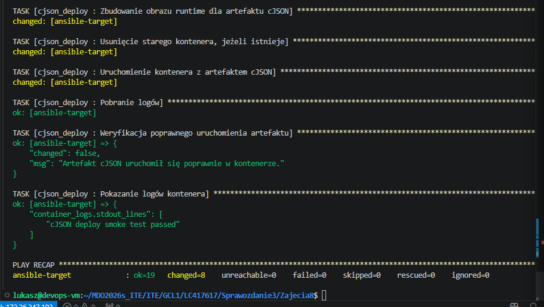

*Rys. 18. Weryfikacja poprawnego uruchomienia artefaktu `cJSON` w kontenerze.*

---

## 16. Czyszczenie środowiska docelowego

Po zakończonym wdrożeniu wykonano czyszczenie środowiska docelowego. Usunięto kontener, obraz runtime oraz katalog wdrożeniowy `/opt/cjson-demo`.

Wykorzystano playbook `05_cleanup_cjson.yml`:

```yaml
---
- name: Czyszczenie środowiska po wdrożeniu cJSON
  hosts: Endpoints
  become: true
  gather_facts: false

  tasks:
    - name: Usunięcie kontenera cjson-demo
      ansible.builtin.command: docker rm -f cjson-demo
      register: cleanup_container
      failed_when: false
      changed_when: cleanup_container.rc == 0

    - name: Usunięcie obrazu runtime
      ansible.builtin.command: docker rmi lc417617-cjson-deploy:s08
      register: cleanup_image
      failed_when: false
      changed_when: cleanup_image.rc == 0

    - name: Usunięcie katalogu wdrożeniowego
      ansible.builtin.file:
        path: /opt/cjson-demo
        state: absent
```

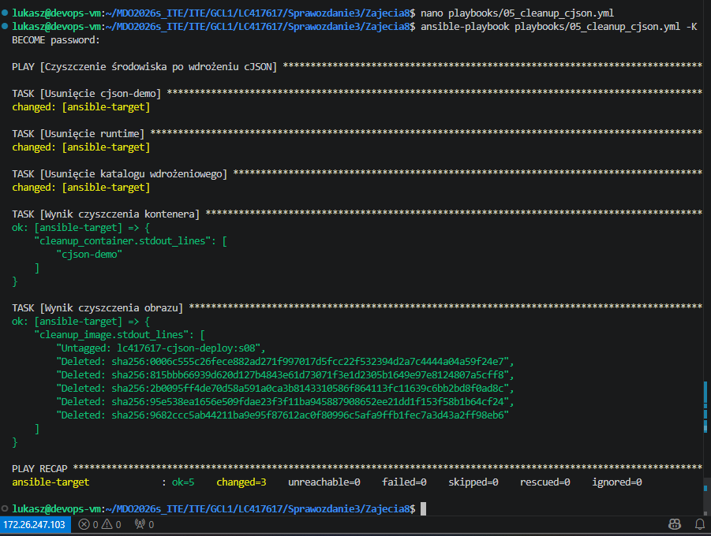

*Rys. 19. Czyszczenie środowiska docelowego po zakończeniu wdrożenia.*

---

## 17. Zapisanie zmian w repozytorium

Po wykonaniu zadania dodano do repozytorium pliki konfiguracyjne Ansible, playbooki, strukturę roli, pliki artefaktu oraz zrzuty ekranu.

Wykonano:

```bash
git add Sprawozdanie3/Zajecia8
git add Sprawozdanie3/img/S08_*.png
git commit -m "LC417617 wykonanie Zajec 08 Ansible"
git push origin LC417617
```

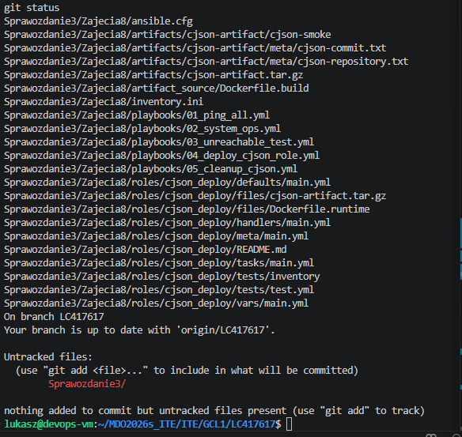

*Rys. 20. Przed dodaniem plików zajęć 08 do repozytorium.*

---

## 18. Listing najważniejszych poleceń

Poniżej przedstawiono najważniejsze polecenia użyte podczas wykonywania zadania. Listing nie zawiera haseł, tokenów ani innych danych wrażliwych.

```bash
cd ~/MDO2026s_ITE/ITE/GCL1/LC417617

mkdir -p Sprawozdanie3/Zajecia8/playbooks
mkdir -p Sprawozdanie3/Zajecia8/roles
mkdir -p Sprawozdanie3/Zajecia8/artifact_source
mkdir -p Sprawozdanie3/Zajecia8/artifacts
mkdir -p Sprawozdanie3/img

cp Sprawozdanie2/Zajecia7/Dockerfile.build Sprawozdanie3/Zajecia8/artifact_source/Dockerfile.build

hostnamectl
hostname
ssh ansible@ansible-target "hostnamectl && hostname && whoami"

sudo nano /etc/hosts
ping -c 3 devops-vm
ping -c 3 ansible-target

cd Sprawozdanie3/Zajecia8

nano ansible.cfg
nano inventory.ini
ansible-inventory --list
ansible all -m ping

nano playbooks/01_ping_all.yml
ansible-playbook playbooks/01_ping_all.yml

nano playbooks/02_system_ops.yml
ansible-playbook playbooks/02_system_ops.yml -K
ansible-playbook playbooks/02_system_ops.yml -K

nano playbooks/03_unreachable_test.yml
ansible-playbook playbooks/03_unreachable_test.yml

docker build --no-cache -f artifact_source/Dockerfile.build -t lc417617-cjson-bldr:s08 artifact_source
mkdir -p artifacts
docker create --name cjson_artifact_s08 lc417617-cjson-bldr:s08 /bin/true
docker cp cjson_artifact_s08:/artifact artifacts/cjson-artifact
docker rm cjson_artifact_s08
tar -czf artifacts/cjson-artifact.tar.gz -C artifacts cjson-artifact

cd roles
ansible-galaxy role init cjson_deploy
cd ..

cp artifacts/cjson-artifact.tar.gz roles/cjson_deploy/files/
nano roles/cjson_deploy/files/Dockerfile.runtime
nano roles/cjson_deploy/meta/main.yml
nano roles/cjson_deploy/tasks/main.yml

nano playbooks/04_deploy_cjson_role.yml
ansible-playbook playbooks/04_deploy_cjson_role.yml -K

nano playbooks/05_cleanup_cjson.yml
ansible-playbook playbooks/05_cleanup_cjson.yml -K

cd ~/MDO2026s_ITE/ITE/GCL1/LC417617
git add Sprawozdanie3/Zajecia8
git add Sprawozdanie3/img/S08_*.png
git commit -m "LC417617 wykonanie Zajec 08 Ansible"
git push origin LC417617
```

---

## 19. Użycie narzędzi generatywnej AI

Podczas realizacji zadania wykorzystano model LLM jako pomoc przy uporządkowaniu kolejności działań, przygotowaniu playbooków Ansible, analizie problemów z łącznością SSH oraz opisaniu wyników w sprawozdaniu.

### Treść głównego zapytania

> Pomóż mi wykonać zadanie z Ansible dotyczące automatyzacji i zdalnego wykonywania poleceń. Mam maszynę główną `devops-vm` oraz maszynę docelową `ansible-target`. Chcę przygotować inventory z sekcjami Orchestrators i Endpoints, wykonać ping Ansible, skopiować inventory, zaktualizować pakiety, zrestartować usługi sshd i rngd, obsłużyć przypadek niedostępnego SSH oraz wdrożyć artefakt cJSON przy pomocy roli utworzonej przez ansible-galaxy.

### Metoda weryfikacji odpowiedzi

Odpowiedzi modelu zostały zweryfikowane praktycznie podczas wykonywania zadania:

* poprawność inventory sprawdzono poleceniami `ansible-inventory --list` oraz `ansible all -m ping`,
* poprawność łączności SSH sprawdzono przez logowanie `ssh ansible@ansible-target`,
* działanie playbooka ping potwierdzono przez `ansible-playbook playbooks/01_ping_all.yml`,
* kopiowanie inventory sprawdzono przez dwukrotne uruchomienie playbooka i porównanie wyniku,
* aktualizację pakietów oraz restart usług zweryfikowano przez wyniki zadań Ansible,
* przypadek niedostępnego SSH sprawdzono przez zatrzymanie `ssh.socket` i `ssh.service`,
* wdrożenie artefaktu sprawdzono przez uruchomienie kontenera i odczyt logów,
* poprawne działanie artefaktu potwierdzono komunikatem `cJSON deploy smoke test passed`,
* czyszczenie środowiska potwierdzono przez playbook usuwający kontener, obraz oraz katalog wdrożeniowy.


## Zajęcia 09 - Pliki odpowiedzi dla wdrożeń nienadzorowanych

Celem zajęć było przygotowanie pliku odpowiedzi dla instalacji nienadzorowanej systemu Fedora. Instalacja miała zostać wykonana z użyciem pliku Kickstart znajdującego się w repozytorium, a po pierwszym uruchomieniu system miał automatycznie przygotować środowisko do uruchomienia artefaktu `cJSON`.

W ramach zadania wykorzystano maszynę główną `devops-vm`, która udostępniała plik Kickstart i artefakt przez prosty serwer HTTP, oraz nową maszynę wirtualną `fedora-cjson-auto`, na której przeprowadzono instalację Fedory.

---

### 1. Przygotowanie maszyny wirtualnej Fedora

Utworzono nową maszynę wirtualną w Hyper-V przeznaczoną do instalacji Fedory. Maszyna została utworzona jako maszyna drugiej generacji, czyli z obsługą UEFI.

Przyjęte ustawienia:

```text
Nazwa maszyny: fedora-cjson-auto
Generacja: Generation 2 / UEFI
Pamięć RAM: 2048 MB
Dysk: 20 GB
Sieć: ten sam przełącznik Hyper-V co maszyna devops-vm
Obraz ISO: Fedora Server 44
```

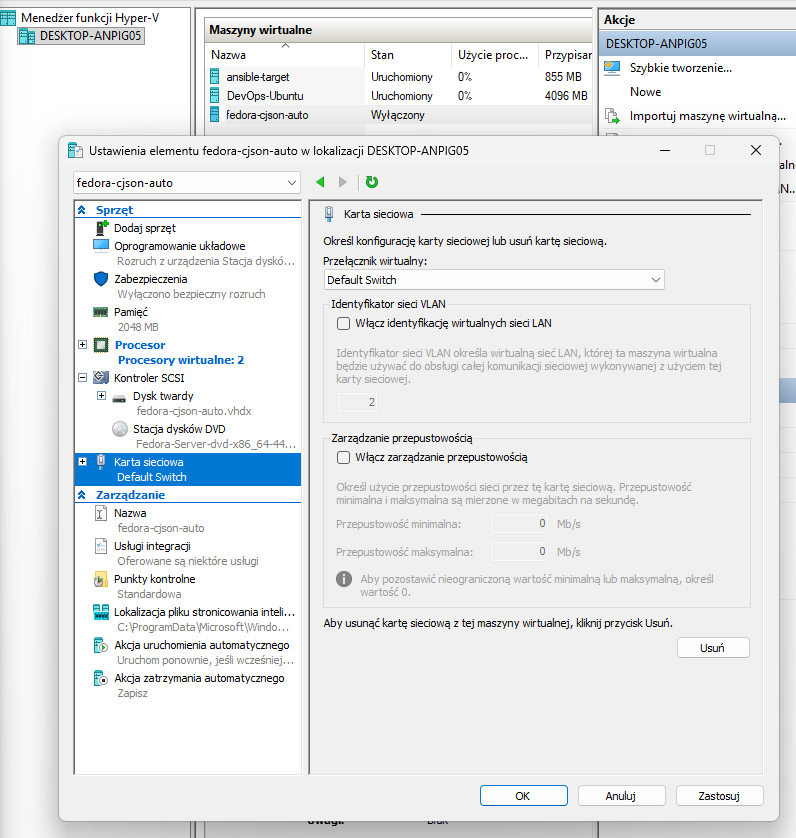

*Rys. 21. Konfiguracja maszyny wirtualnej Fedora w Hyper-V.*

---

### 2. Pierwsza ręczna instalacja Fedory

Najpierw wykonano ręczną instalację Fedory. Było to potrzebne do uzyskania bazowego pliku odpowiedzi wygenerowanego przez instalator Anaconda.

Podczas instalacji ustawiono między innymi:

```text
hostname: fedora-cjson-auto
użytkownik: deploy
typ instalacji: Fedora Server Edition
partycjonowanie: automatyczne
```

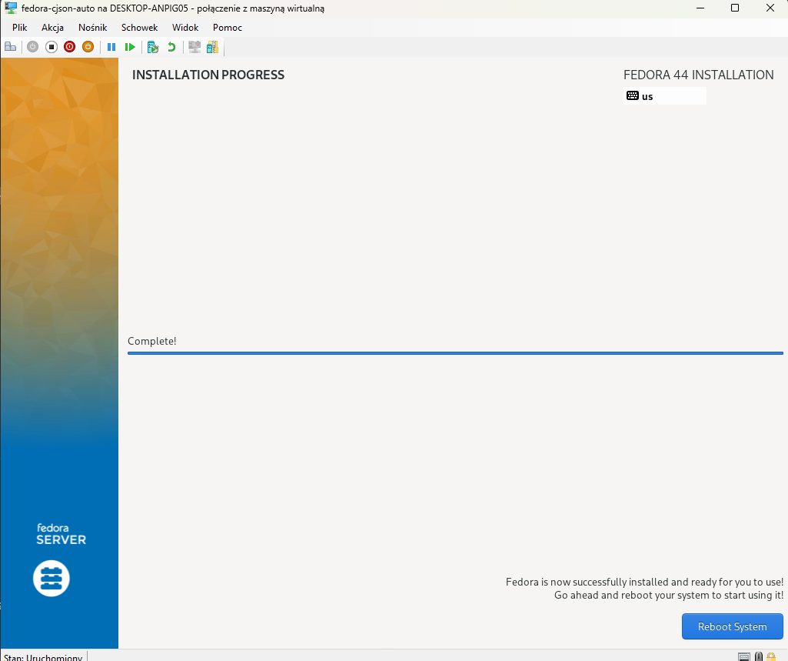

*Rys. 22. Pierwsza ręczna instalacja Fedory.*

Po zakończeniu instalacji zalogowano się do systemu i skopiowano wygenerowany plik Kickstart z katalogu `/root`:

```bash
sudo cp /root/anaconda-ks.cfg /home/deploy/anaconda-ks-source.cfg
sudo chown deploy:deploy /home/deploy/anaconda-ks-source.cfg
ls -l /home/deploy/anaconda-ks-source.cfg
head -40 /home/deploy/anaconda-ks-source.cfg
```

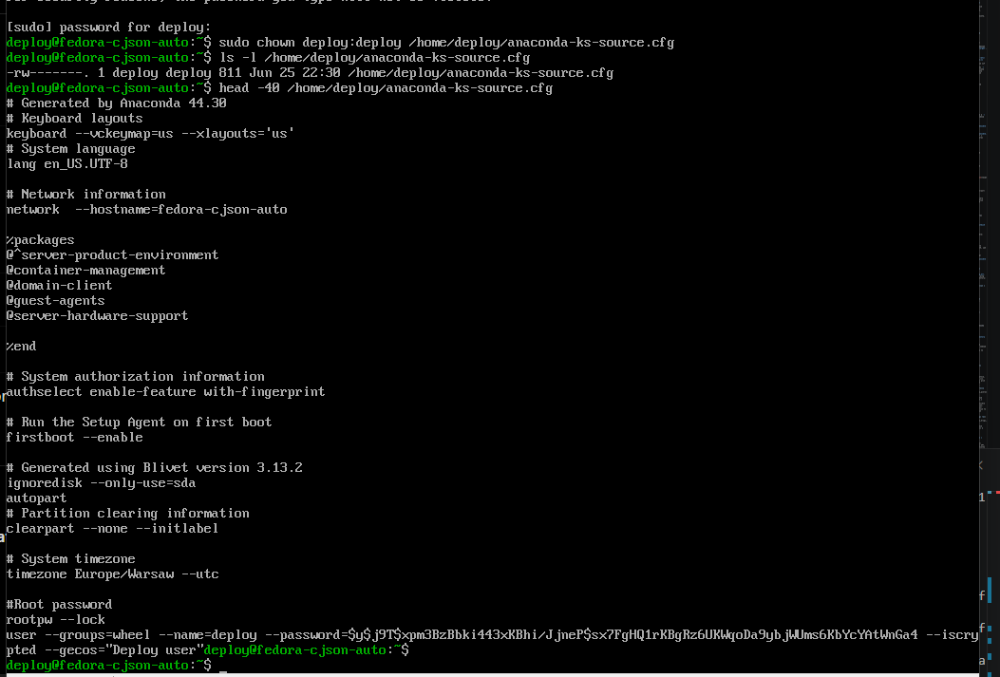

*Rys. 23. Bazowy plik odpowiedzi `anaconda-ks.cfg` wygenerowany przez instalator.*

Plik został następnie skopiowany na maszynę `devops-vm` do katalogu:

```text
Sprawozdanie3/Zajecia9/kickstart/anaconda-ks-source.cfg
```

---

### 3. Przygotowanie właściwego pliku Kickstart

Na podstawie pliku `anaconda-ks.cfg` przygotowano docelowy plik odpowiedzi:

```text
Sprawozdanie3/Zajecia9/kickstart/ks-fedora-cjson.cfg
```

Ten sam plik został również skopiowany do katalogu udostępnianego przez HTTP:

```text
Sprawozdanie3/Zajecia9/http/ks-fedora-cjson.cfg
```

Plik Kickstart zawierał między innymi:

```kickstart
text
reboot

lang en_US.UTF-8
keyboard --xlayouts='pl'
timezone Europe/Warsaw --utc

network --bootproto=dhcp --device=link --activate --hostname=fedora-cjson-auto

url --mirrorlist=https://mirrors.fedoraproject.org/mirrorlist?repo=fedora-44&arch=x86_64
repo --name=updates --mirrorlist=https://mirrors.fedoraproject.org/mirrorlist?repo=updates-released-f44&arch=x86_64

rootpw --lock
user --name=deploy --groups=wheel --password=HASLO_W_POSTACI_HASH --iscrypted --gecos="Deploy User"

zerombr
clearpart --all --initlabel
autopart --type=lvm

services --enabled=sshd,docker
```

Zastosowano `clearpart --all --initlabel`, aby instalacja mogła być wykonywana wielokrotnie na tej samej maszynie i za każdym razem czyściła dysk przed ponowną instalacją.

W sekcji `%packages` dodano pakiety potrzebne do działania systemu oraz kontenera:

```kickstart
%packages
@core
openssh-server
moby-engine
curl
tar
ca-certificates
%end
```

W sekcji `%post` dodano mechanizm pobierania artefaktu `cJSON` oraz pliku `Dockerfile.runtime` z serwera HTTP uruchomionego na maszynie `devops-vm`. Dodatkowo utworzono usługę systemd `cjson-firstboot.service`, której zadaniem było zbudowanie obrazu kontenera i uruchomienie aplikacji po pierwszym starcie systemu.

---

### 4. Udostępnienie pliku odpowiedzi i artefaktu przez HTTP

Na maszynie `devops-vm` uruchomiono prosty serwer HTTP w katalogu:

```text
Sprawozdanie3/Zajecia9/http
```

W katalogu znajdowały się pliki:

```text
ks-fedora-cjson.cfg
cjson-artifact.tar.gz
Dockerfile.runtime
```

Serwer uruchomiono poleceniem:

```bash
cd ~/MDO2026s_ITE/ITE/GCL1/LC417617/Sprawozdanie3/Zajecia9/http
python3 -m http.server 8000 --bind 0.0.0.0
```

Dostępność plików sprawdzono poleceniami `curl`:

```bash
curl http://ADRES_IP_DEVOPS:8000/ks-fedora-cjson.cfg | head
curl -I http://ADRES_IP_DEVOPS:8000/cjson-artifact.tar.gz
curl -I http://ADRES_IP_DEVOPS:8000/Dockerfile.runtime
```

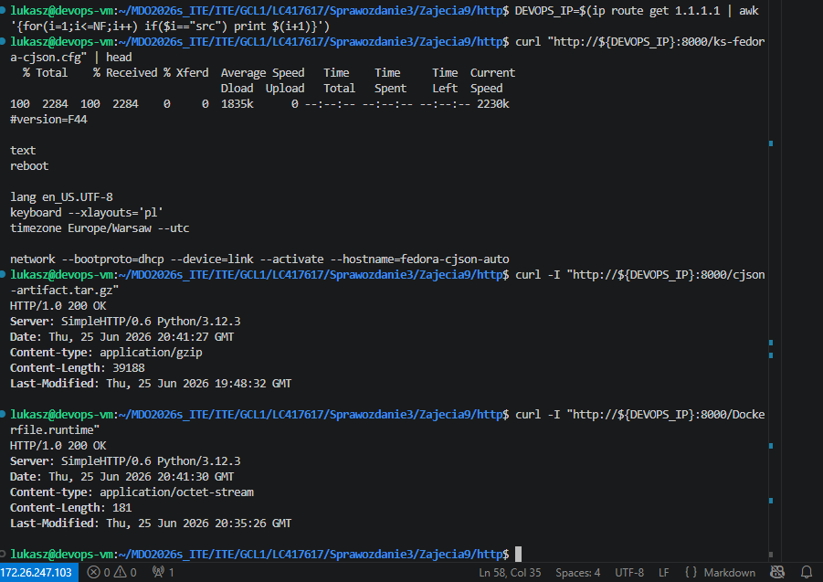

*Rys. 24. Udostępnienie pliku Kickstart oraz artefaktu przez prosty serwer HTTP.*

---

### 5. Uruchomienie instalacji nienadzorowanej

Następnie uruchomiono maszynę `fedora-cjson-auto` z obrazu ISO Fedory. Na ekranie bootowania Fedory wybrano opcję instalacji i przejście do edycji parametrów startowych GRUB.

Do linii startowej dopisano parametr `inst.ks`, wskazujący na plik Kickstart udostępniany przez maszynę `devops-vm`:

```text
inst.ks=http://ADRES_IP_DEVOPS:8000/ks-fedora-cjson.cfg ip=dhcp
```

W praktyce użyto adresu IP maszyny `devops-vm`, odczytanego z pola `src` polecenia:

```bash
ip route get 1.1.1.1
```

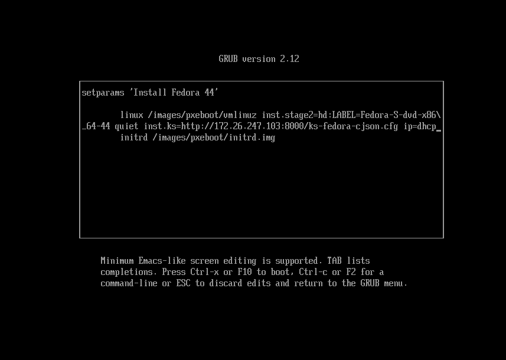

*Rys. 25. Dopisanie parametru `inst.ks` w ekranie bootowania Fedory.*

Po uruchomieniu instalatora plik odpowiedzi został pobrany z serwera HTTP. Instalator nie wymagał ręcznego wybierania użytkownika, partycjonowania, hostname ani pakietów.

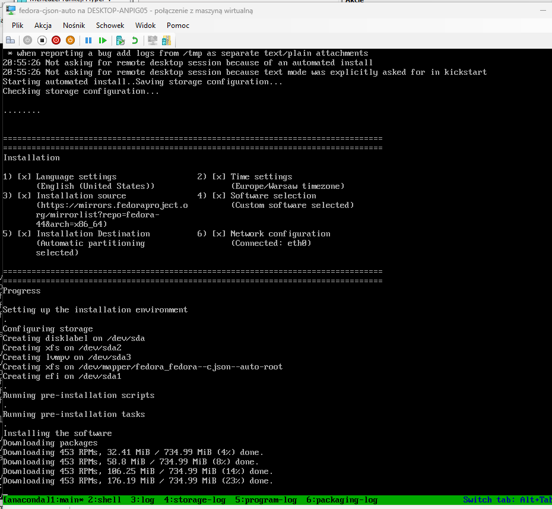

*Rys. 26. Instalacja nienadzorowana Fedory z użyciem pliku Kickstart.*

Na końcu instalacji system został automatycznie zrestartowany dzięki dyrektywie:

```kickstart
reboot
```

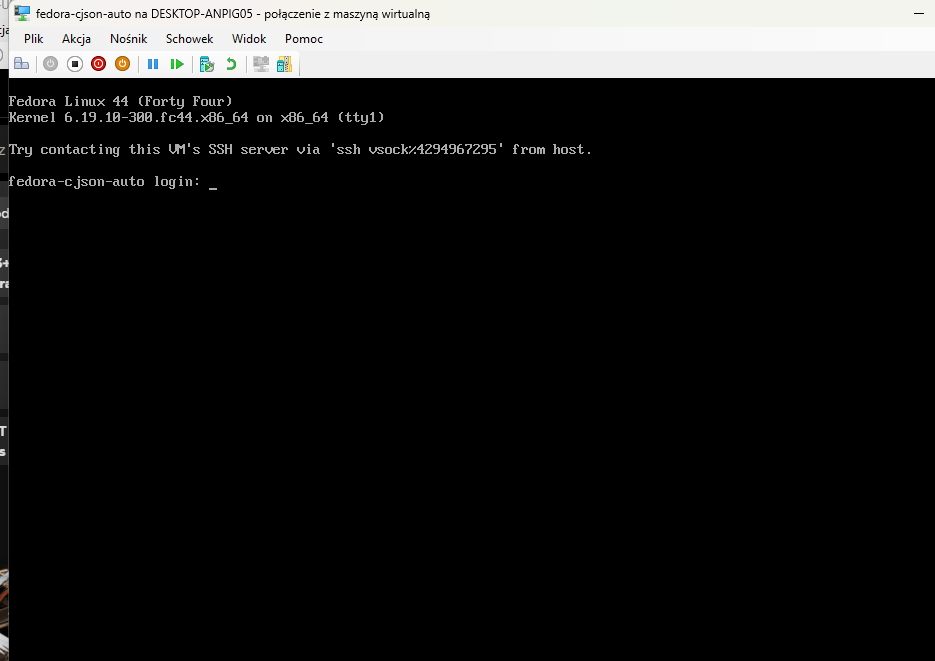

*Rys. 27. Automatyczny restart maszyny po zakończeniu instalacji.*

---

### 6. Pierwsze uruchomienie systemu po instalacji

Po restarcie maszyna uruchomiła już zainstalowany system Fedora. Sprawdzono nazwę hosta oraz wersję systemu:

```bash
hostname
whoami
cat /etc/fedora-release
```

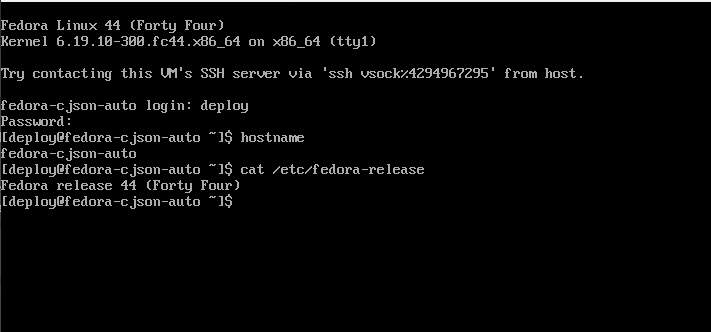

*Rys. 28. Pierwsze uruchomienie systemu po instalacji nienadzorowanej.*

---

### 7. Sprawdzenie usługi Docker

Plik Kickstart instalował pakiet `moby-engine`, który zapewnia działanie silnika kontenerowego zgodnego z Dockerem. Po pierwszym uruchomieniu sprawdzono usługę Docker:

```bash
sudo systemctl status docker --no-pager
sudo docker version
```

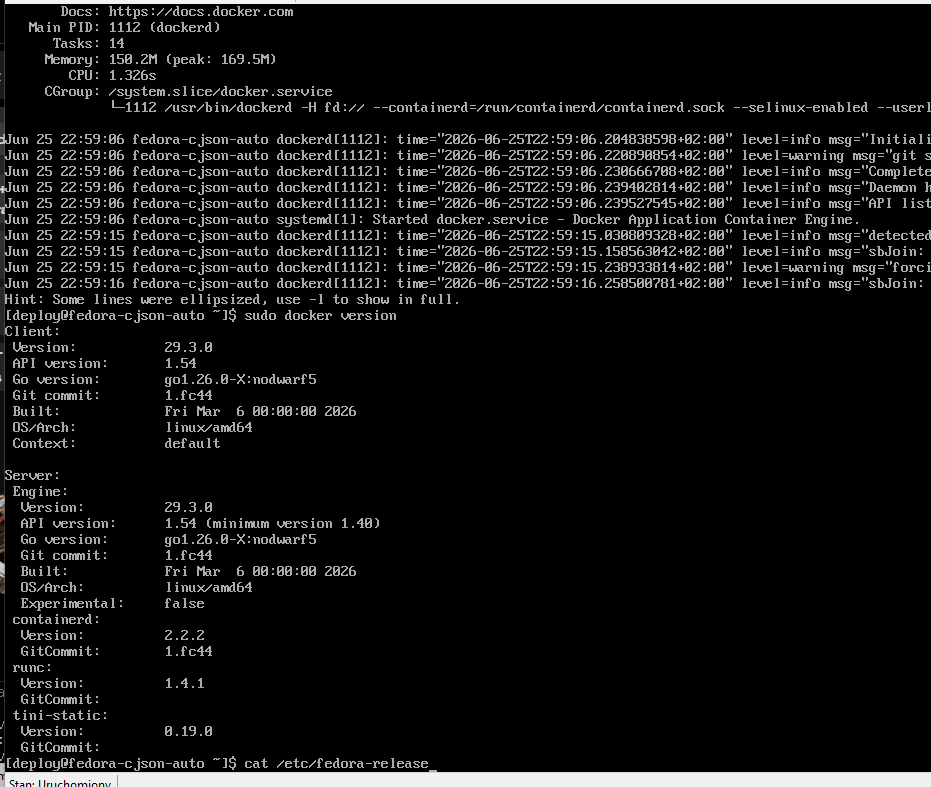

*Rys. 29. Sprawdzenie działania usługi Docker po instalacji systemu.*

---

### 8. Automatyczne uruchomienie artefaktu cJSON

W sekcji `%post` pliku Kickstart utworzono usługę systemd `cjson-firstboot.service`. Jej zadaniem było wykonanie działań po pierwszym uruchomieniu systemu, ponieważ polecenia `docker run` nie powinny być wykonywane bezpośrednio z poziomu instalatora.

Usługa wykonywała skrypt:

```text
/usr/local/sbin/cjson-firstboot.sh
```

Skrypt po pierwszym starcie systemu:

```text
1. rozpakowywał artefakt cJSON,
2. czekał na dostępność Dockera,
3. budował obraz kontenera,
4. uruchamiał kontener cjson-demo,
5. zapisywał logi do /var/log/cjson-demo.log.
```

Sprawdzono status kontenera:

```bash
sudo docker ps -a
sudo docker logs cjson-demo
```

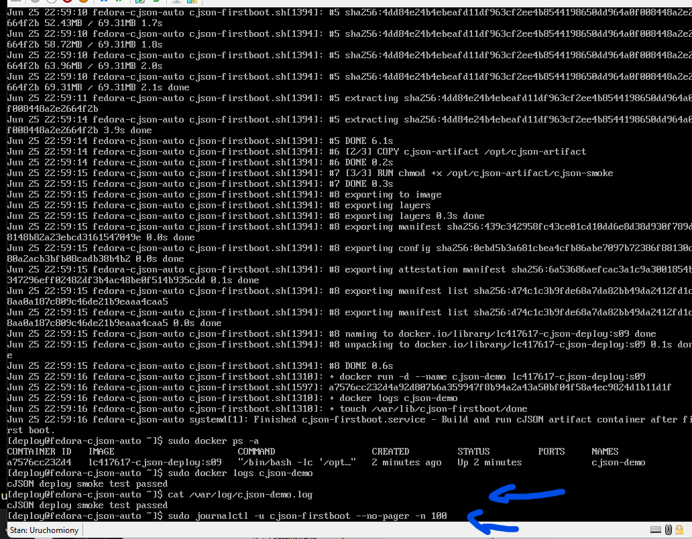

*Rys. 30. Kontener `cjson-demo` uruchomiony po pierwszym starcie systemu.*

---

### 9. Weryfikacja działania programu

Poprawność działania programu zweryfikowano przez odczyt logów kontenera oraz pliku `/var/log/cjson-demo.log`:

```bash
sudo docker logs cjson-demo
cat /var/log/cjson-demo.log
```

W logach znajdował się komunikat:

```text
cJSON deploy smoke test passed
```

Oznacza to, że artefakt przygotowany w poprzednich zadaniach został poprawnie pobrany, umieszczony w kontenerze i uruchomiony po pierwszym starcie systemu.

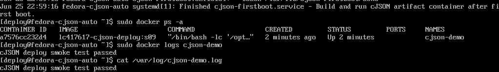

*Rys. 31. Logi kontenera potwierdzające poprawne uruchomienie programu.*

---

### 10. Log sekcji `%post`

Dodatkowo sprawdzono log sekcji `%post`, zapisany w pliku:

```text
/root/ks-post.log
```

Wykonano:

```bash
sudo cat /root/ks-post.log
```

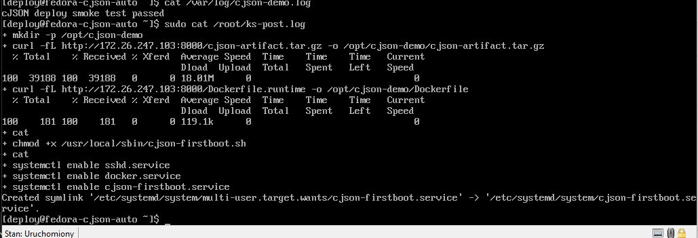

*Rys. 32. Log działań wykonanych w sekcji `%post` pliku Kickstart.*

---

### 11. Pliki przygotowane w repozytorium

W repozytorium umieszczono pliki potrzebne do odtworzenia instalacji nienadzorowanej:

```text
Sprawozdanie3/Zajecia9/http/cjson-artifact.tar.gz
Sprawozdanie3/Zajecia9/http/Dockerfile.runtime
Sprawozdanie3/Zajecia9/http/ks-fedora-cjson.cfg
Sprawozdanie3/Zajecia9/kickstart/anaconda-ks-source.cfg
Sprawozdanie3/Zajecia9/kickstart/ks-fedora-cjson.cfg
```

Plik `anaconda-ks-source.cfg` jest bazowym plikiem odpowiedzi wygenerowanym przez ręczną instalację Fedory. Plik `ks-fedora-cjson.cfg` jest zmodyfikowaną wersją używaną do instalacji nienadzorowanej.

---

### 12. Listing najważniejszych poleceń

Poniżej przedstawiono najważniejsze polecenia użyte podczas wykonywania zadania. Listing nie zawiera haseł ani tokenów.

```bash
cd ~/MDO2026s_ITE/ITE/GCL1/LC417617

mkdir -p Sprawozdanie3/Zajecia9/kickstart
mkdir -p Sprawozdanie3/Zajecia9/http
mkdir -p Sprawozdanie3/img

cp Sprawozdanie3/Zajecia8/artifacts/cjson-artifact.tar.gz Sprawozdanie3/Zajecia9/http/

scp deploy@IP_FEDORY:/home/deploy/anaconda-ks-source.cfg Sprawozdanie3/Zajecia9/kickstart/anaconda-ks-source.cfg

nano Sprawozdanie3/Zajecia9/http/Dockerfile.runtime
nano Sprawozdanie3/Zajecia9/kickstart/ks-fedora-cjson.cfg

DEVOPS_IP=$(ip route get 1.1.1.1 | awk '{for(i=1;i<=NF;i++) if($i=="src") print $(i+1)}')
echo "$DEVOPS_IP"

sed -i "s#__DEVOPS_IP__#${DEVOPS_IP}#g" Sprawozdanie3/Zajecia9/kickstart/ks-fedora-cjson.cfg

cp Sprawozdanie3/Zajecia9/kickstart/ks-fedora-cjson.cfg Sprawozdanie3/Zajecia9/http/

cd Sprawozdanie3/Zajecia9/http
python3 -m http.server 8000 --bind 0.0.0.0

curl http://${DEVOPS_IP}:8000/ks-fedora-cjson.cfg | head
curl -I http://${DEVOPS_IP}:8000/cjson-artifact.tar.gz
curl -I http://${DEVOPS_IP}:8000/Dockerfile.runtime

git add Sprawozdanie3/Zajecia9
git add Sprawozdanie3/img/S09_*.png
git commit -m "LC417617 Zajecia 09 - Kickstart"
git push origin LC417617
```

---

### 13. Użycie narzędzi generatywnej AI

Podczas realizacji zadania wykorzystano model LLM jako pomoc przy uporządkowaniu kolejności działań, przygotowaniu pliku Kickstart, analizie błędów z pobieraniem pliku odpowiedzi oraz opracowaniu opisu do sprawozdania.

#### Treść głównego zapytania

> Chcę przygotować instalację Fedory z użyciem pliku Kickstart z repozytorium. System po instalacji ma pobrać artefakt cJSON z repozytorium Gita lub ode mnie, zainstalować Dockera i po pierwszym uruchomieniu automatycznie uruchomić kontener z programem. Jak ogarnąć Fedorę z instalacją ręczną oraz z nienadzarowaną?

#### Metoda weryfikacji odpowiedzi

Odpowiedzi modelu zostały zweryfikowane praktycznie podczas wykonywania zadania:

* bazowy plik odpowiedzi potwierdzono przez obecność `/root/anaconda-ks.cfg`,
* poprawność udostępnienia pliku Kickstart sprawdzono przez `curl`,
* instalację nienadzorowaną potwierdzono przez uruchomienie instalatora z parametrem `inst.ks`,
* brak ręcznego uzupełniania danych potwierdził poprawność pliku odpowiedzi,
* automatyczny restart potwierdził działanie dyrektywy `reboot`,
* instalację Dockera sprawdzono przez `systemctl status docker` oraz `docker version`,
* uruchomienie artefaktu potwierdzono przez `docker ps -a`,
* poprawność działania programu potwierdzono komunikatem `cJSON deploy smoke test passed`,
* działania sekcji `%post` sprawdzono w pliku `/root/ks-post.log`.


## Zajęcia 10 — Wdrażanie na zarządzalne kontenery: Kubernetes

Celem zajęć było uruchomienie lokalnego klastra Kubernetes, przygotowanie obrazu kontenerowego aplikacji i wdrożenie jej w klastrze. Do wykonania zadania użyłem `minikube`, czyli prostego środowiska Kubernetes działającego lokalnie.

W ramach zadania przygotowałem prostą aplikację HTTP opartą o `nginx`. Aplikacja miała dwie działające wersje oraz jedną wersję celowo błędną. Dzięki temu mogłem sprawdzić zwykłe wdrożenie, skalowanie, aktualizację obrazu, błąd wdrożenia oraz rollback.

---

### 1. Instalacja minikube

Na początku zainstalowałem `minikube`, czyli lokalną implementację klastra Kubernetes. Klaster został uruchomiony z użyciem drivera Docker. Jest to wygodne rozwiązanie, ponieważ Docker był już dostępny w środowisku.

Po instalacji sprawdziłem wersję minikube:

```bash
minikube version
```

Przygotowałem też alias do używania `kubectl` przez minikube:

```bash
alias minikubectl="minikube kubectl --"
```

Dzięki temu zamiast pisać za każdym razem:

```bash
minikube kubectl --
```

mogłem używać krótszej komendy:

```bash
minikubectl
```

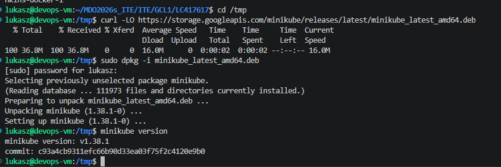

---

### 2. Uruchomienie klastra Kubernetes

Klaster Kubernetes uruchomiłem poleceniem:

```bash
minikube start --driver=docker --cpus=2 --memory=2200mb --disk-size=20g
```

W tym poleceniu ograniczyłem zasoby używane przez klaster:

* `--cpus=2` — klaster korzysta z 2 rdzeni CPU,
* `--memory=2200mb` — klaster ma przydzielone około 2,2 GB RAM,
* `--disk-size=20g` — klaster ma dysk o rozmiarze 20 GB.

Takie ustawienia pomagają ograniczyć problemy wynikające z wymagań sprzętowych. Kubernetes potrafi zużywać sporo zasobów, dlatego dobrze było od razu ustawić konkretne limity.

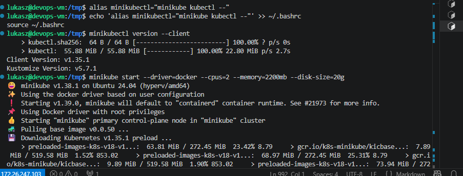

Po uruchomieniu sprawdziłem stan klastra:

```bash
minikube status
minikubectl get nodes -o wide
minikubectl get pods -A
```

Polecenie `get nodes` pokazało działający węzeł klastra, a `get pods -A` pokazało pody systemowe uruchomione w Kubernetesie.

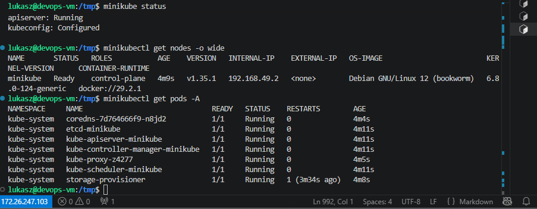

---

### 3. Kubernetes Dashboard

Następnie uruchomiłem Kubernetes Dashboard:

```bash
minikube dashboard --url
```

Dashboard został otwarty w przeglądarce. W panelu można było zobaczyć zasoby klastra, takie jak namespace, pody, deploymenty i serwisy.

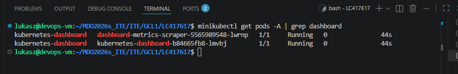

Dashboard był przydatny do graficznego sprawdzania, czy deploymenty i pody faktycznie działają w klastrze.

---

### 4. Przygotowanie obrazów aplikacji

Na potrzeby zadania przygotowałem prostą aplikację HTTP. Aplikacja została oparta o `nginx:alpine` i wyświetlała prostą stronę HTML.

Przygotowałem trzy wersje obrazu:

* `lc417617-k8s-demo:v1` — pierwsza działająca wersja aplikacji,
* `lc417617-k8s-demo:v2` — druga działająca wersja aplikacji,
* `lc417617-k8s-demo:bad` — wersja celowo błędna, która kończy działanie błędem.

Dla wersji `v1` i `v2` przygotowałem osobne pliki `index.html`. Różniły się one tekstem informującym o wersji aplikacji.

Przykład zawartości strony dla wersji `v1`:

```html
<!doctype html>
<html>
<head>
  <meta charset="utf-8">
  <title>LC417617 Kubernetes v1</title>
</head>
<body>
  <h1>LC417617 Kubernetes demo</h1>
  <p>Wersja aplikacji: v1</p>
  <p>Kontener dziala poprawnie w Kubernetes.</p>
</body>
</html>
```

Obrazy zostały zbudowane bezpośrednio w środowisku minikube:

```bash
minikube image build -t lc417617-k8s-demo:v1 Sprawozdanie3/Zajecia10/app/v1
minikube image build -t lc417617-k8s-demo:v2 Sprawozdanie3/Zajecia10/app/v2
minikube image build -t lc417617-k8s-demo:bad Sprawozdanie3/Zajecia10/app/bad
```

Następnie sprawdziłem listę obrazów:

```bash
minikube image ls | grep lc417617
```

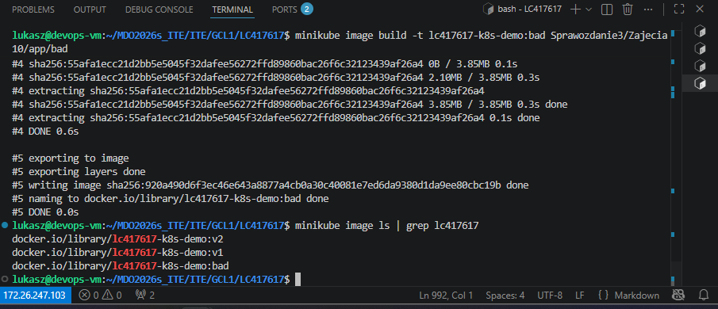

---

### 5. Ręczne uruchomienie aplikacji jako pod

Najpierw uruchomiłem aplikację ręcznie za pomocą `kubectl run`. Kubernetes automatycznie uruchomił kontener jako pod.

```bash
minikubectl run lc417617-manual \
  --image=lc417617-k8s-demo:v1 \
  --port=80 \
  --labels app=lc417617-manual \
  --image-pull-policy=Never
```

Użyłem `imagePullPolicy=Never`, ponieważ obraz był zbudowany lokalnie w minikube i nie musiał być pobierany z Docker Huba.

Następnie sprawdziłem stan poda:

```bash
minikubectl get pods -o wide
minikubectl describe pod lc417617-manual
```

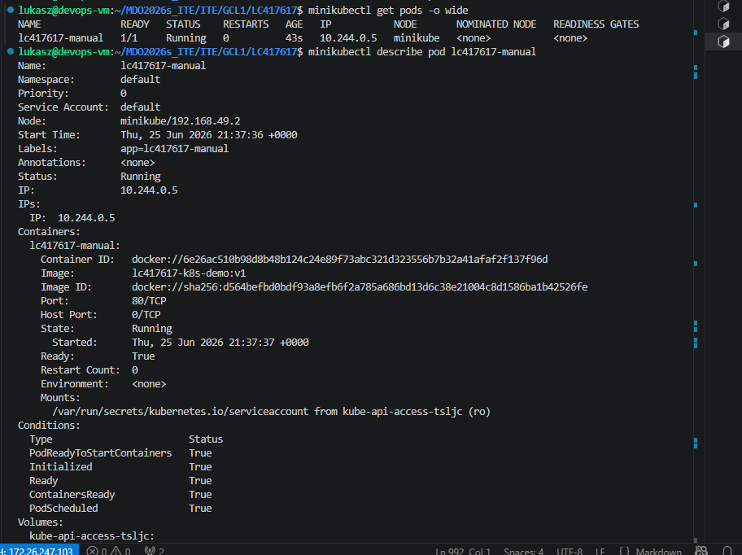

Aby sprawdzić, czy aplikacja odpowiada, wykonałem przekierowanie portu:

```bash
minikubectl port-forward pod/lc417617-manual 8080:80
```

W drugim terminalu wykonałem test:

```bash
curl http://127.0.0.1:8080
```

W odpowiedzi pojawił się kod HTML strony z informacją:

```html
<p>Wersja aplikacji: v1</p>
```

To potwierdziło, że kontener działa poprawnie.

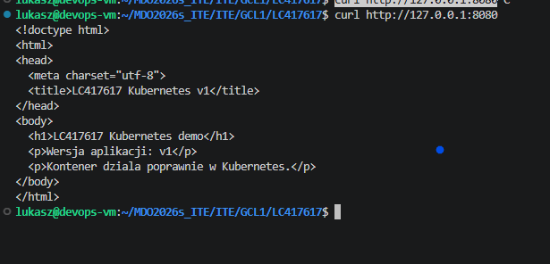

---

### 6. Deployment zapisany w pliku YAML

Po ręcznym uruchomieniu aplikacji przygotowałem deployment zapisany w pliku YAML:

```text
Sprawozdanie3/Zajecia10/manifests/deployment-v1.yml
```

Deployment opisywał oczekiwany stan aplikacji. Początkowo ustawiłem 4 repliki:

```yaml
replicas: 4
```

oraz obraz:

```yaml
image: lc417617-k8s-demo:v1
```

Plik został zastosowany poleceniem:

```bash
minikubectl apply -f Sprawozdanie3/Zajecia10/manifests/deployment-v1.yml
```

Następnie sprawdziłem stan wdrożenia:

```bash
minikubectl rollout status deployment/lc417617-web
minikubectl get deployment
minikubectl get pods -l app=lc417617-web -o wide
```

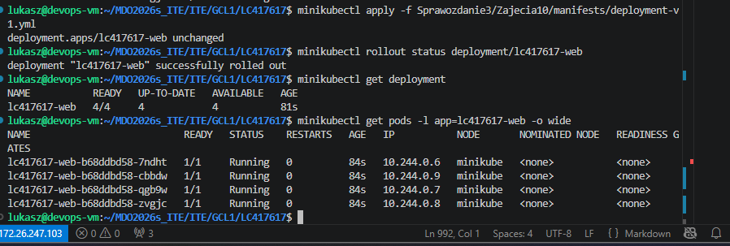

Deployment został też sprawdzony w Kubernetes Dashboard. Widać tam było deployment `lc417617-web` i jego pody.

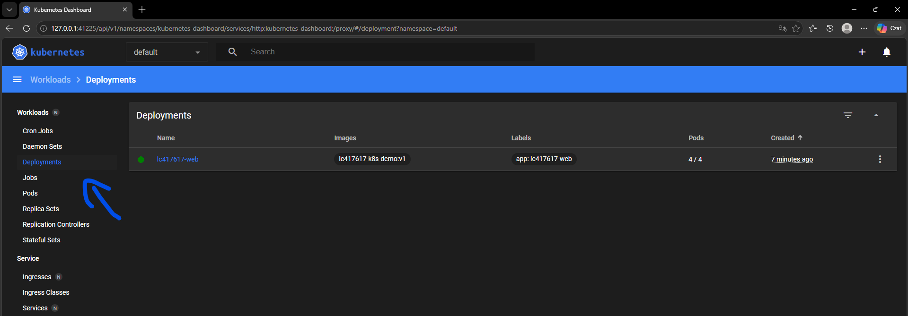

---

### 7. Service i przekierowanie portu

Aby aplikacja była dostępna przez stabilny adres wewnątrz klastra, przygotowałem serwis w pliku:

```text
Sprawozdanie3/Zajecia10/manifests/service.yml
```

Serwis wybierał pody z etykietą:

```yaml
app: lc417617-web
```

Plik został zastosowany poleceniem:

```bash
minikubectl apply -f Sprawozdanie3/Zajecia10/manifests/service.yml
```

Następnie sprawdziłem serwis:

```bash
minikubectl get svc
```

Aby dostać się do aplikacji z lokalnej maszyny, wykonałem przekierowanie portu do serwisu:

```bash
minikubectl port-forward service/lc417617-web-service 8082:80
```

Test aplikacji:

```bash
curl http://127.0.0.1:8082
```

Aplikacja odpowiedziała stroną HTML, więc serwis działał poprawnie.

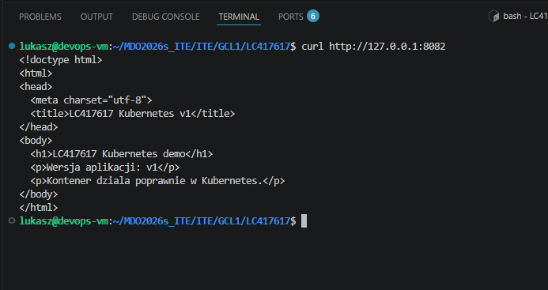

---

### 8. Skalowanie deploymentu

Następnie sprawdziłem skalowanie aplikacji. Najpierw zwiększyłem liczbę replik do 8.

Po zmianie wartości `replicas` w pliku YAML wykonałem:

```bash
minikubectl apply -f Sprawozdanie3/Zajecia10/manifests/deployment-v1.yml
minikubectl rollout status deployment/lc417617-web
minikubectl get deployment lc417617-web
minikubectl get pods -l app=lc417617-web -o wide
```

Kubernetes uruchomił 8 replik aplikacji.

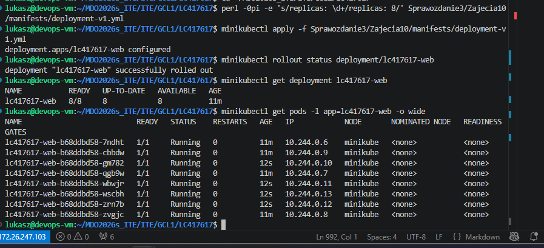

Potem wykonałem kolejne zmiany liczby replik:

* zmniejszenie do 1 repliki,
* zmniejszenie do 0 replik,
* ponowne zwiększenie do 4 replik.

Po każdej zmianie używałem:

```bash
minikubectl apply -f Sprawozdanie3/Zajecia10/manifests/deployment-v1.yml
minikubectl get deployment lc417617-web
minikubectl get pods -l app=lc417617-web -o wide
```

Przy `0` replikach Kubernetes usunął pody aplikacji. Po powrocie do 4 replik pody zostały ponownie uruchomione.

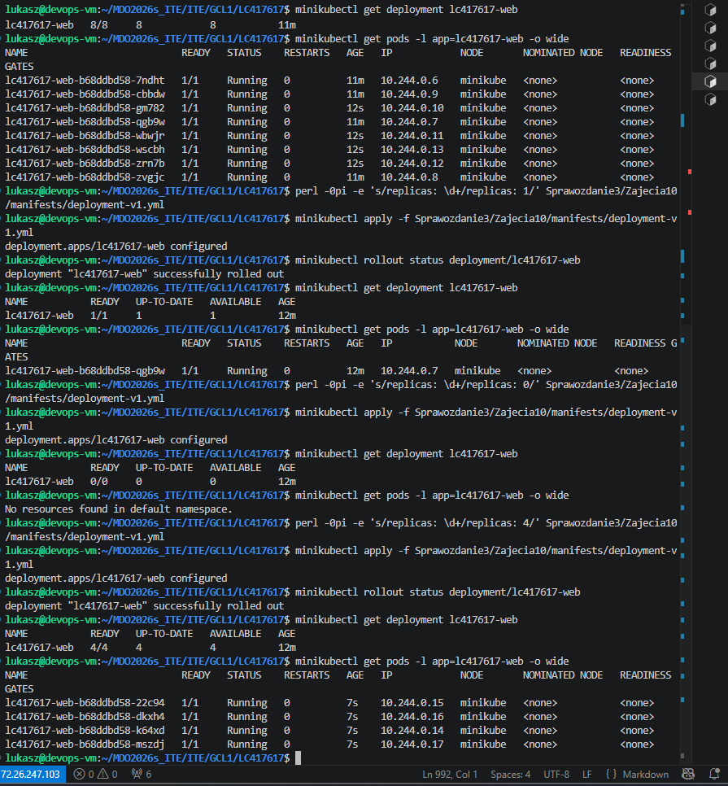

---

### 9. Aktualizacja obrazu do wersji v2

Kolejnym krokiem była aktualizacja aplikacji z wersji `v1` do `v2`.

W pliku deploymentu zmieniłem obraz:

```yaml
image: lc417617-k8s-demo:v2
```

Następnie zastosowałem zmianę:

```bash
minikubectl apply -f Sprawozdanie3/Zajecia10/manifests/deployment-v1.yml
minikubectl rollout status deployment/lc417617-web
```

Po zakończeniu rollouta ponownie wykonałem test przez `curl`. Aplikacja zwróciła stronę z informacją:

```html
<p>Wersja aplikacji: v2</p>
```

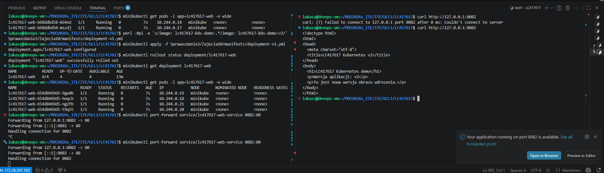

Potem sprawdziłem również powrót do starszej wersji obrazu `v1`.

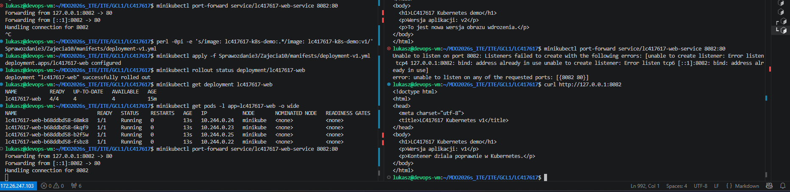

---

### 10. Wdrożenie wadliwego obrazu

Następnie przetestowałem wdrożenie błędnej wersji obrazu. W pliku deploymentu ustawiłem:

```yaml
image: lc417617-k8s-demo:bad
```

Ten obraz został przygotowany tak, aby kontener kończył działanie błędem. Dzięki temu można było zobaczyć, jak Kubernetes reaguje na wadliwy rollout.

Po zastosowaniu pliku uruchomiłem:

```bash
minikubectl rollout status deployment/lc417617-web --timeout=60s
```

Następnie sprawdziłem stan deploymentu, podów i zdarzeń:

```bash
minikubectl get deployment lc417617-web
minikubectl get pods -l app=lc417617-web -o wide
minikubectl get events --sort-by=.lastTimestamp | tail -30
```

Wyniki pokazały, że nowa wersja ma problem z uruchomieniem. Był to oczekiwany efekt, ponieważ obraz `bad` był celowo błędny.

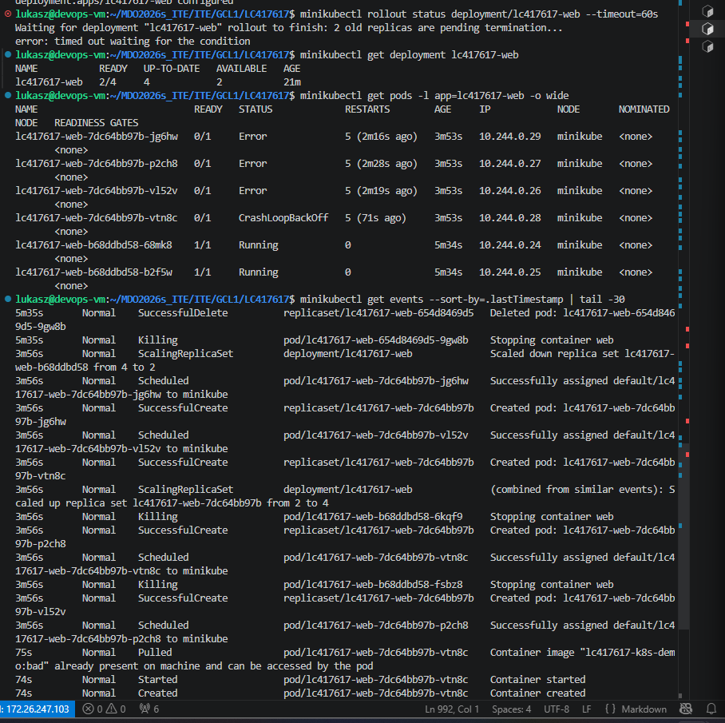

---

### 11. Historia wdrożenia i rollback

Po sprawdzeniu błędnej wersji użyłem historii rolloutów:

```bash
minikubectl rollout history deployment/lc417617-web
```

Następnie przywróciłem poprzednią działającą wersję:

```bash
minikubectl rollout undo deployment/lc417617-web
minikubectl rollout status deployment/lc417617-web
```

Po rollbacku deployment wrócił do poprawnego stanu.

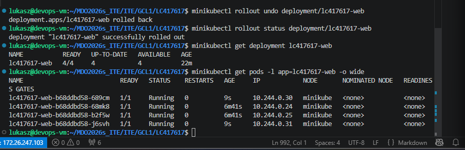

---

### 12. Skrypt sprawdzający wdrożenie

Przygotowałem prosty skrypt, który sprawdza, czy deployment zdążył się wdrożyć w ciągu 60 sekund.

Plik skryptu:

```text
Sprawozdanie3/Zajecia10/scripts/wait-for-deployment.sh
```

Skrypt przyjmuje nazwę deploymentu, namespace i timeout. Domyślnie sprawdza deployment `lc417617-web` w namespace `default`.

Najważniejsze polecenie w skrypcie to:

```bash
minikube kubectl -- -n "${NAMESPACE}" rollout status "deployment/${DEPLOYMENT}" --timeout="${TIMEOUT}"
```

Po pozytywnym zakończeniu skrypt pokazuje też stan deploymentu i listę podów.

Uruchomienie:

```bash
Sprawozdanie3/Zajecia10/scripts/wait-for-deployment.sh
```

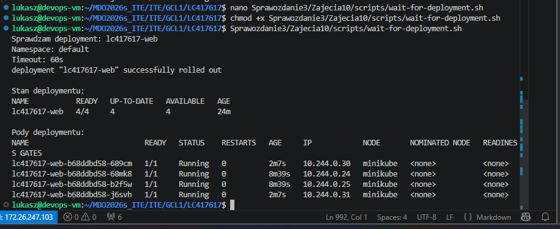

---

### 13. Strategie wdrożenia: Recreate i RollingUpdate

Przygotowałem dwa osobne pliki YAML pokazujące różne strategie wdrożenia.

Pierwszy plik:

```text
Sprawozdanie3/Zajecia10/manifests/deployment-recreate.yml
```

używa strategii:

```yaml
strategy:
  type: Recreate
```

W strategii `Recreate` Kubernetes najpierw usuwa stare pody, a dopiero potem uruchamia nowe. Jest to proste, ale może spowodować krótką przerwę w działaniu aplikacji.

Drugi plik:

```text
Sprawozdanie3/Zajecia10/manifests/deployment-rolling.yml
```

używa strategii:

```yaml
strategy:
  type: RollingUpdate
  rollingUpdate:
    maxUnavailable: 2
    maxSurge: 50%
```

W strategii `RollingUpdate` Kubernetes stopniowo zastępuje stare pody nowymi. Dzięki temu aplikacja może działać podczas aktualizacji. Parametr `maxUnavailable: 2` pozwala, aby część podów była chwilowo niedostępna, a `maxSurge: 50%` pozwala utworzyć dodatkowe pody w czasie aktualizacji.

Stan obu deploymentów został sprawdzony poleceniami:

```bash
minikubectl rollout status deployment/lc417617-recreate
minikubectl rollout status deployment/lc417617-rolling
minikubectl get deployment lc417617-recreate lc417617-rolling
```

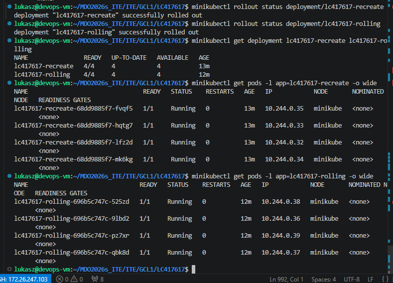

---

### 14. Canary Deployment

Na końcu przygotowałem prosty wariant Canary Deployment. Został on zapisany w pliku:

```text
Sprawozdanie3/Zajecia10/manifests/canary.yml
```

Canary zostało wykonane jako dwa osobne deploymenty:

* `lc417617-canary-stable` — 3 repliki wersji `v1`,
* `lc417617-canary-new` — 1 replika wersji `v2`.

Oba deploymenty miały wspólną etykietę:

```yaml
app: lc417617-canary
```

Dzięki temu jeden serwis mógł kierować ruch do obu wersji aplikacji.

Dodatkowo pody miały etykietę z wersją:

```yaml
version: stable
```

albo:

```yaml
version: canary
```

Po zastosowaniu pliku sprawdziłem rollout obu deploymentów:

```bash
minikubectl rollout status deployment/lc417617-canary-stable
minikubectl rollout status deployment/lc417617-canary-new
```

Następnie sprawdziłem pody i endpointy serwisu:

```bash
minikubectl get pods -l app=lc417617-canary -o wide --show-labels
minikubectl get endpoints lc417617-canary-service
```

Test wykonany z wnętrza klastra pokazał odpowiedzi z obu wersji aplikacji, czyli `v1` i `v2`. Oznacza to, że prosty canary deployment działał poprawnie.

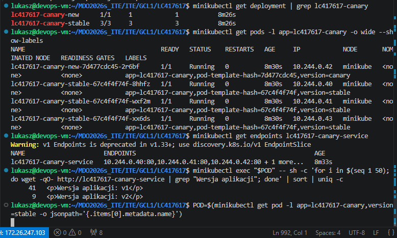

---

### 15. Przygotowane pliki

W ramach zajęć przygotowałem następujące pliki:

```text
Sprawozdanie3/Zajecia10/app/bad/Dockerfile
Sprawozdanie3/Zajecia10/app/v1/Dockerfile
Sprawozdanie3/Zajecia10/app/v1/index.html
Sprawozdanie3/Zajecia10/app/v2/Dockerfile
Sprawozdanie3/Zajecia10/app/v2/index.html
Sprawozdanie3/Zajecia10/manifests/canary.yml
Sprawozdanie3/Zajecia10/manifests/deployment-recreate.yml
Sprawozdanie3/Zajecia10/manifests/deployment-rolling.yml
Sprawozdanie3/Zajecia10/manifests/deployment-v1.yml
Sprawozdanie3/Zajecia10/manifests/service.yml
Sprawozdanie3/Zajecia10/scripts/wait-for-deployment.sh
```

---

### 16. Wnioski

W ramach zajęć uruchomiłem lokalny klaster Kubernetes za pomocą minikube. Następnie przygotowałem prostą aplikację działającą w kontenerze i wdrożyłem ją w klastrze.

Najważniejsze wykonane elementy to:

* instalacja i uruchomienie minikube,
* użycie `kubectl` przez minikube,
* uruchomienie Kubernetes Dashboard,
* przygotowanie własnego obrazu aplikacji,
* ręczne uruchomienie poda,
* przygotowanie deploymentu w pliku YAML,
* wystawienie aplikacji przez service,
* przekierowanie portu do poda i serwisu,
* skalowanie liczby replik,
* aktualizacja obrazu do nowej wersji,
* test wadliwego obrazu,
* rollback do poprzedniej wersji,
* skrypt sprawdzający wdrożenie,
* sprawdzenie strategii Recreate, RollingUpdate i Canary.

Kubernetes różni się od zwykłego Dockera tym, że nie uruchamia tylko pojedynczego kontenera. W Kubernetesie opisuje się oczekiwany stan aplikacji, a klaster stara się ten stan utrzymać. Jeśli na przykład deployment ma mieć 4 repliki, Kubernetes pilnuje, aby tyle podów działało.

---

### 17. Użycie LLM

Podczas wykonywania zadania korzystałem z pomocy LLM jako wsparcia przy części problemów technicznych i przy porządkowaniu opisu do sprawozdania. Odpowiedzi modelu nie były traktowane jako gotowe rozwiązanie bez sprawdzenia. Komendy były uruchamiane ręcznie w środowisku laboratoryjnym, a ich wyniki sprawdzałem w terminalu i w Kubernetes Dashboard.

Przykładowe prompty, które mogły pojawić się podczas pracy:

```text
Jak zainstalować minikube na Ubuntu i uruchomić go z driverem Docker?
```

Ten prompt pomógł uporządkować początkową instalację minikube oraz sposób uruchomienia lokalnego klastra.

```text
Jak używać kubectl przez minikube, jeśli nie mam osobno zainstalowanego kubectl?
```

Tutaj pomocne było wskazanie wariantu `minikube kubectl --` oraz przygotowanie prostego aliasu `minikubectl`.

```text
Dlaczego kubectl port-forward pokazuje błąd address already in use i jak sprawdzić, co zajmuje port?
```

Ten prompt był przydatny przy problemach z zajętymi portami, między innymi `8081`, `8083` i `8084`. Pomógł dobrać komendy do sprawdzenia procesów i zwolnienia portów.

```text
Jak przygotować prosty obraz nginx z własnym plikiem index.html do testu w Kubernetes?
```

Ten prompt pomógł przy przygotowaniu prostej aplikacji HTTP w dwóch wersjach: `v1` i `v2`. Aplikacja działała jako serwer WWW, więc nadawała się do testu w Kubernetesie.

```text
Jak sprawdzić, czy deployment w Kubernetes poprawnie się wdrożył?
```

Tutaj pomocne były polecenia `kubectl rollout status`, `kubectl get deployment` i `kubectl get pods`.

```text
Jak zasymulować wadliwą wersję obrazu i potem wrócić do poprzedniej wersji deploymentu?
```

Ten prompt pomógł przy teście obrazu `bad`, analizie błędu i użyciu poleceń `kubectl rollout history` oraz `kubectl rollout undo`.

```text
Czym różni się Recreate od RollingUpdate w prostych słowach?
```

Ten prompt pomógł opisać różnice między strategiami wdrożenia prostym językiem.

```text
Jak zrobić prosty canary deployment w Kubernetes z dwiema wersjami aplikacji?
```

Ten prompt pomógł uporządkować canary deployment jako dwa deploymenty: stabilny `v1` i testowy `v2`, połączone jednym serwisem.

LLM pomógł głównie w dobraniu kolejności kroków, wyjaśnieniu błędów i przygotowaniu prostych opisów. Samo wykonanie komend, sprawdzenie wyników, wykonanie screenów i weryfikacja działania aplikacji zostały wykonane w środowisku laboratoryjnym.
