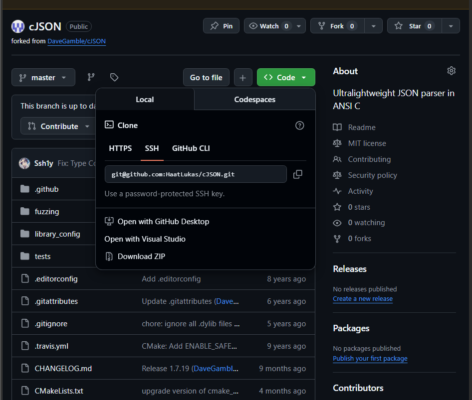
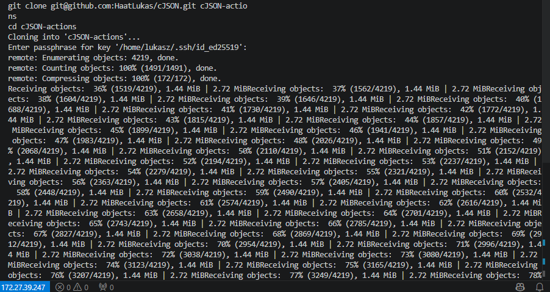
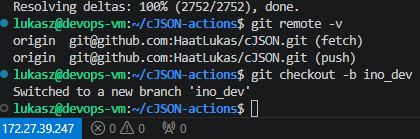
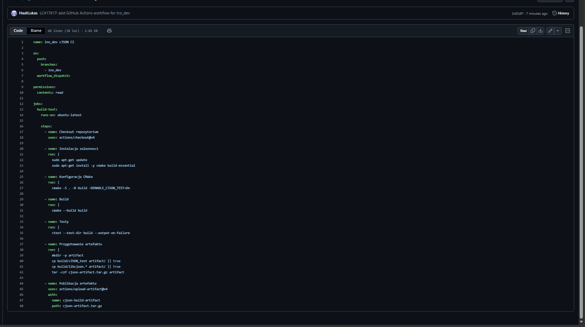
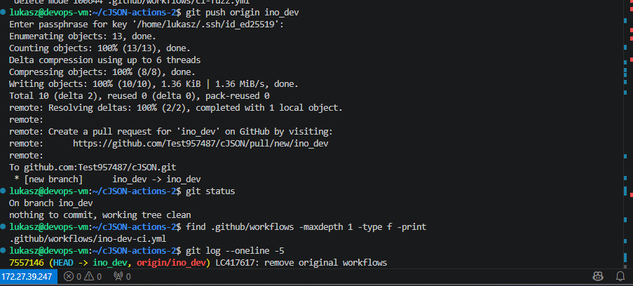
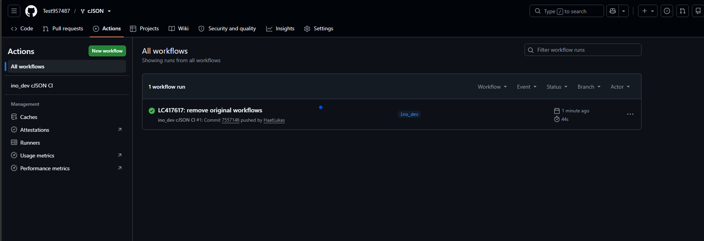
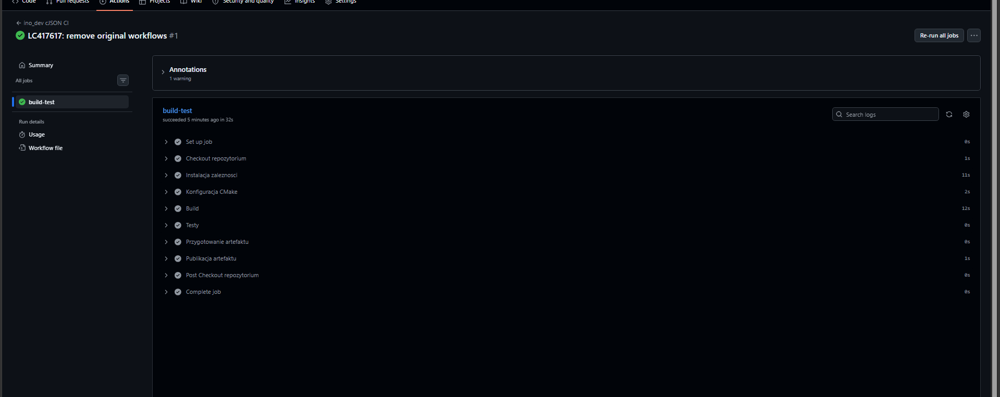
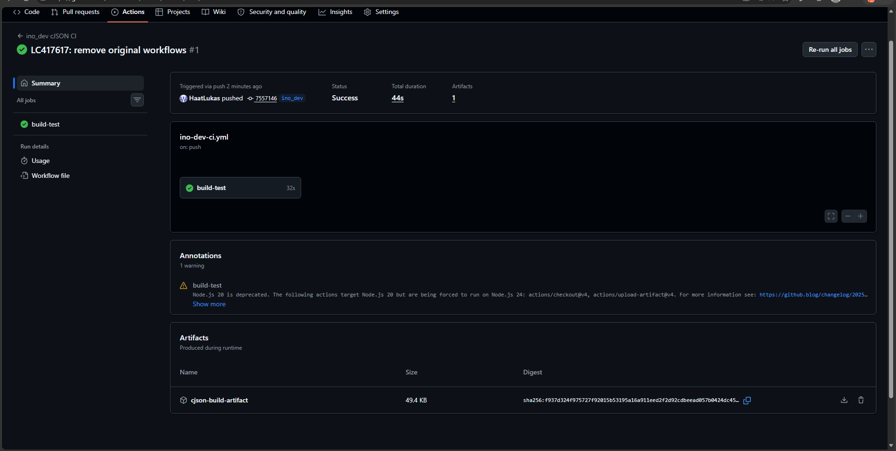

# Sprawozdanie 4 - Shift-left: GitHub Actions

## Zajęcia 12 - GitHub Actions

Celem zajęć było zapoznanie się z koncepcją GitHub Actions oraz przygotowanie prostego pipeline'u CI uruchamianego po zmianach na dedykowanej gałęzi `ino_dev`. W ramach zadania wykorzystano projekt `cJSON`, ponieważ jest to niewielki projekt w języku C, który można zbudować przy pomocy `cmake` i przetestować przez `ctest`.

---

### 1. Fork repozytorium

Na początku wykonano fork repozytorium `cJSON`. Dzięki temu wszystkie zmiany związane z GitHub Actions mogły zostać wykonane w osobnym repozytorium, bez ingerowania w główny projekt.

Pierwsza próba została wykonana na koncie `HaatLukas`, ale przez problem z billingiem GitHub Actions nie mogło uruchomić joba. Finalna weryfikacja została wykonana na forku `Test957487/cJSON`, gdzie workflow uruchomił się poprawnie.



---

### 2. Klonowanie forka na maszynę wirtualną

Repozytorium zostało sklonowane na maszynę wirtualną. Do pracy użyto osobnego katalogu, aby nie mieszać repozytorium `cJSON` z repozytorium przedmiotowym.

Przykładowe polecenia:

```bash
cd ~
git clone git@github.com:HaatLukas/cJSON.git cJSON-actions
cd cJSON-actions
```

W drugiej próbie wykorzystano osobny katalog:

```bash
cd ~
git clone git@github.com:Test957487/cJSON.git cJSON-actions-2
cd cJSON-actions-2
```



---

### 3. Utworzenie gałęzi `ino_dev`

Zgodnie z treścią zadania pipeline nie był dodawany do głównej gałęzi projektu. Utworzono dedykowaną gałąź:

```bash
git checkout -b ino_dev
```

Po utworzeniu gałęzi sprawdzono aktualną gałąź poleceniem:

```bash
git branch
```



---

### 4. Usunięcie oryginalnych workflowów

W projekcie znajdowały się już oryginalne workflowy w katalogu `.github/workflows`. Zgodnie z poleceniem zostały one usunięte, aby zostawić wyłącznie własny workflow przygotowany na potrzeby zajęć.

Usunięte pliki:

```text
.github/workflows/CI.yml
.github/workflows/ci-fuzz.yml
```

Po zmianach w katalogu `.github/workflows` pozostał tylko własny plik:

```text
.github/workflows/ino-dev-ci.yml
```

---

### 5. Przygotowanie workflow GitHub Actions

Utworzono workflow `ino_dev cJSON CI`, który reaguje na push do gałęzi `ino_dev` oraz pozwala na ręczne uruchomienie przez `workflow_dispatch`.

Najważniejszy fragment konfiguracji triggera:

```yaml
on:
  push:
    branches:
      - ino_dev
  workflow_dispatch:
```

Dzięki temu akcja nie uruchamia się na każdej gałęzi, tylko na zmianach dotyczących `ino_dev`.

Cały workflow wykonuje następujące kroki:

```text
Checkout repozytorium
Instalacja zależności
Konfiguracja CMake
Build
Testy
Przygotowanie artefaktu
Publikacja artefaktu
```



---

### 6. Commit i push do gałęzi `ino_dev`

Po przygotowaniu workflowa wykonano commit oraz push do zdalnej gałęzi `ino_dev`.

Wykonane polecenia:

```bash
git add .github/workflows/ino-dev-ci.yml INO_DEV_TEST.md
git commit -m "LC417617: add GitHub Actions workflow for ino_dev"
git push origin ino_dev
```

Następnie wykonano osobny commit usuwający oryginalne workflowy:

```bash
git add -u .github/workflows
git commit -m "LC417617: remove original workflows"
git push origin ino_dev
```

Push zakończył się poprawnie, a GitHub utworzył zdalną gałąź `ino_dev`.



---

### 7. Uruchomienie GitHub Actions

Po wykonaniu pusha GitHub Actions automatycznie uruchomiło workflow dla gałęzi `ino_dev`. W zakładce `Actions` widoczny był workflow:

```text
ino_dev cJSON CI
```

Workflow zakończył się statusem `Success`, co oznacza, że pipeline wykonał się poprawnie.



---

### 8. Build i testy w GitHub Actions

Po wejściu w job `build-test` widoczne były wszystkie kroki pipeline'u. Każdy z nich zakończył się poprawnie.

Wykonane kroki:

```text
Set up job
Checkout repozytorium
Instalacja zaleznosci
Konfiguracja CMake
Build
Testy
Przygotowanie artefaktu
Publikacja artefaktu
Complete job
```

Najważniejsze części pipeline'u to konfiguracja projektu przez CMake, zbudowanie projektu oraz uruchomienie testów przez `ctest`.



---

### 9. Publikacja artefaktu

W workflow dodano również publikację artefaktu przy pomocy akcji `actions/upload-artifact@v4`.

W pliku workflow przygotowanie artefaktu wyglądało następująco:

```yaml
- name: Przygotowanie artefaktu
  run: |
    mkdir -p artifact
    cp build/cJSON_test artifact/ || true
    cp build/libcjson.* artifact/ || true
    tar -czf cjson-artifact.tar.gz artifact

- name: Publikacja artefaktu
  uses: actions/upload-artifact@v4
  with:
    name: cjson-build-artifact
    path: cjson-artifact.tar.gz
```

Po zakończonym runie artefakt był widoczny w szczegółach workflowa jako:

```text
cjson-build-artifact
```



---

### 10. Problem z billingiem na pierwszym koncie

Podczas pierwszej próby uruchomienia GitHub Actions na koncie `HaatLukas` job nie wystartował, ponieważ GitHub zablokował uruchamianie akcji z powodu problemu billingowego. Sam workflow został poprawnie wykryty i uruchomiony przez trigger, ale job nie rozpoczął pracy.

Z tego powodu finalną weryfikację wykonano na drugim forku `Test957487/cJSON`, gdzie GitHub Actions uruchomiło się poprawnie i zakończyło statusem `Success`.

---

### 11. Wnioski

W ramach zajęć przygotowano prosty pipeline CI w GitHub Actions. Workflow został ograniczony do gałęzi `ino_dev`, dzięki czemu nie ingerował w główną gałąź projektu. Pipeline odtwarzał typową strukturę CI: pobranie kodu, instalację zależności, konfigurację projektu, build, testy oraz publikację artefaktu.

Zadanie pokazało również, że GitHub Actions zależy nie tylko od poprawnego pliku YAML, ale także od ustawień i stanu konta GitHub. W pierwszej próbie workflow był poprawnie wykrywany, jednak job był blokowany przez problem billingowy. Po wykonaniu zadania na drugim forku pipeline zakończył się sukcesem.

---

### 12. Użycie narzędzi Generatywnej AI

Podczas realizacji zadania skorzystano z pomocy LLM przy przygotowaniu workflowa, analizie błędów GitHuba oraz uporządkowaniu opisu do sprawozdania.

Przykładowe prompty:

```text
Jak stworzyć workflow GitHub Actions uruchamiany tylko dla gałęzi ino_dev?
```

```text
Jak zbudować projekt cJSON w GitHub Actions przy pomocy cmake i ctest?
```

```text
Jak ominąć błąd GitHub Actions: account is locked due to a billing issue?
```

```text
Jak dodać artefakt z buildu do GitHub Actions przez upload-artifact?
```

Odpowiedzi zostały zweryfikowane przez wykonanie workflowa na GitHubie i sprawdzenie wyniku w zakładce Actions.
